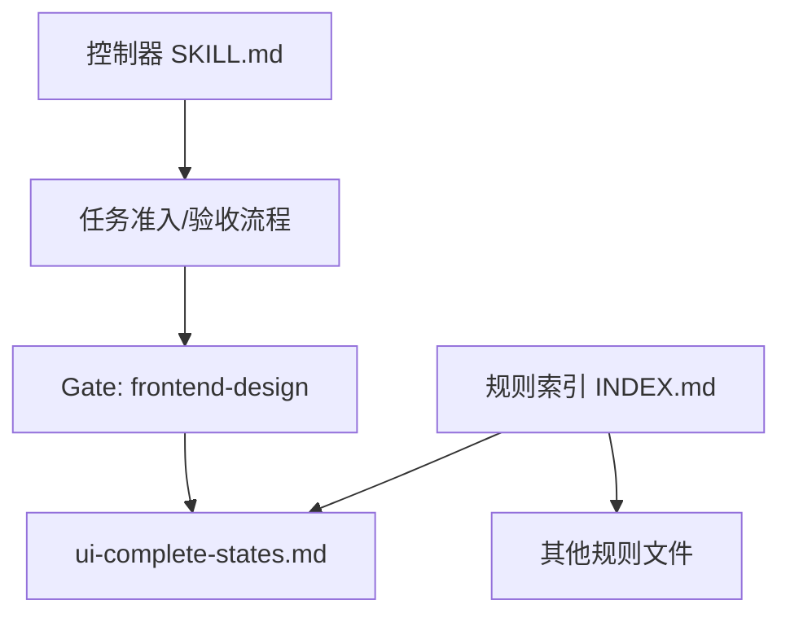
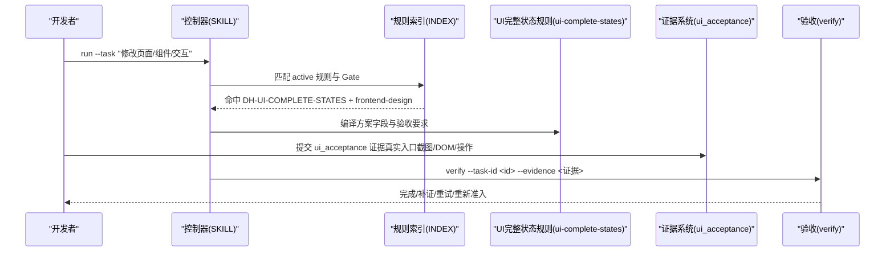
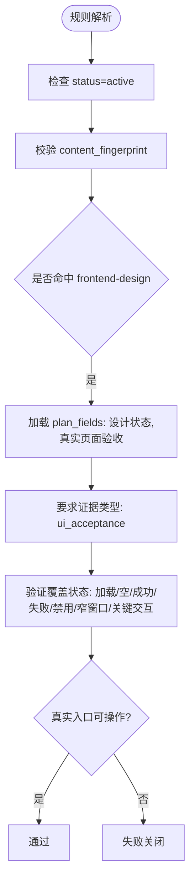
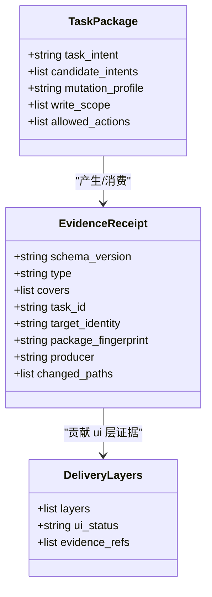
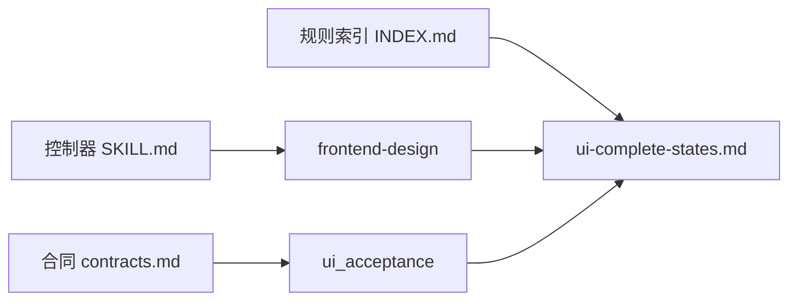

# UI状态完整性规则

<cite>
**本文引用的文件**   
- [harness-home/rules/ui-complete-states.md](file://harness-home/rules/ui-complete-states.md)
- [harness-home/rules/INDEX.md](file://harness-home/rules/INDEX.md)
- [SKILL.md](file://SKILL.md)
- [package.json](file://package.json)
- [docs/architecture.md](file://docs/architecture.md)
- [docs/contracts.md](file://docs/contracts.md)
- [tests/test_harness.py](file://tests/test_harness.py)
</cite>

## 目录
1. [引言](#引言)
2. [项目结构](#项目结构)
3. [核心组件](#核心组件)
4. [架构总览](#架构总览)
5. [详细组件分析](#详细组件分析)
6. [依赖关系分析](#依赖关系分析)
7. [性能与可维护性考虑](#性能与可维护性考虑)
8. [故障排查指南](#故障排查指南)
9. [结论](#结论)
10. [附录：框架集成与实践清单](#附录框架集成与实践清单)

## 引言
本文件围绕“UI 状态完整性规则”（规则 ID：DH-UI-COMPLETE-STATES）进行系统化说明，目标是确保用户界面在所有可能的状态下都具备完整的用户体验与错误处理。该规则适用于前端组件开发、用户交互逻辑实现以及状态管理变更等场景，要求覆盖加载、空、成功、失败、禁用、窄窗口及关键交互等状态，并强调从真实页面入口验收可见结果与关键操作。

## 项目结构
与 UI 状态完整性相关的规则位于受管规则目录中，由控制器在任务准入与验收阶段按 Gate 或关键词匹配激活。规则索引与生效规则列表集中管理，保证安装与升级时的一致性校验。

**图示来源** 
- [harness-home/rules/INDEX.md:1-41](file://harness-home/rules/INDEX.md#L1-L41)
- [SKILL.md:1-106](file://SKILL.md#L1-L106)

**章节来源**
- [harness-home/rules/INDEX.md:1-41](file://harness-home/rules/INDEX.md#L1-L41)
- [SKILL.md:1-106](file://SKILL.md#L1-L106)

## 核心组件
- 规则定义与元数据：包含状态、规则ID、指纹、Gate、关键词、方案字段、证据类型与失败模式。
- 适用条件：当任务改变页面、组件、视觉、交互、响应式布局或可访问性时触发。
- 必需方案字段：必须覆盖加载、空、成功、失败、禁用、窄窗口和关键交互状态，并说明真实入口。
- 验收条件：必须从真实页面入口验收可见结果和关键操作；截图、DOM 或单测仅证明各自层级。
- 失败处理方式：缺少完整状态、使用演示数据冒充真实链路或页面不可操作时，不得宣称完成。

**章节来源**
- [harness-home/rules/ui-complete-states.md:1-29](file://harness-home/rules/ui-complete-states.md#L1-L29)

## 架构总览
UI 状态完整性规则嵌入到 Docs Harness 的任务准入与验收流程中，通过 Gate “frontend-design” 与证据类型 “ui_acceptance” 联动，确保 UI 层交付物与真实页面入口一致，避免以演示数据或单一测试层级替代真实验收。

**图示来源** 
- [SKILL.md:1-106](file://SKILL.md#L1-L106)
- [harness-home/rules/INDEX.md:1-41](file://harness-home/rules/INDEX.md#L1-L41)
- [harness-home/rules/ui-complete-states.md:1-29](file://harness-home/rules/ui-complete-states.md#L1-L29)
- [docs/contracts.md:1-200](file://docs/contracts.md#L1-L200)

## 详细组件分析

### 规则结构与语义
- 状态与标识：status=active，rule_id=DH-UI-COMPLETE-STATES，content_fingerprint 用于一致性校验。
- Gate 与关键词：gates=frontend-design；keywords 涵盖 ui、界面、页面、组件、视觉、交互、frontend、swiftui。
- 方案字段：设计状态、真实页面验收。
- 证据类型：ui_acceptance。
- 失败模式：页面完整状态、真实数据或可操作性未验收时停止。

**图示来源** 
- [harness-home/rules/ui-complete-states.md:1-29](file://harness-home/rules/ui-complete-states.md#L1-L29)
- [harness-home/rules/INDEX.md:1-41](file://harness-home/rules/INDEX.md#L1-L41)

**章节来源**
- [harness-home/rules/ui-complete-states.md:1-29](file://harness-home/rules/ui-complete-states.md#L1-L29)

### 验收与证据链
- 证据类型：ui_acceptance 绑定 UI 层验收，需从真实页面入口获取截图、DOM 或可操作路径。
- 分层验收：截图、DOM、单测分别证明各自层级，不能互相替代。
- 完成清单：delivery_layers 包含 ui 层，需独立证据类型支撑，不得由 Git 后检统一推导。

**图示来源** 
- [docs/contracts.md:1-200](file://docs/contracts.md#L1-L200)

**章节来源**
- [docs/contracts.md:1-200](file://docs/contracts.md#L1-L200)

### 状态完整性检查内容
- 加载状态：网络请求、资源加载、骨架屏、超时与重试策略。
- 错误状态：异常捕获、降级提示、重试入口、日志上报。
- 空状态：无数据时的占位、引导文案、操作入口。
- 边界情况：超长文本、极端数值、多语言字符、权限不足。
- 异常处理：全局错误边界、组件级错误边界、用户友好提示。

这些检查需在真实页面入口验证，并通过 ui_acceptance 证据固化。

**章节来源**
- [harness-home/rules/ui-complete-states.md:1-29](file://harness-home/rules/ui-complete-states.md#L1-L29)

### 状态转换验证与一致性检查
- 状态转换：加载→成功/失败；成功→编辑/删除；失败→重试/回退；空→填充→成功。
- 一致性：跨组件状态同步、路由切换保持、缓存与本地存储一致性。
- 可访问性：键盘导航、屏幕阅读器、对比度与焦点管理。

建议在状态管理中引入有限状态机（FSM）或状态图，明确合法转换与守卫条件。

**章节来源**
- [harness-home/rules/ui-complete-states.md:1-29](file://harness-home/rules/ui-complete-states.md#L1-L29)

### 必需的状态定义与错误处理机制
- 状态枚举：LOADING、EMPTY、SUCCESS、ERROR、DISABLED 等。
- 错误分类：网络错误、业务错误、渲染错误、权限错误。
- 错误处理：统一错误边界、用户提示、重试与降级、监控上报。
- 状态持久化：本地存储、会话状态、路由参数映射。

**章节来源**
- [harness-home/rules/ui-complete-states.md:1-29](file://harness-home/rules/ui-complete-states.md#L1-L29)

### 最佳实践与设计模式
- 状态管理模式：Redux/Zustand（React）、Pinia/Vuex（Vue）、Context+Reducer。
- 错误边界：React Error Boundary、Vue errorCaptured。
- 异步状态：Promise/async-await 封装、取消令牌、防抖节流。
- 可观测性：埋点、日志、性能指标、错误追踪。

**章节来源**
- [harness-home/rules/ui-complete-states.md:1-29](file://harness-home/rules/ui-complete-states.md#L1-L29)

### 常见 UI 问题识别与解决方案
- 问题：加载态缺失导致白屏；错误态无提示；空态无引导；窄屏布局错乱；交互无反馈。
- 解决：统一状态容器、错误边界、空态模板、响应式断点、交互反馈（Toast/Spin）。

**章节来源**
- [harness-home/rules/ui-complete-states.md:1-29](file://harness-home/rules/ui-complete-states.md#L1-L29)

## 依赖关系分析
- 规则索引与生效规则：INDEX.md 声明 active_rules 与规则文件清单，确保安装与升级一致性。
- 控制器与 Gate：SKILL.md 描述任务准入、验收与证据体系，frontend-design Gate 驱动 UI 规则。
- 合同与证据：contracts.md 定义 task-package/v2、evidence-receipt/v2 与 delivery_layers，约束 UI 证据类型与层级。

**图示来源** 
- [harness-home/rules/INDEX.md:1-41](file://harness-home/rules/INDEX.md#L1-L41)
- [SKILL.md:1-106](file://SKILL.md#L1-L106)
- [docs/contracts.md:1-200](file://docs/contracts.md#L1-L200)

**章节来源**
- [harness-home/rules/INDEX.md:1-41](file://harness-home/rules/INDEX.md#L1-L41)
- [SKILL.md:1-106](file://SKILL.md#L1-L106)
- [docs/contracts.md:1-200](file://docs/contracts.md#L1-L200)

## 性能与可维护性考虑
- 状态计算优化：避免重渲染、使用选择器与 memoization。
- 错误处理开销：统一错误收集与上报，避免阻塞主线程。
- 证据生成成本：截图与 DOM 快照应缓存与增量更新。
- 规则升级：指纹校验与 preserve-and-merge 保证稳定性。

[本节为通用指导，不直接分析具体文件]

## 故障排查指南
- 规则缺失或指纹漂移：检查 .docs-harness/harness-home/rules 目录与 INDEX.md 一致性。
- 证据无效：确认 ui_acceptance 类型、任务绑定、生产者可信与时间戳有效。
- 验收失败：检查真实入口可操作、状态覆盖完整、截图/DOM 与当前版本一致。
- Gate 误判：核对任务文本与 scope，避免自然语言边界伪装成路径。

**章节来源**
- [tests/test_harness.py:339-354](file://tests/test_harness.py#L339-L354)
- [docs/contracts.md:1-200](file://docs/contracts.md#L1-L200)

## 结论
UI 状态完整性规则通过明确的适用条件、方案字段、验收条件与失败模式，确保前端界面在所有状态下提供一致的用户体验与错误处理。结合 Docs Harness 的 Gate、证据与验收体系，可在任务执行与收尾阶段严格把关 UI 交付质量。实践中建议采用状态机与错误边界模式，配合真实入口验收与分层证据，持续提升 UI 健壮性与可维护性。

[本节为总结性内容，不直接分析具体文件]

## 附录：框架集成与实践清单
- React
  - 状态管理：Redux Toolkit、Zustand、Context+useReducer
  - 错误边界：React Error Boundary
  - 异步状态：SWR、React Query、自定义 Hook
  - 测试：Jest + React Testing Library，DOM 快照与交互测试
- Vue
  - 状态管理：Pinia、Vuex
  - 错误处理：errorCaptured、全局错误处理器
  - 异步状态：Vuelidate、Axios 拦截器
  - 测试：Jest + Vue Test Utils，组件渲染与事件模拟
- 通用
  - 响应式：CSS Grid/Flexbox、媒体查询、移动端适配
  - 可访问性：ARIA、键盘导航、屏幕阅读器测试
  - 监控：Sentry、LogRocket、性能指标采集

[本节为概念性内容，不直接分析具体文件]