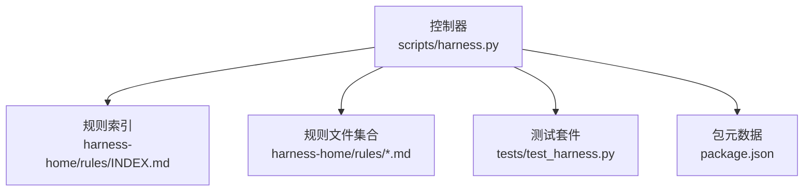
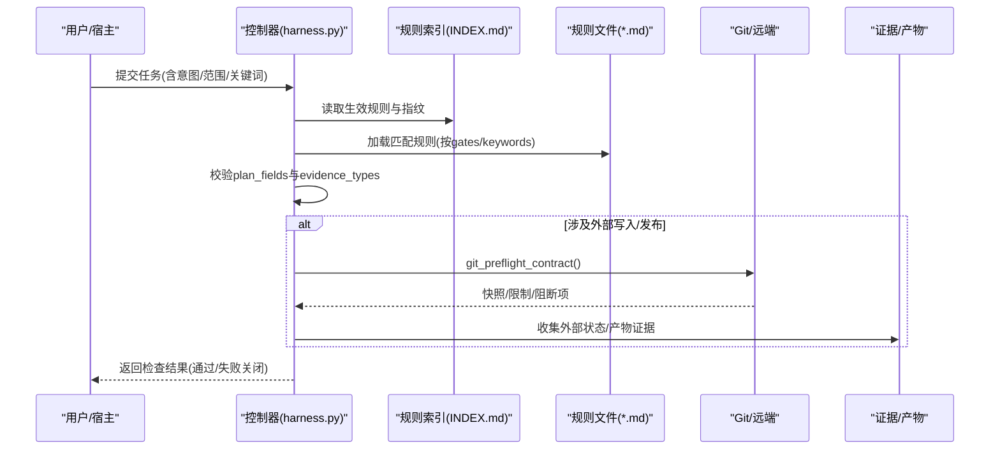
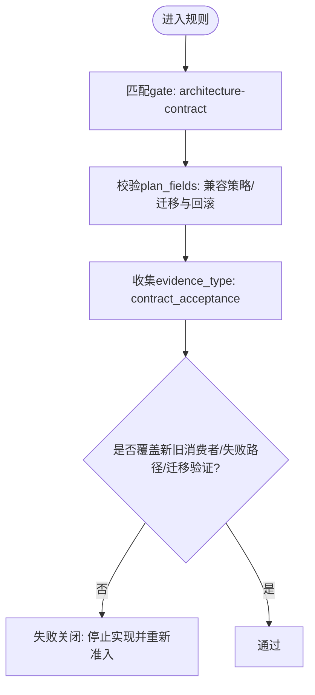
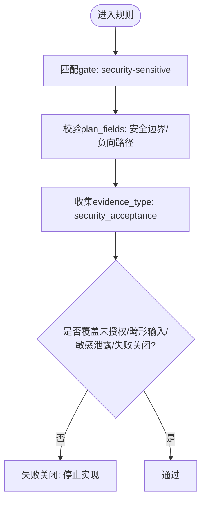
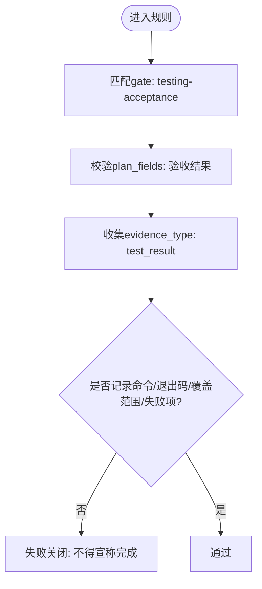
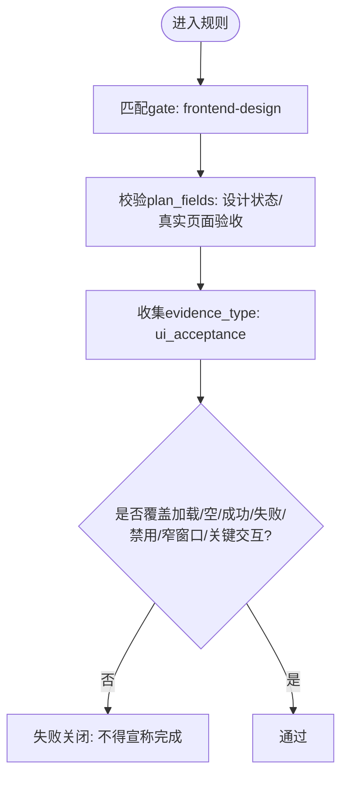
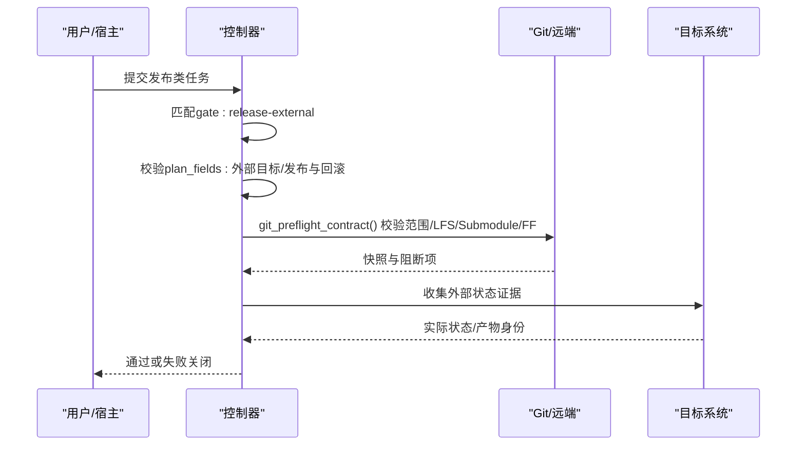
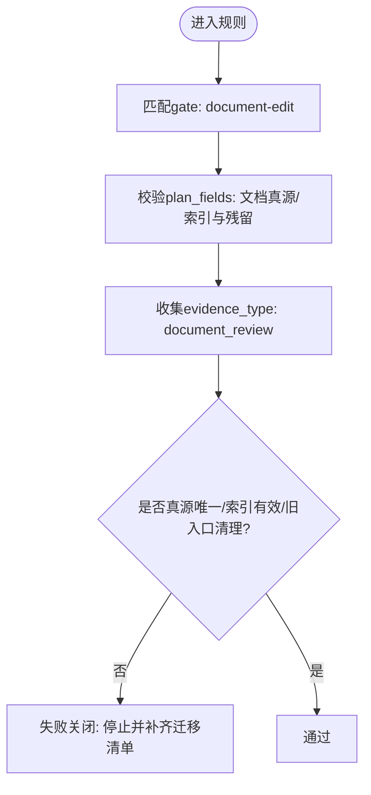
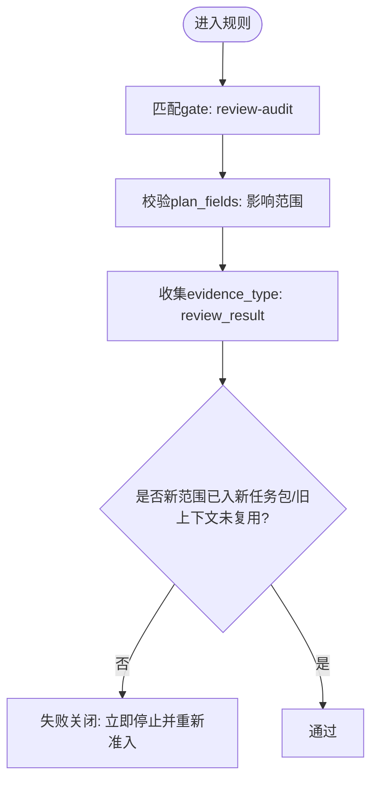
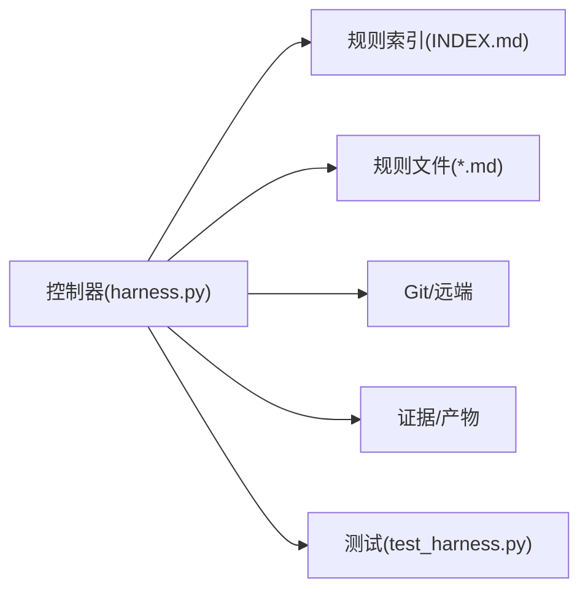

# 内置规则集

<cite>
**本文引用的文件**   
- [harness.py](file://scripts/harness.py)
- [INDEX.md](file://harness-home/rules/INDEX.md)
- [_rule-template.md](file://harness-home/rules/_rule-template.md)
- [api-compatibility.md](file://harness-home/rules/api-compatibility.md)
- [documentation-changes.md](file://harness-home/rules/documentation-changes.md)
- [external-input-security.md](file://harness-home/rules/external-input-security.md)
- [release-authorization-rollback.md](file://harness-home/rules/release-authorization-rollback.md)
- [scope-change-readmission.md](file://harness-home/rules/scope-change-readmission.md)
- [testing-release.md](file://harness-home/rules/testing-release.md)
- [ui-complete-states.md](file://harness-home/rules/ui-complete-states.md)
- [test_harness.py](file://tests/test_harness.py)
- [package.json](file://package.json)
</cite>

## 目录
1. [简介](#简介)
2. [项目结构](#项目结构)
3. [核心组件](#核心组件)
4. [架构总览](#架构总览)
5. [详细组件分析](#详细组件分析)
6. [依赖关系分析](#依赖关系分析)
7. [性能与可观测性](#性能与可观测性)
8. [故障排查指南](#故障排查指南)
9. [结论](#结论)
10. [附录：配置与参数调优](#附录配置与参数调优)

## 简介
本文件为 Docs Harness 内置规则集的权威文档，覆盖以下能力：
- API 兼容性检查
- 外部输入安全验证
- 测试覆盖度评估
- UI 状态完整性检查
- 发布授权与回滚保护
- 文档变更追踪
- 范围变更重新审核

每个规则均通过“Gate（门控）+ Keywords（关键词）”触发，要求方案字段完整、证据类型匹配，并在失败时采用“失败关闭”策略。控制器负责加载规则、校验指纹、匹配 Gate、执行检查并输出结果。

## 项目结构
- 规则定义位于 harness-home/rules，包含索引与每条规则的 Markdown 声明。
- 控制器脚本 scripts/harness.py 实现规则加载、匹配、执行与结果聚合。
- tests/test_harness.py 提供自测与契约校验，确保规则清单与激活状态一致。
- package.json 描述包元数据与脚本入口。

图表来源
- [harness.py:1892-1922](file://scripts/harness.py#L1892-L1922)
- [INDEX.md:1-41](file://harness-home/rules/INDEX.md#L1-L41)
- [test_harness.py:339-354](file://tests/test_harness.py#L339-L354)
- [package.json:1-23](file://package.json#L1-L23)

章节来源
- [harness.py:1892-1922](file://scripts/harness.py#L1892-L1922)
- [INDEX.md:1-41](file://harness-home/rules/INDEX.md#L1-L41)
- [test_harness.py:339-354](file://tests/test_harness.py#L339-L354)
- [package.json:1-23](file://package.json#L1-L23)

## 核心组件
- 规则索引 INDEX.md：声明当前快照的生效规则 ID 列表、规则文件清单、激活条件与加载约定。
- 规则模板 _rule-template.md：规定规则文件的 YAML front matter 字段与正文结构。
- 控制器 harness.py：
  - 规则根路径解析与便携安装路径计算
  - 规则指纹校验与一致性检查
  - Gate 词表与底线 Gate 强制策略
  - 任务意图识别与范围约束
  - 证据类型与高敏证据集合
  - Git 预检/后检、远端引用与 LFS/Submodule 可用性校验
  - 质量记录与审查上限控制
- 测试 test_harness.py：断言已分发规则均为 active、ID 唯一、指纹合法，并通过 self-test 校验控制器行为。

章节来源
- [INDEX.md:1-41](file://harness-home/rules/INDEX.md#L1-L41)
- [_rule-template.md:1-21](file://harness-home/rules/_rule-template.md#L1-L21)
- [harness.py:1892-1922](file://scripts/harness.py#L1892-L1922)
- [harness.py:260-342](file://scripts/harness.py#L260-L342)
- [harness.py:381-389](file://scripts/harness.py#L381-L389)
- [harness.py:197-230](file://scripts/harness.py#L197-L230)
- [harness.py:240-257](file://scripts/harness.py#L240-L257)
- [harness.py:546-791](file://scripts/harness.py#L546-L791)
- [harness.py:176-196](file://scripts/harness.py#L176-L196)
- [test_harness.py:339-354](file://tests/test_harness.py#L339-L354)

## 架构总览
规则执行的关键流程如下：
- 控制器根据任务意图与关键词匹配 Gate；
- 从 rules_root 加载 active_rules，校验 content_fingerprint；
- 对每个匹配规则执行检查，要求 plan_fields 完备、evidence_types 满足；
- 若涉及外部写入或发布，进行 Git 预检/后检与权限/目标冻结校验；
- 输出结构化结果，失败即关闭。

图表来源
- [harness.py:1892-1922](file://scripts/harness.py#L1892-L1922)
- [harness.py:260-342](file://scripts/harness.py#L260-L342)
- [harness.py:546-791](file://scripts/harness.py#L546-L791)
- [INDEX.md:1-41](file://harness-home/rules/INDEX.md#L1-L41)

## 详细组件分析

### API 兼容性检查（DH-API-COMPATIBILITY）
- 适用条件：修改 API、Schema、协议、持久化结构、跨模块公共契约或迁移路径。
- 触发方式：Gate=architecture-contract；Keywords=api,接口,schema,协议,数据库,迁移。
- 必需方案字段：兼容策略、迁移与回滚。
- 验收条件：契约验收证据需覆盖新旧消费者、失败路径与必要迁移验证。
- 失败处理：未声明消费者、实际范围扩大或回滚不可执行时停止并重新准入。

图表来源
- [api-compatibility.md:1-29](file://harness-home/rules/api-compatibility.md#L1-L29)
- [harness.py:260-342](file://scripts/harness.py#L260-L342)

章节来源
- [api-compatibility.md:1-29](file://harness-home/rules/api-compatibility.md#L1-L29)

### 外部输入安全验证（DH-EXTERNAL-INPUT-SECURITY）
- 适用条件：触及外部输入、鉴权、授权、秘密、隐私数据、文件解析或供应链边界。
- 触发方式：Gate=security-sensitive；Keywords=安全,鉴权,权限,密钥,隐私,security,auth,token。
- 必需方案字段：安全边界、负向路径。
- 验收条件：必须提供安全验收证据，覆盖未授权、畸形输入、敏感信息泄露与失败关闭行为。
- 失败处理：无法证明边界、数据去向或失败关闭时不得继续实现或降低保护。

图表来源
- [external-input-security.md:1-29](file://harness-home/rules/external-input-security.md#L1-L29)
- [harness.py:260-342](file://scripts/harness.py#L260-L342)

章节来源
- [external-input-security.md:1-29](file://harness-home/rules/external-input-security.md#L1-L29)

### 测试覆盖度评估（DH-TESTING-RELEASE）
- 适用条件：任务要求测试、回归、验收、构建放行或对完成状态作出判断。
- 触发方式：Gate=testing-acceptance；Keywords=测试,验收,回归,test,verify,acceptance。
- 必需方案字段：验收结果。
- 验收条件：记录实际执行命令、退出码、覆盖范围和失败项；目标涉及产物或真实流程时不得只用源码测试代替。
- 失败处理：测试未运行、证据过期、目标层级不匹配或存在未解释失败时不得宣称完成。

图表来源
- [testing-release.md:1-29](file://harness-home/rules/testing-release.md#L1-L29)
- [harness.py:260-342](file://scripts/harness.py#L260-L342)

章节来源
- [testing-release.md:1-29](file://harness-home/rules/testing-release.md#L1-L29)

### UI 状态完整性检查（DH-UI-COMPLETE-STATES）
- 适用条件：改变页面、组件、视觉、交互、响应式布局或可访问性。
- 触发方式：Gate=frontend-design；Keywords=ui,界面,页面,组件,视觉,交互,frontend,swiftui。
- 必需方案字段：设计状态、真实页面验收。
- 验收条件：必须从真实页面入口验收可见结果和关键操作；截图、DOM 或单测只证明各自层级。
- 失败处理：缺少完整状态、使用演示数据冒充真实链路或页面不可操作时不得宣称完成。

图表来源
- [ui-complete-states.md:1-29](file://harness-home/rules/ui-complete-states.md#L1-L29)
- [harness.py:260-342](file://scripts/harness.py#L260-L342)

章节来源
- [ui-complete-states.md:1-29](file://harness-home/rules/ui-complete-states.md#L1-L29)

### 发布授权与回滚保护（DH-RELEASE-AUTHORIZATION-ROLLBACK）
- 适用条件：准备推送、发布、部署、发送、上传或改变第三方外部状态。
- 触发方式：Gate=release-external；Keywords=发布,上线,部署,推送,发送,publish,deploy,release,push。
- 必需方案字段：外部目标、发布与回滚。
- 验收条件：必须以目标系统的实际状态证明结果；本地构建、测试或提交不能替代外部验收。
- 失败处理：授权不新鲜、目标不明确、产物无法唯一识别或不可回滚时停止在外部写入之前。

图表来源
- [release-authorization-rollback.md:1-29](file://harness-home/rules/release-authorization-rollback.md#L1-L29)
- [harness.py:546-791](file://scripts/harness.py#L546-L791)
- [harness.py:260-342](file://scripts/harness.py#L260-L342)

章节来源
- [release-authorization-rollback.md:1-29](file://harness-home/rules/release-authorization-rollback.md#L1-L29)

### 文档变更追踪（DH-DOCUMENTATION-CHANGES）
- 适用条件：新增、修改、迁移、重命名或删除项目文档及运行时入口。
- 触发方式：Gate=document-edit；Keywords=文档,说明,readme,markdown。
- 必需方案字段：文档真源、索引与残留。
- 验收条件：事实必须有当前证据，索引和链接有效，旧入口不再参与路由，并完成独立文档审查。
- 失败处理：事实无法确认、索引断链或新旧体系同时生效时停止并补齐迁移清单。

图表来源
- [documentation-changes.md:1-29](file://harness-home/rules/documentation-changes.md#L1-L29)
- [harness.py:260-342](file://scripts/harness.py#L260-L342)

章节来源
- [documentation-changes.md:1-29](file://harness-home/rules/documentation-changes.md#L1-L29)

### 范围变更重新审核（DH-SCOPE-CHANGE-READMISSION）
- 适用条件：任务明确讨论范围变化，或执行中发现实际改动超出已冻结范围。
- 触发方式：Gate=review-audit；Keywords=范围变化,范围变更,scope change,outside scope。
- 必需方案字段：影响范围。
- 验收条件：必须证明新范围已经进入新任务包版本，旧上下文、方案和证据没有被错误复用。
- 失败处理：任何未声明范围、目标或动作变化都立即停止，并从 run 入口重新准入。

图表来源
- [scope-change-readmission.md:1-29](file://harness-home/rules/scope-change-readmission.md#L1-L29)
- [harness.py:260-342](file://scripts/harness.py#L260-L342)

章节来源
- [scope-change-readmission.md:1-29](file://harness-home/rules/scope-change-readmission.md#L1-L29)

## 依赖关系分析
- 控制器与规则索引：通过 rules_root_for、installed_rule_names、load_active_rules 等函数定位并加载规则。
- 规则与 Gate：每条规则声明 gates 与 keywords，控制器依据 GATE_DEFS 与 FLOOR_TERMS 进行匹配与底线强化。
- 证据与高敏类型：HIGH_RISK_EVIDENCE_TYPES 用于标记高风险证据类型，配合 TRUSTED_EVIDENCE_PRODUCERS 进行可信来源校验。
- Git 集成：git_preflight_contract 与 git_postcheck 保障同步/拉取的安全性与一致性。

图表来源
- [harness.py:1892-1922](file://scripts/harness.py#L1892-L1922)
- [harness.py:260-342](file://scripts/harness.py#L260-L342)
- [harness.py:240-257](file://scripts/harness.py#L240-L257)
- [harness.py:546-791](file://scripts/harness.py#L546-L791)
- [test_harness.py:339-354](file://tests/test_harness.py#L339-L354)

章节来源
- [harness.py:1892-1922](file://scripts/harness.py#L1892-L1922)
- [harness.py:260-342](file://scripts/harness.py#L260-L342)
- [harness.py:240-257](file://scripts/harness.py#L240-L257)
- [harness.py:546-791](file://scripts/harness.py#L546-L791)
- [test_harness.py:339-354](file://tests/test_harness.py#L339-L354)

## 性能与可观测性
- 规则加载与指纹校验：通过 file_fingerprint 与内容指纹比对，避免重复解析与篡改风险。
- Git 预检优化：一次性生成快照、检测 LFS/Submodule 可用性与删除阈值，减少后续失败重试成本。
- 质量记录限流：QUALITY_REVIEW_* 常量限制文本大小与扫描条目，防止大对象阻塞。
- 事件与证据：append_jsonl/read_jsonl 保证追加写与行级 JSON 的可观测性。

[本节为通用指导，不直接分析具体文件]

## 故障排查指南
- 规则缺失或指纹不一致：检查 rules_root 是否存在、INDEX.md 与 *.md 指纹是否匹配；必要时通过升级来源包或人工 preserve-and-merge。
- Gate 未命中：核对任务关键词与 GATE_DEFS/FLOOR_TERMS 是否覆盖；注意否定标记 NEGATION_MARKERS 可能抑制误报。
- 证据不足：确认 evidence_types 与 HIGH_RISK_EVIDENCE_TYPES 对应；确保 producer 属于 TRUSTED_EVIDENCE_PRODUCERS。
- Git 同步失败：查看 git_preflight_contract 返回的 blockers（如脏工作区、删除过多、非 FF、LFS/Submodule 不可用）。
- 发布失败：确认外部目标、产物身份与回滚路径是否被真实状态证明。

章节来源
- [INDEX.md:1-41](file://harness-home/rules/INDEX.md#L1-L41)
- [harness.py:260-342](file://scripts/harness.py#L260-L342)
- [harness.py:381-389](file://scripts/harness.py#L381-L389)
- [harness.py:240-257](file://scripts/harness.py#L240-L257)
- [harness.py:546-791](file://scripts/harness.py#L546-L791)

## 结论
内置规则集以“Gate + Keywords”驱动，结合严格的 plan_fields/evidence_types 校验与失败关闭策略，确保 API 兼容性、外部输入安全、测试覆盖、UI 完整性、发布授权与回滚、文档变更与范围变更得到系统化治理。控制器通过指纹校验与 Git 预检/后检提升鲁棒性与可观测性，测试套件保障契约稳定。

[本节为总结，不直接分析具体文件]

## 附录：配置与参数调优
- 规则根路径：rules_root 指向 .docs-harness/harness-home/rules；安装后不可依赖绝对路径。
- 知识地图：docs/knowledge-map.json 约束功能知识；clone_ready 仅在 HEAD 包含完整安装清单时启用。
- Gate 与底线：SAFETY_FLOOR_GATES 强制安全/破坏性/发布类 Gate 不可被宽泛词表覆盖；NEGATION_MARKERS 抑制误报。
- 证据与审计：QUALITY_REVIEW_* 限制质量记录大小；TRUSTED_EVIDENCE_PRODUCERS 限定可信来源。
- Git 限制：GIT_DELETION_THRESHOLD 控制删除数量；DELIVERY_LAYER_ORDER 定义交付层顺序与限制代码映射。

章节来源
- [INDEX.md:1-41](file://harness-home/rules/INDEX.md#L1-L41)
- [harness.py:176-196](file://scripts/harness.py#L176-L196)
- [harness.py:240-257](file://scripts/harness.py#L240-L257)
- [harness.py:381-389](file://scripts/harness.py#L381-L389)
- [harness.py:143-175](file://scripts/harness.py#L143-L175)