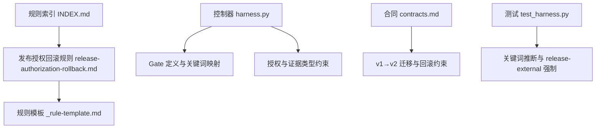
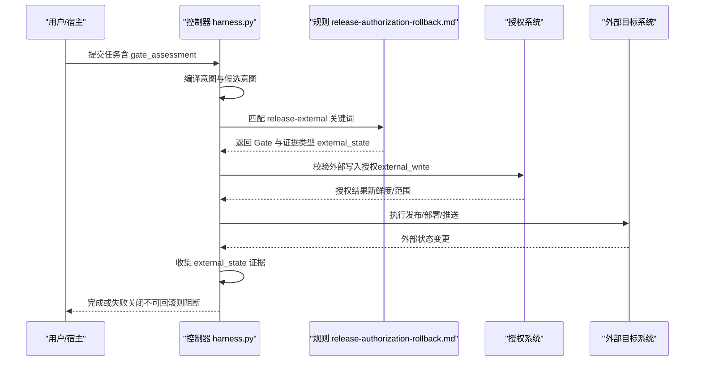
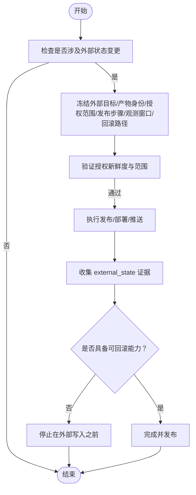
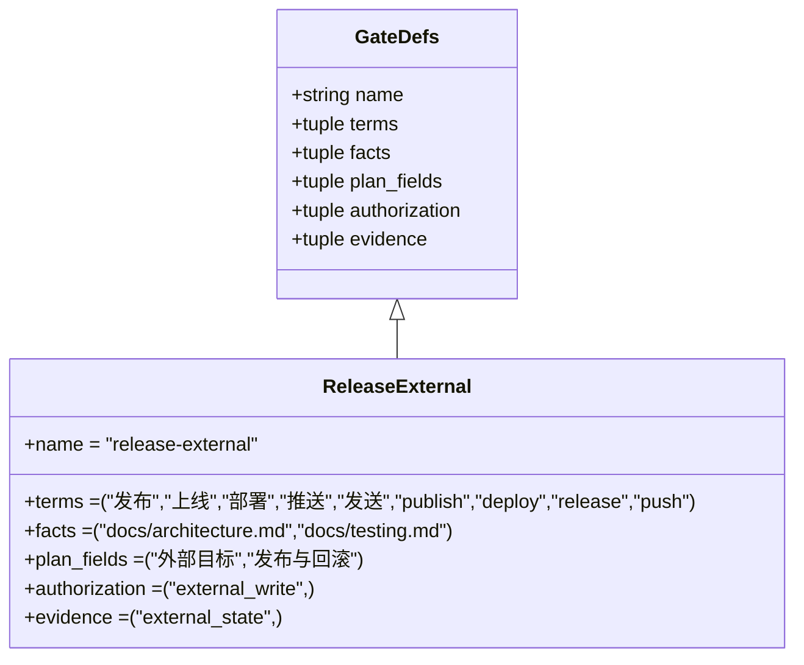
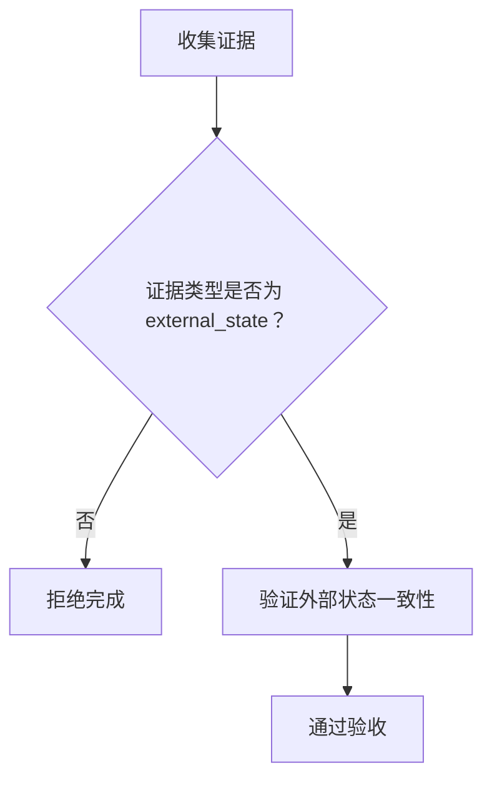
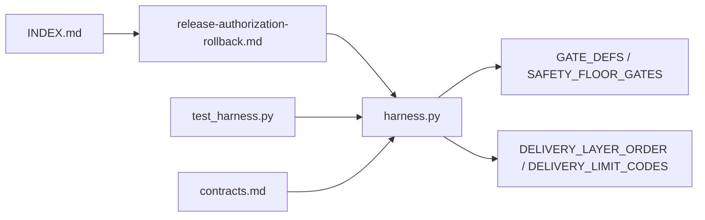

# 发布授权回滚规则

<cite>
**本文引用的文件**   
- [release-authorization-rollback.md](file://harness-home/rules/release-authorization-rollback.md)
- [INDEX.md](file://harness-home/rules/INDEX.md)
- [_rule-template.md](file://harness-home/rules/_rule-template.md)
- [testing-release.md](file://harness-home/rules/testing-release.md)
- [SKILL.md](file://SKILL.md)
- [architecture.md](file://docs/architecture.md)
- [contracts.md](file://docs/contracts.md)
- [harness.py](file://scripts/harness.py)
- [test_harness.py](file://tests/test_harness.py)
</cite>

## 目录
1. [引言](#引言)
2. [项目结构](#项目结构)
3. [核心组件](#核心组件)
4. [架构总览](#架构总览)
5. [详细组件分析](#详细组件分析)
6. [依赖关系分析](#依赖关系分析)
7. [性能考虑](#性能考虑)
8. [故障排查指南](#故障排查指南)
9. [结论](#结论)
10. [附录](#附录)

## 引言
本文件为“发布授权回滚规则”的权威说明，面向生产环境发布、重要配置变更与数据迁移等高风险操作，明确授权控制与可靠回滚的设计要求。规则通过 Gate 机制强制安全底线（如 release-external），结合方案冻结、证据验收与失败关闭策略，确保发布流程具备可审计、可验证、可回滚的能力。

## 项目结构
与发布授权回滚相关的受管规则位于 harness-home/rules 目录，索引与模板用于约束规则形态与激活条件；控制器脚本负责 Gate 判定、授权与证据校验；合同文档定义迁移与回滚边界；测试用例覆盖关键词推断与 Gate 强制行为。

**图表来源** 
- [INDEX.md:1-41](file://harness-home/rules/INDEX.md#L1-L41)
- [release-authorization-rollback.md:1-29](file://harness-home/rules/release-authorization-rollback.md#L1-L29)
- [_rule-template.md:1-21](file://harness-home/rules/_rule-template.md#L1-L21)
- [harness.py:260-459](file://scripts/harness.py#L260-L459)
- [contracts.md:236-249](file://docs/contracts.md#L236-L249)
- [test_harness.py:39-44](file://tests/test_harness.py#L39-L44)

**章节来源**
- [INDEX.md:1-41](file://harness-home/rules/INDEX.md#L1-L41)
- [release-authorization-rollback.md:1-29](file://harness-home/rules/release-authorization-rollback.md#L1-L29)
- [_rule-template.md:1-21](file://harness-home/rules/_rule-template.md#L1-L21)

## 核心组件
- 规则本体：定义适用条件、必需方案字段、验收条件与失败处理方式，强调外部状态证明与不可回滚即停止。
- Gate 机制：release-external 作为安全底线 Gate，匹配发布/部署/推送等关键词，并强制外部写入授权与外部状态证据。
- 证据体系：以 external_state 作为关键证据类型，要求真实目标系统状态而非本地构建或测试替代。
- 失败关闭：当授权不新鲜、目标不明确、产物无法唯一识别或不可回滚时，在外部写入前阻断。

**章节来源**
- [release-authorization-rollback.md:1-29](file://harness-home/rules/release-authorization-rollback.md#L1-L29)
- [harness.py:302-308](file://scripts/harness.py#L302-L308)
- [harness.py:385-391](file://scripts/harness.py#L385-L391)

## 架构总览
下图展示从任务意图到 Gate 判定、授权与证据校验，再到发布执行与回滚保障的整体流程。

**图表来源** 
- [harness.py:260-459](file://scripts/harness.py#L260-L459)
- [release-authorization-rollback.md:1-29](file://harness-home/rules/release-authorization-rollback.md#L1-L29)

## 详细组件分析

### 规则：发布授权回滚
- 适用条件：涉及第三方外部状态改变的任务（推送、发布、部署、发送、上传）。
- 必需方案字段：外部目标、发布与回滚路径必须冻结，观测窗口需明确。
- 验收条件：必须以目标系统的实际状态证明结果，禁止用本地构建或测试替代。
- 失败处理：授权不新鲜、目标不明确、产物无法唯一识别或不可回滚时，停止在外部写入之前。

**图表来源** 
- [release-authorization-rollback.md:1-29](file://harness-home/rules/release-authorization-rollback.md#L1-L29)

**章节来源**
- [release-authorization-rollback.md:1-29](file://harness-home/rules/release-authorization-rollback.md#L1-L29)

### Gate：release-external 与安全底线
- Gate 定义：包含“发布、上线、部署、推送、发送、publish、deploy、release、push”等关键词。
- 安全底线：release-external 属于 SAFETY_FLOOR_GATES，不可被宽泛关键词叠加或豁免。
- 证据类型：external_state，要求真实外部状态证据。
- 授权类型：external_write，要求外部写入权限。

**图表来源** 
- [harness.py:302-308](file://scripts/harness.py#L302-L308)
- [harness.py:385-391](file://scripts/harness.py#L385-L391)

**章节来源**
- [harness.py:302-308](file://scripts/harness.py#L302-L308)
- [harness.py:385-391](file://scripts/harness.py#L385-L391)

### 证据与验收：external_state
- 证据类型：external_state，要求目标系统实际状态证明。
- 验收层级：按交付层顺序（源码、本地验证、Git HEAD、远端交付、fresh clone、发布产物、UI、外部状态），external_state 处于最高层。
- 失败关闭：未满足 external_state 证据将被拒绝完成。

**图表来源** 
- [harness.py:146-178](file://scripts/harness.py#L146-L178)

**章节来源**
- [harness.py:146-178](file://scripts/harness.py#L146-L178)

### 测试与放行：DH-TESTING-RELEASE
- 适用条件：测试、回归、验收、构建放行或对完成状态作出判断。
- 必需方案字段：区分静态检查、源码测试、运行时验证、产物验证与真实产品验收。
- 验收条件：记录实际执行命令、退出码、覆盖范围和失败项；不得用源码测试代替产物或真实流程验收。
- 失败处理：测试未运行、证据过期、目标层级不匹配或未解释失败时，不得宣称完成。

**章节来源**
- [testing-release.md:1-29](file://harness-home/rules/testing-release.md#L1-L29)

### 控制器与关键词推断
- 关键词推断：release-external 由精确词表触发，否定标记（如“不要”“无需”）可修剪误报。
- 强制底线：SAFETY_FLOOR_GATES 中的 release-external 不可被宿主声明移除，漏判会被强制并入。
- 测试覆盖：测试用例验证关键词推断与 floor_added 强制行为。

**章节来源**
- [harness.py:385-391](file://scripts/harness.py#L385-L391)
- [test_harness.py:5667-5668](file://tests/test_harness.py#L5667-L5668)
- [test_harness.py:5760-5761](file://tests/test_harness.py#L5760-L5761)

### 迁移与回滚约束
- v1→v2 迁移：创建 staging、全对象 backup、manifest 与 journal，任一步中断按备份回滚；旧 evidence 只读保留。
- 回滚窗口：存在活动 v2 任务时禁止回滚；回滚后 v2 对象只读保留，旧控制器遇到 v2 对象失败关闭。
- 主任务与后台治理：verify 先原子写入父任务 complete，再消费 background_deliverables；后台失败不回滚父任务。

**章节来源**
- [contracts.md:236-249](file://docs/contracts.md#L236-L249)
- [contracts.md:305](file://docs/contracts.md#L305)

## 依赖关系分析
- 规则与索引：INDEX.md 声明 active_rules 与规则文件清单，确保安装快照一致性与指纹校验。
- 控制器与 Gate：harness.py 定义 GATE_DEFS、FLOOR_TERMS、SAFETY_FLOOR_GATES，驱动 Gate 判定与授权需求。
- 证据与验收：DELIVERY_LAYER_ORDER 与 DELIVERY_LIMIT_CODES 约束证据层级与失败原因。
- 测试与断言：test_harness.py 验证规则激活、关键词推断与 Gate 强制行为。

**图表来源** 
- [INDEX.md:1-41](file://harness-home/rules/INDEX.md#L1-L41)
- [harness.py:260-459](file://scripts/harness.py#L260-L459)
- [contracts.md:236-249](file://docs/contracts.md#L236-L249)
- [test_harness.py:39-44](file://tests/test_harness.py#L39-L44)

**章节来源**
- [INDEX.md:1-41](file://harness-home/rules/INDEX.md#L1-L41)
- [harness.py:260-459](file://scripts/harness.py#L260-L459)
- [contracts.md:236-249](file://docs/contracts.md#L236-L249)
- [test_harness.py:39-44](file://tests/test_harness.py#L39-L44)

## 性能考虑
- 证据复用：同一 compiler_contract 与 content_set_fingerprint 下可复用上下文与证据，减少重复执行。
- 失败快速关闭：在外部写入前进行授权与回滚能力检查，避免无效执行。
- 分层验收：按交付层顺序逐步验证，优先低成本层（源码、本地验证）尽早发现问题。

[本节为通用指导，不直接分析具体文件]

## 故障排查指南
- 常见失败原因：
  - 授权不新鲜或范围不足：检查 external_write 授权与时效。
  - 目标不明确或产物无法唯一识别：确认外部目标与产物身份冻结。
  - 不可回滚：确保回滚路径与数据备份完备。
  - 外部状态证据缺失：收集 external_state 证据，避免仅凭本地构建或测试。
- 定位方法：
  - 查看 Gate 判定日志与 reason_code。
  - 核对 DELIVERY_LIMIT_DETAILS 中对应层的失败详情。
  - 使用 project check 自检规则完整性与指纹一致性。

**章节来源**
- [release-authorization-rollback.md:1-29](file://harness-home/rules/release-authorization-rollback.md#L1-L29)
- [harness.py:146-178](file://scripts/harness.py#L146-L178)

## 结论
发布授权回滚规则通过严格的 Gate 机制、外部状态证据与失败关闭策略，确保生产环境发布、重要配置变更与数据迁移操作具备可靠的授权控制与回滚能力。实施时应遵循方案冻结、证据验收与回滚设计，结合自动化配置与监控告警，实现多环境发布的风险控制与最佳实践。

[本节为总结性内容，不直接分析具体文件]

## 附录

### 发布前安全检查清单
- 外部目标与产物身份已冻结且可唯一识别。
- 授权范围与新鲜度满足 external_write 要求。
- 回滚路径与数据备份完备，具备事务管理与状态恢复能力。
- 观测窗口与回滚窗口明确，监控与告警就绪。
- 测试与验收证据完整，包括 external_state。

[本节为通用指导，不直接分析具体文件]

### 风险评估流程
- 基于任务文本与 scope 推断 Gate，命中 release-external 即进入高风险流程。
- 评估影响范围、依赖关系与回滚复杂度。
- 制定回滚脚本与演练计划，确保可验证。

[本节为通用指导，不直接分析具体文件]

### 回滚脚本编写规范与测试要求
- 规范：
  - 明确回滚目标、数据备份点与事务边界。
  - 支持幂等执行与部分回滚恢复。
  - 输出结构化日志与证据，便于审计。
- 测试：
  - 模拟故障场景，验证回滚路径有效性。
  - 覆盖异常分支与边界条件。
  - 与外部状态证据对齐，确保回滚后可恢复至预期状态。

[本节为通用指导，不直接分析具体文件]

### 自动化配置与监控告警
- 自动化：
  - 集成 CI/CD 流水线，自动执行 Gate 判定与证据收集。
  - 冻结方案与回滚路径，防止中途变更。
- 监控告警：
  - 对发布过程关键指标（成功率、延迟、错误率）设置阈值告警。
  - 对外部状态变更与回滚事件进行审计追踪。

[本节为通用指导，不直接分析具体文件]

### 多环境发布最佳实践与风险控制
- 分阶段发布：灰度、金丝雀、全量逐步推进。
- 环境隔离：严格区分开发、测试、预发与生产环境。
- 风险控制：启用熔断、降级与快速回滚策略，确保业务连续性。

[本节为通用指导，不直接分析具体文件]