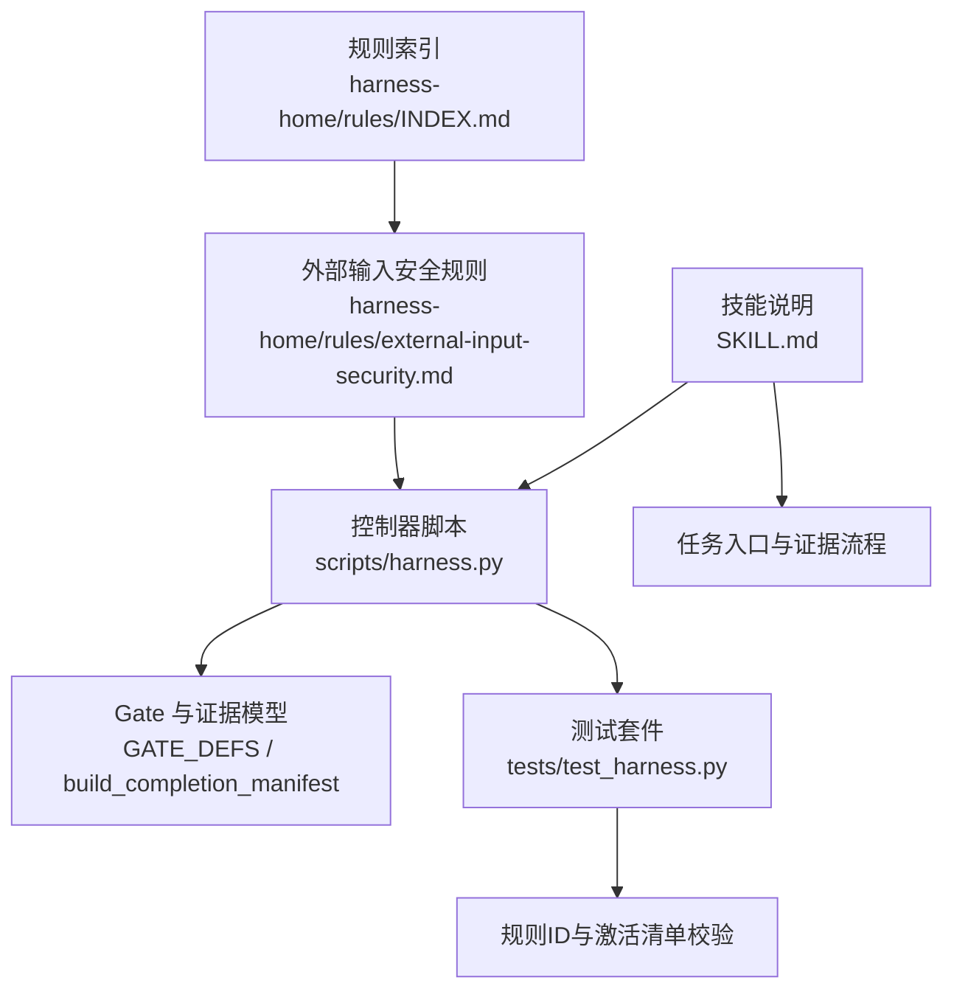
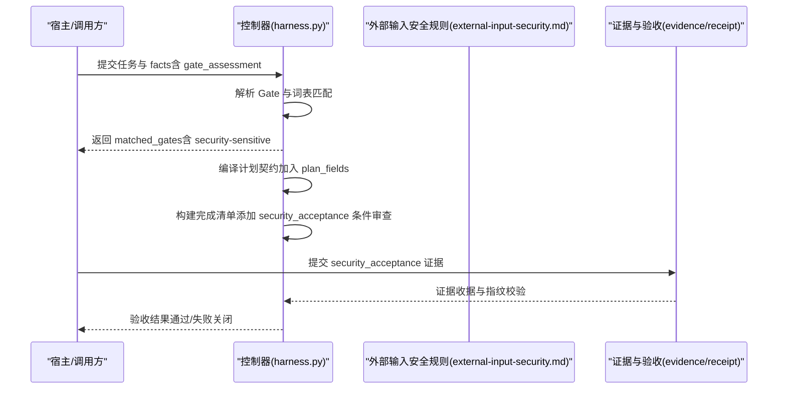
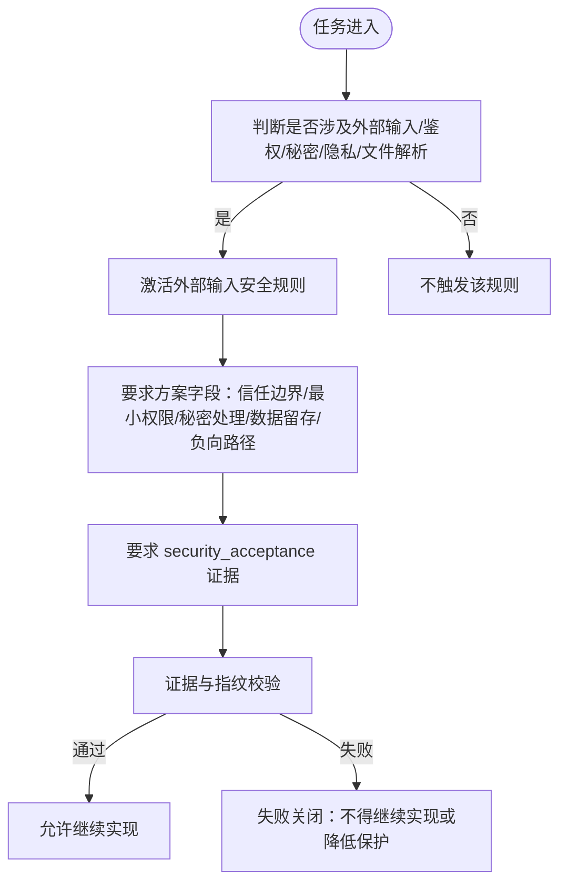
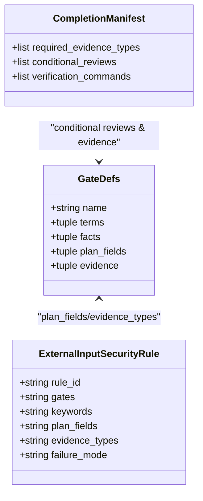
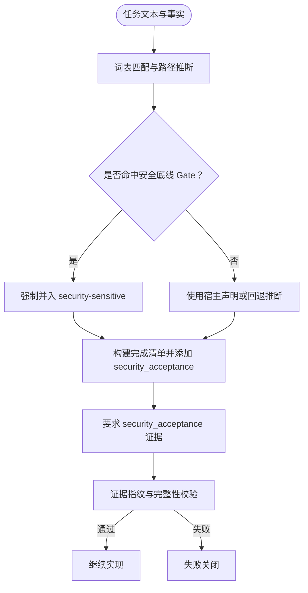
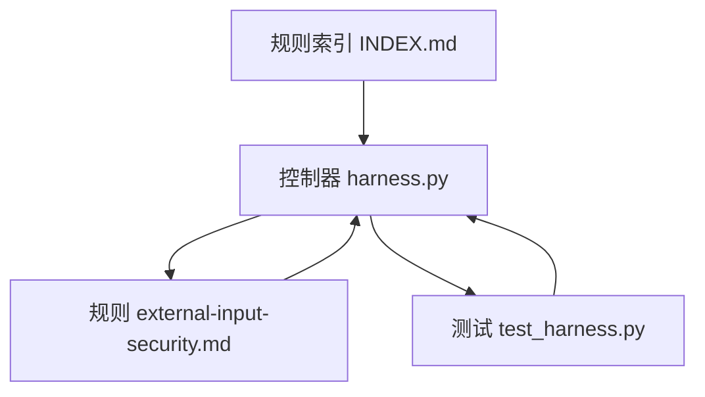

# 外部输入安全规则

<cite>
**本文引用的文件**   
- [external-input-security.md](file://harness-home/rules/external-input-security.md)
- [INDEX.md](file://harness-home/rules/INDEX.md)
- [_rule-template.md](file://harness-home/rules/_rule-template.md)
- [SKILL.md](file://SKILL.md)
- [harness.py](file://scripts/harness.py)
- [test_harness.py](file://tests/test_harness.py)
</cite>

## 目录
1. [简介](#简介)
2. [项目结构](#项目结构)
3. [核心组件](#核心组件)
4. [架构总览](#架构总览)
5. [详细组件分析](#详细组件分析)
6. [依赖关系分析](#依赖关系分析)
7. [性能与可扩展性](#性能与可扩展性)
8. [故障排查指南](#故障排查指南)
9. [结论](#结论)
10. [附录](#附录)

## 简介
本文件为“外部输入安全规则”的权威文档，面向所有处理用户输入、API 请求参数、文件上传、消息队列数据等外部数据源的场景。该规则用于强制在任务准入、方案字段、证据与验收环节落实输入安全边界，防止注入攻击、数据污染和恶意输入，确保失败路径与最小权限策略得到验证与审计。

## 项目结构
- 规则定义位于 harness-home/rules 目录，外部输入安全规则以 Markdown 形式声明元数据与约束。
- 控制器脚本 scripts/harness.py 负责 Gate 判定、计划契约编译、证据类型与条件审查生成、以及失败关闭策略执行。
- 测试用例 tests/test_harness.py 对规则 ID、激活清单与安全相关 Gate 行为进行断言。
- SKILL.md 提供任务入口、证据与验收流程、以及 Gate 声明与底线保障的总体说明。

**图表来源** 
- [INDEX.md:1-41](file://harness-home/rules/INDEX.md#L1-L41)
- [external-input-security.md:1-29](file://harness-home/rules/external-input-security.md#L1-L29)
- [harness.py:260-459](file://scripts/harness.py#L260-L459)
- [test_harness.py:1-200](file://tests/test_harness.py#L1-L200)
- [SKILL.md:1-105](file://SKILL.md#L1-L105)

**章节来源**
- [INDEX.md:1-41](file://harness-home/rules/INDEX.md#L1-L41)
- [external-input-security.md:1-29](file://harness-home/rules/external-input-security.md#L1-L29)
- [harness.py:260-459](file://scripts/harness.py#L260-L459)
- [test_harness.py:1-200](file://tests/test_harness.py#L1-L200)
- [SKILL.md:1-105](file://SKILL.md#L1-L105)

## 核心组件
- 规则元数据与约束：包含状态、规则 ID、指纹、Gate、关键词、方案字段、证据类型与失败模式。
- Gate 体系：security-sensitive 作为安全底线 Gate，强制要求安全边界与负向路径的证据。
- 计划契约与证据：当 security-sensitive 激活时，自动引入 security_acceptance 证据类型与条件审查。
- 失败关闭：无法证明边界、数据去向或失败关闭时，不得继续实现或降低保护。

**章节来源**
- [external-input-security.md:1-29](file://harness-home/rules/external-input-security.md#L1-L29)
- [harness.py:260-459](file://scripts/harness.py#L260-L459)
- [harness.py:2500-2699](file://scripts/harness.py#L2500-L2699)
- [test_harness.py:1-200](file://tests/test_harness.py#L1-L200)

## 架构总览
外部输入安全规则通过控制器 Gate 机制与证据系统联动，形成“触发—约束—证据—验收—失败关闭”的闭环。

**图表来源** 
- [harness.py:2500-2699](file://scripts/harness.py#L2500-L2699)
- [external-input-security.md:1-29](file://harness-home/rules/external-input-security.md#L1-L29)
- [SKILL.md:1-105](file://SKILL.md#L1-L105)

## 详细组件分析

### 规则定义与生效范围
- 适用条件：触及外部输入、鉴权、授权、秘密、隐私数据、文件解析或供应链边界时生效。
- 必需方案字段：信任边界、最小权限、秘密处理、数据留存、负向路径。
- 验收条件：必须提供安全验收证据，覆盖未授权、畸形输入、敏感信息泄露与失败关闭行为。
- 失败处理方式：无法证明边界、数据去向或失败关闭时，不得继续实现或降低保护。

**图表来源** 
- [external-input-security.md:1-29](file://harness-home/rules/external-input-security.md#L1-L29)

**章节来源**
- [external-input-security.md:1-29](file://harness-home/rules/external-input-security.md#L1-L29)

### Gate 与证据联动
- security-sensitive Gate 由控制器基于词表与路径推断，且存在安全底线集合不可被宿主减少。
- 当 security-sensitive 激活时，完成清单自动引入 security_acceptance 证据类型与条件审查。
- 测试用例断言了 Gate 命中与证据类型增加的行为。

**图表来源** 
- [harness.py:260-459](file://scripts/harness.py#L260-L459)
- [harness.py:2500-2699](file://scripts/harness.py#L2500-L2699)
- [external-input-security.md:1-29](file://harness-home/rules/external-input-security.md#L1-L29)

**章节来源**
- [harness.py:260-459](file://scripts/harness.py#L260-L459)
- [harness.py:2500-2699](file://scripts/harness.py#L2500-L2699)
- [test_harness.py:1-200](file://tests/test_harness.py#L1-L200)

### 触发条件与检测机制
- 触发条件：处理用户输入、API 请求参数、文件上传、消息队列数据等外部数据源时。
- 检测机制：控制器通过词表匹配与路径推断识别 security-sensitive；若宿主未声明，回退到旧关键词推断。
- 失败关闭：无法证明边界、数据去向或失败关闭时阻断。

**图表来源** 
- [harness.py:260-459](file://scripts/harness.py#L260-L459)
- [harness.py:2500-2699](file://scripts/harness.py#L2500-L2699)

**章节来源**
- [harness.py:260-459](file://scripts/harness.py#L260-L459)
- [harness.py:2500-2699](file://scripts/harness.py#L2500-L2699)
- [SKILL.md:1-105](file://SKILL.md#L1-L105)

### 安全检查内容与配置选项
- 输入验证：类型检查、长度限制、格式验证、白名单校验。
- 安全编码：输出编码与转义，避免注入与 XSS。
- 必需配置：在方案中明确信任边界、最小权限、秘密处理、数据留存与负向路径。
- 参数调优：通过 Gate 词表与路径推断调整触发精度，避免误报与漏报。

[本节为通用指导，不直接分析具体文件]

### 违规检测与自动修复建议
- 违规检测：未提供 security_acceptance 证据、证据指纹不一致、边界与失败路径缺失。
- 自动修复建议：补充证据、完善方案字段、修正写范围与外部作用域、更新 Gate 声明与理由。
- 失败关闭：无法补齐证据或证明失败关闭行为时，禁止继续实现或降低保护。

**章节来源**
- [external-input-security.md:1-29](file://harness-home/rules/external-input-security.md#L1-L29)
- [harness.py:2500-2699](file://scripts/harness.py#L2500-L2699)

### 常见漏洞识别与防护策略
- 注入攻击：SQL/命令/模板注入——严格类型与格式校验、参数化查询、模板沙箱。
- 数据污染：越界写入与非法枚举——最小权限与白名单、变更范围约束。
- 敏感信息泄露：密钥/令牌硬编码——秘密处理与扫描、最小可见性。
- 文件解析风险：任意文件读取/解析——路径白名单、MIME 校验、大小限制。
- 失败路径：异常与降级——失败关闭与回滚策略、可观测性与审计。

[本节为通用指导，不直接分析具体文件]

### 实际代码示例与集成指南
- 任务入口：按 SKILL.md 指引执行 run 与 verify，提交 gate_assessment 与证据。
- 证据提交：使用 docs-harness/evidence-receipt/v2 绑定 task、target、package fingerprint、produces 与读写集合。
- 控制器集成：确保 rules 快照完整、指纹一致；规则缺失或变化将失败关闭。

**章节来源**
- [SKILL.md:1-105](file://SKILL.md#L1-L105)
- [INDEX.md:1-41](file://harness-home/rules/INDEX.md#L1-L41)

## 依赖关系分析
- 规则索引与快照：INDEX.md 声明 active_rules 与规则文件清单，控制器加载固定快照并校验指纹。
- 控制器与 Gate：harness.py 定义 GATE_DEFS、SAFETY_FLOOR_GATES、FLOOR_TERMS 与 NEGATION_MARKERS，驱动 Gate 判定与证据生成。
- 测试断言：test_harness.py 断言规则 ID、激活清单与 security-sensitive 行为。

**图表来源** 
- [INDEX.md:1-41](file://harness-home/rules/INDEX.md#L1-L41)
- [harness.py:260-459](file://scripts/harness.py#L260-L459)
- [test_harness.py:1-200](file://tests/test_harness.py#L1-L200)

**章节来源**
- [INDEX.md:1-41](file://harness-home/rules/INDEX.md#L1-L41)
- [harness.py:260-459](file://scripts/harness.py#L260-L459)
- [test_harness.py:1-200](file://tests/test_harness.py#L1-L200)

## 性能与可扩展性
- 规则快照与指纹校验：安装时复制固定快照，运行时仅比对指纹，避免频繁 I/O 与解析开销。
- Gate 判定优化：词表匹配与路径推断采用确定性算法，支持否定守卫减少误报。
- 证据缓存：已通过的验证命令带逐项收据复用，减少重复执行成本。

[本节为通用指导，不直接分析具体文件]

## 故障排查指南
- 常见问题：
  - 缺少 security_acceptance 证据：检查证据提交与指纹一致性。
  - Gate 未命中：核对 gate_assessment 与词表匹配逻辑，确认否定守卫与精确词表。
  - 规则指纹不一致：确认规则快照完整，必要时通过来源包升级或人工 preserve-and-merge。
- 定位方法：
  - 查看控制器返回的 matched_gates 与 added_gates。
  - 检查 completion_manifest 中的 required_evidence_types 与 conditional_reviews。
  - 复核任务事实与 write_scope/external_scope 是否合理。

**章节来源**
- [harness.py:2500-2699](file://scripts/harness.py#L2500-L2699)
- [test_harness.py:1-200](file://tests/test_harness.py#L1-L200)

## 结论
外部输入安全规则通过 Gate 与证据体系，将输入安全从“可选”变为“强制”。在任务准入阶段即锁定安全边界与失败路径，并以 security_acceptance 证据贯穿验收。结合控制器底线保障与失败关闭策略，可有效防范注入攻击、数据污染与敏感信息泄露，提升整体系统安全性与可审计性。

## 附录
- 规则模板：_rule-template.md 提供规则文件结构与必填字段参考。
- 技能说明：SKILL.md 提供任务入口、证据与验收流程、以及 Gate 声明与底线保障的总体说明。

**章节来源**
- [_rule-template.md:1-21](file://harness-home/rules/_rule-template.md#L1-L21)
- [SKILL.md:1-105](file://SKILL.md#L1-L105)