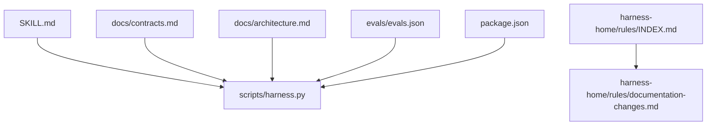
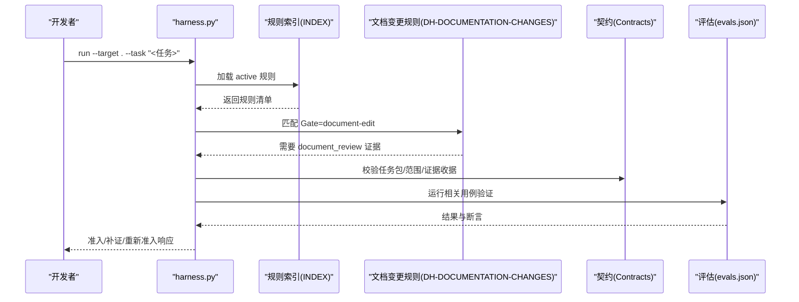
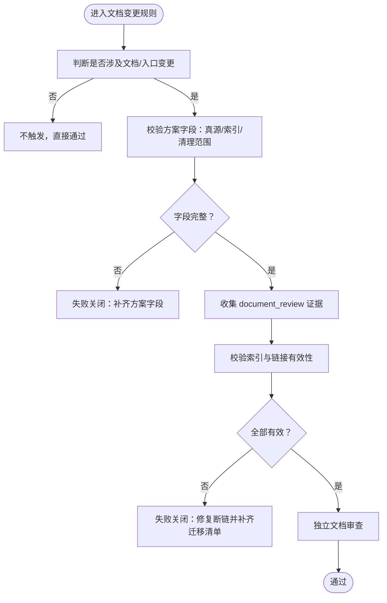
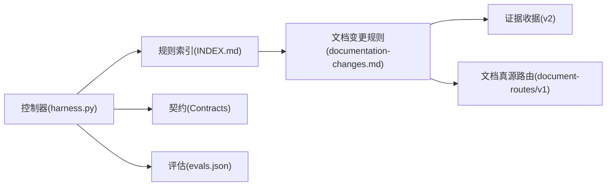

# 文档变更规则

<cite>
**本文引用的文件**
- [harness-home/rules/documentation-changes.md](file://harness-home/rules/documentation-changes.md)
- [harness-home/rules/INDEX.md](file://harness-home/rules/INDEX.md)
- [SKILL.md](file://SKILL.md)
- [package.json](file://package.json)
- [docs/contracts.md](file://docs/contracts.md)
- [docs/architecture.md](file://docs/architecture.md)
- [evals/evals.json](file://evals/evals.json)
</cite>

## 目录
1. [引言](#引言)
2. [项目结构](#项目结构)
3. [核心组件](#核心组件)
4. [架构总览](#架构总览)
5. [详细组件分析](#详细组件分析)
6. [依赖关系分析](#依赖关系分析)
7. [性能与质量考量](#性能与质量考量)
8. [故障排查指南](#故障排查指南)
9. [结论](#结论)
10. [附录](#附录)

## 引言
本文件为“文档变更规则”的权威说明，目标是确保文档变更与代码变更保持一致性与完整性。规则覆盖适用条件、一致性检查项、质量标准、审查流程与版本管理策略，并提供自动生成工具与模板的使用指引，以及 Markdown、Swagger 等格式的集成示例。该规则在 Docs Harness 的规则体系中作为独立 Gate 生效，贯穿任务准入、执行与验收全流程。

## 项目结构
本项目采用“控制器 + 受管规则 + 契约文档 + 评估用例”的结构组织：
- 控制器与技能入口：scripts/harness.py、SKILL.md
- 受管规则集：harness-home/rules/*（含 INDEX 与具体规则）
- 契约与架构事实：docs/contracts.md、docs/architecture.md
- 评估用例：evals/evals.json
- 包元数据：package.json

图表来源
- [SKILL.md:1-106](file://SKILL.md#L1-L106)
- [docs/contracts.md:1-372](file://docs/contracts.md#L1-L372)
- [docs/architecture.md:1-26](file://docs/architecture.md#L1-L26)
- [harness-home/rules/INDEX.md:1-41](file://harness-home/rules/INDEX.md#L1-L41)
- [harness-home/rules/documentation-changes.md:1-29](file://harness-home/rules/documentation-changes.md#L1-L29)
- [evals/evals.json:1-175](file://evals/evals.json#L1-L175)
- [package.json:1-23](file://package.json#L1-L23)

章节来源
- [SKILL.md:1-106](file://SKILL.md#L1-L106)
- [docs/contracts.md:1-372](file://docs/contracts.md#L1-L372)
- [docs/architecture.md:1-26](file://docs/architecture.md#L1-L26)
- [harness-home/rules/INDEX.md:1-41](file://harness-home/rules/INDEX.md#L1-L41)
- [harness-home/rules/documentation-changes.md:1-29](file://harness-home/rules/documentation-changes.md#L1-L29)
- [evals/evals.json:1-175](file://evals/evals.json#L1-L175)
- [package.json:1-23](file://package.json#L1-L23)

## 核心组件
- 文档变更规则（DH-DOCUMENTATION-CHANGES）
  - 状态：active；Gate：document-edit；关键词：文档、说明、readme、markdown
  - 方案字段要求：文档真源、索引与残留
  - 证据类型：document_review
  - 失败模式：当文档真源、事实来源或旧引用未闭合时停止并补齐
- 规则索引（INDEX.md）
  - 列出所有 active 规则，包含 DH-DOCUMENTATION-CHANGES
  - 激活条件：status=active、规则 ID 唯一、正文指纹正确、合同字段完整
  - 加载约定：固定快照复制，逐文件指纹记录，变化即失败关闭
- 契约与架构事实
  - contracts.md 定义任务包 v2、Git 状态、工作区漂移归因、证据收据、后台治理、退出码等
  - architecture.md 明确控制器源码真源、规则真源位置、文档治理数据面由 document-routes/v1 统一解析

章节来源
- [harness-home/rules/documentation-changes.md:1-29](file://harness-home/rules/documentation-changes.md#L1-L29)
- [harness-home/rules/INDEX.md:1-41](file://harness-home/rules/INDEX.md#L1-L41)
- [docs/contracts.md:1-372](file://docs/contracts.md#L1-L372)
- [docs/architecture.md:1-26](file://docs/architecture.md#L1-L26)

## 架构总览
文档变更规则通过控制器 Gate 机制嵌入到任务生命周期中，结合证据收据与后台治理完成端到端的一致性保障。

图表来源
- [SKILL.md:1-106](file://SKILL.md#L1-L106)
- [harness-home/rules/INDEX.md:1-41](file://harness-home/rules/INDEX.md#L1-L41)
- [harness-home/rules/documentation-changes.md:1-29](file://harness-home/rules/documentation-changes.md#L1-L29)
- [docs/contracts.md:1-372](file://docs/contracts.md#L1-L372)
- [evals/evals.json:1-175](file://evals/evals.json#L1-L175)

## 详细组件分析

### 文档变更规则（DH-DOCUMENTATION-CHANGES）
- 适用条件
  - 新增、修改、迁移、重命名或删除项目文档及运行时入口时触发
- 必需的方案字段
  - 必须声明唯一真源、需要同步的索引，以及旧入口和死引用的清理范围
- 验收条件
  - 事实必须有当前证据；索引与链接有效；旧入口不再参与路由；完成独立文档审查
- 失败处理方式
  - 事实无法确认、索引断链或新旧体系同时生效时，停止并补齐迁移清单

图表来源
- [harness-home/rules/documentation-changes.md:1-29](file://harness-home/rules/documentation-changes.md#L1-L29)

章节来源
- [harness-home/rules/documentation-changes.md:1-29](file://harness-home/rules/documentation-changes.md#L1-L29)

### 规则索引与加载约定
- 生效规则列表包含 DH-DOCUMENTATION-CHANGES
- 激活条件：status=active、规则 ID 唯一、正文指纹正确、合同字段完整
- 加载约定：安装时复制固定快照，记录逐文件指纹；缺失、增加或变化均失败关闭，需升级来源包或人工 preserve-and-merge

章节来源
- [harness-home/rules/INDEX.md:1-41](file://harness-home/rules/INDEX.md#L1-L41)

### 契约与证据模型对文档一致性的支撑
- 任务包 v2：限定 read/write/git/external scope，约束写入面
- Git 状态合同：冻结远端与本地状态，防止漂移导致不一致
- 工作区漂移归因：区分可信/并发/未归因变更，阻断越界写入
- 证据收据 v2：绑定 task/target/package，白名单 produces，受管副本存储
- 后台治理与文档真源路由：document_routes 统一解析，Job 控制面与业务面隔离

章节来源
- [docs/contracts.md:1-372](file://docs/contracts.md#L1-L372)

### 评估用例与行为断言
- evals.json 中包含 direct-document 用例，预期命中 DH-DOCUMENTATION-CHANGES，并要求 action-context-receipt 与 verify=完成
- 其他用例覆盖 Git、证据、上下文、权限、后台治理等，间接支撑文档治理稳定性

章节来源
- [evals/evals.json:1-175](file://evals/evals.json#L1-L175)

## 依赖关系分析
- 控制器依赖规则索引与契约定义，按 Gate 匹配与证据模型驱动流程
- 文档变更规则依赖 document_review 证据与 document_routes 解析
- 评估用例用于回归验证关键路径与边界条件

图表来源
- [SKILL.md:1-106](file://SKILL.md#L1-L106)
- [harness-home/rules/INDEX.md:1-41](file://harness-home/rules/INDEX.md#L1-L41)
- [harness-home/rules/documentation-changes.md:1-29](file://harness-home/rules/documentation-changes.md#L1-L29)
- [docs/contracts.md:1-372](file://docs/contracts.md#L1-L372)
- [evals/evals.json:1-175](file://evals/evals.json#L1-L175)

章节来源
- [SKILL.md:1-106](file://SKILL.md#L1-L106)
- [harness-home/rules/INDEX.md:1-41](file://harness-home/rules/INDEX.md#L1-L41)
- [harness-home/rules/documentation-changes.md:1-29](file://harness-home/rules/documentation-changes.md#L1-L29)
- [docs/contracts.md:1-372](file://docs/contracts.md#L1-L372)
- [evals/evals.json:1-175](file://evals/evals.json#L1-L175)

## 性能与质量考量
- 性能特性
  - 幂等复用活动任务，避免重复建立上下文与授权
  - 证据命令缓存与增量准入，减少重复验证成本
  - 后台 Job 分阶段推进，控制面与业务面隔离，降低耦合
- 质量标准
  - 格式规范：Markdown 结构清晰，frontmatter 完整
  - 语言准确性：术语一致，无歧义描述
  - 链接有效性：索引与外部链接可访问且稳定
  - 技术准确性：API 文档与实现一致，示例可运行
- 持续改进建议
  - 引入自动化扫描（链接检查、术语一致性、示例可运行性）
  - 将评估用例扩展至文档维度（如 README/CHANGELOG/注释/示例）
  - 定期审计规则指纹与索引一致性，及时升级来源包

[本节为通用指导，不直接分析具体文件]

## 故障排查指南
- 常见失败场景
  - 事实无法确认：补充当前证据（document_review），确保证据绑定 task/target/package
  - 索引断链：修复链接，更新索引，必要时生成迁移清单
  - 新旧体系同时生效：清理旧入口，确保仅新真源参与路由
- 处置流程
  - 提供证据：控制器返回 provide_evidence，补齐后继续
  - 刷新证据：读取基线漂移，失效并重读漂移路径
  - 重试验证：输入不变但命令失败，检查环境与依赖
  - 增量准入：仅追加普通 Gate 且合同不变，原子生成下一 package revision
  - 完整重新准入：范围、高风险合同或规则变化，需重新走准入流程

章节来源
- [docs/contracts.md:1-372](file://docs/contracts.md#L1-L372)

## 结论
文档变更规则通过 Gate 机制、证据模型与后台治理，确保文档与代码变更的一致性与完整性。配合契约与评估用例，可在任务全生命周期内自动识别风险、阻断不一致变更，并在失败时给出明确的补齐与迁移指引。建议在团队实践中持续完善自动化检查与评估用例，提升文档质量与交付效率。

[本节为总结，不直接分析具体文件]

## 附录

### 适用条件与触发点
- 代码修改：影响 API、Schema、协议、持久化结构或跨模块公共契约时，需同步文档与示例
- API 变更：遵循 API 兼容规则，说明兼容策略、受影响消费者、迁移顺序与回滚路径
- 功能更新：更新 README、CHANGELOG、注释与示例，确保用户可见性
- 依赖升级：记录依赖版本、变更影响与兼容性矩阵

章节来源
- [harness-home/rules/api-compatibility.md:1-29](file://harness-home/rules/api-compatibility.md#L1-L29)
- [harness-home/rules/documentation-changes.md:1-29](file://harness-home/rules/documentation-changes.md#L1-L29)

### 文档一致性检查清单
- API 文档同步：接口签名、参数、返回值、错误码与示例一致
- README 更新：安装、使用、配置、贡献指南与版本说明
- CHANGELOG 维护：新增、变更、废弃、修复分类清晰，影响面明确
- 注释完整性：关键函数、类、模块与契约均有可读注释
- 示例代码验证：示例可运行，覆盖典型与边界场景

[本节为通用指导，不直接分析具体文件]

### 文档质量标准
- 格式规范：Markdown 层级清晰，frontmatter 完整，图片与表格可访问
- 语言准确性：术语一致，无歧义，面向目标读者
- 链接有效性：内部与外部链接可访问，长期稳定
- 技术准确性：与实现一致，示例可复现，版本对应

[本节为通用指导，不直接分析具体文件]

### 文档审查流程与版本管理策略
- 审查流程
  - 任务准入：控制器按 Gate 匹配规则，生成 completion_manifest
  - 执行阶段：收集证据（document_review），校验范围与漂移
  - 验收阶段：verify 按清单逐项验收，支持五级处置
- 版本管理策略
  - 规则快照与指纹：安装时复制固定快照，变化即失败关闭
  - 契约冻结：一次冻结，新增 Gate 仅缺字段时 delta 补齐
  - 证据受管：受管副本保存，原始文件删除不影响已采纳证据

章节来源
- [docs/contracts.md:1-372](file://docs/contracts.md#L1-L372)
- [harness-home/rules/INDEX.md:1-41](file://harness-home/rules/INDEX.md#L1-L41)

### 文档自动生成工具与模板使用方法
- 控制器与技能
  - 使用 harness.py 进行项目初始化、任务运行与验证
  - SKILL.md 提供安装、任务入口、后台治理与质量账本的命令参考
- 模板
  - _rule-template.md 提供规则文件模板，包含 frontmatter 与章节结构
- 使用步骤
  - 初始化项目：project init
  - 运行任务：run --target . --task "<任务>"
  - 验证结果：verify --target . --task-id <task-id> --evidence <evidence.json>

章节来源
- [SKILL.md:1-106](file://SKILL.md#L1-L106)
- [harness-home/rules/_rule-template.md:1-21](file://harness-home/rules/_rule-template.md#L1-L21)

### 文档质量评估指标与持续改进建议
- 评估指标
  - 覆盖率：API/README/CHANGELOG/注释/示例的覆盖度
  - 准确性：与实现一致的比例，示例可运行比例
  - 可维护性：索引有效性、链接健康度、术语一致性
- 持续改进
  - 引入自动化扫描与测试用例
  - 定期审计规则与契约一致性
  - 扩展评估用例至文档维度

[本节为通用指导，不直接分析具体文件]

### Markdown 与 Swagger 集成示例
- Markdown
  - 使用 frontmatter 声明元数据，结构化章节，保持链接有效
  - 示例：README、CHANGELOG、API 说明、ADR、Review
- Swagger
  - 以 OpenAPI 规范描述接口，与代码契约同步
  - 生成文档站点与客户端 SDK，确保版本对齐

[本节为概念性示例，不直接分析具体文件]