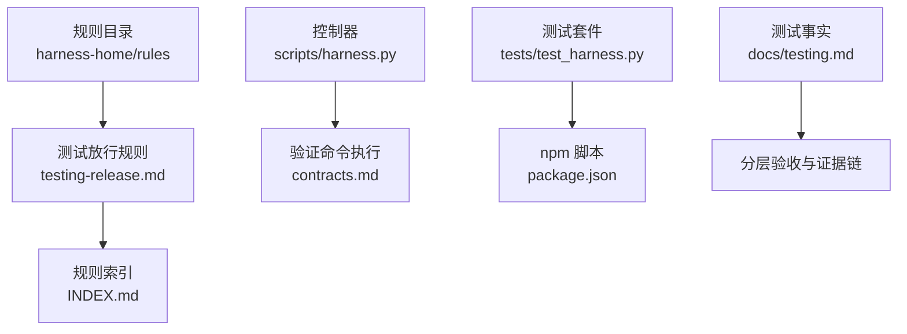
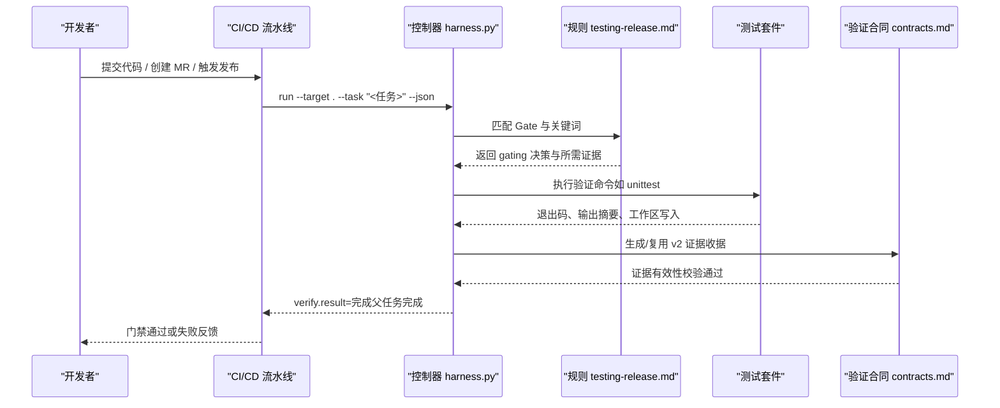
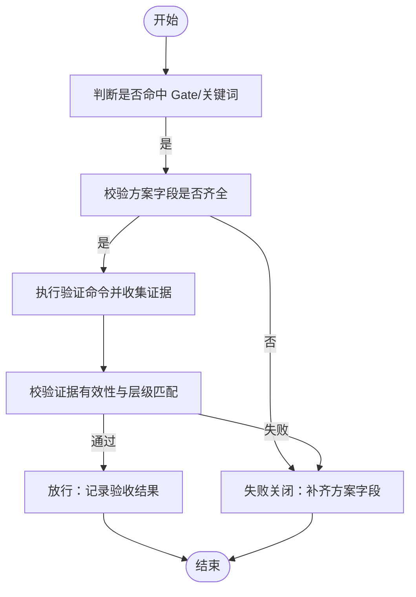
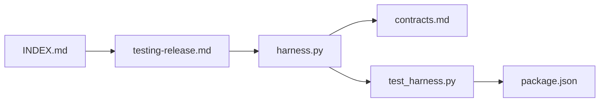

# 测试发布规则

<cite>
**本文引用的文件**   
- [harness-home/rules/testing-release.md](file://harness-home/rules/testing-release.md)
- [harness-home/rules/INDEX.md](file://harness-home/rules/INDEX.md)
- [docs/testing.md](file://docs/testing.md)
- [package.json](file://package.json)
- [tests/test_harness.py](file://tests/test_harness.py)
- [scripts/harness.py](file://scripts/harness.py)
- [docs/contracts.md](file://docs/contracts.md)
- [SKILL.md](file://SKILL.md)
</cite>

## 目录
1. [简介](#简介)
2. [项目结构](#项目结构)
3. [核心组件](#核心组件)
4. [架构总览](#架构总览)
5. [详细组件分析](#详细组件分析)
6. [依赖关系分析](#依赖关系分析)
7. [性能考量](#性能考量)
8. [故障诊断与修复指南](#故障诊断与修复指南)
9. [结论](#结论)
10. [附录：CI/CD 集成与自动化配置示例](#附录cicd-集成与自动化配置示例)

## 简介
本文件为“测试发布规则”的权威说明，面向在代码提交、合并请求、版本发布等关键节点触发质量门禁的团队。该规则确保在发布前满足测试覆盖率、完整性与质量标准，并通过证据化验收与失败关闭策略保障交付质量。文档覆盖适用条件、测试要求、质量门禁配置、失败诊断与修复建议、框架集成最佳实践，以及 CI/CD 流水线集成示例。

## 项目结构
本项目采用“规则 + 控制器 + 测试”的分层组织方式：
- 规则层：harness-home/rules 下存放通用规则快照，包含测试放行规则及其索引
- 控制器层：scripts/harness.py 提供任务编排、证据校验、Gate 控制与验证命令执行
- 测试层：tests/test_harness.py 提供契约与行为测试；package.json 定义测试脚本入口
- 文档层：docs/testing.md 描述测试事实与分层验收；docs/contracts.md 定义证据与验证合同

图表来源
- [harness-home/rules/testing-release.md:1-29](file://harness-home/rules/testing-release.md#L1-L29)
- [harness-home/rules/INDEX.md:1-41](file://harness-home/rules/INDEX.md#L1-L41)
- [scripts/harness.py:1-200](file://scripts/harness.py#L1-L200)
- [docs/contracts.md:190-220](file://docs/contracts.md#L190-L220)
- [tests/test_harness.py:1-120](file://tests/test_harness.py#L1-L120)
- [package.json:17-22](file://package.json#L17-L22)
- [docs/testing.md:1-25](file://docs/testing.md#L1-L25)

章节来源
- [harness-home/rules/testing-release.md:1-29](file://harness-home/rules/testing-release.md#L1-L29)
- [harness-home/rules/INDEX.md:1-41](file://harness-home/rules/INDEX.md#L1-L41)
- [docs/testing.md:1-25](file://docs/testing.md#L1-L25)
- [package.json:17-22](file://package.json#L17-L22)

## 核心组件
- 测试放行规则（DH-TESTING-RELEASE）
  - 状态：active
  - Gate：testing-acceptance
  - 关键词：测试、验收、回归、test、verify、acceptance
  - 方案字段：验收结果
  - 证据类型：test_result
  - 失败模式：测试层级、实际命令、产物身份或失败项未闭合时停止
- 规则索引与激活
  - INDEX.md 声明 active_rules 列表，控制器按 Gate 或关键词匹配规则
  - 仅 status: active、规则 ID 唯一、正文指纹正确且合同字段完整的规则进入任务包
- 测试事实与分层验收
  - docs/testing.md 明确源码层、临时项目层、后台控制面专项、下游层等的验收范围与证据要求
  - 通过 npm test、self-test、pack:check 等入口驱动完整回归与自检
- 控制器与验证合同
  - scripts/harness.py 实现任务生命周期、Gate 判定、证据校验与命令执行
  - docs/contracts.md 规定验证命令、证据收据、可容忍副产物与缓存复用机制

章节来源
- [harness-home/rules/testing-release.md:1-29](file://harness-home/rules/testing-release.md#L1-L29)
- [harness-home/rules/INDEX.md:1-41](file://harness-home/rules/INDEX.md#L1-L41)
- [docs/testing.md:1-25](file://docs/testing.md#L1-L25)
- [scripts/harness.py:1-200](file://scripts/harness.py#L1-L200)
- [docs/contracts.md:190-220](file://docs/contracts.md#L190-L220)

## 架构总览
测试发布规则在控制器驱动下，以“证据 + Gate + 失败关闭”为核心，贯穿提交、MR、发布等关键节点。

图表来源
- [scripts/harness.py:1-200](file://scripts/harness.py#L1-L200)
- [docs/contracts.md:190-220](file://docs/contracts.md#L190-L220)
- [harness-home/rules/testing-release.md:1-29](file://harness-home/rules/testing-release.md#L1-L29)
- [tests/test_harness.py:1-120](file://tests/test_harness.py#L1-L120)

## 详细组件分析

### 测试放行规则（DH-TESTING-RELEASE）
- 适用条件
  - 当任务要求测试、回归、验收、构建放行或对完成状态作出判断时生效
- 必需方案字段
  - 必须区分静态检查、源码测试、运行时验证、产物验证和真实产品验收
- 验收条件
  - 记录实际执行命令、退出码、覆盖范围和失败项
  - 目标涉及产物或真实流程时不得只用源码测试代替
- 失败处理方式
  - 测试未运行、证据过期、目标层级不匹配或存在未解释失败时，不得宣称完成

图表来源
- [harness-home/rules/testing-release.md:1-29](file://harness-home/rules/testing-release.md#L1-L29)

章节来源
- [harness-home/rules/testing-release.md:1-29](file://harness-home/rules/testing-release.md#L1-L29)

### 测试事实与分层验收
- 自动化入口
  - 完整回归：npm test
  - 控制器自检：npm run self-test
  - 发布包清单：npm run pack:check
- 验收分层
  - 源码层：完整回归、自检与打包检查通过
  - 临时项目层：覆盖 init/upgrade、任务准入、知识生命周期、后台 Job、兼容迁移与幂等路径
  - 后台控制面专项：Git/非 Git Runtime、部分工件、显式 repair、指纹篡改、进度非法倒退、兼容别名、retry attempt 隔离、脱敏事件去重与摘要 prune
  - 工作量专项：大仓单文件增量使用 change_scoped，bootstrap 保持 project_wide，source_fingerprint 与后台幂等键不因路由口径修正而漂移
  - 文档路由专项：五类真源、显式优先、唯一候选、多候选、缺失、非法路径、符号链接、零写阻塞 Job、稳定去重、retry 重建、旧 Job 取消迁移、类别锁与运行前漂移
  - 安装升级专项：合法 document_routes preserve-and-merge、非法配置 preview/apply 失败关闭，以及旧在途治理 Job 的人工迁移清单
  - 下游层：核对安装控制器、项目知识状态与宿主派发；Git 交付与 fresh clone 需要独立证据
  - 重要提示：测试通过不等于已提交、已推送、已安装或真实宿主已完成派发

章节来源
- [docs/testing.md:1-25](file://docs/testing.md#L1-L25)

### 验证命令与证据收据
- 验证命令使用
  - 通过 argv 指定命令（如 python3 -m unittest），produces 限定证据白名单
  - 退出码 0、输出摘要与工作区无额外交付写入同时满足后，控制器生成并持久化 v2 收据
  - 只容忍已知临时副产物（如 .coverage、htmlcov、__pycache__ 等），同名已有文件被修改或删除仍阻断
  - 可通过 verification.volatile_paths 追加白名单，但禁止越界、绝对路径与控制面路径
- 证据简化与自动归因
  - 支持证据声明草案（evidence-declaration/v1），由控制器代铸完整 v2 收据
  - 默认在 write_scope 内未归因写入时自动认领并继续 verify，可通过配置恢复补证据流程
- 命令缓存
  - 输入不变且上次通过的命令直接复用收据（cache_hit=true），输入变化或失败则重跑
  - 可通过 verification.command_cache_enabled=false 整体关闭复用

章节来源
- [docs/contracts.md:190-220](file://docs/contracts.md#L190-L220)
- [SKILL.md:44](file://SKILL.md#L44)

### 控制器与规则加载
- 控制器职责
  - 任务编译、意图识别、风险 Gate 判定、上下文与授权收据管理、验证命令执行与证据校验
- 规则加载约定
  - 项目安装时复制固定规则快照，并在配置中记录逐文件指纹
  - 规则缺失、增加或变化均失败关闭，必须通过来源包升级或人工 preserve-and-merge
- 激活条件
  - 控制器按 Gate 或关键词匹配规则；只有 status: active、规则 ID 唯一、正文指纹正确且合同字段完整的规则才能进入任务包

章节来源
- [scripts/harness.py:1-200](file://scripts/harness.py#L1-L200)
- [harness-home/rules/INDEX.md:1-41](file://harness-home/rules/INDEX.md#L1-L41)

## 依赖关系分析
- 规则与控制器耦合
  - 控制器依据 INDEX.md 中的 active_rules 与规则正文指纹进行加载与校验
  - testing-release.md 通过 gate 与关键词参与 Gate 判定
- 测试与证据链
  - tests/test_harness.py 驱动控制器与规则的行为一致性，确保规则快照与激活状态一致
  - package.json 提供统一测试入口，便于 CI/CD 集成
- 外部依赖
  - 验证命令依赖 Python 环境、unittest 等测试框架
  - Git 操作与 LFS/Submodule 可用性影响预检与同步流程

图表来源
- [harness-home/rules/INDEX.md:1-41](file://harness-home/rules/INDEX.md#L1-L41)
- [harness-home/rules/testing-release.md:1-29](file://harness-home/rules/testing-release.md#L1-L29)
- [scripts/harness.py:1-200](file://scripts/harness.py#L1-L200)
- [docs/contracts.md:190-220](file://docs/contracts.md#L190-L220)
- [tests/test_harness.py:1-120](file://tests/test_harness.py#L1-L120)
- [package.json:17-22](file://package.json#L17-L22)

章节来源
- [harness-home/rules/INDEX.md:1-41](file://harness-home/rules/INDEX.md#L1-L41)
- [scripts/harness.py:1-200](file://scripts/harness.py#L1-L200)
- [tests/test_harness.py:1-120](file://tests/test_harness.py#L1-L120)
- [package.json:17-22](file://package.json#L17-L22)

## 性能考量
- 命令缓存与证据复用
  - 通过 verification.command_cache_enabled 控制命令缓存开关，减少重复执行开销
  - 证据副本与受管 artifact store 降低重复读取与校验成本
- 临时副产物与写入限制
  - 严格限制可容忍的临时副产物，避免不必要的磁盘 IO 与校验负担
- 背景任务与重试
  - background retry 归档旧 attempt 工件并刷新基线，避免累积状态导致的性能退化

[本节为通用指导，不直接分析具体文件]

## 故障诊断与修复指南
- 常见失败原因
  - 测试未运行：需确认验证命令 argv 与 produces 配置正确
  - 证据过期：检查证据 TTL 与时间戳，必要时重新生成
  - 目标层级不匹配：确保测试层级与 Gate 要求一致（源码/产物/真实流程）
  - 未解释失败：记录失败项与退出码，补充证据或修复问题
- 修复建议
  - 补齐方案字段：静态检查、源码测试、运行时验证、产物验证、真实产品验收
  - 调整验证命令：确保退出码 0、输出摘要与工作区无额外写入
  - 扩展白名单：如需新增临时副产物，使用 verification.volatile_paths 配置
  - 关闭命令缓存：verification.command_cache_enabled=false 用于排查缓存相关问题
- 控制器退出码参考
  - 0：成功；verify.result=完成表示父任务完成
  - 1：项目检查、自检或完整性读取失败
  - 2：输入、合同、绑定或状态无效
  - 3：需要方案、授权、证据、迁移、用户输入或 Git 交付
  - 4：范围、漂移、Gate、远端、授权或规则变化，必须重新准入

章节来源
- [docs/contracts.md:350-370](file://docs/contracts.md#L350-L370)
- [harness-home/rules/testing-release.md:1-29](file://harness-home/rules/testing-release.md#L1-L29)

## 结论
测试发布规则以“证据化验收 + Gate 控制 + 失败关闭”为核心，确保在提交、MR、发布等关键节点严格执行测试覆盖率与质量标准。通过分层验收、命令缓存与临时副产物白名单机制，在保证质量的同时兼顾性能与可维护性。团队应遵循规则与合同，完善测试与证据链，提升发布可靠性。

[本节为总结性内容，不直接分析具体文件]

## 附录：CI/CD 集成与自动化配置示例
- 触发节点
  - 代码提交：执行 npm test 与 npm run self-test
  - 合并请求：运行完整回归与自检，生成证据收据
  - 版本发布：执行 npm run pack:check 与产物验证
- 流水线步骤建议
  - 初始化环境：安装依赖、准备 Git 与 Python 环境
  - 执行测试：npm test（单元测试）、npm run self-test（控制器自检）
  - 产物检查：npm run pack:check（发布包清单）
  - 证据采集：将测试输出与退出码转换为 v2 证据收据
  - 门禁判定：根据 DH-TESTING-RELEASE Gate 与验收条件决定是否放行
- 配置要点
  - 验证命令 argv 与 produces 白名单需与 contracts.md 一致
  - 如需自定义临时副产物，配置 verification.volatile_paths
  - 关闭命令缓存用于调试：verification.command_cache_enabled=false

章节来源
- [package.json:17-22](file://package.json#L17-L22)
- [docs/testing.md:1-25](file://docs/testing.md#L1-L25)
- [docs/contracts.md:190-220](file://docs/contracts.md#L190-L220)