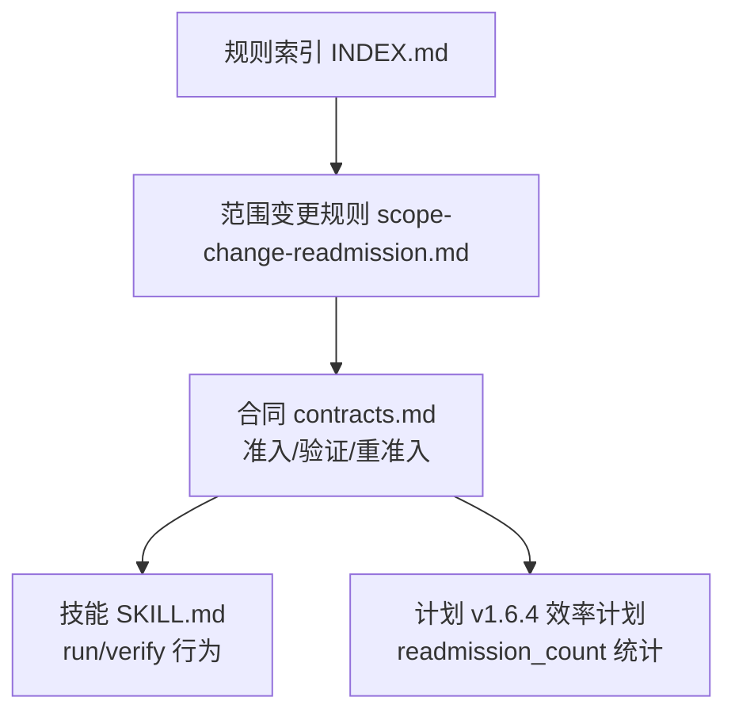
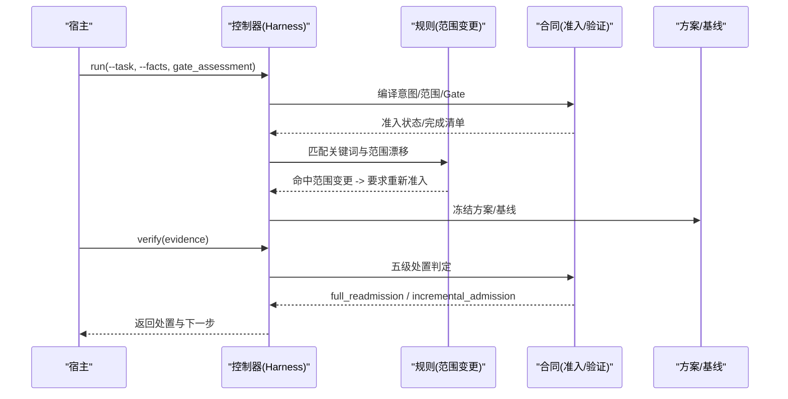
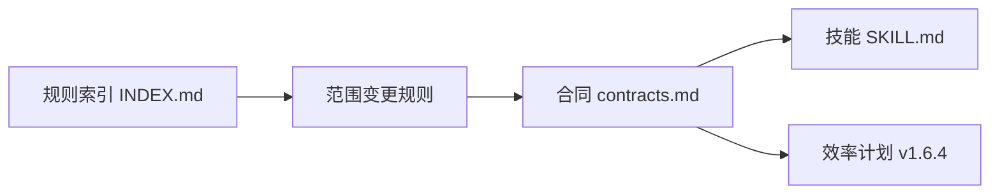

# 范围变更重新审核规则

<cite>
**本文引用的文件**
- [scope-change-readmission.md](file://harness-home/rules/scope-change-readmission.md)
- [INDEX.md](file://harness-home/rules/INDEX.md)
- [_rule-template.md](file://harness-home/rules/_rule-template.md)
- [contracts.md](file://docs/contracts.md)
- [SKILL.md](file://SKILL.md)
- [v1.6.4-minimal-systemic-flow-efficiency-plan.md](file://docs/plans/v1.6.4-minimal-systemic-flow-efficiency-plan.md)
</cite>

## 目录
1. [简介](#简介)
2. [项目结构](#项目结构)
3. [核心组件](#核心组件)
4. [架构总览](#架构总览)
5. [详细组件分析](#详细组件分析)
6. [依赖关系分析](#依赖关系分析)
7. [性能考量](#性能考量)
8. [故障排查指南](#故障排查指南)
9. [结论](#结论)
10. [附录](#附录)

## 简介
本文件为“范围变更重新审核规则”的权威说明，面向任务治理与文档交付流程中的范围基线管理与变更控制。该规则确保当任务需求、技术架构、资源需求或交付时间发生实质性变化时，触发重新评估与授权流程，防止未经授权的越界变更影响质量与可追溯性。

## 项目结构
围绕范围变更重新审核的相关资产位于规则目录与合同/计划文档中：
- 规则定义：harness-home/rules/scope-change-readmission.md
- 规则索引与激活条件：harness-home/rule/INDEX.md
- 规则模板（用于扩展新规则）：harness-home/rules/_rule-template.md
- 准入/验收/重准入合同：docs/contracts.md
- 技能入口与运行约束：SKILL.md
- 重准入计数与效率事件：docs/plans/v1.6.4-minimal-systemic-flow-efficiency-plan.md

图表来源
- [INDEX.md:1-41](file://harness-home/rules/INDEX.md#L1-L41)
- [scope-change-readmission.md:1-29](file://harness-home/rules/scope-change-readmission.md#L1-L29)
- [contracts.md:150-162](file://docs/contracts.md#L150-L162)
- [SKILL.md:42-56](file://SKILL.md#L42-L56)
- [v1.6.4-minimal-systemic-flow-efficiency-plan.md:393-404](file://docs/plans/v1.6.4-minimal-systemic-flow-efficiency-plan.md#L393-L404)

章节来源
- [INDEX.md:1-41](file://harness-home/rules/INDEX.md#L1-L41)
- [scope-change-readmission.md:1-29](file://harness-home/rules/scope-change-readmission.md#L1-L29)
- [_rule-template.md:1-21](file://harness-home/rules/_rule-template.md#L1-L21)

## 核心组件
- 规则标识与元数据
  - rule_id: DH-SCOPE-CHANGE-READMISSION
  - gates: review-audit
  - keywords: 范围变化,范围变更,scope change,outside scope
  - plan_fields: 影响范围
  - evidence_types: review_result
  - failure_mode: 实际范围、目标或准备动作变化时停止并重新准入
- 适用条件
  - 任务明确讨论范围变化，或执行中发现实际改动超出已冻结范围时生效
- 必需的方案字段
  - 必须列明新增影响范围、触发的新 Gate、授权变化和需要重做的验收
- 验收条件
  - 必须证明新范围已进入新任务包版本，旧上下文、方案和证据没有被错误复用
- 失败处理
  - 任何未声明范围、目标或动作变化都立即停止，并从 run 入口重新准入

章节来源
- [scope-change-readmission.md:1-29](file://harness-home/rules/scope-change-readmission.md#L1-L29)

## 架构总览
范围变更重新审核贯穿“准入—执行—验证—重准入”的全链路：
- 准入阶段：基于任务意图、风险 Gate、范围与授权进行编译与冻结
- 执行阶段：在受控 write_scope 内工作，避免越界写入
- 验证阶段：按五级处置策略判定是否需增量或完整重准入
- 重准入阶段：当范围或高风险合同/规则变化时，强制 full_readmission

图表来源
- [SKILL.md:42-56](file://SKILL.md#L42-L56)
- [contracts.md:150-162](file://docs/contracts.md#L150-L162)
- [scope-change-readmission.md:1-29](file://harness-home/rules/scope-change-readmission.md#L1-L29)

## 详细组件分析

### 适用范围与触发条件
- 需求变更：任务文本或事实表明范围扩大/缩小
- 技术架构调整：涉及路径、模块、接口或外部依赖边界变化
- 资源需求变化：工作量估算、交付物清单、验收标准变化
- 交付时间调整：里程碑或发布窗口变化导致 Gate 升级

上述任一情形若导致“实际改动超出已冻结范围”，即触发规则。

章节来源
- [scope-change-readmission.md:14-16](file://harness-home/rules/scope-change-readmission.md#L14-L16)

### 范围变更检测内容
- 需求影响分析：对比当前任务意图与已冻结范围，识别新增/删除/修改的影响面
- 技术可行性评估：评估变更对现有架构、接口、依赖链的兼容性与风险
- 资源成本估算：更新工作量、交付物清单与验收项
- 风险重新评估：结合 Gate 语义与安全底线，判断是否需要升级审批层级

章节来源
- [contracts.md:44-46](file://docs/contracts.md#L44-L46)
- [contracts.md:150-162](file://docs/contracts.md#L150-L162)

### 重新审核流程要求
- 变更申请：在方案中补充“影响范围”字段，并声明新 Gate 与授权变化
- 影响分析：产出需求影响与技术可行性评估摘要
- 风险评估：提交 gate_assessment（含 rationale），由控制器合并安全底线 Gate
- 授权审批：根据新 Gate 与授权合同，必要时升级审批层级
- 计划更新：生成 contract_delta 或 plan_delta_contract，冻结新版本方案与基线

章节来源
- [scope-change-readmission.md:18-21](file://harness-home/rules/scope-change-readmission.md#L18-L21)
- [contracts.md:44-46](file://docs/contracts.md#L44-L46)
- [contracts.md:80-81](file://docs/contracts.md#L80-L81)

### 范围基线管理与变更追踪
- 首次基线：freeze.json.workspace_snapshot 记录初始工作区快照
- 写入归因：evidence-receipt/v2 绑定 task/target/package fingerprint，区分 read_set/write_set
- 漂移检测：unattributed_drift/concurrent_drift 与 write_scope 比对，越界或高风险直接阻断
- 重准入计数：readmission_count 统计 scope_bound_readmission/incremental_gate_readmission/full_readmission

章节来源
- [contracts.md:136-152](file://docs/contracts.md#L136-L152)
- [contracts.md:165-200](file://docs/contracts.md#L165-L200)
- [v1.6.4-minimal-systemic-flow-efficiency-plan.md:393-404](file://docs/plans/v1.6.4-minimal-systemic-flow-efficiency-plan.md#L393-L404)

### 变更影响的量化评估方法与决策支持工具
- 量化维度
  - 范围覆盖度：受影响文件/模块数量与比例
  - 风险等级：Gate 级别与安全底线命中情况
  - 工作量增量：估计工时与交付物新增项
  - 验收复杂度：新增证据类型与命令缓存失效率
- 决策支持
  - gate_assessment 提供权威语义判断，减少误判
  - verification.command_cache_enabled 控制命令收据复用，提升效率
  - auto_attribute_in_scope 自动认领范围内写入，降低补证负担

章节来源
- [SKILL.md:42-56](file://SKILL.md#L42-L56)
- [contracts.md:190-200](file://docs/contracts.md#L190-L200)
- [contracts.md:218-221](file://docs/contracts.md#L218-L221)

### 最佳实践与沟通策略
- 最小化变更：优先局部修复，避免大范围重构
- 显式声明：所有范围/目标/动作变化必须在方案中声明
- 分阶段推进：复杂变更采用 background_goal_phased，公共层串行合并
- 透明沟通：gate_decision.mode/rationale/floor_added 全量审计留痕
- 证据先行：先补齐证据再进入最终验收，避免反复重准入

章节来源
- [SKILL.md:60-88](file://SKILL.md#L60-L88)
- [contracts.md:44-46](file://docs/contracts.md#L44-L46)

### 工作流配置与审批流程设置
- 规则激活：INDEX.md 中 active_rules 包含 DH-SCOPE-CHANGE-READMISSION
- Gate 映射：review-audit 作为范围变更的审查审计门槛
- 方案字段：plan_fields 要求“影响范围”必填
- 证据类型：evidence_types 要求 review_result 作为关键证据
- 失败模式：failure_mode 强制从 run 入口重新准入

章节来源
- [INDEX.md:1-41](file://harness-home/rules/INDEX.md#L1-L41)
- [scope-change-readmission.md:1-29](file://harness-home/rules/scope-change-readmission.md#L1-L29)

## 依赖关系分析
- 规则与索引：scope-change-readmission.md 被 INDEX.md 激活
- 规则与合同：范围变更触发 full_readmission 或 incremental_admission
- 规则与技能：SKILL.md 规定 run/verify 的行为与证据契约
- 规则与计划：v1.6.4 计划定义 readmission_count 统计口径

图表来源
- [INDEX.md:1-41](file://harness-home/rules/INDEX.md#L1-L41)
- [scope-change-readmission.md:1-29](file://harness-home/rules/scope-change-readmission.md#L1-L29)
- [contracts.md:150-162](file://docs/contracts.md#L150-L162)
- [SKILL.md:42-56](file://SKILL.md#L42-L56)
- [v1.6.4-minimal-systemic-flow-efficiency-plan.md:393-404](file://docs/plans/v1.6.4-minimal-systemic-flow-efficiency-plan.md#L393-L404)

章节来源
- [INDEX.md:1-41](file://harness-home/rules/INDEX.md#L1-L41)
- [scope-change-readmission.md:1-29](file://harness-home/rules/scope-change-readmission.md#L1-L29)
- [contracts.md:150-162](file://docs/contracts.md#L150-L162)
- [SKILL.md:42-56](file://SKILL.md#L42-L56)
- [v1.6.4-minimal-systemic-flow-efficiency-plan.md:393-404](file://docs/plans/v1.6.4-minimal-systemic-flow-efficiency-plan.md#L393-L404)

## 性能考量
- 命令收据缓存：verification.command_cache_enabled=false 关闭缓存可避免重复执行，但会增加耗时
- 自动归因：auto_attribute_in_scope=true 可减少补证轮次，提高通过率
- 增量准入：仅追加普通 Gate 且合同不变时使用 incremental_admission，避免完整重准入
- 知识增量：change_scoped 模式下 source_fingerprint 仅绑定变更路径，降低幂等键冲突

章节来源
- [contracts.md:190-200](file://docs/contracts.md#L190-L200)
- [contracts.md:218-221](file://docs/contracts.md#L218-L221)
- [contracts.md:348-349](file://docs/contracts.md#L348-L349)

## 故障排查指南
- 常见失败原因
  - 未声明范围/目标/动作变化：触发 failure_mode，需从 run 入口重新准入
  - 越界写入：write_scope 外写入被阻断，需补充证据或调整范围
  - 读取基线漂移：refresh_evidence 失效引用后重读
  - 验证命令失败：retry_verification 重试或修正输入
- 定位步骤
  - 检查 gate_assessment 与 gate_decision.floor_added
  - 查看 unattributed_drift 与 concurrent_drift 列表
  - 确认 evidence-receipt/v2 的 task_id/target_identity/package_fingerprint 一致性
  - 核对 plan_fields 中“影响范围”是否完整

章节来源
- [scope-change-readmission.md:26-29](file://harness-home/rules/scope-change-readmission.md#L26-L29)
- [contracts.md:136-162](file://docs/contracts.md#L136-L162)
- [contracts.md:165-200](file://docs/contracts.md#L165-L200)

## 结论
范围变更重新审核规则通过严格的适用条件、方案字段、验收条件与失败处理机制，确保任务范围变更经过充分评估与授权。结合合同与技能的准入/验证/重准入流程，以及量化评估与决策支持工具，可在保障质量的同时提升变更效率与可追溯性。

## 附录
- 规则模板参考：_rule-template.md
- 合同与技能入口：contracts.md、SKILL.md
- 重准入统计口径：v1.6.4 效率计划

章节来源
- [_rule-template.md:1-21](file://harness-home/rules/_rule-template.md#L1-L21)
- [contracts.md:1-200](file://docs/contracts.md#L1-L200)
- [SKILL.md:1-106](file://SKILL.md#L1-L106)
- [v1.6.4-minimal-systemic-flow-efficiency-plan.md:393-404](file://docs/plans/v1.6.4-minimal-systemic-flow-efficiency-plan.md#L393-L404)