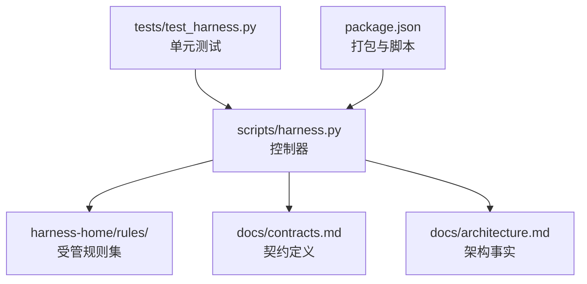
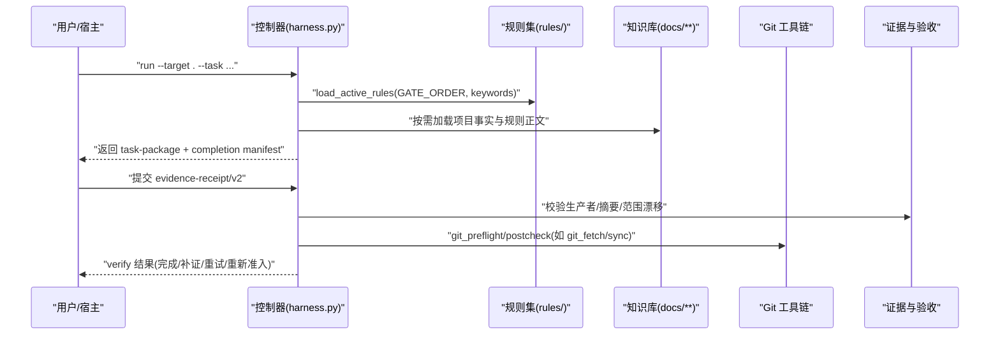
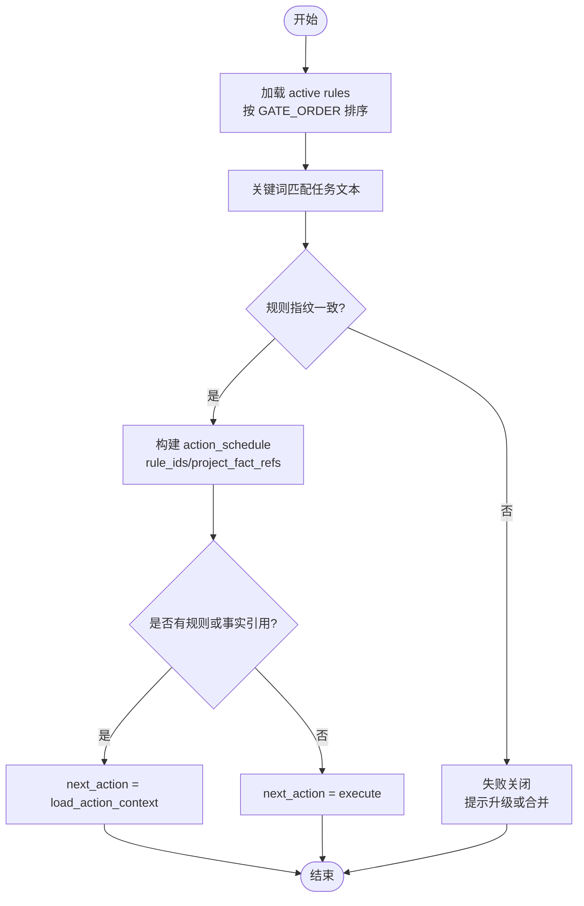
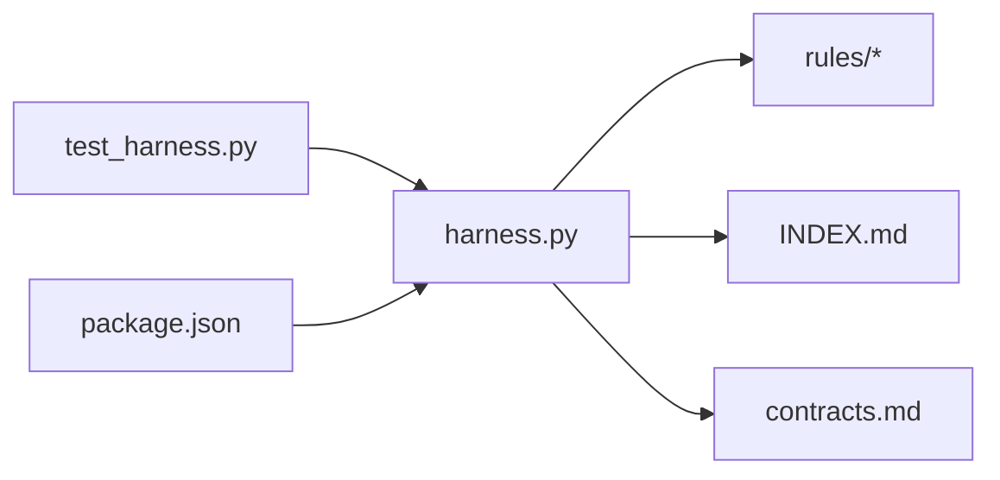

# 自定义规则开发

<cite>
**本文引用的文件**   
- [harness.py](file://scripts/harness.py)
- [_rule-template.md](file://harness-home/rules/_rule-template.md)
- [INDEX.md](file://harness-home/rule s/INDEX.md)
- [api-compatibility.md](file://harness-home/rules/api-compatibility.md)
- [documentation-changes.md](file://harness-home/rules/documentation-changes.md)
- [external-input-security.md](file://harness-home/rules/external-input-security.md)
- [testing-release.md](file://harness-home/rules/testing-release.md)
- [ui-complete-states.md](file://harness-home/rules/ui-complete-states.md)
- [contracts.md](file://docs/contracts.md)
- [architecture.md](file://docs/architecture.md)
- [package.json](file://package.json)
- [test_harness.py](file://tests/test_harness.py)
</cite>

## 目录
1. [引言](#引言)
2. [项目结构](#项目结构)
3. [核心组件](#核心组件)
4. [架构总览](#架构总览)
5. [详细组件分析](#详细组件分析)
6. [依赖关系分析](#依赖关系分析)
7. [性能考虑](#性能考虑)
8. [故障排查指南](#故障排查指南)
9. [结论](#结论)
10. [附录](#附录)

## 引言
本指南面向 Docs Harness 的“自定义规则”开发者，覆盖从需求分析、规则模板使用、规则逻辑实现、测试与调试、打包发布到上线运维的全流程。规则以 Markdown 文档形式声明 Gate、关键词、必需方案字段、证据类型与失败处理策略；控制器在任务准入阶段按 Gate 或关键词匹配并加载对应规则，结合知识上下文生成执行计划与验收清单。通过本指南，读者可快速掌握如何编写高质量、可验证、可分发的规则，并在复杂业务场景中安全落地。

## 项目结构
Docs Harness 的规则系统由“受管规则真源”和“控制器”两部分组成：
- 受管规则真源位于 harness-home/rules/，包含 INDEX.md（索引）、_rule-template.md（模板）与各具体规则文件。
- 控制器为 scripts/harness.py，负责项目安装、任务准入、上下文装配、证据与验收、Git 交付检查等。
- 合同与架构说明位于 docs/contracts.md 与 docs/architecture.md，定义任务包、证据、上下文、授权、Git 状态等契约。
- 测试用例位于 tests/test_harness.py，覆盖规则自测、安装一致性、Git 预检/后检、意图路由等关键路径。
- 打包与脚本配置位于 package.json，提供 self-test、pack:check 等命令。

图表来源
- [harness.py](file://scripts/harness.py)
- [INDEX.md](file://harness-home/rules/INDEX.md)
- [contracts.md](file://docs/contracts.md)
- [architecture.md](file://docs/architecture.md)
- [test_harness.py](file://tests/test_harness.py)
- [package.json](file://package.json)

章节来源
- [harness.py](file://scripts/harness.py)
- [INDEX.md](file://harness-home/rules/INDEX.md)
- [contracts.md](file://docs/contracts.md)
- [architecture.md](file://docs/architecture.md)
- [package.json](file://package.json)

## 核心组件
- 规则模板与索引
  - 模板 _rule-template.md 定义了规则的基本结构与必填字段（status、rule_id、content_fingerprint、gates、keywords、plan_fields、evidence_types、failure_mode）。
  - 索引 INDEX.md 维护 active_rules 列表、激活条件、加载约定与版本快照语义。
- 控制器规则加载与匹配
  - 控制器在 run/verify/self-test 等入口中加载 active rules，按 Gate 顺序与关键词匹配，校验指纹与合同完整性，生成 action_schedule 与 next_action。
- 契约与数据模型
  - contracts.md 定义 task-package/v2、evidence-receipt/v2、context-receipt/v2、authorization-receipt/v2、Git 状态快照等核心数据结构与约束。
- 测试与自检
  - test_harness.py 验证 shipped rules 是否 active、规则 ID 与指纹格式、self-test 结果、project install 的可移植性与缺失规则失败关闭行为等。

章节来源
- [_rule-template.md](file://harness-home/rules/_rule-template.md)
- [INDEX.md](file://harness-home/rules/INDEX.md)
- [harness.py](file://scripts/harness.py)
- [contracts.md](file://docs/contracts.md)
- [test_harness.py](file://tests/test_harness.py)

## 架构总览
规则系统的整体工作流如下：
- 任务进入 run：控制器解析任务文本与 facts，推断意图与变更面，匹配 Gate 与关键词，加载 active rules，生成 task-package 与 completion manifest。
- 上下文装配：根据 selected features 与 gate categories 加载项目事实与规则正文，决定下一步动作（load_action_context 或 execute）。
- 执行与证据：宿主产出 evidence-receipt/v2，控制器校验生产者、时间戳、摘要、范围漂移，生成受管副本与收据索引。
- 验收 verify：按 completion manifest 逐项核验，必要时触发 Git 预检/后检、验证命令缓存与重试、自动归因等。
- 后台治理：独立于主任务的知识与文档治理 Job，遵循 background job v2 合同，确保控制面与数据面边界清晰。

图表来源
- [harness.py](file://scripts/harness.py)
- [contracts.md](file://docs/contracts.md)

章节来源
- [harness.py](file://scripts/harness.py)
- [contracts.md](file://docs/contracts.md)

## 详细组件分析

### 规则模板与字段规范
- 基础结构
  - YAML frontmatter 必须包含 status、rule_id、content_fingerprint、gates、keywords、plan_fields、evidence_types、failure_mode。
  - 正文需包含适用条件、必需的方案字段、验收条件、失败处理方式四个小节。
- 字段含义
  - status: scaffold/active/index 等，active 表示参与准入匹配。
  - rule_id: 唯一标识，建议 DH-前缀。
  - content_fingerprint: 内容指纹，用于冻结与升级一致性校验。
  - gates: 关联 Gate（如 architecture-contract、security-sensitive、document-edit 等）。
  - keywords: 中文与英文关键词，用于任务文本匹配。
  - plan_fields: 方案必须填写的字段名集合。
  - evidence_types: 需要提供的证据类型集合。
  - failure_mode: 失败时的处理策略描述。
- 示例参考
  - api-compatibility.md、documentation-changes.md、external-input-security.md、testing-release.md、ui-complete-states.md 均遵循该结构。

章节来源
- [_rule-template.md](file://harness-home/rules/_rule-template.md)
- [api-compatibility.md](file://harness-home/rules/api-compatibility.md)
- [documentation-changes.md](file://harness-home/rules/documentation-changes.md)
- [external-input-security.md](file://harness-home/rules/external-input-security.md)
- [testing-release.md](file://harness-home/rules/testing-release.md)
- [ui-complete-states.md](file://harness-home/rules/ui-complete-states.md)

### 规则匹配与加载机制
- Gate 顺序与优先级
  - 控制器内置 GATE_ORDER，按产品、架构、安全、破坏性数据、外部发布、前端设计、诊断修复、测试验收、审查审计、代码编辑、文档编辑的顺序评估。
  - 安全底线 Gate（security-sensitive、destructive-data、release-external）强制兜底，不可被宿主声明移除。
- 关键词匹配
  - 基于 keywords 列表进行任务文本匹配，支持中英文与常见同义词。
  - 否定守卫（不要、不用、先不、无需、不许、禁止、别、非、不、without、don't、do not、no ）避免误报。
- 指纹与一致性
  - 规则文件指纹变化将导致失败关闭，必须通过升级或 preserve-and-merge 更新。
- 加载流程
  - load_active_rules(target, order, keyword_text, match_all) 返回 active rules 与错误信息；后续生成 action_schedule 与 next_action。

图表来源
- [harness.py](file://scripts/harness.py)

章节来源
- [harness.py](file://scripts/harness.py)

### 规则逻辑实现要点
- 条件判断
  - 基于 Gate 与关键词确定规则生效范围；结合 facts 中的 gate_assessment 做权威语义判断（仅能增加不能减少安全底线 Gate）。
- 数据获取
  - 控制器按 selected_features 与 gate categories 动态加载项目事实与规则正文；避免无关类别加载，提升效率。
- 结果生成
  - 规则通过 plan_fields 约束方案内容，通过 evidence_types 约束验收证据；failure_mode 指导失败处理策略。
- 集成点
  - 与 task-package/v2、completion manifest、verification commands、Git preflight/postcheck、workspace drift attribution 等紧密集成。

章节来源
- [contracts.md](file://docs/contracts.md)
- [harness.py](file://scripts/harness.py)

### 规则测试方法与工具
- 单元测试
  - tests/test_harness.py 覆盖 shipped rules 的 active 状态、规则 ID 与指纹格式、self-test 结果、project install 可移植性与缺失规则失败关闭等。
- 集成测试
  - 通过 run/verify 完整流程验证意图路由、Git fetch/sync 预检/后检、证据收据校验、验证命令缓存与重试、自动归因等。
- 模拟环境搭建
  - 使用临时目录与子进程调用 harness.py，构造 Git 远端、脏工作区、LFS/Submodule 不可用等场景，断言阻断与恢复行为。
- 自检与打包检查
  - package.json 提供 self-test 与 pack:check 脚本，便于本地验证与发布前检查。

章节来源
- [test_harness.py](file://tests/test_harness.py)
- [package.json](file://package.json)

### 规则打包、版本管理与分发策略
- 版本与一致性
  - VERSION、package.json、SKILL.md frontmatter 与控制器版本常量必须一致；rules_root 指向 .docs-harness/harness-home/rules。
- 安装与升级
  - project init/upgrade --apply 将固定快照同步到目标项目的受管目录；指纹漂移或缺失将失败关闭。
- 分发
  - npm pack 与 dry-run 检查；rules 作为受管真源随包分发，项目运行时不得依赖源码绝对路径。

章节来源
- [package.json](file://package.json)
- [architecture.md](file://docs/architecture.md)
- [harness.py](file://scripts/harness.py)

### 开发示例：从简单检查到复杂业务逻辑
- 简单检查规则
  - 示例：documentation-changes.md，适用于文档修改场景，要求真源、索引与旧引用清理。
- 安全敏感规则
  - 示例：external-input-security.md，适用于外部输入、鉴权、秘密与隐私数据处理，要求最小权限与失败关闭。
- 契约与迁移规则
  - 示例：api-compatibility.md，适用于 API/Schema/协议变更，要求兼容策略、消费者影响与回滚路径。
- 测试与 UI 验收规则
  - 示例：testing-release.md、ui-complete-states.md，分别针对测试层级与 UI 完整状态的验收要求。
- 复杂业务逻辑
  - 结合 Gate 组合、facts 中的 gate_assessment、Git 预检/后检、workspace drift attribution 与 verification command cache，实现高可靠性的业务规则。

章节来源
- [documentation-changes.md](file://harness-home/rules/documentation-changes.md)
- [external-input-security.md](file://harness-home/rules/external-input-security.md)
- [api-compatibility.md](file://harness-home/rules/api-compatibility.md)
- [testing-release.md](file://harness-home/rules/testing-release.md)
- [ui-complete-states.md](file://harness-home/rules/ui-complete-states.md)
- [contracts.md](file://docs/contracts.md)
- [harness.py](file://scripts/harness.py)

## 依赖关系分析
- 控制器与规则集
  - harness.py 依赖 rules_root 下的 active rules 与 INDEX.md 索引；规则指纹变化将导致失败关闭。
- 控制器与契约
  - contracts.md 定义的 task-package/evidence/context/authorization/Git 状态等契约被控制器严格校验与派生。
- 测试与控制器
  - test_harness.py 通过子进程调用 harness.py，构造多场景断言，保障控制器行为稳定。
- 打包与脚本
  - package.json 提供测试与打包脚本，确保规则与控制器版本一致且可分发。

图表来源
- [harness.py](file://scripts/harness.py)
- [INDEX.md](file://harness-home/rules/INDEX.md)
- [contracts.md](file://docs/contracts.md)
- [test_harness.py](file://tests/test_harness.py)
- [package.json](file://package.json)

章节来源
- [harness.py](file://scripts/harness.py)
- [INDEX.md](file://harness-home/rules/INDEX.md)
- [contracts.md](file://docs/contracts.md)
- [test_harness.py](file://tests/test_harness.py)
- [package.json](file://package.json)

## 性能考虑
- 只读任务与直接路线
  - query/audit/git_inspect 默认 read_only 与 direct 路线，减少上下文加载与授权开销。
- 上下文复用
  - context-receipt/v2 跨阶段复用，避免重复加载规则与项目事实；compiler contract 与内容指纹命中即复用。
- 验证命令缓存
  - verification-command-receipt/v1 对相同输入与 produces 的命令复用结果，降低重复执行成本。
- 规则匹配优化
  - 按 GATE_ORDER 与关键词匹配，仅加载与 Gate 相关的 categories，减少不必要的事实读取。
- Git 操作限制
  - git_preflight/postcheck 限定变更范围与远端目标，避免全仓扫描与不必要的网络请求。

章节来源
- [contracts.md](file://docs/contracts.md)
- [harness.py](file://scripts/harness.py)

## 故障排查指南
- 规则缺失或指纹漂移
  - 现象：project check/verify 失败关闭，提示 missing_harness_home 或规则指纹不一致。
  - 处理：通过 project upgrade --apply 或 preserve-and-merge 更新受管规则快照。
- 意图与范围无效
  - 现象：invalid_scope_description 或 invalid_task_id。
  - 处理：修正 facts 中的 write_scope/read_scope/git_scope，确保路径与受控资源格式正确。
- Git 预检失败
  - 现象：dirty worktree、non-fast-forward、LFS/Submodule 不可用。
  - 处理：清理工作区、确保 fast-forward、安装 LFS/Submodule 或调整 scope。
- 证据拒绝
  - 现象：过期、跨任务、跨目标、不可信生产者、非零退出码。
  - 处理：修正证据收据字段，确保 producer 可信、cwd 有界、digest 有效。
- 验证命令失败
  - 现象：命令退出非 0、产生未允许写入、输入指纹变化。
  - 处理：修复命令、限制 volatile_paths、确保输入不变或重跑。

章节来源
- [test_harness.py](file://tests/test_harness.py)
- [contracts.md](file://docs/contracts.md)
- [harness.py](file://scripts/harness.py)

## 结论
Docs Harness 的自定义规则体系以 Markdown 声明式规则为核心，结合控制器严格的契约校验与 Git 交付检查，实现了意图优先、证据可复用、失败关闭的高质量治理流程。通过模板化规则、Gate 与关键词匹配、上下文与证据管理、验证命令缓存与自动归因，开发者可在简单检查与复杂业务场景中安全、高效地落地规则。配合完善的测试与打包脚本，规则可从开发到上线形成闭环，保障项目质量与交付可靠性。

## 附录
- 最佳实践
  - 明确适用条件与验收条件，细化 failure_mode 以指导失败处理。
  - 使用 gate_assessment 精准声明 Gate，避免关键词误报。
  - 在 facts 中提供最小必要范围，避免自然语言伪装成路径。
  - 利用 verification command cache 与 auto_attribute_in_scope 提升效率与易用性。
- 常见问题
  - 规则指纹变化需升级或合并；缺失规则将失败关闭。
  - 高风险 Gate 必须由控制器强制并入，宿主只能加不能减。
  - 证据收据必须满足 v2 契约，过期或跨任务将被拒绝。