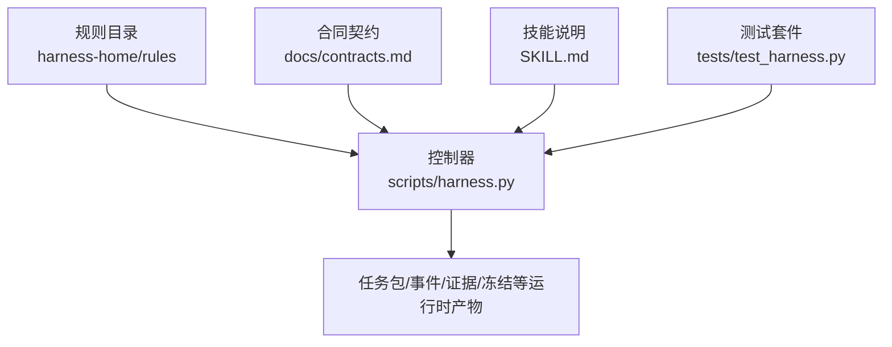
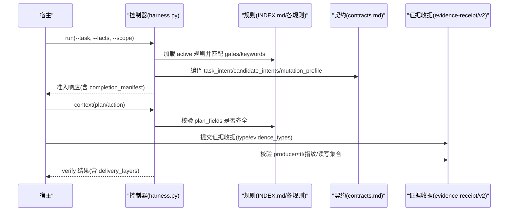
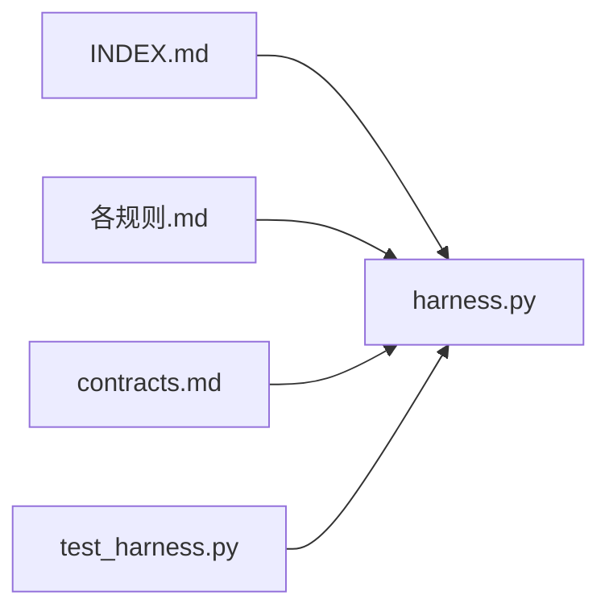

# 规则开发指南

<cite>
**本文引用的文件**   
- [harness.py](file://scripts/harness.py)
- [_rule-template.md](file://harness-home/rules/_rule-template.md)
- [INDEX.md](file://harness-home/rules/INDEX.md)
- [api-compatibility.md](file://harness-home/rules/api-compatibility.md)
- [documentation-changes.md](file://harness-home/rules/documentation-changes.md)
- [external-input-security.md](file://harness-home/rules/external-input-security.md)
- [testing-release.md](file://harness-home/rules/testing-release.md)
- [release-authorization-rollback.md](file://harness-home/rules/release-authorization-rollback.md)
- [scope-change-readmission.md](file://harness-home/rules/scope-change-readmission.md)
- [ui-complete-states.md](file://harness-home/rules/ui-complete-states.md)
- [contracts.md](file://docs/contracts.md)
- [SKILL.md](file://SKILL.md)
- [test_harness.py](file://tests/test_harness.py)
</cite>

## 目录
1. [引言](#引言)
2. [项目结构](#项目结构)
3. [核心组件](#核心组件)
4. [架构总览](#架构总览)
5. [详细组件分析](#详细组件分析)
6. [依赖关系分析](#依赖关系分析)
7. [性能考量](#性能考量)
8. [故障排查指南](#故障排查指南)
9. [结论](#结论)
10. [附录](#附录)

## 引言
本指南面向 Docs Harness 的规则开发者，系统化说明规则模板结构、元数据字段与配置项、规则逻辑实现方式、从需求到实现的完整流程、最佳实践与常见陷阱，以及规则与意图编译、风险评估、证据收集等系统组件的集成方式。读者可据此编写有效的检查规则与业务逻辑规则，并保证与控制器契约一致。

## 项目结构
- 规则定义位于 harness-home/rules 目录，包含通用规则快照与索引。
- 控制器脚本 scripts/harness.py 负责任务准入、意图编译、Gate 判定、上下文加载、证据校验与验收。
- 合同文档 docs/contracts.md 描述 v2 任务包、证据收据、Git 状态、验收层等关键契约。
- SKILL.md 提供高层使用要点与命令入口。
- tests/test_harness.py 覆盖安装、规则自检、Git 预检/后检、意图与 Gate 行为等。

图表来源 
- [harness.py](file://scripts/harness.py)
- [contracts.md](file://docs/contracts.md)
- [SKILL.md](file://SKILL.md)
- [test_harness.py](file://tests/test_harness.py)

章节来源
- [INDEX.md](file://harness-home/rules/INDEX.md)
- [harness.py](file://scripts/harness.py)
- [contracts.md](file://docs/contracts.md)
- [SKILL.md](file://SKILL.md)
- [test_harness.py](file://tests/test_harness.py)

## 核心组件
- 规则模板与索引：_rule-template.md 定义规则元数据与正文结构；INDEX.md 维护生效规则清单与激活条件。
- 控制器与契约：harness.py 实现规则加载、指纹校验、Gate 匹配、意图编译、证据与验收流程；contracts.md 定义 v2 任务包、证据收据、Git 状态、验收层等。
- 测试与自检：test_harness.py 验证规则安装、指纹一致性、self-test、Git 预检/后检、意图与 Gate 行为等。

章节来源
- [_rule-template.md](file://harness-home/rules/_rule-template.md)
- [INDEX.md](file://harness-home/rules/INDEX.md)
- [harness.py](file://scripts/harness.py)
- [contracts.md](file://docs/contracts.md)
- [test_harness.py](file://tests/test_harness.py)

## 架构总览
规则在“需求→方案→执行→证据→验收”的全链路中发挥作用：
- 需求阶段：宿主提交 gate_assessment（可选），控制器按安全底线强制合并 Gate。
- 方案阶段：规则声明 plan_fields，要求方案补齐必要字段。
- 执行阶段：控制器根据意图与范围生成 allowed_actions，必要时进入 planned/extended 路线。
- 证据阶段：规则声明 evidence_types，控制器校验证据收据与可信生产者。
- 验收阶段：控制器按 completion-manifest 与 delivery_layers 逐项验收。

图表来源 
- [harness.py](file://scripts/harness.py)
- [contracts.md](file://docs/contracts.md)
- [INDEX.md](file://harness-home/rules/INDEX.md)

章节来源
- [harness.py](file://scripts/harness.py)
- [contracts.md](file://docs/contracts.md)

## 详细组件分析

### 规则模板与元数据字段
- 模板位置：_rule-template.md
- 关键字段说明：
  - status：规则状态，active 表示生效；scaffold 表示脚手架。
  - rule_id：唯一规则标识，需遵循 DH-前缀命名规范。
  - content_fingerprint：规则正文的 sha256 指纹，用于变更检测与失败关闭。
  - gates：触发的风险 Gate（如 architecture-contract、security-sensitive 等）。
  - keywords：关键词列表，辅助 Gate 推断与匹配。
  - plan_fields：要求方案必须填写的字段名集合。
  - evidence_types：需要提供的证据类型集合。
  - failure_mode：失败处理策略，通常要求停止并重新准入或补齐。

章节来源
- [_rule-template.md](file://harness-home/rules/_rule-template.md)
- [INDEX.md](file://harness-home/rules/INDEX.md)

### 规则索引与激活条件
- INDEX.md 维护 active_rules 列表与规则文件清单。
- 激活条件：仅 status: active、rule_id 唯一、content_fingerprint 正确且合同字段完整的规则才能进入任务包。
- 加载约定：安装时复制固定快照，记录逐文件指纹；缺失、增加或变化均失败关闭。

章节来源
- [INDEX.md](file://harness-home/rules/INDEX.md)

### Gate 系统与风险评估
- GATE_ORDER 与 GATE_DEFS 定义 Gate 顺序与语义（产品、架构、安全、破坏性数据、发布外部、前端设计、诊断修复、测试验收、审查审计、代码编辑、文档编辑）。
- SAFETY_FLOOR_GATES 为安全底线 Gate（security-sensitive、destructive-data、release-external），不可豁免。
- 宿主可通过 facts.gate_assessment 声明 Gate 并给出 rationale；未声明时回退关键词推断。

章节来源
- [harness.py](file://scripts/harness.py)
- [contracts.md](file://docs/contracts.md)

### 意图编译与范围控制
- TASK_INTENTS 与 INTENT_PATTERNS 定义受控意图及自然语言模式映射。
- MUTATION_PROFILES 与 INTENT_MUTATION 将意图映射为变更面（read_only、git_metadata_write、workspace_write、external_write）。
- 路径范围只接受相对路径、glob 或受控 Git 资源；自然语言边界返回 invalid_scope_description。

章节来源
- [harness.py](file://scripts/harness.py)
- [contracts.md](file://docs/contracts.md)

### 证据体系与验收层
- evidence-receipt/v2 绑定 task_id、target_identity、package_fingerprint、producer、cwd、时间戳、ttl、exit_code、digest、read_set/write_set 等。
- verification 支持命令缓存与临时副产物容忍；auto_attribute_in_scope 可在范围内自动归因未证明写入。
- delivery_layers 明确 source/local_verification/git_head/remote_delivery/fresh_clone/release_artifact/ui/external_state 各层期望与状态。

章节来源
- [contracts.md](file://docs/contracts.md)
- [harness.py](file://scripts/harness.py)

### 规则示例解析
- API 兼容规则：gates=architecture-contract，plan_fields=兼容策略/迁移与回滚，evidence_types=contract_acceptance，failure_mode 强调消费者影响与回滚路径。
- 文档修改规则：gates=document-edit，plan_fields=文档真源/索引与残留，evidence_types=document_review，failure_mode 强调真源与死引用清理。
- 外部输入安全规则：gates=security-sensitive，plan_fields=安全边界/负向路径，evidence_types=security_acceptance，failure_mode 强调信任边界与失败关闭。
- 测试放行规则：gates=testing-acceptance，plan_fields=验收结果，evidence_types=test_result，failure_mode 强调测试层级与失败项闭合。
- 发布授权与回滚规则：gates=release-external，plan_fields=外部目标/发布与回滚，evidence_types=external_state，failure_mode 强调授权新鲜性与回滚能力。
- 范围变化重新判断规则：gates=review-audit，plan_fields=影响范围，evidence_types=review_result，failure_mode 强调范围变化立即停止并重新准入。
- UI 完整状态规则：gates=frontend-design，plan_fields=设计状态/真实页面验收，evidence_types=ui_acceptance，failure_mode 强调真实入口与可操作性。

章节来源
- [api-compatibility.md](file://harness-home/rules/api-compatibility.md)
- [documentation-changes.md](file://harness-home/rules/documentation-changes.md)
- [external-input-security.md](file://harness-home/rules/external-input-security.md)
- [testing-release.md](file://harness-home/rules/testing-release.md)
- [release-authorization-rollback.md](file://harness-home/rules/release-authorization-rollback.md)
- [scope-change-readmission.md](file://harness-home/rules/scope-change-readmission.md)
- [ui-complete-states.md](file://harness-home/rules/ui-complete-states.md)

### 规则逻辑实现方式
- 条件判断语法：通过 gates 与 keywords 组合触发；GATE_DEFS 中的 terms 与 NEGATION_MARKERS 确保精确匹配与否定守卫。
- 数据获取方法：控制器读取 rules_root 下的 .md 文件，计算 content_fingerprint 并与 INDEX 比对；按需加载 project facts 与 knowledge map。
- 结果生成机制：规则不直接生成代码，而是通过 plan_fields 约束方案、evidence_types 约束证据、failure_mode 指导失败处理；控制器据此决定准入状态与验收流程。

章节来源
- [harness.py](file://scripts/harness.py)
- [INDEX.md](file://harness-home/rules/INDEX.md)

### 从需求到实现的开发流程
- 需求分析：明确任务意图、范围与风险 Gate，必要时提交 gate_assessment。
- 规则设计：选择或新增规则，完善元数据字段与正文结构，确保 plan_fields 与 evidence_types 与任务目标对齐。
- 方案编写：按 plan_fields 补齐背景、目标、非目标、成功标准、执行内容、验收结果等。
- 执行与证据：控制器生成 allowed_actions 与 write_scope；宿主提交证据收据，确保 producer 可信、指纹有效、读写集合准确。
- 验收与闭环：控制器按 completion-manifest 与 delivery_layers 逐项验收；如需增量准入，按 contract_delta 补充。

章节来源
- [contracts.md](file://docs/contracts.md)
- [SKILL.md](file://SKILL.md)
- [harness.py](file://scripts/harness.py)

### 最佳实践与常见陷阱
- 最佳实践：
  - 使用最小必要 Gate，避免宽泛关键词导致误判。
  - 在 plan_fields 中明确真源、索引、回滚路径与安全边界。
  - 证据收据务必绑定 package_fingerprint 与 target_identity，确保时效与可信生产者。
  - 对高风险 Gate（安全、破坏性数据、发布外部）采用精确词表与否定守卫。
- 常见陷阱：
  - 规则指纹漂移或 INDEX 不一致导致失败关闭。
  - 自然语言范围描述被拒绝，应使用路径/glob。
  - 证据过期、跨任务复用或 producer 不可信导致拒绝。
  - 忘记声明 plan_fields 导致准入阻塞。

章节来源
- [harness.py](file://scripts/harness.py)
- [contracts.md](file://docs/contracts.md)
- [test_harness.py](file://tests/test_harness.py)

## 依赖关系分析
- 控制器依赖规则索引与规则文件，依赖契约文档定义的数据结构与校验逻辑。
- 测试套件依赖控制器模块与规则目录，验证安装、自检、Git 预检/后检、意图与 Gate 行为。
- 规则之间无直接耦合，通过 INDEX.md 统一管理与激活。

图表来源 
- [INDEX.md](file://harness-home/rules/INDEX.md)
- [harness.py](file://scripts/harness.py)
- [contracts.md](file://docs/contracts.md)
- [test_harness.py](file://tests/test_harness.py)

章节来源
- [INDEX.md](file://harness-home/rules/INDEX.md)
- [harness.py](file://scripts/harness.py)
- [contracts.md](file://docs/contracts.md)
- [test_harness.py](file://tests/test_harness.py)

## 性能考量
- 规则加载与指纹计算：控制器按 rules_root 扫描并计算指纹，建议保持规则数量稳定，避免频繁变更。
- 证据收据缓存：verification.command_cache_enabled 可启用命令缓存以减少重复执行。
- 知识构建与增量同步：knowledge bootstrap/incremental sync 按 change_scoped 模式降低全量扫描开销。

[本节为一般性指导，无需特定文件来源]

## 故障排查指南
- 规则缺失或指纹漂移：检查 rules_root 与 INDEX.md 的一致性，确保安装快照完整。
- 意图与范围无效：确认 read_scope/write_scope/git_scope 格式合法，避免自然语言描述。
- 证据拒绝：核对 producer、ttl、fingerprint、cwd、read_set/write_set 是否符合 v2 收据要求。
- Gate 误判：检查 gate_assessment 与关键词匹配，注意否定守卫与安全底线 Gate。

章节来源
- [test_harness.py](file://tests/test_harness.py)
- [contracts.md](file://docs/contracts.md)
- [harness.py](file://scripts/harness.py)

## 结论
Docs Harness 的规则体系以模板化元数据与契约化流程为核心，通过 Gate 与证据驱动的风险控制，确保任务从需求到验收的可审计与可追溯。开发者应遵循最小必要原则、精确匹配与严格校验，结合控制器与契约文档，编写高质量规则与方案，提升交付质量与安全性。

[本节为总结性内容，无需特定文件来源]

## 附录
- 常用命令参考：project init/run/context/verify/background/ledger 等，详见 SKILL.md。
- 契约速查：v2 任务包、证据收据、Git 状态、验收层等，详见 contracts.md。
- 测试用例：覆盖安装、自检、Git 预检/后检、意图与 Gate 行为等，详见 test_harness.py。

章节来源
- [SKILL.md](file://SKILL.md)
- [contracts.md](file://docs/contracts.md)
- [test_harness.py](file://tests/test_harness.py)