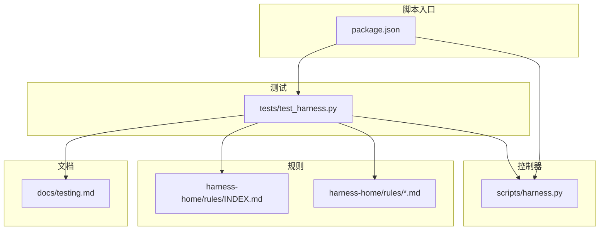
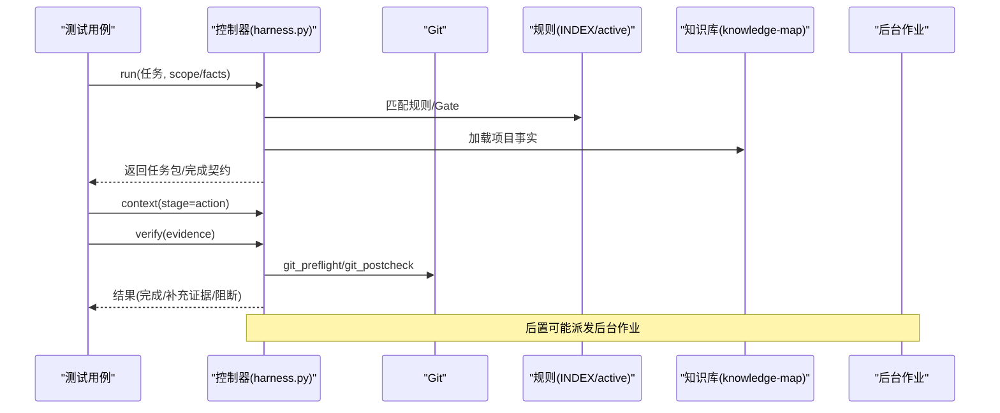
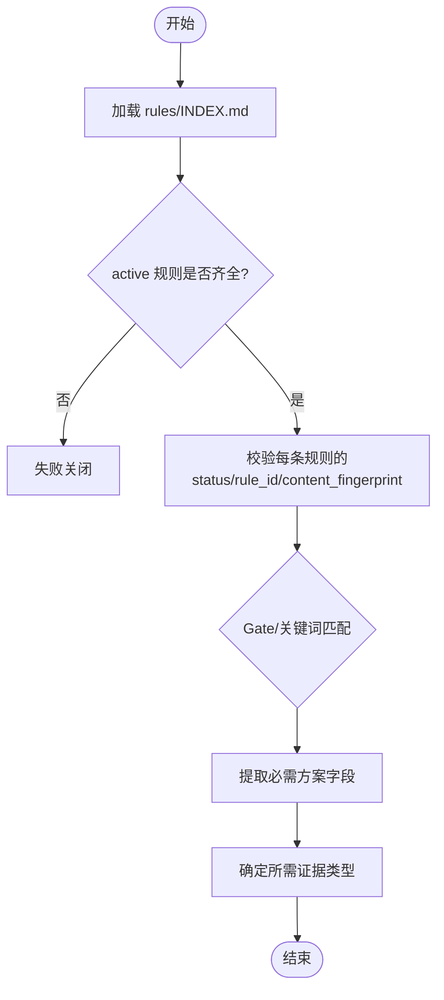
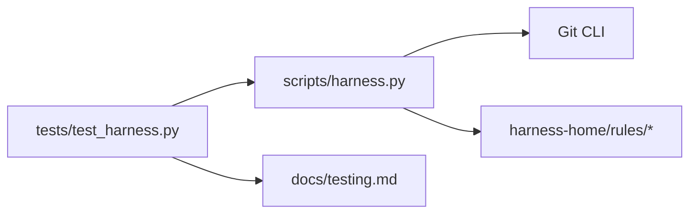

# 规则测试方法

<cite>
**本文引用的文件**   
- [tests/test_harness.py](file://tests/test_harness.py)
- [scripts/harness.py](file://scripts/harness.py)
- [harness-home/rules/INDEX.md](file://harness-home/rules/INDEX.md)
- [harness-home/rules/_rule-template.md](file://harness-home/rules/_rule-template.md)
- [harness-home/rules/api-compatibility.md](file://harness-home/rules/api-compatibility.md)
- [harness-home/rules/testing-release.md](file://harness-home/rules/testing-release.md)
- [package.json](file://package.json)
- [docs/testing.md](file://docs/testing.md)
</cite>

## 目录
1. [简介](#简介)
2. [项目结构](#项目结构)
3. [核心组件](#核心组件)
4. [架构总览](#架构总览)
5. [详细组件分析](#详细组件分析)
6. [依赖关系分析](#依赖关系分析)
7. [性能考量](#性能考量)
8. [故障排查指南](#故障排查指南)
9. [结论](#结论)
10. [附录](#附录)

## 简介
本文件面向 Docs Harness 的规则测试，提供从单元测试到集成与端到端测试的完整方法论。内容涵盖：
- 单元测试：模拟环境搭建、测试数据准备、断言验证
- 集成测试：与控制器、Git、知识基线、后台 Job 等组件交互
- 端到端测试：安装、升级、任务准入、证据校验、Git 预检/后检、工作区漂移检测
- 测试工具：框架配置、调试技巧、性能分析
- 用例设计：正常流程、边界条件、异常路径
- 自动化与持续集成：脚本入口、自检、打包检查

## 项目结构
- 测试入口与用例位于 tests/test_harness.py，覆盖控制器行为、规则加载、Git 操作、知识生命周期、后台作业等
- 控制器实现位于 scripts/harness.py，定义版本、常量、错误类型、Git 预检/后检、任务包/证据契约、背景作业状态机等
- 规则快照位于 harness-home/rules，包含 INDEX 与若干 active 规则（如 API 兼容、测试放行）
- 测试策略与验收分层说明在 docs/testing.md
- 测试与自检脚本通过 package.json 暴露 npm 命令

**图表来源** 
- [tests/test_harness.py](file://tests/test_harness.py)
- [scripts/harness.py](file://scripts/harness.py)
- [harness-home/rules/INDEX.md](file://harness-home/rules/INDEX.md)
- [docs/testing.md](file://docs/testing.md)
- [package.json](file://package.json)

**章节来源**
- [tests/test_harness.py](file://tests/test_harness.py)
- [scripts/harness.py](file://scripts/harness.py)
- [harness-home/rules/INDEX.md](file://harness-home/rules/INDEX.md)
- [docs/testing.md](file://docs/testing.md)
- [package.json](file://package.json)

## 核心组件
- 测试夹具与运行器
  - 临时项目目录、子进程调用控制器、JSON 载荷解析、快照对比、证据构造、质量评审构造、Git 远端初始化、提交封装
- 控制器常量与契约
  - 版本、任务/证据/冻结/授权等 schema 名称、意图与变更等级映射、Gate 定义、计划字段、知识模板、Git 预检/后检、遥测事件约束
- 规则体系
  - 索引与激活规则清单、规则模板、具体规则（API 兼容、测试放行）
- 测试策略
  - 自动化入口、验收分层、事实来源

**章节来源**
- [tests/test_harness.py](file://tests/test_harness.py)
- [scripts/harness.py](file://scripts/harness.py)
- [harness-home/rules/_rule-template.md](file://harness-home/rules/_rule-template.md)
- [harness-home/rules/api-compatibility.md](file://harness-home/rules/api-compatibility.md)
- [harness-home/rules/testing-release.md](file://harness-home/rules/testing-release.md)
- [docs/testing.md](file://docs/testing.md)

## 架构总览
Docs Harness 以“意图优先、证据可复用、失败关闭”为核心原则。测试围绕以下关键流展开：
- 任务准入：run → 意图识别 → Gate 匹配 → 计划要求 → 完成契约
- 上下文加载：context → 阶段化缓存 → 项目事实引用
- 执行与证据：写工作区 → 生成证据 → verify 校验
- Git 安全：预检快照 → 执行 → 后检比对 → 漂移告警/阻断
- 知识生命周期：审计 → 同意 → 派发 → 进度 → 验证
- 后台作业：估计 → 派发 → 运行 → 重试 → 终止

**图表来源** 
- [scripts/harness.py](file://scripts/harness.py)
- [tests/test_harness.py](file://tests/test_harness.py)
- [harness-home/rules/INDEX.md](file://harness-home/rules/INDEX.md)

## 详细组件分析

### 单元测试编写方法
- 模拟环境搭建
  - 使用临时目录隔离项目；通过子进程调用控制器并解析 JSON 输出；必要时初始化 Git 仓库与远端
  - 示例参考：临时项目创建、子进程运行、Git 远端初始化、提交封装
- 测试数据准备
  - 构造证据文件、质量评审、计划文件、知识评估与同意、后台候选与工作包
  - 示例参考：evidence、quality_review、plan_for、complete_code_task、force_complex_background_job
- 断言验证
  - 对返回码、状态码、admission_status、mutation_profile、matched_gates、write_scope、git_scope、completion_manifest、post_completion、background_jobs、reason_code 等进行断言
  - 示例参考：v15 系列用例对意图、范围、Git 预检/后检、漂移、遥测、迁移等的断言

**章节来源**
- [tests/test_harness.py](file://tests/test_harness.py)

### 集成测试策略
- 与控制器交互
  - 通过 run/context/verify/task/knowledge/background/project 等子命令串联多阶段流程
- 与 Git 交互
  - 预检快照、远端引用一致性、fast-forward、脏工作区、LFS/Submodule 可用性、非快进合并、分支删除审计
- 与知识系统交互
  - 审计/同意/派发/进度/验证、增量同步、基线重建、并发漂移、越界写入
- 与后台作业交互
  - 估计、派发、运行、进度、重试、最大尝试次数、复杂路由、依赖等待

**章节来源**
- [tests/test_harness.py](file://tests/test_harness.py)
- [scripts/harness.py](file://scripts/harness.py)

### 端到端测试策略
- 安装与升级
  - init/upgrade/preserve-and-merge、版本标记迁移、幂等性、克隆就绪、行尾差异容忍
- 任务全链路
  - 直接路由、规则匹配、上下文缓存命中、完成契约、证据绑定与过期、跨包拒绝、不可信生产者
- 安全与合规
  - 高风风险漂移阻断、未归因重叠阻断、只读安全审计保留风险门、Git 元数据写入限定

**章节来源**
- [tests/test_harness.py](file://tests/test_harness.py)
- [scripts/harness.py](file://scripts/harness.py)

### 测试工具使用指南
- 框架配置
  - 使用 Python unittest discover，按 tests 目录扫描 test_*.py
  - 自定义环境变量禁用字节码写入，确保输出稳定
- 调试技巧
  - 打印子进程 stdout/stderr；断言失败时附带输出；使用 snapshot_tree 对比文件系统
  - 针对 Git 命令超时/不可用进行 mock 注入
- 性能分析
  - 关注 bounded_project_inventory、scan_file_limit、score_bucket、事件遥测字段上限与去重

**章节来源**
- [package.json](file://package.json)
- [tests/test_harness.py](file://tests/test_harness.py)
- [scripts/harness.py](file://scripts/harness.py)

### 有效用例设计要点
- 正常流程
  - 直接路由、read_only 查询、git_inspect、git_fetch、git_sync（快进）、证据闭环
- 边界条件
  - 空规则目录、无 active 规则、隐藏目录作用域、Windows PowerShell 路径规范化、非快进合并、脏工作区重叠、LFS/Submodule 不可用
- 异常情况
  - 证据过期、跨包绑定、不可信生产者、legacy 证据不被接受、遥测回滚检查、最大重试次数耗尽

**章节来源**
- [tests/test_harness.py](file://tests/test_harness.py)

### 完整测试示例（模式级）
- 代码任务闭环
  - run → context(action) → 写文件 → evidence(test_result) → verify → 断言完成与后置作业
- Git 同步全流程
  - facts(git_scope) → run → plan → 执行 merge → verify → 断言 changed_paths 与 git_postcheck
- 知识更新流水线
  - audit → consent → dispatch → running → progress(completed) → verify(assessment) → 断言 knowledge_status

**章节来源**
- [tests/test_harness.py](file://tests/test_harness.py)

### 规则测试模式
- 规则索引与激活
  - 校验 active_rules 列表与 INDEX.md 一致；每个规则文件具备 status: active、唯一 rule_id、content_fingerprint
- 规则模板
  - 新规则需遵循 _rule-template.md 的结构（status/rule_id/gates/keywords/plan_fields/evidence_types/failure_mode）
- 典型规则
  - API 兼容：architecture-contract Gate，需要 contract_acceptance 证据
  - 测试放行：testing-acceptance Gate，需要 test_result 证据

**图表来源** 
- [harness-home/rules/INDEX.md](file://harness-home/rules/INDEX.md)
- [harness-home/rules/_rule-template.md](file://harness-home/rules/_rule-template.md)
- [harness-home/rules/api-compatibility.md](file://harness-home/rules/api-compatibility.md)
- [harness-home/rules/testing-release.md](file://harness-home/rules/testing-release.md)

**章节来源**
- [harness-home/rules/INDEX.md](file://harness-home/rules/INDEX.md)
- [harness-home/rules/_rule-template.md](file://harness-home/rules/_rule-template.md)
- [harness-home/rules/api-compatibility.md](file://harness-home/rules/api-compatibility.md)
- [harness-home/rules/testing-release.md](file://harness-home/rules/testing-release.md)

## 依赖关系分析
- 测试对控制器的依赖
  - 通过子进程调用 scripts/harness.py，解析 JSON 输出，断言状态机流转
- 控制器对 Git 的依赖
  - 预检/后检、refs 快照、远端 URL 脱敏、LFS/Submodule 探测
- 控制器对规则的依赖
  - 读取 INDEX 与 active 规则，匹配 Gate/关键词，生成 plan_fields 与 evidence_types
- 测试对文档的依赖
  - 依据 docs/testing.md 的验收分层组织用例覆盖

**图表来源** 
- [tests/test_harness.py](file://tests/test_harness.py)
- [scripts/harness.py](file://scripts/harness.py)
- [harness-home/rules/INDEX.md](file://harness-home/rules/INDEX.md)
- [docs/testing.md](file://docs/testing.md)

**章节来源**
- [tests/test_harness.py](file://tests/test_harness.py)
- [scripts/harness.py](file://scripts/harness.py)
- [harness-home/rules/INDEX.md](file://harness-home/rules/INDEX.md)
- [docs/testing.md](file://docs/testing.md)

## 性能考量
- 输入限制
  - 文件读取大小限制、JSON 行数与对象合法性校验、事件日志限长与去重
- 扫描与评分
  - bounded_project_inventory 限制扫描规模；score_bucket 将规模映射为分数区间；当超过阈值时强制切换执行路由
- 缓存与幂等
  - context 阶段内 content_set 指纹缓存；knowledge job 基线重建避免重复计算

**章节来源**
- [scripts/harness.py](file://scripts/harness.py)
- [tests/test_harness.py](file://tests/test_harness.py)

## 故障排查指南
- 常见错误码与原因
  - invalid_scope_description、git_remote_unavailable、git_sync_scope_ambiguous、untrusted_evidence_producer、evidence_expired、legacy_evidence_not_accepted、max_attempts_reached、source_version_inconsistent
- 定位步骤
  - 查看子进程 stdout/stderr；检查 JSON 载荷字段；核对 Git refs 快照与 diff；确认证据 covers 与 producer；检查 knowledge 同意与允许范围
- 恢复建议
  - 修正 scope/facts；刷新 read_set 指纹；重新提交或清理工作区；按提示进行人工迁移或同意

**章节来源**
- [tests/test_harness.py](file://tests/test_harness.py)
- [scripts/harness.py](file://scripts/harness.py)

## 结论
通过严格的单元测试、集成测试与端到端测试，结合控制器契约、Git 安全机制与知识生命周期管理，Docs Harness 的规则测试能够全面覆盖正常流程、边界条件与异常路径。配合清晰的测试工具链与自动化脚本，可在 CI 中稳定执行自检与回归，保障规则与控制器演进的可靠性。

## 附录
- 自动化入口
  - 完整回归：npm test
  - 控制器自检：npm run self-test
  - 发布包清单：npm run pack:check
- 验收分层
  - 源码层、临时项目层、后台控制面专项、工作量专项、文档路由专项、安装升级专项、下游层

**章节来源**
- [package.json](file://package.json)
- [docs/testing.md](file://docs/testing.md)