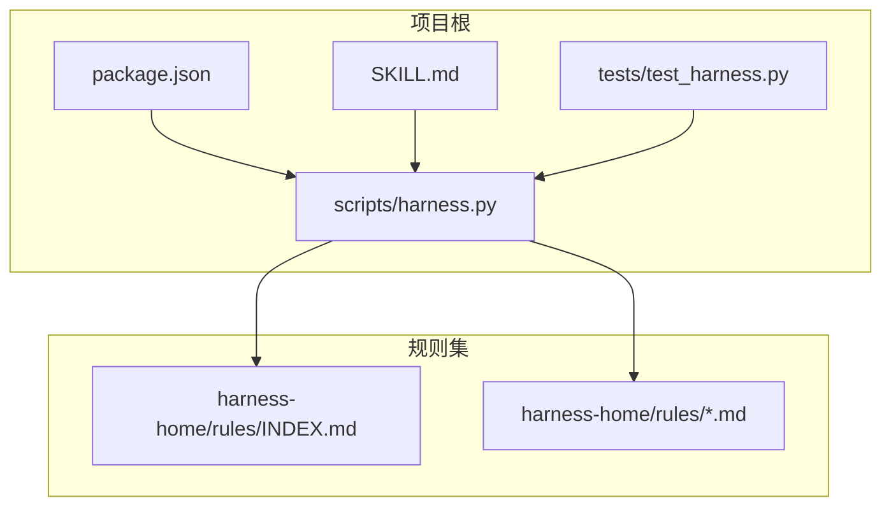
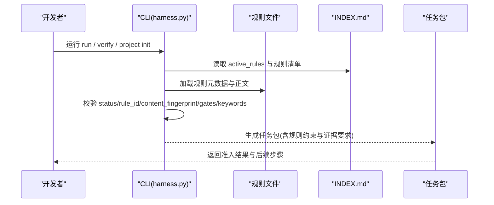
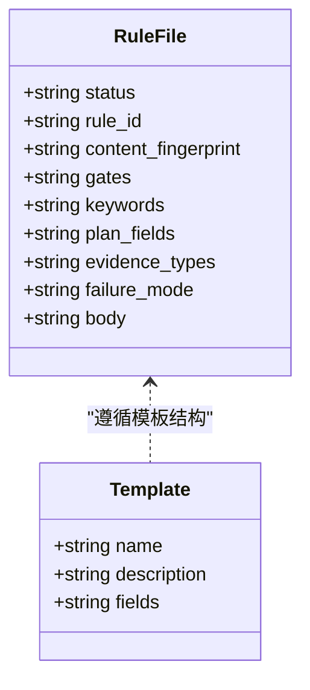
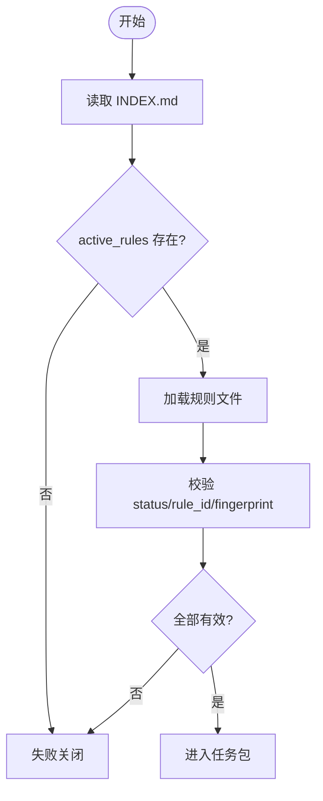
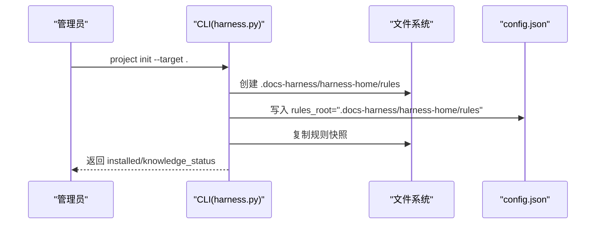
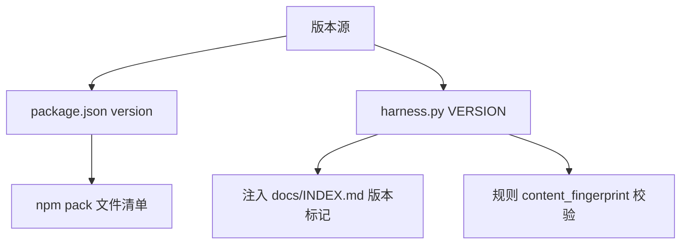
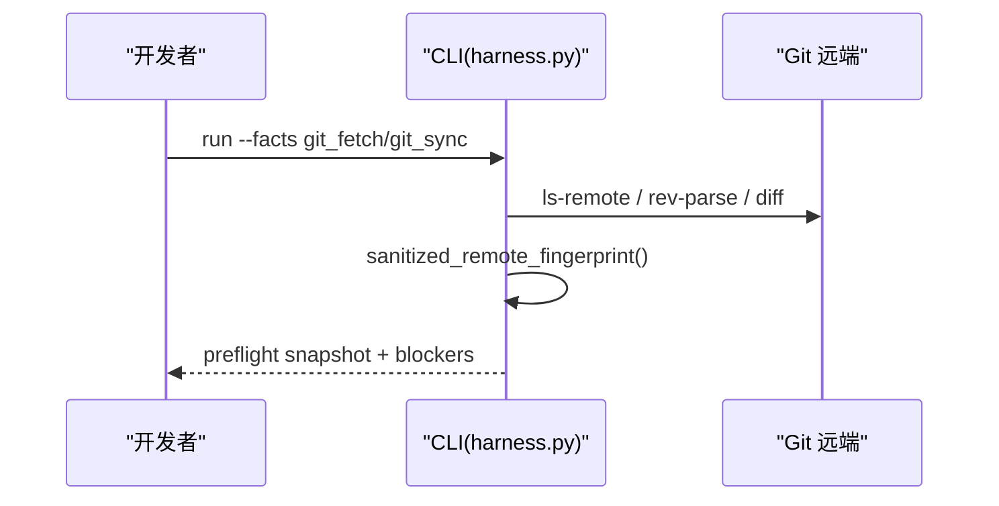
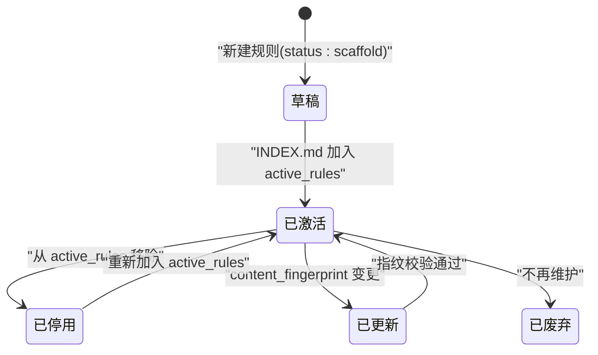
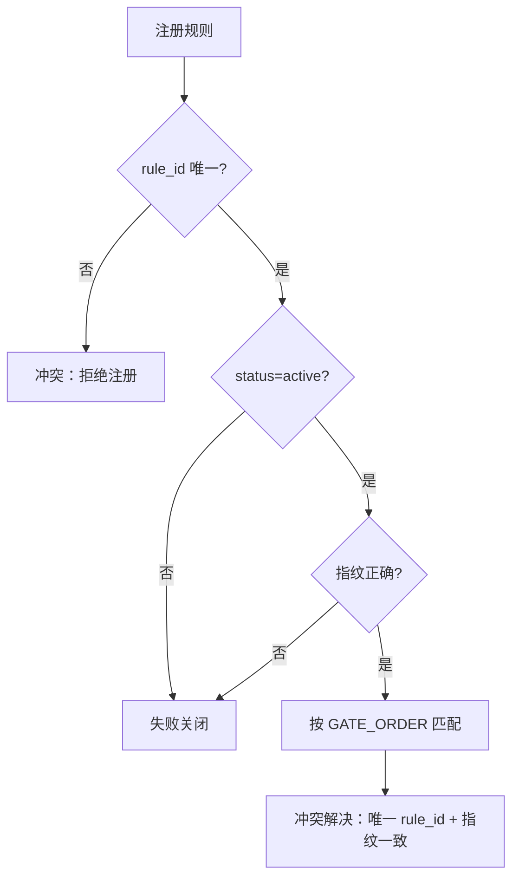
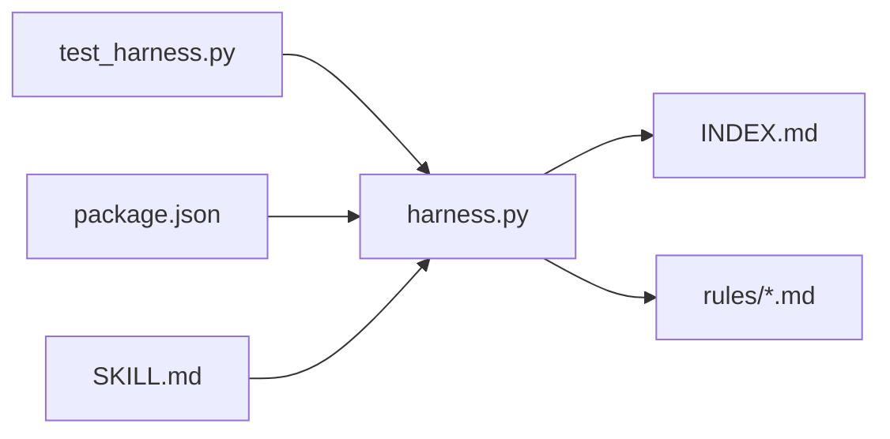

# 规则部署管理

<cite>
**本文引用的文件**   
- [harness.py](file://scripts/harness.py)
- [INDEX.md](file://harness-home/rules/INDEX.md)
- [_rule-template.md](file://harness-home/rules/_rule-template.md)
- [api-compatibility.md](file://harness-home/rules/api-compatibility.md)
- [documentation-changes.md](file://harness-home/rules/documentation-changes.md)
- [testing-release.md](file://harness-home/rules/testing-release.md)
- [external-input-security.md](file://harness-home/rules/external-input-security.md)
- [package.json](file://package.json)
- [SKILL.md](file://SKILL.md)
- [test_harness.py](file://tests/test_harness.py)
</cite>

## 目录
1. [简介](#简介)
2. [项目结构](#项目结构)
3. [核心组件](#核心组件)
4. [架构总览](#架构总览)
5. [详细组件分析](#详细组件分析)
6. [依赖关系分析](#依赖关系分析)
7. [性能考虑](#性能考虑)
8. [故障排除指南](#故障排除指南)
9. [结论](#结论)
10. [附录：部署示例与清单](#附录部署示例与清单)

## 简介
本管理文档面向 Docs Harness 的规则（Rule）打包、版本控制、分发、生命周期与索引配置，以及生产环境部署策略。内容基于仓库中的控制器脚本、规则快照与测试用例，覆盖以下主题：
- 规则的打包格式与版本控制策略（版本号管理与变更追踪）
- 规则的分发机制（本地部署、远程仓库管理与依赖解析）
- 规则的生命周期管理（激活、停用、更新与废弃流程）
- 规则索引的配置方法（规则注册、优先级设置与冲突解决）
- 生产环境的部署策略（灰度发布、回滚机制与监控告警）
- 完整的部署示例与故障排除指南

## 项目结构
Docs Harness 的规则位于 harness-home/rules 目录，以 Markdown 文件形式提供，并通过 INDEX.md 声明生效规则与加载约定。控制器脚本 scripts/harness.py 负责规则加载、指纹校验、安装路径计算与任务准入。



图表来源 
- [harness.py:1-100](file://scripts/harness.py#L1-L100)
- [INDEX.md:1-41](file://harness-home/rules/INDEX.md#L1-L41)

章节来源
- [harness.py:1-100](file://scripts/harness.py#L1-L100)
- [package.json:1-23](file://package.json#L1-L23)
- [SKILL.md:1-105](file://SKILL.md#L1-L105)
- [test_harness.py:1-120](file://tests/test_harness.py#L1-L120)

## 核心组件
- 规则定义文件：每个规则为独立 Markdown 文件，包含元数据（status、rule_id、content_fingerprint、gates、keywords、plan_fields、evidence_types、failure_mode）。
- 规则索引：INDEX.md 声明当前生效规则列表、规则文件清单、激活条件与加载约定。
- 控制器：harness.py 实现规则加载、指纹校验、安装路径计算、任务准入与证据绑定等。
- 包元数据：package.json 描述包名、版本与打包范围；SKILL.md 提供技能说明与安装入口。
- 测试用例：验证规则集合一致性、指纹完整性与 self-test 通过性。

章节来源
- [harness.py:2049-2096](file://scripts/harness.py#L2049-L2096)
- [harness.py:2223-2240](file://scripts/harness.py#L2223-L2240)
- [INDEX.md:1-41](file://harness-home/rules/INDEX.md#L1-L41)
- [_rule-template.md:1-21](file://harness-home/rules/_rule-template.md#L1-L21)
- [package.json:1-23](file://package.json#L1-L23)
- [SKILL.md:1-105](file://SKILL.md#L1-L105)
- [test_harness.py:339-354](file://tests/test_harness.py#L339-L354)

## 架构总览
规则系统由“规则定义 + 索引 + 控制器”构成。控制器在任务执行前加载并校验规则，确保只有满足状态、ID 唯一、指纹正确且合同字段完整的规则进入任务包。



图表来源 
- [harness.py:2223-2240](file://scripts/harness.py#L2223-L2240)
- [INDEX.md:1-41](file://harness-home/rules/INDEX.md#L1-L41)

## 详细组件分析

### 规则文件格式与模板
- 元数据字段：status（scaffold/active）、rule_id（DH-XXX）、content_fingerprint（sha256:...）、gates（如 architecture-contract）、keywords（匹配关键词）、plan_fields（必需方案字段）、evidence_types（验收证据类型）、failure_mode（失败处理方式）。
- 模板文件 _rule-template.md 提供标准结构，便于新增规则时保持一致性。



图表来源 
- [_rule-template.md:1-21](file://harness-home/rules/_rule-template.md#L1-L21)
- [api-compatibility.md:1-29](file://harness-home/rules/api-compatibility.md#L1-L29)

章节来源
- [_rule-template.md:1-21](file://harness-home/rules/_rule-template.md#L1-L21)
- [api-compatibility.md:1-29](file://harness-home/rules/api-compatibility.md#L1-L29)
- [documentation-changes.md:1-29](file://harness-home/rules/documentation-changes.md#L1-L29)
- [testing-release.md:1-29](file://harness-home/rules/testing-release.md#L1-L29)
- [external-input-security.md:1-29](file://harness-home/rules/external-input-security.md#L1-L29)

### 规则索引与激活条件
- INDEX.md 声明 active_rules 列表与规则文件清单。
- 激活条件：仅 status=active、rule_id 唯一、正文指纹正确且合同字段完整方可进入任务包。
- 加载约定：安装时复制固定规则快照，记录逐文件指纹；缺失、增加或变化均失败关闭，需通过来源包升级或人工 preserve-and-merge。



图表来源 
- [INDEX.md:1-41](file://harness-home/rules/INDEX.md#L1-L41)
- [harness.py:2223-2240](file://scripts/harness.py#L2223-L2240)

章节来源
- [INDEX.md:1-41](file://harness-home/rules/INDEX.md#L1-L41)
- [harness.py:2223-2240](file://scripts/harness.py#L2223-L2240)

### 规则分发与本地部署
- 安装路径：rules_root 必须为项目内相对路径，默认使用 .docs-harness/harness-home/rules。
- 可移植安装：portable_install_paths 将规则名称映射到可移植路径，结合 knowledge_delivery_paths 形成最终清单。
- 自检与一致性：测试用例验证 shipped rules 与 active rules 一致，self-test 通过。



图表来源 
- [harness.py:2049-2096](file://scripts/harness.py#L2049-L2096)
- [test_harness.py:356-376](file://tests/test_harness.py#L356-L376)

章节来源
- [harness.py:2049-2096](file://scripts/harness.py#L2049-L2096)
- [test_harness.py:356-376](file://tests/test_harness.py#L356-L376)

### 版本控制与变更追踪
- 控制器版本：VERSION="1.6.6"，用于知识骨架与管理标记。
- 包版本：package.json 中 version="1.6.5"，files 指定打包范围。
- 规则指纹：content_fingerprint 为 sha256 值，用于变更检测与失败关闭。
- 版本注入：知识索引中插入 managed-version 标记，包含当前 VERSION。



图表来源 
- [harness.py:26-38](file://scripts/harness.py#L26-L38)
- [package.json:1-23](file://package.json#L1-L23)
- [harness.py:357-363](file://scripts/harness.py#L357-L363)

章节来源
- [harness.py:26-38](file://scripts/harness.py#L26-L38)
- [package.json:1-23](file://package.json#L1-L23)
- [harness.py:357-363](file://scripts/harness.py#L357-L363)

### 远程仓库管理与依赖解析
- 远端指纹：sanitized_remote_fingerprint 去除凭据与查询片段，保证远端标识稳定。
- Git 预检：git_preflight_contract 检查 LFS、Submodule、fast-forward、删除数量阈值与工作区脏状态。
- 依赖解析：DELIVERY_LAYER_ORDER 定义交付层顺序（source/local_verification/git_head/remote_delivery/fresh_clone/release_artifact/ui/external_state），按层限制与验证。



图表来源 
- [harness.py:588-613](file://scripts/harness.py#L588-L613)
- [harness.py:680-794](file://scripts/harness.py#L680-L794)
- [harness.py:146-178](file://scripts/harness.py#L146-L178)

章节来源
- [harness.py:588-613](file://scripts/harness.py#L588-L613)
- [harness.py:680-794](file://scripts/harness.py#L680-L794)
- [harness.py:146-178](file://scripts/harness.py#L146-L178)

### 生命周期管理（激活、停用、更新、废弃）
- 激活：INDEX.md active_rules 列出规则 ID；规则文件 status=active 且指纹正确。
- 停用：从 active_rules 移除并保留历史快照；若需恢复则通过来源包升级或人工合并。
- 更新：修改规则文件后重新计算 content_fingerprint，并在 INDEX.md 同步；控制器校验失败关闭。
- 废弃：停止纳入 active_rules，归档至历史；必要时通过 preserve-and-merge 迁移。



图表来源 
- [INDEX.md:1-41](file://harness-home/rules/INDEX.md#L1-L41)
- [harness.py:2223-2240](file://scripts/harness.py#L2223-L2240)

章节来源
- [INDEX.md:1-41](file://harness-home/rules/INDEX.md#L1-L41)
- [harness.py:2223-2240](file://scripts/harness.py#L2223-L2240)

### 规则索引配置（注册、优先级、冲突解决）
- 注册：在 INDEX.md 的 active_rules 中添加 rule_id，并确保对应规则文件存在且 status=active。
- 优先级：GATE_ORDER 定义 Gate 顺序（product-change → ... → document-edit），控制器按顺序匹配。
- 冲突解决：rule_id 必须唯一；content_fingerprint 不一致导致失败关闭；keywords 与 gates 组合决定匹配与风险等级。



图表来源 
- [harness.py:263-345](file://scripts/harness.py#L263-L345)
- [INDEX.md:1-41](file://harness-home/rules/INDEX.md#L1-L41)

章节来源
- [harness.py:263-345](file://scripts/harness.py#L263-L345)
- [INDEX.md:1-41](file://harness-home/rules/INDEX.md#L1-L41)

### 生产环境部署策略（灰度、回滚、监控）
- 灰度发布：通过分层交付（source/local_verification/git_head/...）逐步推进，未通过下一层则阻断。
- 回滚机制：规则快照与指纹锁定，异常时回退至上一版本快照；knowledge bootstrap 失败关闭。
- 监控告警：事件日志 events.jsonl、证据收据 evidence-index.json、后台作业 background jobs 状态监控；DELIVERY_LIMIT_DETAILS 提供失败原因提示。

```mermaid
graph TB
Subgraph["生产部署层"]
S["源码层"] --> LV["本地验证"]
LV --> GH["Git HEAD"]
GH --> RD["远端交付"]
RD --> FC["全新克隆"]
FC --> RA["发布产物"]
RA --> UI["界面验收"]
UI --> ES["外部状态"]
end
S -.-> M["监控与告警(events/evidence/jobs)"]
RA -.-> RB["回滚到快照"]
```

图表来源 
- [harness.py:146-178](file://scripts/harness.py#L146-L178)
- [harness.py:1048-1060](file://scripts/harness.py#L1048-L1060)
- [SKILL.md:59-89](file://SKILL.md#L59-L89)

章节来源
- [harness.py:146-178](file://scripts/harness.py#L146-L178)
- [harness.py:1048-1060](file://scripts/harness.py#L1048-L1060)
- [SKILL.md:59-89](file://SKILL.md#L59-L89)

## 依赖关系分析
- 控制器依赖规则索引与规则文件；测试用例依赖控制器模块与规则集合。
- package.json 定义包结构与脚本；SKILL.md 提供安装与使用说明。



图表来源 
- [harness.py:2049-2096](file://scripts/harness.py#L2049-L2096)
- [test_harness.py:1-120](file://tests/test_harness.py#L1-L120)
- [package.json:1-23](file://package.json#L1-L23)
- [SKILL.md:1-105](file://SKILL.md#L1-L105)

章节来源
- [harness.py:2049-2096](file://scripts/harness.py#L2049-L2096)
- [test_harness.py:1-120](file://tests/test_harness.py#L1-L120)
- [package.json:1-23](file://package.json#L1-L23)
- [SKILL.md:1-105](file://SKILL.md#L1-L105)

## 性能考虑
- 规则加载与指纹计算：对大型规则集建议增量校验，避免全量扫描。
- Git 操作超时与批量处理：git_command 支持超时参数，批量 refs 与 diff 应分页处理。
- 事件与证据文件：events.jsonl 与 evidence-index.json 采用追加与只读模式，避免频繁锁竞争。

[本节为通用指导，不直接分析具体文件]

## 故障排除指南
- 缺少规则或指纹不一致：检查 rules_root 路径与 INDEX.md 清单；重新安装或升级来源包。
- Git 预检失败：确认 LFS/Submodule 可用、工作区干净、目标分支 fast-forward。
- 任务被阻断：查看 blockers 与 DELIVERY_LIMIT_DETAILS，定位失败原因（如 remote_drift、dirty_workspace）。
- 自检失败：运行 self-test，核对 active rules 与 shipped rules 一致性。

章节来源
- [harness.py:2049-2096](file://scripts/harness.py#L2049-L2096)
- [harness.py:680-794](file://scripts/harness.py#L680-L794)
- [harness.py:146-178](file://scripts/harness.py#L146-L178)
- [test_harness.py:339-354](file://tests/test_harness.py#L339-L354)

## 结论
Docs Harness 的规则系统通过标准化文件、严格指纹校验与分层交付，实现了高可靠性的规则部署与管理。遵循本文档的打包、版本、分发与生命周期策略，可在生产环境中安全、可控地演进规则集。

[本节为总结，不直接分析具体文件]

## 附录：部署示例与清单
- 项目初始化：python3 scripts/harness.py project init --target <project> --json
- 规则自检：python3 scripts/harness.py self-test --target . --json
- 任务执行：python3 scripts/harness.py run --target . --task "<原始用户任务>" --json
- 证据验证：python3 scripts/harness.py verify --target . --task-id <task-id> --evidence <evidence.json> --json

章节来源
- [SKILL.md:13-55](file://SKILL.md#L13-L55)
- [package.json:17-21](file://package.json#L17-L21)
- [test_harness.py:339-354](file://tests/test_harness.py#L339-L354)