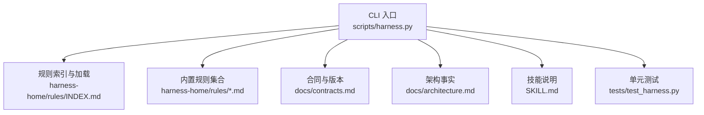
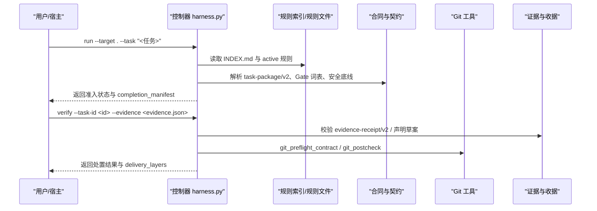
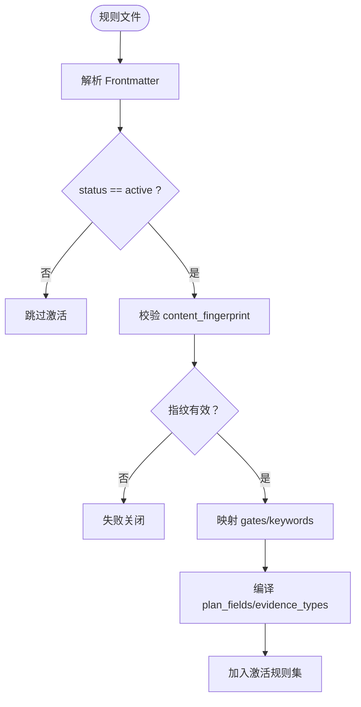
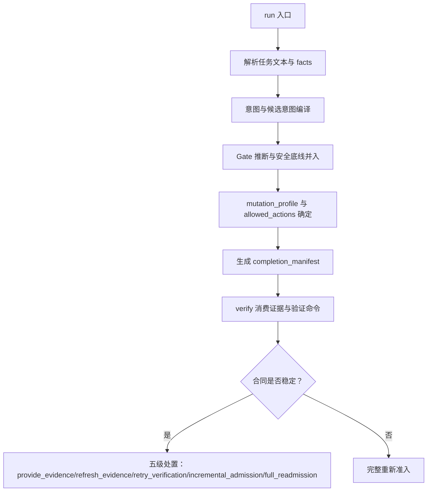
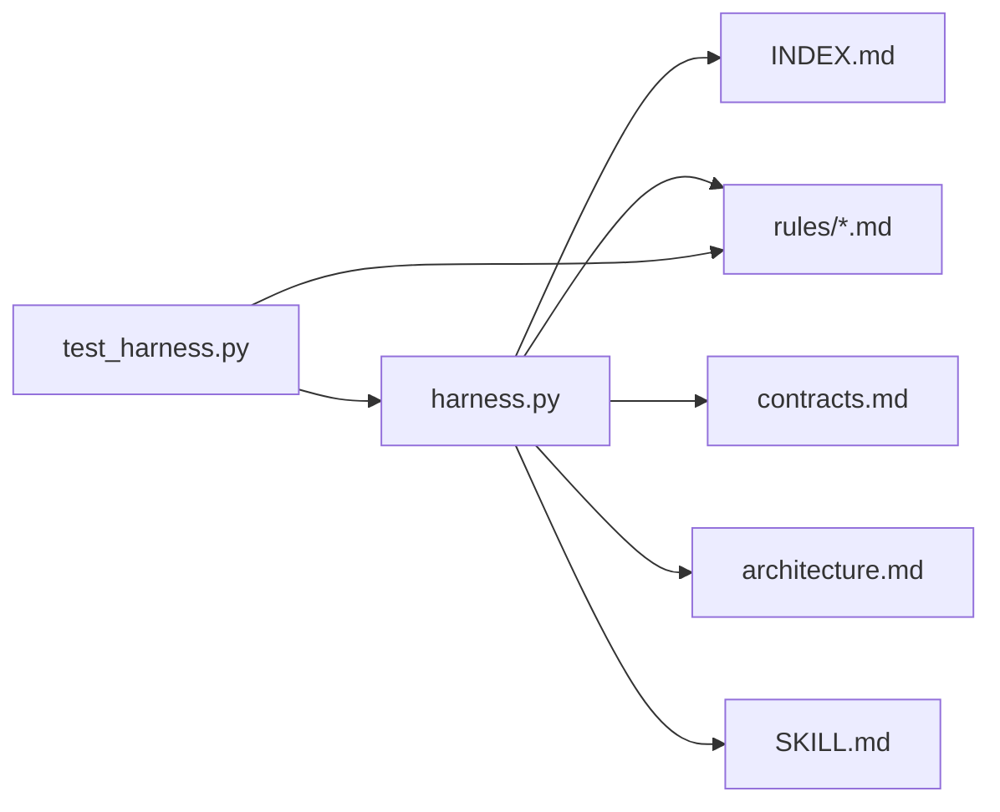

# 规则引擎

<cite>
**本文引用的文件**   
- [harness.py](file://scripts/harness.py)
- [INDEX.md](file://harness-home/rules/INDEX.md)
- [_rule-template.md](file://harness-home/rules/_rule-template.md)
- [api-compatibility.md](file://harness-home/rules/api-compatibility.md)
- [external-input-security.md](file://harness-home/rules/external-input-security.md)
- [testing-release.md](file://harness-home/rules/testing-release.md)
- [documentation-changes.md](file://harness-home/rules/documentation-changes.md)
- [ui-complete-states.md](file://harness-home/rules/ui-complete-states.md)
- [release-authorization-rollback.md](file://harness-home/rules/release-authorization-rollback.md)
- [scope-change-readmission.md](file://harness-home/rules/scope-change-readmission.md)
- [contracts.md](file://docs/contracts.md)
- [architecture.md](file://docs/architecture.md)
- [SKILL.md](file://SKILL.md)
- [test_harness.py](file://tests/test_harness.py)
</cite>

## 目录
1. [简介](#简介)
2. [项目结构](#项目结构)
3. [核心组件](#核心组件)
4. [架构总览](#架构总览)
5. [详细组件分析](#详细组件分析)
6. [依赖关系分析](#依赖关系分析)
7. [性能考量](#性能考量)
8. [故障排查指南](#故障排查指南)
9. [结论](#结论)
10. [附录](#附录)

## 简介
本文件为 Docs Harness 规则引擎的权威文档，面向使用者与规则作者，系统阐述规则定义语法、内置规则能力、自定义规则开发流程、执行引擎工作机制、配置与管理方式，以及完整的编写指南与常见问题。规则引擎以“失败关闭”为核心原则，通过 Gate（风险门）与证据契约约束任务准入与验收，确保变更可审计、可回滚、可验证。

## 项目结构
- 控制器与运行时：scripts/harness.py 提供 CLI、任务编排、证据校验、Git 预检/后检、知识治理与后台 Job 状态机。
- 规则集：harness-home/rules/ 包含受管规则快照与索引；安装时复制到目标项目的 .docs-harness/harness-home/rules/。
- 合同与架构：docs/contracts.md 描述 v2 任务包、证据收据、上下文与授权、Git 状态合同等；docs/architecture.md 说明运行态与交付边界。
- 技能说明：SKILL.md 给出安装、任务入口、验收与后台治理要点。
- 测试：tests/test_harness.py 覆盖规则激活、指纹校验、Git 行为、意图与范围判定等关键路径。

**图表来源** 
- [harness.py](file://scripts/harness.py)
- [INDEX.md](file://harness-home/rules/INDEX.md)
- [contracts.md](file://docs/contracts.md)
- [architecture.md](file://docs/architecture.md)
- [SKILL.md](file://SKILL.md)
- [test_harness.py](file://tests/test_harness.py)

**章节来源**
- [harness.py](file://scripts/harness.py)
- [INDEX.md](file://harness-home/rules/INDEX.md)
- [contracts.md](file://docs/contracts.md)
- [architecture.md](file://docs/architecture.md)
- [SKILL.md](file://SKILL.md)
- [test_harness.py](file://tests/test_harness.py)

## 核心组件
- 规则索引与激活
  - INDEX.md 声明 active_rules 列表与规则文件清单，控制器要求 status: active、唯一 rule_id、内容指纹一致且合同字段完整方可进入任务包。
- 规则模板
  - _rule-template.md 提供 frontmatter 字段与正文结构，便于快速创建新规则。
- 内置规则
  - api-compatibility.md：API/Schema/协议/持久化契约变更需兼容策略与回滚路径，证据类型为 contract_acceptance。
  - external-input-security.md：外部输入、鉴权、秘密、隐私等安全相关变更需安全边界与负向路径证明，证据类型为 security_acceptance。
  - testing-release.md：测试/回归/验收需区分层级并记录命令、退出码、覆盖与失败项，证据类型为 test_result。
  - documentation-changes.md：文档真源、索引与死链清理需独立审查，证据类型为 document_review。
  - ui-complete-states.md：UI 页面/组件/交互需真实入口与完整状态验收，证据类型为 ui_acceptance。
  - release-authorization-rollback.md：发布/部署/推送需冻结外部目标、产物身份与回滚路径，证据类型为 external_state。
  - scope-change-readmission.md：范围变化需重新准入，证据类型为 review_result。
- 任务与证据契约
  - contracts.md 定义 task-package/v2、evidence-receipt/v2、verification-command-receipt/v1、context-receipt/v2、authorization-receipt/v2 等，明确写入范围、Git 状态、证据可信生产者与缓存复用策略。

**章节来源**
- [INDEX.md](file://harness-home/rules/INDEX.md)
- [_rule-template.md](file://harness-home/rules/_rule-template.md)
- [api-compatibility.md](file://harness-home/rules/api-compatibility.md)
- [external-input-security.md](file://harness-home/rules/external-input-security.md)
- [testing-release.md](file://harness-home/rules/testing-release.md)
- [documentation-changes.md](file://harness-home/rules/documentation-changes.md)
- [ui-complete-states.md](file://harness-home/rules/ui-complete-states.md)
- [release-authorization-rollback.md](file://harness-home/rules/release-authorization-rollback.md)
- [scope-change-readmission.md](file://harness-home/rules/scope-change-readmission.md)
- [contracts.md](file://docs/contracts.md)

## 架构总览
规则引擎在任务生命周期中贯穿“准入—执行—验收”三阶段：
- 准入阶段：解析任务意图与候选意图，结合 Gate 词表与安全底线，生成 mutation_profile 与 allowed_actions；按 active 规则匹配 gates/keywords，编译 plan_fields 与 evidence_types。
- 执行阶段：基于 write_scope/read_scope/git_scope 控制工作区与 Git 操作；对 git_fetch/git_sync 进行 preflight/postcheck 校验。
- 验收阶段：消费 evidence-receipt/v2 或声明草案，校验 producer、时间戳、摘要、读写集合；支持验证命令缓存与自动归因。

**图表来源** 
- [harness.py](file://scripts/harness.py)
- [INDEX.md](file://harness-home/rules/INDEX.md)
- [contracts.md](file://docs/contracts.md)

**章节来源**
- [harness.py](file://scripts/harness.py)
- [contracts.md](file://docs/contracts.md)

## 详细组件分析

### 规则定义语法与结构
- Frontmatter 关键字段
  - status：scaffold/active 等，仅 active 规则可被激活。
  - rule_id：唯一标识，如 DH-API-COMPATIBILITY。
  - content_fingerprint：sha256 指纹，用于一致性校验。
  - gates：触发的 Gate 名称，如 architecture-contract、security-sensitive。
  - keywords：触发关键词，用于 Gate 推断与匹配。
  - plan_fields：方案必须填写的字段名。
  - evidence_types：必需的证据类型。
  - failure_mode：失败处理策略描述。
- 正文结构
  - 适用条件：何时生效。
  - 必需的方案字段：方案必须包含的内容。
  - 验收条件：证据与验收要求。
  - 失败处理方式：不满足时的阻断策略。

**图表来源** 
- [_rule-template.md](file://harness-home/rules/_rule-template.md)
- [INDEX.md](file://harness-home/rules/INDEX.md)

**章节来源**
- [_rule-template.md](file://harness-home/rules/_rule-template.md)
- [INDEX.md](file://harness-home/rules/INDEX.md)

### 内置规则详解
- API 兼容性检查
  - 触发场景：修改 API、Schema、协议、持久化结构、跨模块公共契约或迁移路径。
  - 必需方案字段：兼容策略、受影响消费者、迁移顺序、可执行回滚路径。
  - 验收证据：contract_acceptance，覆盖新旧消费者、失败路径与迁移验证。
  - 失败处理：未声明消费者、范围扩大或回滚不可执行时停止并重新准入。
- 外部输入安全验证
  - 触发场景：外部输入、鉴权、授权、秘密、隐私数据、文件解析或供应链边界。
  - 必需方案字段：信任边界、最小权限、秘密处理、数据留存、负向路径。
  - 验收证据：security_acceptance，覆盖未授权、畸形输入、敏感泄露与失败关闭。
  - 失败处理：无法证明边界、数据去向或失败关闭时不得继续实现。
- 测试覆盖度评估
  - 触发场景：测试、回归、验收、构建放行或对完成状态判断。
  - 必需方案字段：静态检查、源码测试、运行时验证、产物验证、真实产品验收分层。
  - 验收证据：test_result，记录命令、退出码、覆盖范围与失败项。
  - 失败处理：测试未运行、证据过期、目标层级不匹配或未解释失败时不得宣称完成。
- 文档修改规则
  - 触发场景：新增、修改、迁移、重命名或删除文档及运行时入口。
  - 必需方案字段：唯一真源、需要同步的索引、旧入口与死引用清理范围。
  - 验收证据：document_review，事实有当前证据、索引链接有效、旧入口不再参与路由。
  - 失败处理：事实无法确认、索引断链或新旧体系同时生效时停止补齐。
- UI 完整状态规则
  - 触发场景：页面、组件、视觉、交互、响应式布局或可访问性变更。
  - 必需方案字段：加载/空/成功/失败/禁用/窄窗口/关键交互状态与真实入口。
  - 验收证据：ui_acceptance，从真实页面入口验收可见结果与关键操作。
  - 失败处理：缺少完整状态、演示数据冒充真实链路或页面不可操作时不得宣称完成。
- 发布授权和回滚规则
  - 触发场景：推送、发布、部署、发送、上传或改变第三方外部状态。
  - 必需方案字段：外部目标、产物身份、授权范围、发布步骤、观测窗口、回滚路径。
  - 验收证据：external_state，以目标系统实际状态证明结果。
  - 失败处理：授权不新鲜、目标不明确、产物无法唯一识别或不可回滚时停止。
- 范围变化重新判断规则
  - 触发场景：讨论范围变化或执行中发现超出已冻结范围。
  - 必需方案字段：新增影响范围、触发的新 Gate、授权变化、需要重做的验收。
  - 验收证据：review_result，证明新范围已进入新任务包版本，旧上下文未被错误复用。
  - 失败处理：任何未声明范围、目标或动作变化立即停止并从 run 入口重新准入。

**章节来源**
- [api-compatibility.md](file://harness-home/rules/api-compatibility.md)
- [external-input-security.md](file://harness-home/rules/external-input-security.md)
- [testing-release.md](file://harness-home/rules/testing-release.md)
- [documentation-changes.md](file://harness-home/rules/documentation-changes.md)
- [ui-complete-states.md](file://harness-home/rules/ui-complete-states.md)
- [release-authorization-rollback.md](file://harness-home/rules/release-authorization-rollback.md)
- [scope-change-readmission.md](file://harness-home/rules/scope-change-readmission.md)

### 规则执行引擎工作机制
- 规则匹配
  - 控制器读取 INDEX.md 的 active_rules，逐条匹配 gates/keywords，编译 plan_fields 与 evidence_types。
  - 安全底线 Gate（security-sensitive、destructive-data、release-external）由代码强制兜底，宿主只能加不能减。
- 条件评估
  - 任务文本与路径使用精确词表与否定守卫避免误报；混合意图保留 candidate_intents，未来子句进入 deferred_intents。
  - 路径范围只接受相对路径、glob 或受控 Git 资源，自然语言约束不得伪装成路径。
- 执行顺序
  - run 先编译意图与 Gate，再取最高 mutation_profile；verify 按 completion_manifest 固定项验收，支持增量与完整重新准入。
  - Git 操作：git_inspect 只读；git_fetch 允许声明远端 refs/objects 变化；git_sync 绑定单一预检 OID 自动生成变更范围。

**图表来源** 
- [harness.py](file://scripts/harness.py)
- [contracts.md](file://docs/contracts.md)

**章节来源**
- [harness.py](file://scripts/harness.py)
- [contracts.md](file://docs/contracts.md)

### 规则配置与管理
- 激活规则索引
  - INDEX.md 维护 active_rules 与规则文件清单；控制器要求 status: active、唯一 rule_id、内容指纹正确且合同字段完整。
- 规则版本控制
  - 每条规则含 content_fingerprint（sha256），安装时复制固定快照到目标项目；缺失、增加或变化均失败关闭，需通过来源包升级或人工 preserve-and-merge。
- 动态加载
  - 控制器在 run/verify 阶段按需加载 active 规则；规则指纹漂移将导致失败关闭或重新准入。
- 项目配置
  - .docs-harness/config.json 指定 rules_root 与 verification 白名单（volatile_paths、auto_attribute_in_scope、command_cache_enabled）。

**章节来源**
- [INDEX.md](file://harness-home/rules/INDEX.md)
- [contracts.md](file://docs/contracts.md)
- [architecture.md](file://docs/architecture.md)

### 自定义规则开发流程
- 规则模板
  - 基于 _rule-template.md 创建新规则，填写 status、rule_id、content_fingerprint、gates、keywords、plan_fields、evidence_types、failure_mode。
- 测试方法
  - 使用 tests/test_harness.py 中的自测用例模式：验证规则文件存在、指纹格式、INDEX.md 包含 rule_id、self-test 通过。
- 部署步骤
  - 将规则放入 harness-home/rules/，更新 INDEX.md 的 active_rules 与规则文件清单；在项目内执行 project init/upgrade 同步快照；通过 self-test 与 run/verify 端到端验证。

**章节来源**
- [_rule-template.md](file://harness-home/rules/_rule-template.md)
- [test_harness.py](file://tests/test_harness.py)
- [INDEX.md](file://harness-home/rules/INDEX.md)

### 规则编写指南与最佳实践
- 语法规则
  - Frontmatter 必填字段齐全；content_fingerprint 与实际文件一致；gates/keywords 与控制器词表对齐。
- 最佳实践
  - 明确适用条件与失败处理方式；方案字段具体可执行；证据类型与验收条件一一对应；避免宽泛关键词导致误判。
- 调试技巧
  - 使用 self-test 与 run/verify 观察准入状态、completion_manifest 与 delivery_layers；检查 Git preflight/postcheck 阻断原因；核对证据 producer 与时间戳。

**章节来源**
- [contracts.md](file://docs/contracts.md)
- [test_harness.py](file://tests/test_harness.py)

## 依赖关系分析
- 控制器依赖
  - 规则索引与规则文件、合同定义、Git 工具、证据与收据、后台 Job 状态机。
- 规则依赖
  - 依赖控制器 Gate 词表与安全底线；依赖 contracts.md 定义的证据类型与收据格式。
- 测试依赖
  - 依赖控制器导出函数与常量，模拟 Git 与文件系统环境。

**图表来源** 
- [harness.py](file://scripts/harness.py)
- [INDEX.md](file://harness-home/rules/INDEX.md)
- [contracts.md](file://docs/contracts.md)
- [architecture.md](file://docs/architecture.md)
- [SKILL.md](file://SKILL.md)
- [test_harness.py](file://tests/test_harness.py)

**章节来源**
- [harness.py](file://scripts/harness.py)
- [test_harness.py](file://tests/test_harness.py)

## 性能考量
- 规则加载与匹配：仅加载 active 规则，按 gates/keywords 快速匹配，避免全量扫描。
- 证据与命令缓存：verification.command_cache_enabled=true 时复用已通过命令收据，减少重复执行。
- Git 预检/后检：preflight 计算变更范围与阻断项，postcheck 验证 ref 越界与工作区一致性，避免不必要的全仓 diff。
- 上下文与授权收据：按 task/target/stage/compiler_contract/content_set_fingerprint 复用，降低重复加载成本。

[本节为通用指导，不直接分析具体文件]

## 故障排查指南
- 常见错误与处置
  - missing_harness_home：规则目录缺失，需重新安装或修复快照。
  - invalid_json/invalid_task_id：输入无效，检查 JSON 结构与 task-id 格式。
  - git_preflight_failed/git_remote_unavailable：Git 环境或远端不可用，检查 LFS/Submodule 与远端可达性。
  - provide_evidence/refresh_evidence/retry_verification/incremental_admission/full_readmission：按五级处置提示补证据、刷新证据、重试验证或重新准入。
- 调试建议
  - 启用 --json 输出结构化结果；查看 completion_manifest 与 delivery_layers；核对证据 producer、时间戳与摘要；检查 Git preflight/postcheck blockers。

**章节来源**
- [contracts.md](file://docs/contracts.md)
- [test_harness.py](file://tests/test_harness.py)

## 结论
Docs Harness 规则引擎以严格的契约与证据机制保障任务的可审计性与安全性。通过 INDEX.md 管理激活规则、_rule-template.md 规范规则结构、内置规则覆盖 API/安全/测试/文档/UI/发布/范围等关键领域，配合控制器在准入、执行与验收阶段的精细控制，形成“失败关闭”的质量闭环。遵循本文档的编写指南与最佳实践，可高效开发与部署自定义规则，提升项目交付质量与效率。

[本节为总结性内容，不直接分析具体文件]

## 附录
- 快速参考
  - 规则模板字段：status、rule_id、content_fingerprint、gates、keywords、plan_fields、evidence_types、failure_mode。
  - 内置证据类型：contract_acceptance、security_acceptance、test_result、document_review、ui_acceptance、external_state、review_result。
  - 任务意图与变更面：query/audit/git_inspect/git_fetch/git_sync/modify/external_write 对应 read_only/git_metadata_write/workspace_write/external_write。
- 常用命令
  - project init/upgrade：初始化与升级项目，同步规则快照。
  - run/verify：任务准入与验收，支持 --json 结构化输出。
  - background prepare/dispatch/progress/verify：后台治理 Job 状态管理。

[本节为补充信息，不直接分析具体文件]