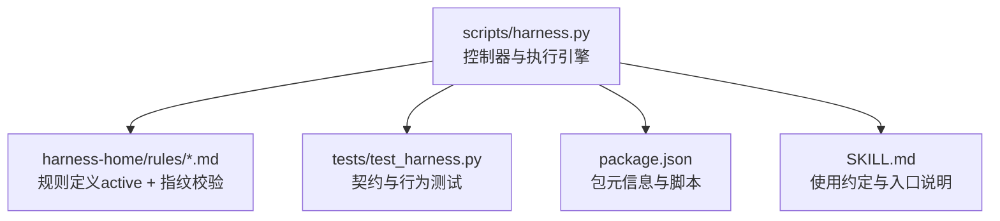
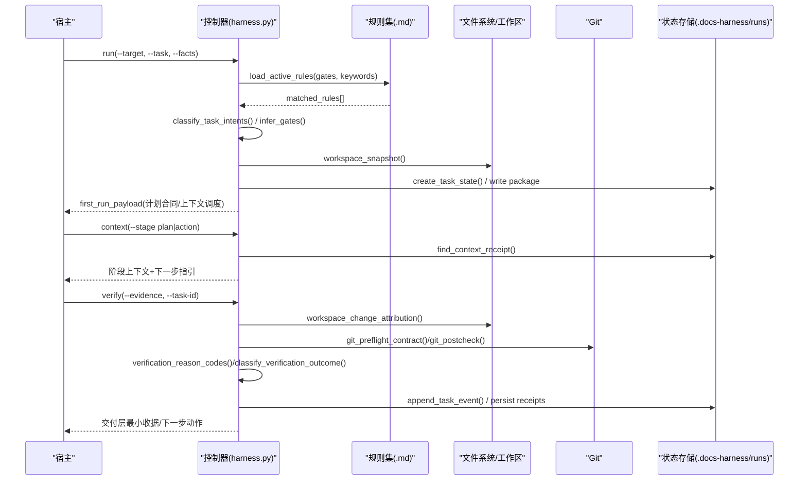
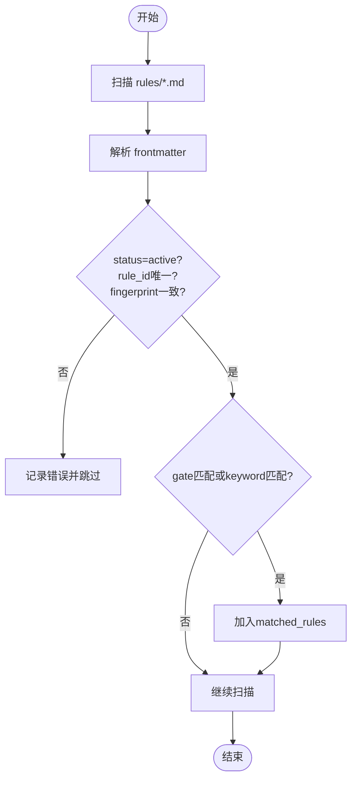
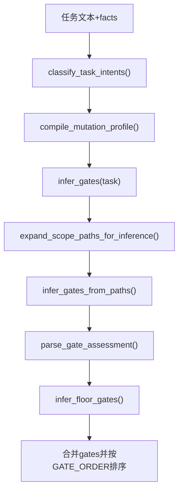
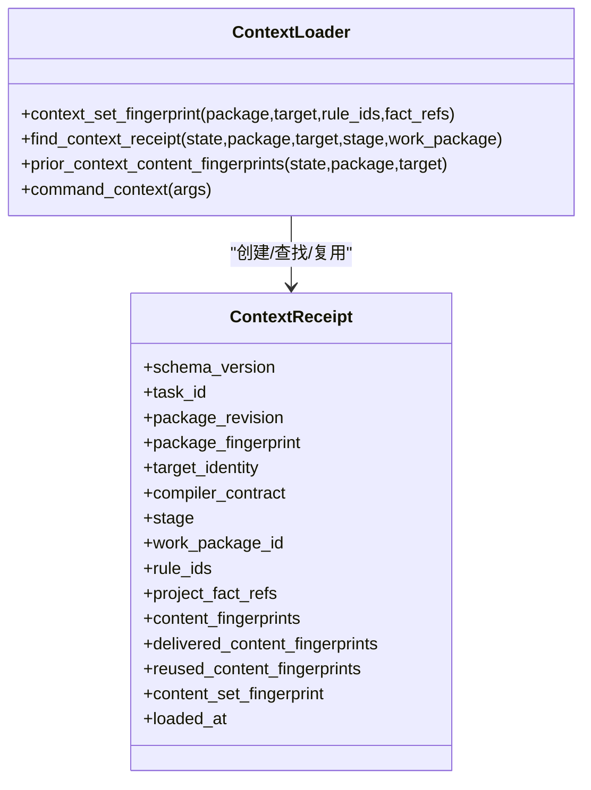
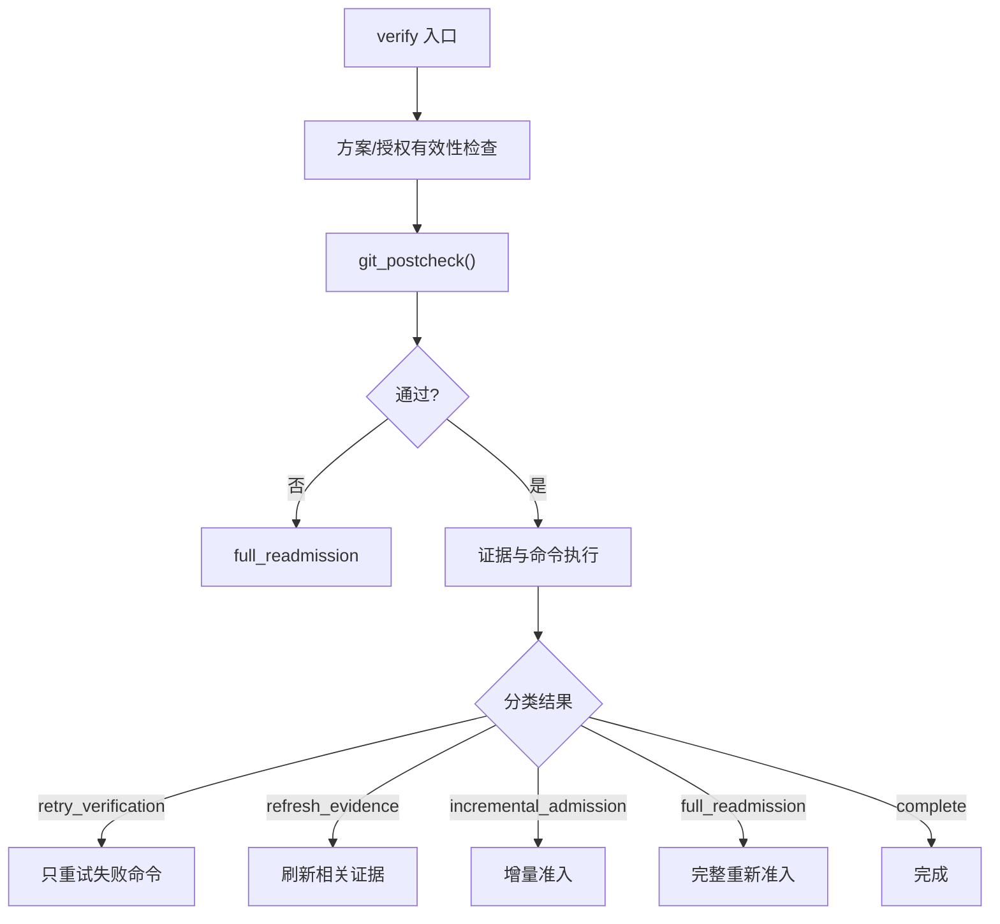
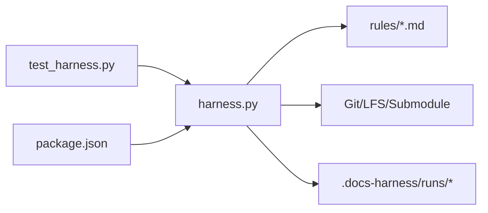

# 规则执行引擎

<cite>
**本文引用的文件**   
- [harness.py](file://scripts/harness.py)
- [INDEX.md](file://harness-home/rules/INDEX.md)
- [testing-release.md](file://harness-home/rules/testing-release.md)
- [api-compatibility.md](file://harness-home/rules/api-compatibility.md)
- [release-authorization-rollback.md](file://harness-home/rules/release-authorization-rollback.md)
- [scope-change-readmission.md](file://harness-home/rules/scope-change-readmission.md)
- [test_harness.py](file://tests/test_harness.py)
- [SKILL.md](file://SKILL.md)
- [package.json](file://package.json)
</cite>

## 目录
1. [简介](#简介)
2. [项目结构](#项目结构)
3. [核心组件](#核心组件)
4. [架构总览](#架构总览)
5. [详细组件分析](#详细组件分析)
6. [依赖关系分析](#依赖关系分析)
7. [性能考量](#性能考量)
8. [故障排查指南](#故障排查指南)
9. [结论](#结论)
10. [附录](#附录)

## 简介
本技术文档面向 Docs Harness 规则执行引擎，系统性阐述规则加载、匹配与执行流程，覆盖以下关键主题：
- 规则发现、解析与缓存策略
- 模式匹配、条件评估与执行顺序控制
- 执行上下文管理（环境变量、数据传递、状态共享）
- 错误处理与异常恢复（超时控制、重试策略、故障隔离）
- 性能优化（并行执行、结果缓存、资源管理）
- 监控与调试接口（执行日志、性能指标、错误追踪）

## 项目结构
Docs Harness 的规则执行引擎以单文件控制器为核心，规则以 Markdown 形式声明并安装到项目的 .docs-harness/harness-home/rules 目录。测试套件验证契约与行为一致性。

图表来源
- [harness.py:2057-2123](file://scripts/harness.py#L2057-L2123)
- [INDEX.md:1-41](file://harness-home/rules/INDEX.md#L1-L41)
- [test_harness.py:339-354](file://tests/test_harness.py#L339-L354)
- [package.json:1-23](file://package.json#L1-L23)
- [SKILL.md:1-105](file://SKILL.md#L1-L105)

章节来源
- [harness.py:2057-2123](file://scripts/harness.py#L2057-L2123)
- [INDEX.md:1-41](file://harness-home/rules/INDEX.md#L1-L41)
- [test_harness.py:339-354](file://tests/test_harness.py#L339-L354)
- [package.json:1-23](file://package.json#L1-L23)
- [SKILL.md:1-105](file://SKILL.md#L1-L105)

## 核心组件
- 规则加载器：扫描 rules 目录，解析 frontmatter，校验 active 状态、rule_id 唯一性与 content_fingerprint 一致性，按 Gate/关键词匹配生成 matched_rules。
- 意图分类与 Gate 推断：基于任务文本与 facts 推断 task_intent、mutation_profile、candidate_intents，结合路径与词表推断 gates，支持宿主权威 gate_assessment 与安全底线强制兜底。
- 计划与上下文：编译 plan_fields、context_schedule；阶段化上下文加载与收据复用（plan/action/work_package）。
- 证据与验收：工作区变更归因、证据索引、验证命令缓存与逐项收据、Git 前后检查、交付分层与最小交付收据。
- 状态机与幂等：活动任务键、recompile 与增量准入、冻结与版本历史、事件遥测。

章节来源
- [harness.py:2057-2123](file://scripts/harness.py#L2057-L2123)
- [harness.py:2154-2228](file://scripts/harness.py#L2154-L2228)
- [harness.py:2613-2800](file://scripts/harness.py#L2613-L2800)
- [harness.py:4130-4276](file://scripts/harness.py#L4130-L4276)
- [harness.py:6273-6761](file://scripts/harness.py#L6273-L6761)

## 架构总览
下图展示从 run 到 verify 的端到端流程，包括规则匹配、Gate 推断、计划/上下文、证据与验收、Git 预检/后检、事件记录与交付层判定。

图表来源
- [harness.py:2057-2123](file://scripts/harness.py#L2057-L2123)
- [harness.py:2154-2228](file://scripts/harness.py#L2154-L2228)
- [harness.py:4130-4276](file://scripts/harness.py#L4130-L4276)
- [harness.py:6273-6761](file://scripts/harness.py#L6273-L6761)

## 详细组件分析

### 规则加载机制（发现、解析与缓存）
- 发现：遍历 rules_root 下所有 .md，仅 status=active 参与匹配。
- 解析：解析 frontmatter，提取 rule_id、content_fingerprint、gates、keywords、plan_fields、evidence_types、failure_mode。
- 校验：确保 rule_id 唯一、正文指纹与 declared 一致、必需标题存在。
- 匹配：优先 Gate 交集，其次关键词匹配（受 mutation_profile 限制），支持 match_all 模式。
- 缓存：matched_rules 随 package 冻结；后续通过 content_fingerprint 快速判断是否变化。

图表来源
- [harness.py:2057-2123](file://scripts/harness.py#L2057-L2123)
- [INDEX.md:1-41](file://harness-home/rules/INDEX.md#L1-L41)

章节来源
- [harness.py:2057-2123](file://scripts/harness.py#L2057-L2123)
- [INDEX.md:1-41](file://harness-home/rules/INDEX.md#L1-L41)

### 规则匹配算法（模式匹配、条件评估与执行顺序）
- 意图分类：基于 INTENT_PATTERNS 与否定守卫、未来/完成标记，输出 current/candidate/deferred intents 及 reason_codes。
- Gate 推断：GATE_DEFS 词表匹配任务文本与路径特征；read_only/git_metadata_write 会剔除 code-edit/document-edit。
- 宿主权威：gate_assessment 可声明 gates，安全底线（security-sensitive/destructive-data/release-external）强制兜底。
- 执行顺序：按 GATE_ORDER 排序，保证高优先级 Gate 先被识别与约束。

图表来源
- [harness.py:2154-2228](file://scripts/harness.py#L2154-L2228)
- [harness.py:2245-2286](file://scripts/harness.py#L2245-L2286)
- [harness.py:2596-2611](file://scripts/harness.py#L2596-L2611)
- [harness.py:2149-2152](file://scripts/harness.py#L2149-L2152)

章节来源
- [harness.py:2154-2228](file://scripts/harness.py#L2154-L2228)
- [harness.py:2245-2286](file://scripts/harness.py#L2245-L2286)
- [harness.py:2596-2611](file://scripts/harness.py#L2596-L2611)
- [harness.py:2149-2152](file://scripts/harness.py#L2149-L2152)

### 执行上下文管理（环境变量、数据传递与状态共享）
- 上下文阶段：plan/action/work_package 三阶段，每阶段 schedule 包含 rule_ids 与 project_fact_refs。
- 内容指纹：context_set_fingerprint 对规则与事实计算集合指纹，用于收据匹配与增量复用。
- 收据缓存：find_context_receipt 在 state 中查找已交付内容指纹，避免重复加载；prior_context_content_fingerprints 跨 stage 去重。
- 环境信息：environment_fingerprint 记录 Python/平台/可执行路径，辅助复现与诊断。

图表来源
- [harness.py:4029-4043](file://scripts/harness.py#L4029-L4043)
- [harness.py:4046-4087](file://scripts/harness.py#L4046-L4087)
- [harness.py:4090-4111](file://scripts/harness.py#L4090-L4111)
- [harness.py:4130-4276](file://scripts/harness.py#L4130-L4276)
- [harness.py:1236-1241](file://scripts/harness.py#L1236-L1241)

章节来源
- [harness.py:4029-4043](file://scripts/harness.py#L4029-L4043)
- [harness.py:4046-4087](file://scripts/harness.py#L4046-L4087)
- [harness.py:4090-4111](file://scripts/harness.py#L4090-L4111)
- [harness.py:4130-4276](file://scripts/harness.py#L4130-L4276)
- [harness.py:1236-1241](file://scripts/harness.py#L1236-L1241)

### 错误处理与异常恢复（超时、重试、隔离）
- 超时控制：git_command 默认超时 20s，捕获 TimeoutExpired 并返回特定原因码。
- 重试策略：verify 分类为 retry_verification（命令失败、Git 工具不可用/网络问题）、refresh_evidence（read-set 漂移/证据过期）、incremental_admission（普通新增 Gate）、full_readmission（高风险/Git 远端漂移/ref 越界）。
- 故障隔离：state_lock 防止并发写冲突；workspace_snapshot 对非 Git 工作区有文件大小限制；Git postcheck 严格限定 ref 范围与 HEAD 一致性。

图表来源
- [harness.py:572-583](file://scripts/harness.py#L572-L583)
- [harness.py:6173-6218](file://scripts/harness.py#L6173-L6218)
- [harness.py:6273-6761](file://scripts/harness.py#L6273-L6761)
- [harness.py:1008-1028](file://scripts/harness.py#L1008-L1028)

章节来源
- [harness.py:572-583](file://scripts/harness.py#L572-L583)
- [harness.py:6173-6218](file://scripts/harness.py#L6173-L6218)
- [harness.py:6273-6761](file://scripts/harness.py#L6273-L6761)
- [harness.py:1008-1028](file://scripts/harness.py#L1008-L1028)

### 性能优化（并行、缓存与资源管理）
- 验证命令缓存：verification_command_cache_enabled 控制全局开关；run_verification_commands_cached 实现输入指纹与 TTL 绑定，逐项收据与缓存命中统计。
- 上下文去重：context receipt 与 prior fingerprints 避免重复加载相同规则与事实。
- 快照与过滤：workspace_snapshot 忽略 .git/node_modules/.venv 与 .docs-harness 子目录，限制非 Git 快照大小。
- 幂等任务：active_task_key 避免重复创建任务；git_sync 场景复用已冻结方案以减少往返。

章节来源
- [harness.py:1188-1199](file://scripts/harness.py#L1188-L1199)
- [harness.py:1112-1135](file://scripts/harness.py#L1112-L1135)
- [harness.py:4090-4111](file://scripts/harness.py#L4090-L4111)
- [harness.py:6273-6761](file://scripts/harness.py#L6273-L6761)

### 监控与调试接口（日志、指标与追踪）
- 事件写入：append_task_event 统一记录 context/verification/admission 等事件，包含 duration_ms、reason_code、counters（context_load_count、readmission_count、evidence_round_count 等）。
- 遥测封装：record_verification_attempt 将每次 verify 入口转化为结构化事件，不保存敏感正文。
- 交付层报告：build_delivery_layers 与 minimum_delivery_receipt 输出各层期望与验证状态，便于可视化与审计。

章节来源
- [harness.py:1031-1070](file://scripts/harness.py#L1031-L1070)
- [harness.py:6234-6271](file://scripts/harness.py#L6234-L6271)
- [harness.py:6061-6134](file://scripts/harness.py#L6061-L6134)
- [harness.py:6137-6170](file://scripts/harness.py#L6137-L6170)

## 依赖关系分析
- 控制器与规则：load_active_rules 依赖 rules_root 与 INDEX.md 清单；规则文件需满足 active + fingerprint 校验。
- 控制器与 Git：git_preflight_contract/git_postcheck 强依赖 Git 工具与 LFS/Submodule 可用性。
- 控制器与状态：state_lock、events.jsonl、context-receipts.jsonl、evidence-index.json 构成运行时一致性基础。
- 测试与契约：test_harness.py 断言 active 规则集合、self-test 行为、Git fetch/sync 语义与边界。

图表来源
- [harness.py:2057-2123](file://scripts/harness.py#L2057-L2123)
- [harness.py:677-791](file://scripts/harness.py#L677-L791)
- [harness.py:1008-1028](file://scripts/harness.py#L1008-L1028)
- [test_harness.py:339-354](file://tests/test_harness.py#L339-L354)
- [package.json:1-23](file://package.json#L1-L23)

章节来源
- [harness.py:2057-2123](file://scripts/harness.py#L2057-L2123)
- [harness.py:677-791](file://scripts/harness.py#L677-L791)
- [harness.py:1008-1028](file://scripts/harness.py#L1008-L1028)
- [test_harness.py:339-354](file://tests/test_harness.py#L339-L354)
- [package.json:1-23](file://package.json#L1-L23)

## 性能考量
- 减少重复 I/O：上下文收据与内容指纹复用显著降低规则与事实读取次数。
- 命令级缓存：验证命令按输入指纹与 TTL 缓存，失败只重跑受影响项。
- 快照裁剪：排除无关目录与超大文件，避免非 Git 工作区快照膨胀。
- 幂等与增量：活动任务键与增量准入避免不必要的重新准入与上下文重建。

[本节为通用指导，不直接分析具体文件]

## 故障排查指南
- 常见错误码与含义：
  - invalid_json/missing_file：输入 JSON 无效或缺失
  - git_preflight_timeout/git_remote_unavailable：Git 预检超时或远端不可达
  - authorization_expired/authorization_mismatch：授权过期或不匹配
  - plan_scope_mismatch/scope_bound_context_reload：计划范围不一致或需要范围绑定重新编译
  - full_readmission/retry_verification/refresh_evidence/incremental_admission：verify 结果分类
- 定位步骤：
  - 查看 events.jsonl 最近事件，关注 reason_code 与 duration_ms
  - 检查 context-receipts.jsonl 确认上下文是否命中缓存
  - 核对 evidence-index.json 与 artifact/source 指纹是否一致
  - 使用 self-test 与 test_harness 用例回归验证

章节来源
- [harness.py:6173-6218](file://scripts/harness.py#L6173-L6218)
- [harness.py:1031-1070](file://scripts/harness.py#L1031-L1070)
- [harness.py:6234-6271](file://scripts/harness.py#L6234-L6271)
- [test_harness.py:339-354](file://tests/test_harness.py#L339-L354)

## 结论
Docs Harness 规则执行引擎通过“规则即配置”的 Markdown 声明式模型，结合严格的指纹校验与 Gate 体系，实现了高可信的任务治理与证据闭环。其上下文收据、验证命令缓存与交付分层设计在保证安全性的同时显著提升性能与可观测性。建议在生产环境中启用命令缓存与事件遥测，并结合测试套件持续回归契约。

[本节为总结性内容，不直接分析具体文件]

## 附录
- 规则示例与契约要点：
  - testing-release.md：测试/验收类 Gate 的计划字段与证据类型要求
  - api-compatibility.md：API/Schema 变更的兼容策略与回滚要求
  - release-authorization-rollback.md：发布外部状态的授权与回滚约束
  - scope-change-readmission.md：范围变化的重新准入与影响评估

章节来源
- [testing-release.md:1-29](file://harness-home/rules/testing-release.md#L1-L29)
- [api-compatibility.md:1-29](file://harness-home/rules/api-compatibility.md#L1-L29)
- [release-authorization-rollback.md:1-29](file://harness-home/rules/release-authorization-rollback.md#L1-L29)
- [scope-change-readmission.md:1-29](file://harness-home/rules/scope-change-readmission.md#L1-L29)