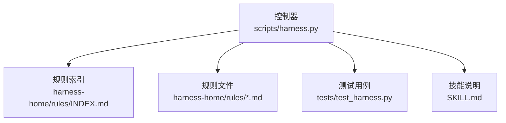
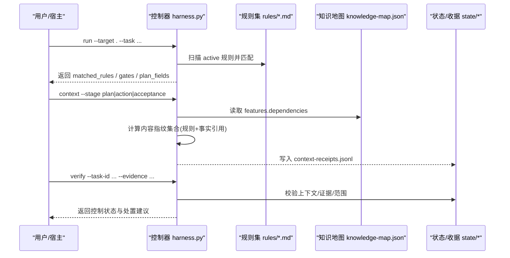
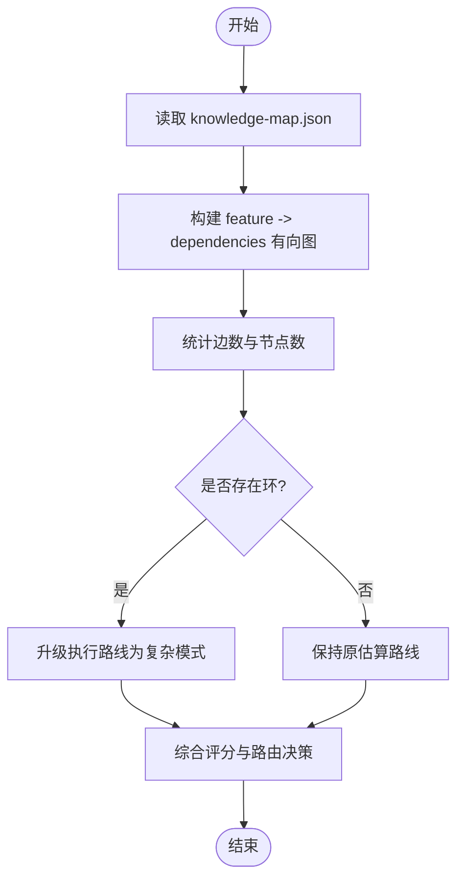
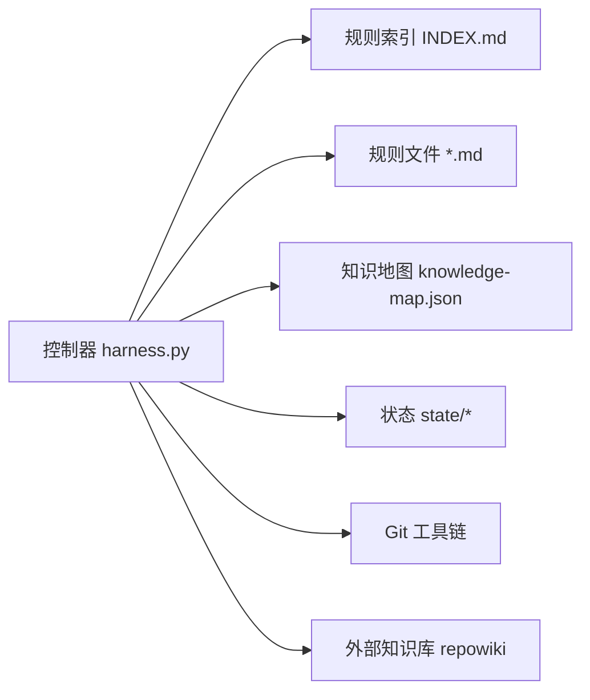

# 规则依赖管理

<cite>
**本文引用的文件**   
- [scripts/harness.py](file://scripts/harness.py)
- [harness-home/rules/INDEX.md](file://harness-home/rules/INDEX.md)
- [harness-home/rules/api-compatibility.md](file://harness-home/rules/api-compatibility.md)
- [harness-home/rules/documentation-changes.md](file://harness-home/rules/documentation-changes.md)
- [harness-home/rules/_rule-template.md](file://harness-home/rules/_rule-template.md)
- [tests/test_harness.py](file://tests/test_harness.py)
- [SKILL.md](file://SKILL.md)
</cite>

## 目录
1. [简介](#简介)
2. [项目结构](#项目结构)
3. [核心组件](#核心组件)
4. [架构总览](#架构总览)
5. [详细组件分析](#详细组件分析)
6. [依赖分析](#依赖分析)
7. [性能考虑](#性能考虑)
8. [故障排查指南](#故障排查指南)
9. [结论](#结论)
10. [附录](#附录)

## 简介
本文件面向 Docs Harness 的规则依赖管理系统，系统性阐述：
- 规则依赖声明语法（前置条件、后置条件、循环依赖检测）
- 依赖解析算法（拓扑排序、依赖树构建、冲突解决策略）
- 依赖验证机制（运行时检查、静态分析、性能影响评估）
- 依赖更新策略（安全更新、功能更新、破坏性变更处理）
- 最佳实践（依赖最小化、缓存策略、监控告警）
- 问题诊断与调试工具使用方法

本系统以“规则”为治理单元，通过元数据驱动匹配 Gate、关键词、方案字段与证据类型；在知识地图中维护功能间依赖关系，并在估算阶段进行循环依赖检测与路由升级。

## 项目结构
- 控制器脚本：scripts/harness.py，实现任务准入、上下文编译、规则匹配、知识依赖估算与后台作业编排等核心逻辑
- 规则集：harness-home/rules/*.md，包含激活规则清单与单条规则的 frontmatter 元数据与正文
- 测试套件：tests/test_harness.py，覆盖安装、规则自测、Git 操作、意图分类、Gate 推断等关键路径
- 技能说明：SKILL.md，描述 CLI 用法、验收流程、后台治理与质量账本

图表来源
- [scripts/harness.py:1-120](file://scripts/harness.py#L1-L120)
- [harness-home/rules/INDEX.md:1-41](file://harness-home/rules/INDEX.md#L1-L41)

章节来源
- [scripts/harness.py:1-120](file://scripts/harness.py#L1-L120)
- [harness-home/rules/INDEX.md:1-41](file://harness-home/rules/INDEX.md#L1-L41)

## 核心组件
- 规则匹配与校验：扫描 active 规则，校验 rule_id、content_fingerprint、适用条件与正文结构，按 Gate/关键词匹配任务
- 上下文编译与缓存：基于 rule_ids 与 project_fact_refs 生成内容指纹集合，命中则复用已交付上下文
- 知识依赖估算：读取 knowledge-map.json，统计跨功能依赖边数，执行环检测并据此选择执行路线
- 后台作业依赖：工作包依赖未验证时阻塞推进；bootstrap 依赖状态决定等待者状态迁移

章节来源
- [scripts/harness.py:2230-2289](file://scripts/harness.py#L2230-L2289)
- [scripts/harness.py:4182-4193](file://scripts/harness.py#L4182-L4193)
- [scripts/harness.py:8004-8028](file://scripts/harness.py#L8004-L8028)
- [scripts/harness.py:8690-8808](file://scripts/harness.py#L8690-L8808)

## 架构总览
下图展示规则与知识依赖在任务生命周期中的交互：从 run 到 context 再到 verify，规则匹配与上下文指纹贯穿始终，知识依赖影响估算与路由选择。

图表来源
- [scripts/harness.py:2230-2289](file://scripts/harness.py#L2230-L2289)
- [scripts/harness.py:4182-4193](file://scripts/harness.py#L4182-L4193)
- [scripts/harness.py:4297-4379](file://scripts/harness.py#L4297-L4379)
- [scripts/harness.py:8004-8028](file://scripts/harness.py#L8004-L8028)

## 详细组件分析

### 规则依赖声明语法
- 前置条件（适用条件）
  - 通过 frontmatter 的 gates 或 keywords 声明触发条件；控制器会校验 active 规则必须包含 gates 或 keywords
  - 正文需包含固定标题段（适用条件、必需的方案字段、验收条件、失败处理方式），否则视为结构不完整
- 后置条件（验收条件）
  - evidence_types 声明所需证据类型；plan_fields 声明方案必填字段；failure_mode 定义失败时的处理策略
- 唯一性与完整性
  - rule_id 必须唯一且非空；content_fingerprint 必须与正文哈希一致；active 规则缺失任一关键字段将被拒绝

章节来源
- [harness-home/rules/_rule-template.md:1-21](file://harness-home/rules/_rule-template.md#L1-L21)
- [harness-home/rules/api-compatibility.md:1-29](file://harness-home/rules/api-compatibility.md#L1-L29)
- [harness-home/rules/documentation-changes.md:1-29](file://harness-home/rules/documentation-changes.md#L1-L29)
- [scripts/harness.py:2230-2289](file://scripts/harness.py#L2230-L2289)

### 依赖解析算法
- 依赖图构建
  - 从 knowledge-map.json 的 features[].dependencies 构建有向图 edges，统计边数用于复杂度评分
- 循环依赖检测
  - 使用 DFS 着色法（visiting/visited）检测环；若存在环，将估算路由升级为更稳健的复杂路线
- 拓扑排序与依赖树
  - 控制器在后台作业编排中使用 dependency_job_ids 表达依赖关系；当依赖未就绪时进入 waiting_for_dependency 状态
  - 在估算阶段，依据依赖密度与环检测结果选择 background_direct / background_goal / background_goal_phased

图表来源
- [scripts/harness.py:8004-8028](file://scripts/harness.py#L8004-L8028)
- [scripts/harness.py:8086-8093](file://scripts/harness.py#L8086-L8093)
- [scripts/harness.py:8690-8808](file://scripts/harness.py#L8690-L8808)

章节来源
- [scripts/harness.py:8004-8028](file://scripts/harness.py#L8004-L8028)
- [scripts/harness.py:8690-8808](file://scripts/harness.py#L8690-L8808)

### 冲突解决策略
- 规则 ID 冲突：重复 rule_id 直接报错，阻止加载
- 指纹不一致：content_fingerprint 与正文不匹配视为规则变化，拒绝继续执行
- Gate 冲突：未知 Gate 名称直接拒绝；read_only/git_metadata_write 下禁止 code-edit/document-edit 类 Gate
- 意图冲突：candidate_intents/task_intent 非法值拒绝；多意图取最高 mutation_profile

章节来源
- [scripts/harness.py:2230-2289](file://scripts/harness.py#L2230-L2289)
- [scripts/harness.py:4182-4193](file://scripts/harness.py#L4182-L4193)
- [scripts/harness.py:2411-2424](file://scripts/harness.py#L2411-L2424)
- [scripts/harness.py:2320-2394](file://scripts/harness.py#L2320-L2394)

### 依赖验证机制
- 运行时检查
  - 上下文收据缓存：同一 task/target/compiler contract 下，内容指纹集合命中即复用，避免重复加载
  - 证据收据校验：绑定 task_id、package fingerprint、producer、读写集合与 TTL，确保可追溯
- 静态分析
  - 规则 frontmatter 与正文结构校验；active 规则必须满足最小字段集与指纹一致性
  - 知识地图依赖图环检测与边数统计，影响估算与路由
- 性能影响评估
  - 通过 source_file_count、feature_candidate_count、architecture_domain_count、technology_stack_count 等维度打分
  - 对大文档数量、多域、环依赖场景自动升级到更稳健的路线

章节来源
- [scripts/harness.py:4196-4211](file://scripts/harness.py#L4196-L4211)
- [scripts/harness.py:4297-4379](file://scripts/harness.py#L4297-L4379)
- [scripts/harness.py:8029-8154](file://scripts/harness.py#L8029-L8154)

### 依赖更新策略
- 安全更新
  - 安全底线 Gate（security-sensitive、destructive-data、release-external）不可豁免；精确词表+否定守卫降低误报
- 功能更新
  - 新增/修改规则需保证 content_fingerprint 与正文一致；新增依赖需在 knowledge-map 中显式声明
- 破坏性变更
  - 规则指纹变化导致 stale_rule；知识依赖环或多域大文档触发升级路由；v1 在途任务需显式迁移后重新准入

章节来源
- [scripts/harness.py:2411-2424](file://scripts/harness.py#L2411-L2424)
- [scripts/harness.py:4182-4193](file://scripts/harness.py#L4182-L4193)
- [scripts/harness.py:8086-8093](file://scripts/harness.py#L8086-L8093)
- [SKILL.md:1-106](file://SKILL.md#L1-L106)

### 依赖管理最佳实践
- 依赖最小化
  - 仅在必要时声明 dependencies；避免过度耦合导致环与高复杂度
- 缓存策略
  - 利用 context-receipts.jsonl 命中复用；减少重复加载与计算
- 监控告警
  - 关注 waiting_for_dependency、cyclic_dependencies、stale_rule、invalid_rule_ref 等错误码与原因码

章节来源
- [scripts/harness.py:4297-4379](file://scripts/harness.py#L4297-L4379)
- [scripts/harness.py:8004-8028](file://scripts/harness.py#L8004-L8028)
- [scripts/harness.py:8690-8808](file://scripts/harness.py#L8690-L8808)

### 依赖问题诊断与调试工具
- 规则自测
  - self-test 命令校验 shipped 规则是否 active、ID 唯一、指纹正确
- 安装与检查
  - project init/check 验证 rules_root 存在与快照一致性；缺失规则将失败关闭
- Git 相关
  - git_preflight_contract 与 git_postcheck 提供预检与后置校验，支持 LFS/Submodule 可用性检查

章节来源
- [tests/test_harness.py:339-354](file://tests/test_harness.py#L339-L354)
- [tests/test_harness.py:356-376](file://tests/test_harness.py#L356-L376)
- [scripts/harness.py:680-794](file://scripts/harness.py#L680-L794)

## 依赖分析
- 组件耦合与内聚
  - 控制器集中负责规则匹配、上下文编译、知识依赖估算与后台作业编排；规则文件仅承载元数据与正文
- 直接/间接依赖
  - 直接依赖：knowledge-map.json、rules/*.md、state/*（context-receipts.jsonl）
  - 间接依赖：Git 工具链（fetch/sync）、外部知识库（repowiki）
- 潜在循环依赖
  - 通过 DFS 环检测规避；若发现环，强制升级执行路线
- 外部依赖与集成点
  - Git、JSONL 持久化、可选 repowiki 只消费模式

图表来源
- [scripts/harness.py:2230-2289](file://scripts/harness.py#L2230-L2289)
- [scripts/harness.py:4196-4211](file://scripts/harness.py#L4196-L4211)
- [scripts/harness.py:8004-8028](file://scripts/harness.py#L8004-L8028)

章节来源
- [scripts/harness.py:2230-2289](file://scripts/harness.py#L2230-L2289)
- [scripts/harness.py:4196-4211](file://scripts/harness.py#L4196-L4211)
- [scripts/harness.py:8004-8028](file://scripts/harness.py#L8004-L8028)

## 性能考虑
- 估算维度与阈值
  - 源码文件数、功能候选数、架构域数、技术栈数、文档缺口比例、跨功能依赖边数共同决定 raw_score 与最终路由
- 大工程优化
  - 扫描截断、已有文档数量、多独立域、环依赖均促使升级为更稳健的复杂路线
- 上下文缓存
  - 命中 context-receipts.jsonl 可减少重复加载与计算开销

章节来源
- [scripts/harness.py:8029-8154](file://scripts/harness.py#L8029-L8154)
- [scripts/harness.py:4297-4379](file://scripts/harness.py#L4297-L4379)

## 故障排查指南
- 常见错误码与原因
  - invalid_rule_ref：任务包未命中规则
  - missing_rule：规则文件不存在
  - stale_rule：规则已变化（指纹不一致）
  - dependency_blocked：工作包依赖尚未 verified
  - git_remote_drift：远端漂移导致阻断
- 定位步骤
  - 检查 rules_root 与 active 规则指纹
  - 查看 context-receipts.jsonl 是否命中
  - 确认 knowledge-map.json 依赖无环
  - 核查 Git 预检与后置校验结果

章节来源
- [scripts/harness.py:4182-4193](file://scripts/harness.py#L4182-L4193)
- [scripts/harness.py:5721](file://scripts/harness.py#L5721)
- [tests/test_harness.py:620-649](file://tests/test_harness.py#L620-L649)

## 结论
Docs Harness 的规则依赖管理以“规则元数据 + 知识地图依赖”为核心，结合严格的指纹校验与上下文缓存，确保治理过程的可审计与高效。通过环检测与多维度估算，系统在复杂工程中仍能选择稳健的执行路线。实践中应遵循依赖最小化、严格指纹管理与充分缓存策略，配合完善的监控与诊断手段，保障长期稳定运行。

## 附录
- CLI 参考与用法见 SKILL.md
- 规则模板与示例见 harness-home/rules/_rule-template.md 与各 active 规则文件
- 测试用例覆盖安装、规则自测、Git 操作、意图分类、Gate 推断等关键路径

章节来源
- [SKILL.md:1-106](file://SKILL.md#L1-L106)
- [harness-home/rules/_rule-template.md:1-21](file://harness-home/rules/_rule-template.md#L1-L21)
- [tests/test_harness.py:339-354](file://tests/test_harness.py#L339-L354)