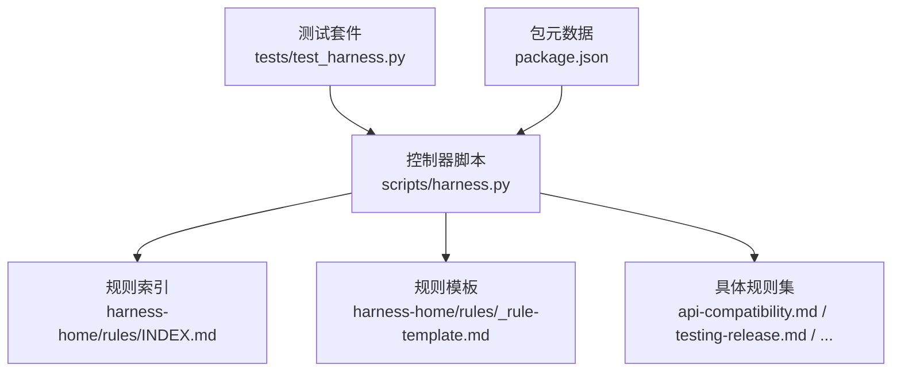
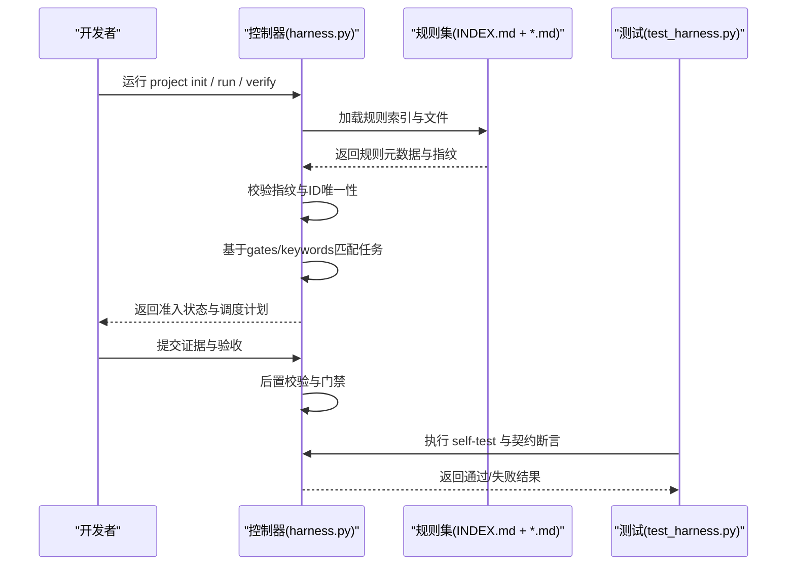
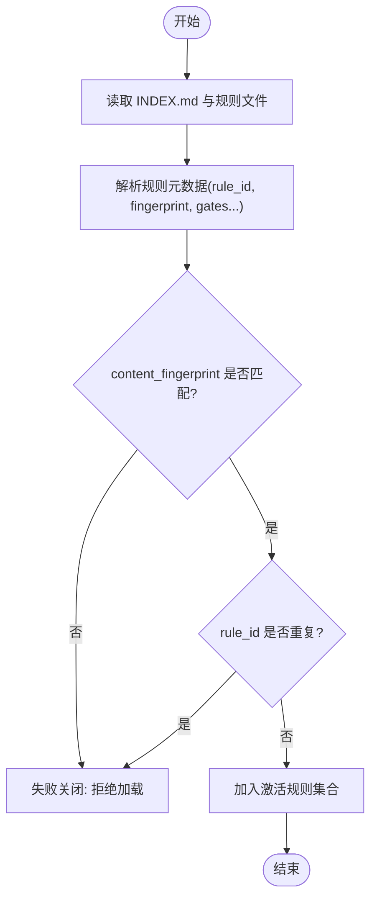
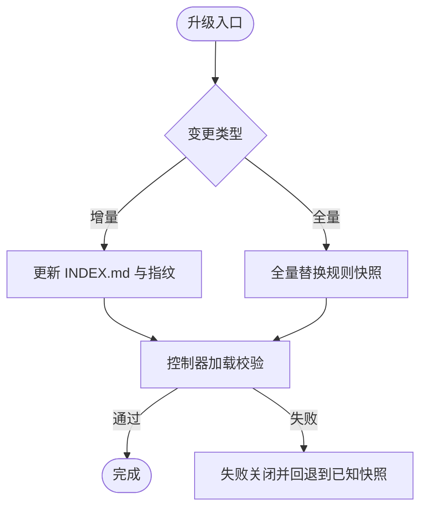
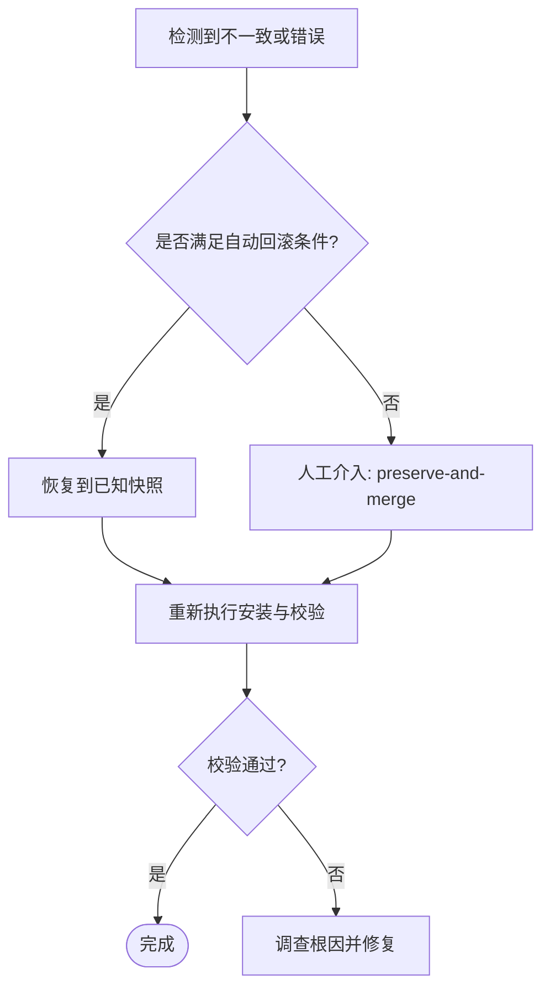
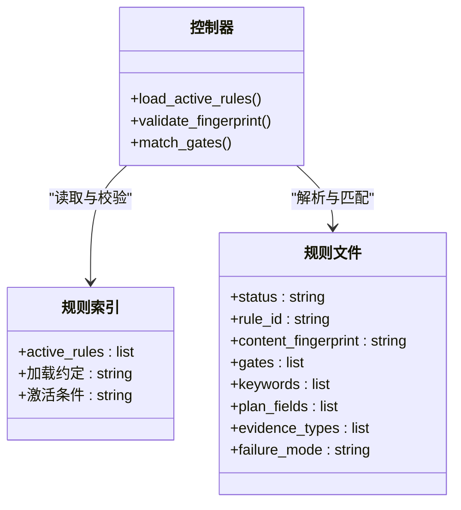
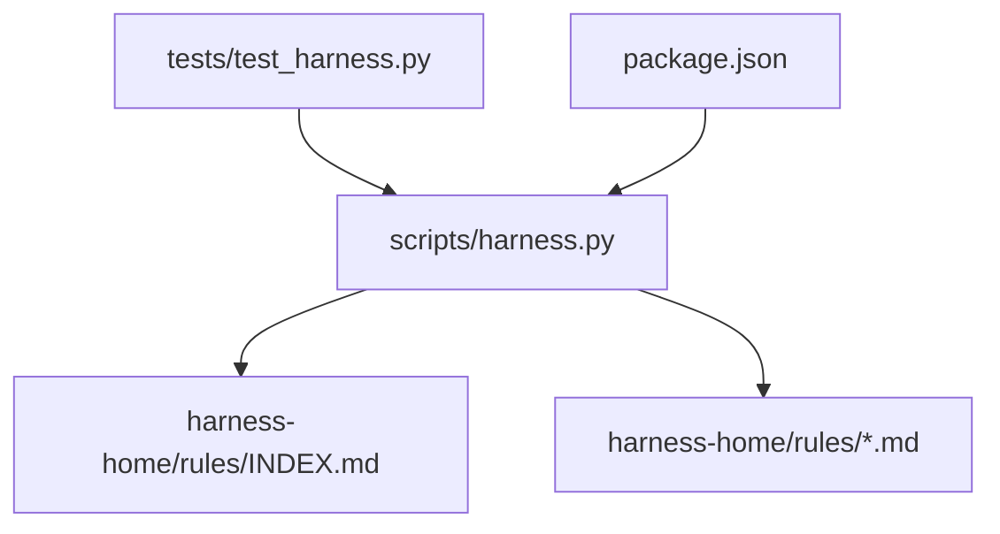

# 规则版本控制

<cite>
**本文引用的文件**   
- [scripts/harness.py](file://scripts/harness.py)
- [harness-home/rules/INDEX.md](file://harness-home/rules/INDEX.md)
- [harness-home/rules/_rule-template.md](file://harness-home/rules/_rule-template.md)
- [harness-home/rules/api-compatibility.md](file://harness-home/rules/api-compatibility.md)
- [harness-home/rules/release-authorization-rollback.md](file://harness-home/rules/release-authorization-rollback.md)
- [harness-home/rules/testing-release.md](file://harness-home/rules/testing-release.md)
- [harness-home/rules/documentation-changes.md](file://harness-home/rules/documentation-changes.md)
- [tests/test_harness.py](file://tests/test_harness.py)
- [package.json](file://package.json)
</cite>

## 目录
1. [引言](#引言)
2. [项目结构](#项目结构)
3. [核心组件](#核心组件)
4. [架构总览](#架构总览)
5. [详细组件分析](#详细组件分析)
6. [依赖关系分析](#依赖关系分析)
7. [性能考量](#性能考量)
8. [故障排查指南](#故障排查指南)
9. [结论](#结论)
10. [附录](#附录)

## 引言
本文件为 Docs Harness 规则版本控制系统提供系统化文档，聚焦以下目标：
- 解释规则版本管理机制：版本号定义、语义化版本控制与兼容性矩阵。
- 说明规则升级流程：增量更新、全量替换与迁移脚本执行。
- 阐述规则回滚策略：自动回滚条件、手动回滚操作与数据恢复。
- 管理规则依赖版本：前置条件检查、冲突检测与解决策略。
- 给出最佳实践：版本规划、发布流程与变更管理。
- 提供版本冲突诊断与修复方法。

## 项目结构
Docs Harness 的规则版本管理由“控制器脚本 + 规则快照 + 测试契约”三部分构成：
- 控制器脚本负责加载、校验、匹配与执行规则，并维护版本与指纹一致性。
- 规则快照以 Markdown 形式存放于 harness-home/rules，包含索引与模板。
- 测试用例确保已分发规则处于激活状态且通过自测。

图表来源
- [scripts/harness.py:26-50](file://scripts/harness.py#L26-L50)
- [harness-home/rules/INDEX.md:1-41](file://harness-home/rules/INDEX.md#L1-L41)
- [harness-home/rules/_rule-template.md:1-21](file://harness-home/rules/_rule-template.md#L1-L21)
- [tests/test_harness.py:23-44](file://tests/test_harness.py#L23-L44)
- [package.json:1-23](file://package.json#L1-L23)

章节来源
- [scripts/harness.py:26-50](file://scripts/harness.py#L26-L50)
- [harness-home/rules/INDEX.md:1-41](file://harness-home/rules/INDEX.md#L1-L41)
- [tests/test_harness.py:23-44](file://tests/test_harness.py#L23-L44)
- [package.json:1-23](file://package.json#L1-L23)

## 核心组件
- 版本常量与模式
  - 控制器中定义了当前版本号与语义化版本正则，用于知识文档内嵌版本标记与版本格式校验。
- 规则索引与模板
  - INDEX.md 声明生效规则清单、加载约定与激活条件；_rule-template.md 提供规则元数据字段规范。
- 规则内容指纹
  - 每条规则在头部声明 content_fingerprint（sha256），控制器加载时进行一致性校验，防止篡改或漂移。
- 规则匹配与门控
  - 控制器根据 gates、keywords、plan_fields、evidence_types 等元数据进行任务路由与准入判定。
- 测试契约
  - 测试断言已分发规则均为 active，ID 唯一且指纹有效，并通过 self-test 验证整体一致性。

章节来源
- [scripts/harness.py:75-80](file://scripts/harness.py#L75-L80)
- [scripts/harness.py:2057-2114](file://scripts/harness.py#L2057-L2114)
- [harness-home/rules/INDEX.md:1-41](file://harness-home/rules/INDEX.md#L1-L41)
- [harness-home/rules/_rule-template.md:1-21](file://harness-home/rules/_rule-template.md#L1-L21)
- [tests/test_harness.py:339-354](file://tests/test_harness.py#L339-L354)

## 架构总览
规则版本控制的运行时流程如下：
- 安装阶段：将规则快照复制到项目 .docs-harness/harness-home/rules，并在配置中记录 rules_root。
- 加载阶段：读取 INDEX.md 与规则文件，解析元数据，计算并比对 content_fingerprint。
- 匹配阶段：基于 gates/keywords 匹配任务意图，生成 plan/action/acceptance 调度。
- 执行与验证：按规则要求产出证据类型，控制器进行后置校验与门禁。

图表来源
- [scripts/harness.py:2057-2114](file://scripts/harness.py#L2057-L2114)
- [scripts/harness.py:2833-2838](file://scripts/harness.py#L2833-L2838)
- [tests/test_harness.py:339-354](file://tests/test_harness.py#L339-L354)

## 详细组件分析

### 规则版本与指纹机制
- 版本号定义
  - 控制器顶层 VERSION 常量标识当前版本；知识文档模板中以注释包裹方式注入版本信息。
- 指纹校验
  - 每条规则的 content_fingerprint 必须与实际文件内容一致；不一致则拒绝加载。
- 唯一性与激活
  - rule_id 必须唯一；仅 status: active 的规则进入任务包。

图表来源
- [scripts/harness.py:2057-2114](file://scripts/harness.py#L2057-L2114)
- [harness-home/rules/_rule-template.md:1-21](file://harness-home/rules/_rule-template.md#L1-L21)

章节来源
- [scripts/harness.py:26-30](file://scripts/harness.py#L26-L30)
- [scripts/harness.py:354](file://scripts/harness.py#L354)
- [scripts/harness.py:2057-2114](file://scripts/harness.py#L2057-L2114)
- [harness-home/rules/_rule-template.md:1-21](file://harness-home/rules/_rule-template.md#L1-L21)

### 规则升级流程（增量更新、全量替换、迁移脚本）
- 增量更新
  - 当规则文件新增或修改时，需同步更新 INDEX.md 的 active_rules 列表与对应文件的 content_fingerprint。
  - 控制器在加载阶段会校验指纹，任何未对齐都会导致失败关闭。
- 全量替换
  - 若需要替换整个规则集，应使用来源包升级或人工 preserve-and-merge 流程，确保 HEAD 包含完整安装清单。
- 迁移脚本
  - 对于破坏性变更，应在方案中明确迁移步骤与回滚路径；控制器不直接执行迁移脚本，但会在验证阶段要求相关证据。

图表来源
- [harness-home/rules/INDEX.md:34-41](file://harness-home/rules/INDEX.md#L34-L41)
- [scripts/harness.py:2057-2114](file://scripts/harness.py#L2057-L2114)

章节来源
- [harness-home/rules/INDEX.md:10-11](file://harness-home/rules/INDEX.md#L10-L11)
- [harness-home/rules/INDEX.md:34-41](file://harness-home/rules/INDEX.md#L34-L41)
- [scripts/harness.py:2057-2114](file://scripts/harness.py#L2057-L2114)

### 规则回滚策略（自动回滚、手动回滚、数据恢复）
- 自动回滚条件
  - 规则指纹不一致、ID 重复或缺失、INDEX.md 与规则集合不一致时，控制器拒绝加载并失败关闭。
- 手动回滚操作
  - 通过恢复至上一个已知快照（来自来源包或本地备份），重新执行安装与校验。
- 数据恢复
  - 对涉及外部写入的任务，需在方案中冻结外部目标、产物身份与授权范围，并提供可执行的回滚路径；控制器在验证阶段要求外部状态证据。

图表来源
- [harness-home/rules/INDEX.md:34-41](file://harness-home/rules/INDEX.md#L34-L41)
- [harness-home/rules/release-authorization-rollback.md:1-29](file://harness-home/rules/release-authorization-rollback.md#L1-L29)

章节来源
- [harness-home/rules/INDEX.md:34-41](file://harness-home/rules/INDEX.md#L34-L41)
- [harness-home/rules/release-authorization-rollback.md:1-29](file://harness-home/rules/release-authorization-rollback.md#L1-L29)

### 规则依赖版本管理（前置条件、冲突检测、解决策略）
- 前置条件检查
  - 控制器在加载规则前检查 INDEX.md 完整性与规则指纹一致性；缺失或不一致将触发失败关闭。
- 冲突检测
  - rule_id 重复、content_fingerprint 不匹配、active_rules 与实际文件不一致均视为冲突。
- 解决策略
  - 统一通过来源包升级或人工 preserve-and-merge 处理；禁止直接修改已安装快照而不更新索引与指纹。

图表来源
- [harness-home/rules/INDEX.md:1-41](file://harness-home/rules/INDEX.md#L1-L41)
- [harness-home/rules/_rule-template.md:1-21](file://harness-home/rules/_rule-template.md#L1-L21)
- [scripts/harness.py:2057-2114](file://scripts/harness.py#L2057-L2114)

章节来源
- [harness-home/rules/INDEX.md:1-41](file://harness-home/rules/INDEX.md#L1-L41)
- [harness-home/rules/_rule-template.md:1-21](file://harness-home/rules/_rule-template.md#L1-L21)
- [scripts/harness.py:2057-2114](file://scripts/harness.py#L2057-L2114)

### 规则版本最佳实践（版本规划、发布流程、变更管理）
- 版本规划
  - 遵循语义化版本控制（主版本.次版本.修订号），重大破坏性变更提升主版本，新功能提升次版本，缺陷修复提升修订号。
- 发布流程
  - 在来源包中更新 VERSION 与规则指纹，确保 INDEX.md 与规则文件一致；通过 self-test 与测试套件验证。
- 变更管理
  - 所有变更需附带迁移与回滚方案；对外部写入类任务，需提供真实外部状态证据与回滚路径。

章节来源
- [scripts/harness.py:26-30](file://scripts/harness.py#L26-L30)
- [tests/test_harness.py:339-354](file://tests/test_harness.py#L339-L354)
- [harness-home/rules/release-authorization-rollback.md:1-29](file://harness-home/rules/release-authorization-rollback.md#L1-L29)

### 版本冲突诊断与修复
- 常见冲突
  - 指纹不匹配、ID 重复、INDEX.md 与规则集合不一致。
- 诊断步骤
  - 运行 self-test 与 project check，定位失败原因；检查规则文件与 INDEX.md 的一致性。
- 修复方法
  - 修正规则文件并更新指纹；必要时回滚到已知快照后重新应用变更。

章节来源
- [tests/test_harness.py:339-354](file://tests/test_harness.py#L339-L354)
- [scripts/harness.py:2057-2114](file://scripts/harness.py#L2057-L2114)

## 依赖关系分析
- 控制器依赖规则索引与规则文件，测试套件依赖控制器与规则集。
- 包元数据提供版本信息与打包清单，确保分发一致性。

图表来源
- [scripts/harness.py:26-50](file://scripts/harness.py#L26-L50)
- [harness-home/rules/INDEX.md:1-41](file://harness-home/rules/INDEX.md#L1-L41)
- [tests/test_harness.py:23-44](file://tests/test_harness.py#L23-L44)
- [package.json:1-23](file://package.json#L1-L23)

章节来源
- [scripts/harness.py:26-50](file://scripts/harness.py#L26-L50)
- [harness-home/rules/INDEX.md:1-41](file://harness-home/rules/INDEX.md#L1-L41)
- [tests/test_harness.py:23-44](file://tests/test_harness.py#L23-L44)
- [package.json:1-23](file://package.json#L1-L23)

## 性能考量
- 规则加载与指纹计算采用流式哈希，避免大文件一次性载入内存。
- 事件与证据文件采用追加写入与 JSONL 格式，保证高并发下的顺序性与可追溯性。
- Git 预检与后置校验限制超时与阈值，防止长时间阻塞。

章节来源
- [scripts/harness.py:407-416](file://scripts/harness.py#L407-L416)
- [scripts/harness.py:507-529](file://scripts/harness.py#L507-L529)
- [scripts/harness.py:572-582](file://scripts/harness.py#L572-L582)

## 故障排查指南
- 常见问题
  - 规则指纹不一致、INDEX.md 与规则集合不一致、rule_id 重复。
- 排查步骤
  - 运行 self-test 与 project check，查看失败原因；核对规则文件与 INDEX.md。
- 修复建议
  - 修正规则文件并更新指纹；必要时回滚到已知快照后重新应用变更。

章节来源
- [tests/test_harness.py:339-354](file://tests/test_harness.py#L339-L354)
- [scripts/harness.py:2057-2114](file://scripts/harness.py#L2057-L2114)

## 结论
Docs Harness 的规则版本控制通过严格的指纹校验、唯一性约束与门控匹配，确保规则集的一致性与可追溯性。结合增量更新、全量替换与回滚策略，能够在复杂变更场景下保持系统稳定。遵循语义化版本控制与最佳实践，可有效降低版本冲突风险，提升发布质量。

## 附录
- 关键规则示例
  - API 兼容规则：要求在修改公共契约时提供兼容策略与回滚路径。
  - 测试放行规则：要求区分静态检查、源码测试、运行时验证与产物验证。
  - 文档修改规则：要求说明真源、索引与旧引用清理范围。
  - 发布授权与回滚规则：要求冻结外部目标、产物身份与授权范围，并提供回滚能力。

章节来源
- [harness-home/rules/api-compatibility.md:1-29](file://harness-home/rules/api-compatibility.md#L1-L29)
- [harness-home/rules/testing-release.md:1-29](file://harness-home/rules/testing-release.md#L1-L29)
- [harness-home/rules/documentation-changes.md:1-29](file://harness-home/rules/documentation-changes.md#L1-L29)
- [harness-home/rules/release-authorization-rollback.md:1-29](file://harness-home/rules/release-authorization-rollback.md#L1-L29)