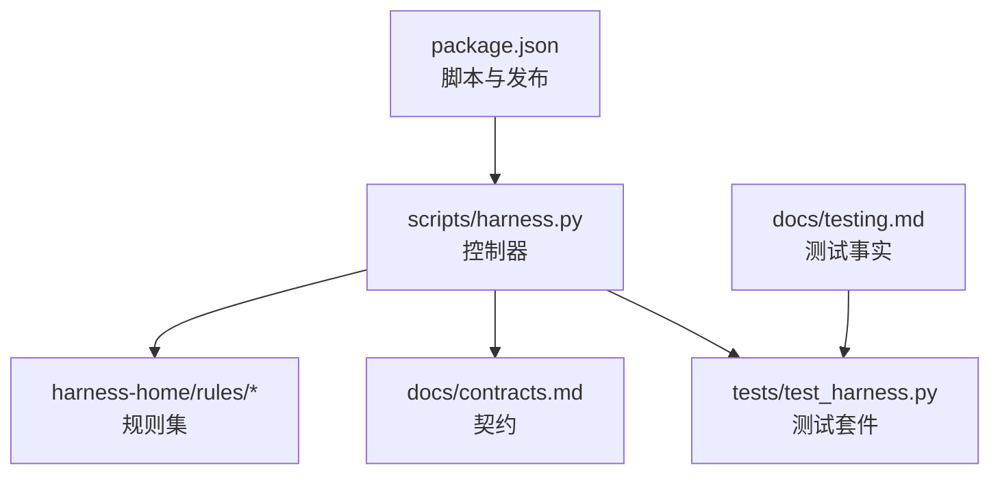
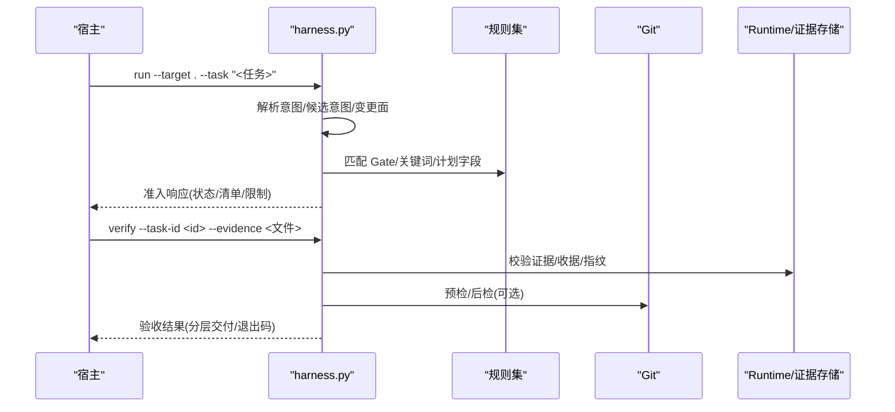
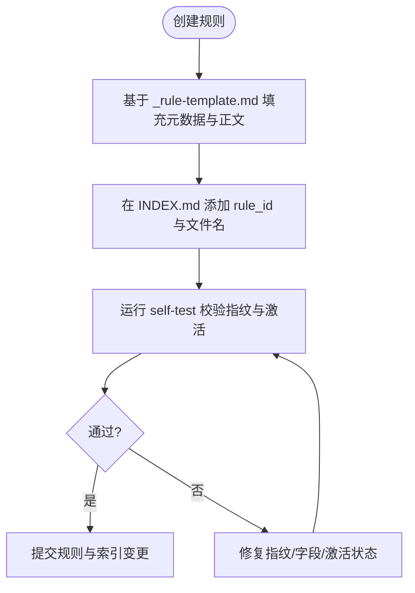
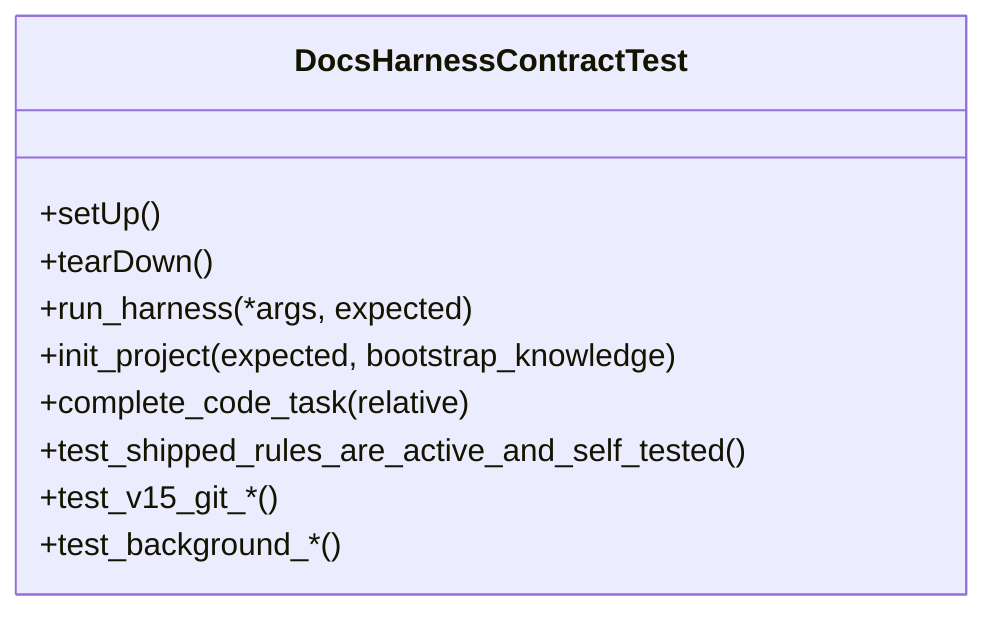
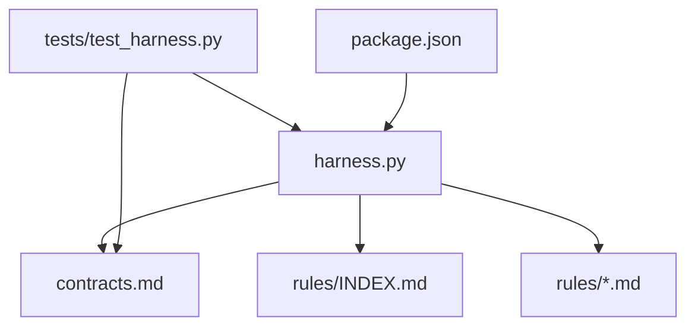

# 规则生命周期管理

<cite>
**本文引用的文件**   
- [SKILL.md](file://SKILL.md)
- [harness.py](file://scripts/harness.py)
- [test_harness.py](file://tests/test_harness.py)
- [INDEX.md](file://harness-home/rules/INDEX.md)
- [_rule-template.md](file://harness-home/rules/_rule-template.md)
- [api-compatibility.md](file://harness-home/rules/api-compatibility.md)
- [testing-release.md](file://harness-home/rules/testing-release.md)
- [external-input-security.md](file://harness-home/rules/external-input-security.md)
- [documentation-changes.md](file://harness-home/rules/documentation-changes.md)
- [scope-change-readmission.md](file://harness-home/rules/scope-change-readmission.md)
- [release-authorization-rollback.md](file://harness-home/rules/release-authorization-rollback.md)
- [contracts.md](file://docs/contracts.md)
- [testing.md](file://docs/testing.md)
- [package.json](file://package.json)
</cite>

## 目录
1. [引言](#引言)
2. [项目结构](#项目结构)
3. [核心组件](#核心组件)
4. [架构总览](#架构总览)
5. [详细组件分析](#详细组件分析)
6. [依赖关系分析](#依赖关系分析)
7. [性能考量](#性能考量)
8. [故障排查指南](#故障排查指南)
9. [结论](#结论)
10. [附录](#附录)

## 引言
本文件面向 Docs Harness 的规则生命周期管理，覆盖规则开发流程（模板、规范、测试）、测试策略（单元、集成、回归）、部署流程（打包、签名、分发、安装验证）、维护过程（监控、日志、错误处理、性能优化）以及退役策略（废弃警告、迁移指导、最终删除），并给出质量门禁与合规性检查方法。内容基于仓库内控制器脚本、合同文档、规则集与测试套件进行系统化梳理，确保读者既能快速上手，也能深入理解实现细节。

## 项目结构
Docs Harness 以 Python 控制器为核心，配合 Markdown 规则集、合同与测试用例，形成“意图优先、证据可复用、失败关闭”的治理闭环。关键目录与职责：
- scripts/harness.py：独立任务控制器，负责任务准入、Gate 判定、范围控制、Git 交付校验、证据与验收、后台治理等。
- harness-home/rules：随项目安装的通用规则快照，包含生效规则清单与模板。
- docs/contracts.md：控制器与宿主之间的稳定契约，定义任务包、证据、验收、Git 状态、退出码等。
- tests/test_harness.py：单元测试与集成测试，覆盖安装、任务准入、Git 操作、后台 Job、幂等与回滚等。
- package.json：脚本入口与发布检查。

图表来源
- [harness.py:1-200](file://scripts/harness.py#L1-L200)
- [INDEX.md:1-41](file://harness-home/rules/INDEX.md#L1-L41)
- [contracts.md:1-120](file://docs/contracts.md#L1-L120)
- [test_harness.py:1-120](file://tests/test_harness.py#L1-L120)
- [package.json:1-23](file://package.json#L1-L23)

章节来源
- [SKILL.md:1-106](file://SKILL.md#L1-L106)
- [package.json:1-23](file://package.json#L1-L23)

## 核心组件
- 控制器（scripts/harness.py）
  - 版本与常量：版本号、各类 Schema 名称、Git 相关常量、风险 Gate 定义、意图与变更面映射、可信生产者集合、高风险证据类型等。
  - 输入与路径安全：目标目录校验、JSON 输入加载、原子写入、事件追加与读取、Git 预检与后检、远端指纹脱敏等。
  - 任务与准入：任务意图编译、候选意图、变更面选择、Gate 判定、范围约束、幂等复用、完成清单生成。
  - 证据与验收：v2 证据收据、声明草案、命令缓存、自动归因、工作区漂移检测、分层交付验收。
  - 后台治理：Job 生命周期、复杂路线、进度与验收、重试与归档、事件脱敏。
  - 退出码与错误：结构化错误、退出码语义、失败关闭策略。
- 规则集（harness-home/rules/*）
  - INDEX.md：生效规则清单、激活条件、加载约定。
  - _rule-template.md：规则模板，包含元数据与正文结构。
  - 具体规则：API 兼容、外部输入安全、文档修改、范围变化重新判断、测试放行、发布授权与回滚等。
- 契约（docs/contracts.md）
  - 任务包 v2、准入与路线、完成清单、Git 状态合同、工作区漂移归因、证据收据、上下文与授权收据、v1→v2 迁移、任务终结处置、效率事件、双通道与后台治理、Runtime 与隐私、退出码。
- 测试（tests/test_harness.py）
  - 安装与自检、知识骨架、任务准入、Git fetch/sync/inspect、漂移与重准入、权限与安全、后台 Job、幂等与回滚等。

章节来源
- [harness.py:1-200](file://scripts/harness.py#L1-L200)
- [INDEX.md:1-41](file://harness-home/rules/INDEX.md#L1-L41)
- [_rule-template.md:1-21](file://harness-home/rules/_rule-template.md#L1-L21)
- [api-compatibility.md:1-29](file://harness-home/rules/api-compatibility.md#L1-L29)
- [external-input-security.md:1-29](file://harness-home/rules/external-input-security.md#L1-L29)
- [documentation-changes.md:1-29](file://harness-home/rules/documentation-changes.md#L1-L29)
- [scope-change-readmission.md:1-29](file://harness-home/rules/scope-change-readmission.md#L1-L29)
- [testing-release.md:1-29](file://harness-home/rules/testing-release.md#L1-L29)
- [release-authorization-rollback.md:1-29](file://harness-home/rules/release-authorization-rollback.md#L1-L29)
- [contracts.md:1-200](file://docs/contracts.md#L1-L200)
- [test_harness.py:1-200](file://tests/test_harness.py#L1-L200)

## 架构总览
Docs Harness 通过控制器将“任务意图—风险 Gate—范围—上下文—授权—证据—验收—后台治理”串联为一条受控流水线。规则集作为 Gate 与验收条件的载体，契约保证控制器与宿主的稳定交互，测试套件保障全链路正确性。

图表来源
- [harness.py:200-400](file://scripts/harness.py#L200-L400)
- [contracts.md:10-120](file://docs/contracts.md#L10-L120)

章节来源
- [SKILL.md:26-58](file://SKILL.md#L26-L58)
- [contracts.md:10-120](file://docs/contracts.md#L10-L120)

## 详细组件分析

### 规则开发与模板使用
- 模板结构
  - 元数据：status、rule_id、content_fingerprint、gates、keywords、plan_fields、evidence_types、failure_mode。
  - 正文：适用条件、必需的方案字段、验收条件、失败处理方式。
- 模板位置与引用
  - 模板文件：_rule-template.md。
  - 索引与激活：INDEX.md 中 active_rules 列表与加载约定。
- 规则示例
  - API 兼容：DH-API-COMPATIBILITY，关联 architecture-contract Gate，要求兼容策略与回滚。
  - 外部输入安全：DH-EXTERNAL-INPUT-SECURITY，关联 security-sensitive Gate，强调信任边界与负向路径。
  - 文档修改：DH-DOCUMENTATION-CHANGES，关联 document-edit Gate，要求真源与索引一致。
  - 范围变化：DH-SCOPE-CHANGE-READMISSION，关联 review-audit Gate，触发重新准入。
  - 测试放行：DH-TESTING-RELEASE，关联 testing-acceptance Gate，要求分层验收。
  - 发布授权与回滚：DH-RELEASE-AUTHORIZATION-ROLLBACK，关联 release-external Gate，要求外部状态证明。

图表来源
- [_rule-template.md:1-21](file://harness-home/rules/_rule-template.md#L1-L21)
- [INDEX.md:1-41](file://harness-home/rules/INDEX.md#L1-L41)
- [test_harness.py:339-354](file://tests/test_harness.py#L339-L354)

章节来源
- [_rule-template.md:1-21](file://harness-home/rules/_rule-template.md#L1-L21)
- [INDEX.md:1-41](file://harness-home/rules/INDEX.md#L1-L41)
- [api-compatibility.md:1-29](file://harness-home/rules/api-compatibility.md#L1-L29)
- [external-input-security.md:1-29](file://harness-home/rules/external-input-security.md#L1-L29)
- [documentation-changes.md:1-29](file://harness-home/rules/documentation-changes.md#L1-L29)
- [scope-change-readmission.md:1-29](file://harness-home/rules/scope-change-readmission.md#L1-L29)
- [testing-release.md:1-29](file://harness-home/rules/testing-release.md#L1-L29)
- [release-authorization-rollback.md:1-29](file://harness-home/rules/release-authorization-rollback.md#L1-L29)

### 代码规范与 Gate 体系
- 意图与变更面
  - 意图：query、audit、git_inspect、git_fetch、git_sync、modify、external_write。
  - 变更面：read_only、git_metadata_write、workspace_write、external_write。
  - 混合意图保留全部候选，未来子句进入 deferred_intents；最高变更面决定执行强度。
- Gate 体系
  - 顺序与定义：product-change、architecture-contract、security-sensitive、destructive-data、release-external、frontend-design、diagnosis-fix、testing-acceptance、review-audit、code-edit、document-edit。
  - 安全底线：security-sensitive、destructive-data、release-external 由控制器强制并入，宿主只能加不能减。
  - 宿主 gate_assessment：提供权威语义判断，结合旧 gates 字段与安全底线，记录 floor_added 审计信息。
- 范围与路径
  - 只接受相对路径、glob 或受控 Git 资源；自然语言边界返回无效。
  - 否定守卫避免误升级（如“不要推送”不触发 external_write）。

章节来源
- [harness.py:200-350](file://scripts/harness.py#L200-L350)
- [contracts.md:10-80](file://docs/contracts.md#L10-L80)

### 测试策略（单元、集成、回归）
- 单元测试
  - 覆盖控制器函数：Git 预检/后检、指纹计算、路径校验、JSON 加载、原子写入等。
  - 断言行为：错误码、异常抛出、返回值结构。
- 集成测试
  - 完整流程：project init、run、verify、background prepare/dispatch/progress/verify、幂等与回滚。
  - Git 场景：fetch、sync、inspect、漂移、非 fast-forward、脏工作区、LFS/Submodule 可用性。
  - 证据与收据：v2 收据、声明草案、命令缓存、自动归因、volatile 副产物容忍。
- 回归测试
  - 规则自测：active 规则文件与 ID 一致性、self-test 通过。
  - 安装与升级：缺失规则失败关闭、合法 preserve-and-merge、非法配置阻断。
  - 任务终结与清理：取消、归档、prune 冻结清单与物理删除。

图表来源
- [test_harness.py:1-200](file://tests/test_harness.py#L1-L200)

章节来源
- [testing.md:1-25](file://docs/testing.md#L1-L25)
- [test_harness.py:1-200](file://tests/test_harness.py#L1-L200)

### 部署流程（打包、签名、分发、安装验证）
- 打包与清单
  - package.json 定义 files 与脚本：test、self-test、pack:check。
  - pack:check 用于发布前清单校验。
- 安装与初始化
  - project init：最小知识骨架、knowledge estimate、返回 knowledge_bootstrap 后台合同；不等待知识生成。
  - 已有 docs 的项目：零内容写入，先审查，缺口需用户同意再创建后台 Job。
  - 外部知识库模式：存在 .qoder/repowiki 时进入只消费模式，不写 docs/ 骨架。
- 安装验证
  - rules_root 指向 .docs-harness/harness-home/rules，复制固定规则快照并记录指纹。
  - 缺失或指纹漂移导致失败关闭，必须通过升级或人工 preserve-and-merge。

章节来源
- [package.json:1-23](file://package.json#L1-L23)
- [SKILL.md:13-25](file://SKILL.md#L13-L25)
- [INDEX.md:34-41](file://harness-home/rules/INDEX.md#L34-L41)
- [test_harness.py:356-376](file://tests/test_harness.py#L356-L376)

### 维护过程（监控、日志收集、错误处理、性能优化）
- 监控与事件
  - 效率事件：docs-harness/event/v2，仅保存有界字段，禁止敏感信息。
  - 后台事件：脱敏去重，连续相同拒绝幂等。
- 日志与审计
  - events.jsonl 追加不可变事件；context-receipts.jsonl、authorization-receipts.jsonl 持久化。
  - 质量账本：按需 add/read，不得自动注入。
- 错误处理
  - 结构化错误与退出码：0/1/2/3/4，分别表示成功、检查失败、输入无效、需要补充、必须重新准入。
  - 失败关闭：规则缺失、指纹漂移、配置无效、Git 预检失败等。
- 性能优化
  - 上下文与证据缓存：按 task/target/stage/compiler contract/content_set fingerprint 复用。
  - 验证命令缓存：按 argv/produces/输入指纹复用，失败或输入变化才重跑。
  - 增量准入：合同稳定且仅追加普通 Gate 时增量更新，避免完整重新准入。

章节来源
- [contracts.md:283-350](file://docs/contracts.md#L283-L350)
- [harness.py:400-600](file://scripts/harness.py#L400-L600)

### 退役策略（废弃警告、迁移指导、最终删除）
- 废弃与迁移
  - v1→v2 迁移：task migrate --apply 创建 staging、备份、journal，切换对象；任一步中断回滚。
  - 迁移后任务进入 needs_readmission；活动 v2 任务阻止回滚。
- 任务终结
  - 取消：task cancel --reason-code，幂等写入，记录事件；不可改回活动状态。
  - 归档：v1 对象通过 task archive 写入处置索引，不影响原对象。
  - 清理：task prune 冻结候选清单，--apply 仅删除未变化且满足条件的对象。
- 规则退役
  - 从 INDEX.md 移除 active_rules 条目，保留历史快照；必要时通过来源包升级替换。

章节来源
- [contracts.md:236-282](file://docs/contracts.md#L236-L282)
- [INDEX.md:34-41](file://harness-home/rules/INDEX.md#L34-L41)

### 质量门禁与合规性检查
- 门禁项
  - 规则指纹与激活状态一致性。
  - 任务包与编译状态指纹一致。
  - Git 预检/后检通过，无漂移或越界。
  - 证据收据可信、未过期、生产者白名单。
  - 分层交付验收：source/local_verification/git_head/remote_delivery/fresh_clone/release_artifact/ui/external_state。
- 合规检查
  - self-test：规则与索引一致性、控制器自检通过。
  - pack:check：发布清单校验。
  - 测试套件：覆盖安装、准入、Git、后台、幂等、回滚等关键路径。

章节来源
- [test_harness.py:339-354](file://tests/test_harness.py#L339-L354)
- [package.json:17-21](file://package.json#L17-L21)
- [contracts.md:82-96](file://docs/contracts.md#L82-L96)

## 依赖关系分析
控制器与规则、契约、测试之间的依赖关系如下：

图表来源
- [harness.py:1-200](file://scripts/harness.py#L1-L200)
- [contracts.md:1-120](file://docs/contracts.md#L1-L120)
- [INDEX.md:1-41](file://harness-home/rules/INDEX.md#L1-L41)
- [test_harness.py:1-120](file://tests/test_harness.py#L1-L120)
- [package.json:1-23](file://package.json#L1-L23)

章节来源
- [harness.py:1-200](file://scripts/harness.py#L1-L200)
- [contracts.md:1-120](file://docs/contracts.md#L1-L120)
- [INDEX.md:1-41](file://harness-home/rules/INDEX.md#L1-L41)
- [test_harness.py:1-120](file://tests/test_harness.py#L1-L120)
- [package.json:1-23](file://package.json#L1-L23)

## 性能考量
- 缓存与复用
  - 上下文与证据按指纹复用，避免重复加载与执行。
  - 验证命令缓存减少重复执行，仅失败或输入变化时重跑。
- 增量准入
  - 合同稳定且仅追加普通 Gate 时增量更新，缩短准入时间。
- 事件脱敏
  - 事件仅保存有界字段，降低存储与传输开销。
- Git 预检优化
  - 预检阶段一次性捕获 refs、index、worktree 指纹，避免多次调用。

章节来源
- [contracts.md:153-221](file://docs/contracts.md#L153-L221)
- [harness.py:560-800](file://scripts/harness.py#L560-L800)

## 故障排查指南
- 常见错误码
  - 0：成功；只有 verify.result=完成 表示父任务完成。
  - 1：项目检查、自检或完整性读取失败。
  - 2：输入、合同、绑定或状态无效。
  - 3：需要方案、授权、证据、迁移、用户输入或 Git 交付。
  - 4：范围、漂移、Gate、远端、授权或规则变化，必须重新准入。
- 典型问题
  - 规则缺失或指纹漂移：检查 rules_root 与 INDEX.md 一致性。
  - Git 预检失败：确认 LFS/Submodule 可用、分支 fast-forward、无脏工作区。
  - 证据过期或生产者不可信：核对 evidence-receipt/v2 字段与生产者白名单。
  - 验证命令失败：检查 volatile 副产物与 command_cache_enabled。
- 定位步骤
  - 查看 events.jsonl 与 context-receipts.jsonl 获取阶段与缓存命中情况。
  - 使用 self-test 与 pack:check 验证环境与清单。
  - 针对 Git 场景，使用 git_preflight_contract 与 git_postcheck 输出定位问题。

章节来源
- [contracts.md:361-372](file://docs/contracts.md#L361-L372)
- [test_harness.py:736-757](file://tests/test_harness.py#L736-L757)

## 结论
Docs Harness 通过严格的规则生命周期管理、稳定的契约与全面的测试套件，实现了意图优先、证据可复用、失败关闭的治理体系。开发者可基于模板快速编写规则，借助 Gate 与范围控制确保安全性与合规性；运维侧可通过事件与缓存机制提升性能与可观测性；退役与清理流程保障系统长期健康。建议持续完善规则集、强化测试覆盖，并遵循契约与退出码规范进行集成与维护。

## 附录
- 常用命令
  - 项目初始化：python3 scripts/harness.py project init --target <project> --json
  - 任务执行：python3 scripts/harness.py run --target . --task "<原始用户任务>" --json
  - 证据验收：python3 scripts/harness.py verify --target . --task-id <task-id> --evidence <evidence.json> --json
  - 后台治理：background list/status/prepare/dispatch/progress/verify/retry
  - 自检与打包：npm test、npm run self-test、npm run pack:check

章节来源
- [SKILL.md:26-82](file://SKILL.md#L26-L82)
- [package.json:17-21](file://package.json#L17-L21)