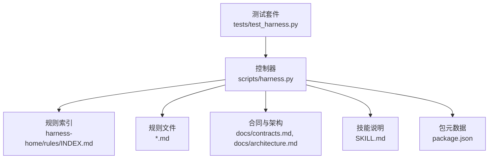
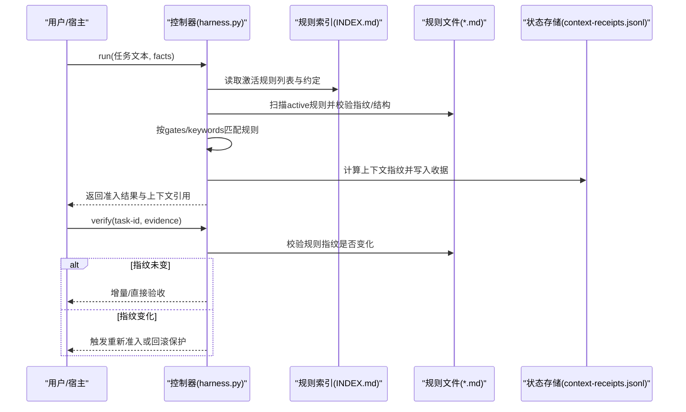
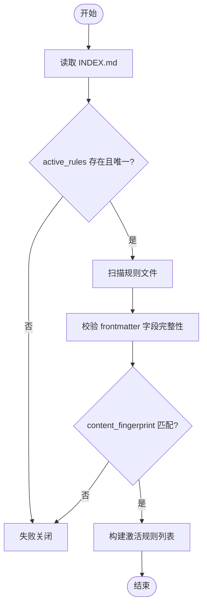
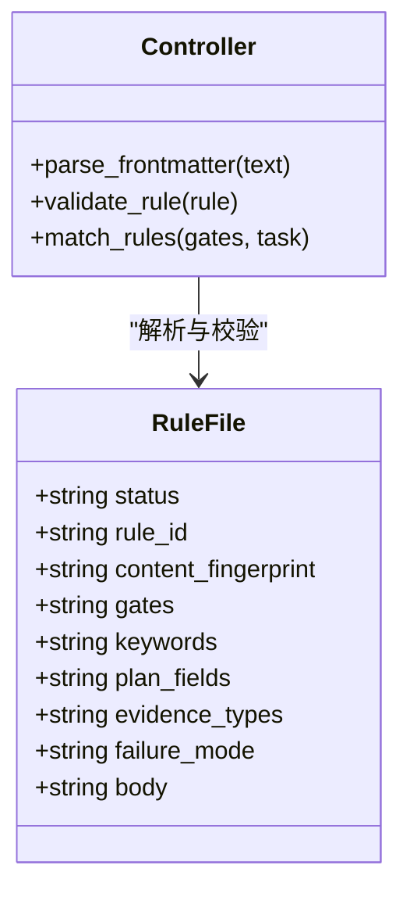
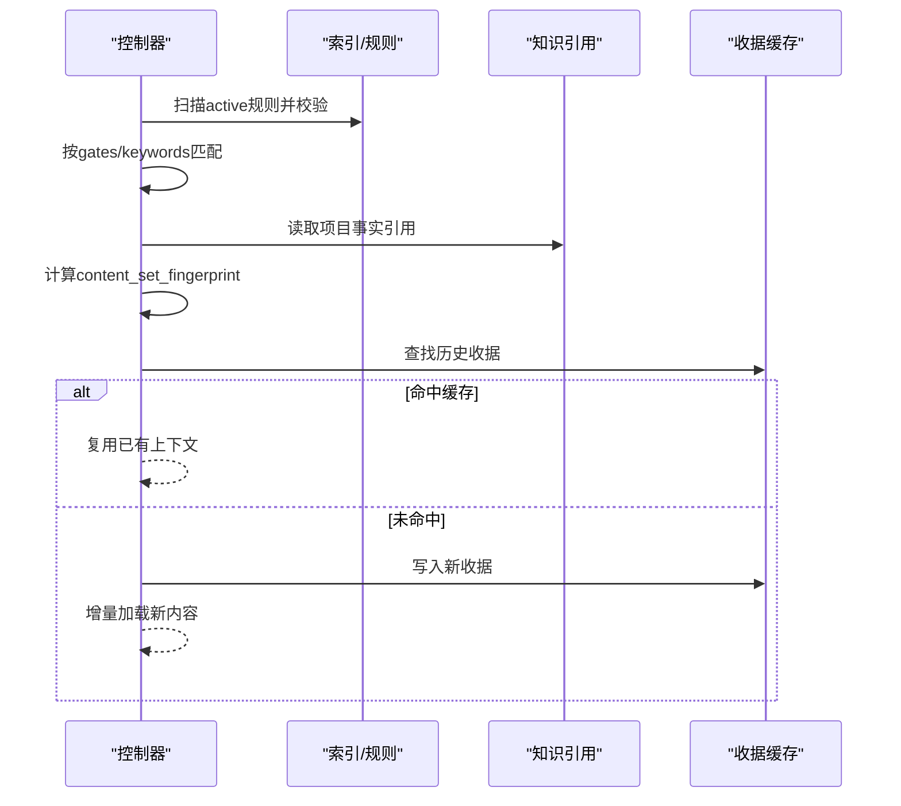
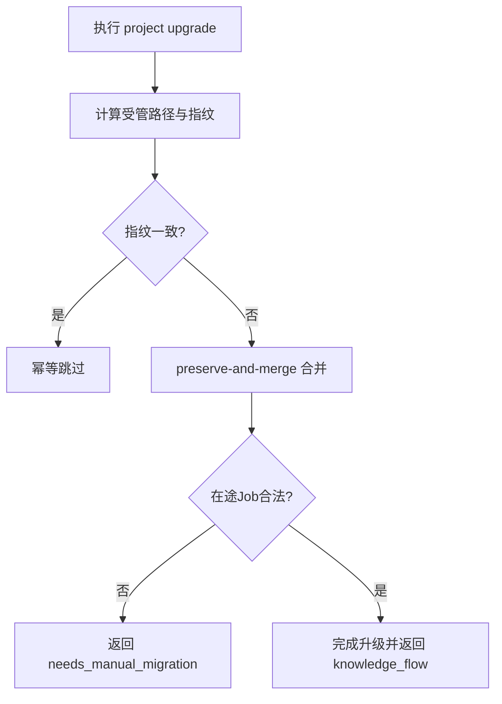
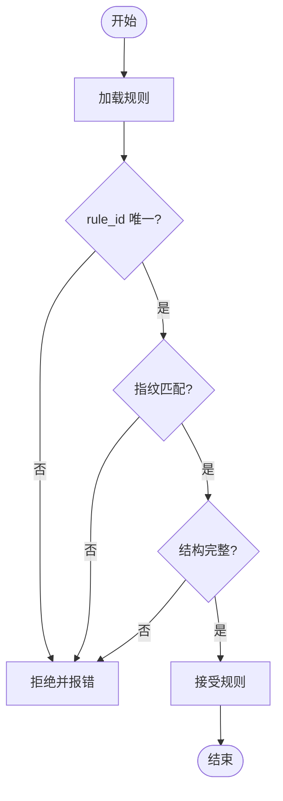
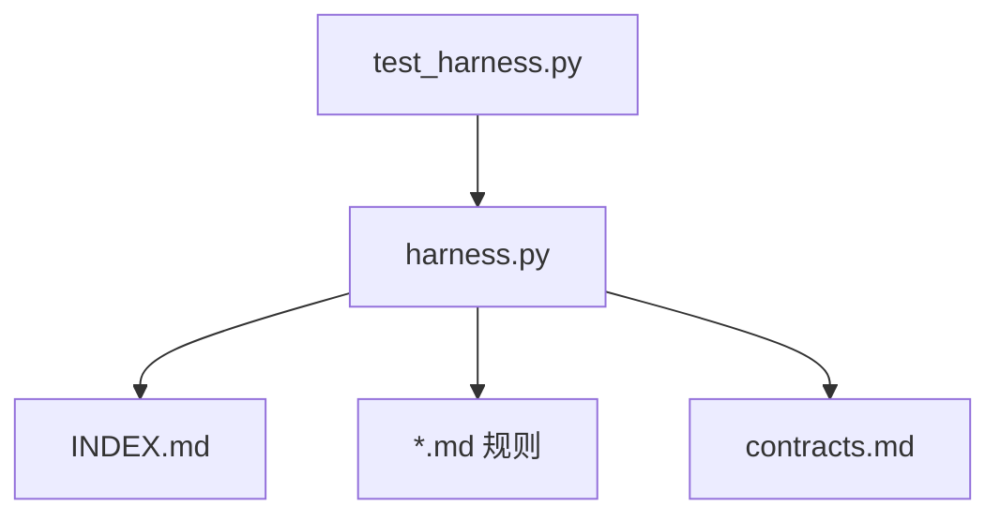

# 规则管理

<cite>
**本文引用的文件**   
- [harness.py](file://scripts/harness.py)
- [INDEX.md](file://harness-home/rules/INDEX.md)
- [api-compatibility.md](file://harness-home/rules/api-compatibility.md)
- [_rule-template.md](file://harness-home/rules/_rule-template.md)
- [contracts.md](file://docs/contracts.md)
- [architecture.md](file://docs/architecture.md)
- [SKILL.md](file://SKILL.md)
- [package.json](file://package.json)
- [test_harness.py](file://tests/test_harness.py)
</cite>

## 目录
1. [引言](#引言)
2. [项目结构](#项目结构)
3. [核心组件](#核心组件)
4. [架构总览](#架构总览)
5. [详细组件分析](#详细组件分析)
6. [依赖关系分析](#依赖关系分析)
7. [性能考量](#性能考量)
8. [故障排查指南](#故障排查指南)
9. [结论](#结论)
10. [附录](#附录)

## 引言
本文件面向 Docs Harness 的规则管理系统，系统性阐述规则索引文件的结构与职责、激活与停用机制、动态加载与热更新策略、版本管理与迁移路径、依赖关系与冲突处理，以及生命周期最佳实践与审计合规方法。读者可据此在项目中正确安装、维护与演进规则集，确保任务准入、上下文构建与验收流程的稳定与安全。

## 项目结构
- 控制器源码位于 scripts/harness.py，负责规则发现、校验、匹配、加载与上下文指纹化。
- 规则真源位于 harness-home/rules/，包含 INDEX.md（索引）、若干 .md 规则文件及模板 _rule-template.md。
- 合同与架构文档位于 docs/contracts.md 与 docs/architecture.md，描述任务包、证据、Git 状态等契约。
- SKILL.md 提供高层使用说明与行为约定；package.json 声明版本与脚本。
- tests/test_harness.py 覆盖规则安装、激活与自测等关键路径。

**图表来源** 
- [harness.py](file://scripts/harness.py)
- [INDEX.md](file://harness-home/rules/INDEX.md)
- [contracts.md](file://docs/contracts.md)
- [architecture.md](file://docs/architecture.md)
- [SKILL.md](file://SKILL.md)
- [package.json](file://package.json)
- [test_harness.py](file://tests/test_harness.py)

**章节来源**
- [architecture.md:1-26](file://docs/architecture.md#L1-L26)
- [package.json:1-23](file://package.json#L1-L23)

## 核心组件
- 规则索引 INDEX.md：声明当前快照的生效规则列表、规则文件清单、激活条件与加载约定，保证安装后规则集的可验证性与一致性。
- 规则文件 *.md：以 frontmatter 声明 status、rule_id、content_fingerprint、gates、keywords、plan_fields、evidence_types、failure_mode 等元数据，正文需包含固定标题段落。
- 控制器规则引擎：解析 frontmatter、校验指纹与结构、按 gates/keywords 匹配任务、生成上下文并缓存收据。

**章节来源**
- [INDEX.md:1-41](file://harness-home/rules/INDEX.md#L1-L41)
- [api-compatibility.md:1-29](file://harness-home/rules/api-compatibility.md#L1-L29)
- [_rule-template.md:1-21](file://harness-home/rules/_rule-template.md#L1-L21)
- [harness.py:2071-2137](file://scripts/harness.py#L2071-L2137)

## 架构总览
规则系统围绕“索引 + 受管快照 + 指纹校验”的闭环运行：
- 安装时复制固定快照到目标项目的 .docs-harness/harness-home/rules/，并在配置中记录指纹。
- 运行时通过 load_active_rules 扫描 active 规则，校验 rule_id 唯一、指纹一致、结构完整。
- 根据 gates/keywords 匹配任务，生成上下文内容集合与指纹，写入 context-receipts.jsonl 实现增量复用。
- verify 阶段若规则指纹变化或合同变更，触发重新准入或增量准入。

**图表来源** 
- [harness.py:2071-2137](file://scripts/harness.py#L2071-L2137)
- [harness.py:4029-4228](file://scripts/harness.py#L4029-L4228)
- [INDEX.md:1-41](file://harness-home/rules/INDEX.md#L1-L41)

**章节来源**
- [contracts.md:1-200](file://docs/contracts.md#L1-L200)
- [harness.py:4029-4228](file://scripts/harness.py#L4029-L4228)

## 详细组件分析

### 规则索引与激活列表
- INDEX.md 明确 active_rules 列表、规则文件清单、激活条件与加载约定。
- 控制器在安装与升级时复制快照，要求 HEAD 包含完整清单方可声明 clone_ready=true。
- 缺失、新增或变化均失败关闭，必须通过来源包升级或人工 preserve-and-merge。

**图表来源** 
- [INDEX.md:1-41](file://harness-home/rules/INDEX.md#L1-L41)
- [harness.py:2071-2137](file://scripts/harness.py#L2071-L2137)

**章节来源**
- [INDEX.md:1-41](file://harness-home/rules/INDEX.md#L1-L41)
- [harness.py:2071-2137](file://scripts/harness.py#L2071-L2137)

### 规则文件结构与校验
- 每个规则文件必须包含固定 frontmatter 字段与四个必需标题段落。
- 控制器校验 rule_id 唯一、content_fingerprint 与正文一致、gates/keywords 至少其一存在、plan_fields/evidence_types/failure_mode 非空。
- 模板 _rule-template.md 提供标准骨架，便于新增规则。

**图表来源** 
- [api-compatibility.md:1-29](file://harness-home/rules/api-compatibility.md#L1-L29)
- [_rule-template.md:1-21](file://harness-home/rules/_rule-template.md#L1-L21)
- [harness.py:2071-2137](file://scripts/harness.py#L2071-L2137)

**章节来源**
- [api-compatibility.md:1-29](file://harness-home/rules/api-compatibility.md#L1-L29)
- [_rule-template.md:1-21](file://harness-home/rules/_rule-template.md#L1-L21)
- [harness.py:2071-2137](file://scripts/harness.py#L2071-L2137)

### 规则匹配与上下文加载
- 匹配策略：优先 gates 交集，其次 keywords（区分只读/元数据写入场景下的限制）。
- 上下文指纹：将命中规则与项目事实引用统一哈希，跨 stage 复用，避免重复加载。
- 收据缓存：context-receipts.jsonl 记录已交付内容指纹，支持增量复用与 delta 识别。

**图表来源** 
- [harness.py:4029-4228](file://scripts/harness.py#L4029-L4228)
- [harness.py:2071-2137](file://scripts/harness.py#L2071-L2137)

**章节来源**
- [harness.py:4029-4228](file://scripts/harness.py#L4029-L4228)
- [harness.py:2071-2137](file://scripts/harness.py#L2071-L2137)

### 规则版本管理与迁移
- 快照与指纹：安装时复制固定快照，配置记录 installed_rule_fingerprints；任何漂移导致失败关闭。
- 升级路径：project upgrade --apply 仅同步受管文件与受管区块，非法路由或缺少合同的在途 Job 返回 needs_manual_migration。
- 回滚策略：存在活动 v2 任务时 rollback-check 阻断回滚；v1 在途任务需显式 migrate --apply 后重新准入。

**图表来源** 
- [harness.py:1906-2150](file://scripts/harness.py#L1906-L2150)
- [contracts.md:1-200](file://docs/contracts.md#L1-L200)
- [SKILL.md:1-105](file://SKILL.md#L1-L105)

**章节来源**
- [harness.py:1906-2150](file://scripts/harness.py#L1906-L2150)
- [contracts.md:1-200](file://docs/contracts.md#L1-L200)
- [SKILL.md:1-105](file://SKILL.md#L1-L105)

### 规则依赖与冲突处理
- 前置检查：active 规则必须满足字段完整性与指纹一致性；无 active 规则则失败关闭。
- 冲突检测：rule_id 重复、指纹不匹配、结构不完整均被拒绝。
- 解决策略：通过来源包升级或人工 preserve-and-merge 修正；禁止越界 rules_root 与绝对路径。

**图表来源** 
- [harness.py:2071-2137](file://scripts/harness.py#L2071-L2137)

**章节来源**
- [harness.py:2071-2137](file://scripts/harness.py#L2071-L2137)

### 规则生命周期最佳实践
- 开发：使用 _rule-template.md 创建规则，完善 frontmatter 与四段正文。
- 测试：通过 self-test 与单元测试验证规则激活与指纹一致性。
- 部署：project init/upgrade 安装快照，确保 HEAD 包含完整清单。
- 维护：监控指纹漂移与 in_head 状态，必要时进行 preserve-and-merge。
- 审计：基于 contracts.md 的证据与 Git 状态合同，确保可追溯与可验证。

**章节来源**
- [test_harness.py:339-354](file://tests/test_harness.py#L339-L354)
- [SKILL.md:1-105](file://SKILL.md#L1-L105)
- [contracts.md:1-200](file://docs/contracts.md#L1-L200)

## 依赖关系分析
- 控制器依赖规则索引与规则文件，依赖合同定义任务包与证据格式。
- 安装与升级依赖 Git 工作区与 HEAD 一致性检查。
- 测试套件依赖控制器模块与规则目录结构。

**图表来源** 
- [harness.py](file://scripts/harness.py)
- [INDEX.md](file://harness-home/rules/INDEX.md)
- [contracts.md](file://docs/contracts.md)
- [test_harness.py](file://tests/test_harness.py)

**章节来源**
- [harness.py](file://scripts/harness.py)
- [test_harness.py](file://tests/test_harness.py)

## 性能考量
- 规则扫描与指纹计算为 O(n) 文件遍历，n 为规则文件数量，通常较小。
- 上下文指纹与收据缓存避免重复加载，显著降低后续 run/verify 开销。
- Git 预检与后检采用子进程调用，注意超时与错误码处理。

[本节为通用指导，无需特定文件来源]

## 故障排查指南
- 常见错误：
  - missing_harness_home：规则目录不存在或不可达。
  - invalid_config：rules_root 无效或越界。
  - stale_rule：规则指纹变化，需重新准入或升级。
  - invalid_scope_description：范围描述含自然语言，应改为路径/glob。
- 诊断步骤：
  - 检查 INDEX.md 与规则文件是否存在且指纹一致。
  - 查看 context-receipts.jsonl 确认上下文缓存状态。
  - 使用 project check 与 self-test 定位问题。

**章节来源**
- [harness.py:2071-2137](file://scripts/harness.py#L2071-L2137)
- [harness.py:4029-4228](file://scripts/harness.py#L4029-L4228)
- [test_harness.py:356-376](file://tests/test_harness.py#L356-L376)

## 结论
Docs Harness 规则管理系统以索引驱动、快照受管、指纹校验为核心，实现了高内聚、低耦合的规则生命周期管理。通过严格的激活条件、上下文指纹化与收据缓存，系统在保障安全与可审计的同时，提供了高效的动态加载与热更新能力。遵循本文档的最佳实践与故障排查方法，可在项目中稳定地演进与维护规则集。

[本节为总结性内容，无需特定文件来源]

## 附录
- 规则模板：_rule-template.md
- 示例规则：api-compatibility.md
- 合同参考：docs/contracts.md
- 架构事实：docs/architecture.md
- 技能说明：SKILL.md
- 包元数据：package.json

**章节来源**
- [_rule-template.md:1-21](file://harness-home/rules/_rule-template.md#L1-L21)
- [api-compatibility.md:1-29](file://harness-home/rules/api-compatibility.md#L1-L29)
- [contracts.md:1-200](file://docs/contracts.md#L1-L200)
- [architecture.md:1-26](file://docs/architecture.md#L1-L26)
- [SKILL.md:1-105](file://SKILL.md#L1-L105)
- [package.json:1-23](file://package.json#L1-L23)