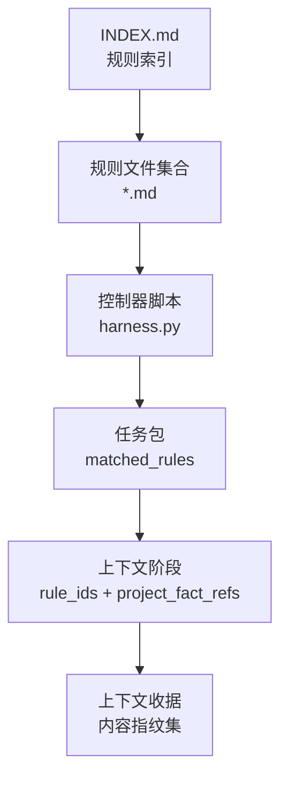
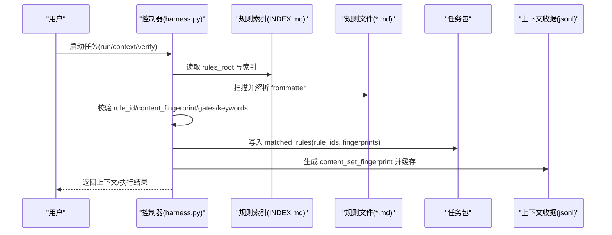
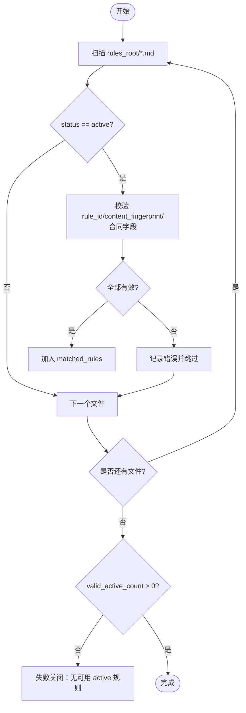
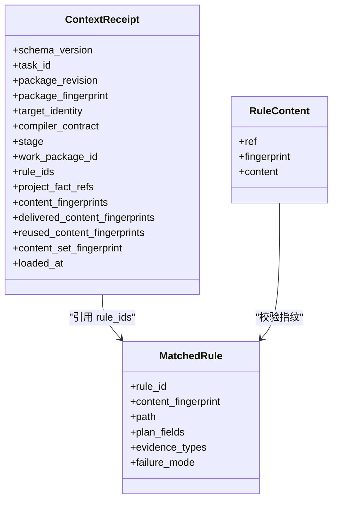
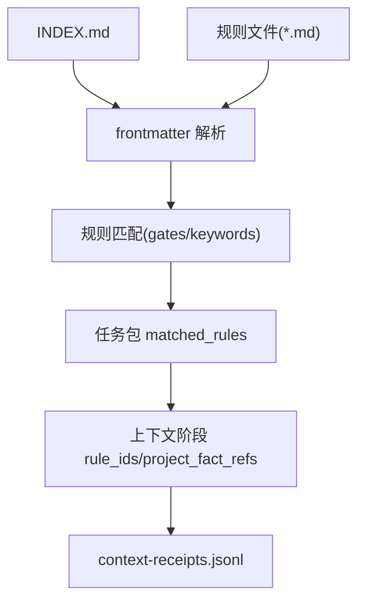

# 规则索引管理

<cite>
**本文引用的文件**   
- [harness-home/rules/INDEX.md](file://harness-home/rules/INDEX.md)
- [scripts/harness.py](file://scripts/harness.py)
- [tests/test_harness.py](file://tests/test_harness.py)
- [harness-home/rules/_rule-template.md](file://harness-home/rules/_rule-template.md)
- [harness-home/rules/api-compatibility.md](file://harness-home/rules/api-compatibility.md)
- [harness-home/rules/documentation-changes.md](file://harness-home/rules/documentation-changes.md)
- [harness-home/rules/external-input-security.md](file://harness-home/rules/external-input-security.md)
- [harness-home/rules/release-authorization-rollback.md](file://harness-home/rules/release-authorization-rollback.md)
- [harness-home/rules/scope-change-readmission.md](file://harness-home/rules/scope-change-readmission.md)
</cite>

## 目录
1. [简介](#简介)
2. [项目结构](#项目结构)
3. [核心组件](#核心组件)
4. [架构总览](#架构总览)
5. [详细组件分析](#详细组件分析)
6. [依赖关系分析](#依赖关系分析)
7. [性能考量](#性能考量)
8. [故障排除指南](#故障排除指南)
9. [结论](#结论)
10. [附录](#附录)

## 简介
本文件为 Docs Harness 规则索引管理系统的权威文档，聚焦于 harness-home/rules/INDEX.md 的结构与作用、激活规则列表的维护机制、规则索引的版本控制策略（快照、版本锁定与回滚）、规则文件映射关系（规则ID与文件名、依赖声明与加载顺序），以及最佳实践、验证与故障排除方法。读者无需深入代码即可理解规则索引如何被安装、校验、匹配与在任务执行中安全使用。

## 项目结构
- 规则索引位于 harness-home/rules/INDEX.md，作为通用规则快照清单，包含：
  - status: index（表示该文件为索引）
  - active_rules: 当前生效的规则ID数组
  - 生效规则列表与规则文件列表
  - 激活条件与加载约定
- 具体规则文件以 Markdown 形式存在，每个规则包含 frontmatter 元数据（status、rule_id、content_fingerprint、gates、keywords、plan_fields、evidence_types、failure_mode）与正文章节。
- 控制器脚本 scripts/harness.py 负责解析 INDEX.md、扫描并校验规则文件、按 Gate 或关键词匹配规则，并在任务包中固化命中规则及其指纹。

**图表来源** 
- [harness-home/rules/INDEX.md](file://harness-home/rules/INDEX.md)
- [scripts/harness.py](file://scripts/harness.py)

**章节来源**
- [harness-home/rules/INDEX.md](file://harness-home/rules/INDEX.md)
- [scripts/harness.py](file://scripts/harness.py)

## 核心组件
- 规则索引 INDEX.md
  - status: index
  - active_rules: 当前生效规则ID列表
  - 生效规则列表与规则文件列表：用于人类可读的核对
  - 激活条件：仅 status: active、唯一 rule_id、正文指纹正确且合同字段完整的规则才能进入任务包
  - 加载约定：安装时复制固定规则快照，配置记录逐文件指纹；缺失、增加或变化均失败关闭，需通过升级或人工 preserve-and-merge
- 规则文件模板 _rule-template.md
  - 提供标准 frontmatter 字段与正文章节模板，确保一致性
- 控制器脚本 harness.py
  - 解析 INDEX.md 与规则文件 frontmatter
  - 计算并校验 content_fingerprint
  - 基于 gates 与 keywords 进行规则匹配
  - 将命中规则写入任务包的 matched_rules，并在上下文阶段引用 rule_ids 与 project_fact_refs
  - 通过 context-receipts.jsonl 缓存上下文内容指纹集，避免重复加载

**章节来源**
- [harness-home/rules/_rule-template.md](file://harness-home/rules/_rule-template.md)
- [scripts/harness.py](file://scripts/harness.py)

## 架构总览
规则索引管理的整体流程如下：
- 安装阶段：从 harness-home/rules 复制规则快照到项目内 .docs-harness/harness-home/rules，并在配置中记录 rules_root
- 运行阶段：控制器读取 rules_root，扫描 *.md 规则文件，校验 frontmatter 与指纹，按 Gate/关键词匹配生成 matched_rules
- 上下文阶段：根据 schedule.rule_ids 与 project_fact_refs 构建内容指纹集，写入 context-receipts.jsonl 实现缓存与一致性检查
- 执行阶段：通过 rule_content() 再次校验规则状态与指纹，防止“规则已变化”导致的不一致

**图表来源** 
- [scripts/harness.py](file://scripts/harness.py)
- [harness-home/rules/INDEX.md](file://harness-home/rules/INDEX.md)

## 详细组件分析

### 规则索引 INDEX.md 结构与作用
- 关键字段
  - status: index（标识为索引文件）
  - active_rules: 当前生效规则ID数组
  - 生效规则列表与规则文件列表：便于人工核对与审计
- 激活条件
  - 仅 status: active、rule_id 唯一、正文指纹正确且合同字段完整（含 plan_fields、evidence_types、failure_mode）的规则可进入任务包
- 加载约定
  - 安装时复制固定规则快照，配置记录逐文件指纹；任何缺失、新增或变更都会触发失败关闭，必须通过来源包升级或人工 preserve-and-merge

**章节来源**
- [harness-home/rules/INDEX.md](file://harness-home/rules/INDEX.md)

### 规则文件结构与字段说明
- frontmatter 字段
  - status: 规则状态（active/scaffold 等）
  - rule_id: 规则唯一标识（如 DH-API-COMPATIBILITY）
  - content_fingerprint: 正文内容的 sha256 指纹
  - gates: 触发的 Gate 名称（逗号分隔）
  - keywords: 关键词（逗号分隔，用于任务文本匹配）
  - plan_fields: 必需的方案字段（逗号分隔）
  - evidence_types: 验收证据类型（逗号分隔）
  - failure_mode: 失败处理方式描述
- 正文章节要求
  - 适用条件、必需的方案字段、验收条件、失败处理方式（四个章节必须存在）

示例规则文件参考：
- api-compatibility.md
- documentation-changes.md
- external-input-security.md
- release-authorization-rollback.md
- scope-change-readmission.md

**章节来源**
- [harness-home/rules/_rule-template.md](file://harness-home/rules/_rule-template.md)
- [harness-home/rules/api-compatibility.md](file://harness-home/rules/api-compatibility.md)
- [harness-home/rules/documentation-changes.md](file://harness-home/rules/documentation-changes.md)
- [harness-home/rules/external-input-security.md](file://harness-home/rules/external-input-security.md)
- [harness-home/rules/release-authorization-rollback.md](file://harness-home/rules/release-authorization-rollback.md)
- [harness-home/rules/scope-change-readmission.md](file://harness-home/rules/scope-change-readmission.md)

### 激活规则列表的维护机制
- 启用与停用流程
  - 启用：将规则文件的 status 设置为 active，并确保 rule_id 唯一、content_fingerprint 正确、合同字段完整
  - 停用：将 status 改为非 active（如 scaffold），并从 INDEX.md 的 active_rules 移除对应 ID
- 状态同步与一致性检查
  - 控制器在 load_active_rules() 中遍历 *.md，过滤 status: active，校验 rule_id 唯一性与 content_fingerprint 匹配
  - 若 valid_active_count 为 0 且无错误，会报告“没有可执行的 active 规则”
  - 测试用例 self-test 会断言 shipped 规则均为 active，且 INDEX.md 包含所有 ACTIVE_RULE_IDS

**图表来源** 
- [scripts/harness.py](file://scripts/harness.py)

**章节来源**
- [scripts/harness.py](file://scripts/harness.py)
- [tests/test_harness.py](file://tests/test_harness.py)

### 规则索引的版本控制策略
- 快照机制
  - 安装时将 harness-home/rules 复制到项目内 .docs-harness/harness-home/rules，形成固定快照
  - 配置中记录 rules_root 指向该快照目录
- 版本锁定
  - 每个规则文件的 content_fingerprint 锁定正文内容；任何修改都会导致指纹不匹配
  - 控制器在 rule_content() 中再次校验 status 与 fingerprint，防止“规则已变化”
- 回滚操作
  - 当规则缺失、增加或变化时，系统失败关闭，需通过来源包升级或人工 preserve-and-merge 恢复一致性

**章节来源**
- [scripts/harness.py](file://scripts/harness.py)
- [harness-home/rules/INDEX.md](file://harness-home/rules/INDEX.md)

### 规则文件映射关系
- 规则ID与文件名对应关系
  - INDEX.md 的 active_rules 列出规则ID，规则文件以 *.md 命名，二者通过 rule_id 关联
- 依赖声明
  - 规则通过 gates 与 keywords 声明触发条件；控制器按 Gate 或关键词匹配
- 加载顺序
  - 控制器对 *.md 排序后遍历，保证确定性顺序；matched_rules 中的 rule_ids 保持该顺序

**章节来源**
- [harness-home/rules/INDEX.md](file://harness-home/rules/INDEX.md)
- [scripts/harness.py](file://scripts/harness.py)

### 上下文阶段与指纹缓存
- 上下文阶段
  - schedule.rule_ids 与 project_fact_refs 决定需要加载的规则与项目事实
- 指纹缓存
  - context_set_fingerprint() 计算规则与事实的内容指纹集，写入 context-receipts.jsonl
  - find_context_receipt() 通过 task_id、target_identity、compiler_contract、stage/work_package 与 content_set_fingerprint 匹配缓存

**图表来源** 
- [scripts/harness.py](file://scripts/harness.py)

**章节来源**
- [scripts/harness.py](file://scripts/harness.py)

## 依赖关系分析
- 模块耦合
  - INDEX.md 与规则文件为输入源；harness.py 为核心处理器；context-receipts.jsonl 为输出缓存
- 外部依赖
  - Git 与文件系统路径解析；JSONL 读写；sha256 指纹计算
- 潜在循环依赖
  - 无直接循环依赖；规则文件只读，控制器单向处理

**图表来源** 
- [scripts/harness.py](file://scripts/harness.py)
- [harness-home/rules/INDEX.md](file://harness-home/rules/INDEX.md)

**章节来源**
- [scripts/harness.py](file://scripts/harness.py)

## 性能考量
- 规则扫描复杂度
  - O(N) 扫描 rules_root/*.md，N 为规则文件数量；指纹计算为线性时间
- 缓存优化
  - context-receipts.jsonl 避免重复加载相同内容集，减少 I/O 与计算开销
- 内存占用
  - 规则内容与指纹集较小，通常不会成为瓶颈

[本节为一般性指导，无需特定文件来源]

## 故障排除指南
- 常见错误与原因
  - 缺少 rules_root 或规则目录不存在：检查项目配置与安装快照
  - active 规则缺少 rule_id 或 content_fingerprint：修正规则 frontmatter
  - content_fingerprint 与正文不匹配：重新计算指纹或恢复原始内容
  - rule_id 重复：确保唯一性
  - 无 active 规则：至少一个规则 status 为 active 且满足合同字段
- 调试步骤
  - 运行 self-test 验证 shipped 规则状态与 INDEX.md 一致性
  - 检查 context-receipts.jsonl 确认内容指纹集是否正确缓存
  - 查看 matched_rules 中的 rule_ids 与 fingerprints 是否与预期一致

**章节来源**
- [scripts/harness.py](file://scripts/harness.py)
- [tests/test_harness.py](file://tests/test_harness.py)

## 结论
Docs Harness 规则索引管理系统通过 INDEX.md 快照与规则文件指纹锁定，实现了严格的版本控制与一致性保障。控制器在运行期按 Gate/关键词匹配规则，并通过上下文收据缓存避免重复加载。遵循最佳实践与验证流程，可确保规则索引的稳定、可追溯与安全执行。

[本节为总结性内容，无需特定文件来源]

## 附录
- 最佳实践
  - 命名规范：rule_id 采用 DH-XXX-YYY 格式，保持语义清晰
  - 组织结构：规则文件按功能域分类，INDEX.md 集中管理 active_rules
  - 维护流程：变更规则需更新 frontmatter 与 INDEX.md，并通过自测与审查
- 验证方法
  - 使用 self-test 断言 shipped 规则状态与 INDEX.md 一致性
  - 检查 context-receipts.jsonl 与 matched_rules 的一致性

[本节为补充信息，无需特定文件来源]