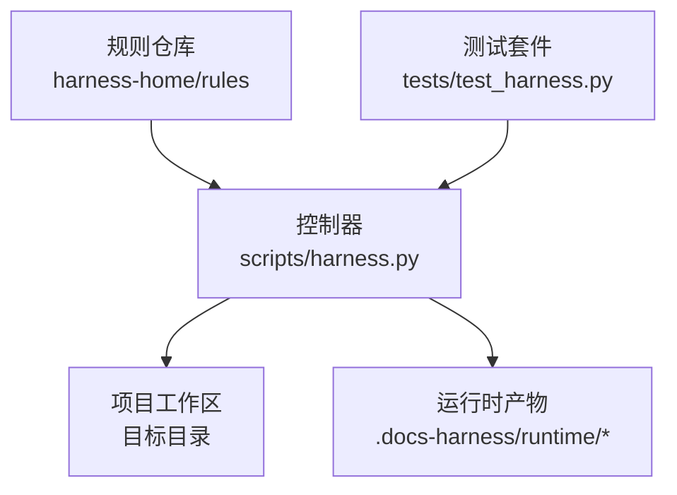
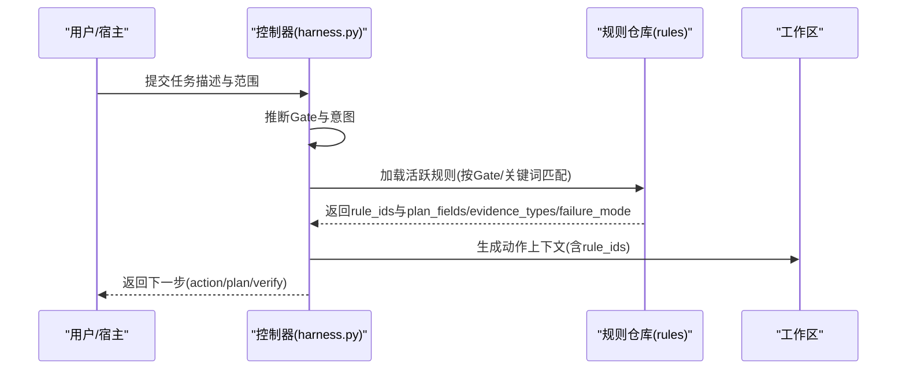
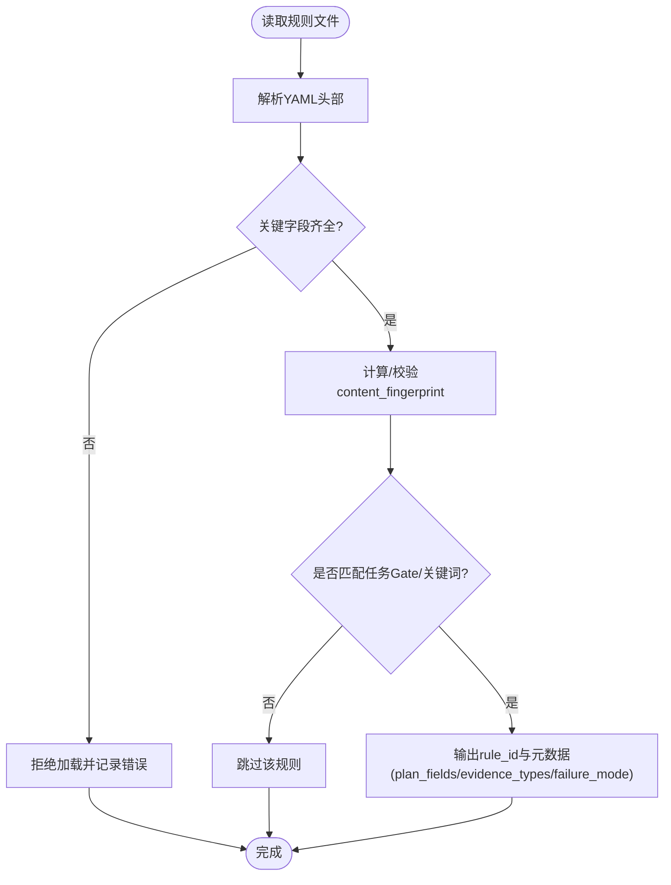
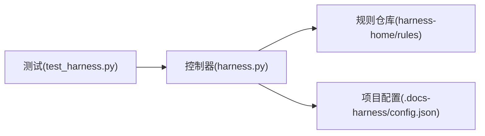

# 规则语法定义

<cite>
**本文引用的文件**
- [harness.py](file://scripts/harness.py)
- [INDEX.md](file://harness-home/rules/INDEX.md)
- [_rule-template.md](file://harness-home/rules/_rule-template.md)
- [api-compatibility.md](file://harness-home/rules/api-compatibility.md)
- [documentation-changes.md](file://harness-home/rules/documentation-changes.md)
- [external-input-security.md](file://harness-home/rules/external-input-security.md)
- [release-authorization-rollback.md](file://harness-home/rules/release-authorization-rollback.md)
- [scope-change-readmission.md](file://harness-home/rules/scope-change-readmission.md)
- [testing-release.md](file://harness-home/rules/testing-release.md)
- [ui-complete-states.md](file://harness-home/rules/ui-complete-states.md)
- [test_harness.py](file://tests/test_harness.py)
</cite>

## 目录
1. [简介](#简介)
2. [项目结构](#项目结构)
3. [核心组件](#核心组件)
4. [架构总览](#架构总览)
5. [详细组件分析](#详细组件分析)
6. [依赖关系分析](#依赖关系分析)
7. [性能考量](#性能考量)
8. [故障排查指南](#故障排查指南)
9. [结论](#结论)
10. [附录：语法规则参考与最佳实践](#附录：语法规则参考与最佳实践)

## 简介
本文件为 Docs Harness 规则引擎的“语法规则”权威说明，聚焦于规则文件的结构与语义、匹配与激活机制、以及控制器对规则的加载与执行流程。文档面向希望编写、维护或扩展规则的用户与开发者，既提供高层概念，也给出代码级依据与图示，帮助快速上手并避免常见陷阱。

## 项目结构
规则系统由三部分构成：
- 规则仓库：位于 harness-home/rules，包含规则索引、模板与各具体规则文件。
- 控制器：scripts/harness.py，负责解析任务、推断 Gate、加载规则、编译上下文、驱动执行与验证。
- 测试用例：tests/test_harness.py，覆盖规则安装、指纹校验、自测与运行路径。

图表来源
- [harness.py:1892-1922](file://scripts/harness.py#L1892-L1922)
- [INDEX.md:1-41](file://harness-home/rules/INDEX.md#L1-L41)

章节来源
- [harness.py:1892-1922](file://scripts/harness.py#L1892-L1922)
- [INDEX.md:1-41](file://harness-home/rules/INDEX.md#L1-L41)
- [test_harness.py:339-354](file://tests/test_harness.py#L339-L354)

## 核心组件
- 规则文件（Markdown + YAML 头部）：每个规则一个 .md 文件，YAML 头部声明状态、ID、指纹、Gate、关键词、必需方案字段、证据类型与失败模式。
- 规则索引 INDEX.md：列出当前快照中的生效规则 ID 与文件名，作为安装清单的一部分。
- 规则模板 _rule-template.md：新规则脚手架，包含头部字段占位与正文段落骨架。
- 控制器规则加载器：从 rules_root 扫描并解析规则，按 Gate 与关键词匹配任务，生成 rule_ids 与计划字段约束。

章节来源
- [_rule-template.md:1-21](file://harness-home/rules/_rule-template.md#L1-L21)
- [INDEX.md:1-41](file://harness-home/rules/INDEX.md#L1-L41)
- [harness.py:2057-2149](file://scripts/harness.py#L2057-L2149)

## 架构总览
规则引擎在任务进入时进行 Gate 推断与规则匹配，随后将匹配的 rule_ids 注入到动作上下文中，驱动后续的证据收集与验证。

图表来源
- [harness.py:2057-2149](file://scripts/harness.py#L2057-L2149)
- [harness.py:3036](file://scripts/harness.py#L3036)

章节来源
- [harness.py:2057-2149](file://scripts/harness.py#L2057-L2149)
- [harness.py:3036](file://scripts/harness.py#L3036)

## 详细组件分析

### 规则文件结构与字段
- 位置与命名：每个规则一个 Markdown 文件，位于 harness-home/rules；文件名无强制约定，但需与 INDEX.md 保持一致以通过安装校验。
- YAML 头部关键字段：
  - status：规则状态，如 active、scaffold、index 等。
  - rule_id：规则唯一标识，遵循 DH-前缀规范。
  - content_fingerprint：内容指纹，格式 sha256:...，用于完整性校验。
  - gates：触发 Gate 列表，与控制器内置 Gate 顺序和词表对应。
  - keywords：自然语言关键词集合，用于任务文本匹配。
  - plan_fields：必需的方案字段名集合，用于约束计划内容。
  - evidence_types：要求的证据类型集合，用于验收阶段校验。
  - failure_mode：失败处理策略描述，指导停止条件与重新准入。
- 正文结构：通常包含适用条件、必需方案字段、验收条件、失败处理方式等段落，便于人类阅读与审查。

图表来源
- [harness.py:2057-2149](file://scripts/harness.py#L2057-L2149)
- [INDEX.md:1-41](file://harness-home/rules/INDEX.md#L1-L41)

章节来源
- [_rule-template.md:1-21](file://harness-home/rules/_rule-template.md#L1-L21)
- [api-compatibility.md:1-29](file://harness-home/rules/api-compatibility.md#L1-L29)
- [documentation-changes.md:1-29](file://harness-home/rules/documentation-changes.md#L1-L29)
- [external-input-security.md:1-29](file://harness-home/rules/external-input-security.md#L1-L29)
- [release-authorization-rollback.md:1-29](file://harness-home/rules/release-authorization-rollback.md#L1-L29)
- [scope-change-readmission.md:1-29](file://harness-home/rules/scope-change-readmission.md#L1-L29)
- [testing-release.md:1-29](file://harness-home/rules/testing-release.md#L1-L29)
- [ui-complete-states.md:1-29](file://harness-home/rules/ui-complete-states.md#L1-L29)

### Gate 与优先级
- Gate 顺序：控制器内置了严格的 Gate 顺序，决定匹配与授权强度。例如 product-change、architecture-contract、security-sensitive、destructive-data、release-external、frontend-design、diagnosis-fix、testing-acceptance、review-audit、code-edit、document-edit。
- 安全底线：security-sensitive、destructive-data、release-external 属于“安全底线 Gate”，即使宿主声明更宽松也不能降级。
- 匹配策略：任务文本与 Gate 词表匹配，同时支持否定标记（如“不要”“无需”）抑制误报。

章节来源
- [harness.py:260-342](file://scripts/harness.py#L260-L342)
- [harness.py:381-389](file://scripts/harness.py#L381-L389)

### 规则匹配与激活
- 加载路径：rules_root_for(target) 定位规则根目录，installed_rule_names(config, rules_root) 获取已安装规则名集。
- 活跃规则过滤：load_active_rules(target, gate_order, task_text, match_all=False) 解析各规则 YAML 头部，按 status=active、rule_id 唯一、指纹正确、合同字段完整后纳入候选。
- 匹配逻辑：若规则未声明 gate_terms 且 keywords 为空则不参与匹配；否则当任务文本包含任一 keyword 或与 Gate 词表交集非空时命中。
- 产出：命中规则返回 rule_ids 及 plan_fields、evidence_types、failure_mode 等元数据，供后续上下文构建使用。

章节来源
- [harness.py:1892-1922](file://scripts/harness.py#L1892-L1922)
- [harness.py:2057-2149](file://scripts/harness.py#L2057-L2149)

### 动作上下文与执行流
- 动作上下文：当存在 rule_ids 或 project_fact_refs 时，next_action 设为 load_action_context，以便注入规则约束与事实引用。
- 执行分支：若无规则与事实引用，直接 execute；否则先加载上下文再执行。

章节来源
- [harness.py:3036](file://scripts/harness.py#L3036)
- [harness.py:4870-4901](file://scripts/harness.py#L4870-L4901)

### 规则模板与自定义扩展点
- 模板使用：_rule-template.md 提供标准头部与正文骨架，复制为新规则文件后填充字段即可。
- 扩展点：
  - 新增 Gate：需在控制器中补充 GATE_DEFS、GATE_ORDER、FLOOR_TERMS 与安全底线集合。
  - 新增 plan_fields/evidence_types：在规则文件中声明，并在控制器侧参与校验与提示。
  - 自定义指纹校验：content_fingerprint 必须为 sha256:... 格式，控制器会校验一致性。

章节来源
- [_rule-template.md:1-21](file://harness-home/rules/_rule-template.md#L1-L21)
- [harness.py:260-342](file://scripts/harness.py#L260-L342)
- [harness.py:2057-2149](file://scripts/harness.py#L2057-L2149)

## 依赖关系分析
- 控制器依赖规则仓库：通过 rules_root_for 与 installed_rule_names 定位与枚举规则。
- 测试依赖控制器模块：导入 harness.py 暴露的函数与常量，验证规则安装、指纹、自测与运行路径。
- 规则间无直接耦合：通过 INDEX.md 与控制器加载逻辑解耦，保证可替换与可升级。

图表来源
- [test_harness.py:339-354](file://tests/test_harness.py#L339-L354)
- [harness.py:1892-1922](file://scripts/harness.py#L1892-L1922)

章节来源
- [test_harness.py:339-354](file://tests/test_harness.py#L339-L354)
- [harness.py:1892-1922](file://scripts/harness.py#L1892-L1922)

## 性能考量
- 规则加载开销：规则文件较小且数量可控，主要成本在于 YAML 解析与指纹计算，通常在毫秒级。
- 匹配优化：优先基于 Gate 词表快速筛选，再应用 keywords 匹配，减少全量文本比较。
- I/O 限制：控制器对输入文件大小与 JSON 行数有上限保护，避免恶意或异常输入导致资源耗尽。

[本节为通用指导，不直接分析具体文件]

## 故障排查指南
- 规则缺失或指纹不一致：检查 rules_root 是否存在、INDEX.md 是否同步、content_fingerprint 是否与文件一致。
- 规则未命中：确认 status=active、rule_id 唯一、gates/keywords 设置合理，任务文本是否包含关键词或触发 Gate。
- 计划字段不足：根据 plan_fields 补齐方案内容，确保验收阶段可被校验。
- 证据类型不符：按 evidence_types 准备相应证据，确保 producer、result、covers 等字段完整。

章节来源
- [harness.py:2057-2149](file://scripts/harness.py#L2057-L2149)
- [test_harness.py:339-354](file://tests/test_harness.py#L339-L354)

## 结论
Docs Harness 的规则系统以“轻量 Markdown + YAML 头部”为核心，配合控制器的 Gate 推断与规则匹配，形成稳定、可扩展、可审计的规则治理体系。通过严格的状态、指纹与字段校验，确保规则在版本化与迁移过程中的可靠性与一致性。

[本节为总结性内容，不直接分析具体文件]

## 附录：语法规则参考与最佳实践

### 规则文件字段参考
- status：必填，常用值 active、scaffold、index。
- rule_id：必填，全局唯一，建议以 DH- 开头。
- content_fingerprint：必填，sha256:... 格式，用于完整性校验。
- gates：可选，字符串或数组，与控制器 Gate 名称一致。
- keywords：可选，字符串或数组，用于自然语言匹配。
- plan_fields：必填，字符串或数组，规定计划必需字段。
- evidence_types：必填，字符串或数组，规定验收证据类型。
- failure_mode：必填，描述失败时的处理策略。

章节来源
- [_rule-template.md:1-21](file://harness-home/rules/_rule-template.md#L1-L21)
- [harness.py:2057-2149](file://scripts/harness.py#L2057-L2149)

### 条件表达式与匹配语法
- Gate 匹配：基于内置词表与顺序，支持否定标记抑制误报。
- 关键词匹配：大小写不敏感，支持多词组合。
- 复合匹配：gate_terms 与 keywords 同时存在时，满足其一即命中。

章节来源
- [harness.py:260-342](file://scripts/harness.py#L260-L342)
- [harness.py:381-389](file://scripts/harness.py#L381-L389)
- [harness.py:2057-2149](file://scripts/harness.py#L2057-L2149)

### 动作定义与执行
- 命令执行：由控制器在执行阶段调用外部命令或脚本，受 mutation_profile 与 write_scope 约束。
- 文件检查：控制器在工作区与 Git 层进行差异与状态校验，确保变更范围与预期一致。
- 状态设置：动作结果写入运行时产物（事件、证据、收据），供 verify 阶段消费。

章节来源
- [harness.py:3036](file://scripts/harness.py#L3036)
- [harness.py:4870-4901](file://scripts/harness.py#L4870-L4901)

### 优先级与依赖关系
- Gate 优先级：由 GATE_ORDER 决定，越靠前风险越高，授权越强。
- 安全底线：security-sensitive、destructive-data、release-external 不可降级。
- 规则依赖：规则之间无直接依赖，通过 INDEX.md 与控制器加载顺序间接影响。

章节来源
- [harness.py:260-342](file://scripts/harness.py#L260-L342)
- [INDEX.md:1-41](file://harness-home/rules/INDEX.md#L1-L41)

### 验证规则与最佳实践
- 指纹一致性：每次修改规则后更新 content_fingerprint，保持与文件一致。
- 最小权限：仅声明必要的 gates 与 keywords，避免过度匹配。
- 明确失败模式：failure_mode 应清晰描述停止条件与重新准入路径。
- 证据完备：按 evidence_types 准备充分证据，覆盖正向与负向路径。

章节来源
- [harness.py:2057-2149](file://scripts/harness.py#L2057-L2149)
- [test_harness.py:339-354](file://tests/test_harness.py#L339-L354)