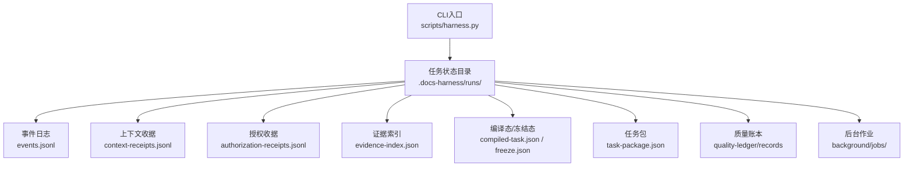
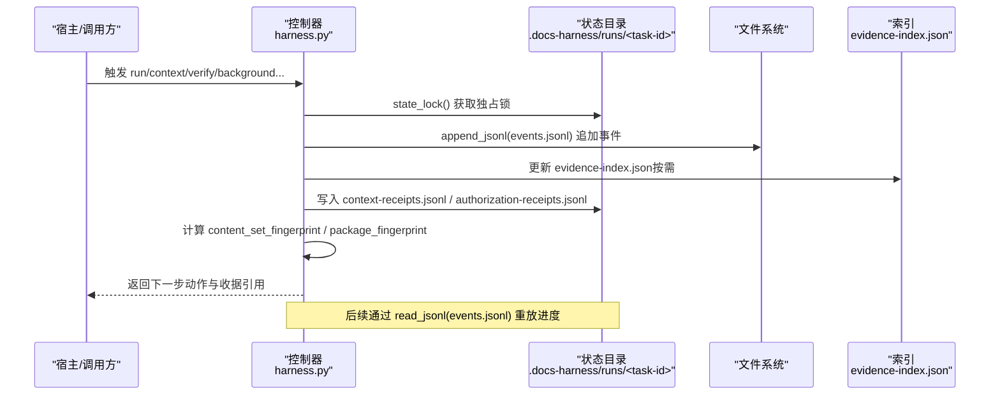
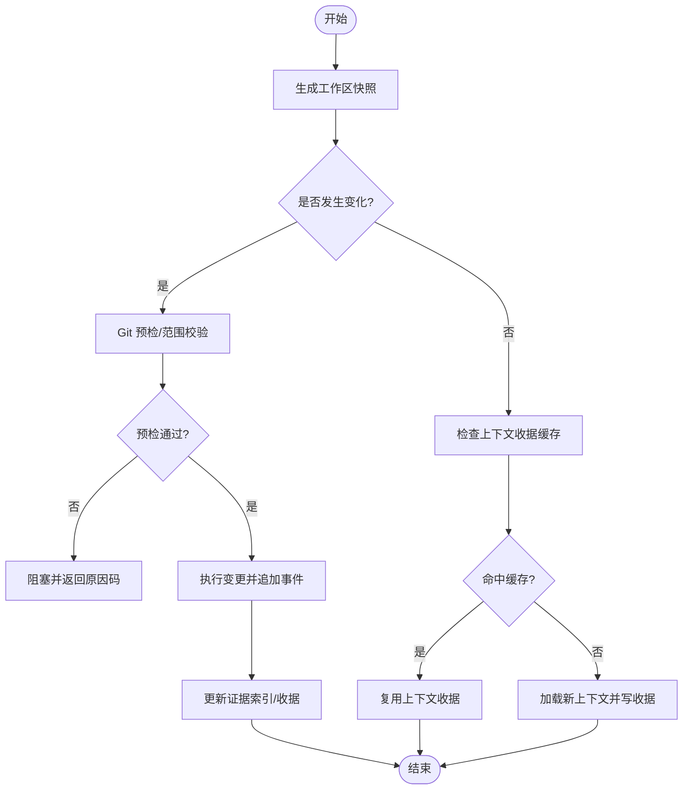
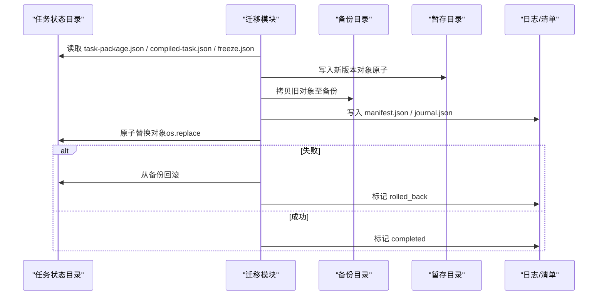
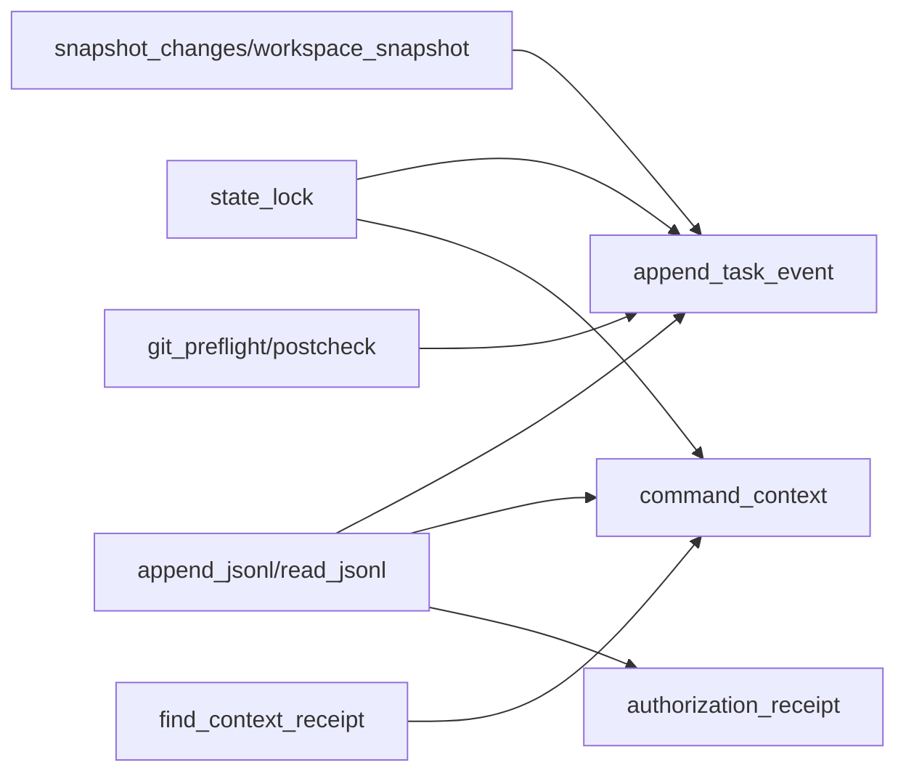

# 收据存储管理

<cite>
**本文引用的文件**   
- [scripts/harness.py](file://scripts/harness.py)
- [tests/test_harness.py](file://tests/test_harness.py)
- [package.json](file://package.json)
- [SKILL.md](file://SKILL.md)
</cite>

## 目录
1. [简介](#简介)
2. [项目结构](#项目结构)
3. [核心组件](#核心组件)
4. [架构总览](#架构总览)
5. [详细组件分析](#详细组件分析)
6. [依赖关系分析](#依赖关系分析)
7. [性能考虑](#性能考虑)
8. [故障排查指南](#故障排查指南)
9. [结论](#结论)
10. [附录](#附录)

## 简介
本文件面向 Docs Harness 的“证据收据存储管理”，围绕以下目标展开：
- 收据存储格式设计：JSONL 追加式事件与收据、索引结构与一致性约束。
- 增量更新机制：变更检测、合并策略与冲突解决。
- 缓存策略：内存/磁盘缓存与失效机制（上下文收据、验证命令缓存）。
- 备份与恢复：数据迁移、版本升级与回滚流程。
- 存储 API 接口规范与操作示例。
- 性能优化、空间管理与清理策略。
- 数据安全与访问控制。

## 项目结构
Docs Harness 以 Python CLI 为核心，运行时状态与收据存储在任务工作目录下，采用 JSONL 追加日志与 JSON 索引的组合方式，确保可审计、可重放与幂等性。关键路径约定如下：
- 运行根目录：Git 仓库内 .git/docs-harness/runs/<task-id> 或本地 .docs-harness/runs/<task-id>
- 事件与收据：events.jsonl、context-receipts.jsonl、authorization-receipts.jsonl
- 索引与快照：evidence-index.json、compiled-task.json、freeze.json、task-package.json
- 质量账本：quality-ledger/records
- 后台作业：background/jobs/<job-id>

**图表来源** 
- [scripts/harness.py:80-90](file://scripts/harness.py#L80-L90)
- [scripts/harness.py:909-925](file://scripts/harness.py#L909-L925)

**章节来源**
- [scripts/harness.py:80-90](file://scripts/harness.py#L80-L90)
- [scripts/harness.py:909-925](file://scripts/harness.py#L909-L925)

## 核心组件
- 事件与收据写入器：append_jsonl/read_jsonl 提供原子追加与行级解析校验。
- 任务状态锁：state_lock 基于独占文件锁保证并发安全。
- 上下文收据缓存：find_context_receipt/prior_context_content_fingerprints 实现按内容指纹的复用。
- 证据索引：evidence-index.json 维护证据条目集合，支持 v1→v2 兼容迁移。
- 授权收据：authorization-receipts.jsonl 记录授权结果与范围覆盖校验。
- 迁移与备份：migration-v1-v2 目录包含 staging/backup/journal/manifest，保障迁移原子性与可回滚。

**章节来源**
- [scripts/harness.py:510-533](file://scripts/harness.py#L510-L533)
- [scripts/harness.py:1011-1032](file://scripts/harness.py#L1011-L1032)
- [scripts/harness.py:4204-4286](file://scripts/harness.py#L4204-L4286)
- [scripts/harness.py:3352-3485](file://scripts/harness.py#L3352-L3485)

## 架构总览
下图展示收据从产生到落盘、索引与重放的完整链路。

**图表来源** 
- [scripts/harness.py:1034-1074](file://scripts/harness.py#L1034-L1074)
- [scripts/harness.py:4288-4434](file://scripts/harness.py#L4288-L4434)
- [scripts/harness.py:5099-5152](file://scripts/harness.py#L5099-L5152)

## 详细组件分析

### 收据存储格式与文件组织
- JSONL 事件与收据
  - events.jsonl：每个事件一行，包含 schema_version、event、phase、task_id、started_at、duration_ms、reason_code、package_revision、context_cache_hit、context_load_count、readmission_count、evidence_round_count、host_receipt_count、business_action_count、at 等字段。
  - context-receipts.jsonl：上下文收据，包含 task_id、package_revision、package_fingerprint、target_identity、compiler_contract、stage、work_package_id、rule_ids、project_fact_refs、content_fingerprints、delivered/reused fingerprints、content_set_fingerprint、loaded_at。
  - authorization-receipts.jsonl：授权收据，包含 task_id、package_revision、package_fingerprint、authorized_actions/scope/git_scope/external_scope、expires_at、source_ref、recorded_at 等。
- JSON 索引与快照
  - evidence-index.json：证据索引，schema_version=docs-harness/evidence-index/v2，包含 evidence 列表与 legacy_evidence 兼容字段。
  - compiled-task.json：编译态，包含 control_status、verification_status、next_action、work_package_states、evidence_refs、blockers、updated_at。
  - freeze.json：冻结态，包含 schema_version、package_revision、package_fingerprint、git_state_snapshot、migrated_at。
  - task-package.json：任务包，包含 schema_version、task_intent、mutation_profile、allowed_actions、write_scope、git_scope、external_scope 等。
- 运行时根目录定位
  - runtime_root(target) 优先使用 Git 仓库下的 .git/docs-harness/runs，否则回退到 .docs-harness/runs。

**章节来源**
- [scripts/harness.py:80-90](file://scripts/harness.py#L80-L90)
- [scripts/harness.py:1034-1074](file://scripts/harness.py#L1034-L1074)
- [scripts/harness.py:4288-4434](file://scripts/harness.py#L4288-L4434)
- [scripts/harness.py:5099-5152](file://scripts/harness.py#L5099-L5152)
- [scripts/harness.py:909-925](file://scripts/harness.py#L909-L925)

### 增量更新机制：变更检测、合并策略与冲突解决
- 变更检测
  - workspace_snapshot：对当前工作区生成文件指纹映射；大文件使用 size+mtime 指纹，小文件使用 sha256。
  - snapshot_changes：对比前后快照，输出差异路径集合。
  - git_preflight/postcheck：针对 git_fetch/git_sync 进行预检与后检查，包括远端目标不变性、受控 ref 范围、fast-forward、LFS/Submodule 可用性、脏工作区重叠等。
- 合并策略
  - 事件重放 replay_progress：基于 events.jsonl 重放 begin/submit/block 事件，重建 work_package 状态与证据引用。
  - 上下文增量：prior_context_content_fingerprints 收集历史已交付内容指纹，避免重复加载；find_context_receipt 按 content_set_fingerprint 命中缓存。
- 冲突解决
  - state_lock：基于独占文件锁，防止同一任务并发修改；超过 5 分钟锁视为陈旧锁，需人工干预。
  - git_sync 前置阻断：脏工作区与同步范围重叠、删除数量超阈值、非 fast-forward 等情况直接拒绝。
  - 授权不匹配：authorized_actions/scope/git_scope/external_scope 未覆盖任务包需求时失败关闭。

**图表来源** 
- [scripts/harness.py:1115-1142](file://scripts/harness.py#L1115-L1142)
- [scripts/harness.py:680-794](file://scripts/harness.py#L680-L794)
- [scripts/harness.py:5099-5152](file://scripts/harness.py#L5099-L5152)
- [scripts/harness.py:4204-4286](file://scripts/harness.py#L4204-L4286)

**章节来源**
- [scripts/harness.py:1115-1142](file://scripts/harness.py#L1115-L1142)
- [scripts/harness.py:680-794](file://scripts/harness.py#L680-L794)
- [scripts/harness.py:5099-5152](file://scripts/harness.py#L5099-L5152)
- [scripts/harness.py:4204-4286](file://scripts/harness.py#L4204-L4286)

### 缓存策略：内存缓存、磁盘缓存与失效机制
- 上下文收据缓存
  - find_context_receipt：按 task_id、target_identity、compiler_contract、stage/work_package、content_set_fingerprint 精确匹配。
  - prior_context_content_fingerprints：跨 stage 去重，避免重复交付相同内容指纹。
  - command_context：命中则标记 context_cache_hit=true，减少 IO 与计算。
- 验证命令缓存
  - verification_command_cache_enabled：默认开启，可通过项目配置 verification.command_cache_enabled 整体关闭。
  - volatile_verification_paths：忽略测试/构建临时产物，避免污染证据集。
- 失效机制
  - content_set_fingerprint 变化导致缓存失效。
  - package_revision 变化触发重新准入与重放。
  - 授权过期 expires_at 校验失败即失效。

**章节来源**
- [scripts/harness.py:4204-4286](file://scripts/harness.py#L4204-L4286)
- [scripts/harness.py:1191-1202](file://scripts/harness.py#L1191-L1202)
- [scripts/harness.py:1219-1236](file://scripts/harness.py#L1219-L1236)

### 备份与恢复：数据迁移与版本升级
- v1→v2 任务状态迁移
  - migrate_v1_task_state：创建 staging/backup/journal/manifest，原子替换对象，失败自动回滚。
  - recover_incomplete_task_migration：恢复中断的迁移，将 backup 中对象复制回原位置。
  - 迁移后强制重新准入：compiled-task 置为 blocked，next_action=rerun_harness_for_readmission。
- 证据索引兼容
  - evidence-index.json 保留 legacy_evidence 与 legacy_evidence_read_only 标志，仅读兼容旧证据。
- 打包与清单
  - manifest.json 记录对象指纹与时间戳，journal.json 记录应用状态与完成时间。

**图表来源** 
- [scripts/harness.py:3352-3485](file://scripts/harness.py#L3352-L3485)

**章节来源**
- [scripts/harness.py:3352-3485](file://scripts/harness.py#L3352-L3485)

### 存储 API 接口规范与操作示例
- 事件与收据写入
  - append_jsonl(path, value)：追加一行规范化 JSON 到 JSONL 文件，fsync 确保持久化。
  - read_jsonl(path)：逐行解析，校验类型与结构，异常抛出带错误码。
- 状态锁
  - state_lock(state)：基于独占文件锁，超时保护与陈旧锁提示。
- 上下文收据
  - command_context(...)：加载规则与事实，计算指纹，命中缓存则复用，否则写入 context-receipts.jsonl。
- 授权收据
  - authorization_receipt(path, package)：校验授权范围覆盖，写入 authorization-receipts.jsonl。
- 证据索引
  - evidence-index.json：新增证据条目，支持 legacy_evidence 只读兼容。
- 示例（概念性描述）
  - 运行任务：run --target <project> --task "<任务文本>" --json
  - 加载上下文：context --target <project> --task-id <task-id> --stage plan/action --json
  - 提交计划：run --target <project> --task-id <task-id> --plan <plan.json> --json
  - 验证证据：verify --target <project> --task-id <task-id> --evidence <evidence.json> --json

**章节来源**
- [scripts/harness.py:510-533](file://scripts/harness.py#L510-L533)
- [scripts/harness.py:1011-1032](file://scripts/harness.py#L1011-L1032)
- [scripts/harness.py:4288-4434](file://scripts/harness.py#L4288-L4434)
- [scripts/harness.py:4437-4486](file://scripts/harness.py#L4437-L4486)
- [SKILL.md:25-57](file://SKILL.md#L25-L57)

### 性能优化、空间管理与清理策略
- 性能优化
  - JSONL 追加写入 + fsync 保证顺序与持久化，避免随机写放大。
  - 上下文收据按 content_set_fingerprint 命中，减少重复加载。
  - 大文件指纹使用 size+mtime，降低哈希开销。
- 空间管理
  - workspace_snapshot 限制非 Git 工作区快照文件数（FALLBACK_SNAPSHOT_FILE_LIMIT），超限拒绝截断基线。
  - 忽略 .git、node_modules、.venv 及 .docs-harness 子目录 runs/quality-ledger/knowledge/knowledge-jobs/background。
- 清理策略
  - 验证命令缓存可通过 verification.command_cache_enabled 关闭。
  - 临时产物由 volatile_verification_paths 过滤，避免污染证据集。
  - 迁移过程使用 staging/backup，失败自动回滚，避免半写状态占用空间。

**章节来源**
- [scripts/harness.py:1115-1142](file://scripts/harness.py#L1115-L1142)
- [scripts/harness.py:1076-1086](file://scripts/harness.py#L1076-L1086)
- [scripts/harness.py:1191-1202](file://scripts/harness.py#L1191-L1202)
- [scripts/harness.py:1219-1236](file://scripts/harness.py#L1219-L1236)

### 数据安全与访问控制
- 输入校验与白名单
  - load_input_file/load_json_object_file：限制文件大小与类型，拒绝内联输入。
  - document_route_config：严格校验文档路由路径，禁止越界与符号链接。
- 安全底线 Gate
  - SAFETY_FLOOR_GATES：security-sensitive、destructive-data、release-external 不可豁免。
  - FLOOR_TERMS 与 NEGATION_MARKERS：精确词表与否定守卫，减少误报。
- 远程指纹脱敏
  - sanitized_remote_fingerprint：去除凭据与查询参数，仅保留主机与路径。
- 权限与范围
  - authorization_receipt：校验 authorized_actions/scope/git_scope/external_scope 覆盖任务包需求。
  - write_scope 内自动归因：workspace_attribution 收据与 auto_attributed_paths。

**章节来源**
- [scripts/harness.py:459-508](file://scripts/harness.py#L459-L508)
- [scripts/harness.py:1290-1348](file://scripts/harness.py#L1290-L1348)
- [scripts/harness.py:263-345](file://scripts/harness.py#L263-L345)
- [scripts/harness.py:588-598](file://scripts/harness.py#L588-L598)
- [scripts/harness.py:4437-4486](file://scripts/harness.py#L4437-L4486)

## 依赖关系分析
- 模块内依赖
  - append_jsonl/read_jsonl 被事件与收据写入广泛使用。
  - state_lock 保护所有状态写路径。
  - find_context_receipt/prior_context_content_fingerprints 依赖 target_identity/package_fingerprint/content_set_fingerprint。
- 外部依赖
  - Git 命令用于预检/后检查与快照。
  - 文件系统用于原子写入与锁。
- 潜在循环依赖
  - 无显式循环导入；函数间通过参数传递状态路径与包对象，耦合度低。

**图表来源** 
- [scripts/harness.py:510-533](file://scripts/harness.py#L510-L533)
- [scripts/harness.py:1011-1032](file://scripts/harness.py#L1011-L1032)
- [scripts/harness.py:4204-4286](file://scripts/harness.py#L4204-L4286)
- [scripts/harness.py:1115-1142](file://scripts/harness.py#L1115-L1142)
- [scripts/harness.py:680-794](file://scripts/harness.py#L680-L794)

**章节来源**
- [scripts/harness.py:510-533](file://scripts/harness.py#L510-L533)
- [scripts/harness.py:1011-1032](file://scripts/harness.py#L1011-L1032)
- [scripts/harness.py:4204-4286](file://scripts/harness.py#L4204-L4286)
- [scripts/harness.py:1115-1142](file://scripts/harness.py#L1115-L1142)
- [scripts/harness.py:680-794](file://scripts/harness.py#L680-L794)

## 性能考虑
- 建议
  - 合理设置 verification.command_cache_enabled，平衡准确性与性能。
  - 使用 Git 工作区以获得高效快照与差异计算。
  - 避免在 write_scope 内写入大量临时文件，利用 volatile_verification_paths 过滤。
- 监控指标
  - context_cache_hit、context_load_count、evidence_round_count、host_receipt_count 等事件字段可用于性能分析。

[本节为通用指导，无需特定文件来源]

## 故障排查指南
- 常见错误码
  - invalid_json/invalid_state：JSON 解析失败或事件行无效。
  - missing_target/unsafe_target：目标目录不存在或不安全。
  - state_locked/stale_lock：状态锁冲突或陈旧锁。
  - migration_interrupted：迁移中断，需检查 journal 与 backup。
  - authorization_expired/authorization_mismatch：授权过期或未覆盖需求。
- 排查步骤
  - 查看 events.jsonl 最近事件，确认阶段与 reason_code。
  - 检查 context-receipts.jsonl/authorization-receipts.jsonl 是否命中缓存。
  - 核对 git_preflight/postcheck 的 checks 字段与 blockers。
  - 若迁移失败，查看 migration-v1-v2/journal.json 与 manifest.json。

**章节来源**
- [scripts/harness.py:518-533](file://scripts/harness.py#L518-L533)
- [scripts/harness.py:535-541](file://scripts/harness.py#L535-L541)
- [scripts/harness.py:1011-1032](file://scripts/harness.py#L1011-L1032)
- [scripts/harness.py:3352-3485](file://scripts/harness.py#L3352-L3485)
- [scripts/harness.py:4437-4486](file://scripts/harness.py#L4437-L4486)

## 结论
Docs Harness 的收据存储管理以 JSONL 追加日志与 JSON 索引为核心，结合严格的变更检测、缓存复用与原子迁移，实现了高可靠、可审计与高性能的证据与上下文管理。通过明确的 API 规范与安全策略，宿主可安全地驱动任务生命周期，并在需要时进行版本升级与故障恢复。

[本节为总结，无需特定文件来源]

## 附录
- 运行脚本与测试
  - package.json scripts.test/self-test 提供测试与自检入口。
  - tests/test_harness.py 覆盖契约、Git 操作、迁移与验收场景。

**章节来源**
- [package.json:17-21](file://package.json#L17-L21)
- [tests/test_harness.py:59-87](file://tests/test_harness.py#L59-L87)