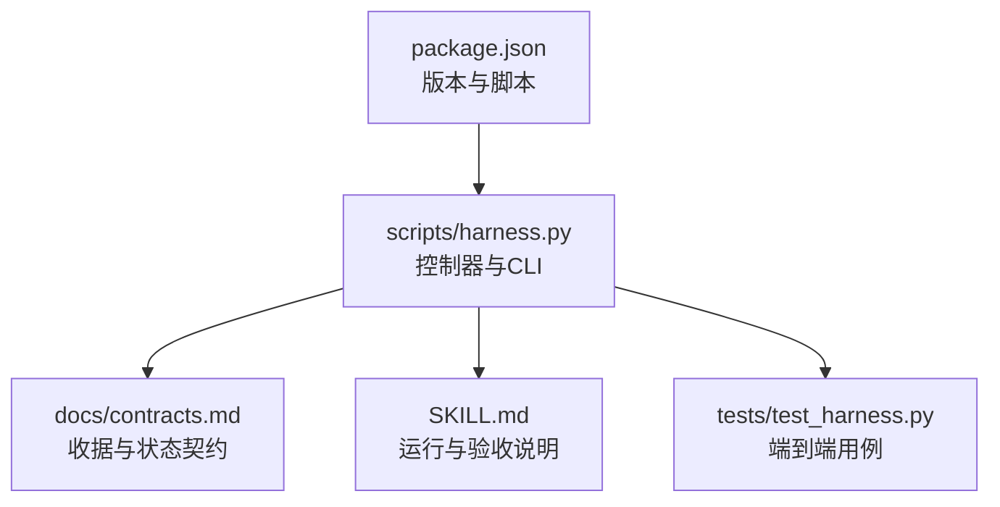
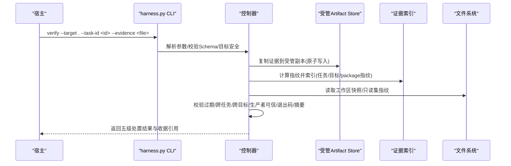
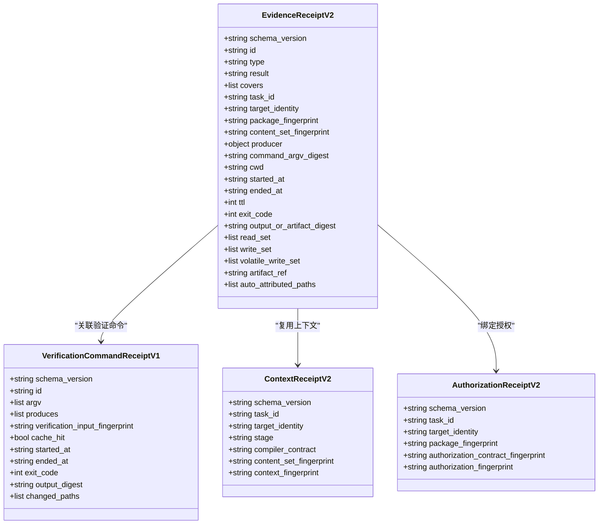
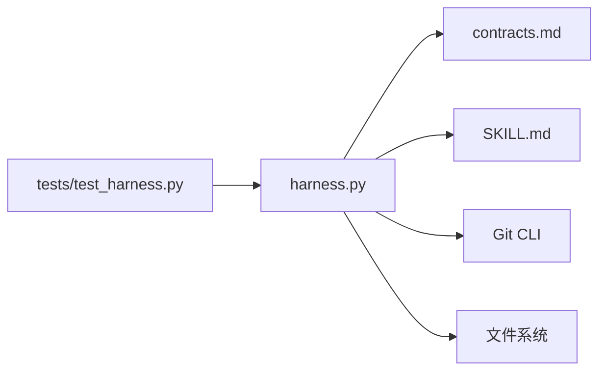
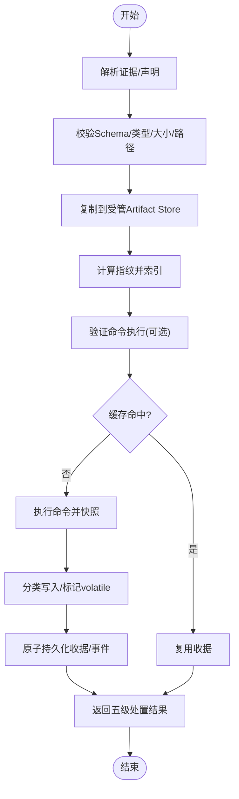

# 收据生成和验证

<cite>
**本文引用的文件**   
- [SKILL.md](file://SKILL.md)
- [package.json](file://package.json)
- [scripts/harness.py](file://scripts/harness.py)
- [tests/test_harness.py](file://tests/test_harness.py)
- [docs/contracts.md](file://docs/contracts.md)
</cite>

## 目录
1. [简介](#简介)
2. [项目结构](#项目结构)
3. [核心组件](#核心组件)
4. [架构总览](#架构总览)
5. [详细组件分析](#详细组件分析)
6. [依赖关系分析](#依赖关系分析)
7. [性能考量](#性能考量)
8. [故障排查指南](#故障排查指南)
9. [结论](#结论)
10. [附录](#附录)

## 简介
本文件面向 Docs Harness 证据收据系统，系统性阐述 v1/v2 版本差异、收据结构与字段、签名与完整性保证、验证流程（数字签名、时间戳校验、防篡改）、存储格式与索引管理（含增量更新与缓存策略）、API 接口与使用示例、迁移工具与升级指南，以及错误处理与异常恢复机制。文档以仓库中的合同定义、实现脚本与测试用例为依据，确保内容可追溯且可操作。

## 项目结构
- 入口与实现：scripts/harness.py 提供 CLI 与控制器逻辑，包含收据常量、Schema、校验与持久化等核心能力。
- 合同与规范：docs/contracts.md 明确 evidence-receipt/v2、verification-command-receipt/v1、context-receipt/v2、authorization-receipt/v2 等契约。
- 行为说明与用法：SKILL.md 描述 run/verify 流程、v1→v2 迁移、自动归因、命令缓存开关等关键行为。
- 测试覆盖：tests/test_harness.py 通过端到端用例验证 Git 预检/后检、漂移、命令复用、五级处置等。
- 元数据：package.json 声明版本与脚本入口。

图表来源
- [scripts/harness.py:1-100](file://scripts/harness.py#L1-L100)
- [docs/contracts.md:1-120](file://docs/contracts.md#L1-L120)
- [SKILL.md:1-60](file://SKILL.md#L1-L60)
- [package.json:1-23](file://package.json#L1-L23)

章节来源
- [scripts/harness.py:1-120](file://scripts/harness.py#L1-L120)
- [docs/contracts.md:1-120](file://docs/contracts.md#L1-L120)
- [SKILL.md:1-60](file://SKILL.md#L1-L60)
- [package.json:1-23](file://package.json#L1-L23)

## 核心组件
- 收据 Schema 常量与类型
  - 证据收据 v2：EVIDENCE_RECEIPT_SCHEMA
  - 验证命令收据 v1：VERIFICATION_RECEIPT_SCHEMA
  - 上下文收据 v2：RECEIPT_SCHEMA
  - 授权收据 v2：AUTH_SCHEMA
  - 任务包 v2、事件 v2、冻结 v2、完成清单 v1 等
- 可信生产者白名单与高风险证据类型集合
- 工作区漂移与未归因写入判定
- 验证命令逐项执行与缓存键设计
- 五级处置映射与退出码约定

章节来源
- [scripts/harness.py:26-53](file://scripts/harness.py#L26-L53)
- [scripts/harness.py:240-258](file://scripts/harness.py#L240-L258)
- [docs/contracts.md:165-246](file://docs/contracts.md#L165-L246)
- [SKILL.md:43-57](file://SKILL.md#L43-L57)

## 架构总览
Docs Harness 的收据体系围绕“受管副本 + 指纹绑定 + 原子持久化”构建，确保证据不可抵赖、可审计、可复用。

图表来源
- [scripts/harness.py:419-435](file://scripts/harness.py#L419-L435)
- [scripts/harness.py:507-529](file://scripts/harness.py#L507-L529)
- [docs/contracts.md:165-221](file://docs/contracts.md#L165-L221)
- [SKILL.md:43-57](file://SKILL.md#L43-L57)

## 详细组件分析

### 证据收据 v2 结构与字段
- 必填绑定字段
  - task_id、target_identity、package_fingerprint、content_set_fingerprint
  - producer（adapter/capability）
  - command_argv_digest、cwd
  - started_at、ended_at、ttl、exit_code
  - output_or_artifact_digest
  - read_set、write_set
- 可选与派生字段
  - volatile_write_set（验证期间允许的新建临时产物）
  - artifact_ref（指向受管副本）
  - auto_attributed_paths（自动归因时由控制器代铸）
- 版本兼容
  - 新任务仅接受 v2；v1 在途任务需显式迁移
  - 支持证据声明草案 v1（host_declaration），由控制器代铸为完整 v2

章节来源
- [docs/contracts.md:165-221](file://docs/contracts.md#L165-L221)
- [SKILL.md:43-57](file://SKILL.md#L43-L57)

#### 类图（收据相关对象）

图表来源
- [docs/contracts.md:165-246](file://docs/contracts.md#L165-L246)
- [scripts/harness.py:26-53](file://scripts/harness.py#L26-L53)

### 签名机制与完整性保证
- 指纹与摘要
  - 文本/JSON 规范化 canonical_json
  - sha256_text 用于字符串摘要
  - file_fingerprint 对文件流分块计算 SHA-256
  - sanitized_remote_fingerprint 脱敏远端 URL（去除凭据与查询片段）
- 原子写入
  - atomic_write_text/atomic_write_json 使用临时文件+fsync+os.replace 保障原子性
- 事件追加
  - append_jsonl 追加 JSONL 行并 fsync，保证顺序与落盘
- 输入校验
  - load_input_file/load_json_object_file 限制大小、编码、类型与路径合法性

章节来源
- [scripts/harness.py:403-417](file://scripts/harness.py#L403-L417)
- [scripts/harness.py:419-435](file://scripts/harness.py#L419-L435)
- [scripts/harness.py:507-529](file://scripts/harness.py#L507-L529)
- [scripts/harness.py:456-505](file://scripts/harness.py#L456-L505)

### 时间戳校验与 TTL
- started_at/ended_at 记录命令起止时间
- ttl 控制收据有效期，过期即失效
- utc_now 统一 UTC 时间源

章节来源
- [docs/contracts.md:165-221](file://docs/contracts.md#L165-L221)
- [scripts/harness.py:399-401](file://scripts/harness.py#L399-L401)

### 防篡改机制
- 受管副本：宿主提交证据在验收时复制到受管 artifact store，后续准入仅依赖副本
- 指纹绑定：task_id、target_identity、package_fingerprint、content_set_fingerprint 共同约束
- 生产者白名单：TRUSTED_EVIDENCE_PRODUCERS 限定可信来源
- 高风险证据：HIGH_RISK_EVIDENCE_TYPES 必须来自可信 v2 生产者
- 工作区漂移检测：unattributed_drift/concurrent_drift/read_set 指纹变化阻断或降级

章节来源
- [docs/contracts.md:165-221](file://docs/contracts.md#L165-L221)
- [scripts/harness.py:240-258](file://scripts/harness.py#L240-L258)

### 验证过程（数字签名、时间戳、防篡改）
- 数字签名：当前实现以 SHA-256 摘要与指纹绑定为主，未见非对称签名算法；完整性通过摘要与指纹链保证
- 时间戳：started_at/ended_at/ttl 控制时效
- 防篡改：受管副本、指纹绑定、生产者白名单、漂移检测、原子写入与事件追加

章节来源
- [docs/contracts.md:165-221](file://docs/contracts.md#L165-L221)
- [scripts/harness.py:403-435](file://scripts/harness.py#L403-L435)

### 存储格式与索引管理
- 存储位置
  - Git 仓库：<git-dir>/docs-harness/runs/ 与 background/
  - 非 Git：.docs-harness/runs/ 与 .docs-harness/background/
- 索引与事件
  - events.jsonl 追加事件（有界字段）
  - evidence-index.json 索引证据
  - freeze.json 冻结首次基线
- 增量更新
  - contract_delta 描述新增 Gate/上下文/证据类型等
  - adoption 记录（evidence-adoption/v1、authorization-adoption/v1）跨 revision 复用
- 缓存策略
  - 验证命令逐项收据与输入指纹缓存（verification.command_cache_enabled）
  - 上下文收据按 task/target/stage/compiler/content_set 复用

章节来源
- [docs/contracts.md:283-350](file://docs/contracts.md#L283-L350)
- [docs/contracts.md:222-246](file://docs/contracts.md#L222-L246)
- [docs/contracts.md:165-221](file://docs/contracts.md#L165-L221)

### API 接口与使用示例
- 运行任务
  - python3 scripts/harness.py run --target . --task "<原始用户任务>" --json
- 最终验收
  - python3 scripts/harness.py verify --target . --task-id <task-id> --evidence <evidence.json> --json
- 后台治理（示例）
  - background list/status/prepare/dispatch/progress/verify/retry
- 质量账本（按需）
  - ledger add/read

章节来源
- [SKILL.md:25-57](file://SKILL.md#L25-L57)
- [docs/contracts.md:303-350](file://docs/contracts.md#L303-L350)

### 迁移工具与版本升级指南
- v1→v2 迁移
  - 仅允许 task status/migrate(--apply)
  - apply 创建 staging/backup/manifest/journal，切换 task-package/compiled-task/freeze/evidence-index/context/authorization receipts
  - 旧 evidence 只读保存 legacy_evidence，不满足 v2 任务
- 回滚检查
  - 存在活动 v2 任务时 project rollback-check 阻断
- 升级要点
  - 新任务使用 v2；旧任务保持只读或显式迁移
  - 新增分段指纹与 adoption 对象必须由旧控制器失败关闭或只读忽略

章节来源
- [docs/contracts.md:236-249](file://docs/contracts.md#L236-L249)
- [SKILL.md:57-57](file://SKILL.md#L57-L57)

### 错误处理与异常恢复
- 结构化错误
  - HarnessError(code, exit_code) 统一封装
  - 输入/文件/JSON/路径错误转结构化错误，不回显敏感信息
- 退出码约定
  - 0 成功；1 检查失败；2 输入/合同无效；3 需要补证/重试/增量准入；4 需完整重新准入
- 恢复策略
  - 五级处置：provide_evidence/refresh_evidence/retry_verification/incremental_admission/full_readmission
  - 原子写入与事件追加保障一致性
  - 验证命令缓存可整体关闭

章节来源
- [scripts/harness.py:392-397](file://scripts/harness.py#L392-L397)
- [docs/contracts.md:359-370](file://docs/contracts.md#L359-L370)
- [docs/contracts.md:153-164](file://docs/contracts.md#L153-L164)

## 依赖关系分析
- 模块内依赖
  - harness.py 定义常量、工具函数、Git 预检/后检、事件与文件操作
  - contracts.md 定义收据与状态契约，作为运行时校验依据
  - SKILL.md 描述行为与用法，指导宿主集成
  - tests/test_harness.py 覆盖关键路径（Git 漂移、命令缓存、五级处置）
- 外部依赖
  - Git 子进程调用（超时、LFS/Submodule 可用性）
  - 文件系统原子写入与 JSONL 追加

图表来源
- [scripts/harness.py:546-791](file://scripts/harness.py#L546-L791)
- [docs/contracts.md:1-120](file://docs/contracts.md#L1-L120)
- [tests/test_harness.py:1-120](file://tests/test_harness.py#L1-L120)

章节来源
- [scripts/harness.py:546-791](file://scripts/harness.py#L546-L791)
- [docs/contracts.md:1-120](file://docs/contracts.md#L1-L120)
- [tests/test_harness.py:1-120](file://tests/test_harness.py#L1-L120)

## 性能考量
- 验证命令逐项执行与缓存命中避免重复执行
- 上下文与授权按指纹复用减少重复加载
- 事件与索引采用追加与原子写入，降低锁竞争
- 配置项 verification.command_cache_enabled 可整体关闭缓存以适配调试场景

[本节为通用指导，不直接分析具体文件]

## 故障排查指南
- 常见错误
  - 输入/合同无效：检查 JSON 类型、Schema、路径合法性
  - 远端不可用/LFS/Submodule 缺失：预检 blockers 提示
  - 工作区脏/非 fast-forward：git_sync 预检阻断
  - 验证命令失败：retry_verification 仅重跑失败命令
- 定位方法
  - 查看 events.jsonl 中 verification_attempt 事件
  - 核对 evidence-index.json 与受管副本 artifact_ref
  - 检查 freeze.json 基线与 read_set 指纹是否漂移

章节来源
- [docs/contracts.md:283-350](file://docs/contracts.md#L283-L350)
- [tests/test_harness.py:685-757](file://tests/test_harness.py#L685-L757)

## 结论
Docs Harness 收据系统以 v2 为核心，结合受管副本、指纹绑定、原子持久化与事件追加，构建了高可靠、可审计、可复用的证据闭环。通过五级处置与逐项命令缓存，系统在安全性与效率之间取得平衡。迁移与回滚机制确保平滑演进，错误处理与恢复策略提升鲁棒性。

[本节为总结，不直接分析具体文件]

## 附录

### 收据生成流程图（v2）

图表来源
- [docs/contracts.md:165-221](file://docs/contracts.md#L165-L221)
- [scripts/harness.py:419-435](file://scripts/harness.py#L419-L435)
- [scripts/harness.py:507-529](file://scripts/harness.py#L507-L529)

### 五级处置决策表
- provide_evidence：未归因写入在 write_scope 内，可补证据（默认自动归因）
- refresh_evidence：read_set 漂移，只失效相关证据
- retry_verification：命令失败或网络/Git 暂不可用
- incremental_admission：普通新增 Gate，合同不变
- full_readmission：范围/高风险/规则/授权变化

章节来源
- [docs/contracts.md:153-164](file://docs/contracts.md#L153-L164)