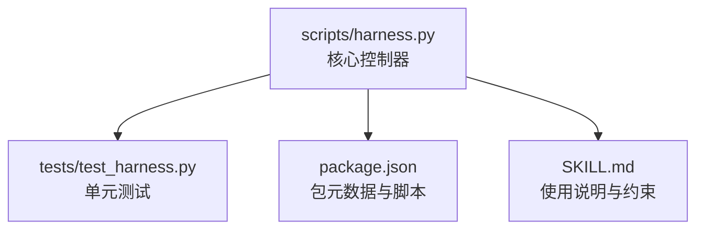
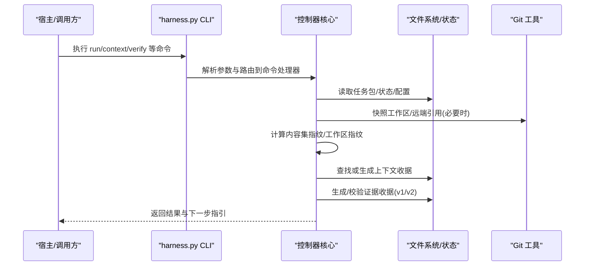
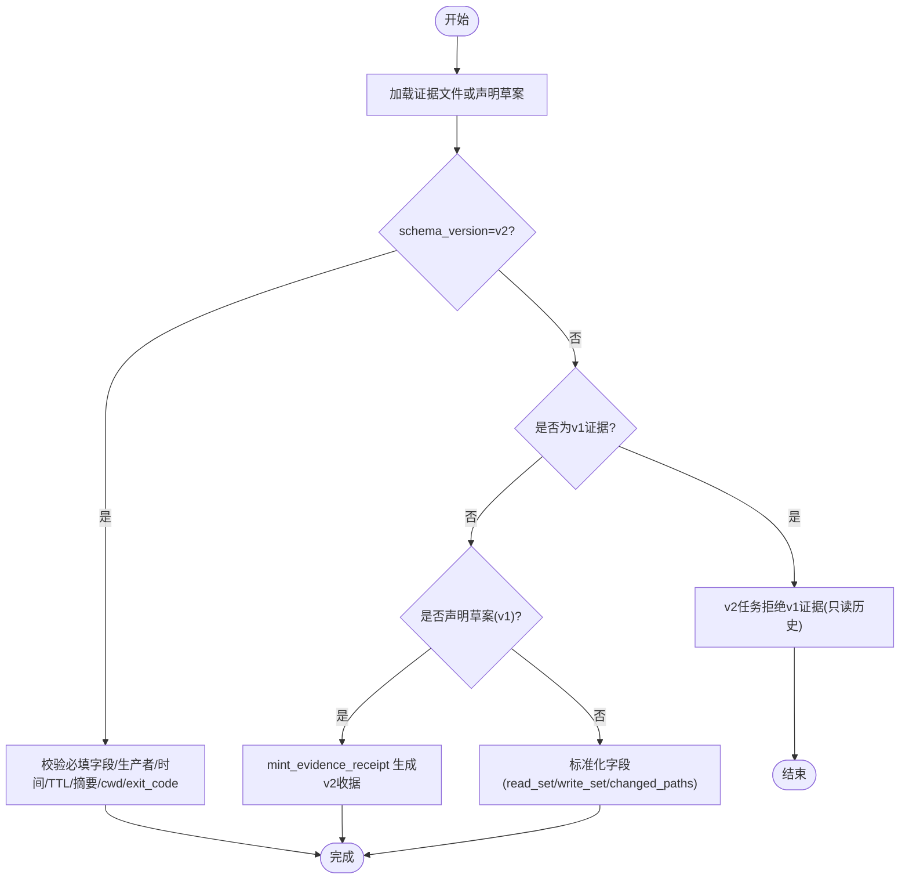
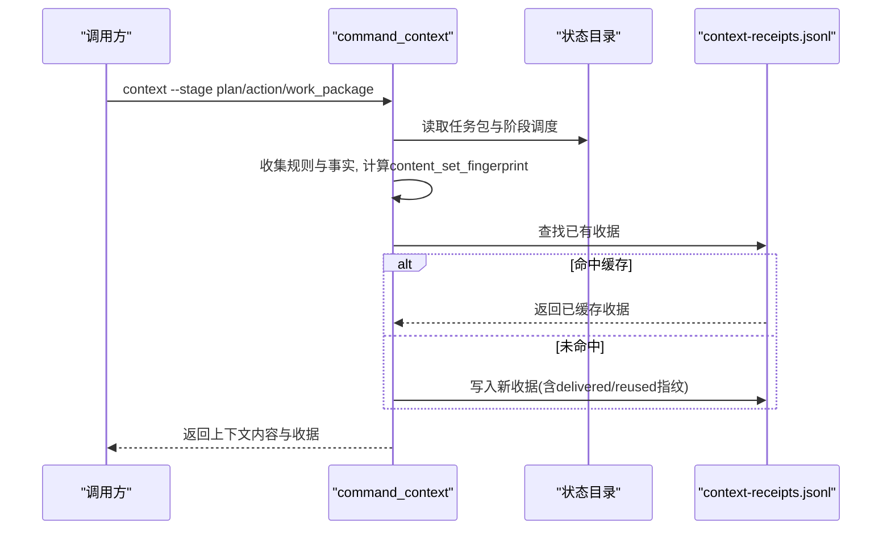
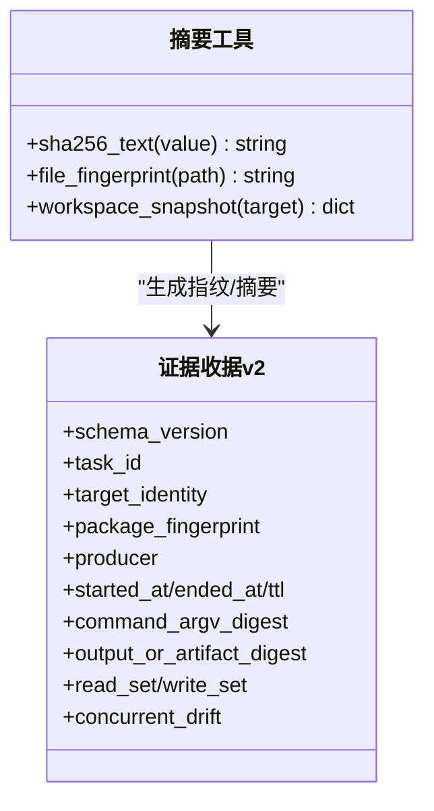
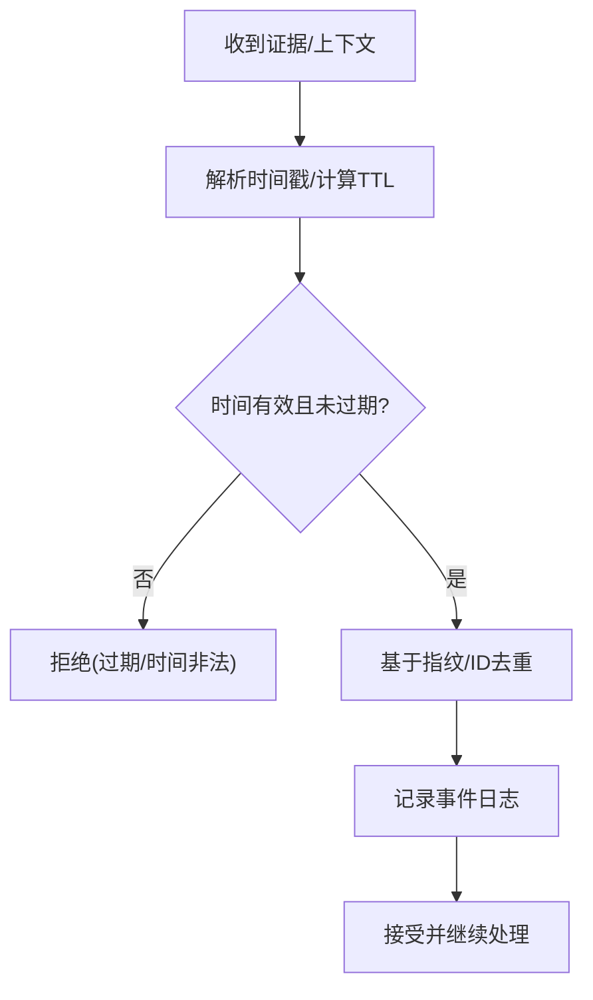
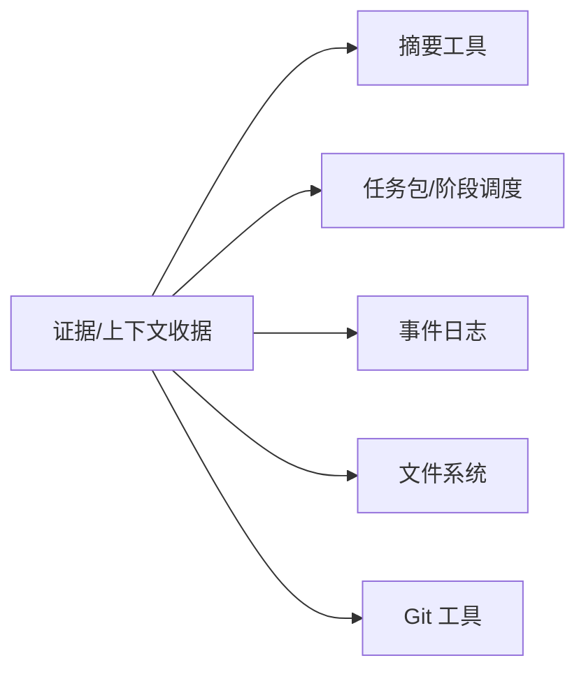

# 收据生成机制

<cite>
**本文引用的文件**   
- [scripts/harness.py](file://scripts/harness.py)
- [tests/test_harness.py](file://tests/test_harness.py)
- [package.json](file://package.json)
- [SKILL.md](file://SKILL.md)
</cite>

## 目录
1. [简介](#简介)
2. [项目结构](#项目结构)
3. [核心组件](#核心组件)
4. [架构总览](#架构总览)
5. [详细组件分析](#详细组件分析)
6. [依赖关系分析](#依赖关系分析)
7. [性能考虑](#性能考虑)
8. [故障排查指南](#故障排查指南)
9. [结论](#结论)
10. [附录](#附录)

## 简介
本文件系统化阐述 Docs Harness 的“证据收据”与“上下文收据”生成机制，覆盖 v1/v2 版本差异、数据结构定义、字段映射与兼容性处理；说明数字摘要与签名相关实现（哈希、指纹、校验）、时间戳与防重放策略；解释收据生成的触发条件、上下文信息收集流程；提供 API 接口与使用示例，并给出错误处理与异常恢复建议。同时明确收据格式规范与数据完整性保证措施。

## 项目结构
- 控制器主程序位于 scripts/harness.py，集中实现任务编排、状态管理、事件记录、证据/授权/上下文收据生成与校验等核心逻辑。
- 测试用例位于 tests/test_harness.py，覆盖关键行为与边界条件。
- package.json 描述包元信息与脚本入口。
- SKILL.md 提供高层使用说明与约束。

**图表来源** 
- [scripts/harness.py:1-100](file://scripts/harness.py#L1-L100)
- [package.json:1-23](file://package.json#L1-L23)
- [SKILL.md:1-105](file://SKILL.md#L1-L105)

**章节来源**
- [scripts/harness.py:1-120](file://scripts/harness.py#L1-L120)
- [package.json:1-23](file://package.json#L1-L23)
- [SKILL.md:1-105](file://SKILL.md#L1-L105)

## 核心组件
- 收据类型与 Schema：
  - 证据收据 v2：docs-harness/evidence-receipt/v2
  - 上下文收据 v2：docs-harness/context-receipt/v2
  - 验证命令收据 v1：docs-harness/verification-command-receipt/v1
  - 证据声明草案 v1：docs-harness/evidence-declaration/v1
- 关键函数：
  - mint_evidence_receipt：将证据声明草案装订为完整 v2 证据收据
  - load_evidence：加载并标准化证据（支持 v1/v2 兼容）
  - find_context_receipt / context_receipt_valid：查找与校验上下文收据
  - command_context：上下文装载流程，产出上下文收据
  - append_task_event：追加事件日志（含审计追踪）
  - sha256_text / file_fingerprint / workspace_snapshot：摘要与指纹工具
  - utc_now：UTC 时间戳生成

**章节来源**
- [scripts/harness.py:33-50](file://scripts/harness.py#L33-L50)
- [scripts/harness.py:4046-4245](file://scripts/harness.py#L4046-L4245)
- [scripts/harness.py:5036-5235](file://scripts/harness.py#L5036-L5235)
- [scripts/harness.py:399-417](file://scripts/harness.py#L399-L417)

## 架构总览
收据生成围绕“任务包 + 目标环境 + 阶段上下文”展开，通过控制器统一拼装、校验与持久化。

**图表来源** 
- [scripts/harness.py:4130-4245](file://scripts/harness.py#L4130-L4245)
- [scripts/harness.py:5036-5235](file://scripts/harness.py#L5036-L5235)
- [scripts/harness.py:10337-10375](file://scripts/harness.py#L10337-L10375)

## 详细组件分析

### 证据收据 v1 vs v2：差异、字段映射与兼容性
- v2 证据收据（docs-harness/evidence-receipt/v2）
  - 由控制器代铸，包含任务绑定、目标身份、包指纹、生产者可信度、时间窗口、命令与输出摘要、读写集合、并发漂移等强约束字段。
  - 必须通过白名单生产者（TRUSTED_EVIDENCE_PRODUCERS），且需满足 TTL、时间顺序、cwd 与 exit_code 一致性校验。
- v1 证据（docs-harness/evidence/v1）
  - 仅作为只读历史保留；v2 任务不接受旧证据参与准入。
- 证据声明草案（docs-harness/evidence-declaration/v1）
  - 宿主提交最小字段（type/write_set/read_set/conclusion 等），由控制器补齐 id、指纹、时间戳、cwd、ttl、command_argv_digest、output_or_artifact_digest 等，形成 v2 收据。

**图表来源** 
- [scripts/harness.py:5076-5235](file://scripts/harness.py#L5076-L5235)

**章节来源**
- [scripts/harness.py:5036-5235](file://scripts/harness.py#L5036-L5235)

### 上下文收据 v2：生成与复用
- 触发时机：context 命令在 plan/action/work_package 阶段装载规则与事实后生成。
- 内容集指纹：基于 rule_ids 与 project_fact_refs 计算 content_set_fingerprint，用于跨阶段去重与增量交付。
- 缓存与增量：若存在相同 task_id/target_identity/compiler_contract/stage 的已交付收据，则直接复用；否则写入 context-receipts.jsonl，并记录 delivered/reused 指纹列表。

**图表来源** 
- [scripts/harness.py:4130-4245](file://scripts/harness.py#L4130-L4245)

**章节来源**
- [scripts/harness.py:4046-4245](file://scripts/harness.py#L4046-L4245)

### 数字摘要与签名相关实现
- 摘要算法：统一采用 SHA-256，前缀为 sha256:，用于文本、文件与工作区快照。
- 指纹与快照：
  - file_fingerprint：对文件流式计算 SHA-256。
  - workspace_snapshot：遍历工作区（优先 git ls-files），小文件按内容指纹，大文件按 size:mtime_ns 组合指纹。
- 签名与验证：
  - 当前实现以“可验证摘要+受控生产者+严格字段校验”替代传统公钥签名；证据收据通过生产者白名单、TTL、cwd/exit_code 一致性与内容摘要进行强校验。
  - 如需引入外部签名，可在 producer 扩展中约定签名算法与验签流程，并在 load_evidence 中增加验签步骤。

**图表来源** 
- [scripts/harness.py:399-417](file://scripts/harness.py#L399-L417)
- [scripts/harness.py:5036-5235](file://scripts/harness.py#L5036-L5235)

**章节来源**
- [scripts/harness.py:399-417](file://scripts/harness.py#L399-L417)
- [scripts/harness.py:5036-5235](file://scripts/harness.py#L5036-L5235)

### 时间戳与防重放攻击
- 时间戳：utc_now() 生成 UTC ISO 时间（无毫秒），用于 started_at/ended_at/recorded_at 等。
- 防重放：
  - 证据收据 TTL：ended_at + ttl 必须大于当前时间，否则视为过期。
  - 上下文收据：基于 content_set_fingerprint 与 stage/task/target_identity 精确匹配，避免重复装载与重用。
  - 事件日志：append_task_event 记录阶段、耗时、重试次数等，便于审计与回溯。

**图表来源** 
- [scripts/harness.py:399-417](file://scripts/harness.py#L399-L417)
- [scripts/harness.py:5076-5235](file://scripts/harness.py#L5076-L5235)
- [scripts/harness.py:1031-1071](file://scripts/harness.py#L1031-L1071)

**章节来源**
- [scripts/harness.py:399-417](file://scripts/harness.py#L399-L417)
- [scripts/harness.py:5076-5235](file://scripts/harness.py#L5076-L5235)
- [scripts/harness.py:1031-1071](file://scripts/harness.py#L1031-L1071)

### 收据生成的触发条件与上下文收集
- 证据收据触发：
  - 宿主提交证据声明草案（v1）或 v2 证据文件；控制器在 verify 流程中标准化并校验。
- 上下文收据触发：
  - context 命令在 plan/action/work_package 阶段装载规则与事实后生成。
- 上下文收集：
  - 从 package.context_schedule 获取 rule_ids 与 project_fact_refs，读取规则与事实，计算 content_set_fingerprint，并与历史收据比对决定是否增量交付。

**章节来源**
- [scripts/harness.py:4130-4245](file://scripts/harness.py#L4130-L4245)
- [scripts/harness.py:5076-5235](file://scripts/harness.py#L5076-L5235)

### API 接口与使用示例
- 主要命令：
  - run：创建/复用任务，进入准入与执行流程
  - context：装载上下文，产出上下文收据
  - verify：验收证据，产出验证结果与后续动作
  - background/knowledge/project/self-test：后台治理、知识、项目初始化与自检
- 典型用法（JSON 输出）：
  - 运行任务：python3 scripts/harness.py run --target <project> --task "<任务>" --json
  - 装载上下文：python3 scripts/harness.py context --target <project> --task-id <id> --stage plan|action --json
  - 验收证据：python3 scripts/harness.py verify --target <project> --task-id <id> --evidence <file> --json

**章节来源**
- [SKILL.md:25-55](file://SKILL.md#L25-L55)
- [scripts/harness.py:10337-10375](file://scripts/harness.py#L10337-L10375)

### 错误处理与异常恢复
- 统一异常：HarnessError(code, exit_code)，在 main 中捕获并输出 JSON 错误。
- 常见错误码：
  - invalid_evidence/evidence_not_passed/evidence_mismatch：证据无效或未通过
  - evidence_expired：证据过期
  - untrusted_evidence_producer：生产者不可信
  - missing_file/invalid_json：文件缺失或 JSON 无效
  - state_locked/stale_lock：状态锁冲突
- 恢复建议：
  - 重新生成证据（确保 cwd/exit_code/时间/TTL 正确）
  - 清理状态锁后重试
  - 修正 facts/scope/证据字段后重新准入

**章节来源**
- [scripts/harness.py:392-398](file://scripts/harness.py#L392-L398)
- [scripts/harness.py:10368-10371](file://scripts/harness.py#L10368-L10371)
- [scripts/harness.py:5076-5235](file://scripts/harness.py#L5076-L5235)

## 依赖关系分析
- 模块内依赖：
  - 收据生成依赖摘要工具（sha256_text/file_fingerprint/workspace_snapshot）
  - 上下文收据依赖任务包与阶段调度（context_schedule）
  - 事件日志依赖 append_task_event 与 append_jsonl
- 外部依赖：
  - Git 工具用于工作区快照与远端引用校验（git_command/git_root/git_dir）
  - 文件系统用于原子写入与 JSONL 追加

**图表来源** 
- [scripts/harness.py:5036-5235](file://scripts/harness.py#L5036-L5235)
- [scripts/harness.py:4130-4245](file://scripts/harness.py#L4130-L4245)
- [scripts/harness.py:1031-1071](file://scripts/harness.py#L1031-L1071)

**章节来源**
- [scripts/harness.py:5036-5235](file://scripts/harness.py#L5036-L5235)
- [scripts/harness.py:4130-4245](file://scripts/harness.py#L4130-L4245)
- [scripts/harness.py:1031-1071](file://scripts/harness.py#L1031-L1071)

## 性能考虑
- 工作区快照：优先使用 git ls-files，非 Git 工作区有文件数量上限限制，避免截断基线。
- 大文件指纹：超过阈值时采用 size:mtime_ns 组合指纹，减少 I/O 压力。
- 上下文收据缓存：基于 content_set_fingerprint 精准命中，减少重复装载与网络/磁盘开销。
- 原子写入与 fsync：确保收据与事件落盘一致性，避免部分写入导致状态不一致。

[本节为通用指导，不直接分析具体文件]

## 故障排查指南
- 证据未通过：检查 result=passed、exit_code=0、cwd 与 target 一致、TTL 未过期、生产者可信。
- 上下文未命中：确认 stage、work_package、rule_ids、project_fact_refs 与编译器契约一致。
- 状态锁冲突：等待或人工清理 stale lock，确保进程退出释放锁。
- 事件日志异常：检查 events.jsonl 行号与 JSON 合法性，修复后重试。

**章节来源**
- [scripts/harness.py:5076-5235](file://scripts/harness.py#L5076-L5235)
- [scripts/harness.py:4130-4245](file://scripts/harness.py#L4130-L4245)
- [scripts/harness.py:1008-1029](file://scripts/harness.py#L1008-L1029)
- [scripts/harness.py:515-529](file://scripts/harness.py#L515-L529)

## 结论
Docs Harness 的收据生成机制以强约束的 v2 证据收据与上下文收据为核心，结合 SHA-256 摘要、TTL 时效、生产者白名单与内容集指纹，实现了高可靠的可审计、可追溯与防重放能力。通过清晰的 API 与完善的错误处理，宿主可安全地驱动任务与验收流程。建议在需要更强抗抵赖场景下，扩展 producer 中的签名算法与验签流程，以进一步提升安全性。

[本节为总结性内容，不直接分析具体文件]

## 附录
- 关键常量与 Schema：
  - EVIDENCE_RECEIPT_SCHEMA = "docs-harness/evidence-receipt/v2"
  - RECEIPT_SCHEMA = "docs-harness/context-receipt/v2"
  - VERIFICATION_RECEIPT_SCHEMA = "docs-harness/verification-command-receipt/v1"
  - EVIDENCE_DECLARATION_SCHEMA = "docs-harness/evidence-declaration/v1"
- 常用工具函数：
  - utc_now、sha256_text、file_fingerprint、workspace_snapshot、append_jsonl、read_jsonl

**章节来源**
- [scripts/harness.py:33-50](file://scripts/harness.py#L33-L50)
- [scripts/harness.py:399-417](file://scripts/harness.py#L399-L417)
- [scripts/harness.py:507-529](file://scripts/harness.py#L507-L529)