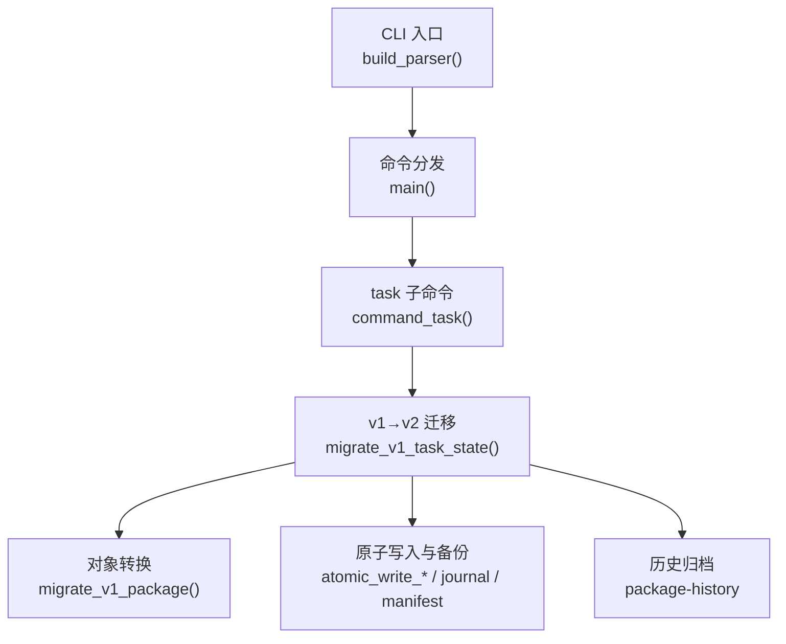
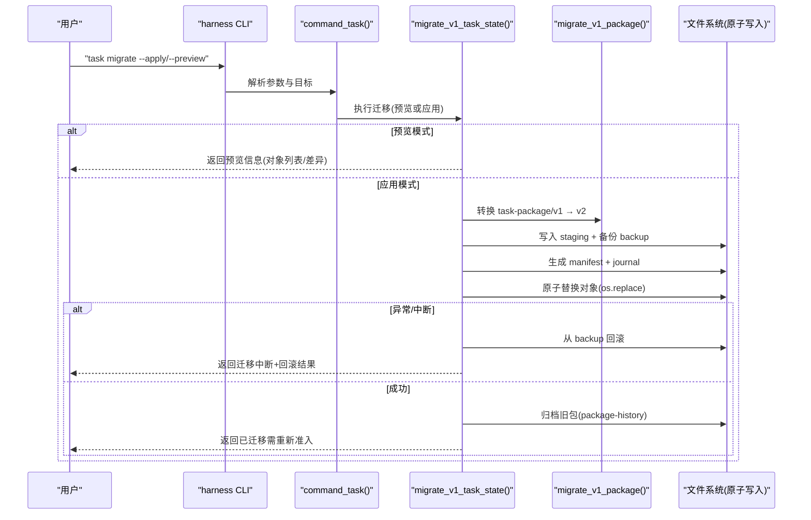
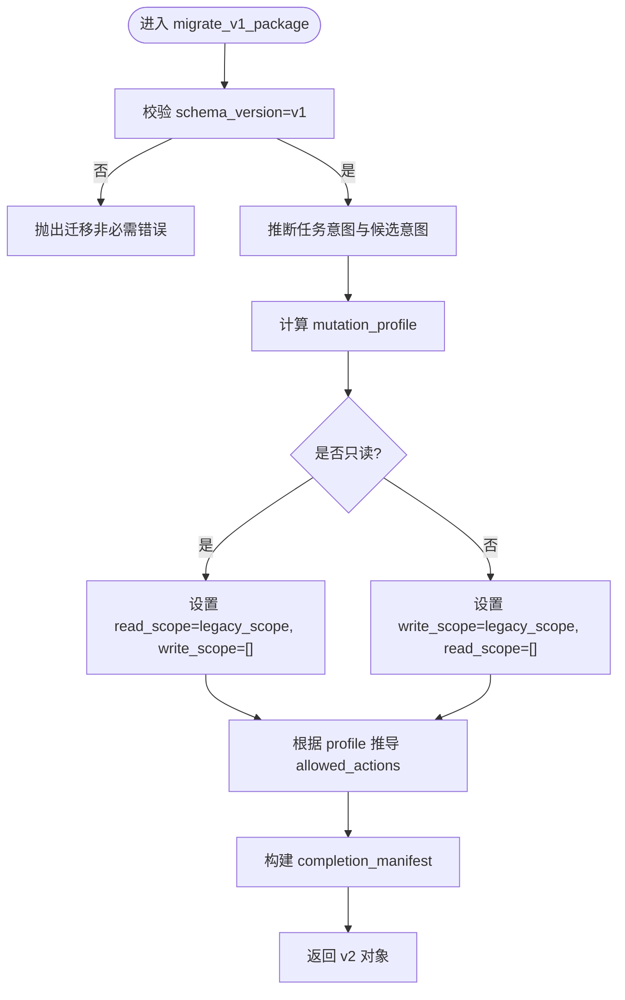
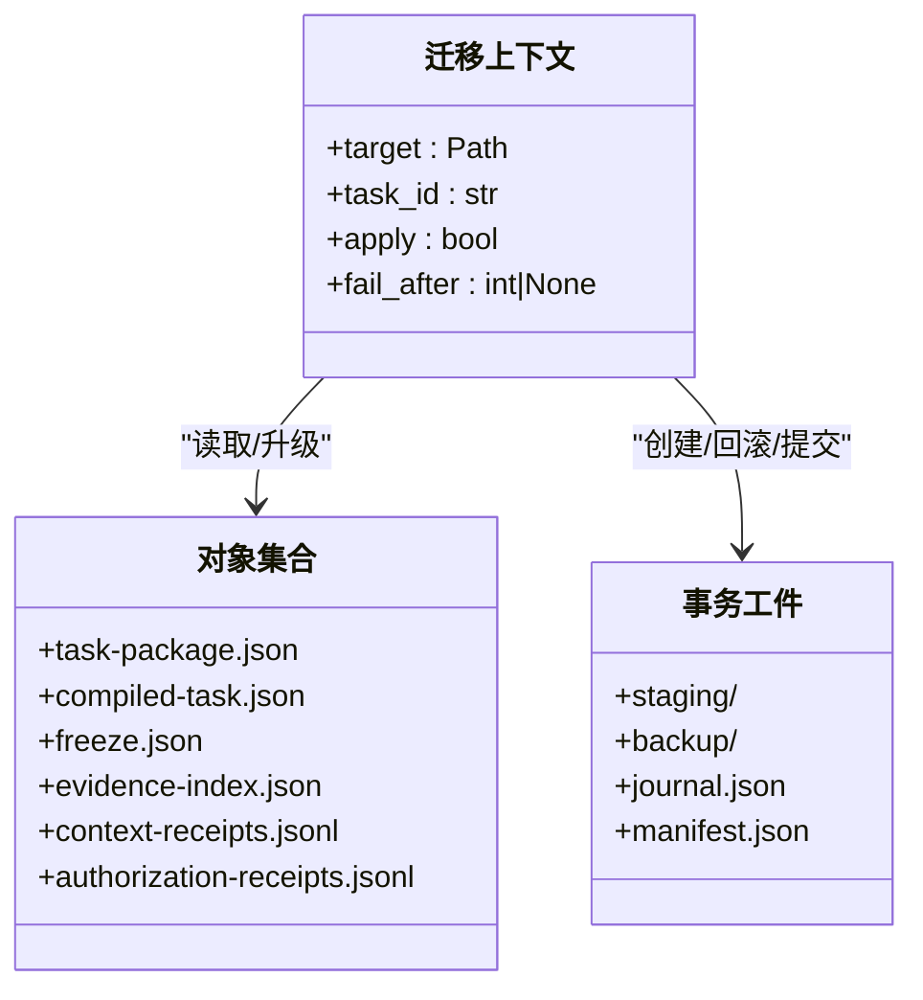
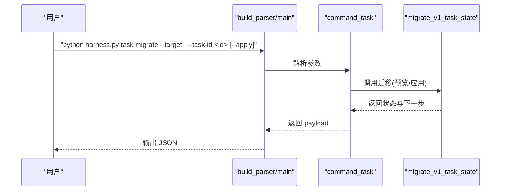
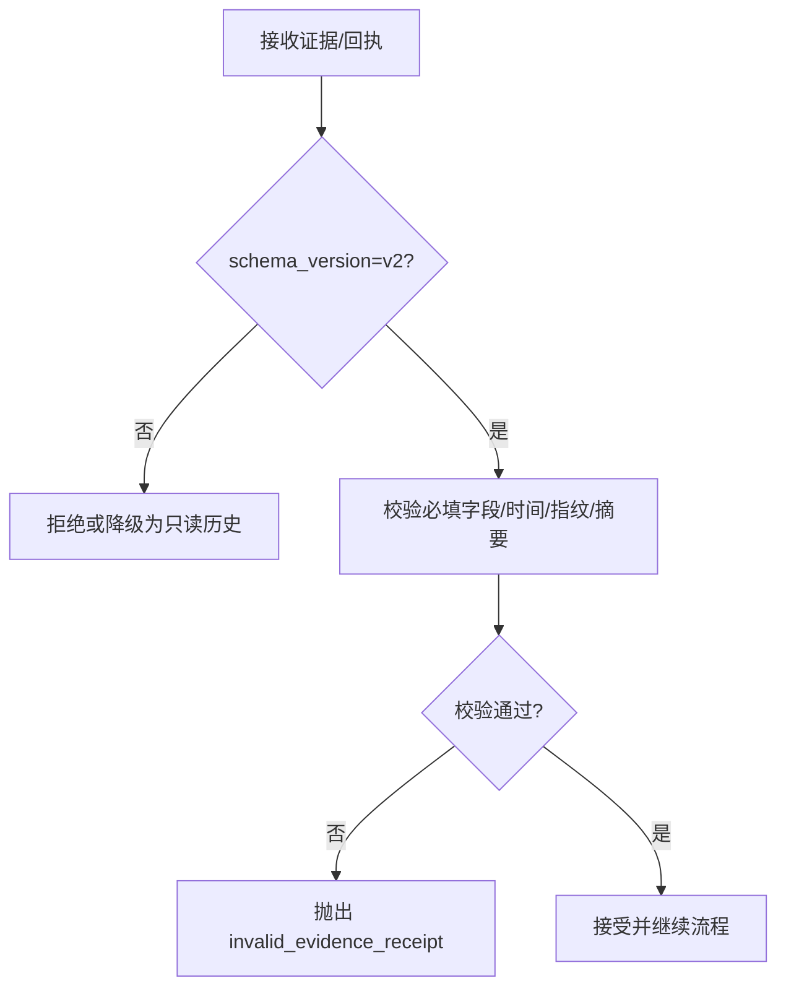
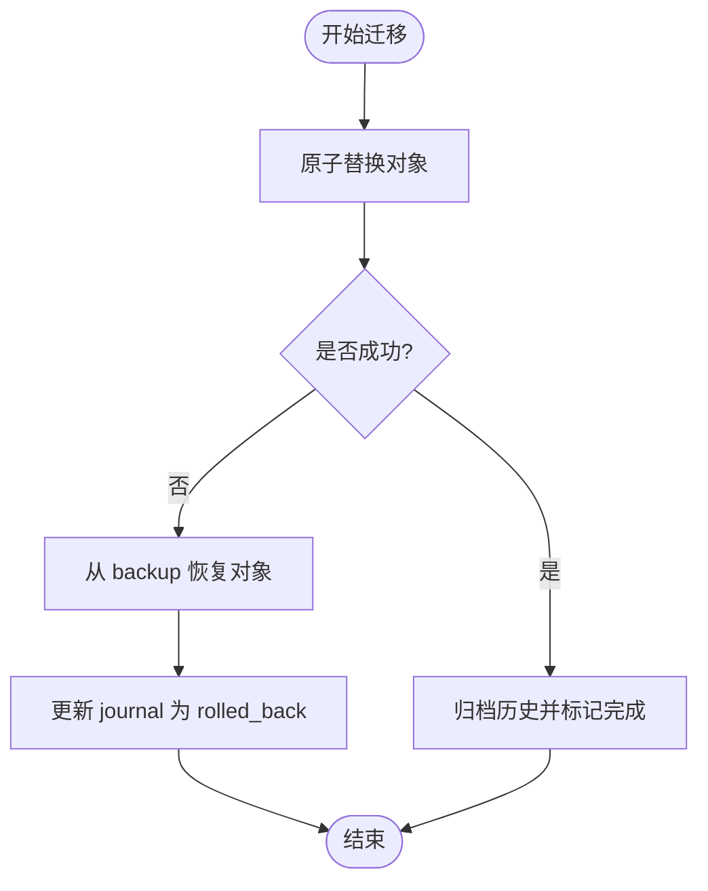
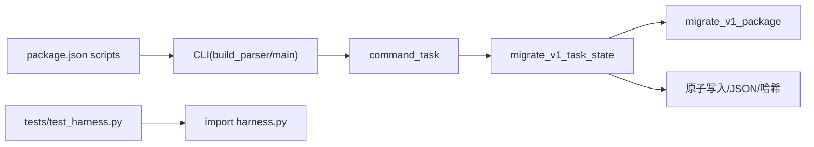

# 收据迁移工具

<cite>
**本文引用的文件**   
- [scripts/harness.py](file://scripts/harness.py)
- [tests/test_harness.py](file://tests/test_harness.py)
- [package.json](file://package.json)
- [SKILL.md](file://SKILL.md)
</cite>

## 目录
1. [简介](#简介)
2. [项目结构](#项目结构)
3. [核心组件](#核心组件)
4. [架构总览](#架构总览)
5. [详细组件分析](#详细组件分析)
6. [依赖关系分析](#依赖关系分析)
7. [性能考虑](#性能考虑)
8. [故障排查指南](#故障排查指南)
9. [结论](#结论)
10. [附录](#附录)

## 简介
本文件面向 Docs Harness 的“证据收据迁移工具”，聚焦 v1→v2 版本间的数据迁移策略与流程，覆盖任务包、证据收据、上下文回执等关键对象的字段映射与格式升级。文档同时说明命令行使用方法（含参数、配置文件与批处理选项）、数据验证与完整性检查机制、回滚与错误恢复策略（事务化与一致性保证）、脚本扩展与插件机制，以及迁移性能优化与大数据量处理建议，并给出日志记录与监控指标指引。

## 项目结构
- 控制器主程序位于 scripts/harness.py，包含 CLI 解析、命令分发、迁移逻辑、状态机与校验等全部实现。
- 测试用例位于 tests/test_harness.py，覆盖迁移预览/应用、中断恢复、v1 在途任务只读限制等场景。
- package.json 提供 npm 脚本入口与自测命令。
- SKILL.md 描述安装、任务入口、验收与后台治理等高层用法，强调 v1 在途任务迁移要求。

**图表来源** 
- [scripts/harness.py:10360-10479](file://scripts/harness.py#L10360-L10479)
- [scripts/harness.py:3885-3911](file://scripts/harness.py#L3885-L3911)
- [scripts/harness.py:3361-3494](file://scripts/harness.py#L3361-L3494)
- [scripts/harness.py:3283-3339](file://scripts/harness.py#L3283-L3339)

**章节来源**
- [scripts/harness.py:10360-10479](file://scripts/harness.py#L10360-L10479)
- [package.json:17-21](file://package.json#L17-L21)
- [SKILL.md:58-58](file://SKILL.md#L58-L58)

## 核心组件
- 迁移入口与预览/应用：task migrate 支持仅预览或应用迁移；对 v1 在途任务强制显式迁移后重新准入。
- 对象模型转换：将 legacy task-package/v1 转换为 task-package/v2，补齐意图、范围、动作、完成清单等字段。
- 状态与工件升级：compiled-task、freeze、evidence-index、context-receipts、authorization-receipts 同步升级。
- 事务化与回滚：通过 staging + backup + journal + manifest 实现原子替换与失败回滚。
- 历史归档：旧版对象按版本号归档至 package-history。
- 校验与约束：严格 schema_version、时间戳、指纹、作用域与动作白名单校验。

**章节来源**
- [scripts/harness.py:3283-3339](file://scripts/harness.py#L3283-L3339)
- [scripts/harness.py:3361-3494](file://scripts/harness.py#L3361-L3494)
- [scripts/harness.py:4240-4266](file://scripts/harness.py#L4240-L4266)
- [scripts/harness.py:5166-5172](file://scripts/harness.py#L5166-L5172)

## 架构总览
下图展示从 CLI 到迁移执行的端到端流程，包括预览与应用分支、事务化写入与回滚、历史归档与后续准入提示。

**图表来源** 
- [scripts/harness.py:3885-3911](file://scripts/harness.py#L3885-L3911)
- [scripts/harness.py:3361-3494](file://scripts/harness.py#L3361-L3494)
- [scripts/harness.py:3283-3339](file://scripts/harness.py#L3283-L3339)

## 详细组件分析

### 组件A：v1→v2 任务包迁移（migrate_v1_package）
- 输入：legacy task-package/v1 对象
- 输出：task-package/v2 对象，包含：
  - schema_version、package_revision、migrated_from_schema、migrated_at
  - task_intent、candidate_intents、deferred_intents、intent_boundary_reason_codes
  - mutation_profile、read_scope、write_scope、git_scope、external_scope
  - allowed_actions、post_completion_dispatch_policy
  - completion_manifest（由构建函数生成）
- 行为要点：
  - 若存在 legacy allowed_scope 且推断为只读，则拆分为 read_scope；否则作为 write_scope 并提升 mutation_profile
  - 根据 mutation_profile 推导 allowed_actions
  - 生成 completion_manifest 以指导后续验收

**图表来源** 
- [scripts/harness.py:3283-3339](file://scripts/harness.py#L3283-L3339)

**章节来源**
- [scripts/harness.py:3283-3339](file://scripts/harness.py#L3283-L3339)

### 组件B：任务状态迁移（migrate_v1_task_state）
- 功能：
  - 支持 preview 与 apply 两种模式
  - 读取并校验 task-package.json 的 schema_version
  - 生成 staging/backup/journal/manifest，原子替换对象
  - 失败时自动回滚，成功时归档历史并标记需要重新准入
- 关键字段与对象：
  - 对象集合：task-package.json、compiled-task.json、freeze.json、evidence-index.json、context-receipts.jsonl、authorization-receipts.jsonl
  - 升级后的 compiled-task 与 freeze 包含新 schema_version、package_fingerprint、控制状态与下一步动作
  - evidence-index 保留 legacy_evidence 并标记只读
- 事务化保障：
  - staging 写入 + backup 备份 + journal 状态追踪 + manifest 指纹
  - os.replace 原子替换，异常触发回滚

**图表来源** 
- [scripts/harness.py:3361-3494](file://scripts/harness.py#L3361-L3494)

**章节来源**
- [scripts/harness.py:3361-3494](file://scripts/harness.py#L3361-L3494)

### 组件C：CLI 与命令路由
- build_parser 定义所有子命令与参数，包括 task migrate 的 --apply、--dry-run、--reason-code 等
- command_task 负责调度 migrate/status/cancel/archive/list/prune
- main 统一捕获 HarnessError 并输出结构化 JSON

**图表来源** 
- [scripts/harness.py:10360-10479](file://scripts/harness.py#L10360-L10479)
- [scripts/harness.py:3885-3911](file://scripts/harness.py#L3885-L3911)

**章节来源**
- [scripts/harness.py:10360-10479](file://scripts/harness.py#L10360-L10479)
- [scripts/harness.py:3885-3911](file://scripts/harness.py#L3885-L3911)

### 组件D：证据收据与上下文回执校验
- 证据收据必须使用 docs-harness/evidence-receipt/v2；旧证据仅作为只读历史
- 上下文回执使用 docs-harness/context-receipt/v2
- 校验点包括 schema_version、ISO 时间与时区、指纹、摘要、时效等

**图表来源** 
- [scripts/harness.py:4240-4266](file://scripts/harness.py#L4240-L4266)
- [scripts/harness.py:5166-5172](file://scripts/harness.py#L5166-L5172)

**章节来源**
- [scripts/harness.py:4240-4266](file://scripts/harness.py#L4240-L4266)
- [scripts/harness.py:5166-5172](file://scripts/harness.py#L5166-L5172)

### 组件E：回滚与恢复机制
- 未完成迁移恢复：recover_incomplete_task_migration 扫描 migration-v1-v2/journal.json，若状态为 applying，则从 backup 恢复对象并标记 recovered
- 应用期异常：捕获 OSError，遍历 backup 恢复对象，更新 journal 为 rolled_back，并抛出迁移中断错误
- 幂等与一致性：os.replace 原子替换，确保要么全量成功，要么完全回滚

**图表来源** 
- [scripts/harness.py:3342-3358](file://scripts/harness.py#L3342-L3358)
- [scripts/harness.py:3463-3477](file://scripts/harness.py#L3463-L3477)

**章节来源**
- [scripts/harness.py:3342-3358](file://scripts/harness.py#L3342-L3358)
- [scripts/harness.py:3463-3477](file://scripts/harness.py#L3463-L3477)

### 组件F：自定义扩展与插件机制
- 规则系统：通过 harness-home/rules/*.md 管理活跃规则，self-test 校验规则有效性
- 配置扩展：project config 支持 verification.volatile_paths 等白名单扩展
- 背景 Job：create_background_job 支持多种 task_kind 与 execution_route，允许宿主通过 prepare/dispatch/progress/verify/retry 扩展工作流
- 可扩展点：
  - 新增证据类型与处理器（遵循 v2 收据契约）
  - 新增 Gate 与风险判定词表（受安全底线保护）
  - 新增 background 路线与工作包状态机

**章节来源**
- [tests/test_harness.py:339-354](file://tests/test_harness.py#L339-L354)
- [scripts/harness.py:8597-8750](file://scripts/harness.py#L8597-8750)

### 组件G：性能优化与大数据量处理
- 原子写入与 fsync：atomic_write_text/atomic_write_json 确保持久化与一致性
- 增量与幂等：run 命令幂等复用活动任务，避免重复构建上下文与授权
- 批量操作：background prune 支持 older-than 过滤与批量删除，减少 I/O
- 大文件处理：file_fingerprint 分块哈希，避免一次性加载大文件
- 建议：
  - 使用 --json 输出便于流水线集成与并行处理
  - 对大规模证据索引采用分批读取与校验
  - 利用 dry-run 模式预评估变更规模

**章节来源**
- [scripts/harness.py:422-438](file://scripts/harness.py#L422-L438)
- [scripts/harness.py:414-420](file://scripts/harness.py#L414-L420)
- [scripts/harness.py:8863-8898](file://scripts/harness.py#L8863-8898)

## 依赖关系分析
- CLI 依赖 argparse 解析参数，main 统一分发命令
- 迁移模块依赖文件系统原子写入、JSON 读写、哈希与时间工具
- 测试模块通过 importlib 动态加载 harness.py 模块进行单元测试
- package.json 提供 npm test/self-test 脚本，便于 CI 集成

**图表来源** 
- [scripts/harness.py:10360-10479](file://scripts/harness.py#L10360-L10479)
- [scripts/harness.py:3885-3911](file://scripts/harness.py#L3885-L3911)
- [scripts/harness.py:3361-3494](file://scripts/harness.py#L3361-L3494)
- [tests/test_harness.py:17-22](file://tests/test_harness.py#L17-L22)
- [package.json:17-21](file://package.json#L17-L21)

**章节来源**
- [scripts/harness.py:10360-10479](file://scripts/harness.py#L10360-L10479)
- [tests/test_harness.py:17-22](file://tests/test_harness.py#L17-L22)
- [package.json:17-21](file://package.json#L17-L21)

## 性能考虑
- 使用原子写入与 fsync 保证强一致，但会增加磁盘 I/O；建议在 SSD 环境运行
- 大对象哈希采用分块读取，避免内存峰值
- 批量 prune 与 dry-run 可减少不必要写入
- 对于大规模证据索引，建议分页读取与校验，结合缓存指纹减少重复计算

[本节为通用性能建议，不直接分析具体文件]

## 故障排查指南
- 常见错误码：
  - invalid_task_id：task-id 格式无效
  - invalid_json：JSON 解析失败
  - missing_file：缺少必要文件
  - invalid_evidence_receipt：证据收据字段/时间/指纹校验失败
  - migration_interrupted：迁移中断并已回滚
- 诊断步骤：
  - 查看 journal.json 与 manifest.json 确认迁移阶段与对象指纹
  - 检查 backup 目录是否存在完整备份
  - 使用 task status 查看任务当前状态与 next_action
  - 对证据收据使用 self-test 校验契约一致性

**章节来源**
- [scripts/harness.py:396-400](file://scripts/harness.py#L396-L400)
- [scripts/harness.py:3463-3477](file://scripts/harness.py#L3463-L3477)
- [scripts/harness.py:5166-5172](file://scripts/harness.py#L5166-L5172)

## 结论
Docs Harness 的证据收据迁移工具提供了稳健的 v1→v2 迁移能力，涵盖字段映射、格式升级、事务化回滚、历史归档与严格校验。通过 CLI 的预览/应用模式与完善的错误恢复机制，确保迁移过程安全可控。扩展点丰富，支持规则、配置与后台 Job 的灵活定制。在生产环境中，建议结合 dry-run 与日志监控，逐步推进迁移与验证。

[本节为总结性内容，不直接分析具体文件]

## 附录
- 命令行参考：
  - task migrate --target <dir> --task-id <id> [--apply] [--dry-run] [--reason-code <code>]
  - project init/upgrade/check/diff/uninstall/rollback-check [--apply] [--purge-runtime]
  - background estimate/list/status/prepare/progress/dispatch/verify/retry/prune
- 配置文件：
  - .docs-harness/config.json：rules_root、verification.volatile_paths 等
- 监控指标建议：
  - 迁移成功率、回滚次数、平均耗时、对象数量、错误码分布
  - 证据收据校验通过率、时间戳合规率、指纹冲突数

[本节为补充信息，不直接分析具体文件]