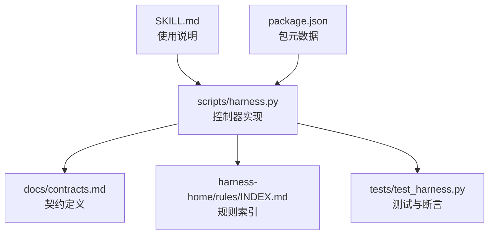
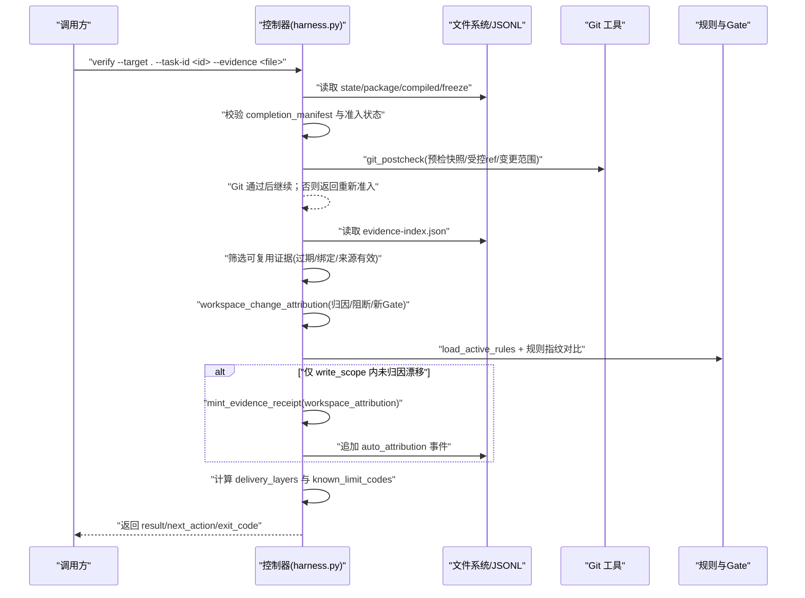
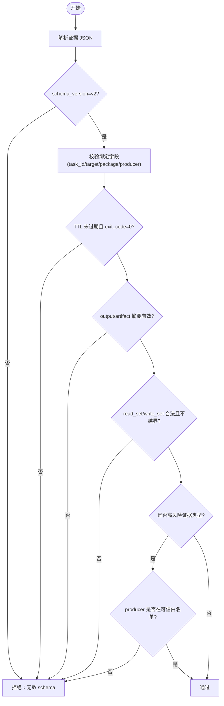
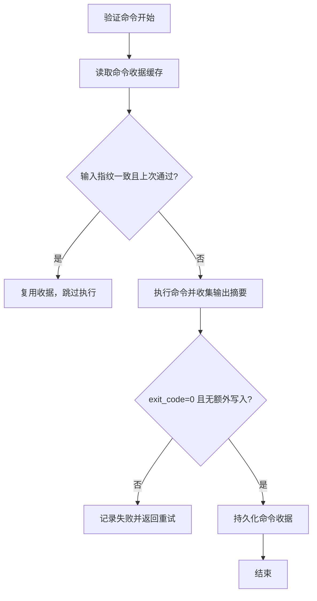
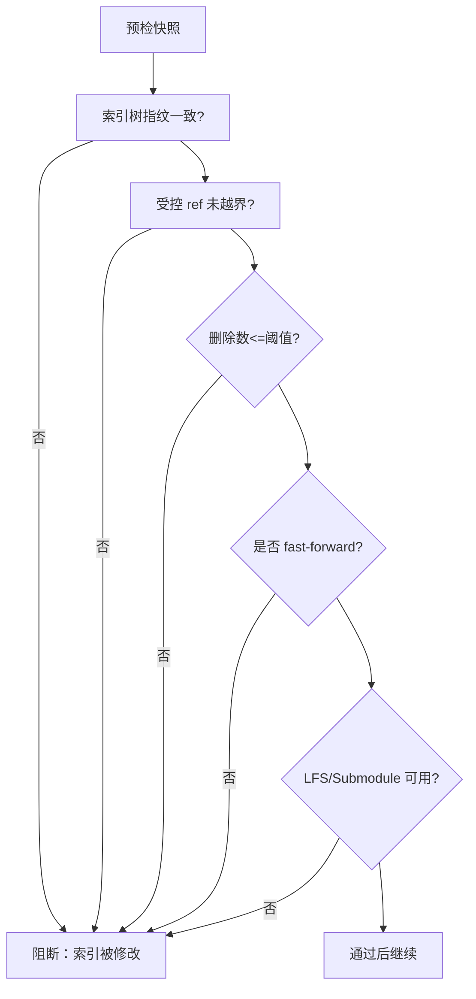
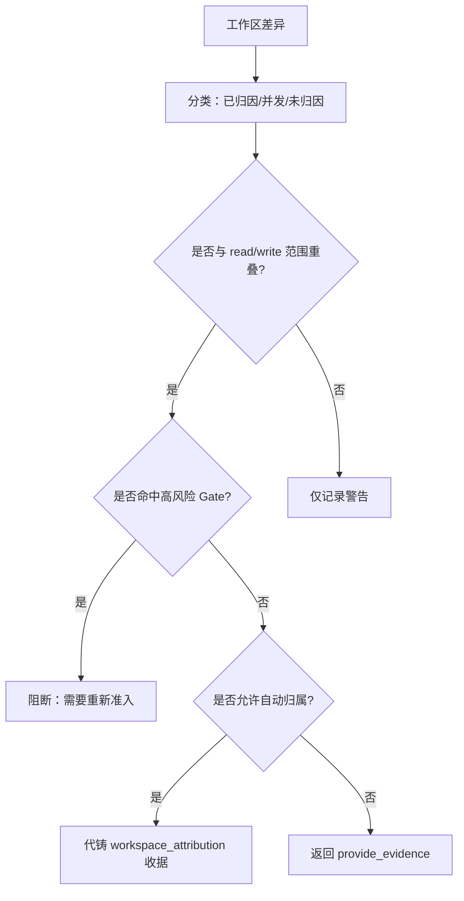
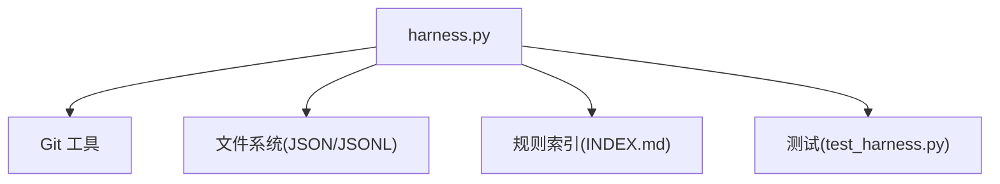

# 收据验证流程

<cite>
**本文引用的文件**   
- [scripts/harness.py](file://scripts/harness.py)
- [tests/test_harness.py](file://tests/test_harness.py)
- [docs/contracts.md](file://docs/contracts.md)
- [SKILL.md](file://SKILL.md)
- [package.json](file://package.json)
- [harness-home/rules/INDEX.md](file://harness-home/rules/INDEX.md)
</cite>

## 目录
1. [简介](#简介)
2. [项目结构](#项目结构)
3. [核心组件](#核心组件)
4. [架构总览](#架构总览)
5. [详细组件分析](#详细组件分析)
6. [依赖关系分析](#依赖关系分析)
7. [性能考虑](#性能考虑)
8. [故障排查指南](#故障排查指南)
9. [结论](#结论)
10. [附录](#附录)

## 简介
本文件系统化阐述 Docs Harness 的“证据收据验证”流程，覆盖格式与结构校验、签名与可信来源验证、时间戳与有效期检查、防篡改检测（哈希与完整性）、版本与合同兼容性、失败处理策略（错误分类、重试与降级）、API 使用示例与最佳实践，以及性能优化与批量验证策略。内容基于仓库中的控制器实现、契约文档与测试用例进行归纳与可视化说明，便于不同技术背景的读者理解与落地。

## 项目结构
Docs Harness 以 Python 脚本为核心控制器，配合契约文档、规则索引与测试套件共同构成完整的验收与证据管理闭环：
- scripts/harness.py：任务控制、证据加载与验证、Git 后检、工作区漂移归因、命令缓存、事件记录等核心逻辑
- docs/contracts.md：v2 证据收据、上下文与授权收据、完成清单、交付层、退出码等契约定义
- harness-home/rules/INDEX.md：生效规则快照与指纹约束
- tests/test_harness.py：端到端验证与边界场景覆盖
- SKILL.md：安装、运行、verify 入口与关键行为说明
- package.json：包元数据与脚本入口

**图表来源** 
- [scripts/harness.py](file://scripts/harness.py)
- [docs/contracts.md](file://docs/contracts.md)
- [harness-home/rules/INDEX.md](file://harness-home/rules/INDEX.md)
- [tests/test_harness.py](file://tests/test_harness.py)
- [SKILL.md](file://SKILL.md)
- [package.json](file://package.json)

**章节来源**
- [SKILL.md:25-56](file://SKILL.md#L25-L56)
- [package.json:1-23](file://package.json#L1-L23)

## 核心组件
- 证据收据 v2（evidence-receipt/v2）：绑定 task_id、target_identity、package_fingerprint、producer、时间戳、TTL、退出码、输出摘要、读写集、并发漂移等字段，用于证明一次验证或产物的有效性
- 验证命令收据（verification-command-receipt/v1）：按 argv、produces 与输入指纹逐项缓存，避免重复执行
- 自动归属收据（workspace_attribution）：在 write_scope 内未归因写入时由控制器代铸，减少补证成本
- Git 状态快照与后检（git_state_snapshot/git_postcheck）：冻结预检目标 OID、受控 ref 命名空间、变更范围与 LFS/Submodule 可用性，确保远端与工作区一致性
- 工作区漂移归因（workspace_change_attribution）：区分已归因、并发漂移与未归因漂移，结合风险 Gate 判定阻断或增量重新准入
- 完成清单与交付层（completion-manifest/delivery_layers）：结构化表达各层期望与状态，驱动 verify 结果与退出码

**章节来源**
- [docs/contracts.md:165-221](file://docs/contracts.md#L165-L221)
- [docs/contracts.md:82-95](file://docs/contracts.md#L82-L95)
- [docs/contracts.md:97-132](file://docs/contracts.md#L97-L132)
- [docs/contracts.md:134-163](file://docs/contracts.md#L134-L163)

## 架构总览
下图展示 verify 主流程的关键阶段：状态与契约校验、证据加载与复用、Git 后检、工作区漂移归因、规则与 Gate 评估、自动归属与增量重新准入、最终结果与事件记录。

**图表来源** 
- [scripts/harness.py:6282-6500](file://scripts/harness.py#L6282-L6500)
- [docs/contracts.md:165-221](file://docs/contracts.md#L165-L221)
- [docs/contracts.md:97-132](file://docs/contracts.md#L97-L132)

## 详细组件分析

### 证据收据 v2 的格式与结构校验
- 必填绑定字段：task_id、target_identity、package_fingerprint、content_set_fingerprint、producer、command_argv_digest、cwd、started_at、ended_at、ttl、exit_code、output_or_artifact_digest、read_set、write_set
- 校验要点：
  - schema_version 必须为 v2
  - producer 必须在可信白名单中（如 docs-harness/verification_command、auto_attribution、host_declaration 等）
  - TTL 过期、跨任务/目标/package 指纹不匹配、非零退出码或摘要无效均拒绝
  - 高风险证据类型需来自可信 v2 生产者，报告型旧证据不满足安全要求

**图表来源** 
- [docs/contracts.md:165-188](file://docs/contracts.md#L165-L188)
- [scripts/harness.py:5076-5120](file://scripts/harness.py#L5076-L5120)

**章节来源**
- [docs/contracts.md:165-188](file://docs/contracts.md#L165-L188)

### 验证命令收据与缓存机制
- 每项验证命令生成 verification-command-receipt/v1，绑定 argv、produces 与输入指纹（read_set 与工作区相关写入）
- 缓存命中条件：输入不变且上次通过；输入变化、上次失败或 volatile 副产物改变输入则重跑
- 可通过配置关闭整体缓存（verification.command_cache_enabled=false），关闭时不读不写缓存并记录事件

**图表来源** 
- [docs/contracts.md:190-221](file://docs/contracts.md#L190-L221)

**章节来源**
- [docs/contracts.md:190-221](file://docs/contracts.md#L190-L221)

### Git 状态快照与后检（防篡改与一致性）
- git_preflight_contract：冻结 repo_identity、remote URL 指纹、refspec、index_tree、worktree_fingerprint、controlled_refs_namespace、lfs/submodule 可用性与 git_sync_scope
- git_postcheck：比对当前工作区与快照，校验 index_unchanged、受控 ref 未越界、删除数量阈值、fast-forward 限制等
- 远端漂移、ref 越界、非 fast-forward、分支分歧、脏工作区重叠、危险删除、LFS/Submodule 不可用均失败关闭

**图表来源** 
- [scripts/harness.py:677-788](file://scripts/harness.py#L677-L788)
- [scripts/harness.py:793-838](file://scripts/harness.py#L793-L838)

**章节来源**
- [docs/contracts.md:97-132](file://docs/contracts.md#L97-L132)

### 工作区漂移归因与自动归属
- workspace_change_attribution：区分 task_write_set、read_set、concurrent_drift、unattributed_drift，并结合 write_scope 与风险 Gate 判定阻断
- 若唯一阻断为 write_scope 内未归因写入，控制器默认代铸 workspace_attribution 收据并记录事件，支持配置开关恢复手动补证流程

**图表来源** 
- [scripts/harness.py:6384-6500](file://scripts/harness.py#L6384-L6500)

**章节来源**
- [docs/contracts.md:134-163](file://docs/contracts.md#L134-L163)

### 数字签名与证书链验证（概念性说明）
- 本仓库未包含公钥/证书链验证实现；证据可信性通过 producer 白名单、命令摘要与输出摘要、TTL 与绑定指纹保障
- 如需扩展数字签名验证，可在 load_evidence 前增加签名解析、算法匹配、证书链校验与时间戳权威校验步骤，并与现有 producer 白名单联动

[本节为概念性说明，不直接分析具体文件]

### 时间戳与有效期检查
- 证据收据中的 started_at/ended_at/ttl 参与过期判断；过期证据不参与复用
- 时间解析异常视为过期，确保严格的时间语义

**章节来源**
- [scripts/harness.py:6366-6383](file://scripts/harness.py#L6366-L6383)

### 版本与合同兼容性
- 仅接受 evidence-receipt/v2；v1 在途任务只允许有限操作，迁移需显式 apply
- 完成清单与交付层随 package revision 冻结，新增 Gate 或合同变化触发完整重新准入

**章节来源**
- [docs/contracts.md:236-248](file://docs/contracts.md#L236-L248)
- [docs/contracts.md:50-78](file://docs/contracts.md#L50-L78)

### 验证失败的处理策略
- 错误分类：invalid_json、missing_file、not_admitted、plan_contract_drift、authorization_contract_drift、action_context_missing、git_remote_drift、unattributed_drift_overlap、new_risk_gate 等
- 重试机制：验证命令失败返回 retry_verification；输入不变时可直接复用失败收据并重试
- 降级处理：合同稳定且仅存在 write_scope 内未归因漂移时，自动归属或提供证据；高风险或合同变化走 full_readmission

**章节来源**
- [scripts/harness.py:6301-6500](file://scripts/harness.py#L6301-L6500)
- [docs/contracts.md:153-163](file://docs/contracts.md#L153-L163)

### 验证 API 使用示例与最佳实践
- 基本用法：python3 scripts/harness.py verify --target . --task-id <task-id> --evidence <evidence.json> --json
- 幂等与复用：同一 target、任务文本、事实与工作区快照重复 run 时复用活动任务；verify 对已通过命令与证据复用
- 最佳实践：
  - 明确声明 produces 白名单，避免无关证据类型
  - 合理设置 TTL，避免长期失效证据污染索引
  - 使用受管副本保存证据，原始文件删除不影响已采纳证据
  - 关闭 command_cache 仅在调试或审计需求时使用

**章节来源**
- [SKILL.md:45-56](file://SKILL.md#L45-L56)
- [docs/contracts.md:165-221](file://docs/contracts.md#L165-L221)

## 依赖关系分析
- 控制器依赖 Git 工具、文件系统与 JSON 解析
- 证据索引与事件日志位于任务 Runtime 目录，不受 Git 跟踪
- 规则索引与指纹约束保证规则一致性，缺失或漂移导致失败关闭

**图表来源** 
- [scripts/harness.py](file://scripts/harness.py)
- [harness-home/rules/INDEX.md](file://harness-home/rules/INDEX.md)
- [tests/test_harness.py](file://tests/test_harness.py)

**章节来源**
- [harness-home/rules/INDEX.md:1-41](file://harness-home/rules/INDEX.md#L1-L41)

## 性能考虑
- 命令收据缓存：避免重复执行相同命令，显著降低 I/O 与外部依赖开销
- 证据复用：基于 binding 与过期判断快速过滤，减少加载与校验成本
- 增量重新准入：仅当新增普通 Gate 且合同不变时增量编译，避免全量重新准入
- 批量验证策略：
  - 合并多个证据一次性提交，减少多次往返
  - 关闭 command_cache 仅在必要时，保持默认开启以获得最佳性能
  - 合理划分 write_scope，降低漂移归因与阻断概率

[本节为通用指导，不直接分析具体文件]

## 故障排查指南
- 常见错误与定位：
  - invalid_completion_manifest：检查 completion_manifest 是否存在且指纹有效
  - not_admitted：确认任务已获得准入状态（ready_direct/planned/extended）
  - plan_contract_drift/authorization_contract_drift：方案或授权指纹变化，需重新准入
  - action_context_missing：执行阶段上下文未加载或失效，需补充证据
  - git_remote_drift：远端漂移导致重新准入
  - unattributed_drift_overlap：write_scope 内未归因写入，启用自动归属或补证
- 事件与日志：
  - 查看 events.jsonl 中的 auto_attribution、verification_attempt 等事件，辅助定位问题
- 回滚与迁移：
  - v1→v2 迁移需显式 apply，存在活动 v2 任务时禁止回滚

**章节来源**
- [scripts/harness.py:6301-6500](file://scripts/harness.py#L6301-L6500)
- [docs/contracts.md:236-248](file://docs/contracts.md#L236-L248)

## 结论
Docs Harness 的证据收据验证体系以 v2 收据为核心，结合命令收据缓存、Git 状态快照与工作区漂移归因，形成高可靠、可审计、可扩展的验收闭环。通过严格的格式与结构校验、可信 producer 白名单、时间戳与有效期检查、以及完善的失败处理与降级策略，确保在高复杂度的协作环境中仍能维持一致的验收标准。建议在生产环境启用命令缓存与自动归属，合理划分 write_scope，并遵循契约文档的最佳实践。

## 附录
- 退出码约定：0 成功；1 检查/自检失败；2 输入/合同/状态无效；3 需要证据/迁移/用户输入；4 范围/漂移/Gate/授权变化需重新准入
- 交付层最小集合：source、local_verification、git_head、remote_delivery、fresh_clone、release_artifact、ui、external_state

**章节来源**
- [docs/contracts.md:359-370](file://docs/contracts.md#L359-L370)
- [docs/contracts.md:82-95](file://docs/contracts.md#L82-L95)