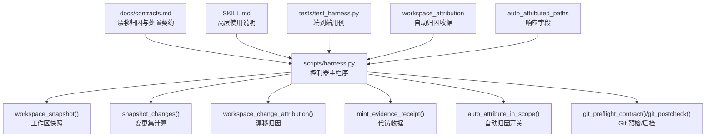
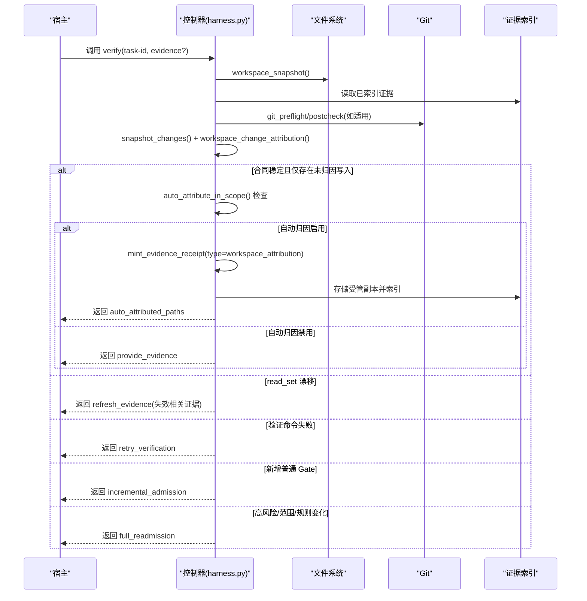
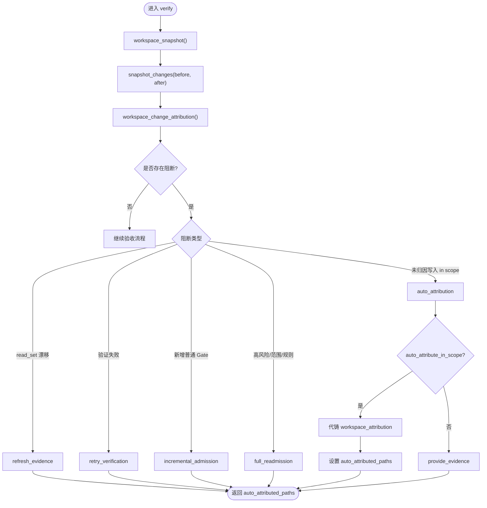
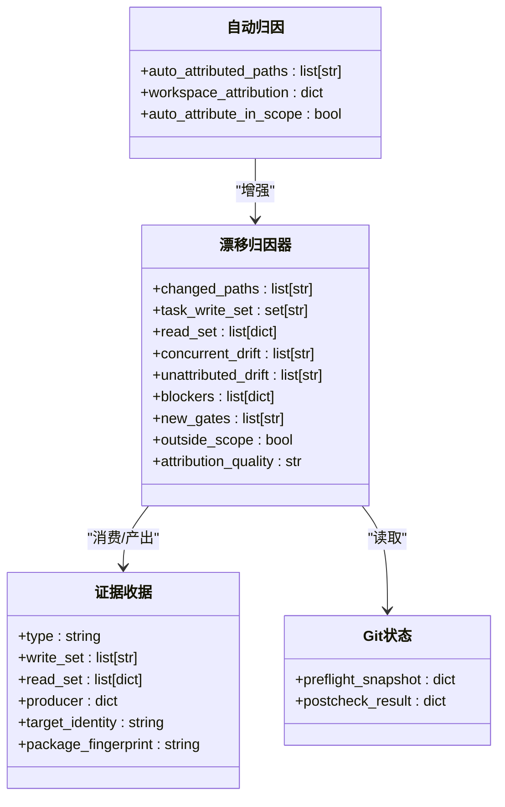
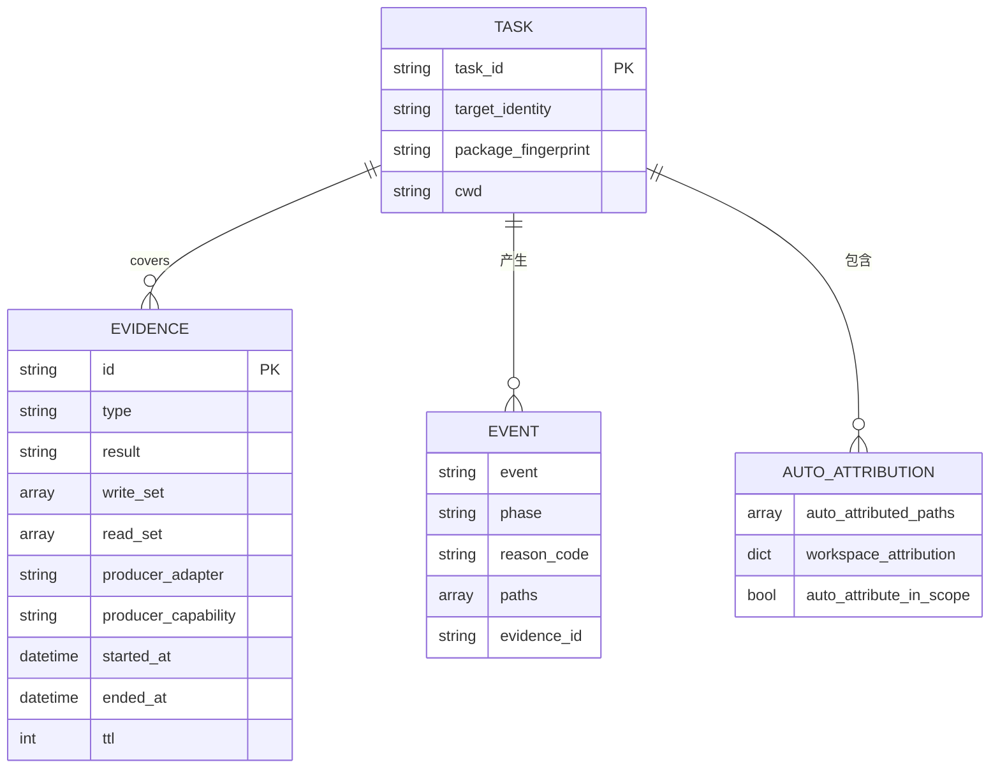
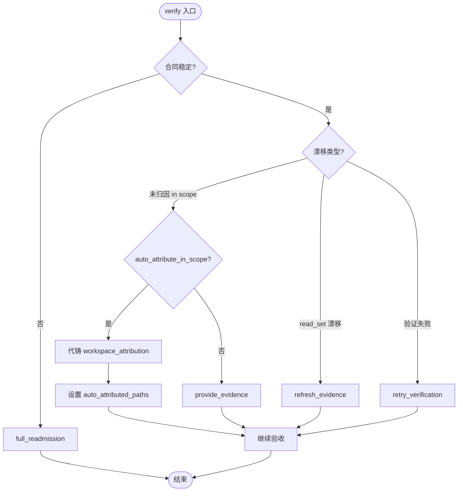

# 自动归因功能

<cite>
**本文引用的文件**   
- [scripts/harness.py](file://scripts/harness.py)
- [tests/test_harness.py](file://tests/test_harness.py)
- [docs/contracts.md](file://docs/contracts.md)
- [SKILL.md](file://SKILL.md)
- [package.json](file://package.json)
</cite>

## 更新摘要
**所做更改**   
- 新增 workspace_attribution 收据类型与 auto_attributed_paths 响应字段说明
- 更新自动归因流程的完整实现细节
- 补充测试用例中的自动归因验证场景
- 完善证据系统与 Git 状态集成的详细说明

## 目录
1. [简介](#简介)
2. [项目结构](#项目结构)
3. [核心组件](#核心组件)
4. [架构总览](#架构总览)
5. [详细组件分析](#详细组件分析)
6. [依赖关系分析](#依赖关系分析)
7. [性能考虑](#性能考虑)
8. [故障排查指南](#故障排查指南)
9. [结论](#结论)
10. [附录](#附录)

## 简介
本文件系统性阐述 Docs Harness 的"自动归因"能力，覆盖工作区写入的自动追踪机制（文件系统监听、变更检测与上下文分析）、责任归属算法（作者识别、贡献度计算、影响范围评估）、归因数据结构定义（变更记录、时间线分析与关联关系映射）、查询接口与可视化方法、准确性验证与人工修正机制、自定义规则配置与扩展点，以及面向大规模代码库的性能优化策略。文档以仓库中的控制器实现与合同规范为依据，确保内容可追溯、可复现。

**更新** 新增了 workspace_attribution 收据类型和 auto_attributed_paths 响应字段的详细说明，完善了自动归因的完整实现流程。

## 项目结构
Docs Harness 的核心控制逻辑集中在脚本入口中，测试用例覆盖关键路径，合同文档明确漂移归因与证据契约，技能说明提供高层使用要点。



**图表来源** 
- [scripts/harness.py:1112-1135](file://scripts/harness.py#L1112-L1135)
- [scripts/harness.py:1138-1139](file://scripts/harness.py#L1138-L1139)
- [scripts/harness.py:5229-5299](file://scripts/harness.py#L5229-L5299)
- [scripts/harness.py:5033-5070](file://scripts/harness.py#L5033-L5070)
- [scripts/harness.py:1202-1213](file://scripts/harness.py#L1202-L1213)
- [scripts/harness.py:677-791](file://scripts/harness.py#L677-L791)
- [scripts/harness.py:6847-6895](file://scripts/harness.py#L6847-L6895)
- [scripts/harness.py:7160-7195](file://scripts/harness.py#L7160-L7195)

**章节来源**
- [scripts/harness.py:1112-1135](file://scripts/harness.py#L1112-L1135)
- [docs/contracts.md:134-163](file://docs/contracts.md#L134-L163)
- [SKILL.md:53-57](file://SKILL.md#L53-L57)

## 核心组件
- 工作区快照与变更检测：通过遍历工作树生成指纹快照，对比前后快照得到变更集；对大文件采用元数据指纹以降低开销。
- 漂移归因：基于冻结基线与当前快照、证据索引与 Git 状态，区分 task_write_set、read_set、concurrent_drift、unattributed_drift，并判定阻断条件。
- **新增** 自动归因：在 write_scope 内且合同稳定时，默认由控制器代铸 workspace_attribution 收据完成自动认领，并可关闭回退为补证据流程。
- **新增** 响应增强：verify 响应包含 auto_attributed_paths 字段，直接标识自动归因的文件路径。
- 证据与声明：支持 v1 草案与 v2 完整收据，控制器可代铸关键字段，保证绑定任务包、目标身份与执行环境一致性。
- Git 预检/后检：对 fetch/sync 操作进行前置校验与后置检查，避免脏工作区、非快进合并、远端漂移等风险。

**章节来源**
- [scripts/harness.py:1112-1135](file://scripts/harness.py#L1112-L1135)
- [scripts/harness.py:5229-5299](file://scripts/harness.py#L5229-L5299)
- [scripts/harness.py:5033-5070](file://scripts/harness.py#L5033-L5070)
- [scripts/harness.py:677-791](file://scripts/harness.py#L677-L791)
- [scripts/harness.py:6847-6895](file://scripts/harness.py#L6847-L6895)
- [scripts/harness.py:7160-7195](file://scripts/harness.py#L7160-L7195)
- [docs/contracts.md:134-163](file://docs/contracts.md#L134-L163)

## 架构总览
自动归因贯穿 verify 阶段的关键分支：先计算漂移与阻断，再按合同决定处置（补证据、刷新证据、重试验证、增量准入或完整重新准入），并在允许范围内自动归因未证明写入。



**图表来源** 
- [scripts/harness.py:6420-6619](file://scripts/harness.py#L6420-L6619)
- [scripts/harness.py:5033-5070](file://scripts/harness.py#L5033-L5070)
- [scripts/harness.py:1112-1135](file://scripts/harness.py#L1112-L1135)
- [scripts/harness.py:677-791](file://scripts/harness.py#L677-L791)
- [scripts/harness.py:6847-6895](file://scripts/harness.py#L6847-L6895)
- [scripts/harness.py:7160-7195](file://scripts/harness.py#L7160-L7195)
- [docs/contracts.md:134-163](file://docs/contracts.md#L134-L163)

## 详细组件分析

### 工作区写入的自动追踪机制
- 文件系统监听与快照：控制器不依赖外部事件总线，而是通过周期性快照与差异比较实现变更检测。快照包含相对路径到指纹的映射，大文件采用"大小+修改时间"指纹以减少 IO。
- 变更检测：对比冻结基线与当前快照，输出排序后的变更路径集合，用于后续归因与阻断判断。
- 上下文分析：结合证据索引、Git 状态与 volatile 模式过滤，将变更分类为 task_write_set、read_set、concurrent_drift、unattributed_drift，并按阻断规则决定是否继续或要求重新准入。



**图表来源** 
- [scripts/harness.py:1112-1135](file://scripts/harness.py#L1112-L1135)
- [scripts/harness.py:1138-1139](file://scripts/harness.py#L1138-L1139)
- [scripts/harness.py:5229-5299](file://scripts/harness.py#L5229-L5299)
- [scripts/harness.py:6420-6619](file://scripts/harness.py#L6420-L6619)
- [scripts/harness.py:6847-6895](file://scripts/harness.py#L6847-L6895)
- [scripts/harness.py:1233-1244](file://scripts/harness.py#L1233-L1244)
- [docs/contracts.md:134-163](file://docs/contracts.md#L134-L163)

**章节来源**
- [scripts/harness.py:1112-1135](file://scripts/harness.py#L1112-L1135)
- [scripts/harness.py:1138-1139](file://scripts/harness.py#L1138-L1139)
- [scripts/harness.py:5229-5299](file://scripts/harness.py#L5229-L5299)
- [scripts/harness.py:6847-6895](file://scripts/harness.py#L6847-L6895)
- [scripts/harness.py:1233-1244](file://scripts/harness.py#L1233-L1244)
- [docs/contracts.md:134-163](file://docs/contracts.md#L134-L163)

### 责任归属算法
- 作者识别：通过证据 producer 字段与可信生产者白名单确定来源；控制器代铸的 auto_attribution 收据标记为内部来源。
- 贡献度计算：依据 task_write_set 与 changed_paths 的重合度、证据覆盖范围与 read_set 指纹稳定性，综合判定该次写入是否应计入当前任务。
- 影响范围评估：结合 write_scope、Git 受控引用与高风险 Gate 词表，判断漂移是否命中安全、数据、发布或不可逆边界；若越界则阻断并要求重新准入。



**图表来源** 
- [scripts/harness.py:5229-5299](file://scripts/harness.py#L5229-L5299)
- [scripts/harness.py:5033-5070](file://scripts/harness.py#L5033-L5070)
- [scripts/harness.py:677-791](file://scripts/harness.py#L677-L791)
- [scripts/harness.py:6847-6895](file://scripts/harness.py#L6847-L6895)
- [scripts/harness.py:1233-1244](file://scripts/harness.py#L1233-L1244)

**章节来源**
- [scripts/harness.py:5229-5299](file://scripts/harness.py#L5229-L5299)
- [scripts/harness.py:5033-5070](file://scripts/harness.py#L5033-L5070)
- [scripts/harness.py:677-791](file://scripts/harness.py#L677-L791)
- [scripts/harness.py:6847-6895](file://scripts/harness.py#L6847-L6895)
- [scripts/harness.py:1233-1244](file://scripts/harness.py#L1233-L1244)

### 归因数据的结构定义
- 变更记录：包含 changed_paths、task_write_set、outside_scope、new_gates、blockers 等，描述本次变更与阻断原因。
- **新增** 自动归因记录：auto_attributed_paths 字段直接列出自动归因的文件路径，workspace_attribution 包含完整的归因详情。
- 时间线分析：通过 events.jsonl 记录 verification_attempt、auto_attribution 等事件，附带 reason_code、paths、evidence_id 等，便于审计与回溯。
- 关联关系映射：证据收据绑定 task_id、target_identity、package_fingerprint、cwd、起止时间与 TTL，read_set 携带路径与指纹，形成"任务-证据-资源"的关联图。



**图表来源** 
- [scripts/harness.py:5033-5070](file://scripts/harness.py#L5033-L5070)
- [scripts/harness.py:6420-6619](file://scripts/harness.py#L6420-L6619)
- [scripts/harness.py:6847-6895](file://scripts/harness.py#L6847-L6895)
- [scripts/harness.py:7160-7195](file://scripts/harness.py#L7160-L7195)
- [docs/contracts.md:134-163](file://docs/contracts.md#L134-L163)

**章节来源**
- [scripts/harness.py:5033-5070](file://scripts/harness.py#L5033-L5070)
- [scripts/harness.py:6420-6619](file://scripts/harness.py#L6420-L6619)
- [scripts/harness.py:6847-6895](file://scripts/harness.py#L6847-L6895)
- [scripts/harness.py:7160-7195](file://scripts/harness.py#L7160-L7195)
- [docs/contracts.md:134-163](file://docs/contracts.md#L134-L163)

### 归因结果的查询接口与可视化展示
- **更新** 查询接口：verify 响应中包含 auto_attributed_paths、workspace_attribution、changed_paths、outside_scope、new_gates、rule_errors 等字段，可直接用于上层 UI 渲染与统计。
- 可视化建议：
  - 变更热力图：以 changed_paths 为节点，按阻断原因着色（read_set_drift、unattributed_drift_overlap、new_risk_gate 等）。
  - **新增** 自动归因高亮：用不同颜色标识 auto_attributed_paths 中的文件，显示自动归因效果。
  - 证据链路图：从 task_id 出发，连接证据收据与 read_set 路径，标注指纹与过期时间。
  - 时间线面板：按 events.jsonl 顺序展示 verification_attempt、auto_attribution 等事件，支持筛选 reason_code。

**章节来源**
- [scripts/harness.py:6420-6619](file://scripts/harness.py#L6420-L6619)
- [scripts/harness.py:6847-6895](file://scripts/harness.py#L6847-L6895)
- [scripts/harness.py:7160-7195](file://scripts/harness.py#L7160-L7195)
- [docs/contracts.md:134-163](file://docs/contracts.md#L134-L163)

### 归因准确性验证与人工修正机制
- 准确性验证：通过 read_set 指纹与证据 TTL 校验，确保证据有效；对高风险证据要求 verified producer；Git postcheck 确认远端与 ref 一致性。
- 人工修正：当 auto_attribute_in_scope=false 时，控制器返回 provide_evidence，要求宿主提交证据草案；也可通过 --facts 声明 gate_assessment 调整 Gate 推断，避免误判。
- **新增** 自动归因验证：workspace_attribution 收据由控制器代铸，producer 标记为 {"adapter": "docs-harness", "capability": "auto_attribution"}，确保来源可信。



**图表来源** 
- [scripts/harness.py:6420-6619](file://scripts/harness.py#L6420-L6619)
- [scripts/harness.py:6847-6895](file://scripts/harness.py#L6847-L6895)
- [scripts/harness.py:7160-7195](file://scripts/harness.py#L7160-L7195)
- [docs/contracts.md:134-163](file://docs/contracts.md#L134-L163)

**章节来源**
- [scripts/harness.py:6420-6619](file://scripts/harness.py#L6420-L6619)
- [scripts/harness.py:6847-6895](file://scripts/harness.py#L6847-L6895)
- [scripts/harness.py:7160-7195](file://scripts/harness.py#L7160-L7195)
- [docs/contracts.md:134-163](file://docs/contracts.md#L134-L163)

### 自定义归因规则的配置方法与扩展点
- 配置文件位置：.docs-harness/config.json
- **新增** 关键开关：
  - verification.auto_attribute_in_scope：控制是否在 write_scope 内自动归因（默认开启）
  - verification.command_cache_enabled：控制验证命令缓存（默认开启）
  - verification.volatile_paths：追加带固定根目录的 glob 白名单，忽略临时产物
- 扩展点：
  - known_evidence_types：新增证据类型需加入白名单（包含 workspace_attribution）
  - TRUSTED_EVIDENCE_PRODUCERS：新增可信生产者（adapter, capability）
  - GATE_DEFS：新增 Gate 的词表、事实文件、计划字段与证据类型

**章节来源**
- [scripts/harness.py:1178-1213](file://scripts/harness.py#L1178-1213)
- [scripts/harness.py:5006-5030](file://scripts/harness.py#L5006-5030)
- [scripts/harness.py:240-249](file://scripts/harness.py#L240-L249)
- [scripts/harness.py:260-342](file://scripts/harness.py#L260-L342)
- [scripts/harness.py:1233-1244](file://scripts/harness.py#L1233-L1244)
- [scripts/harness.py:5395-5419](file://scripts/harness.py#L5395-L5419)

### 性能优化与大规模代码库处理策略
- 快照优化：对大于 2MB 的文件采用"大小+mtime_ns"指纹，减少 IO；非 Git 工作区限制最大扫描文件数，避免截断基线。
- 验证命令缓存：按输入指纹与 cwd 缓存结果，减少重复执行；可通过配置整体关闭。
- 变更集最小化：snapshot_changes 仅输出差异路径，降低后续归因与阻断判断开销。
- Git 预检/后检：提前发现脏工作区、非快进合并、LFS/Submodule 问题，避免无效执行。
- 批量处理：events.jsonl 追加写与原子替换，避免锁竞争；证据索引与受管副本分离，提升并发吞吐。
- **新增** 自动归因优化：仅在 unattributed_drift_overlap 阻断时触发，避免不必要的收据生成。

**章节来源**
- [scripts/harness.py:1112-1135](file://scripts/harness.py#L1112-L1135)
- [scripts/harness.py:1188-1199](file://scripts/harness.py#L1188-L1199)
- [scripts/harness.py:677-791](file://scripts/harness.py#L677-L791)
- [scripts/harness.py:507-529](file://scripts/harness.py#L507-L529)
- [scripts/harness.py:6847-6895](file://scripts/harness.py#L6847-L6895)

## 依赖关系分析
自动归因依赖以下模块与契约：
- 工作区快照与指纹：workspace_snapshot、file_fingerprint
- 证据系统：mint_evidence_receipt、load_evidence、index_evidence
- Git 工具：git_preflight_contract、git_postcheck、git_command
- 配置读取：project_config、verification.* 开关
- 合同约束：docs/contracts.md 漂移归因与五级处置
- **新增** 自动归因配置：auto_attribute_in_scope 开关控制

```mermaid
graph LR
WS["workspace_snapshot"] --> SC["snapshot_changes"]
SC --> WA["workspace_change_attribution"]
WA --> ER["evidence index"]
WA --> GC["git_preflight/postcheck"]
WA --> CFG["project_config"]
WA --> CT["contracts.md"]
WA --> AA["auto_attribute_in_scope"]
AA --> MAR["mint_evidence_receipt(workspace_attribution)]
MAR --> AAP["auto_attributed_paths"]
```

**图表来源** 
- [scripts/harness.py:1112-1135](file://scripts/harness.py#L1112-L1135)
- [scripts/harness.py:5229-5299](file://scripts/harness.py#L5229-L5299)
- [scripts/harness.py:677-791](file://scripts/harness.py#L677-L791)
- [scripts/harness.py:1279-1284](file://scripts/harness.py#L1279-L1284)
- [scripts/harness.py:6847-6895](file://scripts/harness.py#L6847-L6895)
- [scripts/harness.py:1233-1244](file://scripts/harness.py#L1233-L1244)
- [docs/contracts.md:134-163](file://docs/contracts.md#L134-L163)

**章节来源**
- [scripts/harness.py:1112-1135](file://scripts/harness.py#L1112-L1135)
- [scripts/harness.py:5229-5299](file://scripts/harness.py#L5229-L5299)
- [scripts/harness.py:677-791](file://scripts/harness.py#L677-L791)
- [scripts/harness.py:1279-1284](file://scripts/harness.py#L1279-L1284)
- [scripts/harness.py:6847-6895](file://scripts/harness.py#L6847-L6895)
- [scripts/harness.py:1233-1244](file://scripts/harness.py#L1233-L1244)
- [docs/contracts.md:134-163](file://docs/contracts.md#L134-L163)

## 性能考虑
- 快照与指纹：优先使用 Git 跟踪路径；对大文件降级为元数据指纹；限制非 Git 快照规模。
- 验证命令：启用缓存并按输入指纹失效；必要时关闭缓存以规避陈旧结果。
- 事件与索引：追加写与原子替换，避免锁争用；受管副本与原始文件分离，提高可靠性。
- Git 操作：预检失败快速返回，避免无效同步；后检严格校验远端与 ref，防止误判。
- **新增** 自动归因性能：仅在特定阻断条件下触发，避免过度生成收据；auto_attributed_paths 直接返回路径列表，无需额外计算。

## 故障排查指南
- 常见阻断原因：
  - unattributed_drift_overlap：未归因写入与读写范围重叠，需在 write_scope 内补证据或开启自动归因
  - read_set_drift：读取基线漂移，需刷新相关证据
  - new_risk_gate：新增高风险 Gate，需完整重新准入
  - rule_drift：active 规则指纹变化，需完整重新准入
- **新增** 自动归因故障：
  - auto_attribute_in_scope=false：自动归因被禁用，需手动提供证据
  - workspace_attribution 收据生成失败：检查 write_scope 覆盖与合同稳定性
- 定位步骤：
  - 查看 verify 响应的 reason_code、changed_paths、outside_scope、new_gates、auto_attributed_paths
  - 检查 events.jsonl 中 verification_attempt 与 auto_attribution 事件
  - 核对 .docs-harness/config.json 的 verification.* 开关
  - 使用 git_preflight/postcheck 诊断 Git 状态

**章节来源**
- [scripts/harness.py:6420-6619](file://scripts/harness.py#L6420-L6619)
- [scripts/harness.py:6847-6895](file://scripts/harness.py#L6847-L6895)
- [scripts/harness.py:7160-7195](file://scripts/harness.py#L7160-L7195)
- [docs/contracts.md:134-163](file://docs/contracts.md#L134-L163)

## 结论
Docs Harness 的自动归因以快照与差异为基础，结合证据系统与 Git 状态，实现了对工作区写入的精准追踪与责任归属。通过合同化的五级处置与可控的自动归因开关，系统在准确性与效率之间取得平衡。**新增的 workspace_attribution 收据类型和 auto_attributed_paths 响应字段**进一步增强了自动归因的可观测性和可操作性。配合配置扩展点与性能优化策略，能够稳健支撑大规模代码库的治理需求。

## 附录
- 安装与运行：参考 SKILL.md 与 package.json 的脚本定义
- 测试覆盖：tests/test_harness.py 提供了端到端用例，包括自动归因与 Git 同步场景
- **新增** 自动归因测试：test_auto_attribution_completes_modify_task_without_evidence 验证了完整的自动归因流程

**章节来源**
- [SKILL.md:1-105](file://SKILL.md#L1-L105)
- [package.json:1-23](file://package.json#L1-L23)
- [tests/test_harness.py:5450-5474](file://tests/test_harness.py#L5450-L5474)
- [tests/test_harness.py:5486-5487](file://tests/test_harness.py#L5486-L5487)
- [tests/test_harness.py:5594-5596](file://tests/test_harness.py#L5594-L5596)
- [tests/test_harness.py:5631-5632](file://tests/test_harness.py#L5631-L5632)