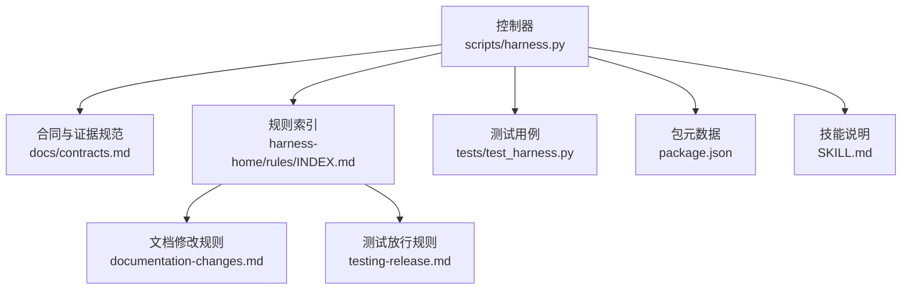
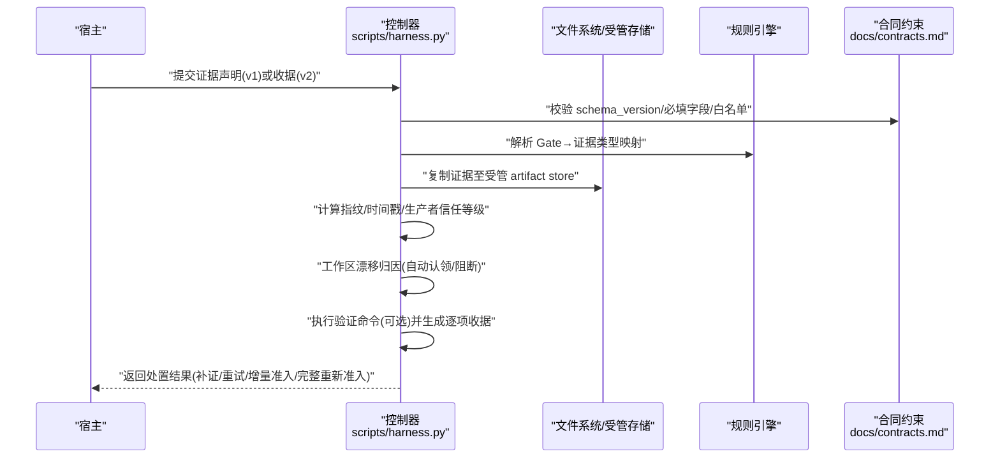
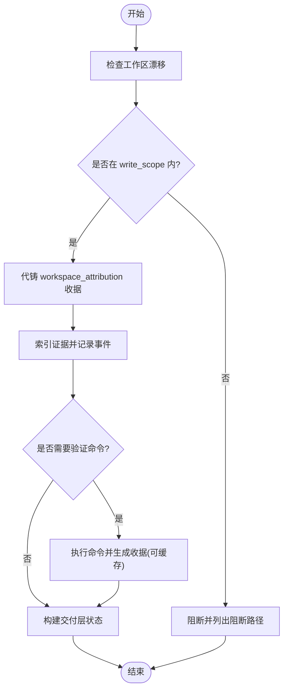
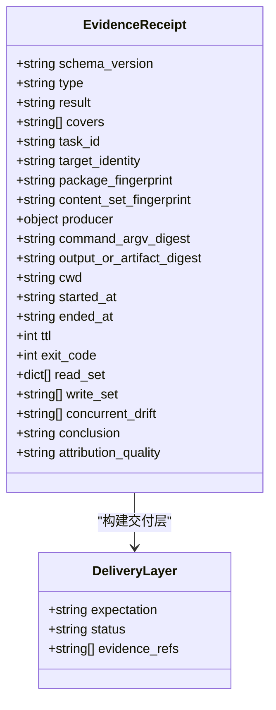
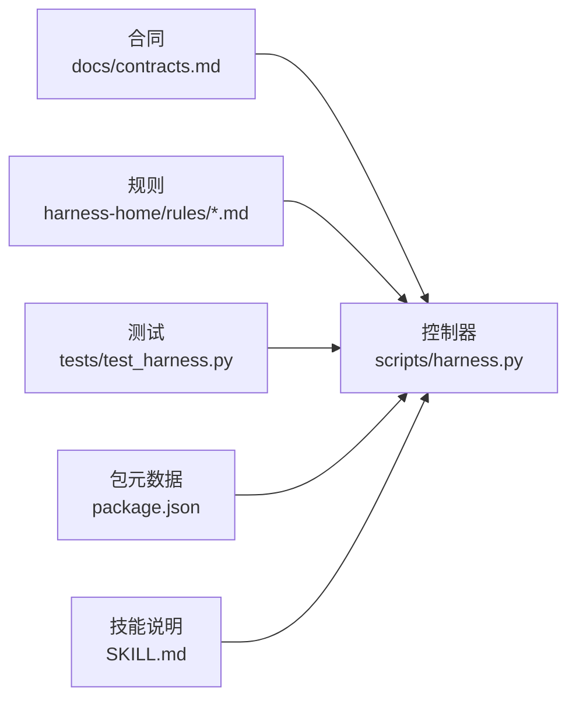

# 证据类型和收集

<cite>
**本文引用的文件**   
- [scripts/harness.py](file://scripts/harness.py)
- [docs/contracts.md](file://docs/contracts.md)
- [harness-home/rules/INDEX.md](file://harness-home/rules/INDEX.md)
- [harness-home/rules/documentation-changes.md](file://harness-home/rules/documentation-changes.md)
- [harness-home/rules/testing-release.md](file://harness-home/rules/testing-release.md)
- [tests/test_harness.py](file://tests/test_harness.py)
- [package.json](file://package.json)
- [SKILL.md](file://SKILL.md)
</cite>

## 目录
1. [简介](#简介)
2. [项目结构](#项目结构)
3. [核心组件](#核心组件)
4. [架构总览](#架构总览)
5. [详细组件分析](#详细组件分析)
6. [依赖关系分析](#依赖关系分析)
7. [性能考量](#性能考量)
8. [故障排查指南](#故障排查指南)
9. [结论](#结论)
10. [附录](#附录)

## 简介
本文件面向 Docs Harness 的证据体系，系统性说明：
- 支持的证据类型与特征（代码变更、测试结果、文档更新、配置修改等）
- 证据的收集机制（自动检测与手动声明）
- 证据元数据结构与关键字段（指纹、时间戳、来源追踪等）
- 使用示例与最佳实践
- 验证规则与完整性检查
- 自定义证据类型的开发与扩展方法

## 项目结构
Docs Harness 将证据相关能力集中在控制器脚本与合同文档中，并通过规则目录驱动 Gate 到证据类型的映射。关键位置如下：
- 控制器实现：scripts/harness.py
- 合同与证据规范：docs/contracts.md
- 规则索引与具体规则：harness-home/rules/INDEX.md 与各 .md 规则
- 测试用例对证据流程的覆盖：tests/test_harness.py
- 包元数据与版本：package.json
- 技能使用说明：SKILL.md

**图表来源** 
- [scripts/harness.py](file://scripts/harness.py)
- [docs/contracts.md](file://docs/contracts.md)
- [harness-home/rules/INDEX.md](file://harness-home/rules/INDEX.md)
- [harness-home/rules/documentation-changes.md](file://harness-home/rules/documentation-changes.md)
- [harness-home/rules/testing-release.md](file://harness-home/rules/testing-release.md)
- [tests/test_harness.py](file://tests/test_harness.py)
- [package.json](file://package.json)
- [SKILL.md](file://SKILL.md)

**章节来源**
- [scripts/harness.py](file://scripts/harness.py)
- [docs/contracts.md](file://docs/contracts.md)
- [harness-home/rules/INDEX.md](file://harness-home/rules/INDEX.md)
- [package.json](file://package.json)
- [SKILL.md](file://SKILL.md)

## 核心组件
- 证据白名单与高风险类型：控制器维护已知证据类型集合，并标记高风险类型用于严格校验。
- 证据收据 v2：统一的新任务证据格式，包含绑定字段、生产者、时间戳、摘要、读写集等。
- 证据声明草案 v1：宿主可提交简化声明，由控制器代铸为完整 v2 收据。
- 验证命令收据：按命令粒度生成收据，支持缓存复用。
- 交付层推导：根据任务意图与成功标准推导 source/local_verification/git_head/remote_delivery/fresh_clone/release_artifact/ui/external_state 各层是否必需与已验证。

**章节来源**
- [scripts/harness.py:5006-5030](file://scripts/harness.py#L5006-L5030)
- [docs/contracts.md:165-218](file://docs/contracts.md#L165-L218)
- [scripts/harness.py:6061-6134](file://scripts/harness.py#L6061-L6134)

## 架构总览
证据生命周期从“声明/采集”到“校验/索引”，再到“验收/归档”。控制器在 verify 阶段完成：
- 证据合法性校验（schema、绑定、生产者可信度、过期、摘要）
- 工作区漂移归因（write_scope 内自动认领或阻断）
- 验证命令执行与收据缓存
- 构建交付层状态与限制码
- 生成受管副本与索引引用

**图表来源** 
- [scripts/harness.py](file://scripts/harness.py)
- [docs/contracts.md](file://docs/contracts.md)

## 详细组件分析

### 证据类型与特征
- 源码与 Git 类
  - workspace_attribution：工作区内未归因写入的自动认领收据
  - source_trace：源码溯源证据
  - git_inspection_result / git_fetch_result / git_sync_result：Git 操作结果证据
- 测试与验收类
  - test_result：测试/验收通过证据
  - ui_acceptance：真实界面验收证据
  - release_acceptance：发布产物验收证据
  - external_state：外部状态变更证据
  - fresh_clone_verification：fresh clone 验证证据
  - remote_delivery：远端交付证据
- 文档与契约类
  - document_review：文档审查证据
  - contract_acceptance：契约/接口验收证据
  - product_acceptance：产品边界验收证据
- 诊断与安全类
  - diagnostic_replay：诊断回放证据
  - recovery_acceptance：恢复验收证据
  - security_acceptance：安全验收证据

高风险证据类型包括：security_acceptance、external_state、recovery_acceptance、remote_delivery、fresh_clone_verification、release_acceptance。

**章节来源**
- [scripts/harness.py:5006-5030](file://scripts/harness.py#L5006-L5030)
- [scripts/harness.py:250-257](file://scripts/harness.py#L250-L257)

### 证据收集机制
- 自动检测与自动认领
  - 控制器在工作区漂移检测时，若唯一阻断是 write_scope 内未归因写入，默认代铸 workspace_attribution 收据进行自动认领；可通过配置关闭该行为以回到“提供证据”流程。
- 手动声明与代铸
  - 宿主可提交 evidence-declaration/v1 简化声明，控制器代铸为完整的 evidence-receipt/v2，补齐 task_id、target_identity、package_fingerprint、cwd、起止时间、ttl、exit_code、digests 及 read_set 路径指纹，producer 记为 ("docs-harness","host_declaration")。
- 验证命令与收据缓存
  - 验证命令按 argv、produces、输入指纹与工作区相关写入生成独立收据；输入不变且上次通过则直接复用，失败或输入变化才重跑。可通过配置整体关闭缓存。

**图表来源** 
- [scripts/harness.py:5033-5070](file://scripts/harness.py#L5033-L5070)
- [docs/contracts.md:190-201](file://docs/contracts.md#L190-L201)

**章节来源**
- [scripts/harness.py:5033-5070](file://scripts/harness.py#L5033-L5070)
- [docs/contracts.md:190-201](file://docs/contracts.md#L190-L201)

### 证据元数据结构与字段定义
- evidence-receipt/v2 必填绑定字段
  - task_id、target_identity、package_fingerprint、content_set_fingerprint
  - producer（adapter/capability）
  - command_argv_digest、output_or_artifact_digest
  - cwd、started_at、ended_at、ttl、exit_code
  - read_set（path+fingerprint）、write_set
- 其他关键字段
  - type（证据类型，必须在白名单）
  - result（必须为 passed 或 exit_code=0）
  - covers（覆盖的任务 ID 列表）
  - conclusion（结论文本）
  - concurrent_drift（并发进程产生的变更）
  - attribution_quality（verified/reported/partial/unknown）
- 指纹与时间戳
  - 所有 digest 均为 sha256: 前缀
  - started_at/ended_at 为 ISO 时间且带时区，ttl 为正整数且不超过上限

**章节来源**
- [docs/contracts.md:165-218](file://docs/contracts.md#L165-L218)
- [scripts/harness.py:5073-5200](file://scripts/harness.py#L5073-L5200)

### 证据验证规则与完整性检查
- 合法性校验
  - schema_version 必须为 v2（v1 仅只读历史）
  - type 必须在 known_evidence_types() 白名单
  - 绑定字段一致性：task_id、target_identity、package_fingerprint、cwd、exit_code、digests
  - 生产者可信度：必须在 TRUSTED_EVIDENCE_PRODUCERS 白名单
  - 时效性：ended_at + ttl 不得早于当前时间
- 工作区与漂移
  - changed_paths/write_set/read_set/concurrent_drift 需通过范围校验
  - 同名已有文件被修改或删除仍阻断
  - 临时副产物允许新建但不计入额外写入
- 交付层推导
  - 基于任务意图、成功标准与 required_evidence_types 推导每层 expectation/status/evidence_refs
  - 只读任务将 remote_delivery/fresh_clone 标记为 not_applicable；git_sync/external_write 或明确要求时标记为 required

**图表来源** 
- [scripts/harness.py:5073-5200](file://scripts/harness.py#L5073-L5200)
- [scripts/harness.py:6061-6134](file://scripts/harness.py#L6061-L6134)

**章节来源**
- [scripts/harness.py:5073-5200](file://scripts/harness.py#L5073-L5200)
- [scripts/harness.py:6061-6134](file://scripts/harness.py#L6061-L6134)

### 实际使用示例与最佳实践
- 代码变更证据
  - 使用 test_result 作为代码变更的验收证据，确保命令退出码为 0，输出摘要与工作区无额外交付写入。
- 文档更新证据
  - 使用 document_review 作为文档修订的审查证据，方案需说明真源、索引与残留清理范围。
- 配置修改证据
  - 结合 source_trace 与 write_set 明确变更范围，避免越界写入。
- 最佳实践
  - 优先使用 v2 收据；如需简化，提交 v1 声明由控制器代铸
  - 合理设置 read_set 与 write_set，减少误判漂移
  - 使用 verification.volatile_paths 精确允许临时副产物根目录
  - 关闭 command_cache_enabled 仅在调试时短期使用

**章节来源**
- [harness-home/rules/documentation-changes.md](file://harness-home/rules/documentation-changes.md)
- [harness-home/rules/testing-release.md](file://harness-home/rules/testing-release.md)
- [docs/contracts.md:190-201](file://docs/contracts.md#L190-L201)

### 自定义证据类型的开发指南与扩展方法
- 新增证据类型
  - 在 known_evidence_types() 中添加新类型名称
  - 如与 Gate 关联，需在对应 Gate 定义的 evidence 字段补充该类型
- 生产者扩展
  - 在 TRUSTED_EVIDENCE_PRODUCERS 中添加新的 (adapter, capability) 组合
- 验证命令扩展
  - 在 verification_commands 中声明 produces 白名单，确保命令输出与工件摘要符合 v2 收据要求
- 交付层扩展
  - 如需新增层，需在 build_delivery_layers 中增加期望推导与证据绑定逻辑

**章节来源**
- [scripts/harness.py:5006-5030](file://scripts/harness.py#L5006-L5030)
- [scripts/harness.py:6061-6134](file://scripts/harness.py#L6061-L6134)

## 依赖关系分析
- 控制器依赖合同文档定义证据结构与校验规则
- 规则目录驱动 Gate 到证据类型的映射
- 测试用例覆盖证据生命周期与异常分支
- 包元数据与技能说明提供版本与使用说明

**图表来源** 
- [docs/contracts.md](file://docs/contracts.md)
- [scripts/harness.py](file://scripts/harness.py)
- [harness-home/rules/INDEX.md](file://harness-home/rules/INDEX.md)
- [tests/test_harness.py](file://tests/test_harness.py)
- [package.json](file://package.json)
- [SKILL.md](file://SKILL.md)

**章节来源**
- [docs/contracts.md](file://docs/contracts.md)
- [scripts/harness.py](file://scripts/harness.py)
- [harness-home/rules/INDEX.md](file://harness-home/rules/INDEX.md)
- [tests/test_harness.py](file://tests/test_harness.py)
- [package.json](file://package.json)
- [SKILL.md](file://SKILL.md)

## 性能考量
- 验证命令收据缓存可显著减少重复执行开销
- 受管副本与索引避免重复读取原始文件
- 工作区快照与指纹计算采用流式哈希，控制内存占用
- 按需加载上下文与授权收据，降低冷启动成本

[本节为通用指导，不直接分析具体文件]

## 故障排查指南
- 常见错误码与原因
  - invalid_evidence_type：type 不在白名单
  - untrusted_evidence_producer：生产者不可信
  - evidence_expired：收据过期
  - evidence_binding_mismatch：绑定字段不一致
  - missing_file/invalid_json：输入文件问题
- 排查步骤
  - 检查 schema_version 与必填字段
  - 核对 producer 是否在可信白名单
  - 确认 started_at/ended_at/ttl 与当前时间关系
  - 验证 read_set/write_set 路径是否越界
  - 查看交付层状态与限制码定位缺失证据

**章节来源**
- [scripts/harness.py:5073-5200](file://scripts/harness.py#L5073-L5200)
- [docs/contracts.md:165-218](file://docs/contracts.md#L165-L218)

## 结论
Docs Harness 的证据体系以 v2 收据为核心，结合规则驱动的 Gate 映射、严格的校验与漂移归因、以及可复用的验证命令收据，形成高可信、可扩展的证据闭环。通过遵循本文的类型、结构与最佳实践，宿主可高效完成证据采集与验收，并在需要时扩展自定义类型与生产者。

[本节为总结，不直接分析具体文件]

## 附录
- 快速参考
  - 证据白名单与高风险类型见控制器实现
  - 证据收据 v2 字段与校验见合同文档
  - 规则到证据类型的映射见规则目录
  - 测试用例覆盖典型场景与异常分支

[本节为附录，不直接分析具体文件]