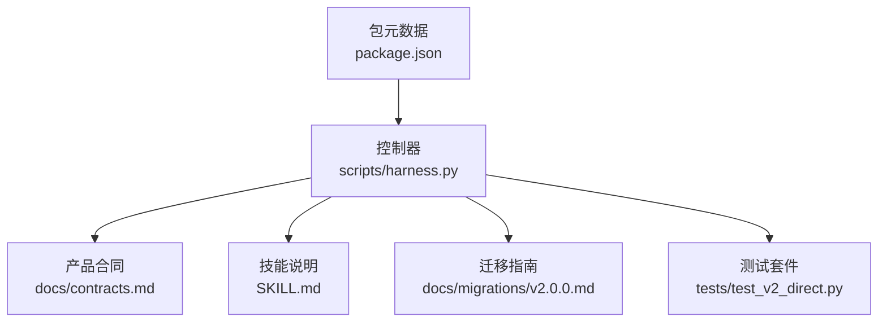
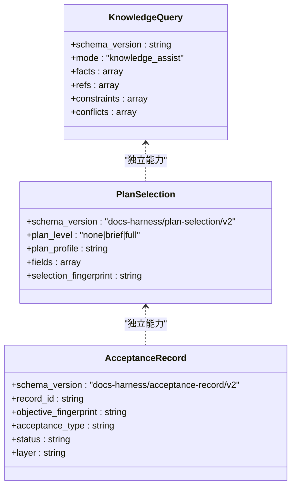
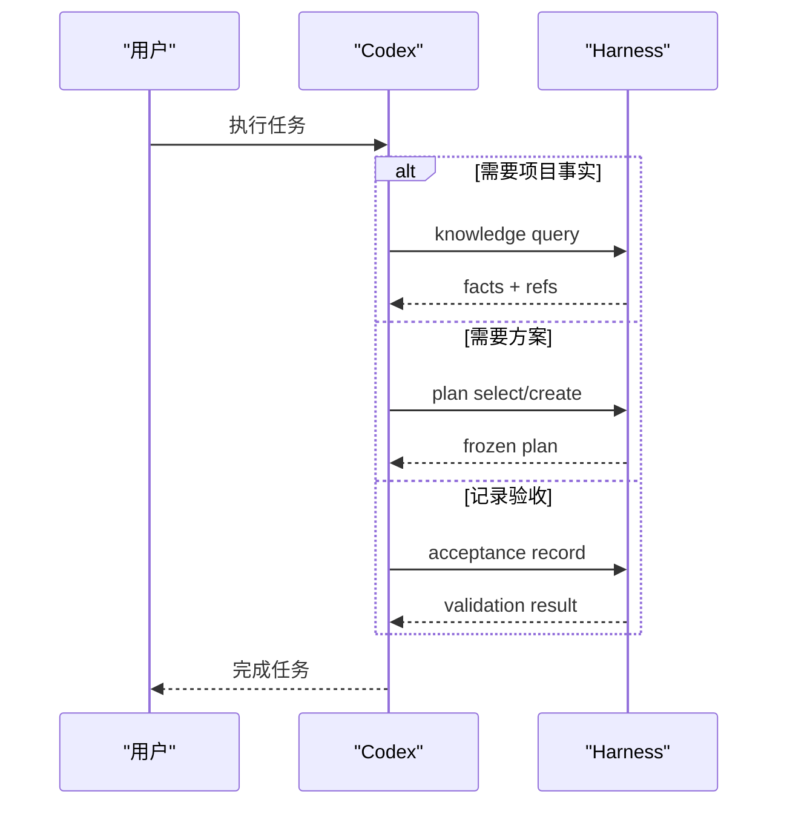
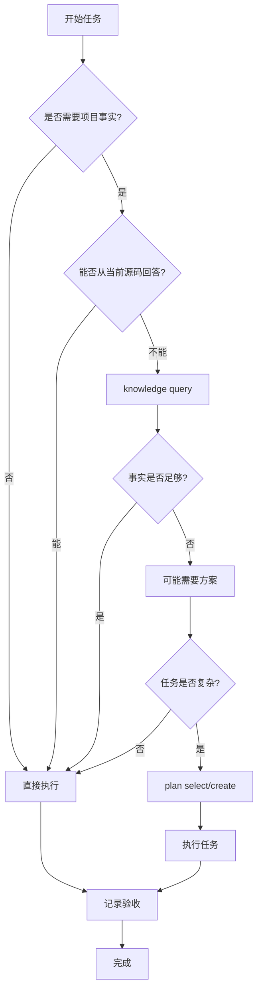
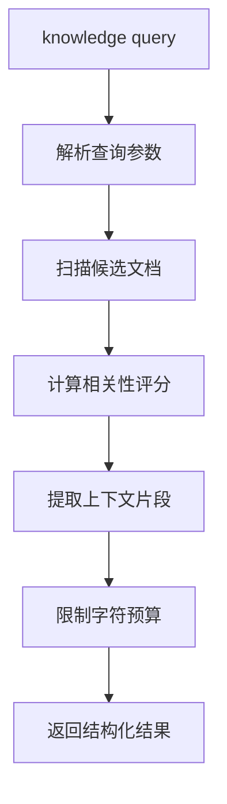
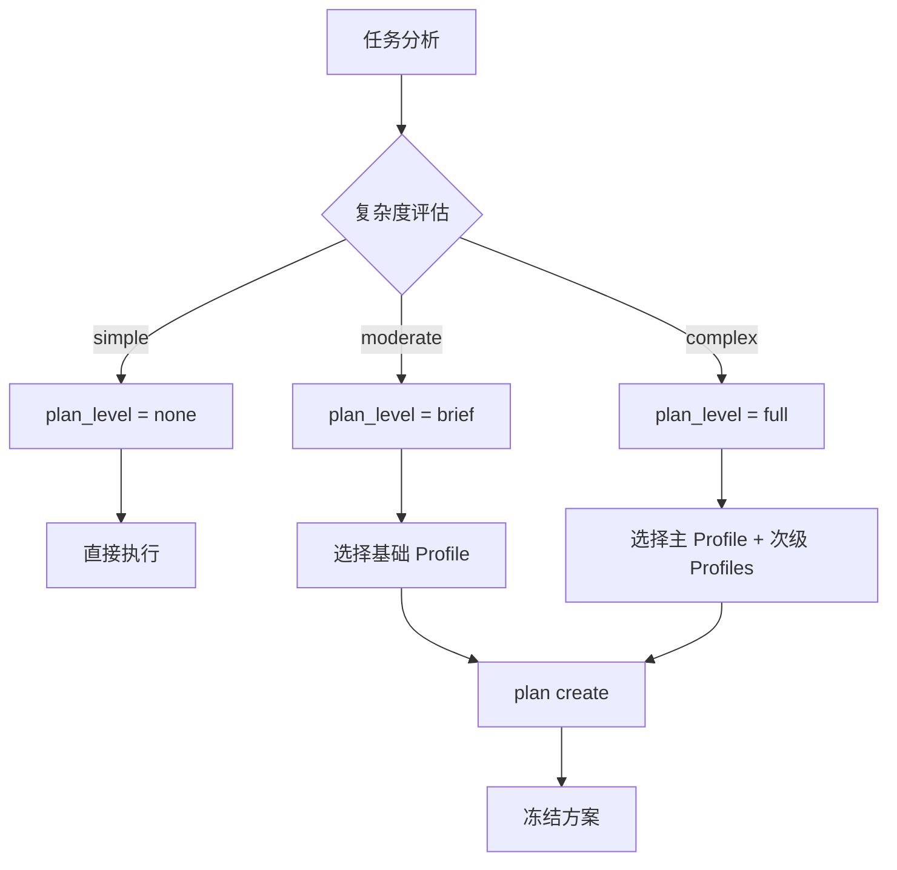
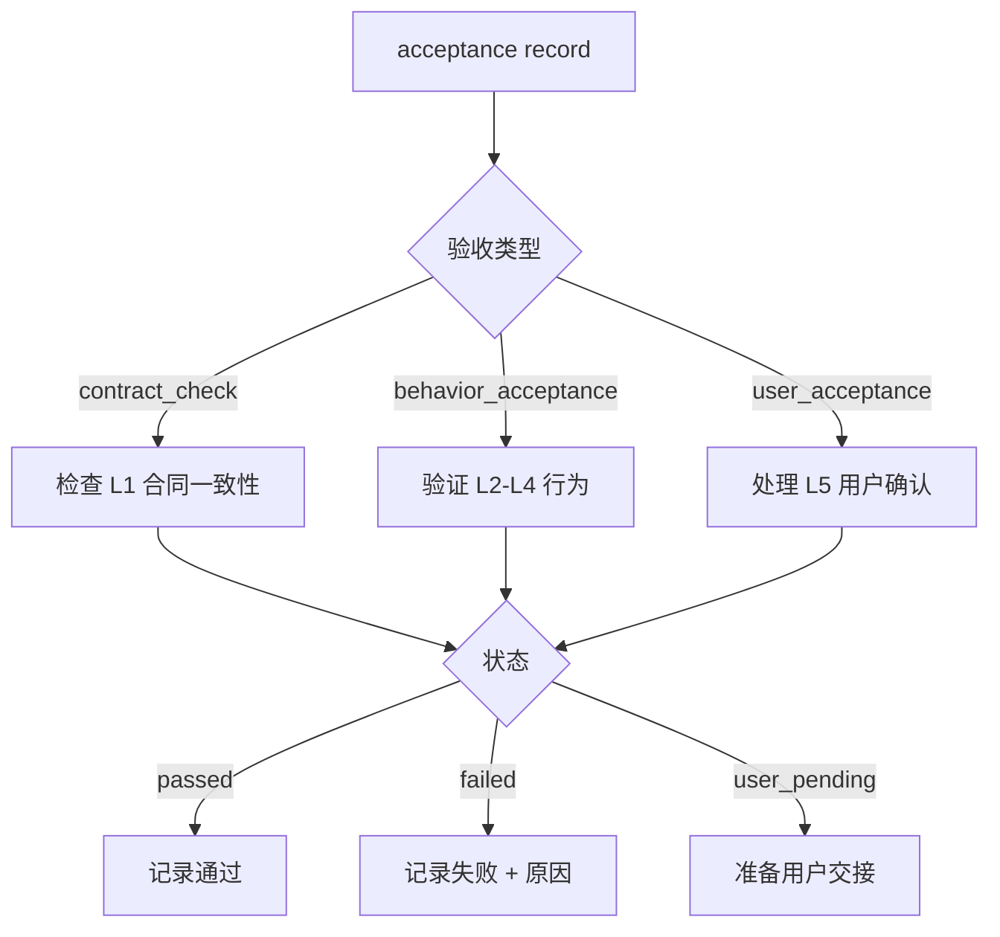
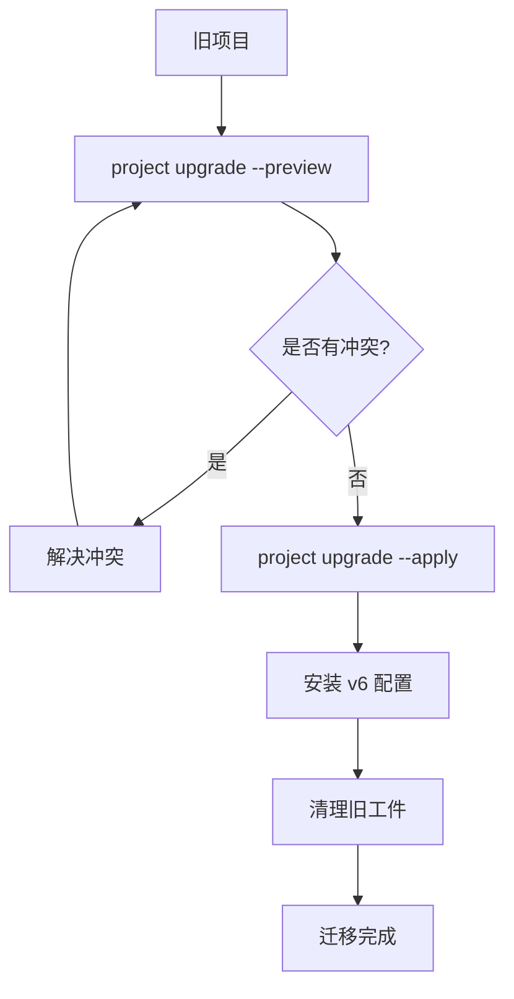
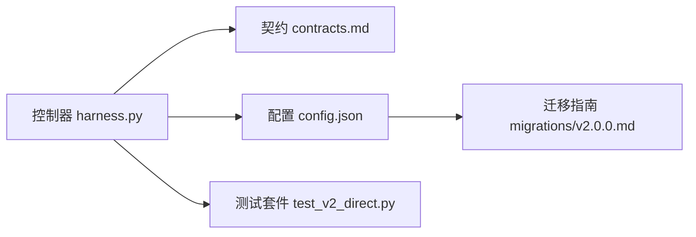

# 证据系统

<cite>
**本文引用的文件**   
- [scripts/harness.py](file://scripts/harness.py)
- [tests/test_v2_direct.py](file://tests/test_v2_direct.py)
- [docs/contracts.md](file://docs/contracts.md)
- [SKILL.md](file://SKILL.md)
- [docs/migrations/v2.0.0.md](file://docs/migrations/v2.0.0.md)
- [package.json](file://package.json)
</cite>

## 更新摘要
**所做更改**   
- 完全移除了旧的验证系统（run、verify、task、background等命令）
- 采用新的直接优先工作流，默认不介入普通任务
- 用真实验收记录框架替代旧的证据收集和收据生成机制
- 简化为三项独立的按需能力：知识查询、方案选择、验收记录
- 更新了迁移指南和合同规范以反映新架构

## 目录
1. [简介](#简介)
2. [项目结构](#项目结构)
3. [核心组件](#核心组件)
4. [架构总览](#架构总览)
5. [详细组件分析](#详细组件分析)
6. [依赖关系分析](#依赖关系分析)
7. [性能考量](#性能考量)
8. [故障排查指南](#故障排查指南)
9. [结论](#结论)
10. [附录](#附录)

## 简介
Docs Harness 2.0.0 是一个全新的文档辅助系统，采用"直接优先"的工作流程。与旧版本不同，它不再作为任务入口或工单系统，而是提供三个相互独立的按需能力：知识查询、方案选择和真实验收记录。

**重大变更** 2.0.0 完全移除了旧的验证系统，包括 `run`、`context`、`progress`、`verify`、`task`、`background`、`authorization` 等命令。现在系统专注于提供最小化的辅助功能，让 Codex 能够直接执行用户任务，只在需要时调用可选的辅助能力。

## 项目结构
- 控制器入口与核心逻辑：scripts/harness.py
- 产品合同与版本说明：docs/contracts.md
- 技能使用说明与关键行为摘要：SKILL.md
- 迁移指南：docs/migrations/v2.0.0.md
- 测试套件与用例：tests/test_v2_direct.py
- 包元数据与脚本：package.json



**图表来源** 
- [scripts/harness.py:1-100](file://scripts/harness.py#L1-L100)
- [docs/contracts.md:1-122](file://docs/contracts.md#L1-L122)
- [SKILL.md:1-98](file://SKILL.md#L1-L98)
- [docs/migrations/v2.0.0.md:1-171](file://docs/migrations/v2.0.0.md#L1-L171)

**章节来源**
- [scripts/harness.py:1-100](file://scripts/harness.py#L1-L100)
- [docs/contracts.md:1-122](file://docs/contracts.md#L1-L122)
- [SKILL.md:1-98](file://SKILL.md#L1-L98)
- [docs/migrations/v2.0.0.md:1-171](file://docs/migrations/v2.0.0.md#L1-L171)
- [package.json:1-23](file://package.json#L1-L23)

## 核心组件
2.0.0 版本只包含三个核心的按需能力：

### 知识查询
- Schema：`docs-harness/project-config/v6`
- 用途：在缺少关键项目事实时进行只读知识检索
- 特点：状态无关、有界输出、排除历史目录

### 方案选择与创建
- Schema：`docs-harness/plan-selection/v2`、`docs-harness/plan-template/v2`、`docs-harness/plan/v2`
- 用途：为复杂任务选择合适的方案模板并冻结执行计划
- 特点：基于实际修改面而非任务文本、支持多 Profile 组合

### 真实验收记录
- Schema：`docs-harness/acceptance-input/v2`、`docs-harness/acceptance-record/v2`
- 用途：记录已经发生的验收结果，不自动执行测试
- 特点：分层验收（L1-L5）、三种验收类型分离、严格的状态机



**图表来源** 
- [scripts/harness.py:23-32](file://scripts/harness.py#L23-L32)
- [docs/contracts.md:19-99](file://docs/contracts.md#L19-L99)

**章节来源**
- [scripts/harness.py:23-32](file://scripts/harness.py#L23-L32)
- [docs/contracts.md:19-99](file://docs/contracts.md#L19-L99)

## 架构总览
2.0.0 采用极简的"直接优先"架构，默认不介入普通任务，只在明确需要时调用辅助能力。



**图表来源** 
- [scripts/harness.py:262-287](file://scripts/harness.py#L262-L287)
- [SKILL.md:13-18](file://SKILL.md#L13-L18)

## 详细组件分析

### 直接优先工作流
**新增架构** 2.0.0 的核心设计理念是"直接优先"：

- 普通问答、只读检查、代码修改、构建和测试由 Codex 直接完成
- 默认不调用 Harness，不创建任务控制状态
- 只有当缺少关键项目事实且会改变目标、范围、方案或验收时才使用知识查询
- 简单任务不生成方案，复杂任务才按需选择模板
- 高风险动作使用 Codex 原生授权与沙箱



**图表来源** 
- [scripts/harness.py:262-287](file://scripts/harness.py#L262-L287)
- [SKILL.md:13-18](file://SKILL.md#L13-L18)

**章节来源**
- [scripts/harness.py:262-287](file://scripts/harness.py#L262-L287)
- [SKILL.md:13-18](file://SKILL.md#L13-L18)

### 知识查询能力
**新增功能** 知识查询是第一个按需能力，提供有界、只读的文档检索：

- 输入参数：`--query`（必填）、`--scope`（可选）、`--limit`（1-10）、`--max-chars`（500-12000）
- 默认排除 `docs/plans/`、`docs/reviews/`、`docs/history/` 等历史目录
- 输出包含事实片段、引用路径、约束条件和冲突信息
- 不会写入任何状态，保持无状态设计



**图表来源** 
- [scripts/harness.py:439-506](file://scripts/harness.py#L439-L506)

**章节来源**
- [scripts/harness.py:439-506](file://scripts/harness.py#L439-L506)

### 方案选择与创建
**新增功能** 方案系统为复杂任务提供结构化的规划能力：

- 选择维度：`plan_level`（none/brief/full）和 `plan_profile`（general/frontend_ui/backend_service/bugfix/architecture/migration_release）
- 自动选择基于实际修改面、复杂度、风险和跨模块程度
- 支持次级 Profile 组合，但主方案唯一
- 冻结机制确保方案内容不被篡改



**图表来源** 
- [scripts/harness.py:526-590](file://scripts/harness.py#L526-L590)

**章节来源**
- [scripts/harness.py:526-590](file://scripts/harness.py#L526-L590)

### 真实验收记录
**新增功能** 验收记录系统提供分层、类型化的验收能力：

- 三种验收类型：`contract_check`（合同检查）、`behavior_acceptance`（行为验收）、`user_acceptance`（用户验收）
- 五个验收层级：L1（源码合同）、L2（聚焦行为）、L3（本地流程）、L4（构建产物）、L5（用户可见）
- 严格的类型-层级约束：L1 不能声明行为正确，Behavior Acceptance 只能用于 L2-L4，L5 必须由用户确认
- 通过必须提供实际方法和证据文件，失败必须给出原因和下一步



**图表来源** 
- [scripts/harness.py:705-842](file://scripts/harness.py#L705-L842)

**章节来源**
- [scripts/harness.py:705-842](file://scripts/harness.py#L705-L842)

### 迁移与兼容性
**重要变更** 2.0.0 提供了完整的单向迁移路径：

- 完全移除了旧命令：`run`、`context`、`progress`、`verify`、`task`、`background`、`authorization`
- 删除了 `--legacy-opt-in` 标志，无法恢复旧流程
- 清理旧 Runtime、规则目录、知识地图等工件
- 保留项目文档、质量账本和用户修改内容
- 提供预览和应用两个阶段的升级流程



**图表来源** 
- [docs/migrations/v2.0.0.md:24-67](file://docs/migrations/v2.0.0.md#L24-L67)

**章节来源**
- [docs/migrations/v2.0.0.md:24-67](file://docs/migrations/v2.0.0.md#L24-L67)

## 依赖关系分析
2.0.0 版本的依赖关系大幅简化：

- 控制器依赖配置文件决定安装行为和迁移策略
- 契约文件定义所有 schema 和行为边界
- 测试套件覆盖关键路径（知识查询、方案选择、验收记录、迁移流程）



**图表来源** 
- [scripts/harness.py:1-100](file://scripts/harness.py#L1-L100)
- [docs/contracts.md:1-122](file://docs/contracts.md#L1-L122)
- [docs/migrations/v2.0.0.md:1-171](file://docs/migrations/v2.0.0.md#L1-L171)

**章节来源**
- [scripts/harness.py:1-100](file://scripts/harness.py#L1-L100)
- [docs/contracts.md:1-122](file://docs/contracts.md#L1-L122)
- [docs/migrations/v2.0.0.md:1-171](file://docs/migrations/v2.0.0.md#L1-L171)

## 性能考量
2.0.0 的性能优化主要体现在：

- **无状态设计**：知识查询不写入任何状态，避免状态同步开销
- **按需调用**：默认不启动任何后台进程或服务
- **有界输出**：知识查询限制返回大小，避免上下文过载
- **增量处理**：方案选择基于实际修改面，不扫描整个代码库
- **精简实现**：控制器代码量大幅减少，从复杂的任务状态机简化为工具函数集合

## 故障排查指南
**新增故障场景** 由于架构变更，故障排查重点也发生变化：

### 常见错误与处置
- **命令不存在**：`run`、`verify` 等旧命令已删除，需要使用新的按需能力
- **配置冲突**：旧配置格式不被识别，需要通过 `project upgrade` 迁移
- **权限问题**：Git 写入等操作使用 Codex 原生授权，不通过 Harness Gate
- **知识查询为空**：检查查询关键词、作用域限制和历史目录排除

### 调试建议
- 查看 `project diff` 和 `project check` 的输出了解当前状态
- 使用 `self-test` 验证安装完整性
- 检查 `.docs-harness/config.json` 是否为 v6 格式
- 验证迁移过程中是否有未解决的冲突

**章节来源**
- [docs/migrations/v2.0.0.md:97-118](file://docs/migrations/v2.0.0.md#L97-L118)
- [tests/test_v2_direct.py:110-133](file://tests/test_v2_direct.py#L110-L133)

## 结论
Docs Harness 2.0.0 代表了文档系统的根本性转变：从复杂的任务状态机转变为简洁的按需辅助工具。通过移除旧的验证系统和任务控制机制，系统现在专注于提供最小化但强大的辅助能力，让开发者能够直接执行任务，同时在需要时获得精准的帮助。

**重大改进** 新的直接优先工作流显著降低了系统复杂性，提高了响应速度，减少了资源消耗。知识查询、方案选择和验收记录三项能力既独立又互补，为不同类型的任务提供了合适的支持层次。

## 附录

### 可用命令参考
**新增命令列表** 2.0.0 支持的完整命令集：

```bash
# 知识查询
python3 scripts/harness.py knowledge query --target . --query "具体查询" --json

# 方案选择
python3 scripts/harness.py plan select --target . --complexity complex --json

# 方案创建  
python3 scripts/harness.py plan create --target . --selection selection.json --content content.json --output docs/plans/plan.json --json

# 验收记录
python3 scripts/harness.py acceptance record --target . --input acceptance.json --json

# 项目管理
python3 scripts/harness.py project init --target . --json
python3 scripts/harness.py project upgrade --target . --json
python3 scripts/harness.py project check --target . --json
python3 scripts/harness.py project diff --target . --json
```

### 验收层级参考
**新增验收标准** 五种验收层级的详细说明：

| 层级 | 含义 | 示例 | 约束 |
|------|------|------|------|
| L1 | 源码、类型、编译或静态合同一致 | lint 通过、类型检查通过 | 不能声明行为正确 |
| L2 | 聚焦行为成立 | 单元测试通过、API 测试通过 | 需要提供方法和证据 |
| L3 | 本地应用或服务真实流程成立 | 端到端测试通过、服务启动成功 | 需要运行环境 |
| L4 | 构建、包或安装产物成立 | npm publish、docker build 成功 | 需要构建环境 |
| L5 | 用户可见、权限、硬件或主观体验成立 | 用户界面测试、权限验证 | 必须由用户确认 |

**章节来源**
- [docs/contracts.md:76-99](file://docs/contracts.md#L76-L99)
- [SKILL.md:62-78](file://SKILL.md#L62-L78)