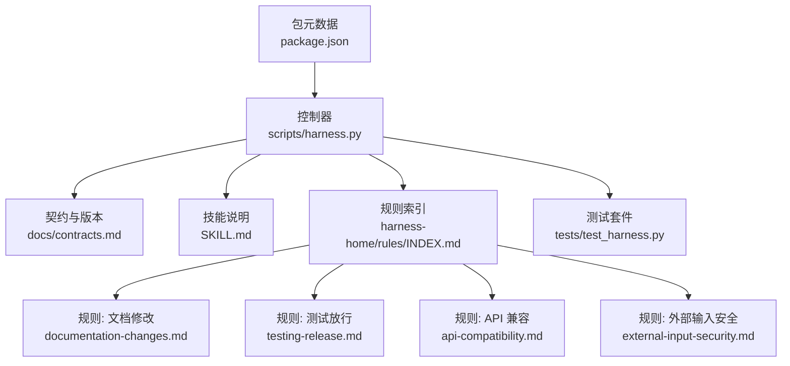
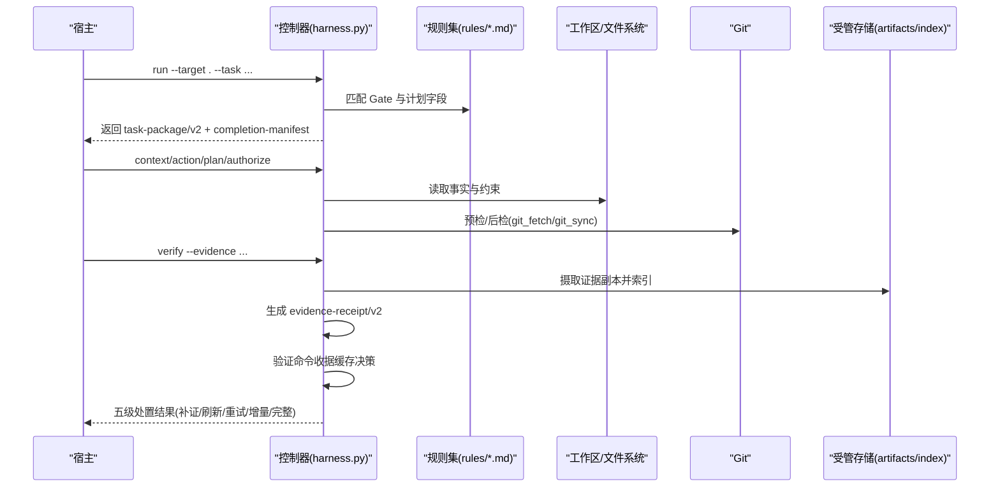
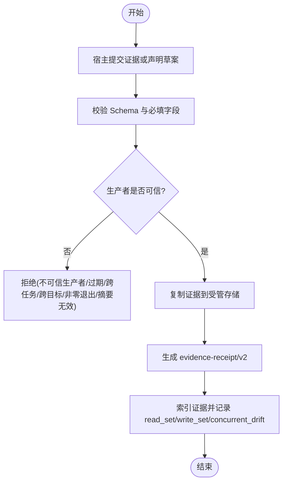
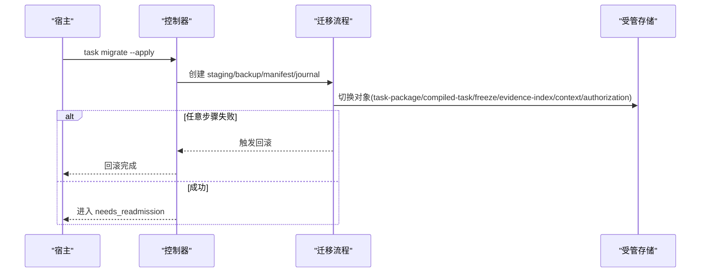
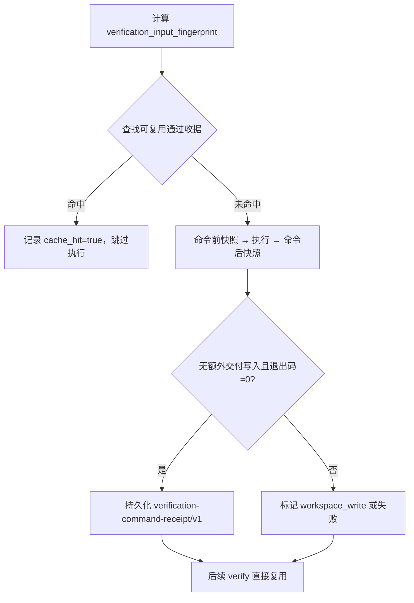
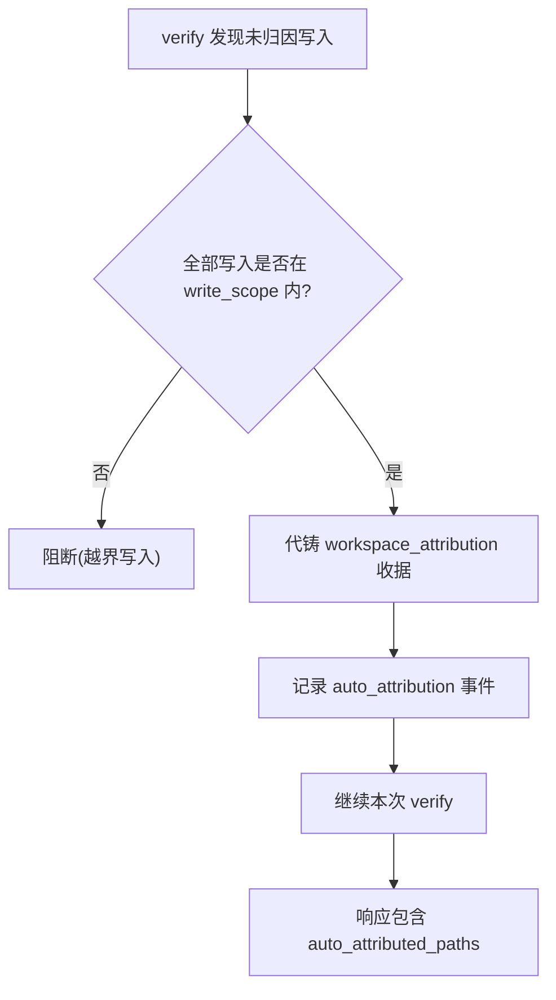
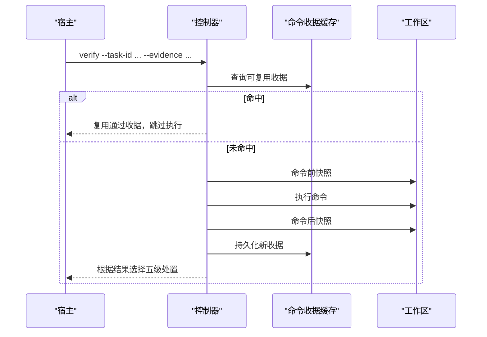
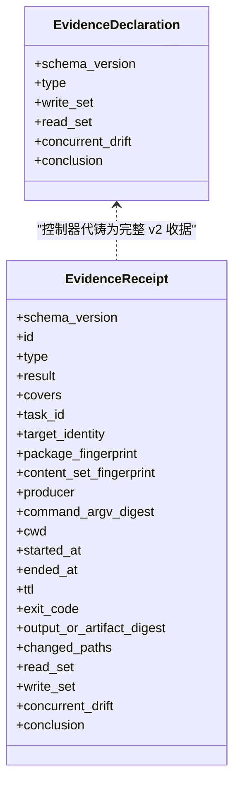
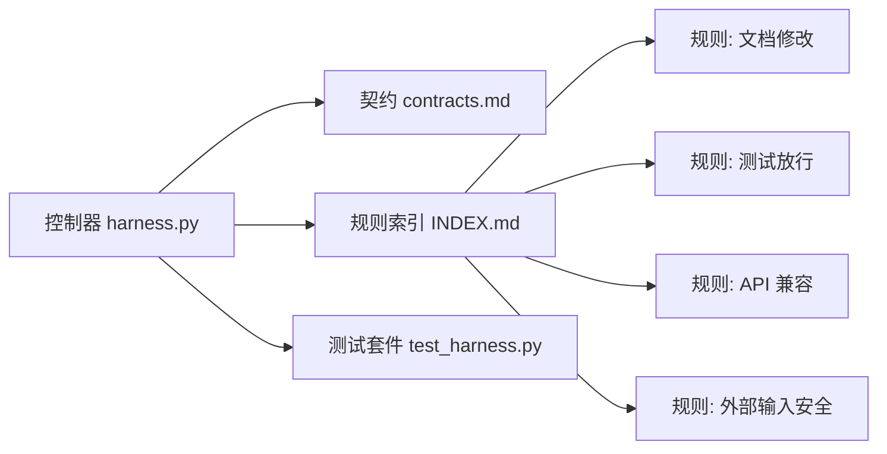

# 证据系统

<cite>
**本文引用的文件**   
- [scripts/harness.py](file://scripts/harness.py)
- [tests/test_harness.py](file://tests/test_harness.py)
- [docs/contracts.md](file://docs/contracts.md)
- [SKILL.md](file://SKILL.md)
- [package.json](file://package.json)
- [harness-home/rules/INDEX.md](file://harness-home/rules/INDEX.md)
- [harness-home/rules/documentation-changes.md](file://harness-home/rules/documentation-changes.md)
- [harness-home/rules/testing-release.md](file://harness-home/rules/testing-release.md)
- [harness-home/rules/api-compatibility.md](file://harness-home/rules/api-compatibility.md)
- [harness-home/rules/external-input-security.md](file://harness-home/rules/external-input-security.md)
</cite>

## 目录
1. [简介](#简介)
2. [项目结构](#项目结构)
3. [核心组件](#核心组件)
4. [架构总览](#架构总览)
5. [详细组件分析](#详细组件分析)
6. [依赖关系分析](#依赖关系分析)
7. [性能考量](#性能考量)
8. [故障排查指南](#故障排查指南)
9. [结论](#结论)
10. [附录](#附录)

## 简介
本文件系统化阐述 Docs Harness 的证据系统，覆盖证据类型与收集机制、收据生成与验证流程（v1/v2 差异与迁移）、证据缓存与指纹计算、自动归因、验证命令执行过程（含命令缓存、增量验证与重试），以及证据声明格式与收据结构的完整规范。同时提供自定义证据适配器的开发指南与实践要点，帮助宿主或第三方以受控方式接入证据生产与验收。

## 项目结构
- 控制器入口与核心逻辑：scripts/harness.py
- 契约与版本说明：docs/contracts.md
- 技能使用说明与关键行为摘要：SKILL.md
- 规则索引与生效规则清单：harness-home/rules/INDEX.md
- 具体规则定义（文档修改、测试放行、API 兼容、外部输入安全等）：harness-home/rules/*.md
- 测试套件与用例：tests/test_harness.py
- 包元数据与脚本：package.json

**图表来源** 
- [scripts/harness.py:1-120](file://scripts/harness.py#L1-L120)
- [docs/contracts.md:1-120](file://docs/contracts.md#L1-L120)
- [SKILL.md:1-105](file://SKILL.md#L1-L105)
- [harness-home/rules/INDEX.md:1-41](file://harness-home/rules/INDEX.md#L1-L41)

**章节来源**
- [scripts/harness.py:1-120](file://scripts/harness.py#L1-L120)
- [docs/contracts.md:1-120](file://docs/contracts.md#L1-L120)
- [SKILL.md:1-105](file://SKILL.md#L1-L105)
- [harness-home/rules/INDEX.md:1-41](file://harness-home/rules/INDEX.md#L1-L41)
- [package.json:1-23](file://package.json#L1-L23)

## 核心组件
- 证据索引与收据
  - 证据索引 schema：docs-harness/evidence-index/v2
  - 证据收据 schema：docs-harness/evidence-receipt/v2
  - 证据声明草案 schema：docs-harness/evidence-declaration/v1
- 验证命令收据
  - 验证命令收据 schema：docs-harness/verification-command-receipt/v1
- 任务包与编译态
  - 任务包 schema：docs-harness/task-package/v2
  - 编译任务 schema：docs-harness/compiled-task/v2
- 上下文与授权收据
  - 上下文收据 schema：docs-harness/context-receipt/v2
  - 授权收据 schema：docs-harness/authorization-receipt/v2
- 其他相关 schema
  - 完成清单：docs-harness/completion-manifest/v1
  - 合同变更：docs-harness/contract-delta/v1
  - 事件：docs-harness/event/v2
  - 项目配置：docs-harness/project-config/v4

上述 schema 常量在控制器中集中定义，确保全链路一致性。

**章节来源**
- [scripts/harness.py:26-56](file://scripts/harness.py#L26-L56)
- [docs/contracts.md:1-120](file://docs/contracts.md#L1-L120)

## 架构总览
证据系统围绕“意图→范围→Gate→上下文→授权→执行→证据→验证→准入”的闭环展开。控制器负责：
- 解析任务意图与范围，推断 Gate；
- 加载上下文与授权；
- 执行或调度业务动作；
- 采集/校验证据并生成 v2 收据；
- 基于五级处置策略进行增量或完整重新准入；
- 维护命令级收据缓存与事件审计。

**图表来源** 
- [scripts/harness.py:1-120](file://scripts/harness.py#L1-L120)
- [docs/contracts.md:1-120](file://docs/contracts.md#L1-L120)
- [SKILL.md:1-105](file://SKILL.md#L1-L105)

## 详细组件分析

### 证据类型与收集机制
- 证据类型由规则与 Gate 驱动，常见类型包括：
  - test_result（测试验收）
  - document_review（文档审查）
  - contract_acceptance（契约验收）
  - security_acceptance（安全验收）
  - ui_acceptance（界面验收）
  - external_state（外部状态）
  - release_acceptance（发布产物验收）
  - fresh_clone_verification（全新克隆验证）
  - recovery_acceptance（恢复验收）
- 收集路径：
  - 宿主提交证据文件或声明草案；
  - 控制器校验生产者可信度、绑定字段、TTL、退出码与输出摘要；
  - 将证据复制到受管 artifact store，生成 v2 收据并索引；
  - 高风险证据必须来自可信 v2 生产者，报告型旧证据不满足要求。

**图表来源** 
- [docs/contracts.md:165-221](file://docs/contracts.md#L165-L221)
- [scripts/harness.py:240-258](file://scripts/harness.py#L240-L258)

**章节来源**
- [docs/contracts.md:165-221](file://docs/contracts.md#L165-L221)
- [scripts/harness.py:240-258](file://scripts/harness.py#L240-L258)

### 收据生成与验证流程（v1 与 v2 差异及迁移）
- v2 收据为强制格式，包含任务 ID、目标身份、包指纹、生产者、命令摘要、cwd、起止时间、TTL、退出码、输出摘要、read_set、write_set 等；
- v1 在途任务仅允许有限操作（如 task status/migrate），需显式 migrate --apply 切换至 v2；
- 迁移过程创建 staging、备份、manifest 与 journal，切换 task-package、compiled-task、freeze、evidence-index、context receipts、authorization receipts；任一步中断按备份回滚；
- 存在活动 v2 任务时，project rollback-check 阻断回滚。

**图表来源** 
- [docs/contracts.md:236-249](file://docs/contracts.md#L236-L249)
- [SKILL.md:53-57](file://SKILL.md#L53-L57)

**章节来源**
- [docs/contracts.md:165-221](file://docs/contracts.md#L165-L221)
- [docs/contracts.md:236-249](file://docs/contracts.md#L236-L249)
- [SKILL.md:53-57](file://SKILL.md#L53-L57)

### 证据缓存机制（指纹计算、缓存策略与失效条件）
- 指纹计算：
  - 文本与文件指纹使用 sha256；
  - 远程 URL 指纹去敏感化后再计算；
  - 工作区快照用于命令输入指纹；
- 命令级收据缓存：
  - 以 task_id、target_identity、命令 argv 摘要、cwd、verification_input_fingerprint、produces、相关合同指纹、producer capability、ttl 为键；
  - 命中则复用通过收据，不重复执行；
  - 输入变化、上次失败或 volatile 副产物改变输入时重跑；
  - 可通过配置整体关闭缓存。
- 失效条件：
  - package revision 变化但相关合同分段不变可 adoption 复用；
  - 安全/发布证据仍须可信生产者，普通命令缓存不能提升等级；
  - 只容忍已知临时副产物新建，同名已有文件被修改或删除仍阻断。

**图表来源** 
- [docs/contracts.md:190-221](file://docs/contracts.md#L190-L221)
- [scripts/harness.py:407-417](file://scripts/harness.py#L407-L417)
- [scripts/harness.py:585-610](file://scripts/harness.py#L585-L610)

**章节来源**
- [docs/contracts.md:190-221](file://docs/contracts.md#L190-L221)
- [scripts/harness.py:407-417](file://scripts/harness.py#L407-L417)
- [scripts/harness.py:585-610](file://scripts/harness.py#L585-L610)

### 自动归因功能（工作区写入追踪与责任归属）
- 当唯一阻断为 write_scope 内未归因写入时，控制器默认代铸 workspace_attribution 收据（producer 为 docs-harness/auto_attribution），自动认领该批路径；
- 记录 auto_attribution 事件，响应新增 auto_attributed_paths；
- 可通过配置关闭自动归因，恢复 provide_evidence 补证据流程；
- git_sync 远端漂移场景下，pull 落盘文件经 git_sync_landed_scope 自动归因，origin/HEAD 更新不再误判 ref 越界。

**图表来源** 
- [docs/contracts.md:218-221](file://docs/contracts.md#L218-L221)
- [SKILL.md:53-57](file://SKILL.md#L53-L57)

**章节来源**
- [docs/contracts.md:218-221](file://docs/contracts.md#L218-L221)
- [SKILL.md:53-57](file://SKILL.md#L53-L57)

### 验证命令执行过程（命令缓存、增量验证与重试）
- 每条验证命令独立执行：计算输入指纹、查找可复用收据、必要时执行并分类写入；
- 五级处置：
  - provide_evidence：可补证据的未归因写入；
  - refresh_evidence：读取基线漂移，只失效引用漂移路径的证据；
  - retry_verification：验证命令失败，输入不变；
  - incremental_admission：追加普通 Gate 且合同不变；
  - full_readmission：范围、高风险合同或规则变化；
- 仅失败或输入变化的命令重跑，其余沿用通过收据；
- 支持配置项控制缓存与自动归因开关。

**图表来源** 
- [docs/contracts.md:153-164](file://docs/contracts.md#L153-L164)
- [docs/contracts.md:190-221](file://docs/contracts.md#L190-L221)
- [SKILL.md:53-57](file://SKILL.md#L53-L57)

**章节来源**
- [docs/contracts.md:153-164](file://docs/contracts.md#L153-L164)
- [docs/contracts.md:190-221](file://docs/contracts.md#L190-L221)
- [SKILL.md:53-57](file://SKILL.md#L53-L57)

### 证据声明格式与收据结构规范
- 证据声明草案（evidence-declaration/v1）：
  - 宿主仅需声明 type、write_set、read_set、concurrent_drift、conclusion；
  - 控制器代铸 task_id、target_identity、package_fingerprint、cwd、起止时间、ttl、exit_code、两个 digest 与 read_set 各路径当前指纹；
  - producer 记为 ("docs-harness", "host_declaration")；
  - 缺 type、type 不在白名单、路径越界等按现有校验失败关闭。
- 完整证据收据（evidence-receipt/v2）：
  - 必填绑定字段包括 task_id、target_identity、package_fingerprint、content_set_fingerprint、producer、command_argv_digest、cwd、started_at、ended_at、ttl、exit_code、output_or_artifact_digest、read_set、write_set；
  - 过期、跨任务/目标/package fingerprint、不可信生产者、非零退出或摘要无效均拒绝；
  - 高风险证据必须来自可信 v2 生产者。

**图表来源** 
- [docs/contracts.md:203-217](file://docs/contracts.md#L203-L217)
- [docs/contracts.md:165-188](file://docs/contracts.md#L165-L188)

**章节来源**
- [docs/contracts.md:203-217](file://docs/contracts.md#L203-L217)
- [docs/contracts.md:165-188](file://docs/contracts.md#L165-L188)

### 自定义证据适配器开发指南
- 适配器需满足：
  - 产出符合白名单的证据类型；
  - 生成或接受 v2 收据，绑定 task_id、target_identity、package_fingerprint、producer、command_argv_digest、cwd、起止时间、ttl、exit_code、output_or_artifact_digest、read_set、write_set；
  - 对高风险证据类型必须来自可信 v2 生产者；
  - 原始 stdout/stderr 不进入 Runtime，仅保留摘要；
  - 证据文件在验收时复制到受管 artifact store，调用者删除不影响已采纳证据。
- 实践要点：
  - 明确 produces 白名单；
  - 严格校验输入指纹与 TTL；
  - 处理 volatile 副产物与阻断写入；
  - 记录必要的事件与审计信息。

**章节来源**
- [docs/contracts.md:190-221](file://docs/contracts.md#L190-L221)
- [scripts/harness.py:240-258](file://scripts/harness.py#L240-L258)

## 依赖关系分析
- 控制器依赖规则集决定 Gate、证据类型与计划字段；
- 契约文件定义所有 schema 与行为边界；
- 测试套件覆盖关键路径（Git fetch/sync、漂移、命令缓存、五级处置等）。

**图表来源** 
- [scripts/harness.py:1-120](file://scripts/harness.py#L1-L120)
- [docs/contracts.md:1-120](file://docs/contracts.md#L1-L120)
- [harness-home/rules/INDEX.md:1-41](file://harness-home/rules/INDEX.md#L1-L41)

**章节来源**
- [scripts/harness.py:1-120](file://scripts/harness.py#L1-L120)
- [docs/contracts.md:1-120](file://docs/contracts.md#L1-L120)
- [harness-home/rules/INDEX.md:1-41](file://harness-home/rules/INDEX.md#L1-L41)

## 性能考量
- 命令级收据缓存显著减少重复执行成本；
- 增量准入避免完整重新准入带来的上下文重载；
- 受管副本与索引降低对调用方临时文件的依赖；
- 合理配置 volatile_paths 与 command_cache_enabled 平衡安全性与效率。

[本节为通用指导，无需特定文件来源]

## 故障排查指南
- 常见错误与处置：
  - 不可信生产者/过期/跨任务/跨目标/非零退出/摘要无效：检查证据收据字段与生产者能力；
  - 越界写入：确认 write_scope 与自动归因开关；
  - 读取基线漂移：refresh_evidence 仅失效相关证据并重读；
  - 验证命令失败：retry_verification 仅重试失败命令；
  - 远端漂移/ref 越界/non-fast-forward：full_readmission 重新准入；
  - LFS/Submodule 不可用：preflight 阶段失败关闭。
- 调试建议：
  - 查看 events.jsonl 中的 verification_attempt 事件；
  - 检查命令收据缓存命中情况；
  - 核对 active rule content fingerprint 与冻结规则一致。

**章节来源**
- [docs/contracts.md:153-164](file://docs/contracts.md#L153-L164)
- [docs/contracts.md:190-221](file://docs/contracts.md#L190-L221)
- [scripts/harness.py:677-791](file://scripts/harness.py#L677-L791)

## 结论
Docs Harness 的证据系统以 v2 收据为核心，结合命令级缓存、自动归因与五级处置策略，实现了高可靠、可审计、可复用的证据生命周期管理。通过契约与规则驱动，系统在保障安全底线的前提下，最大化提升了验证效率与用户体验。

[本节为总结性内容，无需特定文件来源]

## 附录
- 规则示例与证据类型映射：
  - 文档修改规则 → document_review
  - 测试放行规则 → test_result
  - API 兼容规则 → contract_acceptance
  - 外部输入安全规则 → security_acceptance

**章节来源**
- [harness-home/rules/documentation-changes.md:1-29](file://harness-home/rules/documentation-changes.md#L1-L29)
- [harness-home/rules/testing-release.md:1-29](file://harness-home/rules/testing-release.md#L1-L29)
- [harness-home/rules/api-compatibility.md:1-29](file://harness-home/rules/api-compatibility.md#L1-L29)
- [harness-home/rules/external-input-security.md:1-29](file://harness-home/rules/external-input-security.md#L1-L29)