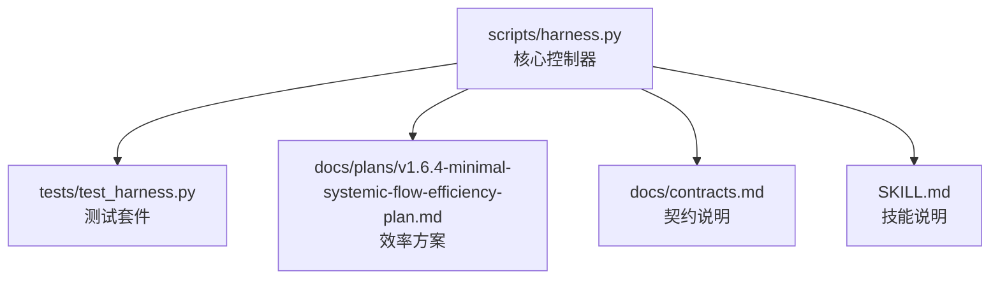
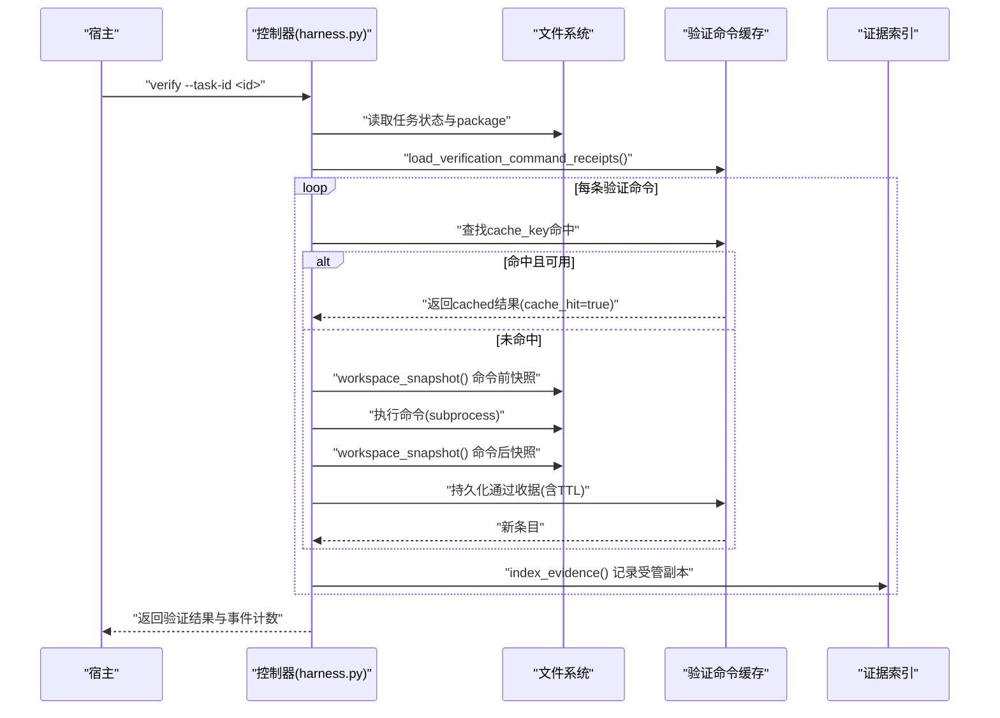
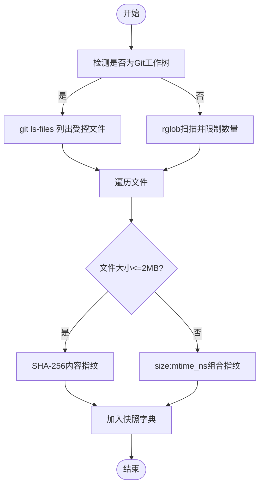
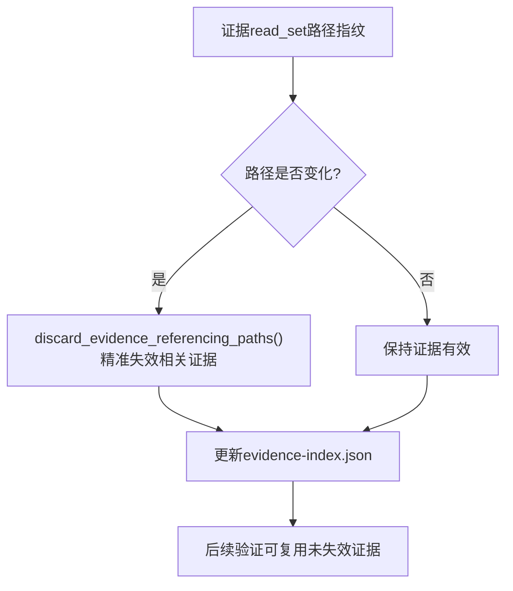
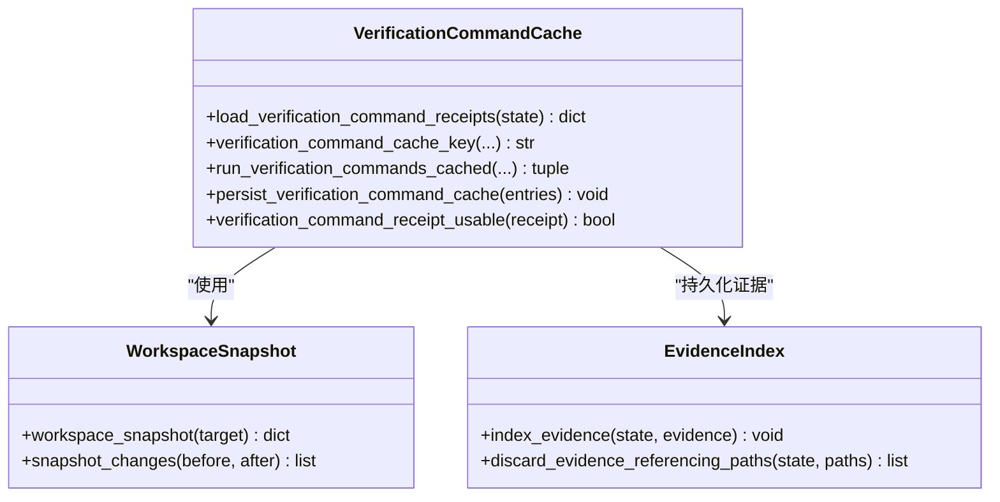
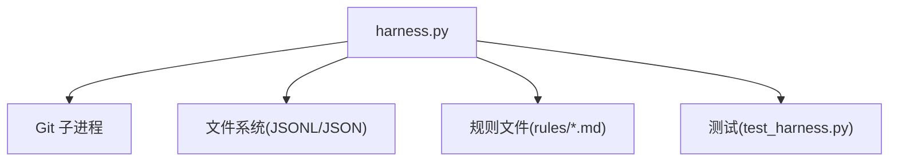

# 证据缓存机制

<cite>
**本文引用的文件**   
- [harness.py](file://scripts/harness.py)
- [test_harness.py](file://tests/test_harness.py)
- [v1.6.4-minimal-systemic-flow-efficiency-plan.md](file://docs/plans/v1.6.4-minimal-systemic-flow-efficiency-plan.md)
- [contracts.md](file://docs/contracts.md)
- [SKILL.md](file://SKILL.md)
</cite>

## 目录
1. [简介](#简介)
2. [项目结构](#项目结构)
3. [核心组件](#核心组件)
4. [架构总览](#架构总览)
5. [详细组件分析](#详细组件分析)
6. [依赖关系分析](#依赖关系分析)
7. [性能考量](#性能考量)
8. [故障排查指南](#故障排查指南)
9. [结论](#结论)
10. [附录](#附录)

## 简介
本文件系统化阐述 Docs Harness 的证据缓存机制，覆盖指纹计算、依赖分析与增量更新策略；LRU 与过期策略及空间管理；失效条件（文件变更、依赖变化、版本更新）；本地与远程一致性同步；性能优化与监控指标；清理与维护工具；以及冲突解决与恢复策略。文档以仓库源码为依据，辅以流程图与时序图帮助理解实现细节。

## 项目结构
Docs Harness 的核心逻辑集中在单一脚本中，测试与计划文档提供行为契约与验收目标：
- scripts/harness.py：控制器主程序，包含指纹计算、工作区快照、验证命令缓存、证据索引、任务状态与事件等全部关键实现。
- tests/test_harness.py：端到端与单元测试，覆盖 Git 操作、意图分类、规则加载、安装与交付状态等。
- docs/plans/v1.6.4-minimal-systemic-flow-efficiency-plan.md：系统性效率方案，定义验证命令逐项收据与复用、五级处置、遥测事件等。
- docs/contracts.md：契约说明，包括证据声明草案、受管副本、自动归因、volatile 路径白名单等。
- SKILL.md：技能说明，概述 run/verify 流程、五级处置、自动归因与缓存开关。

**图表来源** 
- [harness.py:1-120](file://scripts/harness.py#L1-L120)
- [test_harness.py:1-120](file://tests/test_harness.py#L1-L120)
- [v1.6.4-minimal-systemic-flow-efficiency-plan.md:13-60](file://docs/plans/v1.6.4-minimal-systemic-flow-efficiency-plan.md#L13-L60)
- [contracts.md:199-220](file://docs/contracts.md#L199-L220)
- [SKILL.md:43-57](file://SKILL.md#L43-L57)

**章节来源**
- [harness.py:1-120](file://scripts/harness.py#L1-L120)
- [test_harness.py:1-120](file://tests/test_harness.py#L1-L120)
- [v1.6.4-minimal-systemic-flow-efficiency-plan.md:13-60](file://docs/plans/v1.6.4-minimal-systemic-flow-efficiency-plan.md#L13-L60)
- [contracts.md:199-220](file://docs/contracts.md#L199-L220)
- [SKILL.md:43-57](file://SKILL.md#L43-L57)

## 核心组件
- 指纹与哈希
  - 文本与文件指纹：统一使用 SHA-256，前缀“sha256:”，保证跨平台一致性与可审计性。
  - 工作区快照：按 Git 工作树或回退遍历，排除 .git/.docs-harness 等敏感目录，小文件内容哈希，大文件用 size+mtime 组合指纹。
- 验证命令缓存
  - 输入指纹：基于工作区快照过滤 volatile 项后生成，作为缓存键的一部分。
  - 收据键：绑定 task_id、target_identity、command_argv_digest、cwd、verification_input_fingerprint、contract_digest。
  - TTL 与可用性：通过 cached_at 与 ttl 控制有效期，仅“passed”结果可复用。
- 证据索引与受管副本
  - evidence-index.json 维护已采纳证据的源指纹与元数据，支持按 read_set 漂移精准失效。
  - 宿主提交证据时复制至受管 artifact store，原始文件删除不影响已采纳证据。
- 任务幂等与事件
  - active_task_key 去重避免重复创建任务。
  - 每次 verify 写入有界事件，统计 command_cache_hit_count、readmission_count 等指标。

**章节来源**
- [harness.py:408-417](file://scripts/harness.py#L408-L417)
- [harness.py:1112-1136](file://scripts/harness.py#L1112-L1136)
- [harness.py:5726-5757](file://scripts/harness.py#L5726-L5757)
- [harness.py:5786-5895](file://scripts/harness.py#L5786-L5895)
- [harness.py:5334-5360](file://scripts/harness.py#L5334-L5360)
- [v1.6.4-minimal-systemic-flow-efficiency-plan.md:354-392](file://docs/plans/v1.6.4-minimal-systemic-flow-efficiency-plan.md#L354-L392)
- [contracts.md:199-220](file://docs/contracts.md#L199-L220)

## 架构总览
证据缓存围绕“任务状态目录 + 受管工件存储 + 事件日志”构成，验证命令执行采用“逐项快照 + 逐项收据 + 输入指纹缓存”的流水线。

**图表来源** 
- [harness.py:5786-5895](file://scripts/harness.py#L5786-L5895)
- [harness.py:5334-5360](file://scripts/harness.py#L5334-L5360)
- [harness.py:1112-1136](file://scripts/harness.py#L1112-L1136)

**章节来源**
- [harness.py:5786-5895](file://scripts/harness.py#L5786-L5895)
- [harness.py:5334-5360](file://scripts/harness.py#L5334-L5360)
- [harness.py:1112-1136](file://scripts/harness.py#L1112-L1136)

## 详细组件分析

### 指纹计算算法
- 文件内容哈希
  - 流式读取 1MB 块，累积 SHA-256，输出“sha256:”前缀。
  - 大文件在快照中使用 size:mtime_ns 组合指纹，避免全量哈希开销。
- 工作区快照
  - 优先使用 git ls-files，非 Git 环境回退到 rglob，限制文件数量上限。
  - 排除 .git、.docs-harness/runs|quality-ledger|knowledge|background 等目录。
- 远程与目标身份
  - target_identity 对远端 URL 脱敏后哈希，区分 git/local 两种模式。
  - sanitized_remote_fingerprint 去除凭据与查询参数，确保指纹稳定。

**图表来源** 
- [harness.py:1112-1136](file://scripts/harness.py#L1112-L1136)
- [harness.py:411-417](file://scripts/harness.py#L411-L417)
- [harness.py:598-610](file://scripts/harness.py#L598-L610)

**章节来源**
- [harness.py:411-417](file://scripts/harness.py#L411-L417)
- [harness.py:1112-1136](file://scripts/harness.py#L1112-L1136)
- [harness.py:598-610](file://scripts/harness.py#L598-L610)

### 依赖关系分析与增量更新
- 证据依赖
  - 证据 read_set 中的路径指纹用于漂移检测；当 read_set 路径变化时，只失效引用这些路径的证据。
- 任务包修订兼容
  - package revision 变化但命令、输入和相关合同分段不变时，通过 adoption 记录复用旧证据。
- 增量 Gate 准入
  - 新增普通 Gate 且不改变执行/授权/方案合同时，原子增量准入并继承同轮证据。

**图表来源** 
- [harness.py:5342-5360](file://scripts/harness.py#L5342-L5360)
- [v1.6.4-minimal-systemic-flow-efficiency-plan.md:295-302](file://docs/plans/v1.6.4-minimal-systemic-flow-efficiency-plan.md#L295-L302)

**章节来源**
- [harness.py:5342-5360](file://scripts/harness.py#L5342-L5360)
- [v1.6.4-minimal-systemic-flow-efficiency-plan.md:295-302](file://docs/plans/v1.6.4-minimal-systemic-flow-efficiency-plan.md#L295-L302)

### 缓存策略设计原理
- LRU 与过期策略
  - 当前实现未显式实现 LRU 淘汰；通过 TTL 控制过期，仅“passed”收据可复用。
  - 建议扩展：按 cache_key 访问频率维护最近使用时间，结合 TTL 进行 LRU 淘汰。
- 空间管理
  - 验证命令收据存储在 artifacts/verification/command-receipts.jsonl，按 key 覆盖写入最新条目。
  - 建议增加容量阈值与清理策略（如按时间或大小），避免无限增长。
- 配置开关
  - verification.command_cache_enabled 可整体关闭缓存；默认开启。
  - verification.volatile_paths 允许追加 glob 白名单，扩大临时产物容忍范围。

**图表来源** 
- [harness.py:5760-5783](file://scripts/harness.py#L5760-L5783)
- [harness.py:5786-5895](file://scripts/harness.py#L5786-L5895)
- [harness.py:5334-5360](file://scripts/harness.py#L5334-L5360)
- [harness.py:1112-1136](file://scripts/harness.py#L1112-L1136)

**章节来源**
- [harness.py:5760-5783](file://scripts/harness.py#L5760-L5783)
- [harness.py:5786-5895](file://scripts/harness.py#L5786-L5895)
- [harness.py:5334-5360](file://scripts/harness.py#L5334-L5360)
- [harness.py:1112-1136](file://scripts/harness.py#L1112-L1136)

### 缓存失效条件
- 文件变更检测
  - 工作区快照指纹变化导致相关命令收据失效。
  - 证据 read_set 路径漂移触发精准失效。
- 依赖关系变化
  - package revision 变化但合同分段不变时，通过 adoption 复用；否则需重新验证。
- 版本更新触发
  - 规则 content_fingerprint 变化、授权合同变化、高风险 Gate 新增触发 full_readmission。
  - Git 远端漂移、ref 越界、HEAD/目标不一致触发 full_readmission。

**章节来源**
- [harness.py:5726-5757](file://scripts/harness.py#L5726-L5757)
- [harness.py:5342-5360](file://scripts/harness.py#L5342-L5360)
- [v1.6.4-minimal-systemic-flow-efficiency-plan.md:316-327](file://docs/plans/v1.6.4-minimal-systemic-flow-efficiency-plan.md#L316-L327)

### 缓存同步机制
- 本地与远程一致性
  - target_identity 对远端 URL 脱敏后哈希，确保不同凭据指向同一仓库时指纹一致。
  - git_preflight_contract 与 git_postcheck 捕获 refs、index、worktree 指纹，校验远端目标与分支一致性。
- 事件与审计
  - 每次 verify 写入有界事件，包含 reason_code、duration_ms、readmission_count 等，便于审计与复算。

**章节来源**
- [harness.py:598-610](file://scripts/harness.py#L598-L610)
- [harness.py:677-791](file://scripts/harness.py#L677-L791)
- [harness.py:800-875](file://scripts/harness.py#L800-L875)
- [v1.6.4-minimal-systemic-flow-efficiency-plan.md:373-392](file://docs/plans/v1.6.4-minimal-systemic-flow-efficiency-plan.md#L373-L392)

### 性能优化技巧
- 验证命令逐项缓存
  - 命中则跳过执行，减少 I/O 与进程启动开销。
  - 仅失败或输入变化的命令重跑，避免全量重跑。
- 工作区快照优化
  - 大文件使用 size:mtime 指纹，避免全量哈希。
  - 限制非 Git 环境扫描文件数量，防止超大项目卡顿。
- 配置调优
  - verification.command_cache_enabled=false 关闭缓存用于调试。
  - verification.volatile_paths 精确指定临时目录，减少误判写入。

**章节来源**
- [harness.py:5786-5895](file://scripts/harness.py#L5786-L5895)
- [harness.py:1112-1136](file://scripts/harness.py#L1112-L1136)
- [harness.py:1188-1200](file://scripts/harness.py#L1188-L1200)

### 监控指标
- 事件字段
  - context_cache_hit、context_load_count、readmission_count、evidence_round_count、host_receipt_count、business_action_count。
- 验证尝试事件
  - outcome_class、reason_codes、command_executed_count、command_cache_hit_count、context_full_load_count、context_delta_load_count、evidence_regeneration_required。

**章节来源**
- [harness.py:1031-1071](file://scripts/harness.py#L1031-L1071)
- [v1.6.4-minimal-systemic-flow-efficiency-plan.md:373-392](file://docs/plans/v1.6.4-minimal-systemic-flow-efficiency-plan.md#L373-L392)

### 缓存清理与维护工具
- 任务清理
  - task prune --older-than N [--dry-run|--apply] 清理终态任务，冻结候选清单，保证无锁、无子 Job、无严重发现。
- 归档与迁移
  - v1→v2 迁移支持预览与应用，失败时全对象回滚，保留历史 package 快照。
- 证据与收据
  - evidence-index.json 支持按 read_set 精准失效；command-receipts.jsonl 按 key 覆盖最新条目。

**章节来源**
- [contracts.md:272-282](file://docs/contracts.md#L272-L282)
- [harness.py:3200-3327](file://scripts/harness.py#L3200-L3327)
- [harness.py:5342-5360](file://scripts/harness.py#L5342-L5360)
- [harness.py:5898-5907](file://scripts/harness.py#L5898-L5907)

### 冲突解决与恢复策略
- 并发控制
  - state_lock 使用独占文件锁，超过 5 分钟视为陈旧锁，需人工确认清理。
- 验证失败恢复
  - 五级处置：provide_evidence、refresh_evidence、retry_verification、incremental_admission、full_readmission。
  - Git 瞬时错误降级为 retry_verification，不改变通过条件。
- 证据冲突
  - read_set 漂移精准失效；concurrent_drift_overlap 与 unattributed_drift_overlap 分别处理并发与未归因写入。

**章节来源**
- [harness.py:1008-1029](file://scripts/harness.py#L1008-L1029)
- [v1.6.4-minimal-systemic-flow-efficiency-plan.md:304-327](file://docs/plans/v1.6.4-minimal-systemic-flow-efficiency-plan.md#L304-L327)
- [harness.py:5300-5331](file://scripts/harness.py#L5300-L5331)

## 依赖关系分析
- 模块内依赖
  - 指纹计算依赖 hashlib 与 Path I/O。
  - 验证命令缓存依赖 subprocess、jsonl 读写与 atomic_write_text。
  - 证据索引依赖 JSON 读写与原子替换。
- 外部集成
  - Git 操作通过 subprocess 调用，封装 git_command、git_preflight_contract、git_postcheck。
  - 规则加载依赖 harness-home/rules/*.md 的 frontmatter 解析与指纹校验。

**图表来源** 
- [harness.py:572-583](file://scripts/harness.py#L572-L583)
- [harness.py:2057-2123](file://scripts/harness.py#L2057-L2123)
- [test_harness.py:1-120](file://tests/test_harness.py#L1-L120)

**章节来源**
- [harness.py:572-583](file://scripts/harness.py#L572-L583)
- [harness.py:2057-2123](file://scripts/harness.py#L2057-L2123)
- [test_harness.py:1-120](file://tests/test_harness.py#L1-L120)

## 性能考量
- 验证命令缓存命中率是关键指标，应监控 command_cache_hit_count 与 command_executed_count。
- 工作区快照规模影响性能，建议合理配置 verification.volatile_paths 以减少无效写入。
- 大项目建议启用 Git 工作树，避免 rglob 回退导致的扫描开销。
- 定期清理 task prune 与 command-receipts.jsonl，防止缓存膨胀。

[本节为通用指导，无需特定文件来源]

## 故障排查指南
- 常见错误码
  - invalid_json、missing_file、invalid_state、state_locked、stale_lock、migration_interrupted。
- 定位步骤
  - 检查 events.jsonl 中的 verification_attempt 事件，关注 outcome_class 与 reason_codes。
  - 查看 evidence-index.json 与 command-receipts.jsonl 的一致性。
  - 使用 git_preflight_contract 与 git_postcheck 诊断 Git 状态漂移。
- 恢复操作
  - 清理陈旧锁（>5 分钟）；执行 task prune 清理终态任务；必要时回滚 v1→v2 迁移。

**章节来源**
- [harness.py:1008-1029](file://scripts/harness.py#L1008-L1029)
- [harness.py:3200-3327](file://scripts/harness.py#L3200-L3327)
- [harness.py:677-791](file://scripts/harness.py#L677-L791)
- [v1.6.4-minimal-systemic-flow-efficiency-plan.md:373-392](file://docs/plans/v1.6.4-minimal-systemic-flow-efficiency-plan.md#L373-L392)

## 结论
Docs Harness 的证据缓存机制以 SHA-256 指纹为核心，结合工作区快照、验证命令逐项收据与证据索引，实现了高效、安全、可审计的缓存体系。通过五级处置、增量准入与精准失效，系统在保持安全边界的同时显著提升了验证效率。建议在生产环境中启用缓存监控、定期清理与容量管理，并结合 Git 预检与事件审计保障稳定性。

[本节为总结，无需特定文件来源]

## 附录
- 关键函数与路径参考
  - 指纹计算：[harness.py:408-417](file://scripts/harness.py#L408-L417)
  - 工作区快照：[harness.py:1112-1136](file://scripts/harness.py#L1112-L1136)
  - 验证命令缓存键：[harness.py:5737-5757](file://scripts/harness.py#L5737-L5757)
  - 验证命令执行与缓存：[harness.py:5786-5895](file://scripts/harness.py#L5786-L5895)
  - 证据索引与失效：[harness.py:5334-5360](file://scripts/harness.py#L5334-L5360)
  - 任务事件与遥测：[harness.py:1031-1071](file://scripts/harness.py#L1031-L1071)
  - 效率方案与五级处置：[v1.6.4-minimal-systemic-flow-efficiency-plan.md:304-327](file://docs/plans/v1.6.4-minimal-systemic-flow-efficiency-plan.md#L304-L327)
  - 契约说明（证据与自动归因）：[contracts.md:199-220](file://docs/contracts.md#L199-L220)
  - 技能说明（run/verify 流程）：[SKILL.md:43-57](file://SKILL.md#L43-L57)