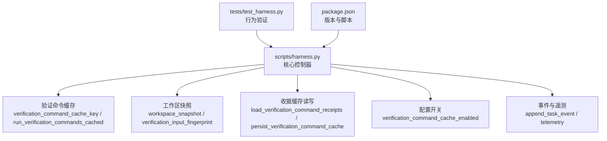
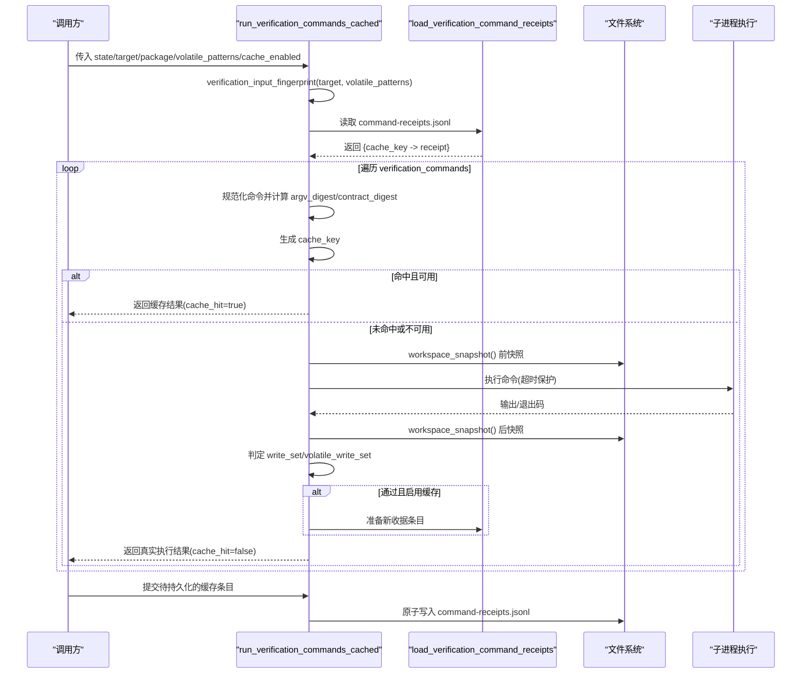
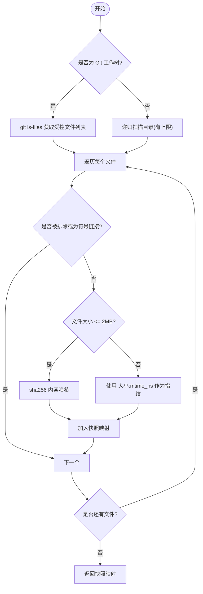
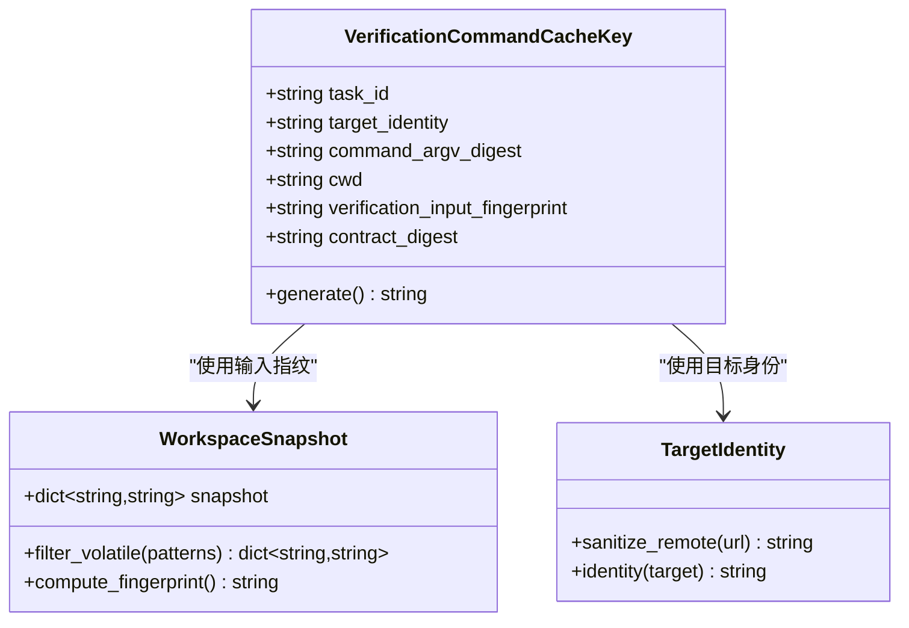
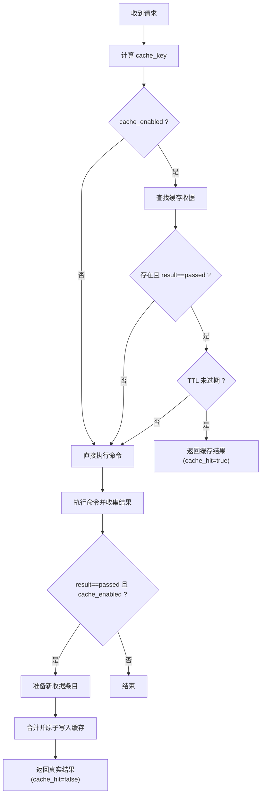
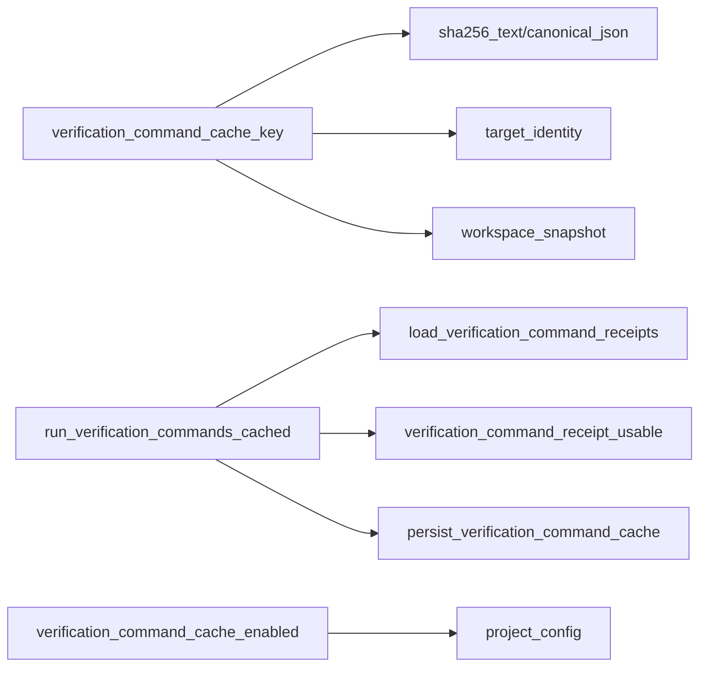

# 命令缓存机制

<cite>
**本文引用的文件**   
- [harness.py](file://scripts/harness.py)
- [test_harness.py](file://tests/test_harness.py)
- [package.json](file://package.json)
</cite>

## 目录
1. [简介](#简介)
2. [项目结构](#项目结构)
3. [核心组件](#核心组件)
4. [架构总览](#架构总览)
5. [详细组件分析](#详细组件分析)
6. [依赖关系分析](#依赖关系分析)
7. [性能考虑](#性能考虑)
8. [故障排除指南](#故障排除指南)
9. [结论](#结论)
10. [附录](#附录)

## 简介
本文件系统性阐述 Docs Harness 的命令缓存机制，聚焦“验证命令”的缓存策略与实现。内容涵盖：
- 输入指纹计算算法（工作区快照、环境变量/平台信息、配置参数）
- 缓存键生成规则（任务标识、目标身份、命令参数摘要、工作目录、输入指纹、契约摘要）
- 缓存命中策略（精确匹配、TTL 过期校验、降级执行）
- 缓存存储结构（JSONL 收据索引、原子写入、元数据字段）
- 性能优化（预热、批量持久化、内存管理）
- 调试与排障（事件追踪、遥测指标、常见错误码）
- 一致性与并发控制（状态锁、事务式写入、幂等更新）

## 项目结构
本项目为单脚本控制器（Python），核心逻辑集中在 scripts/harness.py；测试位于 tests/test_harness.py；包元数据在 package.json。命令缓存相关能力由若干函数协同完成：指纹计算、键生成、收据加载/持久化、执行流程封装、配置开关与遥测统计。

**图表来源**
- [harness.py:5746-5916](file://scripts/harness.py#L5746-L5916)
- [harness.py:1112-1135](file://scripts/harness.py#L1112-L1135)
- [harness.py:1188-1199](file://scripts/harness.py#L1188-L1199)
- [harness.py:1031-1070](file://scripts/harness.py#L1031-L1070)
- [test_harness.py:3142-3459](file://tests/test_harness.py#L3142-L3459)
- [package.json:1-23](file://package.json#L1-L23)

**章节来源**
- [harness.py:5746-5916](file://scripts/harness.py#L5746-L5916)
- [harness.py:1112-1135](file://scripts/harness.py#L1112-L1135)
- [harness.py:1188-1199](file://scripts/harness.py#L1188-L1199)
- [harness.py:1031-1070](file://scripts/harness.py#L1031-L1070)
- [test_harness.py:3142-3459](file://tests/test_harness.py#L3142-L3459)
- [package.json:1-23](file://package.json#L1-L23)

## 核心组件
- 输入指纹计算
  - 工作区快照：遍历受控路径，按文件哈希或大文件元信息生成指纹，过滤 volatile 项与运行时目录。
  - 环境指纹：记录 Python 版本、平台、可执行路径，用于区分运行环境差异。
  - 配置参数：从项目配置读取 verification.* 开关与模式，影响缓存行为。
- 缓存键生成
  - 基于 task_id、target_identity、command_argv_digest、cwd、verification_input_fingerprint、contract_digest 组合 SHA-256。
- 命中策略
  - 精确匹配：cache_key 完全一致且 receipt.result == "passed"。
  - TTL 校验：cached_at + ttl 未过期方可复用。
  - 降级策略：当 cache_enabled 为 False 时，跳过缓存直接执行；失败不污染既有索引。
- 存储结构
  - JSONL 收据文件：artifacts/verification/command-receipts.jsonl，按 key 覆盖写入最新条目。
  - 元数据：包含 schema_version、task_id、target_identity、command_argv_digest、cwd、input fingerprint、contract_digest、produces、exit_code、output digest、时间戳、ttl、result、cached_at。
- 持久化
  - 原子写入：先写临时文件再替换，保证一致性。
  - 合并策略：读入现有索引，覆盖相同 key，再整体重写。

**章节来源**
- [harness.py:1112-1135](file://scripts/harness.py#L1112-L1135)
- [harness.py:1236-1241](file://scripts/harness.py#L1236-L1241)
- [harness.py:1188-1199](file://scripts/harness.py#L1188-L1199)
- [harness.py:5746-5766](file://scripts/harness.py#L5746-L5766)
- [harness.py:5769-5792](file://scripts/harness.py#L5769-L5792)
- [harness.py:5795-5904](file://scripts/harness.py#L5795-L5904)
- [harness.py:5907-5916](file://scripts/harness.py#L5907-L5916)

## 架构总览
下图展示一次验证命令执行的完整流程，包括缓存键生成、命中判断、执行与结果持久化。

**图表来源**
- [harness.py:5795-5904](file://scripts/harness.py#L5795-L5904)
- [harness.py:5769-5792](file://scripts/harness.py#L5769-L5792)
- [harness.py:5907-5916](file://scripts/harness.py#L5907-L5916)
- [harness.py:1112-1135](file://scripts/harness.py#L1112-L1135)

## 详细组件分析

### 输入指纹计算算法
- 工作区快照
  - 优先使用 Git ls-files 列出受控文件；非 Git 工作区回退到递归扫描，限制文件数量阈值。
  - 小文件按 sha256 内容哈希；大文件以“大小:修改时间纳秒”作为轻量指纹。
  - 过滤 .git、node_modules、.venv 以及 .docs-harness/runs、quality-ledger、knowledge、background 等运行时目录。
  - 支持用户自定义 volatile 模式，忽略测试产物、覆盖率文件等不稳定输出。
- 环境指纹
  - 记录 Python 版本、平台、可执行路径，确保不同环境下的缓存隔离。
- 配置参数
  - verification.command_cache_enabled 控制是否启用缓存；默认开启。
  - verification.volatile_paths 定义需忽略的 volatile 路径模式。

**图表来源**
- [harness.py:1112-1135](file://scripts/harness.py#L1112-L1135)
- [harness.py:1236-1241](file://scripts/harness.py#L1236-L1241)
- [harness.py:1178-1185](file://scripts/harness.py#L1178-L1185)

**章节来源**
- [harness.py:1112-1135](file://scripts/harness.py#L1112-L1135)
- [harness.py:1236-1241](file://scripts/harness.py#L1236-L1241)
- [harness.py:1178-1185](file://scripts/harness.py#L1178-L1185)

### 缓存键生成规则
- 键组成字段
  - task_id：任务唯一标识
  - target_identity：目标仓库/本地路径的身份指纹（含远端 URL 脱敏）
  - command_argv_digest：命令参数的标准化 JSON 的 sha256
  - cwd：当前工作目录绝对路径
  - verification_input_fingerprint：工作区快照指纹（已过滤 volatile）
  - contract_digest：原始 verification spec 的标准化 JSON 的 sha256
- 版本兼容性
  - 通过 contract_digest 捕获 spec 变更，避免旧版 spec 与新指纹混用。
  - target_identity 对远端 URL 进行脱敏（去除凭据、查询串），保证跨凭据访问的一致性。
- 依赖关系分析
  - 通过 verification_input_fingerprint 间接纳入所有受控文件的依赖变化。
  - 若存在外部依赖（如 Git LFS/Submodule），在 git_preflight_contract 中记录可用性，但不直接参与命令缓存键（命令级缓存关注工作区与命令本身）。

**图表来源**
- [harness.py:5746-5766](file://scripts/harness.py#L5746-L5766)
- [harness.py:1112-1135](file://scripts/harness.py#L1112-L1135)
- [harness.py:585-609](file://scripts/harness.py#L585-L609)

**章节来源**
- [harness.py:5746-5766](file://scripts/harness.py#L5746-L5766)
- [harness.py:1112-1135](file://scripts/harness.py#L1112-L1135)
- [harness.py:585-609](file://scripts/harness.py#L585-L609)

### 缓存命中策略
- 精确匹配
  - 同一 cache_key 对应一条收据；读取时按顺序覆盖，取最后一条为准。
- TTL 校验
  - 仅当 result == "passed" 且 cached_at + ttl 未过期才视为可用。
- 降级策略
  - 当 verification_command_cache_enabled 为 False 时，跳过缓存读取与写入，逐条真实执行。
  - 写入失败不影响既有索引（原子写入+合并策略）。

**图表来源**
- [harness.py:5795-5904](file://scripts/harness.py#L5795-L5904)
- [harness.py:5769-5792](file://scripts/harness.py#L5769-L5792)
- [harness.py:1188-1199](file://scripts/harness.py#L1188-L1199)

**章节来源**
- [harness.py:5795-5904](file://scripts/harness.py#L5795-L5904)
- [harness.py:5769-5792](file://scripts/harness.py#L5769-L5792)
- [harness.py:1188-1199](file://scripts/harness.py#L1188-L1199)

### 缓存存储结构与元数据管理
- 存储位置
  - artifacts/verification/command-receipts.jsonl，每条一行 JSON。
- 元数据字段
  - schema_version、cache_key、task_id、target_identity、command_argv_digest、cwd、verification_input_fingerprint、contract_digest、produces、exit_code、output_or_artifact_digest、started_at、ended_at、ttl、result、cached_at。
- 过期策略
  - 基于 cached_at 与 ttl 计算年龄，超过则失效。
- 原子写入
  - 先写临时文件，fsync 后 os.replace，保证一致性。
- 合并策略
  - 读取现有索引，按 cache_key 覆盖最新条目，再整体重写文件。

**章节来源**
- [harness.py:5769-5792](file://scripts/harness.py#L5769-L5792)
- [harness.py:5907-5916](file://scripts/harness.py#L5907-L5916)

### 并发访问控制与一致性保证
- 状态锁
  - 使用 .lock 文件与 O_CREAT|O_EXCL 创建锁，防止并发更新。
  - 锁超时会话检测（>5 分钟视为陈旧锁，需人工清理）。
- 幂等更新
  - 收据索引按 key 覆盖，重复写入不会破坏一致性。
- 事件追踪
  - append_task_event 记录 context_cache_hit、context_load_count 等指标，便于审计。

**章节来源**
- [harness.py:1008-1028](file://scripts/harness.py#L1008-L1028)
- [harness.py:1031-1070](file://scripts/harness.py#L1031-L1070)

### 性能优化技巧
- 缓存预热
  - 首次执行后将通过收据写入缓存，后续相同 key 直接命中。
  - 可通过批量验证命令一次性预热多个 key。
- 批量操作
  - run_verification_commands_cached 内部循环处理多条命令，减少 IO 开销。
- 内存管理
  - 收据索引按需加载，仅在需要时合并写入；避免全量常驻内存。
- 快照优化
  - 大文件采用元信息指纹，降低 I/O 压力；限制非 Git 工作区扫描上限。

**章节来源**
- [harness.py:5795-5904](file://scripts/harness.py#L5795-L5904)
- [harness.py:1112-1135](file://scripts/harness.py#L1112-L1135)

## 依赖关系分析
- 模块内依赖
  - verification_command_cache_key 依赖 sha256_text、canonical_json、target_identity、workspace_snapshot。
  - run_verification_commands_cached 依赖 load_verification_command_receipts、verification_command_receipt_usable、persist_verification_command_cache。
  - 配置开关依赖 project_config 与 verification 字段解析。
- 外部依赖
  - Git 命令用于工作区快照与目标身份识别。
  - 子进程执行验证命令，具备超时保护。

**图表来源**
- [harness.py:5746-5766](file://scripts/harness.py#L5746-L5766)
- [harness.py:5795-5904](file://scripts/harness.py#L5795-L5904)
- [harness.py:1188-1199](file://scripts/harness.py#L1188-L1199)

**章节来源**
- [harness.py:5746-5766](file://scripts/harness.py#L5746-L5766)
- [harness.py:5795-5904](file://scripts/harness.py#L5795-L5904)
- [harness.py:1188-1199](file://scripts/harness.py#L1188-L1199)

## 性能考虑
- 建议开启 verification.command_cache_enabled 以获得最佳性能。
- 合理设置 verification.volatile_paths，避免将不稳定产物纳入指纹导致缓存抖动。
- 对于高频短命令，缓存命中率显著提升；长耗时命令应配合超时与日志。
- 监控 command_cache_hit_count 与 command_executed_count，评估缓存效果。

[本节为通用指导，无需特定文件引用]

## 故障排除指南
- 常见问题
  - 缓存未命中：检查 cache_key 是否一致（命令参数、cwd、输入指纹、契约摘要）。
  - TTL 过期：确认 cached_at 与 ttl 设置是否合理。
  - 写入失败：查看 artifacts/verification/command-receipts.jsonl 原子写入是否成功。
- 调试工具
  - 事件追踪：events.jsonl 中的 context_cache_hit、context_load_count 等字段。
  - 遥测指标：command_cache_hit_count、command_executed_count。
- 常见错误码
  - invalid_project_config：verification 配置非法。
  - unsafe_verification_command：验证命令不在白名单。
  - stale_lock：状态锁陈旧，需人工清理。

**章节来源**
- [harness.py:1031-1070](file://scripts/harness.py#L1031-L1070)
- [harness.py:1188-1199](file://scripts/harness.py#L1188-L1199)
- [harness.py:1008-1028](file://scripts/harness.py#L1008-L1028)

## 结论
Docs Harness 的命令缓存机制通过严谨的指纹计算、稳定的键生成、严格的命中策略与可靠的存储结构，实现了高效、安全、可审计的验证命令执行加速。结合配置开关、事件追踪与遥测指标，可在复杂工程环境中稳定运行并提供良好的性能与可维护性。

[本节为总结，无需特定文件引用]

## 附录
- 关键函数路径参考
  - 输入指纹：verification_input_fingerprint
  - 缓存键：verification_command_cache_key
  - 缓存读取：load_verification_command_receipts
  - 缓存写入：persist_verification_command_cache
  - 执行流程：run_verification_commands_cached
  - 配置开关：verification_command_cache_enabled
  - 工作区快照：workspace_snapshot
  - 目标身份：target_identity

**章节来源**
- [harness.py:5735-5766](file://scripts/harness.py#L5735-L5766)
- [harness.py:5769-5916](file://scripts/harness.py#L5769-L5916)
- [harness.py:1112-1135](file://scripts/harness.py#L1112-L1135)
- [harness.py:585-609](file://scripts/harness.py#L585-L609)