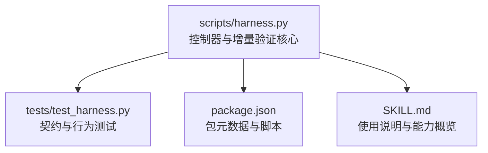
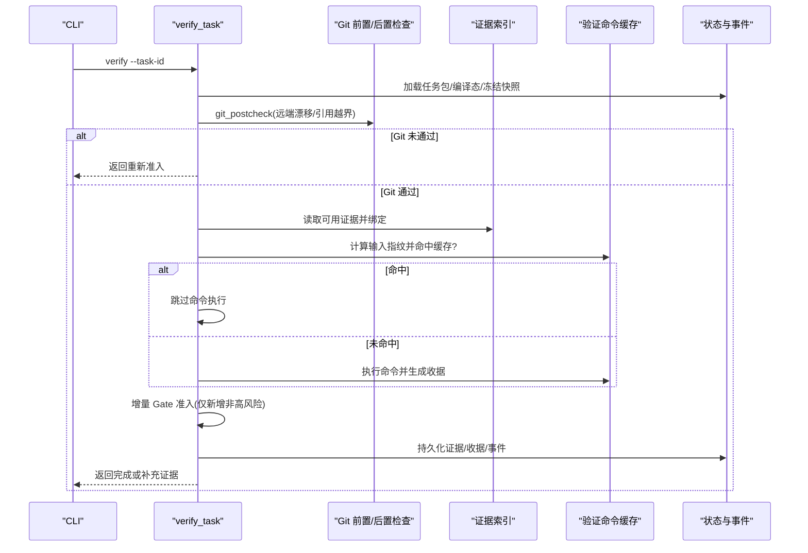
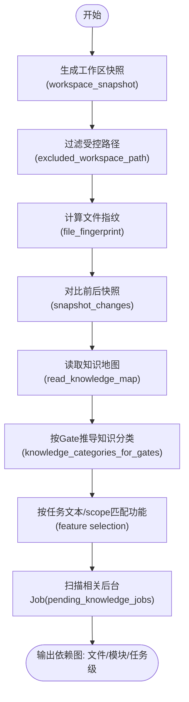
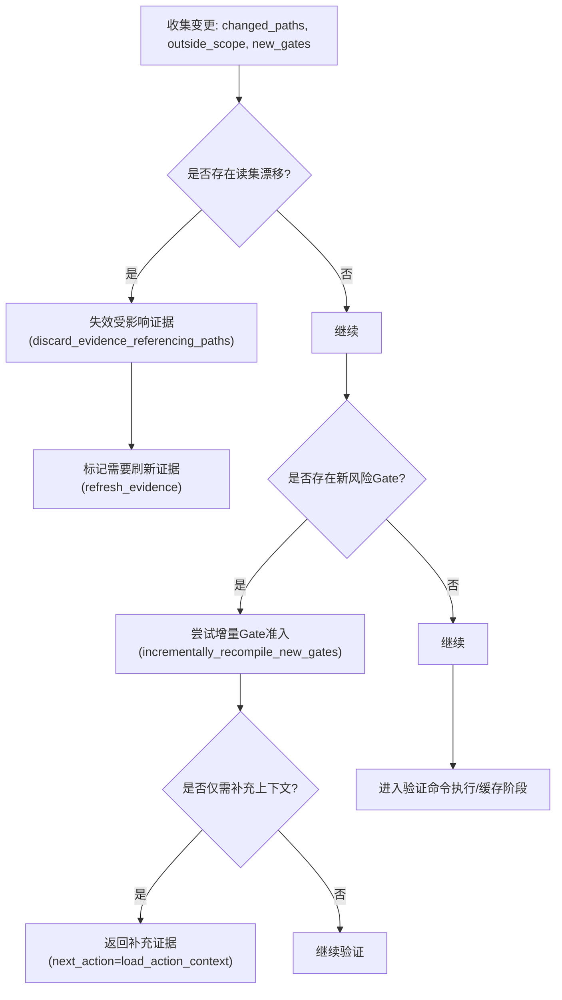
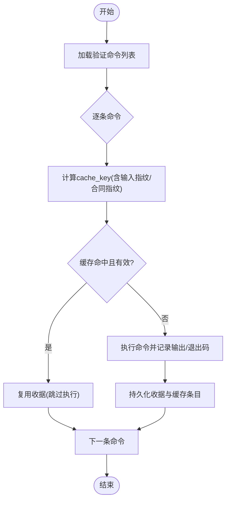
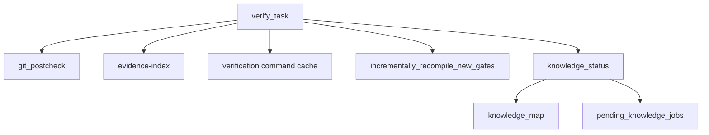

# 增量验证逻辑

<cite>
**本文引用的文件**   
- [scripts/harness.py](file://scripts/harness.py)
- [tests/test_harness.py](file://tests/test_harness.py)
- [package.json](file://package.json)
- [SKILL.md](file://SKILL.md)
</cite>

## 目录
1. [简介](#简介)
2. [项目结构](#项目结构)
3. [核心组件](#核心组件)
4. [架构总览](#架构总览)
5. [详细组件分析](#详细组件分析)
6. [依赖关系分析](#依赖关系分析)
7. [性能考量](#性能考量)
8. [故障排查指南](#故障排查指南)
9. [结论](#结论)
10. [附录](#附录)

## 简介
本文件系统化阐述 Docs Harness 的增量验证逻辑，覆盖以下关键主题：
- 依赖图构建算法（文件级、模块级、任务级）
- 变更影响评估机制（差异检测、传播分析、影响范围计算）
- 选择性执行策略（优先级排序、并行度控制、资源调度）
- 准确性保证（边界条件处理、误报消除）
- 配置选项（忽略规则、自定义依赖、性能调优）
- 监控指标与性能分析方法
- 与全量验证的切换策略与回滚机制

该文档面向工程团队与平台使用者，既提供代码级细节，也给出可操作的实践建议。

## 项目结构
Docs Harness 的核心实现位于 scripts/harness.py，测试用例位于 tests/test_harness.py，包元信息与脚本入口在 package.json，使用与能力说明在 SKILL.md。

图表来源
- [scripts/harness.py:1-120](file://scripts/harness.py#L1-L120)
- [tests/test_harness.py:1-800](file://tests/test_harness.py#L1-L800)
- [package.json:1-23](file://package.json#L1-L23)
- [SKILL.md:1-105](file://SKILL.md#L1-L105)

章节来源
- [scripts/harness.py:1-120](file://scripts/harness.py#L1-L120)
- [package.json:1-23](file://package.json#L1-L23)
- [SKILL.md:1-105](file://SKILL.md#L1-L105)

## 核心组件
- 工作区快照与差异：workspace_snapshot、snapshot_changes
- Git 前置/后置检查：git_preflight_contract、git_postcheck
- 证据索引与复用：index_evidence、discard_evidence_referencing_paths
- 验证命令缓存与执行：run_verification_commands_cached、verification_command_cache_key
- 增量 Gate 准入：incrementally_recompile_new_gates
- 知识状态与依赖：knowledge_status、knowledge_ready_for_incremental、pending_knowledge_jobs
- 交付层推导：build_delivery_layers

章节来源
- [scripts/harness.py:1115-1138](file://scripts/harness.py#L1115-L1138)
- [scripts/harness.py:1141-1143](file://scripts/harness.py#L1141-L1143)
- [scripts/harness.py:680-794](file://scripts/harness.py#L680-L794)
- [scripts/harness.py:796-878](file://scripts/harness.py#L796-L878)
- [scripts/harness.py:5501-5506](file://scripts/harness.py#L5501-L5506)
- [scripts/harness.py:5509-5527](file://scripts/harness.py#L5509-L5527)
- [scripts/harness.py:5953-6062](file://scripts/harness.py#L5953-L6062)
- [scripts/harness.py:5530-5670](file://scripts/harness.py#L5530-L5670)
- [scripts/harness.py:1722-1761](file://scripts/harness.py#L1722-L1761)
- [scripts/harness.py:1707-1719](file://scripts/harness.py#L1707-L1719)
- [scripts/harness.py:1841-1871](file://scripts/harness.py#L1841-L1871)
- [scripts/harness.py:6228-6299](file://scripts/harness.py#L6228-L6299)

## 架构总览
增量验证围绕“任务包 + 证据 + 验证命令 + Git 状态”的闭环展开，通过快照与指纹确保幂等与可追溯，通过增量 Gate 准入减少重复流程。

图表来源
- [scripts/harness.py:6459-6934](file://scripts/harness.py#L6459-L6934)
- [scripts/harness.py:796-878](file://scripts/harness.py#L796-L878)
- [scripts/harness.py:5501-5506](file://scripts/harness.py#L5501-L5506)
- [scripts/harness.py:5953-6062](file://scripts/harness.py#L5953-L6062)
- [scripts/harness.py:5530-5670](file://scripts/harness.py#L5530-L5670)

## 详细组件分析

### 依赖图构建算法
- 文件级依赖
  - 基于 workspace_snapshot 对受控路径集合进行指纹化，结合 snapshot_changes 识别变更文件集。
  - 通过 excluded_workspace_path 排除 .git、node_modules、.venv 以及 .docs-harness 下的运行时目录，避免噪声。
- 模块级依赖
  - 通过 knowledge_map 解析 feature 维度，按 gate 类别选择所需知识分类（product/development/testing/design），从而限定上下文与证据范围。
- 任务级依赖
  - 通过 pending_knowledge_jobs 扫描后台 Job，识别与当前 feature_ids 相关的待完成任务，作为知识同步的前置依赖。

图表来源
- [scripts/harness.py:1115-1138](file://scripts/harness.py#L1115-L1138)
- [scripts/harness.py:1076-1086](file://scripts/harness.py#L1076-L1086)
- [scripts/harness.py:1594-1598](file://scripts/harness.py#L1594-L1598)
- [scripts/harness.py:1834-1838](file://scripts/harness.py#L1834-L1838)
- [scripts/harness.py:1939-2042](file://scripts/harness.py#L1939-L2042)
- [scripts/harness.py:1841-1871](file://scripts/harness.py#L1841-L1871)

章节来源
- [scripts/harness.py:1115-1138](file://scripts/harness.py#L1115-L1138)
- [scripts/harness.py:1076-1086](file://scripts/harness.py#L1076-L1086)
- [scripts/harness.py:1594-1598](file://scripts/harness.py#L1594-L1598)
- [scripts/harness.py:1834-1838](file://scripts/harness.py#L1834-L1838)
- [scripts/harness.py:1939-2042](file://scripts/harness.py#L1939-L2042)
- [scripts/harness.py:1841-1871](file://scripts/harness.py#L1841-L1871)

### 变更影响评估机制
- 差异检测
  - 工作区快照指纹对比定位 changed_paths；Git 前置/后置检查锁定 ref 变化与远端漂移。
- 传播分析
  - 通过 evidence-index 的 read_set 漂移触发局部失效（discard_evidence_referencing_paths），避免误用过期证据。
- 影响范围计算
  - 结合 write_scope、allowed_scope 与 auto-attribution 判定未归因写入是否落入授权范围；若越界则阻断并提示重新准入。

图表来源
- [scripts/harness.py:5509-5527](file://scripts/harness.py#L5509-L5527)
- [scripts/harness.py:5530-5670](file://scripts/harness.py#L5530-L5670)
- [scripts/harness.py:6459-6934](file://scripts/harness.py#L6459-L6934)

章节来源
- [scripts/harness.py:5509-5527](file://scripts/harness.py#L5509-L5527)
- [scripts/harness.py:5530-5670](file://scripts/harness.py#L5530-L5670)
- [scripts/harness.py:6459-6934](file://scripts/harness.py#L6459-L6934)

### 选择性执行策略
- 优先级排序
  - 验证命令按声明顺序执行；命中缓存的命令直接复用结果，降低开销。
- 并行度控制
  - 当前实现为串行执行验证命令；可通过关闭 command_cache_enabled 强制真实执行以观察真实耗时。
- 资源调度
  - 通过 state_lock 保证同一任务的状态更新互斥；事件追加采用原子写入，避免并发竞争。

图表来源
- [scripts/harness.py:5953-6062](file://scripts/harness.py#L5953-L6062)
- [scripts/harness.py:6065-6073](file://scripts/harness.py#L6065-L6073)
- [scripts/harness.py:1011-1031](file://scripts/harness.py#L1011-L1031)

章节来源
- [scripts/harness.py:5953-6062](file://scripts/harness.py#L5953-L6062)
- [scripts/harness.py:6065-6073](file://scripts/harness.py#L6065-L6073)
- [scripts/harness.py:1011-1031](file://scripts/harness.py#L1011-L1031)

### 增量验证的准确性保证
- 边界条件处理
  - Git 前置检查限制 fast-forward、删除阈值、LFS/Submodule 可用性；后置检查校验 ref 范围与远端目标不变。
  - 工作区快照对大文件采用 size+mtime 指纹，避免 IO 瓶颈；非 Git 工作区有文件数上限保护。
- 误报消除
  - volatile_verification_path 过滤测试/缓存临时产物，避免将无关写入视为业务变更。
  - 自动归因（auto_attribution）仅在 write_scope 内且稳定合同下生效，防止越界写入被误接受。

章节来源
- [scripts/harness.py:680-794](file://scripts/harness.py#L680-L794)
- [scripts/harness.py:796-878](file://scripts/harness.py#L796-L878)
- [scripts/harness.py:1115-1138](file://scripts/harness.py#L1115-L1138)
- [scripts/harness.py:1219-1236](file://scripts/harness.py#L1219-L1236)
- [scripts/harness.py:6459-6934](file://scripts/harness.py#L6459-L6934)

### 增量验证的配置选项
- 忽略规则
  - verification.volatile_paths：允许的工作区内 glob 白名单，需带固定根目录，禁止危险字符与越界路径。
  - rules_root：指定规则目录位置，必须为项目内相对路径且安全。
- 自定义依赖
  - knowledge-map.json：定义 feature 文档、共享引用、scope_patterns、dependencies。
- 性能调优
  - verification.command_cache_enabled：整体开关验证命令缓存。
  - verification.auto_attribute_in_scope：是否启用 write_scope 内自动归因。

章节来源
- [scripts/harness.py:1153-1178](file://scripts/harness.py#L1153-L1178)
- [scripts/harness.py:1181-1188](file://scripts/harness.py#L1181-L1188)
- [scripts/harness.py:1191-1202](file://scripts/harness.py#L1191-L1202)
- [scripts/harness.py:1205-1216](file://scripts/harness.py#L1205-L1216)
- [scripts/harness.py:2049-2064](file://scripts/harness.py#L2049-L2064)
- [scripts/harness.py:1529-1591](file://scripts/harness.py#L1529-L1591)

### 监控指标与性能分析方法
- 事件与统计
  - append_task_event 记录 context_load_count、readmission_count、evidence_round_count、host_receipt_count、business_action_count 等。
- 验证命令缓存命中率
  - run_verification_commands_cached 返回 cache_hit 计数，便于评估缓存有效性。
- 交付层覆盖率
  - build_delivery_layers 按意图与成功标准推导各层期望与已验证证据类型，用于度量验收完备性。

章节来源
- [scripts/harness.py:1034-1073](file://scripts/harness.py#L1034-L1073)
- [scripts/harness.py:5953-6062](file://scripts/harness.py#L5953-L6062)
- [scripts/harness.py:6228-6299](file://scripts/harness.py#L6228-L6299)

### 与全量验证的切换策略与回滚机制
- 切换策略
  - 当检测到 plan_contract_drift、authorization_contract_drift、read_set_drift、new_risk_gate 等情况时，控制器会要求重新准入（rerun_harness_for_readmission）。
  - 对于仅新增非高风险 Gate 且合同稳定的场景，支持增量准入（incrementally_recompile_new_gates），避免全量重跑。
- 回滚机制
  - 存在活动 v2 任务时，project rollback-check 必须阻断回滚；v1 在途任务只允许读取，迁移后重新准入。
  - 证据与收据采用受管副本保存，原始文件删除不影响准入；失败关闭策略确保一致性。

章节来源
- [scripts/harness.py:6459-6934](file://scripts/harness.py#L6459-L6934)
- [scripts/harness.py:5530-5670](file://scripts/harness.py#L5530-L5670)
- [SKILL.md:1-105](file://SKILL.md#L1-L105)

## 依赖关系分析
- 组件耦合
  - verify_task 依赖 git_postcheck、evidence-index、verification command cache、incrementally_recompile_new_gates。
  - 知识子系统依赖 knowledge_status、knowledge_map、pending_knowledge_jobs。
- 外部依赖
  - Git 子进程调用（ls-files、diff、lfs、submodule）。
  - 文件系统原子写入与锁（atomic_write_text、state_lock）。

图表来源
- [scripts/harness.py:6459-6934](file://scripts/harness.py#L6459-L6934)
- [scripts/harness.py:796-878](file://scripts/harness.py#L796-L878)
- [scripts/harness.py:5501-5506](file://scripts/harness.py#L5501-L5506)
- [scripts/harness.py:5953-6062](file://scripts/harness.py#L5953-L6062)
- [scripts/harness.py:5530-5670](file://scripts/harness.py#L5530-L5670)
- [scripts/harness.py:1722-1761](file://scripts/harness.py#L1722-L1761)
- [scripts/harness.py:1594-1598](file://scripts/harness.py#L1594-L1598)
- [scripts/harness.py:1841-1871](file://scripts/harness.py#L1841-L1871)

章节来源
- [scripts/harness.py:6459-6934](file://scripts/harness.py#L6459-L6934)
- [scripts/harness.py:796-878](file://scripts/harness.py#L796-L878)
- [scripts/harness.py:5501-5506](file://scripts/harness.py#L5501-L5506)
- [scripts/harness.py:5953-6062](file://scripts/harness.py#L5953-L6062)
- [scripts/harness.py:5530-5670](file://scripts/harness.py#L5530-L5670)
- [scripts/harness.py:1722-1761](file://scripts/harness.py#L1722-L1761)
- [scripts/harness.py:1594-1598](file://scripts/harness.py#L1594-L1598)
- [scripts/harness.py:1841-1871](file://scripts/harness.py#L1841-L1871)

## 性能考量
- 快照优化
  - 大文件采用 size+mtime 指纹，避免全量哈希；非 Git 工作区限制文件数量上限。
- 缓存策略
  - 验证命令缓存键包含 task_id、target_identity、command_argv_digest、cwd、input_fingerprint、contract_digest，确保高区分度。
- 事件审计
  - 事件追加原子写入，避免并发写冲突；统计字段便于性能分析。

章节来源
- [scripts/harness.py:1115-1138](file://scripts/harness.py#L1115-L1138)
- [scripts/harness.py:5904-5924](file://scripts/harness.py#L5904-L5924)
- [scripts/harness.py:1034-1073](file://scripts/harness.py#L1034-L1073)

## 故障排查指南
- 常见问题
  - Git 前置/后置检查失败：检查远端引用、fast-forward、LFS/Submodule 可用性。
  - 证据失效：read_set 漂移导致部分证据被丢弃，需刷新证据。
  - 验证命令缓存未命中：确认输入指纹与合同指纹一致。
- 诊断步骤
  - 查看 events.jsonl 中的 reason_code 与统计字段。
  - 检查 evidence-index.json 中证据来源指纹与受管副本一致性。
  - 使用 project delivery summary 了解知识状态与交付就绪情况。

章节来源
- [scripts/harness.py:680-794](file://scripts/harness.py#L680-L794)
- [scripts/harness.py:796-878](file://scripts/harness.py#L796-L878)
- [scripts/harness.py:5509-5527](file://scripts/harness.py#L5509-L5527)
- [scripts/harness.py:1034-1073](file://scripts/harness.py#L1034-L1073)
- [scripts/harness.py:2168-2211](file://scripts/harness.py#L2168-L2211)

## 结论
Docs Harness 的增量验证通过严谨的快照与指纹机制、Git 前置/后置约束、证据索引与命令缓存、以及增量 Gate 准入，实现了高效、准确、可审计的验证流程。配合配置项与监控指标，可在保证正确性的前提下最大化性能与可维护性。

## 附录
- 契约与行为测试参考：tests/test_harness.py 覆盖了 Git fetch/sync、证据复用、增量 Gate 准入、命令缓存失效等关键场景。
- 使用与能力概览：SKILL.md 描述了 run/verify 流程、后台治理、质量账本与按需读取要点。

章节来源
- [tests/test_harness.py:1-800](file://tests/test_harness.py#L1-L800)
- [SKILL.md:1-105](file://SKILL.md#L1-L105)