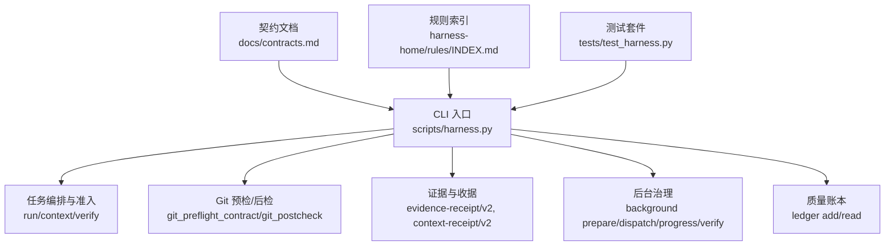
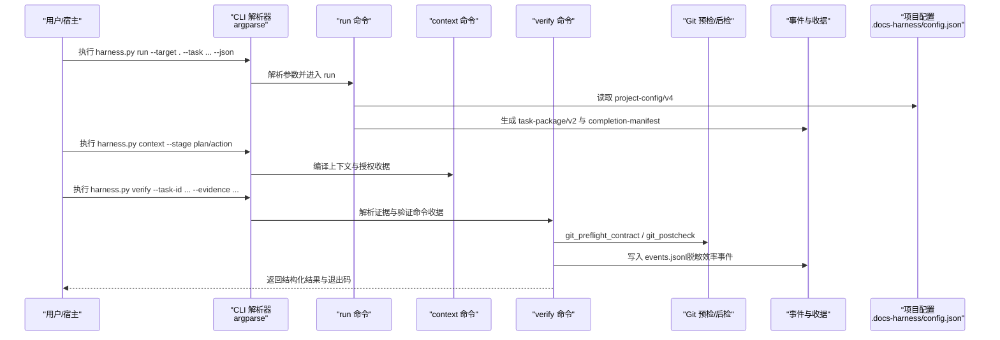
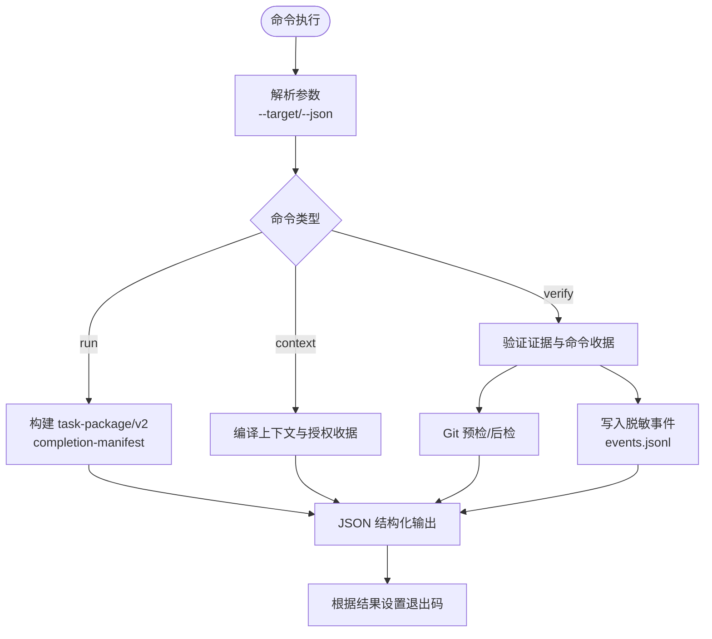
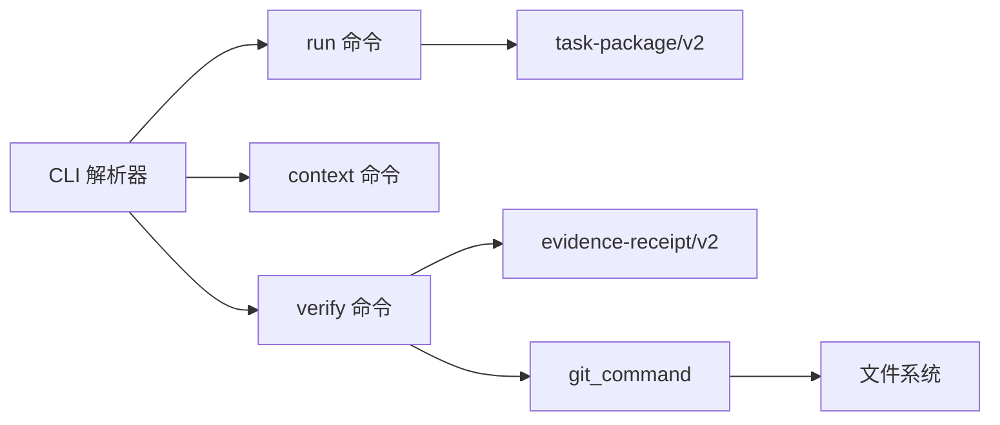

# 调试工具

<cite>
**本文引用的文件**   
- [scripts/harness.py](file://scripts/harness.py)
- [tests/test_harness.py](file://tests/test_harness.py)
- [package.json](file://package.json)
- [SKILL.md](file://SKILL.md)
- [docs/contracts.md](file://docs/contracts.md)
- [harness-home/rules/INDEX.md](file://harness-home/rules/INDEX.md)
</cite>

## 目录
1. [简介](#简介)
2. [项目结构](#项目结构)
3. [核心组件](#核心组件)
4. [架构总览](#架构总览)
5. [详细组件分析](#详细组件分析)
6. [依赖关系分析](#依赖关系分析)
7. [性能考虑](#性能考虑)
8. [故障排查指南](#故障排查指南)
9. [结论](#结论)
10. [附录](#附录)

## 简介
本文件面向 Docs Harness 的“验证命令”与“调试工具”使用，聚焦以下目标：
- 日志系统架构：级别、格式规范、输出目标配置
- 调试模式启用方法：命令行参数、环境变量、配置文件
- 断点调试支持：IDE 集成、远程调试、交互式调试
- 性能分析工具：CPU profiling、内存分析、I/O 监控
- 问题诊断流程：常见错误模式、日志分析、根因定位
- 调试最佳实践与安全考虑
- 调试信息收集方法与故障报告模板

Docs Harness 是一个独立任务控制器，强调意图优先、证据可复用、失败关闭。其 CLI 以 JSON 结构化输出为主，便于自动化与调试；同时提供丰富的退出码与原因码用于快速定位问题。

## 项目结构
- scripts/harness.py：主控制器脚本，包含 CLI 解析、任务编排、Git 预检/后检、证据与上下文收据、后台治理、质量账本等全部核心逻辑
- tests/test_harness.py：单元测试与契约测试，覆盖 run/verify/background/knowledge/project/self-test 等关键路径
- package.json：包元数据与脚本入口（self-test、test）
- SKILL.md：技能说明与常用命令速查
- docs/contracts.md：v1.6.6 合同定义，包括 task-package/v2、evidence-receipt/v2、verification-command-receipt/v1、事件脱敏、退出码等
- harness-home/rules/INDEX.md：生效规则索引与激活条件

图表来源
- [scripts/harness.py:10360-10362](file://scripts/harness.py#L10360-L10362)
- [docs/contracts.md:1-372](file://docs/contracts.md#L1-L372)
- [harness-home/rules/INDEX.md:1-41](file://harness-home/rules/INDEX.md#L1-L41)
- [tests/test_harness.py:59-87](file://tests/test_harness.py#L59-L87)

章节来源
- [scripts/harness.py:10355-10362](file://scripts/harness.py#L10355-L10362)
- [package.json:17-21](file://package.json#L17-L21)
- [SKILL.md:16-56](file://SKILL.md#L16-L56)
- [docs/contracts.md:1-372](file://docs/contracts.md#L1-L372)
- [harness-home/rules/INDEX.md:1-41](file://harness-home/rules/INDEX.md#L1-L41)

## 核心组件
- CLI 与参数解析：统一通过 argparse 构建子命令，--target 指定项目根，--json 输出结构化结果
- 任务生命周期：run → context → verify，配合 completion-manifest 与 evidence-receipt/v2
- Git 安全边界：git_preflight_contract 与 git_postcheck 确保 fetch/sync 范围受控、远端漂移可审计
- 证据与上下文收据：evidence-receipt/v2、context-receipt/v2、authorization-receipt/v2 绑定 task/target/package fingerprint
- 后台治理：background prepare/dispatch/progress/verify，支持 direct/goal/phased 路线
- 质量账本：手动记录质量经验，按任务快照隔离
- 自检与契约校验：self-test 与 evals 用例保障版本一致性

章节来源
- [scripts/harness.py:10355-10362](file://scripts/harness.py#L10355-L10362)
- [docs/contracts.md:9-220](file://docs/contracts.md#L9-L220)
- [scripts/harness.py:680-794](file://scripts/harness.py#L680-L794)
- [scripts/harness.py:796-800](file://scripts/harness.py#L796-L800)
- [tests/test_harness.py:339-354](file://tests/test_harness.py#L339-L354)

## 架构总览
下图展示从 CLI 到核心处理链路的调用关系，以及关键数据结构与契约交互。

图表来源
- [scripts/harness.py:10360-10362](file://scripts/harness.py#L10360-L10362)
- [scripts/harness.py:680-794](file://scripts/harness.py#L680-L794)
- [docs/contracts.md:9-220](file://docs/contracts.md#L9-L220)
- [docs/contracts.md:283-301](file://docs/contracts.md#L283-L301)

## 详细组件分析

### 日志系统与调试输出
- 输出目标与格式
  - 默认结构化 JSON 输出：通过 --json 开关控制，所有命令均返回结构化对象，便于机器消费与调试
  - 事件文件：events.jsonl 仅保存脱敏效率事件字段（phase、started_at、duration_ms、reason_code、counts 等），不保存敏感内容
  - 退出码：0 成功；1 检查/完整性失败；2 输入/合同/状态无效；3 需要方案/授权/证据或 Git 交付；4 必须重新准入
- 日志级别与过滤
  - 未暴露显式日志级别开关；建议通过外部日志框架或进程级重定向捕获 stdout/stderr
  - 结构化输出已屏蔽敏感信息（如任务正文、原始工具输出、环境变量、凭证）
- 输出目标配置
  - 标准输出 JSON：--json
  - 事件文件：位于任务 Runtime 目录内（Git 项目为 <git-dir>/docs-harness/runs，非 Git 为 .docs-harness/runs）
  - 质量账本：位于 <git-dir>/docs-harness/quality-ledger 或 .docs-harness/quality-ledger

图表来源
- [scripts/harness.py:10355-10362](file://scripts/harness.py#L10355-L10362)
- [docs/contracts.md:283-301](file://docs/contracts.md#L283-L301)
- [docs/contracts.md:361-371](file://docs/contracts.md#L361-L371)

章节来源
- [scripts/harness.py:10355-10362](file://scripts/harness.py#L10355-L10362)
- [docs/contracts.md:283-301](file://docs/contracts.md#L283-L301)
- [docs/contracts.md:361-371](file://docs/contracts.md#L361-L371)

### 调试模式启用方法
- 命令行参数
  - --json：所有命令输出 JSON，便于自动化与调试
  - --target：指定项目根目录，所有路径相对该根进行约束
  - --version：查看当前版本
- 环境变量
  - 测试中设置 PYTHONDONTWRITEBYTECODE=1 避免字节码干扰
  - 其他环境敏感变量在事件与输出中脱敏，不直接暴露
- 配置文件
  - .docs-harness/config.json 中的 verification.* 影响验证行为：
    - verification.volatile_paths：追加临时副产物白名单（需带固定根目录，禁止越界与绝对路径）
    - verification.command_cache_enabled：是否启用验证命令收据缓存
    - verification.auto_attribute_in_scope：是否在 write_scope 内自动代铸 workspace_attribution 收据

章节来源
- [scripts/harness.py:10355-10362](file://scripts/harness.py#L10355-L10362)
- [tests/test_harness.py:59-87](file://tests/test_harness.py#L59-L87)
- [scripts/harness.py:1181-1215](file://scripts/harness.py#L1181-L1215)
- [docs/contracts.md:190-220](file://docs/contracts.md#L190-L220)

### 断点调试支持
- IDE 集成
  - 将 scripts/harness.py 作为运行入口，--target 指向项目根，--json 开启结构化输出
  - 建议在 run/context/verify 的关键函数处设置断点，观察 task-package、evidence-receipt、git_state_snapshot 等对象
- 远程调试
  - 通过 Python 内置调试器（如 pdb）或 IDE 远程调试功能附加到进程
  - 注意：事件与输出不包含敏感信息，但应避免在断点处打印完整环境变量或凭证
- 交互式调试
  - 可在测试用例中通过 subprocess 调用 harness.py 并捕获 stdout/stderr，结合断点逐步推进
  - 使用 self-test 与 evals 用例辅助验证契约与行为

章节来源
- [tests/test_harness.py:59-87](file://tests/test_harness.py#L59-L87)
- [scripts/harness.py:10303-10354](file://scripts/harness.py#L10303-L10354)
- [docs/contracts.md:9-220](file://docs/contracts.md#L9-L220)

### 性能分析工具
- CPU Profiling
  - 使用 cProfile 对 harness.py 入口进行采样，关注 run/context/verify 耗时热点
  - 结合 events.jsonl 的 duration_ms 字段评估阶段耗时
- 内存分析
  - 使用 memory_profiler 或 tracemalloc 跟踪大对象创建（如 task-package、evidence-index）
  - 关注 Git refs 快照与工作区指纹计算开销
- I/O 监控
  - 监控 events.jsonl、evidence-index.json、context-receipts.jsonl 的写入频率与大小
  - 验证命令收据缓存命中情况（command_cache_enabled=true 时减少重复执行）

章节来源
- [docs/contracts.md:283-301](file://docs/contracts.md#L283-L301)
- [scripts/harness.py:1181-1215](file://scripts/harness.py#L1181-L1215)

### 问题诊断流程
- 常见错误模式
  - 输入/合同/状态无效：退出码 2，检查 task-id、evidence-receipt/v2 字段、target 合法性
  - 需要方案/授权/证据：退出码 3，按 completion-manifest 要求补充 plan/evidence
  - 必须重新准入：退出码 4，检查 scope/Gate/规则指纹变化
- 日志分析
  - 查看 events.jsonl 的阶段与原因码，定位 run/context/verify 哪一阶段失败
  - 检查 git_preflight_contract 与 git_postcheck 的 blockers 与 changed_refs
- 根因定位
  - 使用 self-test 与 evals 用例复现问题
  - 通过 --json 输出对比预期契约字段，确认缺失或非法值

章节来源
- [docs/contracts.md:361-371](file://docs/contracts.md#L361-L371)
- [scripts/harness.py:680-794](file://scripts/harness.py#L680-L794)
- [tests/test_harness.py:339-354](file://tests/test_harness.py#L339-L354)

### 调试最佳实践与安全考虑
- 最佳实践
  - 始终使用 --json 输出，避免解析人类可读文本
  - 在验证命令中使用 produces 白名单，限制证据类型
  - 利用 verification.command_cache_enabled 提升重复验证性能
- 安全考虑
  - 事件与输出脱敏，不保存敏感输入与环境变量
  - Git 远端 URL 指纹前移除用户名、密码、token、查询参数与 fragment
  - 拒绝文件系统根目录或用户主目录作为 target，防止越权写入

章节来源
- [docs/contracts.md:283-301](file://docs/contracts.md#L283-L301)
- [scripts/harness.py:588-612](file://scripts/harness.py#L588-L612)
- [scripts/harness.py:535-541](file://scripts/harness.py#L535-L541)

### 调试信息收集方法与故障报告模板
- 收集方法
  - 导出 --json 输出与 events.jsonl（脱敏后）
  - 记录退出码与 reason_code
  - 复制相关契约对象（task-package/v2、evidence-receipt/v2、git_state_snapshot）
- 故障报告模板
  - 标题：[调试] 任务 ID + 命令 + 退出码
  - 环境：Python 版本、操作系统、Git 版本
  - 输入：--target、--task、--facts、--plan、--evidence 路径
  - 输出：JSON 片段（脱敏）、events.jsonl 关键行
  - 期望 vs 实际：契约字段对比
  - 根因假设：基于 reason_code 与 blockers 的分析

章节来源
- [docs/contracts.md:9-220](file://docs/contracts.md#L9-L220)
- [docs/contracts.md:283-301](file://docs/contracts.md#L283-L301)

## 依赖关系分析
- 内部依赖
  - CLI 解析依赖 argparse，命令处理器依赖契约模块（task-package/v2、evidence-receipt/v2）
  - Git 操作依赖 git_command 封装，超时与错误统一转为 HarnessError
- 外部依赖
  - Git 客户端（用于 rev-parse、ls-remote、diff、merge 等）
  - 文件系统（读写 JSON/JSONL、原子写入、指纹计算）
- 潜在循环依赖
  - 无显著循环依赖，模块职责清晰分离

图表来源
- [scripts/harness.py:10360-10362](file://scripts/harness.py#L10360-L10362)
- [scripts/harness.py:575-586](file://scripts/harness.py#L575-L586)
- [docs/contracts.md:9-220](file://docs/contracts.md#L9-L220)

章节来源
- [scripts/harness.py:10360-10362](file://scripts/harness.py#L10360-L10362)
- [scripts/harness.py:575-586](file://scripts/harness.py#L575-L586)
- [docs/contracts.md:9-220](file://docs/contracts.md#L9-L220)

## 性能考虑
- 事件脱敏与结构化输出降低 I/O 压力
- 验证命令收据缓存避免重复执行，显著提升重复验证性能
- Git 预检/后检仅在必要时执行，减少不必要的子进程调用
- 工作区快照与指纹计算可缓存，避免重复哈希

[本节为通用指导，无需特定文件引用]

## 故障排查指南
- 常见问题
  - 缺少文件或 JSON 无效：检查 --target 路径与文件权限
  - Git 预检超时或失败：确认网络连接与 Git LFS/Submodule 可用性
  - 证据收据过期或跨任务：核对 ttl、task_id、target_identity、package_fingerprint
- 定位步骤
  - 使用 self-test 验证环境
  - 查看 events.jsonl 的阶段与原因码
  - 对比 contracts.md 契约字段，确认缺失或非法值
- 恢复策略
  - 补充缺失证据或方案
  - 清理脏工作区或解决远端漂移
  - 重新准入（full_readmission）

章节来源
- [scripts/harness.py:443-446](file://scripts/harness.py#L443-L446)
- [scripts/harness.py:584-586](file://scripts/harness.py#L584-L586)
- [docs/contracts.md:190-220](file://docs/contracts.md#L190-L220)

## 结论
Docs Harness 提供了强大的调试与验证能力，通过结构化 JSON 输出、脱敏事件、严格的契约与退出码体系，使问题定位与自动化集成变得高效可靠。遵循本文档的调试实践与安全建议，可显著提升故障排查效率与系统稳定性。

[本节为总结性内容，无需特定文件引用]

## 附录
- 常用命令速查：参考 SKILL.md
- 契约定义：参考 docs/contracts.md
- 规则索引：参考 harness-home/rules/INDEX.md
- 测试用例：参考 tests/test_harness.py

章节来源
- [SKILL.md:16-56](file://SKILL.md#L16-L56)
- [docs/contracts.md:1-372](file://docs/contracts.md#L1-L372)
- [harness-home/rules/INDEX.md:1-41](file://harness-home/rules/INDEX.md#L1-L41)
- [tests/test_harness.py:339-354](file://tests/test_harness.py#L339-L354)