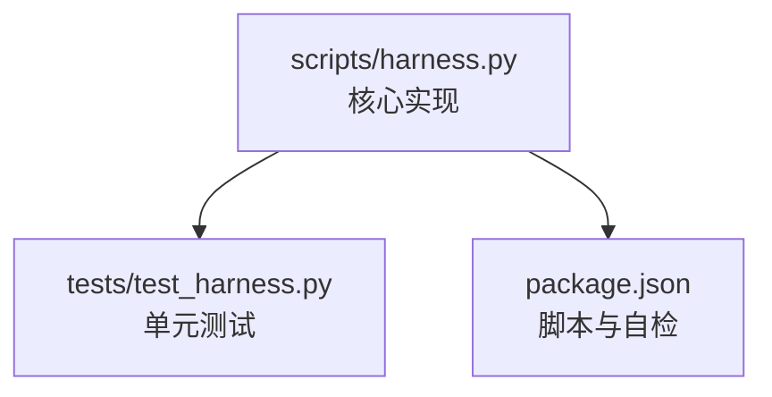
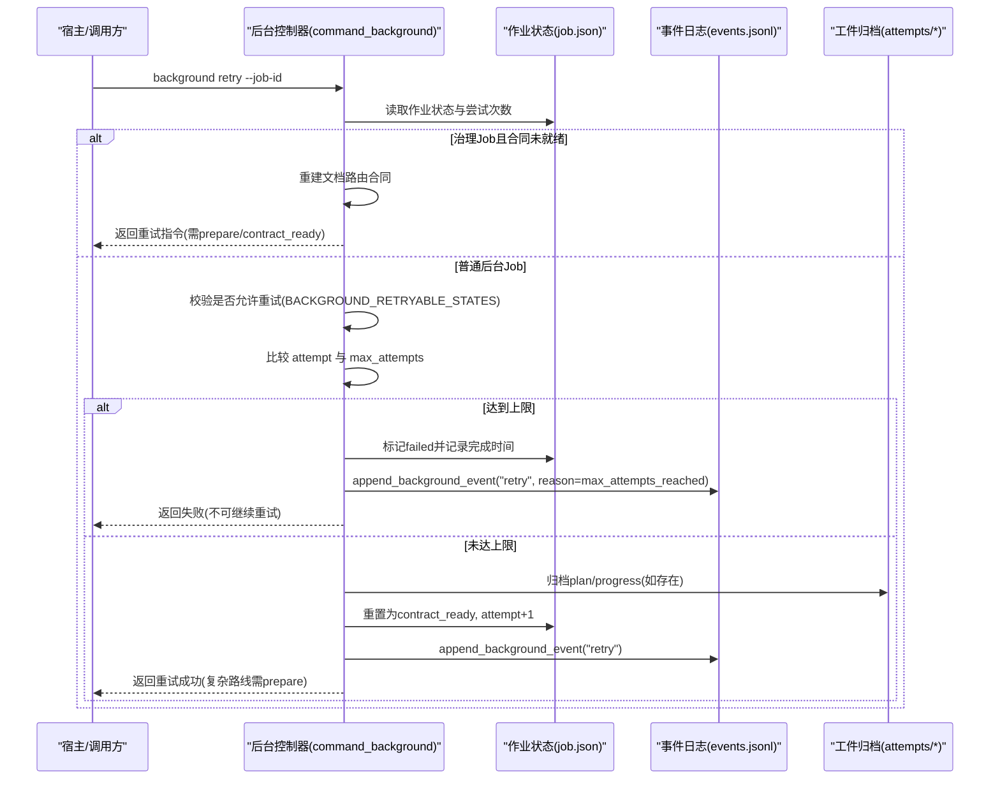
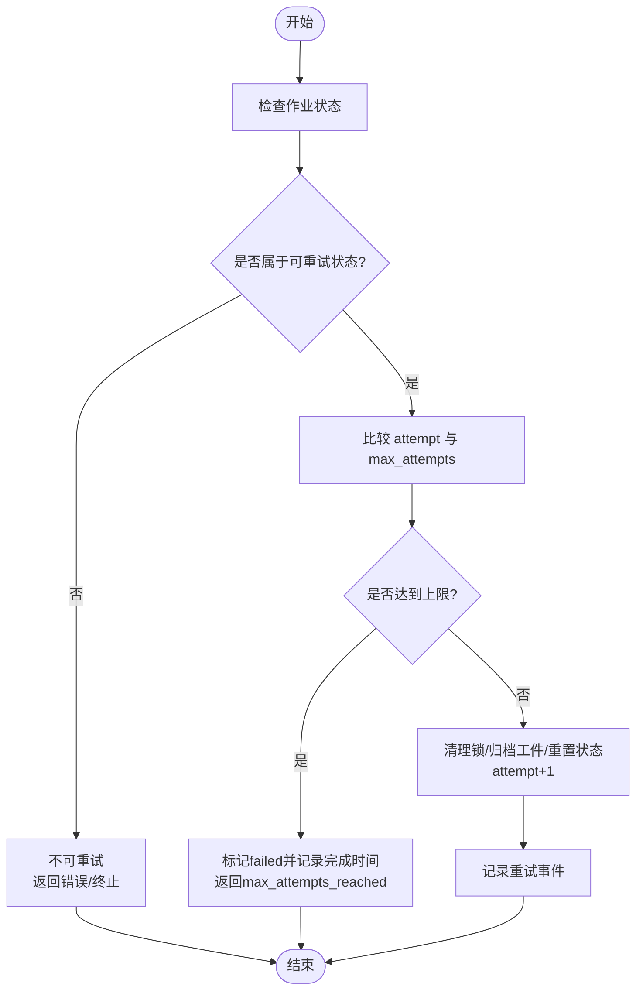
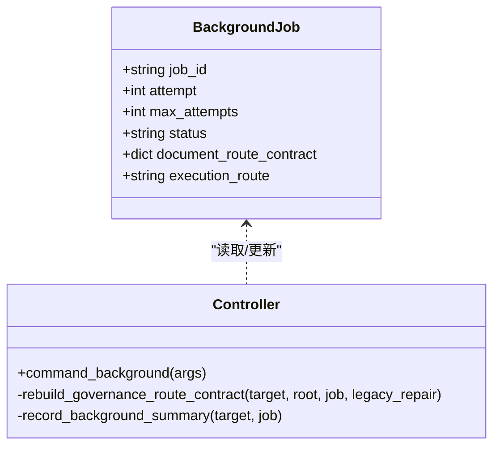
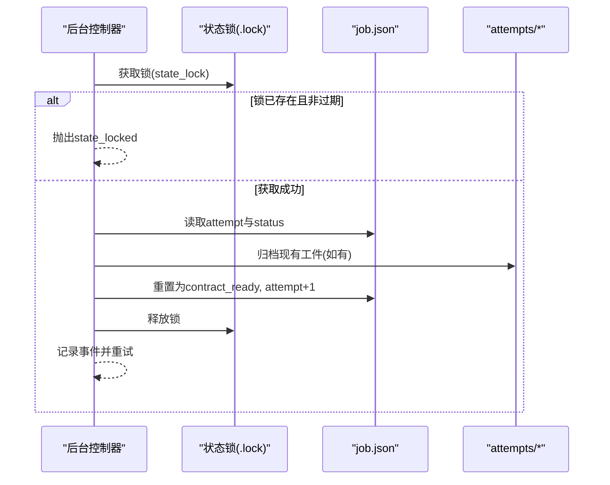
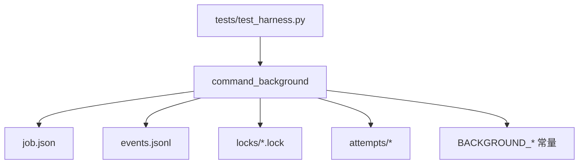

# 重试机制

<cite>
**本文引用的文件**   
- [scripts/harness.py](file://scripts/harness.py)
- [tests/test_harness.py](file://tests/test_harness.py)
- [package.json](file://package.json)
</cite>

## 目录
1. [简介](#简介)
2. [项目结构](#项目结构)
3. [核心组件](#核心组件)
4. [架构总览](#架构总览)
5. [详细组件分析](#详细组件分析)
6. [依赖关系分析](#依赖关系分析)
7. [性能考量](#性能考量)
8. [故障排查指南](#故障排查指南)
9. [结论](#结论)
10. [附录](#附录)

## 简介
本文件系统化阐述 Docs Harness 的重试机制，覆盖失败分类体系、退避策略、最大重试次数控制、重试状态管理、配置选项与监控告警，并给出对系统性能与资源使用的影响分析与优化建议。该机制主要作用于后台治理 Job（background jobs）的调度与重试，以及任务执行过程中的验证与重新准入流程。

## 项目结构
- 核心实现位于 scripts/harness.py，包含后台作业控制器、重试判定、状态机转换、事件记录与摘要归档等关键逻辑。
- 测试用例位于 tests/test_harness.py，覆盖 Git 预检/后检查、重试边界条件与幂等性。
- package.json 提供脚本入口与自检命令，便于在 CI/CD 中触发运行。

**图表来源** 
- [scripts/harness.py:10482-10560](file://scripts/harness.py#L10482-L10560)
- [tests/test_harness.py:1-120](file://tests/test_harness.py#L1-L120)
- [package.json:17-22](file://package.json#L17-L22)

**章节来源**
- [scripts/harness.py:10482-10560](file://scripts/harness.py#L10482-L10560)
- [tests/test_harness.py:1-120](file://tests/test_harness.py#L1-L120)
- [package.json:17-22](file://package.json#L17-L22)

## 核心组件
- 后台作业控制器：负责创建、调度、验收与重试后台 Job，维护状态机与工件准备。
- 重试判定器：基于作业当前状态与类型判断是否允许重试，并计算尝试次数上限。
- 状态持久化与恢复：通过 job.json、events.jsonl、attempt 归档与锁机制保证一致性。
- 事件与摘要：记录每次重试、状态转移与验收结果，形成可观测性与审计依据。

**章节来源**
- [scripts/harness.py:8597-8750](file://scripts/harness.py#L8597-L8750)
- [scripts/harness.py:8821-9176](file://scripts/harness.py#L8821-L9176)
- [scripts/harness.py:7554-7651](file://scripts/harness.py#L7554-L7651)

## 架构总览
Docs Harness 的重试机制围绕“后台 Job”展开，结合状态机与事件日志，确保在需要人工干预或环境漂移时具备可控的回退与重试能力。

**图表来源** 
- [scripts/harness.py:9012-9053](file://scripts/harness.py#L9012-L9053)
- [scripts/harness.py:8316-8370](file://scripts/harness.py#L8316-L8370)
- [scripts/harness.py:7554-7651](file://scripts/harness.py#L7554-L7651)

## 详细组件分析

### 失败分类体系
- 可重试错误：作业处于可重试状态集合（needs_user_input、needs_rebase、queued_manual），或明确允许重试的治理 Job 场景。
- 不可重试错误：作业不在可重试状态集合；或已达到最大尝试次数（max_attempts_reached）。
- 需要人工干预错误：状态为 needs_user_input 或 needs_rebase，要求宿主或操作者介入后再进入 contract_ready 继续执行。

**图表来源** 
- [scripts/harness.py:9012-9053](file://scripts/harness.py#L9012-L9053)
- [scripts/harness.py:8316-8370](file://scripts/harness.py#L8316-L8370)

**章节来源**
- [scripts/harness.py:9012-9053](file://scripts/harness.py#L9012-L9053)
- [scripts/harness.py:8316-8370](file://scripts/harness.py#L8316-L8370)

### 退避策略实现
- 线性退避：当前实现未内置自动退避延迟，重试由宿主或外部编排器按策略触发。建议在宿主层实现线性退避（固定间隔递增）。
- 指数退避：同样需在宿主层实现，适用于网络抖动或远端服务不稳定场景。
- 抖动算法：在指数退避基础上加入随机抖动，避免多实例同时重试导致的雪崩效应。

说明：harness.py 不直接睡眠或延时，而是通过状态与事件驱动重试时机，由上层编排器决定退避策略。

**章节来源**
- [scripts/harness.py:9012-9053](file://scripts/harness.py#L9012-L9053)

### 最大重试次数控制
- 全局限制：默认 BACKGROUND_MAX_ATTEMPTS=3，作为未显式设置时的默认上限。
- 级别限制：每个作业对象包含 max_attempts 字段，可在创建或修复时调整。
- 动态调整：在旧版治理 Job 修复路径中，会将 max_attempts 提升以兼容历史行为。

**图表来源** 
- [scripts/harness.py:8597-8750](file://scripts/harness.py#L8597-L8750)
- [scripts/harness.py:8316-8370](file://scripts/harness.py#L8316-L8370)

**章节来源**
- [scripts/harness.py:98-98](file://scripts/harness.py#L98-L98)
- [scripts/harness.py:8316-8370](file://scripts/harness.py#L8316-L8370)
- [scripts/harness.py:8597-8750](file://scripts/harness.py#L8597-L8750)

### 重试状态管理
- 重试计数持久化：attempt 字段随每次重试递增，写入 job.json。
- 状态恢复：重试前释放锁、归档 plan/progress 工件，重置为 contract_ready，刷新基线。
- 冲突解决：通过 state_lock 与 locks/*.lock 文件防止并发修改；检测到过期锁需人工确认清理。

**图表来源** 
- [scripts/harness.py:1011-1032](file://scripts/harness.py#L1011-L1032)
- [scripts/harness.py:8373-8402](file://scripts/harness.py#L8373-L8402)
- [scripts/harness.py:9012-9053](file://scripts/harness.py#L9012-L9053)

**章节来源**
- [scripts/harness.py:1011-1032](file://scripts/harness.py#L1011-L1032)
- [scripts/harness.py:8373-8402](file://scripts/harness.py#L8373-L8402)
- [scripts/harness.py:9012-9053](file://scripts/harness.py#L9012-L9053)

### 重试配置选项
- 超时设置：Git 命令与子进程调用支持 timeout 参数，用于控制预检与执行超时。
- 重试条件：由作业状态与类型决定，具体见可重试状态集合与治理 Job 特殊处理。
- 自定义重试逻辑：可通过宿主编排器在 harness 输出 next_action 与 next_command_argv 的基础上实现自定义重试策略。

**章节来源**
- [scripts/harness.py:575-586](file://scripts/harness.py#L575-L586)
- [scripts/harness.py:939-1008](file://scripts/harness.py#L939-L1008)

### 重试监控与告警
- 事件记录：每次重试、状态转移、验收结果均写入 events.jsonl，包含 reason_code、attempt、status 等关键字段。
- 摘要归档：record_background_summary 汇总作业生命周期信息，便于离线分析。
- 告警建议：在宿主层监听 events.jsonl 中的特定 reason_code（如 max_attempts_reached、document_route_drift）触发告警。

**章节来源**
- [scripts/harness.py:7554-7651](file://scripts/harness.py#L7554-L7651)
- [scripts/harness.py:7651-7768](file://scripts/harness.py#L7651-L7768)

## 依赖关系分析
- 后台控制器依赖作业状态文件（job.json）、事件日志（events.jsonl）、工件归档（attempts/*）与锁文件（locks/*.lock）。
- 重试逻辑依赖状态机定义（BACKGROUND_TRANSITIONS、BACKGROUND_RETRYABLE_STATES）与常量（BACKGROUND_MAX_ATTEMPTS）。
- 测试用例依赖 harness.py 暴露的函数进行端到端验证。

**图表来源** 
- [scripts/harness.py:8821-9176](file://scripts/harness.py#L8821-L9176)
- [scripts/harness.py:98-127](file://scripts/harness.py#L98-L127)
- [tests/test_harness.py:1-120](file://tests/test_harness.py#L1-L120)

**章节来源**
- [scripts/harness.py:8821-9176](file://scripts/harness.py#L8821-L9176)
- [scripts/harness.py:98-127](file://scripts/harness.py#L98-L127)
- [tests/test_harness.py:1-120](file://tests/test_harness.py#L1-L120)

## 性能考量
- I/O 开销：每次重试会写入 job.json、append events.jsonl，并在必要时归档工件，增加磁盘 I/O。
- 锁竞争：并发重试可能引发锁冲突，导致短暂阻塞或错误；应合理设计宿主重试频率。
- 快照与指纹：workspace_snapshot 与 file_fingerprint 涉及文件遍历与哈希计算，影响 CPU 与内存占用。
- 优化建议：
  - 在宿主层实现指数退避与抖动，降低瞬时重试风暴。
  - 批量合并事件写入，减少频繁 fsync。
  - 对大仓库启用 Git 工作树快照限制，避免全量扫描。

[本节为通用指导，不直接分析具体文件]

## 故障排查指南
- 常见错误码：
  - invalid_background_retry：作业状态不允许重试。
  - max_attempts_reached：达到最大尝试次数，需人工介入或调整上限。
  - git_preflight_timeout：Git 预检超时，检查网络与仓库状态。
  - stale_lock/state_locked：状态锁冲突或过期，需清理锁文件。
- 排查步骤：
  - 查看 events.jsonl 最近事件定位原因码。
  - 检查 job.json 的 attempt、max_attempts、status 字段。
  - 确认 locks/*.lock 是否存在过期锁。
  - 若为治理 Job 合同漂移，先重建合同再重试。

**章节来源**
- [scripts/harness.py:9012-9053](file://scripts/harness.py#L9012-L9053)
- [scripts/harness.py:575-586](file://scripts/harness.py#L575-L586)
- [scripts/harness.py:1011-1032](file://scripts/harness.py#L1011-L1032)

## 结论
Docs Harness 的重试机制以状态机为核心，结合事件日志与工件归档，提供了可控、可观测、可恢复的重试能力。通过宿主层的退避策略与监控告警，可有效应对临时故障与环境漂移，保障后台治理作业的稳定性与可靠性。

[本节为总结，不直接分析具体文件]

## 附录
- 相关命令：
  - background retry：触发作业重试。
  - background prepare：准备复杂路线工件。
  - background verify：验收作业结果。
- 自检与测试：
  - npm run self-test：运行内置合同自检。
  - npm run test：执行单元测试套件。

**章节来源**
- [scripts/harness.py:10455-10470](file://scripts/harness.py#L10455-L10470)
- [package.json:17-22](file://package.json#L17-L22)