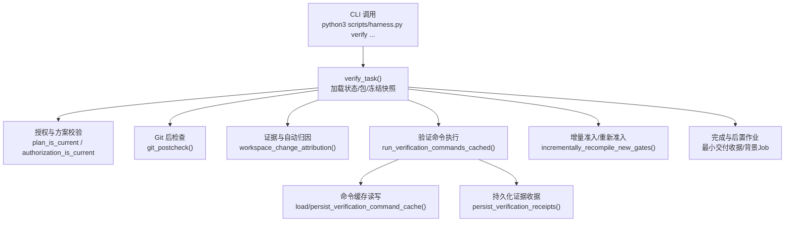
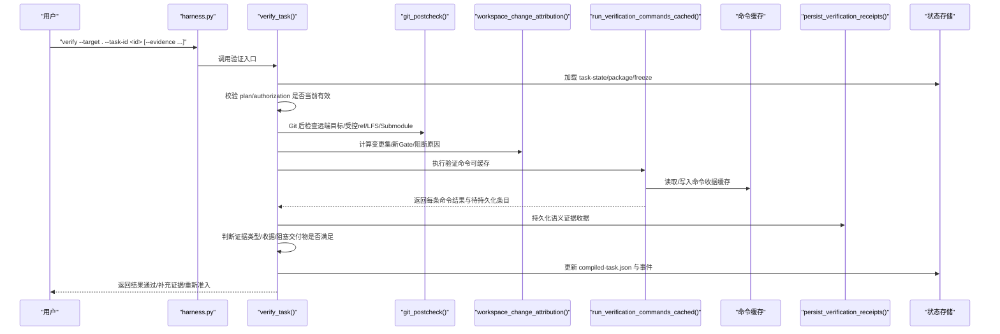
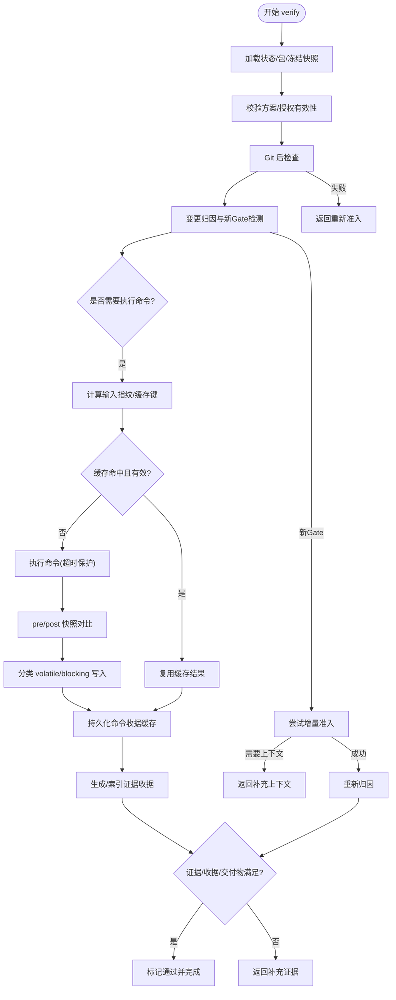
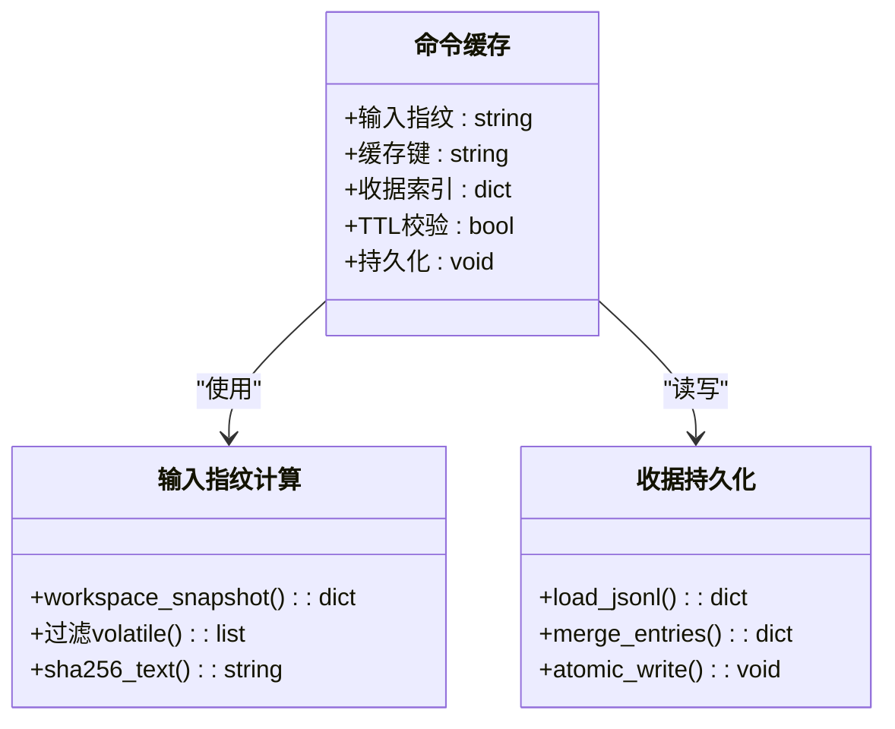
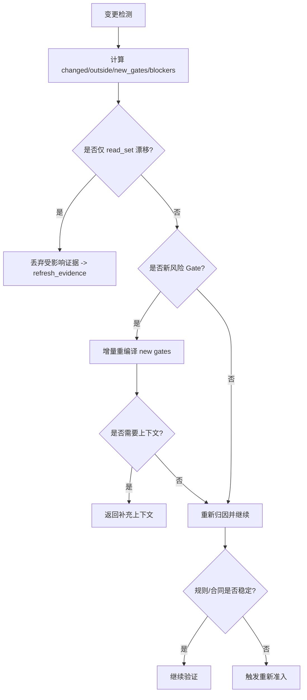
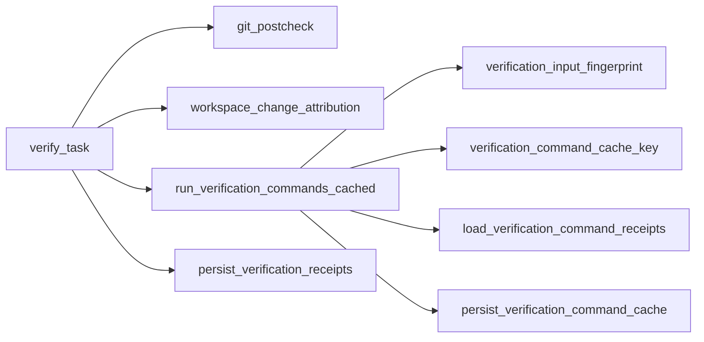

# 验证命令执行

<cite>
**本文引用的文件**   
- [scripts/harness.py](file://scripts/harness.py)
- [tests/test_harness.py](file://tests/test_harness.py)
- [package.json](file://package.json)
- [SKILL.md](file://SKILL.md)
</cite>

## 目录
1. [简介](#简介)
2. [项目结构](#项目结构)
3. [核心组件](#核心组件)
4. [架构总览](#架构总览)
5. [详细组件分析](#详细组件分析)
6. [依赖关系分析](#依赖关系分析)
7. [性能考量](#性能考量)
8. [故障排查指南](#故障排查指南)
9. [结论](#结论)
10. [附录](#附录)

## 简介
本文件面向 Docs Harness 的“验证命令执行系统”，系统性阐述验证命令从解析、环境准备、执行调度到结果收集的全生命周期；解释命令缓存机制（输入指纹计算、缓存键生成与命中策略）；说明增量验证逻辑（依赖图分析、变更影响评估与选择性执行）；给出重试机制设计（失败分类、退避策略与最大重试次数）；提供验证命令编写规范与最佳实践；并包含调试工具与日志分析方法，以及错误处理与异常恢复策略。

## 项目结构
- scripts/harness.py：控制器主程序，实现任务编排、验证命令执行、证据与收据管理、Git 前后检查、增量准入等核心能力。
- tests/test_harness.py：覆盖验收用例，验证意图推断、范围约束、Git 预检/后检、工作区归因、验证命令缓存、增量准入等行为。
- package.json：包元数据与脚本入口，定义测试与自检命令。
- SKILL.md：技能说明，描述 run/verify 流程、证据契约、后台治理与质量账本等高层约定。

**图表来源** 
- [scripts/harness.py:6292-6761](file://scripts/harness.py#L6292-L6761)
- [scripts/harness.py:5786-5906](file://scripts/harness.py#L5786-L5906)
- [scripts/harness.py:793-876](file://scripts/harness.py#L793-L876)

**章节来源**
- [package.json:1-23](file://package.json#L1-L23)
- [SKILL.md:1-105](file://SKILL.md#L1-L105)

## 核心组件
- 验证入口与编排：verify_task(args, telemetry)，负责状态加载、前置校验、Git 后检查、证据归因、命令执行、收据持久化与最终判定。
- 验证命令执行器：run_verification_commands_cached(state, target, package, volatile_patterns, cache_enabled)，逐条执行命令、捕获输出、计算工作区差异、分类写入与缓存。
- 命令缓存子系统：verification_input_fingerprint、verification_command_cache_key、load_verification_command_receipts、persist_verification_command_cache，实现基于输入指纹与契约摘要的逐项缓存。
- Git 前后检查：git_preflight_contract（用于 fetch/sync 预检）、git_postcheck（验证远端目标不变、受控 ref 未越界、LFS/Submodule 可用）。
- 证据与收据：persist_verification_receipts 将验证命令产生的语义证据转为 v2 收据并索引；支持 TTL、产物摘要与可信生产者标记。
- 增量准入与规则匹配：当检测到新风险 Gate 或规则漂移时，尝试增量重编译或触发重新准入；auto_attribute_in_scope 支持写范围自动归因。

**章节来源**
- [scripts/harness.py:6292-6761](file://scripts/harness.py#L6292-L6761)
- [scripts/harness.py:5786-5906](file://scripts/harness.py#L5786-L5906)
- [scripts/harness.py:793-876](file://scripts/harness.py#L793-L876)
- [scripts/harness.py:1188-1213](file://scripts/harness.py#L1188-L1213)

## 架构总览
下图展示一次 verify 调用的关键交互与数据流，包括状态加载、Git 后检查、证据归因、命令执行与缓存、收据持久化、增量准入与完成阶段。

**图表来源** 
- [scripts/harness.py:6292-6761](file://scripts/harness.py#L6292-L6761)
- [scripts/harness.py:5786-5906](file://scripts/harness.py#L5786-L5906)
- [scripts/harness.py:793-876](file://scripts/harness.py#L793-L876)

## 详细组件分析

### 验证命令生命周期
- 命令解析与规范化
  - 对 verification_commands 中的 argv 进行安全白名单校验（npm/bun/swift/go/cargo/make 等），仅允许 test/check/build/lint/type 等子命令。
  - produces 字段限定可产出的证据类型，未知类型将被拒绝。
- 环境准备
  - 计算输入指纹：排除 Harness Runtime 与配置的可挥发路径后的工作区快照指纹。
  - 构建缓存键：组合 task_id、target_identity、command_argv_digest、cwd、input_fingerprint、contract_digest。
- 执行调度
  - 若缓存命中且有效（TTL 未过期、结果为 passed），直接复用结果，不执行子进程。
  - 否则记录 pre/post 快照，执行命令（超时保护），统计 duration_ms、exit_code、输出摘要。
  - 区分 volatile_write_set（临时产物）与 blocking_write_set（非临时写入），后者导致失败。
- 结果收集与持久化
  - 成功且声明 produces 的类型，生成 v2 证据收据并索引。
  - 将本次通过的命令收据合并入 JSONL 缓存，供后续复用。
- 决策与回退
  - 结合证据类型、必需收据、阻塞交付物、Git 后检查结果，决定“通过”“补充证据”或“重新准入”。
  - 遇到新风险 Gate 或规则漂移，尝试增量准入；否则退回完整重新准入。

**图表来源** 
- [scripts/harness.py:5786-5906](file://scripts/harness.py#L5786-L5906)
- [scripts/harness.py:6292-6761](file://scripts/harness.py#L6292-L6761)

**章节来源**
- [scripts/harness.py:5712-5724](file://scripts/harness.py#L5712-L5724)
- [scripts/harness.py:5726-5757](file://scripts/harness.py#L5726-L5757)
- [scripts/harness.py:5760-5784](file://scripts/harness.py#L5760-L5784)
- [scripts/harness.py:5786-5906](file://scripts/harness.py#L5786-L5906)
- [scripts/harness.py:6292-6761](file://scripts/harness.py#L6292-L6761)

### 命令缓存机制
- 输入指纹计算
  - workspace_snapshot(target) 生成工作区快照，过滤掉 Harness Runtime 与配置的 volatile 路径，得到稳定指纹。
- 缓存键生成
  - 由 task_id、target_identity、command_argv_digest、cwd、verification_input_fingerprint、contract_digest 共同组成唯一键。
- 命中策略
  - 读取 command-receipts.jsonl，按 cache_key 取最后一条；仅 result=passed 且 TTL 未过期的才视为可用。
  - 命中则跳过执行，直接返回缓存结果；未命中则执行并缓存通过结果。
- 开关控制
  - verification.command_cache_enabled 默认开启，可在项目配置中整体关闭。

**图表来源** 
- [scripts/harness.py:5726-5757](file://scripts/harness.py#L5726-L5757)
- [scripts/harness.py:5760-5784](file://scripts/harness.py#L5760-L5784)
- [scripts/harness.py:5898-5906](file://scripts/harness.py#L5898-L5906)
- [scripts/harness.py:1188-1213](file://scripts/harness.py#L1188-L1213)

**章节来源**
- [scripts/harness.py:5726-5757](file://scripts/harness.py#L5726-L5757)
- [scripts/harness.py:5760-5784](file://scripts/harness.py#L5760-L5784)
- [scripts/harness.py:5898-5906](file://scripts/harness.py#L5898-L5906)
- [scripts/harness.py:1188-1213](file://scripts/harness.py#L1188-L1213)

### 增量验证逻辑
- 依赖图分析
  - 通过 evidence-index.json 与 package 绑定，识别可复用的历史证据；根据 write_set/changed_paths 与任务覆盖范围判定相关性。
- 变更影响评估
  - workspace_change_attribution 计算 changed_paths、outside_scope、new_gates、blockers；读集合漂移触发 refresh_evidence。
- 选择性执行
  - 仅对新风险 Gate 或规则漂移进行增量重编译；高风险或合同变化走 full_readmission；read_set 漂移只失效引用漂移路径的证据。
- 自动归因
  - write_scope 内未归因写入可由控制器自动归因（可配置关闭），减少人工补证据成本。

**图表来源** 
- [scripts/harness.py:6292-6761](file://scripts/harness.py#L6292-L6761)

**章节来源**
- [scripts/harness.py:6292-6761](file://scripts/harness.py#L6292-L6761)

### 重试机制设计
- 失败分类
  - 补充证据（provide_evidence/refresh_evidence）：退出码 3，提示宿主补充或刷新证据。
  - 重新准入（full_readmission/incremental_gate_readmission）：退出码 4，需重新 run 以重建授权/方案。
  - 验证命令失败：命令级失败，不增加 package 版本，仅重试该命令。
- 退避策略
  - 命令级失败无指数退避，但可通过缓存避免重复执行；整体重试由上层宿主控制。
- 最大重试次数
  - 命令级无硬上限；后台 Job 有最大尝试次数（如 BACKGROUND_MAX_ATTEMPTS），不适用于验证命令。

**章节来源**
- [scripts/harness.py:6292-6761](file://scripts/harness.py#L6292-L6761)
- [scripts/harness.py:95-103](file://scripts/harness.py#L95-L103)

### 验证命令编写规范与最佳实践
- 命令白名单
  - 仅允许 npm test/run、bun test/run、swift/go/cargo/make 的受限子命令；避免任意 shell 执行。
- 产出声明
  - produces 必须为已知证据类型；未声明 produce 的命令不会生成语义证据。
- 工作区写入
  - 禁止在工作区产生非临时写入；临时产物需符合内置或配置的 volatile 模式。
- 幂等与可缓存
  - 命令应幂等；利用输入指纹与契约摘要获得缓存命中，提升重复验证效率。
- 超时与资源
  - 命令执行带超时保护；避免长时间阻塞；合理划分验证粒度。

**章节来源**
- [scripts/harness.py:5700-5724](file://scripts/harness.py#L5700-L5724)
- [scripts/harness.py:1142-1233](file://scripts/harness.py#L1142-L1233)
- [scripts/harness.py:5786-5906](file://scripts/harness.py#L5786-L5906)

### 调试工具与日志分析方法
- 事件日志
  - events.jsonl 记录各阶段事件（context/verification 等），含 duration_ms、reason_code、evidence_round_count 等指标。
- 状态锁与冲突
  - state_lock 防止并发修改；超过 5 分钟锁视为陈旧锁，需人工清理。
- 诊断要点
  - 关注 reason_code（如 git_remote_drift、read_set_drift、verification_command_workspace_write）；
  - 查看 verification_commands 结果与缓存命中情况；
  - 检查 git_postcheck 的 checks 与 outside_refs。

**章节来源**
- [scripts/harness.py:1031-1071](file://scripts/harness.py#L1031-L1071)
- [scripts/harness.py:1008-1029](file://scripts/harness.py#L1008-L1029)
- [scripts/harness.py:793-876](file://scripts/harness.py#L793-L876)

### 错误处理与异常恢复策略
- 参数与配置校验
  - 对 facts、scope、external_scope、verification.volatile_paths、verification.command_cache_enabled 等进行严格校验，非法即失败关闭。
- 运行时异常
  - subprocess.TimeoutExpired、OSError、JSONDecodeError 等被捕获并转换为统一 HarnessError，附带 code 与 exit_code。
- 恢复策略
  - 补充证据：提示宿主提交缺失证据或刷新漂移证据。
  - 重新准入：当方案/授权/规则/范围变化时，要求重新 run 以重建契约。
  - 自动归因：在 write_scope 内自动为未归因写入生成证据，减少人工干预。

**章节来源**
- [scripts/harness.py:437-504](file://scripts/harness.py#L437-L504)
- [scripts/harness.py:1142-1213](file://scripts/harness.py#L1142-L1213)
- [scripts/harness.py:6292-6761](file://scripts/harness.py#L6292-L6761)

## 依赖关系分析
- 模块内依赖
  - verify_task 依赖 git_postcheck、workspace_change_attribution、run_verification_commands_cached、persist_verification_receipts、incrementally_recompile_new_gates。
  - run_verification_commands_cached 依赖 verification_input_fingerprint、verification_command_cache_key、load/persist 缓存。
- 外部依赖
  - Git 命令封装（git_command、ls-remote、diff、submodule、lfs）；
  - 文件系统原子写入与 JSONL 追加；
  - 时间戳与哈希函数。

**图表来源** 
- [scripts/harness.py:6292-6761](file://scripts/harness.py#L6292-L6761)
- [scripts/harness.py:5786-5906](file://scripts/harness.py#L5786-L5906)

**章节来源**
- [scripts/harness.py:6292-6761](file://scripts/harness.py#L6292-L6761)
- [scripts/harness.py:5786-5906](file://scripts/harness.py#L5786-L5906)

## 性能考量
- 命令缓存显著降低重复验证开销，命中时零执行；建议保持命令幂等与稳定的输入指纹。
- 工作区快照在大仓库下可能耗时，已限制文件大小与数量；非 Git 工作区存在截断阈值保护。
- 事件日志与证据索引采用追加与 JSONL 格式，适合流式消费与增量分析。
- 建议拆分验证命令为细粒度任务，提高缓存命中率与并行度。

[本节为通用指导，不直接分析具体文件]

## 故障排查指南
- 常见退出码与含义
  - 3：补充证据（provide_evidence/refresh_evidence），需提交缺失或刷新漂移证据。
  - 4：重新准入（full_readmission/incremental_gate_readmission），需重新 run 以重建授权/方案。
- 定位步骤
  - 查看 events.jsonl 中 verification 阶段的事件与 reason_code；
  - 检查 verification_commands 结果（cache_hit、exit_code、unexpected_write_set）；
  - 核对 git_postcheck 的 checks 与 outside_refs；
  - 确认 rules_root 与 active 规则指纹一致。
- 常见问题
  - 命令产生非临时写入：需改为输出到 volatile 目录或移除写入。
  - 读集合漂移：刷新相关证据。
  - 远端漂移：等待同步或重新准入。

**章节来源**
- [scripts/harness.py:6292-6761](file://scripts/harness.py#L6292-L6761)
- [scripts/harness.py:793-876](file://scripts/harness.py#L793-L876)
- [scripts/harness.py:1031-1071](file://scripts/harness.py#L1031-L1071)

## 结论
Docs Harness 的验证命令执行系统以强契约、强证据与强隔离为核心，通过严格的命令白名单、输入指纹与契约摘要驱动的逐项缓存、Git 前后检查与自动归因、增量准入与规则漂移处理，实现了高效、可靠、可审计的本地验证流水线。遵循本文规范与最佳实践，可显著提升验证稳定性与执行效率。

[本节为总结性内容，不直接分析具体文件]

## 附录
- 运行与自检
  - 使用 package.json 提供的脚本进行单元测试与自检，确保规则与契约一致性。
- 参考文档
  - SKILL.md 描述了 run/verify 流程、证据契约、后台治理与质量账本等高层约定。

**章节来源**
- [package.json:17-22](file://package.json#L17-L22)
- [SKILL.md:25-57](file://SKILL.md#L25-L57)