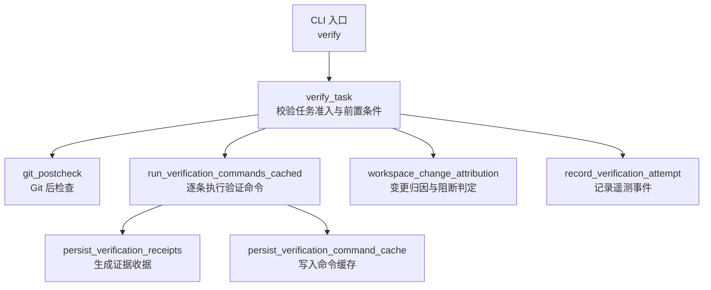
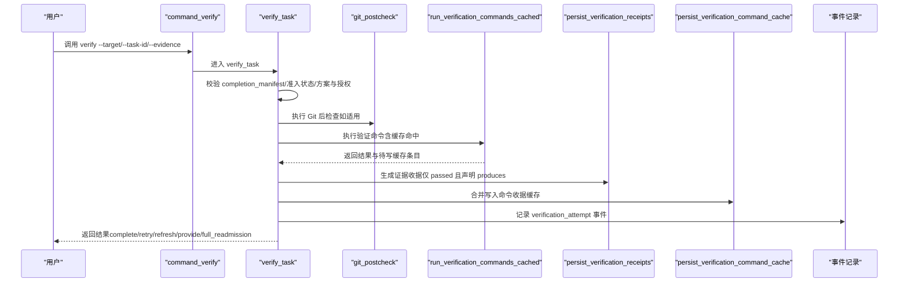
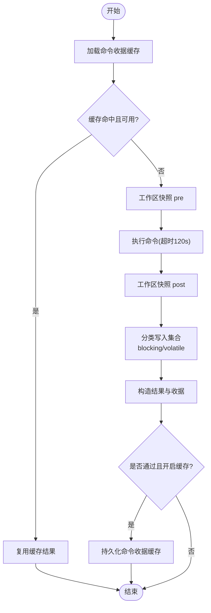
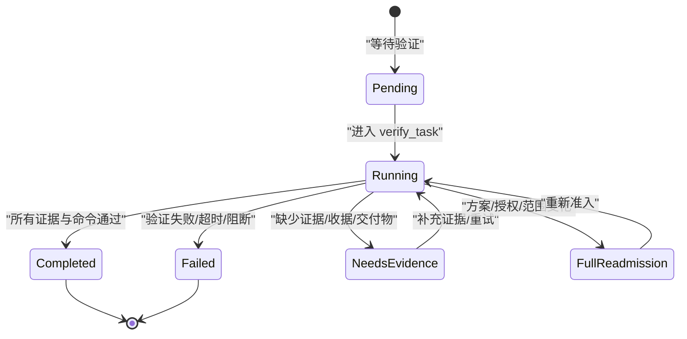
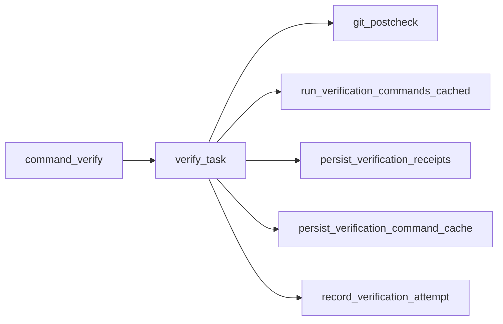

# 验证命令生命周期

<cite>
**本文引用的文件**   
- [scripts/harness.py](file://scripts/harness.py)
- [tests/test_harness.py](file://tests/test_harness.py)
- [package.json](file://package.json)
- [SKILL.md](file://SKILL.md)
</cite>

## 目录
1. [简介](#简介)
2. [项目结构](#项目结构)
3. [核心组件](#核心组件)
4. [架构总览](#架构总览)
5. [详细组件分析](#详细组件分析)
6. [依赖关系分析](#依赖关系分析)
7. [性能考量](#性能考量)
8. [故障排查指南](#故障排查指南)
9. [结论](#结论)
10. [附录](#附录)

## 简介
本文件系统化阐述 Docs Harness 中“验证命令”从解析到执行的完整生命周期，覆盖参数与环境准备、工作目录与执行环境初始化、状态机转换（pending/running/completed/failed 等）、监控机制（进度、资源使用、超时）、隔离机制（进程、文件系统、网络访问控制），以及最佳实践与常见问题诊断。文档面向不同技术背景的读者，提供由浅入深的说明与可视化图示。

## 项目结构
- scripts/harness.py：Docs Harness 主控制器，包含验证命令入口、执行流程、缓存、证据持久化、Git 预检/后检、事件记录等核心逻辑。
- tests/test_harness.py：端到端与单元测试，覆盖 verify 行为、Git 漂移、规则漂移、增量准入、命令缓存等关键路径。
- package.json：包元数据与脚本入口，便于本地测试与自检。
- SKILL.md：技能说明，包含 verify 的调用方式、验收语义与后续动作指引。

**图表来源** 
- [scripts/harness.py:6282-6300](file://scripts/harness.py#L6282-L6300)
- [scripts/harness.py:6301-6776](file://scripts/harness.py#L6301-L6776)
- [scripts/harness.py:5795-5904](file://scripts/harness.py#L5795-L5904)
- [scripts/harness.py:5918-5965](file://scripts/harness.py#L5918-L5965)
- [scripts/harness.py:5907-5916](file://scripts/harness.py#L5907-L5916)
- [scripts/harness.py:6243-6280](file://scripts/harness.py#L6243-L6280)

**章节来源**
- [scripts/harness.py:6282-6300](file://scripts/harness.py#L6282-L6300)
- [scripts/harness.py:6301-6776](file://scripts/harness.py#L6301-L6776)
- [package.json:1-23](file://package.json#L1-L23)
- [SKILL.md:1-105](file://SKILL.md#L1-L105)

## 核心组件
- 验证入口与编排
  - command_verify：统一入口，负责计时、异常捕获与遥测记录。
  - verify_task：核心编排，完成准入校验、Git 后检、证据与命令执行、结果判定与后置处理。
- 验证命令执行与缓存
  - run_verification_commands_cached：按任务声明的 verification_commands 逐项执行；支持输入指纹缓存与 TTL 过期策略。
  - persist_verification_command_cache：将本次通过的命令收据合并写入 JSONL 索引。
- 证据与收据
  - persist_verification_receipts：对通过且声明 produces 的命令生成 v2 证据收据并入库。
  - evidence_source_current / authorization_is_current：证据与授权有效性判定。
- Git 安全与一致性
  - git_preflight_contract / git_postcheck：针对 git_fetch/git_sync 的前置快照与后置校验，确保受控引用范围与目标不变。
- 变更归因与阻断
  - workspace_change_attribution：计算 changed_paths/outside_scope/new_gates/blockers，驱动重新准入或补充证据分支。
- 遥测与事件
  - record_verification_attempt：每次 verify 入口写入有界事件，统计命令执行次数、缓存命中、上下文加载计数等。

**章节来源**
- [scripts/harness.py:6282-6300](file://scripts/harness.py#L6282-L6300)
- [scripts/harness.py:6301-6776](file://scripts/harness.py#L6301-L6776)
- [scripts/harness.py:5795-5904](file://scripts/harness.py#L5795-L5904)
- [scripts/harness.py:5907-5916](file://scripts/harness.py#L5907-L5916)
- [scripts/harness.py:5918-5965](file://scripts/harness.py#L5918-L5965)
- [scripts/harness.py:6009-6013](file://scripts/harness.py#L6009-L6013)
- [scripts/harness.py:6015-6023](file://scripts/harness.py#L6015-L6023)
- [scripts/harness.py:793-876](file://scripts/harness.py#L793-L876)
- [scripts/harness.py:6243-6280](file://scripts/harness.py#L6243-L6280)

## 架构总览
下图展示 verify 命令从 CLI 进入、状态加载、Git 后检、命令执行与缓存、证据持久化、最终状态落盘与后置处理的整体流程。

**图表来源** 
- [scripts/harness.py:6282-6300](file://scripts/harness.py#L6282-L6300)
- [scripts/harness.py:6301-6776](file://scripts/harness.py#L6301-L6776)
- [scripts/harness.py:5795-5904](file://scripts/harness.py#L5795-L5904)
- [scripts/harness.py:5918-5965](file://scripts/harness.py#L5918-L5965)
- [scripts/harness.py:5907-5916](file://scripts/harness.py#L5907-L5916)
- [scripts/harness.py:6243-6280](file://scripts/harness.py#L6243-L6280)

## 详细组件分析

### 命令参数解析与环境准备
- 参数解析与安全校验
  - safe_target：校验 target 为有效目录，拒绝根目录与用户主目录。
  - load_input_file/load_json_object_file：对 --facts、--plan、--authorization、--evidence 等文件进行大小限制、JSON 合法性与类型校验。
  - normalize_string_list：规范化字符串数组，去重与空白清理。
- 环境变量与运行环境
  - environment_fingerprint：记录 Python 版本、平台与可执行路径，用于审计与复现。
  - project_config：读取 .docs-harness/config.json，获取 verification.* 配置项（如 volatile_paths、command_cache_enabled、auto_attribute_in_scope）。
- 工作目录与快照
  - runtime_root/task_state_dir：定位任务状态目录。
  - workspace_snapshot：构建工作区快照（Git 优先，非 Git 回退扫描，限制文件大小与数量，排除敏感目录）。
  - snapshot_changes：对比前后快照得到变更路径集合。

**章节来源**
- [scripts/harness.py:532-538](file://scripts/harness.py#L532-L538)
- [scripts/harness.py:456-504](file://scripts/harness.py#L456-L504)
- [scripts/harness.py:1256-1262](file://scripts/harness.py#L1256-L1262)
- [scripts/harness.py:1236-1242](file://scripts/harness.py#L1236-L1242)
- [scripts/harness.py:1279-1285](file://scripts/harness.py#L1279-L1285)
- [scripts/harness.py:906-922](file://scripts/harness.py#L906-L922)
- [scripts/harness.py:1112-1136](file://scripts/harness.py#L1112-L1136)
- [scripts/harness.py:1138-1140](file://scripts/harness.py#L1138-L1140)

### 验证命令执行与监控
- 命令白名单与参数过滤
  - 仅允许安全命令（如 git diff/status、python/pytest/unittest、npm test/run、bun、swift/go/cargo/make 的受限子集），禁止内联代码与危险参数。
- 执行与超时
  - subprocess.run(timeout=120) 执行命令，捕获 stdout/stderr 并计算输出摘要；超时则标记 exit_code=None 并记录原因。
- 工作区写入分类
  - 区分 blocking_write_set（阻塞性写入）与 volatile_write_set（临时产物，如 __pycache__、.pytest_cache、.coverage 等），后者不计入额外写入。
- 缓存机制
  - 基于 task_id/target_identity/command_argv_digest/cwd/verification_input_fingerprint/contract_digest 生成 cache_key。
  - 命中缓存且 TTL 未过期则直接复用结果；否则真实执行并写入新收据。
- 监控指标
  - 记录 duration_ms、exit_code、started_at/ended_at、output_or_artifact_digest、produces、result、cache_hit。
  - 全局遥测：command_executed_count、command_cache_hit_count、command_cache_enabled。

**图表来源** 
- [scripts/harness.py:5700-5718](file://scripts/harness.py#L5700-L5718)
- [scripts/harness.py:5795-5904](file://scripts/harness.py#L5795-L5904)
- [scripts/harness.py:5907-5916](file://scripts/harness.py#L5907-L5916)

**章节来源**
- [scripts/harness.py:5700-5718](file://scripts/harness.py#L5700-L5718)
- [scripts/harness.py:5795-5904](file://scripts/harness.py#L5795-L5904)
- [scripts/harness.py:5907-5916](file://scripts/harness.py#L5907-L5916)

### 证据与收据管理
- 证据来源与绑定
  - 外部证据需满足 schema_version、covers、task_id、target_identity、package_fingerprint、producer、ttl、exit_code、changed_paths/read_set/write_set/conclusion 等字段约束。
  - 受管副本存储：store_managed_artifact 保证原始文件删除不影响准入。
- 自动归因
  - write_scope 内的未归因写入可由控制器自动生成 workspace_attribution 收据（可配置关闭）。
- 收据持久化
  - persist_verification_receipts：对通过且声明 produces 的命令生成 v2 收据并入库，供后续复用与审计。

**章节来源**
- [scripts/harness.py:5918-5965](file://scripts/harness.py#L5918-L5965)
- [scripts/harness.py:6384-6499](file://scripts/harness.py#L6384-L6499)

### Git 预检与后检
- 预检（git_preflight_contract）
  - 针对 git_fetch/git_sync，生成快照：remote、refspec、preflight_target_oid、refs、index_tree、worktree_fingerprint、controlled_refs_namespace、lfs/submodule 可用性、fast-forward 能力、sync_scope 与删除计数等。
- 后检（git_postcheck）
  - 校验 remote_target_unchanged、refs_within_contract、head/index/worktree 一致性（fetch），或 controlled_ref 匹配与分支不分歧（sync），以及 LFS/Submodule 有效性。
- 失败原因码
  - git_remote_drift、git_ref_scope_violation、git_postcheck_failed 等。

**章节来源**
- [scripts/harness.py:677-791](file://scripts/harness.py#L677-L791)
- [scripts/harness.py:793-876](file://scripts/harness.py#L793-L876)

### 状态机与流转
- 验证阶段状态
  - control_status：ready_direct/ready_planned/ready_extended → blocked → complete
  - verification_status：needs_evidence → passed
- 处置分类（classify_verification_outcome）
  - complete、full_readmission、incremental_admission、retry_verification、refresh_evidence、provide_evidence
- 触发条件
  - full_readmission：方案/授权漂移、高风险 Gate 新增、范围越界等
  - retry_verification：验证命令失败、Git 工具不可用/远端不可达
  - refresh_evidence：read_set 漂移、证据过期
  - provide_evidence：缺少必需证据类型/收据/阻塞交付物
  - incremental_admission：仅需增量 Gate 上下文

**图表来源** 
- [scripts/harness.py:6182-6228](file://scripts/harness.py#L6182-L6228)
- [scripts/harness.py:6301-6776](file://scripts/harness.py#L6301-L6776)

**章节来源**
- [scripts/harness.py:6182-6228](file://scripts/harness.py#L6182-L6228)
- [scripts/harness.py:6301-6776](file://scripts/harness.py#L6301-L6776)

### 隔离机制
- 进程隔离
  - 通过 subprocess.run 在独立进程中执行验证命令，捕获输出与退出码，设置超时保护。
- 文件系统隔离
  - 严格的工作区快照与变更分类，volatile 路径白名单避免误判；拒绝根目录与用户主目录作为 target；禁止符号链接与越界路径。
- 网络访问控制
  - 验证命令白名单限制可执行与参数，禁止内联代码与危险开关；Git 操作限定于受控 refs 命名空间；远程 URL 脱敏指纹。

**章节来源**
- [scripts/harness.py:5700-5718](file://scripts/harness.py#L5700-L5718)
- [scripts/harness.py:1112-1136](file://scripts/harness.py#L1112-L1136)
- [scripts/harness.py:532-538](file://scripts/harness.py#L532-L538)
- [scripts/harness.py:585-596](file://scripts/harness.py#L585-L596)

### 最佳实践与性能优化建议
- 合理声明 verification_commands.produces，减少不必要的证据再生。
- 利用 command_cache_enabled 与 TTL 提升重复验证效率。
- 将易变产物放入 volatile_paths 白名单，避免误报写入。
- 明确 write_scope，降低自动归因带来的重新准入概率。
- 使用 Git 受控 refs 范围，避免漂移导致的 full_readmission。
- 在长耗时命令中拆分任务，结合后台 Job 异步推进。

[本节为通用指导，无需源码引用]

## 依赖关系分析
- 模块内依赖
  - command_verify 依赖 verify_task；verify_task 依赖 git_postcheck、run_verification_commands_cached、persist_verification_receipts、persist_verification_command_cache、record_verification_attempt。
- 外部依赖
  - Git 工具链（diff/status/fetch/sync/lfs/submodule）
  - 系统进程执行器（subprocess）
  - 文件系统（读写原子性、锁、快照）
- 潜在循环依赖
  - 无直接循环；各功能以函数式组合为主，职责清晰。

**图表来源** 
- [scripts/harness.py:6282-6300](file://scripts/harness.py#L6282-L6300)
- [scripts/harness.py:6301-6776](file://scripts/harness.py#L6301-L6776)
- [scripts/harness.py:5795-5904](file://scripts/harness.py#L5795-L5904)
- [scripts/harness.py:5918-5965](file://scripts/harness.py#L5918-L5965)
- [scripts/harness.py:5907-5916](file://scripts/harness.py#L5907-L5916)
- [scripts/harness.py:6243-6280](file://scripts/harness.py#L6243-L6280)

**章节来源**
- [scripts/harness.py:6282-6300](file://scripts/harness.py#L6282-L6300)
- [scripts/harness.py:6301-6776](file://scripts/harness.py#L6301-L6776)

## 性能考量
- 命令缓存命中率：通过 verification_input_fingerprint 与 contract_digest 精确键控，避免重复执行。
- 快照成本：Git 工作区优先，非 Git 模式有文件数上限与截断保护。
- 超时与资源占用：单命令 120s 超时，避免长时间阻塞；输出摘要哈希避免大文本传输。
- 事件与索引：events.jsonl 与证据索引采用追加与原子写入，降低并发冲突。

[本节为通用指导，无需源码引用]

## 故障排查指南
- 常见错误码与含义
  - unsafe_verification_command：命令不在白名单或参数非法
  - invalid_completion_manifest：完成清单缺失或指纹无效
  - not_admitted：任务尚未获得执行准入
  - plan_contract_drift/authorization_contract_drift：方案/授权漂移
  - action_context_missing：执行阶段上下文缺失
  - work_package_incomplete：扩展路线工作包未完成
  - git_remote_drift/git_ref_scope_violation：Git 漂移或越界
  - verification_command_workspace_write：命令产生阻塞性写入
  - missing_evidence_types/missing_receipts/missing_blocking_deliverables：证据/收据/交付物缺失
  - stale_evidence：证据过期或失效
- 诊断步骤
  - 查看 events.jsonl 中的 verification_attempt 事件，确认 reason_codes 与 outcome_class。
  - 检查 evidence-index.json 与 artifacts/verification/command-receipts.jsonl 的缓存命中情况。
  - 核对 .docs-harness/config.json 的 verification.* 配置是否正确。
  - 使用 git log/diff/status 验证工作区与远端一致性。
- 解决建议
  - 修正命令白名单与参数，避免内联代码与危险开关。
  - 补充必要证据类型与收据，或刷新漂移证据。
  - 调整 volatile_paths 白名单，避免误报写入。
  - 重新准入（full_readmission）时遵循 next_action 提示。

**章节来源**
- [scripts/harness.py:6182-6228](file://scripts/harness.py#L6182-L6228)
- [scripts/harness.py:6243-6280](file://scripts/harness.py#L6243-L6280)
- [scripts/harness.py:5795-5904](file://scripts/harness.py#L5795-L5904)
- [scripts/harness.py:5918-5965](file://scripts/harness.py#L5918-L5965)

## 结论
Docs Harness 的验证命令生命周期以强约束与高可观测性为核心：严格的命令白名单与参数过滤、精确的工作区快照与变更分类、健壮的 Git 前后检、完善的证据与收据体系、细粒度的缓存与超时保护，以及全面的遥测与事件记录。通过合理的配置与实践，可在保障安全与一致性的前提下显著提升验证效率与可维护性。

[本节为总结，无需源码引用]

## 附录
- 参考调用方式
  - 验证命令入口：python3 scripts/harness.py verify --target <project> --task-id <task-id> [--evidence <file>] --json
- 相关测试用例
  - 覆盖 Git 漂移、命令缓存、规则漂移、增量准入、后置治理 Job 等场景。

**章节来源**
- [SKILL.md:1-105](file://SKILL.md#L1-L105)
- [tests/test_harness.py:1-800](file://tests/test_harness.py#L1-L800)