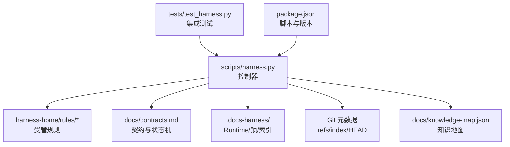
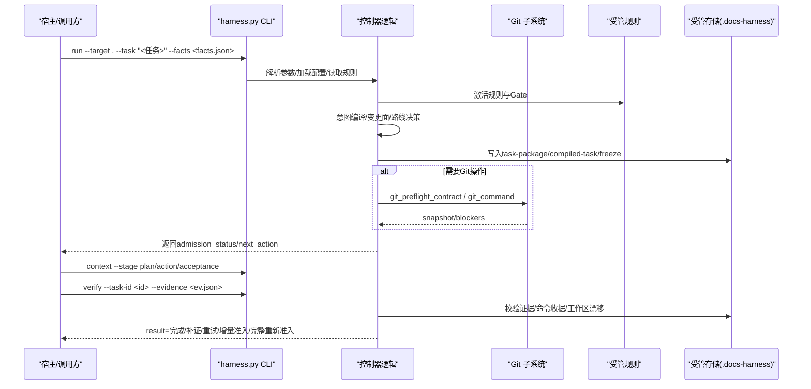
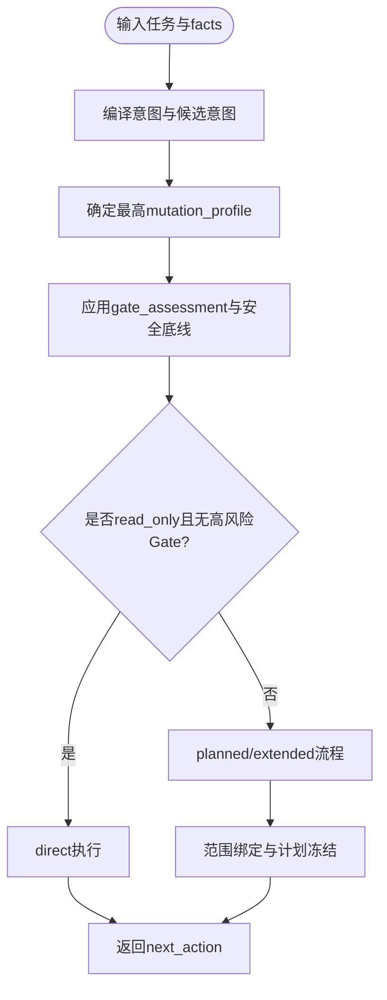
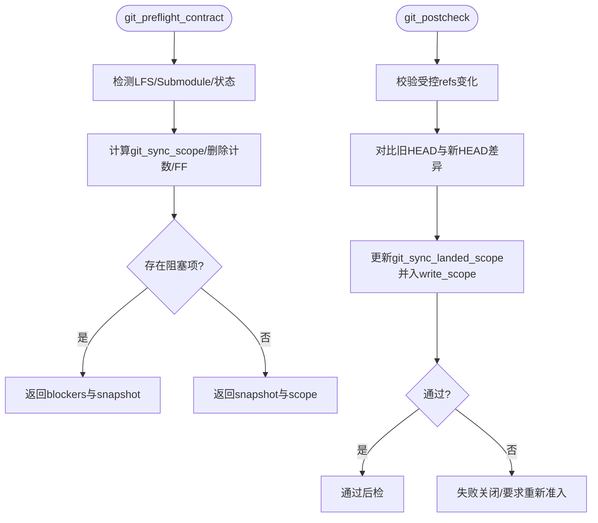
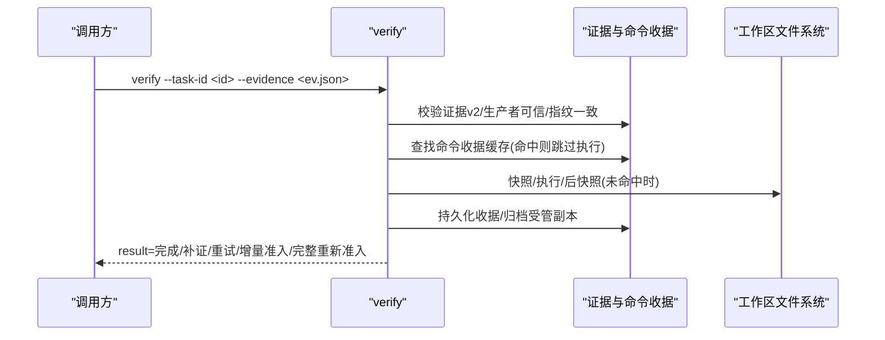
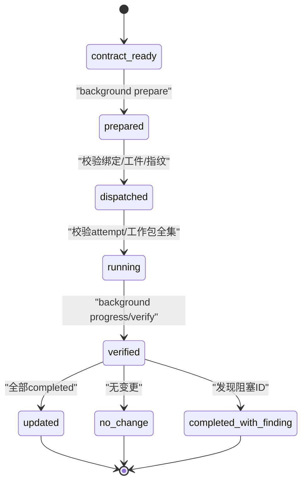
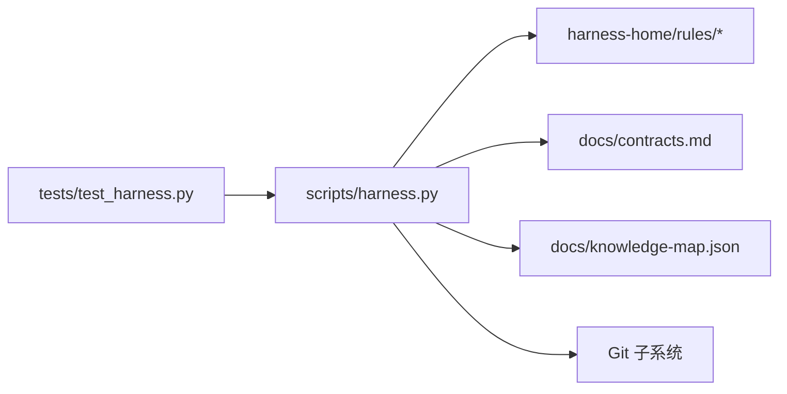

# 项目概述

<cite>
**本文引用的文件**   
- [package.json](file://package.json)
- [SKILL.md](file://SKILL.md)
- [scripts/harness.py](file://scripts/harness.py)
- [docs/contracts.md](file://docs/contracts.md)
- [docs/architecture.md](file://docs/architecture.md)
- [harness-home/rules/INDEX.md](file://harness-home/rules/INDEX.md)
- [tests/test_harness.py](file://tests/test_harness.py)
</cite>

## 目录
1. [简介](#简介)
2. [项目结构](#项目结构)
3. [核心组件](#核心组件)
4. [架构总览](#架构总览)
5. [详细组件分析](#详细组件分析)
6. [依赖关系分析](#依赖关系分析)
7. [性能与可观测性](#性能与可观测性)
8. [安装与快速上手](#安装与快速上手)
9. [CLI 命令接口与数据格式](#cli-命令接口与数据格式)
10. [事件系统与证据链](#事件系统与证据链)
11. [故障排查指南](#故障排查指南)
12. [结论](#结论)

## 简介
Docs Harness 是一个独立、意图驱动、失败关闭的文档治理与任务控制工具。它通过“意图识别 + 风险门控 + 证据链管理 + 后台任务治理”的组合，为项目的文档与知识生命周期提供强约束的执行环境：
- 意图驱动：从自然语言任务中编译出受控意图（query/audit/git_inspect/git_fetch/git_sync/modify/external_write），并据此确定变更面与执行路线。
- 风险门控：按产品、架构、安全、数据破坏、外部发布等 Gate 进行准入判定；支持宿主权威声明 gate_assessment，但安全底线不可豁免。
- 证据链管理：v2 证据收据绑定 task/target/package/fingerprint/producer/ttl/read_set/write_set，验证命令逐项缓存与复用，工作区漂移自动归因或阻断。
- 后台任务治理：统一 background job 状态机（direct/goal/phased），控制面由 CLI 维护，业务面仅写受管范围，复杂流程严格顺序校验。

该工具不替代 agent-docs-harness，也不自动提交、推送、发布或修改 .gitignore，所有关键操作均遵循契约与失败关闭策略。

**章节来源**
- [SKILL.md:1-105](file://SKILL.md#L1-L105)
- [docs/contracts.md:1-370](file://docs/contracts.md#L1-L370)

## 项目结构
- scripts/harness.py：控制器源码真源，负责项目安装与升级、任务准入、上下文、验收、知识生命周期和后台 Job 状态机。
- harness-home/rules/*：发布包内受管规则快照，随 project init/upgrade 同步到目标项目的 .docs-harness/harness-home/rules/。
- docs/contracts.md：对外行为与合同定义（task-package/v2、evidence-receipt/v2、Git 状态合同、退出码等）。
- docs/architecture.md：当前结构与事实来源说明。
- package.json：版本与脚本入口（self-test/pack:check）。
- tests/test_harness.py：覆盖安装、Git 预检/后检、意图路由、证据与 verify、后台 Job 等关键路径。

**图表来源**
- [docs/architecture.md:1-26](file://docs/architecture.md#L1-L26)
- [docs/contracts.md:1-370](file://docs/contracts.md#L1-L370)

**章节来源**
- [docs/architecture.md:1-26](file://docs/architecture.md#L1-L26)
- [package.json:1-23](file://package.json#L1-L23)

## 核心组件
- 意图与变更面编译器：将用户任务文本与 facts 编译为 task_intent、candidate_intents、mutation_profile、write_scope/git_scope/external_scope，决定 allowed_actions 与执行路线。
- 风险门控系统：GATE_ORDER 与 GATE_DEFS 定义产品/架构/安全/数据破坏/发布/前端/诊断/测试/审查/代码/文档等 Gate；支持 gate_assessment 权威声明与安全底线强制兜底。
- 证据与验收系统：evidence-receipt/v2 绑定任务、目标、包指纹、可信生产者、时间戳与读写集；verification command receipt 逐项缓存；verify 五级处置（provide_evidence/refresh_evidence/retry_verification/incremental_admission/full_readmission）。
- Git 交付检查：git_preflight_contract 与 git_postcheck 对 fetch/sync 做远端引用、LFS/Submodule、脏工作区、删除阈值、fast-forward 等检查，生成 snapshot 与 diff scope。
- 后台 Job 治理：background prepare/dispatch/progress/verify/retry/prune，contract_ready→prepare→dispatched→running→verify 序列，复杂路线（goal/phased）需冻结 Plan/Progress 并由 CLI 控制。
- 质量账本：按需 add/read，脱敏记录复盘经验，不自动注入全量。

**章节来源**
- [scripts/harness.py:197-390](file://scripts/harness.py#L197-L390)
- [docs/contracts.md:9-221](file://docs/contracts.md#L9-L221)
- [docs/contracts.md:97-163](file://docs/contracts.md#L97-L163)
- [docs/contracts.md:303-348](file://docs/contracts.md#L303-L348)

## 架构总览
Docs Harness 以 CLI 为中心，围绕“任务包—上下文—证据—验收—后台 Job—知识地图”形成闭环。Git 与非 Git 项目分别使用不同 Runtime 根目录，控制面与业务面严格分离，所有关键对象均有受管副本与指纹校验。

**图表来源**
- [scripts/harness.py:10160-10360](file://scripts/harness.py#L10160-L10360)
- [docs/contracts.md:9-221](file://docs/contracts.md#L9-L221)

## 详细组件分析

### 意图与风险门控
- 意图集合：query/audit/git_inspect/git_fetch/git_sync/modify/external_write，各自映射默认 mutation_profile 与执行路线。
- 混合意图：保留全部 candidate_intents，未来子句进入 deferred_intents，最终 Gate 取最高变更面与风险结果。
- Gate 声明：gate_assessment.gates 与 rationale 作为权威语义判断；安全底线 security-sensitive/destructive-data/release-external 不可豁免，文本触发使用精确词表与否定守卫。
- 路径范围：只接受项目内相对路径/glob/受控 Git 资源，自然语言边界应放入任务约束而非伪装成路径。

**图表来源**
- [scripts/harness.py:197-390](file://scripts/harness.py#L197-L390)
- [docs/contracts.md:9-48](file://docs/contracts.md#L9-L48)

**章节来源**
- [scripts/harness.py:197-390](file://scripts/harness.py#L197-L390)
- [docs/contracts.md:9-48](file://docs/contracts.md#L9-L48)

### Git 预检与后检
- preflight：校验 LFS/Submodule、脏工作区、删除阈值、fast-forward、ref 命名空间，生成 snapshot 与 blockers。
- postcheck：验证远端引用变化、HEAD/index/worktree 不变（fetch）、diff scope 与 landed scope（sync），越界或漂移导致重新准入。

**图表来源**
- [scripts/harness.py:677-800](file://scripts/harness.py#L677-L800)
- [docs/contracts.md:97-133](file://docs/contracts.md#L97-L133)

**章节来源**
- [scripts/harness.py:677-800](file://scripts/harness.py#L677-L800)
- [docs/contracts.md:97-133](file://docs/contracts.md#L97-L133)

### 证据链与验收
- evidence-receipt/v2：绑定 task_id/target_identity/package_fingerprint/producer/command_argv_digest/cwd/start/end/ttl/exit_code/output_digest/read_set/write_set。
- verification command receipt：按 argv/produces/输入指纹缓存，命中则跳过执行；volatile 新建容忍但同名已有文件修改/删除仍阻断。
- verify 五级处置：provide_evidence/refresh_evidence/retry_verification/incremental_admission/full_readmission，对应不同退出码与 package revision 策略。

**图表来源**
- [docs/contracts.md:165-221](file://docs/contracts.md#L165-L221)
- [docs/contracts.md:153-163](file://docs/contracts.md#L153-L163)

**章节来源**
- [docs/contracts.md:165-221](file://docs/contracts.md#L165-L221)
- [docs/contracts.md:153-163](file://docs/contracts.md#L153-L163)

### 后台任务治理
- 路线：background_direct/background_goal/background_goal_phased；复杂路线需 prepare→dispatched→running→progress→verify。
- 控制面：job.json/plan.json/progress.json/events.jsonl/锁与索引由 CLI 维护；业务面仅允许 allowed_write_scope，禁止写入 .git/**/.docs-harness/**。
- 验收：updated/no_change 要求全部 work_package completed；completed_with_finding 仅允许 completed/blocked；retry 归档旧 attempt 并刷新基线。

**图表来源**
- [docs/contracts.md:303-348](file://docs/contracts.md#L303-L348)

**章节来源**
- [docs/contracts.md:303-348](file://docs/contracts.md#L303-L348)

### 质量账本
- 按需 add/read，限制大小与字段，避免自动注入全量；查询按任务编号或关键词检索。

**章节来源**
- [SKILL.md:91-100](file://SKILL.md#L91-L100)

## 依赖关系分析
- 控制器依赖：
  - 受管规则：harness-home/rules/* 固定快照，运行时不得依赖绝对路径。
  - 契约与状态机：docs/contracts.md 定义 task-package/evidence/Git/退出码等。
  - 知识地图：docs/knowledge-map.json 用于功能分类与 Gate 类别选择。
  - Git 子系统：git_command/git_preflight_contract/git_postcheck 等。
- 测试依赖：tests/test_harness.py 覆盖安装、Git 预检/后检、意图路由、证据与 verify、后台 Job 等。

**图表来源**
- [docs/architecture.md:1-26](file://docs/architecture.md#L1-L26)
- [tests/test_harness.py:1-800](file://tests/test_harness.py#L1-L800)

**章节来源**
- [docs/architecture.md:1-26](file://docs/architecture.md#L1-L26)
- [tests/test_harness.py:1-800](file://tests/test_harness.py#L1-L800)

## 性能与可观测性
- 效率事件：event/v2 仅保存有界字段（phase/duration_ms/context_cache_hit/readmission_count/evidence_round_count 等），不保存敏感内容。
- 命令收据缓存：verification command receipt 命中即跳过执行，减少重复 I/O 与耗时。
- 上下文复用：context-receipt/v2 跨阶段复用，避免重复加载规则与项目事实正文。

**章节来源**
- [docs/contracts.md:283-302](file://docs/contracts.md#L283-L302)
- [docs/contracts.md:222-234](file://docs/contracts.md#L222-L234)

## 安装与快速上手
- 新项目安装：创建最小知识骨架，执行 knowledge estimate，返回 knowledge_bootstrap 后台合同；不等待知识生成，不自动修改 .gitignore/提交/推送/发布。
- 已有 docs 的项目：安装阶段零文档内容写入，先审计缺口，需用户同意后再创建后台 Job。
- 自检：运行 self-test 验证规则与控制器一致性。

示例命令（参考 SKILL.md）：
- 初始化项目：python3 scripts/harness.py project init --target <project> --json
- 自检：python3 scripts/harness.py self-test --target . --json

**章节来源**
- [SKILL.md:13-24](file://SKILL.md#L13-L24)
- [package.json:17-21](file://package.json#L17-L21)

## CLI 命令接口与数据格式
- 主命令族：run、context、progress、verify、task、ledger、knowledge、background、project、self-test。
- 通用参数：--target 与 --json；文件型参数仅接受路径，不接受内联内容。
- 典型流程：
  - run：任务路由、任务包编译与执行准入，支持 --task/--task-id/--new-task/--facts/--plan/--authorization/--scope/--feature/--action/--success。
  - context：按阶段加载精确上下文并写回执（plan/action/acceptance）。
  - verify：同源验收、补证或重新准入，支持 --evidence 多次传入。
  - background：estimate/list/status/prepare/progress/dispatch/verify/retry/prune。
  - project：init/upgrade/uninstall/check/diff/rollback-check。

退出码约定：
- 0：成功；只有 verify.result=完成 表示父任务完成
- 1：项目检查/自检/完整性读取失败
- 2：输入/合同/绑定/状态无效
- 3：需要方案/授权/证据/迁移/用户输入或 Git 交付
- 4：范围/漂移/Gate/远端/授权/规则变化，必须重新准入

**章节来源**
- [scripts/harness.py:10160-10360](file://scripts/harness.py#L10160-L10360)
- [docs/contracts.md:359-370](file://docs/contracts.md#L359-L370)

## 事件系统与证据链
- 事件：event/v2 仅记录有界字段，确保隐私与效率；每次 verify 入口写入结构化事件。
- 证据：evidence-receipt/v2 绑定任务、目标、包指纹、生产者、时间戳与读写集；验证命令收据逐项缓存与复用。
- 工作区漂移：freeze.json.workspace_snapshot 为首次基线；verify 输出 task_write_set/read_set/concurrent_drift/unattributed_drift，阻断规则明确。

**章节来源**
- [docs/contracts.md:283-302](file://docs/contracts.md#L283-L302)
- [docs/contracts.md:165-221](file://docs/contracts.md#L165-L221)
- [docs/contracts.md:134-163](file://docs/contracts.md#L134-L163)

## 故障排查指南
- 常见错误与处理：
  - invalid_scope_description：路径范围包含自然语言描述，应改为项目内相对路径/glob。
  - git_remote_unavailable/git_remote_ref_missing：远端不可用或 ref 不存在，检查 remote URL 与分支名。
  - git_preflight_failed：LFS/Submodule 不可用或状态异常，补齐依赖或修复 submodule。
  - blocked：脏工作区与 sync 范围重叠、非 fast-forward、删除数量超阈值等，清理工作区或调整范围。
  - provide_evidence/refresh_evidence/retry_verification：按提示补证据、重读漂移路径或重试命令。
  - full_readmission：范围/高风险合同/规则变化，需完整重新准入。
- 调试建议：
  - 使用 --json 输出结构化响应，便于自动化处理。
  - 查看 .docs-harness/runs 与 .docs-harness/background 下的控制面工件，定位问题。
  - 通过 task list/status/migrate/cancel/archive/prune 管理任务生命周期。

**章节来源**
- [docs/contracts.md:153-163](file://docs/contracts.md#L153-L163)
- [scripts/harness.py:677-800](file://scripts/harness.py#L677-L800)
- [tests/test_harness.py:685-757](file://tests/test_harness.py#L685-L757)

## 结论
Docs Harness 以意图驱动与失败关闭为核心，结合风险门控、证据链管理与后台任务治理，为文档与知识生命周期提供了强约束、可审计、可扩展的控制面。其 CLI 接口清晰、契约稳定、测试覆盖全面，适合在复杂项目中作为统一的文档治理与任务控制中枢。