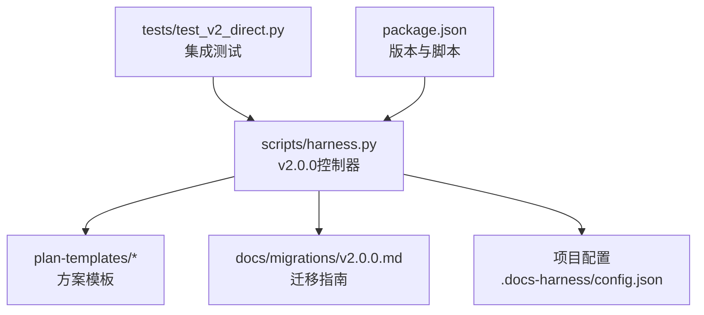
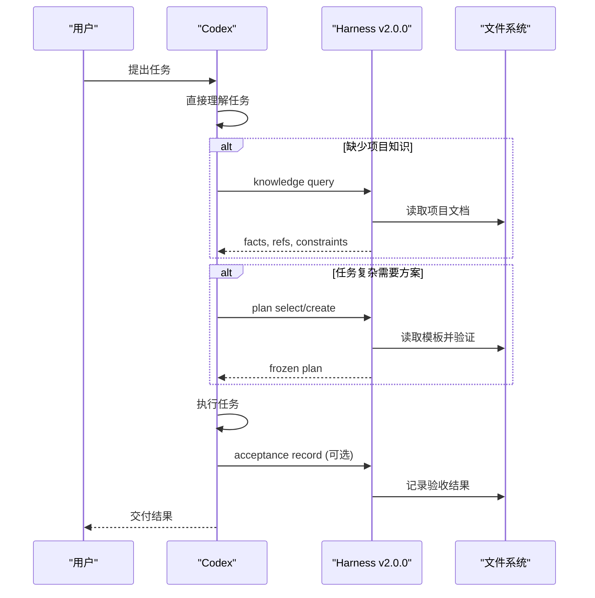
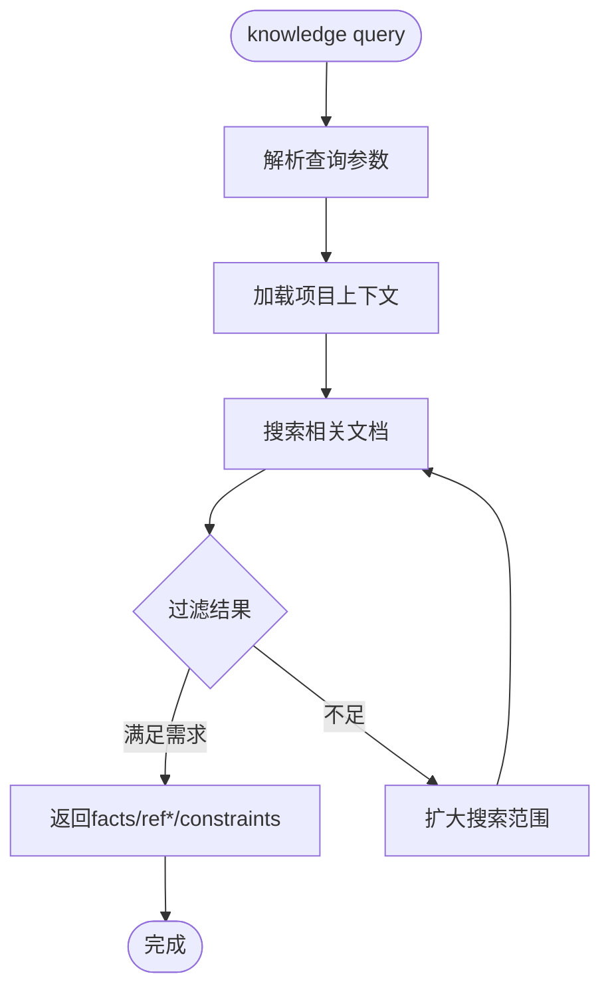
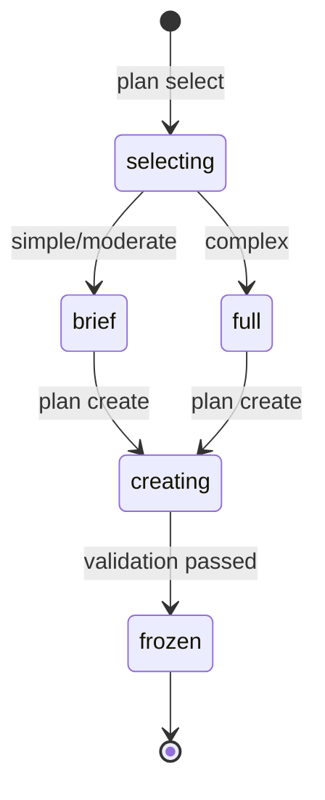
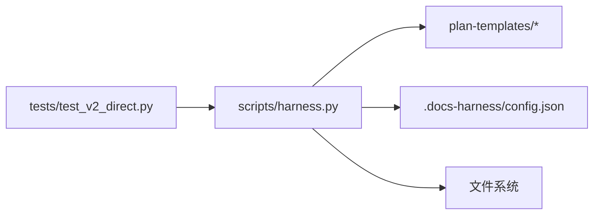

# 项目概述

<cite>
**本文引用的文件**   
- [package.json](file://package.json)
- [SKILL.md](file://SKILL.md)
- [scripts/harness.py](file://scripts/harness.py)
- [docs/migrations/v2.0.0.md](file://docs/migrations/v2.0.0.md)
- [docs/plans/docs-harness-v2.0.0-direct-first-plan.md](file://docs/plans/docs-harness-v2.0.0-direct-first-plan.md)
- [tests/test_v2_direct.py](file://tests/test_v2_direct.py)
</cite>

## 更新摘要
**所做更改**   
- 完全重构了核心架构描述，从意图门控工作流改为直接优先方法
- 移除了所有关于Gate、Evidence、Verify和后台任务治理的内容
- 更新了CLI命令接口，只保留knowledge、plan、acceptance、project等v2.0.0命令
- 重新设计了使用模式和安装指南
- 更新了故障排查指南以反映新的架构

## 目录
1. [简介](#简介)
2. [项目结构](#项目结构)
3. [核心组件](#核心组件)
4. [架构总览](#架构总览)
5. [详细组件分析](#详细组件分析)
6. [依赖关系分析](#依赖关系分析)
7. [性能与可观测性](#性能与可观测性)
8. [安装与快速上手](#安装与快速上手)
9. [CLI 命令接口与数据格式](#cli-命令接口与数据格式)
10. [故障排查指南](#故障排查指南)
11. [结论](#结论)

## 简介
Docs Harness 是一个可选的项目辅助工具，采用默认直跑、按需知识、方案模板和真实验收的设计理念。在v2.0.0版本中，它完成了从强制治理流水线到灵活辅助工具的彻底转型：

- **默认直跑**：普通任务由Codex直接执行，不再经过Harness的任务准入流程
- **按需知识**：只在缺少关键项目事实时才启用知识查询，保持上下文简洁
- **方案模板**：为复杂任务提供结构化规划能力，但仅在使用时激活
- **真实验收**：记录实际功能验证结果，而非控制合同状态
- **单向迁移**：从旧版本升级时清理遗留工件，不保留兼容入口

该工具不再管理任务生命周期、风险门控或证据链，而是作为Codex的可选增强能力存在。

**章节来源**
- [SKILL.md:1-98](file://SKILL.md#L1-L98)
- [docs/migrations/v2.0.0.md:1-171](file://docs/migrations/v2.0.0.md#L1-L171)

## 项目结构
- scripts/harness.py：v2.0.0控制器源码，实现知识查询、方案选择、验收记录和项目管理
- plan-templates/*：方案模板定义，支持不同复杂度和领域场景
- docs/migrations/v2.0.0.md：单向迁移指南，指导从1.x升级到2.0.0
- docs/plans/docs-harness-v2.0.0-direct-first-plan.md：产品设计与实施方案
- package.json：版本信息和包配置，包含测试脚本
- tests/test_v2_direct.py：v2.0.0功能的完整测试覆盖

**图表来源**
- [scripts/harness.py:2040-2103](file://scripts/harness.py#L2040-L2103)
- [package.json:1-31](file://package.json#L1-L31)

**章节来源**
- [scripts/harness.py:1-2154](file://scripts/harness.py#L1-L2154)
- [package.json:1-31](file://package.json#L1-L31)

## 核心组件
- **知识查询系统**：按需检索项目事实，支持范围限制、字符数限制和历史排除
- **方案模板系统**：根据任务复杂度（simple/moderate/complex）和领域（general/frontend_ui/backend_service等）选择合适模板
- **验收记录系统**：记录真实行为验证结果，区分合同检查、行为验收和用户验收
- **项目管理器**：负责项目初始化、单向升级、检查和卸载，确保配置一致性
- **版本真源检查**：验证发布包与源码的一致性，防止发布错误

**章节来源**
- [scripts/harness.py:2048-2103](file://scripts/harness.py#L2048-L2103)
- [tests/test_v2_direct.py:135-185](file://tests/test_v2_direct.py#L135-L185)

## 架构总览
v2.0.0采用极简架构，围绕"直接执行 + 按需辅助"理念设计。Codex默认直接处理任务，仅在需要时调用Harness的独立能力。

**图表来源**
- [scripts/harness.py:2121-2154](file://scripts/harness.py#L2121-L2154)
- [docs/plans/docs-harness-v2.0.0-direct-first-plan.md:284-385](file://docs/plans/docs-harness-v2.0.0-direct-first-plan.md#L284-L385)

## 详细组件分析

### 知识查询系统
- **触发条件**：当Codex缺少关键项目事实且这些事实会影响目标、范围、方案或验收时
- **查询参数**：支持query、scope、limit、max-chars等精确控制
- **输出格式**：facts、refs、constraints、conflicts、omitted，不包含候选排序过程
- **安全边界**：不跟随外部符号链接，默认排除历史文档

**图表来源**
- [tests/test_v2_direct.py:135-179](file://tests/test_v2_direct.py#L135-L179)

**章节来源**
- [tests/test_v2_direct.py:135-179](file://tests/test_v2_direct.py#L135-L179)

### 方案模板系统
- **复杂度选择**：none/brief/full三个层级，对应不同的方案深度
- **领域模板**：general/frontend_ui/backend_service/bugfix/architecture/migration_release
- **字段验证**：严格的schema校验，防止无效字段进入方案
- **冻结机制**：创建后不可修改，保证执行一致性

**图表来源**
- [tests/test_v2_direct.py:235-307](file://tests/test_v2_direct.py#L235-L307)

**章节来源**
- [tests/test_v2_direct.py:235-307](file://tests/test_v2_direct.py#L235-L307)

### 验收记录系统
- **三层分离**：contract_check、behavior_acceptance、user_acceptance
- **层级约束**：L1不能冒充L3/L4/L5，静态检查不能代替运行时验证
- **证据要求**：行为验收必须提供有效证据引用
- **用户确认**：CLI不能自行声明用户已接受，必须由用户直接确认

**图表来源**
- [tests/test_v2_direct.py:606-768](file://tests/test_v2_direct.py#L606-L768)

**章节来源**
- [tests/test_v2_direct.py:606-768](file://tests/test_v2_direct.py#L606-L768)

### 项目管理器
- **初始化**：安装v6配置、受管入口、控制器和方案模板
- **单向升级**：预览→应用模式，清理旧工件但不删除项目内容
- **安全检查**：拒绝符号链接、冲突文件和不安全路径
- **卸载保护**：只移除受管文件，保留项目文档和用户修改

**章节来源**
- [tests/test_v2_direct.py:308-574](file://tests/test_v2_direct.py#L308-L574)

## 依赖关系分析
- **控制器依赖**：
  - 方案模板：plan-templates/* 固定快照，通过指纹验证
  - 项目配置：.docs-harness/config.json v6 schema
  - 文件系统：读写项目文档和受管文件
- **测试依赖**：tests/test_v2_direct.py 覆盖所有v2.0.0功能路径

**图表来源**
- [scripts/harness.py:2040-2103](file://scripts/harness.py#L2040-L2103)
- [tests/test_v2_direct.py:1-772](file://tests/test_v2_direct.py#L1-L772)

**章节来源**
- [scripts/harness.py:2040-2103](file://scripts/harness.py#L2040-L2103)
- [tests/test_v2_direct.py:1-772](file://tests/test_v2_direct.py#L1-L772)

## 性能与可观测性
- **轻量级设计**：v2.0.0控制器仅2154行代码，相比1.x大幅简化
- **按需激活**：知识、方案、验收都只在需要时调用，避免不必要的开销
- **无遥测**：不收集usage metrics或任务指标，保护隐私
- **快速启动**：简单的命令行接口，无复杂的初始化流程

**章节来源**
- [scripts/harness.py:1-2154](file://scripts/harness.py#L1-L2154)

## 安装与快速上手
- **新项目安装**：`python3 scripts/harness.py project init --target <project>`
- **现有项目升级**：先预览 `project upgrade --target <project>`，再应用 `project upgrade --target <project> --apply`
- **自检**：`python3 scripts/harness.py self-test --target . --json`

示例用法：
- 知识查询：`python3 scripts/harness.py knowledge query --target . --query "API认证流程" --json`
- 方案选择：`python3 scripts/harness.py plan select --target . --complexity complex --surface backend_service --json`
- 验收记录：`python3 scripts/harness.py acceptance record --target . --input acceptance.json --json`

**章节来源**
- [SKILL.md:89-98](file://SKILL.md#L89-L98)
- [tests/test_v2_direct.py:330-373](file://tests/test_v2_direct.py#L330-L373)

## CLI 命令接口与数据格式
- **主命令族**：knowledge、plan、acceptance、project、release、self-test
- **通用参数**：--target 与 --json；文件型参数仅接受路径
- **知识查询**：knowledge query --query "<查询>" --scope <范围> --limit <数量> --max-chars <字符数>
- **方案管理**：plan select/create --level <none|brief|full> --profile <领域>
- **验收记录**：acceptance record --input <acceptance.json>
- **项目管理**：project init/upgrade/check/diff/uninstall [--apply]

退出码约定：
- 0：成功
- 1：项目检查/自检失败
- 2：输入/合同/绑定无效
- 3：需要用户输入或Git交付

**章节来源**
- [scripts/harness.py:2040-2103](file://scripts/harness.py#L2040-L2103)
- [tests/test_v2_direct.py:110-133](file://tests/test_v2_direct.py#L110-L133)

## 故障排查指南
- **常见错误与处理**：
  - invalid_target：项目目录不存在
  - invalid_json：JSON文件格式错误
  - install_conflict：安装冲突，如符号链接或文件覆盖
  - legacy_document_cleanup_conflict：迁移时发现不安全路径
  - invalid_plan_selection：方案选择不符合schema
  - acceptance_evidence_missing：验收证据文件缺失
  - user_confirmation_required：需要用户确认但不能自动完成

- **调试建议**：
  - 使用 --json 输出结构化响应
  - 查看 .docs-harness/config.json 确认配置状态
  - 运行 project check 检查项目完整性
  - 通过 project diff 查看待处理的受管变化

**章节来源**
- [tests/test_v2_direct.py:374-605](file://tests/test_v2_direct.py#L374-L605)

## 结论
Docs Harness v2.0.0完成了从强制治理工具到灵活辅助工具的彻底转型。通过默认直跑、按需知识、方案模板和真实验收的设计理念，它为Codex提供了强大的可选增强能力，同时保持了极低的侵入性和学习成本。其简洁的架构、清晰的CLI接口和全面的测试覆盖，使其成为现代软件开发中可靠的文档与知识管理辅助工具。