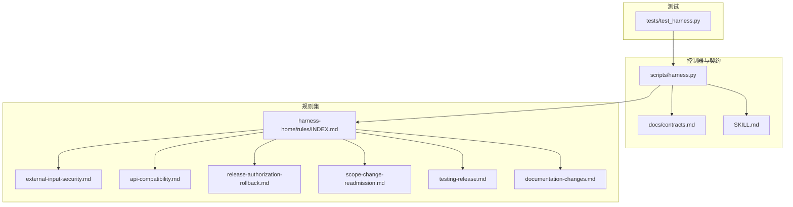
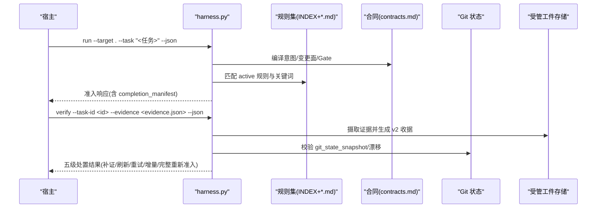
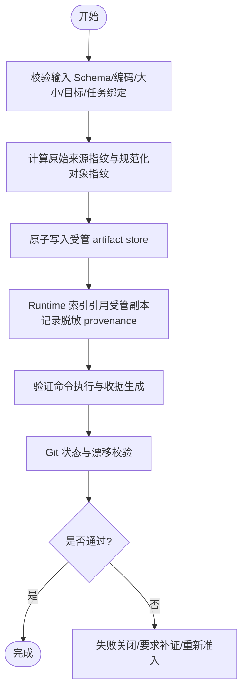
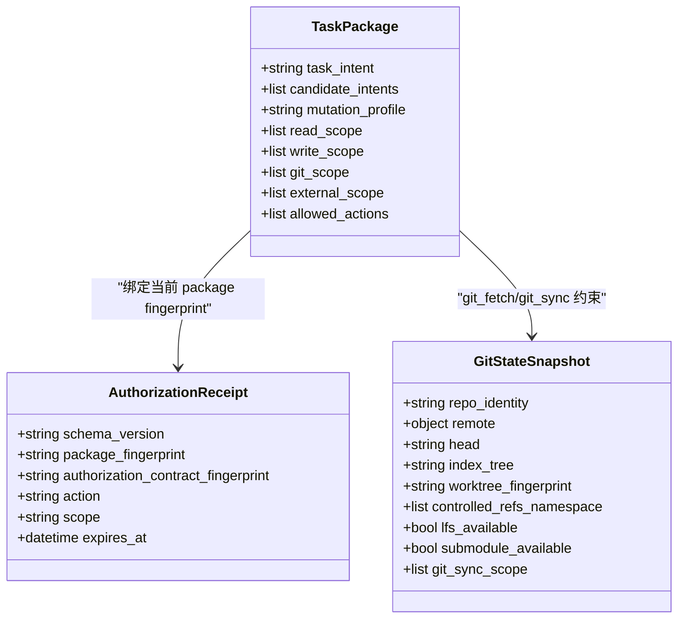
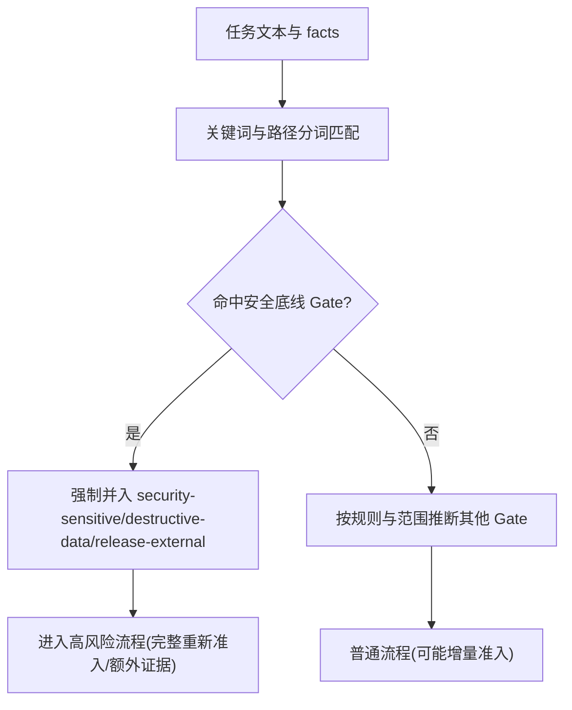
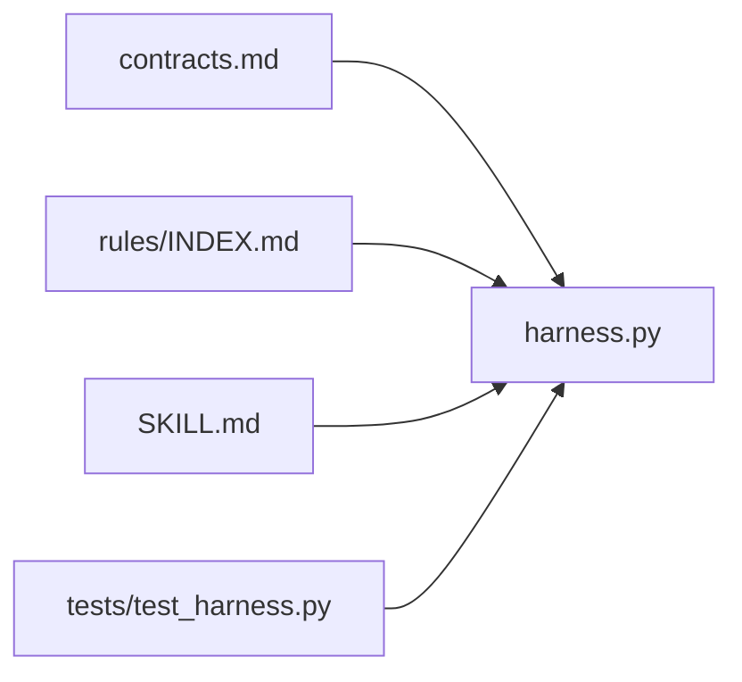

# 安全考虑

<cite>
**本文引用的文件**   
- [harness.py](file://scripts/harness.py)
- [contracts.md](file://docs/contracts.md)
- [SKILL.md](file://SKILL.md)
- [INDEX.md](file://harness-home/rules/INDEX.md)
- [external-input-security.md](file://harness-home/rules/external-input-security.md)
- [api-compatibility.md](file://harness-home/rules/api-compatibility.md)
- [release-authorization-rollback.md](file://harness-home/rules/release-authorization-rollback.md)
- [scope-change-readmission.md](file://harness-home/rules/scope-change-readmission.md)
- [testing-release.md](file://harness-home/rules/testing-release.md)
- [documentation-changes.md](file://harness-home/rules/documentation-changes.md)
- [test_harness.py](file://tests/test_harness.py)
</cite>

## 目录
1. [引言](#引言)
2. [项目结构](#项目结构)
3. [核心组件](#核心组件)
4. [架构总览](#架构总览)
5. [详细组件分析](#详细组件分析)
6. [依赖关系分析](#依赖关系分析)
7. [性能与安全权衡](#性能与安全权衡)
8. [故障排查指南](#故障排查指南)
9. [结论](#结论)
10. [附录：安全配置最佳实践与威胁防护](#附录：安全配置最佳实践与威胁防护)

## 引言
本文件面向 Docs Harness 的安全设计，围绕输入验证、权限控制、审计日志、数据保护、高风险 Gate 识别以及配置与威胁防护进行系统化说明。内容基于控制器实现、合同规范与规则集，确保读者既能把握整体安全边界，也能落地到具体实现要点。

## 项目结构
Docs Harness 以独立控制器脚本为核心，配合“规则快照”和“合同文档”共同构成安全治理面。关键位置包括：
- 控制器入口与核心逻辑：scripts/harness.py
- 契约与验收模型：docs/contracts.md
- 技能使用说明（含任务入口、Gate 判定、证据与验证流程）：SKILL.md
- 通用规则索引与生效规则清单：harness-home/rules/INDEX.md
- 各规则细则：harness-home/rules/*.md
- 测试用例覆盖关键路径与断言：tests/test_harness.py

图表来源
- [harness.py:1-120](file://scripts/harness.py#L1-L120)
- [contracts.md:1-100](file://docs/contracts.md#L1-L100)
- [SKILL.md:25-60](file://SKILL.md#L25-L60)
- [INDEX.md:1-41](file://harness-home/rules/INDEX.md#L1-L41)

章节来源
- [harness.py:1-120](file://scripts/harness.py#L1-L120)
- [contracts.md:1-100](file://docs/contracts.md#L1-L100)
- [SKILL.md:25-60](file://SKILL.md#L25-L60)
- [INDEX.md:1-41](file://harness-home/rules/INDEX.md#L1-L41)

## 核心组件
- 控制器（harness.py）：负责任务编译、Gate 推断、范围与授权校验、证据与验证收据处理、Git 状态检查、工作区漂移归因、后台 Job 治理等。
- 合同（contracts.md）：定义 task-package/v2、evidence-receipt/v2、verification-command-receipt/v1、上下文与授权收据、Git 状态合同、v1→v2 迁移等。
- 规则集（rules/*.md + INDEX.md）：以 active 快照形式随项目安装，按指纹校验与 Gate 匹配驱动准入与阻断。
- 技能说明（SKILL.md）：明确 run/verify 命令、Gate 声明与底线、证据与临时文件策略、自动归因与增量准入等。
- 测试（test_harness.py）：覆盖规则 ID、活跃规则集合、Gate 命中与处置分支等。

章节来源
- [harness.py:1-200](file://scripts/harness.py#L1-L200)
- [contracts.md:1-200](file://docs/contracts.md#L1-L200)
- [SKILL.md:25-60](file://SKILL.md#L25-L60)
- [INDEX.md:1-41](file://harness-home/rules/INDEX.md#L1-L41)
- [test_harness.py:25-44](file://tests/test_harness.py#L25-L44)

## 架构总览
下图展示从宿主调用控制器到证据与 Git 校验的端到端流程，体现安全 Gate、证据与验证收据在流水线中的位置。

图表来源
- [harness.py:1-200](file://scripts/harness.py#L1-L200)
- [contracts.md:1-200](file://docs/contracts.md#L1-L200)
- [SKILL.md:25-60](file://SKILL.md#L25-L60)

## 详细组件分析

### 输入验证机制（外部输入安全、API 兼容性与数据完整性）
- 外部输入安全规则（DH-EXTERNAL-INPUT-SECURITY）
  - 适用条件：触及外部输入、鉴权、授权、秘密、隐私、文件解析或供应链边界时生效。
  - 方案字段：信任边界、最小权限、秘密处理、数据留存、负向路径。
  - 验收证据：security_acceptance，覆盖未授权、畸形输入、敏感信息泄露与失败关闭行为。
  - 失败模式：无法证明边界、数据去向或失败关闭时停止。
- API 兼容性规则（DH-API-COMPATIBILITY）
  - 适用条件：修改 API/Schema/协议/持久化结构/跨模块公共契约或迁移路径。
  - 方案字段：兼容策略、受影响消费者、迁移顺序、可执行回滚路径。
  - 验收证据：contract_acceptance，覆盖新旧消费者、失败路径与迁移验证。
  - 失败模式：未声明消费者、实际范围扩大或回滚不可执行时停止并重新准入。
- 数据完整性与证据收据
  - evidence-receipt/v2 强制绑定 task_id、target_identity、package_fingerprint、producer、argv_digest、cwd、时间戳、exit_code、输出摘要、read_set/write_set。
  - 过期、跨任务/目标/package、不可信生产者、非零退出或摘要无效均拒绝；高风险证据必须来自可信 v2 生产者。
  - 验证命令使用 verification-command-receipt/v1，逐项缓存与复用，仅当输入变化或失败时重跑。
- 工作区与 Git 完整性
  - freeze.json.workspace_snapshot 作为首次基线；verify 输出 task_write_set/read_set/concurrent_drift/unattributed_drift。
  - Git 状态合同包含 repo_identity、remote.url_fingerprint、controlled_refs_namespace、git_sync_scope 等，防止 ref 越界与远端漂移风险。

图表来源
- [contracts.md:165-246](file://docs/contracts.md#L165-L246)
- [contracts.md:97-133](file://docs/contracts.md#L97-L133)
- [SKILL.md:43-57](file://SKILL.md#L43-L57)

章节来源
- [external-input-security.md:1-29](file://harness-home/rules/external-input-security.md#L1-L29)
- [api-compatibility.md:1-29](file://harness-home/rules/api-compatibility.md#L1-L29)
- [contracts.md:165-246](file://docs/contracts.md#L165-L246)
- [contracts.md:97-133](file://docs/contracts.md#L97-L133)
- [SKILL.md:43-57](file://SKILL.md#L43-L57)

### 权限控制策略（授权动作范围、Git 范围限制、外部目标访问控制）
- 授权与范围
  - task-package/v2 明确 mutation_profile、read_scope、write_scope、git_scope、external_scope、allowed_actions。
  - 只读查询使用 read_only + write_scope=[]；Git inspect/fetch/sync 分别对应读取、Git 元数据写入与工作区写入合同。
  - 控制器对 write_scope 内写入默认代铸 workspace_attribution 收据并记录 auto_attributed_paths，可通过配置恢复为补证据流程。
- Git 范围与漂移
  - controlled_refs_namespace 自动包含 origin/HEAD，避免误判 ref 越界；git_sync_landed_scope 累积已落盘文件并并入 write_scope。
  - 远端漂移、ref 越界、非 fast-forward、分支分歧、危险删除、LFS/Submodule 不可验证均失败关闭。
- 外部目标访问控制
  - release-authorization-rollback 规则冻结外部目标、产物身份、授权范围、发布步骤、观测窗口与回滚路径。
  - 必须以目标系统实际状态证明结果；本地构建/测试/提交不能替代外部验收。

图表来源
- [contracts.md:9-48](file://docs/contracts.md#L9-L48)
- [contracts.md:97-133](file://docs/contracts.md#L97-L133)
- [release-authorization-rollback.md:1-29](file://harness-home/rules/release-authorization-rollback.md#L1-L29)

章节来源
- [contracts.md:9-48](file://docs/contracts.md#L9-L48)
- [contracts.md:97-133](file://docs/contracts.md#L97-L133)
- [release-authorization-rollback.md:1-29](file://harness-home/rules/release-authorization-rollback.md#L1-L29)

### 审计日志系统（事件记录规范、敏感信息脱敏、日志完整性保护）
- 事件与收据
  - 控制器记录 auto_attribution 事件与各类 receipt（context、authorization、evidence、verification command）。
  - 证据采用受管副本保存，原始文件事后删除不影响准入；收据保留 artifact_ref 指回副本。
- 敏感信息脱敏
  - 控制器内置敏感信息正则（如私钥头、Bearer token、GitHub PAT），用于扫描与脱敏。
  - 远端 URL 指纹计算前移除用户名、密码、token、查询参数与 fragment，Runtime 不保存原文。
- 日志完整性
  - 所有收据与事件均带指纹与时间戳，禁止篡改；验证命令收据支持缓存键与复用，保证一致性。

章节来源
- [harness.py:193-196](file://scripts/harness.py#L193-L196)
- [contracts.md:222-234](file://docs/contracts.md#L222-L234)
- [contracts.md:97-133](file://docs/contracts.md#L97-L133)
- [SKILL.md:43-57](file://SKILL.md#L43-L57)

### 数据保护机制（工件摄取安全、证据文件保护、临时文件清理）
- 工件摄取安全
  - 文件型输入遵循统一过程：有界读取、Schema/编码/大小/目标/任务绑定校验、指纹计算、原子写入受管 artifact store、Runtime 索引引用受管副本。
- 证据文件保护
  - evidence-receipt/v2 强绑定任务、目标、package、生产者、时间、退出码与摘要；高风险证据需可信 v2 生产者。
  - 证据可简化为 e vidence-declaration/v1 草案，由控制器代铸完整字段并按同等强度校验。
- 临时文件清理
  - 验证期间新建的已知临时副产物进入 volatile_write_set 保持可见；同名已有文件被修改或删除仍阻断。
  - 项目可在配置中追加带固定根目录的 glob 白名单，全局或越界模式拒绝。

章节来源
- [contracts.md:165-246](file://docs/contracts.md#L165-L246)
- [SKILL.md:43-57](file://SKILL.md#L43-L57)

### 高风险 Gate 识别机制（安全敏感变更检测、破坏性数据操作拦截、外部发布风险控制）
- 安全底线 Gate
  - security-sensitive、destructive-data、release-external 为控制器代码强制的安全底线，文本触发使用精确词表并带否定守卫。
  - 宿主可提交 gate_assessment 做权威语义判断，但不得豁免底线 Gate；漏判会记入 floor_added 并强制并入。
- 路径与关键词匹配
  - 路径分词对目录段与文件 stem 做规范化，避免误命中；测试文件与中文描述有特殊识别。
- 破坏性数据与外部发布
  - destructive-data 拦截清空/覆盖/删除数据/迁移数据等操作；release-external 冻结外部目标与回滚能力，要求真实外部状态验收。

图表来源
- [harness.py:263-387](file://scripts/harness.py#L263-L387)
- [SKILL.md:37-41](file://SKILL.md#L37-L41)
- [testing-release.md:1-29](file://harness-home/rules/testing-release.md#L1-L29)

章节来源
- [harness.py:263-387](file://scripts/harness.py#L263-L387)
- [SKILL.md:37-41](file://SKILL.md#L37-L41)
- [testing-release.md:1-29](file://harness-home/rules/testing-release.md#L1-L29)

### 范围变化与重新准入（Git 范围限制与外部目标访问控制）
- 范围变化重新判断规则（DH-SCOPE-CHANGE-READMISSION）
  - 任何未声明范围、目标或动作变化都立即停止，并从 run 入口重新准入。
  - 新范围必须进入新任务包版本，旧上下文、方案和证据不得错误复用。
- Git 范围与漂移
  - 远端漂移重新准入时，单条 run --task-id 即可回到 ready_planned；合同变化则重交方案。
  - git_sync_landed_scope 自动归因 pull 已落盘文件，避免 origin/HEAD 更新误判 ref 越界。

章节来源
- [scope-change-readmission.md:1-29](file://harness-home/rules/scope-change-readmission.md#L1-L29)
- [contracts.md:97-133](file://docs/contracts.md#L97-L133)

### 测试与验收放行（测试层级与产物验证）
- 测试放行规则（DH-TESTING-RELEASE）
  - 区分静态检查、源码测试、运行时验证、产物验证与真实产品验收。
  - 记录实际执行命令、退出码、覆盖范围和失败项；涉及产物或真实流程时不得用源码测试代替。
  - 失败模式：测试未运行、证据过期、目标层级不匹配或未解释失败时不得宣称完成。

章节来源
- [testing-release.md:1-29](file://harness-home/rules/testing-release.md#L1-L29)

### 文档修改规则（真源与索引一致性）
- 文档修改规则（DH-DOCUMENTATION-CHANGES）
  - 唯一真源、需要同步的索引、旧入口与死引用的清理范围必须明确。
  - 事实必须有当前证据，索引与链接有效，旧入口不再参与路由，并完成独立文档审查。

章节来源
- [documentation-changes.md:1-29](file://harness-home/rules/documentation-changes.md#L1-L29)

## 依赖关系分析
- 控制器依赖合同与规则：
  - contracts.md 定义数据结构与验收流程；
  - rules/INDEX.md 管理 active 规则快照与指纹；
  - SKILL.md 提供任务入口与行为约定。
- 测试依赖控制器与规则：
  - tests/test_harness.py 验证规则 ID、活跃规则集合、Gate 命中与处置分支。

图表来源
- [contracts.md:1-100](file://docs/contracts.md#L1-L100)
- [INDEX.md:1-41](file://harness-home/rules/INDEX.md#L1-L41)
- [SKILL.md:25-60](file://SKILL.md#L25-L60)
- [test_harness.py:25-44](file://tests/test_harness.py#L25-L44)

章节来源
- [contracts.md:1-100](file://docs/contracts.md#L1-L100)
- [INDEX.md:1-41](file://harness-home/rules/INDEX.md#L1-L41)
- [SKILL.md:25-60](file://SKILL.md#L25-L60)
- [test_harness.py:25-44](file://tests/test_harness.py#L25-L44)

## 性能与安全权衡
- 证据与验证命令收据缓存：减少重复执行，提升吞吐；仅在输入变化或失败时重跑，兼顾一致性与效率。
- 自动归因：在 write_scope 内默认代铸收据，降低补证成本；可通过配置恢复为显式补证据流程。
- 临时文件容忍：volatile_write_set 允许常见缓存与编辑器临时文件，避免阻塞验证；同名已有文件修改仍阻断，保障完整性。
- Git 漂移优化：git_sync_landed_scope 累积已落盘文件，减少误判与重复准入。

[本节为通用指导，不直接分析具体文件]

## 故障排查指南
- 常见问题定位
  - Gate 误判或遗漏：检查 gate_assessment 与底线词表匹配；确认路径分词与关键词边界。
  - 证据失效或过期：核对 evidence-receipt/v2 绑定字段与 TTL；确认受管副本是否存在。
  - 验证命令失败：查看 verification-command-receipt/v1 缓存键与输入指纹；必要时关闭缓存重跑。
  - Git 漂移与 ref 越界：检查 git_state_snapshot 与 controlled_refs_namespace；确认 git_sync_landed_scope 是否正确归因。
  - 外部发布失败：依据 release-authorization-rollback 规则检查外部目标、产物身份与回滚能力。
- 建议步骤
  - 使用 --json 输出与返回码定位问题；
  - 逐步缩小范围至单一命令或证据；
  - 开启/关闭相关开关（如 command_cache_enabled、auto_attribute_in_scope）对比行为。

章节来源
- [contracts.md:165-246](file://docs/contracts.md#L165-L246)
- [contracts.md:97-133](file://docs/contracts.md#L97-L133)
- [testing-release.md:1-29](file://harness-home/rules/testing-release.md#L1-L29)
- [release-authorization-rollback.md:1-29](file://harness-home/rules/release-authorization-rollback.md#L1-L29)

## 结论
Docs Harness 通过严格的输入验证、明确的权限与范围控制、完善的审计与证据体系、稳健的数据保护与高风险 Gate 识别，构建了端到端的安全治理闭环。结合规则快照与合同约束，能够在复杂协作与多阶段交付中保持可控、可审计与可回滚。

[本节为总结，不直接分析具体文件]

## 附录：安全配置最佳实践与威胁防护
- 安全配置最佳实践
  - 启用严格规则快照与指纹校验，禁止运行时增删规则；
  - 明确 write_scope 与 git_scope，最小权限原则；
  - 配置 verification.volatile_paths 限定临时文件根目录，拒绝越界与绝对路径；
  - 合理设置 verification.command_cache_enabled 与 verification.auto_attribute_in_scope；
  - 对外部发布冻结目标、产物身份与回滚路径，确保真实外部验收。
- 常见威胁与防护
  - 未授权输入与注入：外部输入安全规则与 Schema/编码/大小校验；
  - 敏感信息泄露：敏感正则扫描与脱敏，URL 指纹去敏感；
  - 数据破坏：destructive-data 底线 Gate 拦截；
  - 外部发布风险：release-external 规则与真实外部状态验收；
  - 范围漂移与越界：Git 状态合同与 controlled_refs_namespace；
  - 证据伪造：evidence-receipt/v2 强绑定与受管副本；
  - 临时文件污染：volatile_write_set 与同名文件修改阻断。

[本节为通用指导，不直接分析具体文件]