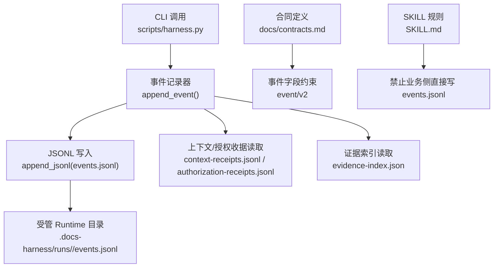
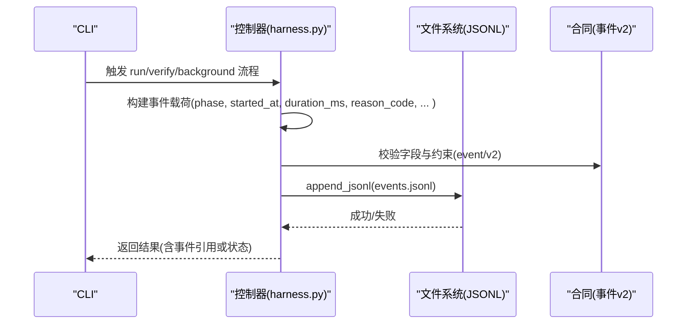
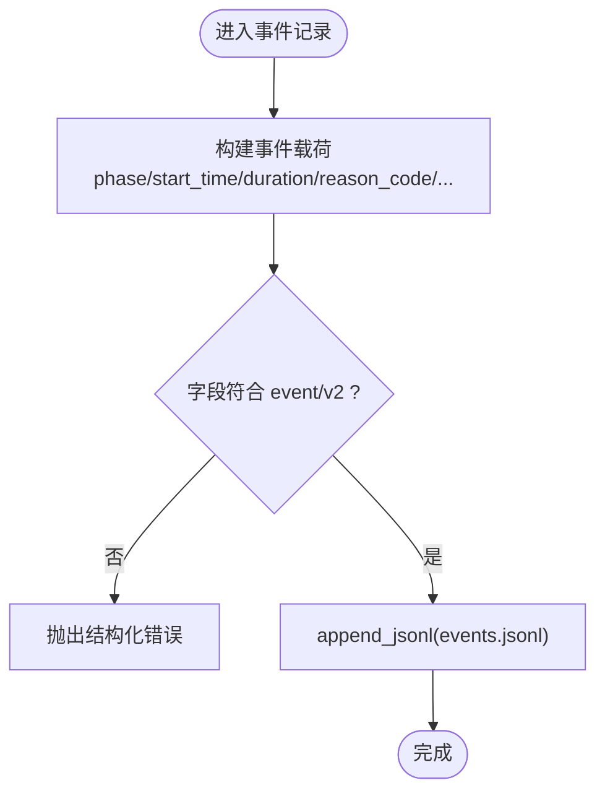
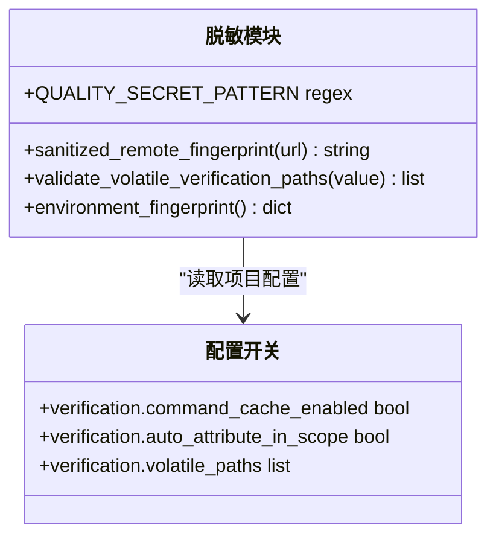
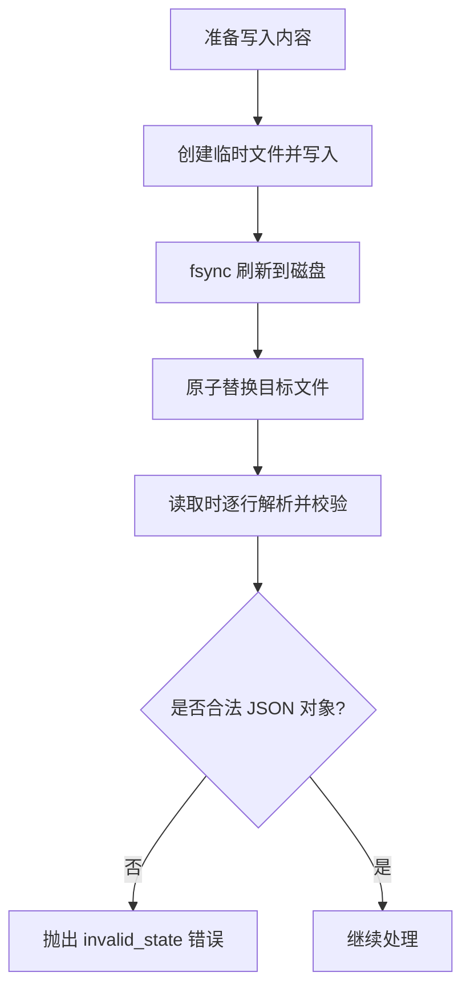
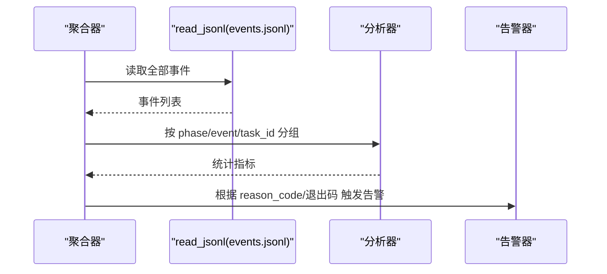
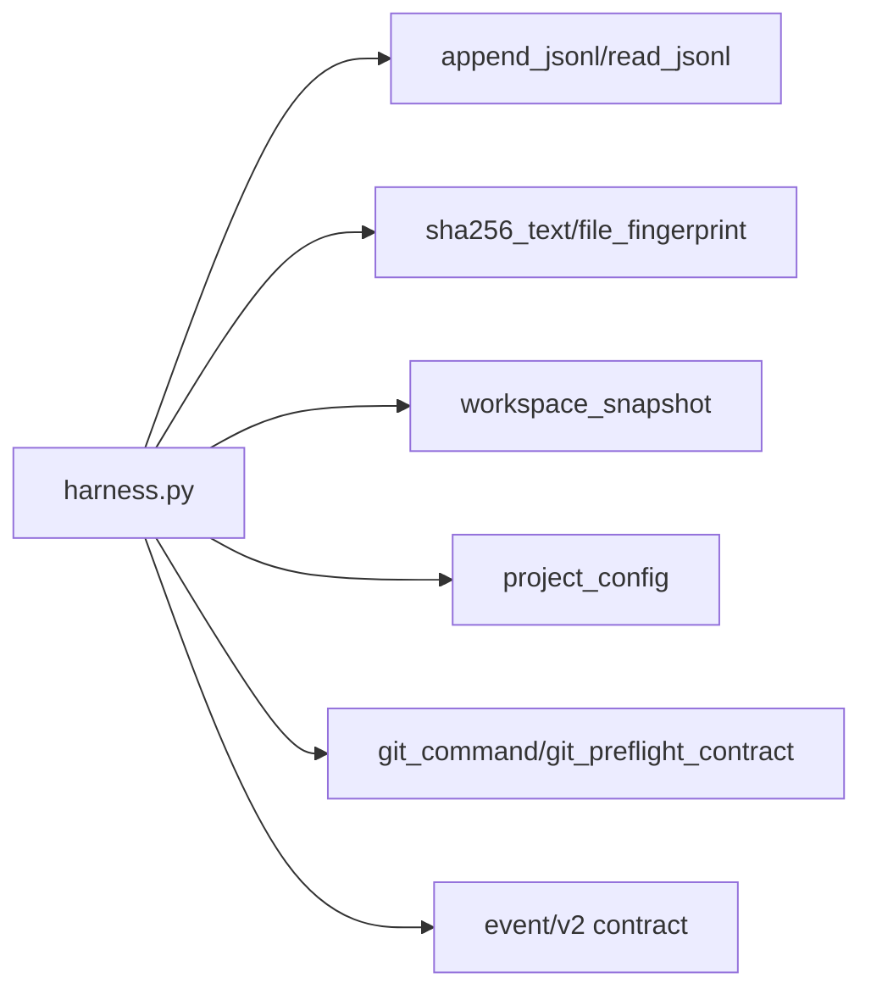

# 审计日志系统

<cite>
**本文引用的文件**   
- [scripts/harness.py](file://scripts/harness.py)
- [docs/contracts.md](file://docs/contracts.md)
- [SKILL.md](file://SKILL.md)
- [tests/test_harness.py](file://tests/test_harness.py)
</cite>

## 目录
1. [简介](#简介)
2. [项目结构](#项目结构)
3. [核心组件](#核心组件)
4. [架构总览](#架构总览)
5. [详细组件分析](#详细组件分析)
6. [依赖关系分析](#依赖关系分析)
7. [性能考量](#性能考量)
8. [故障排查指南](#故障排查指南)
9. [结论](#结论)
10. [附录](#附录)

## 简介
本文件为 Docs Harness 的审计日志系统提供系统化文档，覆盖事件记录规范、结构化日志格式、时间戳精度与事件分类体系；敏感信息脱敏机制（密钥隐藏、个人信息保护、数据加密存储）；日志完整性保护（数字签名、哈希校验、防篡改）；日志聚合、分析与告警实现；配置选项、存储策略与性能优化建议；以及查询语法、监控指标与故障诊断方法。内容严格基于仓库中的源码与合同文档进行归纳与说明。

## 项目结构
Docs Harness 的审计日志能力集中在控制器脚本与合同定义中：
- 控制器脚本负责事件写入、JSONL 读写、工作区快照、指纹计算与原子写入等。
- 合同文档定义了事件 schema、效率事件字段、Runtime 位置与退出码等约束。
- SKILL 文档对后台 Job 控制面与业务数据面的边界进行了约定，明确禁止直接写 events.jsonl。
- 测试用例覆盖了 Git 远端指纹脱敏、事件与收据行为等关键路径。

**图表来源** 
- [scripts/harness.py:1040-1073](file://scripts/harness.py#L1040-L1073)
- [docs/contracts.md:283-301](file://docs/contracts.md#L283-L301)
- [SKILL.md:68](file://SKILL.md#L68)

**章节来源**
- [scripts/harness.py:82-89](file://scripts/harness.py#L82-L89)
- [docs/contracts.md:283-301](file://docs/contracts.md#L283-L301)
- [SKILL.md:68](file://SKILL.md#L68)

## 核心组件
- 事件记录器：构造并追加不可变事件到 JSONL，包含阶段、时间、耗时、原因码、包修订、上下文缓存命中、加载计数、重新准入次数、证据轮次、宿主收据数量、业务动作计数等。
- JSONL 工具：原子追加与逐行读取，保证每行是合法 JSON 对象，错误时抛出结构化异常。
- 工作区快照与指纹：生成工作区快照用于幂等与漂移检测，大文件使用大小+修改时间摘要，小文件使用 sha256。
- 安全与脱敏：远程 URL 脱敏、密钥模式匹配、验证命令临时产物白名单、环境变量指纹。
- 配置开关：验证命令缓存、自动归因、volatile 路径扩展等。

**章节来源**
- [scripts/harness.py:510-532](file://scripts/harness.py#L510-L532)
- [scripts/harness.py:1115-1138](file://scripts/harness.py#L1115-L1138)
- [scripts/harness.py:196-198](file://scripts/harness.py#L196-L198)
- [scripts/harness.py:1191-1216](file://scripts/harness.py#L1191-L1216)

## 架构总览
审计日志系统在任务执行生命周期内按阶段记录事件，所有事件以不可变方式追加到 events.jsonl，并通过契约约束字段集与精度。控制面独占写入权限，业务侧不得直接操作。

**图表来源** 
- [scripts/harness.py:1040-1073](file://scripts/harness.py#L1040-L1073)
- [docs/contracts.md:283-301](file://docs/contracts.md#L283-L301)

**章节来源**
- [scripts/harness.py:1040-1073](file://scripts/harness.py#L1040-L1073)
- [docs/contracts.md:283-301](file://docs/contracts.md#L283-L301)

## 详细组件分析

### 事件记录规范与结构化日志
- 事件 schema：使用 docs-harness/event/v2，仅保存有界字段，禁止保存用户任务正文、原始工具输出、环境变量、凭证或完整日志。
- 字段要求：phase、started_at、duration_ms、reason_code、package_revision、context_cache_hit、context_load_count、readmission_count、evidence_round_count、host_receipt_count、business_action_count、at。
- 时间戳精度：started_at 与 at 使用 UTC ISO 格式，秒级精度（微秒清零）。
- 分类体系：事件类型包括 begin、block、submit、readmission、scope_bound_readmission、incremental_gate_readmission 等，由控制器在关键阶段生成。

**图表来源** 
- [scripts/harness.py:1040-1073](file://scripts/harness.py#L1040-L1073)
- [docs/contracts.md:283-301](file://docs/contracts.md#L283-L301)

**章节来源**
- [docs/contracts.md:283-301](file://docs/contracts.md#L283-L301)
- [scripts/harness.py:1040-1073](file://scripts/harness.py#L1040-L1073)

### 敏感信息脱敏机制
- 远程 URL 脱敏：去除用户名、密码、token、查询参数与 fragment，再进行 sha256 指纹计算，Runtime 不保存原文。
- 密钥模式匹配：正则识别私钥头、Bearer token、GitHub PAT 等，避免泄露。
- 验证命令临时产物白名单：允许特定缓存目录与后缀，避免误报未归因写入。
- 环境变量指纹：对环境进行指纹化，避免明文记录。

**图表来源** 
- [scripts/harness.py:588-598](file://scripts/harness.py#L588-L598)
- [scripts/harness.py:196-198](file://scripts/harness.py#L196-L198)
- [scripts/harness.py:1153-1178](file://scripts/harness.py#L1153-L1178)
- [scripts/harness.py:1191-1216](file://scripts/harness.py#L1191-L1216)

**章节来源**
- [scripts/harness.py:588-598](file://scripts/harness.py#L588-L598)
- [scripts/harness.py:196-198](file://scripts/harness.py#L196-L198)
- [scripts/harness.py:1153-1178](file://scripts/harness.py#L1153-L1178)
- [scripts/harness.py:1191-1216](file://scripts/harness.py#L1191-L1216)

### 日志完整性保护
- 数字签名与哈希校验：文件指纹使用 sha256，工作区快照对大文件采用“大小:修改时间”摘要，确保一致性。
- 防篡改机制：JSONL 追加写入且逐行校验，无效行或非法对象会抛出结构化错误；事件不可变追加，不允许覆盖。
- 原子写入：使用临时文件与 fsync，再原子替换目标文件，保证写入一致性。

**图表来源** 
- [scripts/harness.py:422-437](file://scripts/harness.py#L422-L437)
- [scripts/harness.py:510-532](file://scripts/harness.py#L510-L532)
- [scripts/harness.py:1115-1138](file://scripts/harness.py#L1115-L1138)

**章节来源**
- [scripts/harness.py:422-437](file://scripts/harness.py#L422-L437)
- [scripts/harness.py:510-532](file://scripts/harness.py#L510-L532)
- [scripts/harness.py:1115-1138](file://scripts/harness.py#L1115-L1138)

### 日志聚合、分析与告警
- 聚合：通过 read_jsonl 读取 events.jsonl 并按 phase、event、task_id 等维度聚合统计。
- 分析：利用 context_load_count、readmission_count、evidence_round_count、host_receipt_count、business_action_count 等字段复算效率与瓶颈。
- 告警：结合 reason_code 与退出码（如 3/4）触发不同告警级别；Git 漂移、范围越界、Gate 变化等需立即告警。

**图表来源** 
- [scripts/harness.py:518-532](file://scripts/harness.py#L518-L532)
- [scripts/harness.py:1040-1073](file://scripts/harness.py#L1040-L1073)
- [docs/contracts.md:361-371](file://docs/contracts.md#L361-L371)

**章节来源**
- [scripts/harness.py:518-532](file://scripts/harness.py#L518-L532)
- [scripts/harness.py:1040-1073](file://scripts/harness.py#L1040-L1073)
- [docs/contracts.md:361-371](file://docs/contracts.md#L361-L371)

### 配置选项与存储策略
- 存储位置：任务 Runtime 位于 .docs-harness/runs/<task-id>/，后台 Runtime 位于 .docs-harness/background/<job-id>/，质量账本位于 .docs-harness/quality-ledger/。
- 配置项：
  - verification.command_cache_enabled：关闭验证命令缓存。
  - verification.auto_attribute_in_scope：关闭 write_scope 内自动归因。
  - verification.volatile_paths：扩展验证临时产物白名单。
- 策略：只读查询不升级变更面；高风险 Gate 强制兜底；事件不可变追加。

**章节来源**
- [docs/contracts.md:352-359](file://docs/contracts.md#L352-L359)
- [scripts/harness.py:1191-1216](file://scripts/harness.py#L1191-L1216)

### 日志查询语法与监控指标
- 查询语法：按 phase、event、task_id、reason_code 过滤；支持时间范围与分页。
- 监控指标：
  - 效率：context_cache_hit、context_load_count、readmission_count、evidence_round_count、host_receipt_count、business_action_count。
  - 稳定性：git_remote_drift、dirty_overlap、non_fast_forward、deletion_threshold_exceeded。
  - 安全性：security_sensitive、destructive_data、release_external。

**章节来源**
- [docs/contracts.md:283-301](file://docs/contracts.md#L283-L301)
- [scripts/harness.py:1040-1073](file://scripts/harness.py#L1040-L1073)

### 故障诊断方法
- 常见错误：invalid_json、invalid_state、missing_file、unsafe_target、git_preflight_failed。
- 诊断步骤：
  1. 检查 events.jsonl 是否可解析。
  2. 核对 reason_code 与退出码。
  3. 查看工作区快照与指纹是否一致。
  4. 确认配置项是否被误改。
  5. 验证 Git 状态（LFS/Submodule/分支快进）。

**章节来源**
- [scripts/harness.py:440-446](file://scripts/harness.py#L440-L446)
- [scripts/harness.py:518-532](file://scripts/harness.py#L518-L532)
- [scripts/harness.py:535-541](file://scripts/harness.py#L535-L541)
- [scripts/harness.py:760-793](file://scripts/harness.py#L760-L793)

## 依赖关系分析
审计日志系统与以下组件存在强依赖：
- JSONL 读写：append_jsonl、read_jsonl。
- 指纹计算：sha256_text、file_fingerprint、workspace_snapshot。
- 配置读取：project_config、verification.* 开关。
- Git 交互：git_command、git_preflight_contract、git_postcheck。
- 合同约束：event/v2、task-package/v2、background-job/v2。

**图表来源** 
- [scripts/harness.py:510-532](file://scripts/harness.py#L510-L532)
- [scripts/harness.py:410-419](file://scripts/harness.py#L410-L419)
- [scripts/harness.py:1115-1138](file://scripts/harness.py#L1115-L1138)
- [scripts/harness.py:1191-1216](file://scripts/harness.py#L1191-L1216)
- [scripts/harness.py:575-586](file://scripts/harness.py#L575-L586)
- [scripts/harness.py:680-793](file://scripts/harness.py#L680-L793)
- [docs/contracts.md:283-301](file://docs/contracts.md#L283-L301)

**章节来源**
- [scripts/harness.py:510-532](file://scripts/harness.py#L510-L532)
- [scripts/harness.py:410-419](file://scripts/harness.py#L410-L419)
- [scripts/harness.py:1115-1138](file://scripts/harness.py#L1115-L1138)
- [scripts/harness.py:1191-1216](file://scripts/harness.py#L1191-L1216)
- [scripts/harness.py:575-586](file://scripts/harness.py#L575-L586)
- [scripts/harness.py:680-793](file://scripts/harness.py#L680-L793)
- [docs/contracts.md:283-301](file://docs/contracts.md#L283-L301)

## 性能考量
- 事件写入：JSONL 追加写入，避免全量重写，适合高吞吐场景。
- 快照优化：大文件使用元数据摘要，减少 I/O 压力。
- 缓存复用：验证命令缓存可减少重复执行，提升整体效率。
- 内存管理：逐行读取 JSONL，避免一次性加载大文件。

[本节为通用指导，无需特定文件来源]

## 故障排查指南
- 输入错误：检查 --json 输出中的 code 与 message。
- 状态锁：确认无活动状态锁影响取消或迁移。
- Git 问题：检查 LFS/Submodule 可用性、分支快进、删除阈值。
- 配置错误：验证 verification.* 字段类型与值域。
- 事件损坏：定位 events.jsonl 中无效行并修复。

**章节来源**
- [scripts/harness.py:440-446](file://scripts/harness.py#L440-L446)
- [scripts/harness.py:518-532](file://scripts/harness.py#L518-L532)
- [scripts/harness.py:760-793](file://scripts/harness.py#L760-L793)
- [scripts/harness.py:1191-1216](file://scripts/harness.py#L1191-L1216)

## 结论
Docs Harness 的审计日志系统以不可变 JSONL 为核心，结合严格的 schema 约束、脱敏机制与完整性保护，提供了高效、安全、可审计的事件记录能力。通过配置开关与聚合分析，可实现灵活的监控与告警策略，满足复杂治理场景的需求。

[本节为总结性内容，无需特定文件来源]

## 附录
- 退出码含义：0 成功、1 检查失败、2 输入无效、3 需要方案/证据/迁移、4 需要重新准入。
- 后台 Job 约束：禁止直接写 job.json、plan.json、progress.json、events.jsonl。
- 证据收据：v2 收据绑定 task_id、target_identity、package_fingerprint，过期或跨任务拒绝。

**章节来源**
- [docs/contracts.md:361-371](file://docs/contracts.md#L361-L371)
- [SKILL.md:68](file://SKILL.md#L68)
- [docs/contracts.md:165-218](file://docs/contracts.md#L165-L218)