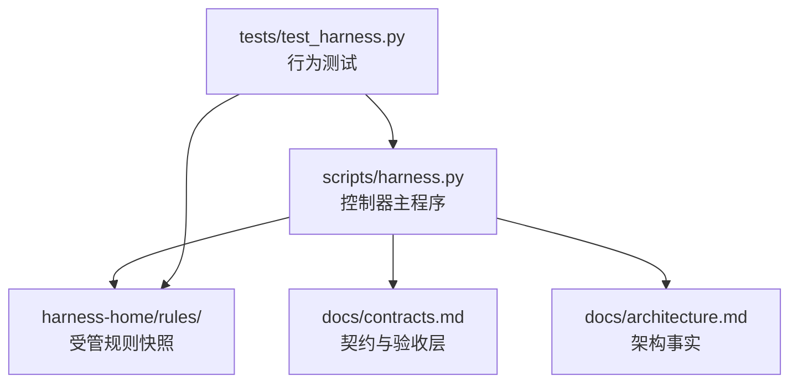
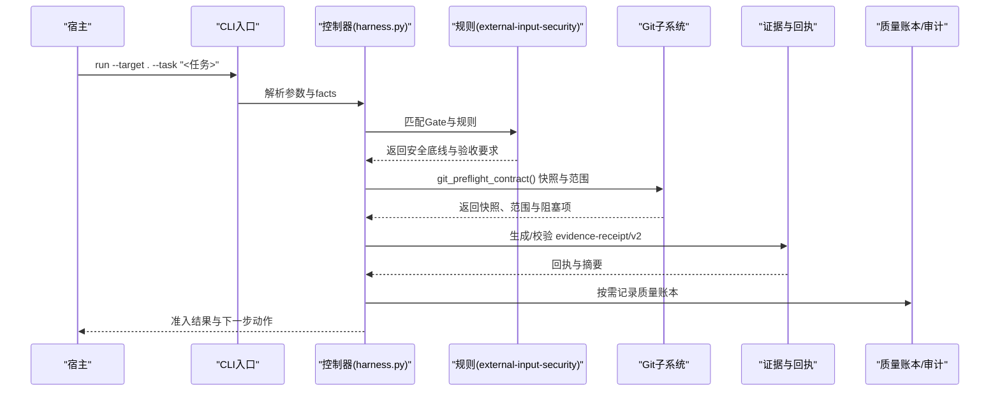
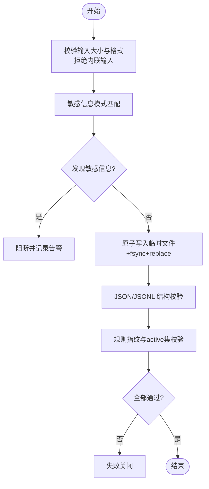
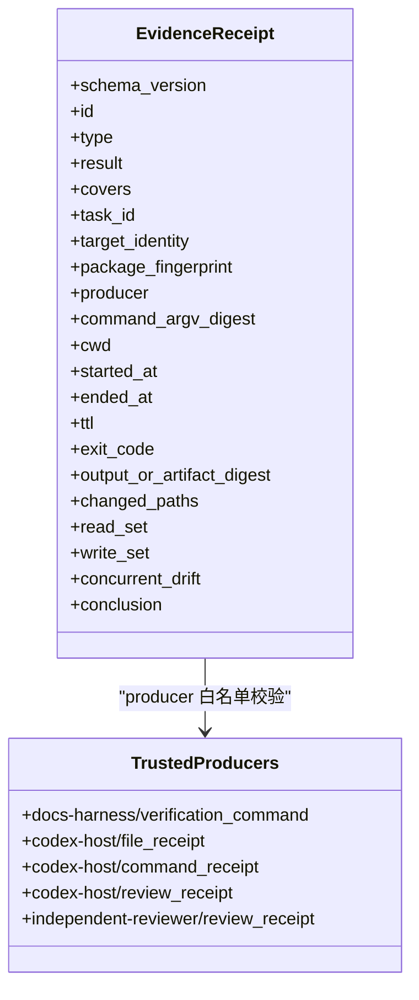
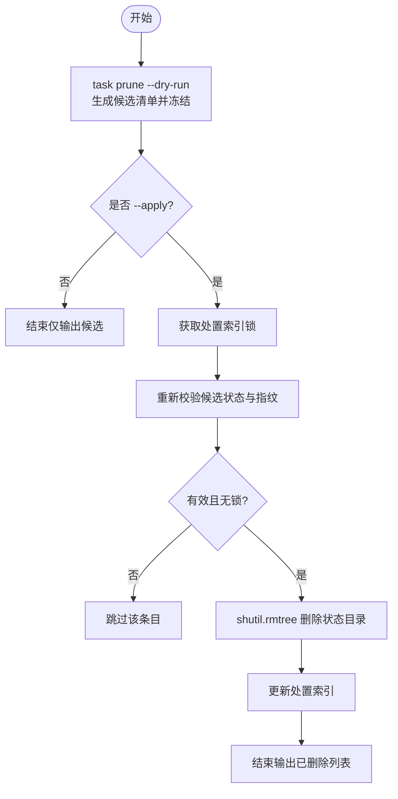
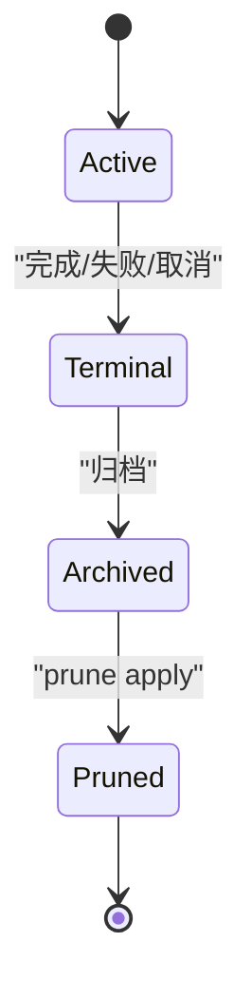
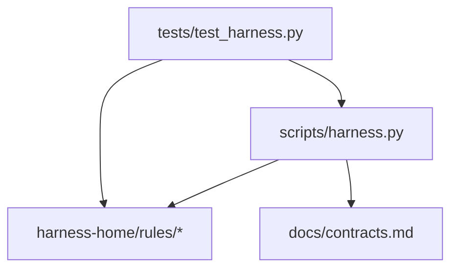

# 数据保护机制

<cite>
**本文引用的文件**   
- [scripts/harness.py](file://scripts/harness.py)
- [harness-home/rules/external-input-security.md](file://harness-home/rules/external-input-security.md)
- [harness-home/rules/INDEX.md](file://harness-home/rules/INDEX.md)
- [docs/architecture.md](file://docs/architecture.md)
- [docs/contracts.md](file://docs/contracts.md)
- [tests/test_harness.py](file://tests/test_harness.py)
</cite>

## 目录
1. [引言](#引言)
2. [项目结构](#项目结构)
3. [核心组件](#核心组件)
4. [架构总览](#架构总览)
5. [详细组件分析](#详细组件分析)
6. [依赖关系分析](#依赖关系分析)
7. [性能考虑](#性能考虑)
8. [故障排查指南](#故障排查指南)
9. [结论](#结论)
10. [附录](#附录)

## 引言
本文件面向 Docs Harness 的数据保护机制，围绕工件摄取安全、证据文件保护、临时文件清理、数据生命周期管理、备份与恢复以及合规性要求展开。内容基于控制器源码、规则与合同文档进行系统化梳理，帮助读者理解从输入到归档的全链路安全控制点与最佳实践。

## 项目结构
- 控制器主程序位于 scripts/harness.py，负责任务准入、上下文、验收、后台 Job 状态机、Git 交付检查与清理策略等。
- 受管规则位于 harness-home/rules/，通过安装快照分发并在运行时校验指纹一致性。
- 架构事实与合同分别由 docs/architecture.md 与 docs/contracts.md 描述，明确边界、状态与交付层验证要求。
- tests/test_harness.py 提供端到端行为验证，覆盖 Git 预检/后检、漂移处理、规则激活与自测等。

**图表来源** 
- [scripts/harness.py:1-120](file://scripts/harness.py#L1-L120)
- [harness-home/rules/INDEX.md:1-41](file://harness-home/rules/INDEX.md#L1-L41)
- [docs/contracts.md:1-200](file://docs/contracts.md#L1-L200)
- [docs/architecture.md:1-26](file://docs/architecture.md#L1-L26)
- [tests/test_harness.py:1-120](file://tests/test_harness.py#L1-L120)

**章节来源**
- [docs/architecture.md:1-26](file://docs/architecture.md#L1-L26)
- [docs/contracts.md:1-200](file://docs/contracts.md#L1-L200)
- [harness-home/rules/INDEX.md:1-41](file://harness-home/rules/INDEX.md#L1-L41)
- [scripts/harness.py:1-120](file://scripts/harness.py#L1-L120)

## 核心组件
- 外部输入安全规则：强制信任边界、最小权限、秘密处理、数据留存与负向路径；失败关闭策略确保未证明安全的变更不继续执行。
- 任务与证据契约：v2 证据收据绑定任务、目标、包指纹、可信生产者、时间戳与读写集合；高风险证据类型需来自可信 v2 生产者。
- Git 预检/后检：对远端 URL 脱敏、ref 范围约束、删除阈值、LFS/Submodule 可用性校验、非 fast-forward 阻断等。
- 工作区漂移归因：区分 task_write_set、read_set、concurrent_drift、unattributed_drift，并对越界或高风险漂移失败关闭。
- 临时与归档清理：任务 prune 与后台 job prune 支持 dry-run 冻结候选清单后再 apply，避免误删；归档与终态清理分离。
- 质量账本与审计：仅按需记录，读取按任务编号或关键词检索，禁止自动注入全部个人账本。

**章节来源**
- [harness-home/rules/external-input-security.md:1-29](file://harness-home/rules/external-input-security.md#L1-L29)
- [docs/contracts.md:1-200](file://docs/contracts.md#L1-L200)
- [scripts/harness.py:575-794](file://scripts/harness.py#L575-L794)
- [scripts/harness.py:3830-3882](file://scripts/harness.py#L3830-L3882)
- [scripts/harness.py:8863-8898](file://scripts/harness.py#L8863-L8898)

## 架构总览
Docs Harness 以控制器为核心，将“规则 + 契约”贯穿任务全生命周期。外部输入经 Gate 与规则判定，进入受控的意图与变更面；Git 操作在预检阶段建立快照与范围约束，在后检阶段验证实际变化；证据与回执形成可审计链；最终通过分层验收（源码、本地验证、Git HEAD、远端交付、fresh clone、发布产物、UI、外部状态）完成闭环。

**图表来源** 
- [scripts/harness.py:575-794](file://scripts/harness.py#L575-L794)
- [harness-home/rules/external-input-security.md:1-29](file://harness-home/rules/external-input-security.md#L1-L29)
- [docs/contracts.md:1-200](file://docs/contracts.md#L1-L200)

## 详细组件分析

### 工件摄取安全流程（来源验证、完整性检查、恶意内容检测）
- 来源验证
  - 任务幂等键包含 target_identity、任务文本、facts 指纹与工作区快照指纹，防止跨目标复用与篡改。
  - Git 远端 URL 指纹计算前去除用户名、密码、token、查询参数与 fragment，Runtime 不保存原文。
- 完整性检查
  - 原子写入使用临时文件 + fsync + os.replace，保证落盘一致性。
  - JSON/JSONL 读取时严格校验结构与行号错误定位。
  - 事件与回执采用规范 schema 与指纹字段，拒绝过期、跨任务、跨目标、不可信生产者与非零退出。
- 恶意内容检测
  - 敏感信息模式匹配（私钥、Bearer、GitHub token 等），用于扫描与告警。
  - 输入大小限制与内联输入拒绝，降低注入风险。
  - 规则指纹与 active 规则集必须一致，缺失或漂移失败关闭。

**图表来源** 
- [scripts/harness.py:422-447](file://scripts/harness.py#L422-L447)
- [scripts/harness.py:510-532](file://scripts/harness.py#L510-L532)
- [scripts/harness.py:196-198](file://scripts/harness.py#L196-L198)
- [harness-home/rules/INDEX.md:1-41](file://harness-home/rules/INDEX.md#L1-L41)

**章节来源**
- [scripts/harness.py:422-447](file://scripts/harness.py#L422-L447)
- [scripts/harness.py:510-532](file://scripts/harness.py#L510-L532)
- [scripts/harness.py:196-198](file://scripts/harness.py#L196-L198)
- [harness-home/rules/INDEX.md:1-41](file://harness-home/rules/INDEX.md#L1-L41)

### 证据文件保护机制（访问控制、加密存储、传输安全）
- 访问控制
  - 证据收据 v2 绑定 task_id、target_identity、package_fingerprint、producer 与 cwd，拒绝跨任务/目标与不可信生产者。
  - 高风险证据类型（security_acceptance、recovery_acceptance、release_acceptance 等）必须由可信 v2 生产者产生。
- 加密存储
  - 控制器未实现内置加密；建议在上层存储介质启用磁盘加密（如 LUKS、BitLocker），并通过文件系统权限隔离 Runtime 目录。
- 传输安全
  - 控制器本身不直接进行网络传输；若涉及远程同步，应使用受控的 git_fetch/git_sync 通道，且 URL 脱敏与 ref 范围约束已在预检阶段完成。

**图表来源** 
- [docs/contracts.md:165-200](file://docs/contracts.md#L165-L200)
- [scripts/harness.py:243-260](file://scripts/harness.py#L243-L260)

**章节来源**
- [docs/contracts.md:165-200](file://docs/contracts.md#L165-L200)
- [scripts/harness.py:243-260](file://scripts/harness.py#L243-L260)

### 临时文件清理策略（自动清理、磁盘空间管理、安全删除算法）
- 自动清理机制
  - 任务 prune：dry-run 生成候选清单并冻结，apply 时再删除，避免误删；锁定与指纹校验保障一致性。
  - 后台 job prune：仅对终态且索引存在的作业清理，支持 older_than 阈值。
- 磁盘空间管理
  - 通过候选清单与只读扫描识别可清理对象，结合锁与状态校验减少并发冲突。
- 安全删除算法
  - 控制器使用 shutil.rmtree 进行目录级删除；如需更严格的擦除策略，应在上层存储层实现（例如多次覆写）。

**图表来源** 
- [scripts/harness.py:3830-3882](file://scripts/harness.py#L3830-L3882)
- [scripts/harness.py:8863-8898](file://scripts/harness.py#L8863-L8898)

**章节来源**
- [scripts/harness.py:3830-3882](file://scripts/harness.py#L3830-L3882)
- [scripts/harness.py:8863-8898](file://scripts/harness.py#L8863-L8898)

### 数据生命周期管理（保留策略、归档机制、销毁流程）
- 保留策略
  - 任务与后台作业均支持 older_than 阈值筛选，仅对终态且满足时间的对象进行清理。
- 归档机制
  - 处置索引维护 archived 状态，prune apply 时移除归档条目，保持索引一致性。
- 销毁流程
  - 先 dry-run 冻结候选，再 apply 删除；复杂后台作业在 prepare/verify 前复验绑定与指纹，防止被篡改。

**图表来源** 
- [scripts/harness.py:3830-3882](file://scripts/harness.py#L3830-L3882)
- [scripts/harness.py:8863-8898](file://scripts/harness.py#L8863-L8898)

**章节来源**
- [scripts/harness.py:3830-3882](file://scripts/harness.py#L3830-L3882)
- [scripts/harness.py:8863-8898](file://scripts/harness.py#L8863-L8898)

### 数据备份恢复方案、灾难恢复计划与业务连续性保障
- 备份方案
  - 控制器不直接提供备份；建议对 .docs-harness/ 与 docs/ 目录进行版本化快照（Git 提交或对象存储快照）。
  - 利用 Git 远端作为副本，结合 fresh clone 验收层确保可恢复性。
- 灾难恢复
  - 通过 fresh clone 与 Git HEAD/远端一致性校验，快速重建工作区与 Runtime。
  - 规则与配置快照随安装分发，恢复时需保证规则指纹一致。
- 业务连续性
  - 分层验收（source/local_verification/git_head/remote_delivery/fresh_clone/release_artifact/ui/external_state）确保各层独立可验证，单一层失败不影响其他层。

[本节为概念性说明，不直接分析具体文件，故无章节来源]

### 数据安全最佳实践与合规性要求
- 最佳实践
  - 所有外部输入遵循最小权限与白名单；敏感信息扫描与拒绝内联输入。
  - 使用原子写入与严格 JSON/JSONL 校验，避免部分写入与结构损坏。
  - 证据收据 v2 绑定强身份与指纹，高风险证据仅接受可信生产者。
- 合规性
  - 外部输入安全规则要求说明信任边界、最小权限、秘密处理、数据留存与负向路径；无法证明时失败关闭。
  - 规则指纹与 active 集一致性校验，缺失或漂移失败关闭。

**章节来源**
- [harness-home/rules/external-input-security.md:1-29](file://harness-home/rules/external-input-security.md#L1-L29)
- [harness-home/rules/INDEX.md:1-41](file://harness-home/rules/INDEX.md#L1-L41)
- [docs/contracts.md:1-200](file://docs/contracts.md#L1-L200)

## 依赖关系分析
- 控制器依赖规则与契约：规则决定 Gate 与验收要求，契约定义证据与回执结构。
- Git 子系统依赖预检/后检：范围约束、删除阈值、LFS/Submodule 可用性、非 fast-forward 阻断。
- 测试依赖控制器与规则：验证行为与规则激活、自测与快照一致性。

**图表来源** 
- [scripts/harness.py:1-120](file://scripts/harness.py#L1-L120)
- [harness-home/rules/INDEX.md:1-41](file://harness-home/rules/INDEX.md#L1-L41)
- [docs/contracts.md:1-200](file://docs/contracts.md#L1-L200)
- [tests/test_harness.py:1-120](file://tests/test_harness.py#L1-L120)

**章节来源**
- [scripts/harness.py:1-120](file://scripts/harness.py#L1-L120)
- [harness-home/rules/INDEX.md:1-41](file://harness-home/rules/INDEX.md#L1-L41)
- [docs/contracts.md:1-200](file://docs/contracts.md#L1-L200)
- [tests/test_harness.py:1-120](file://tests/test_harness.py#L1-L120)

## 性能考虑
- 原子写入与 fsync 保证一致性但增加 I/O 开销；建议在批量写入时合并与批处理。
- JSON/JSONL 逐行校验与指纹计算带来 CPU 成本；可通过缓存与增量校验优化。
- Git 预检/后检涉及子进程调用与 diff 计算；限制 scope 与避免大仓库频繁操作可降低延迟。

[本节为通用指导，不直接分析具体文件，故无章节来源]

## 故障排查指南
- 常见错误码与原因
  - invalid_json、invalid_state：JSON/JSONL 结构或行号错误。
  - missing_file、missing_target：文件或目标目录不存在。
  - unsafe_target：目标为根或用户主目录。
  - git_preflight_failed、git_remote_unavailable：Git 预检失败或远端不可用。
  - invalid_prune_request、prune_candidates_missing：prune 参数或候选清单无效。
- 定位方法
  - 查看 events.jsonl 与回执文件，确认时间线与失败节点。
  - 检查规则指纹与 active 集一致性，确认未发生漂移。
  - 使用 task prune --dry-run 与 background prune --dry-run 预览清理影响。

**章节来源**
- [scripts/harness.py:440-447](file://scripts/harness.py#L440-L447)
- [scripts/harness.py:535-541](file://scripts/harness.py#L535-L541)
- [scripts/harness.py:575-794](file://scripts/harness.py#L575-L794)
- [scripts/harness.py:3830-3882](file://scripts/harness.py#L3830-L3882)
- [scripts/harness.py:8863-8898](file://scripts/harness.py#L8863-L8898)

## 结论
Docs Harness 通过“规则 + 契约 + 控制器”三位一体的设计，实现了从输入到归档的全链路数据保护。外部输入安全、证据保护、Git 预检/后检、漂移归因与清理策略共同构成稳健的安全基线。结合分层验收与审计能力，可在保证可用性的同时满足合规要求。

[本节为总结性内容，不直接分析具体文件，故无章节来源]

## 附录
- 关键常量与模式
  - 意图与变更面映射、Gate 顺序与定义、高风险证据类型、敏感信息模式等均在控制器中集中定义，便于统一治理。
- 参考命令
  - task list/status/cancel/archive/prune
  - background estimate/list/status/prepare/dispatch/progress/verify/retry/prune

**章节来源**
- [scripts/harness.py:200-260](file://scripts/harness.py#L200-L260)
- [scripts/harness.py:3885-3911](file://scripts/harness.py#L3885-L3911)
- [scripts/harness.py:8821-8900](file://scripts/harness.py#L8821-L8900)