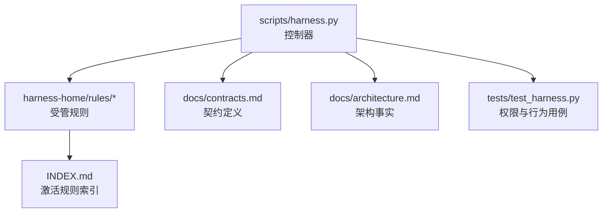
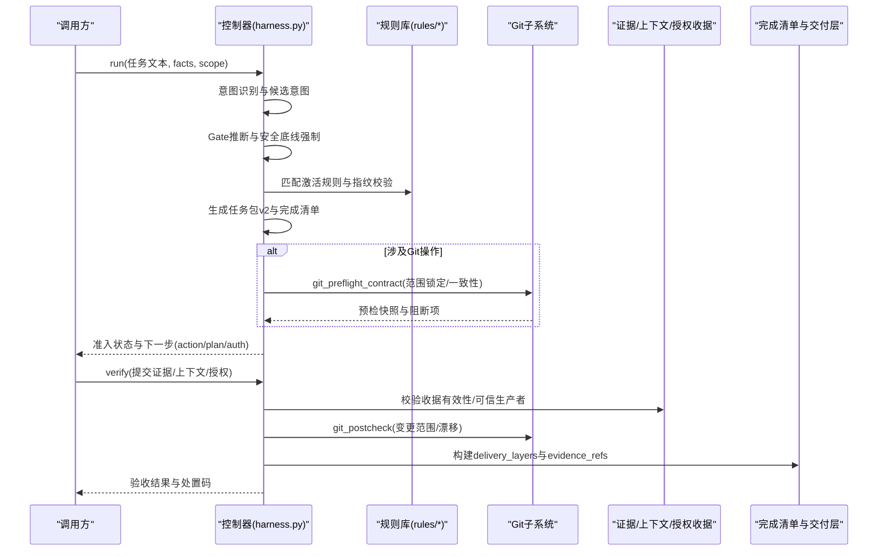
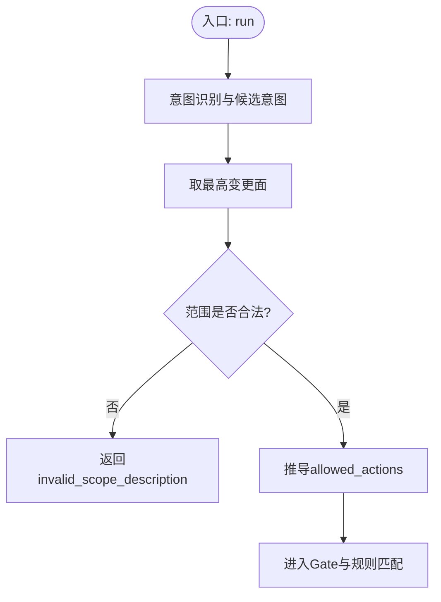
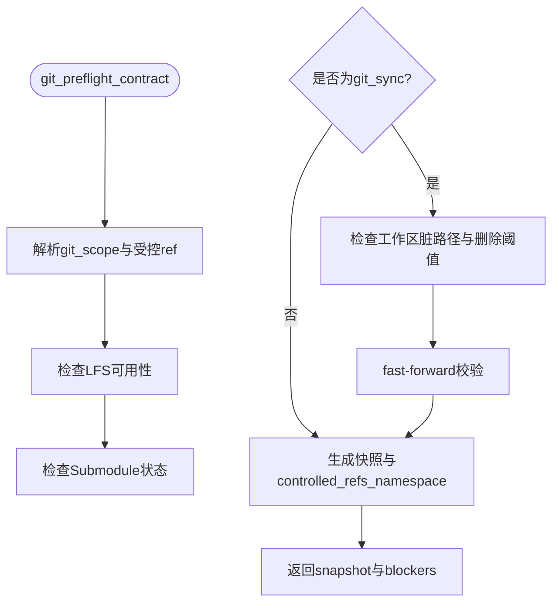
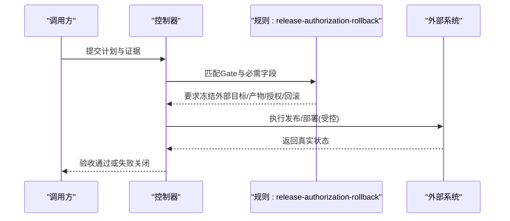
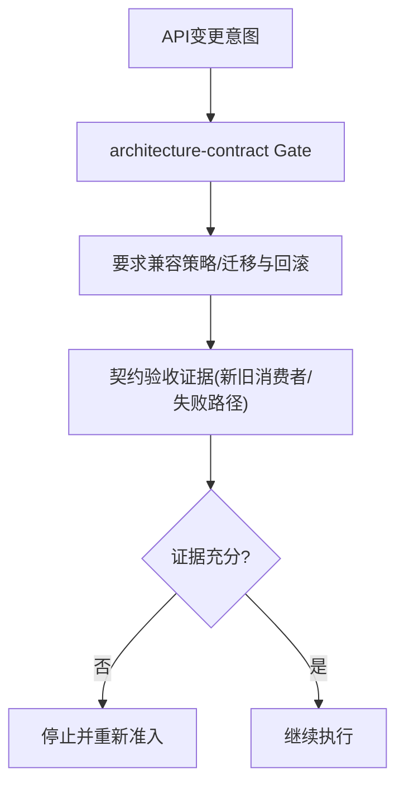
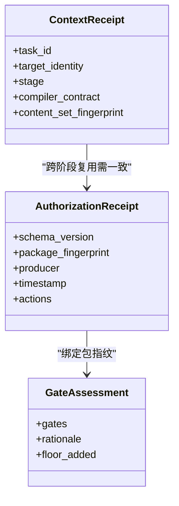
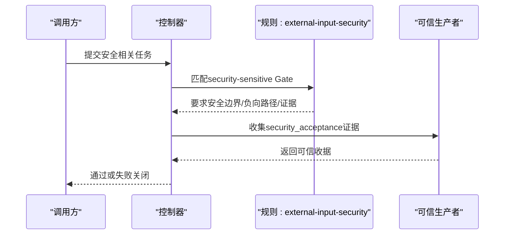
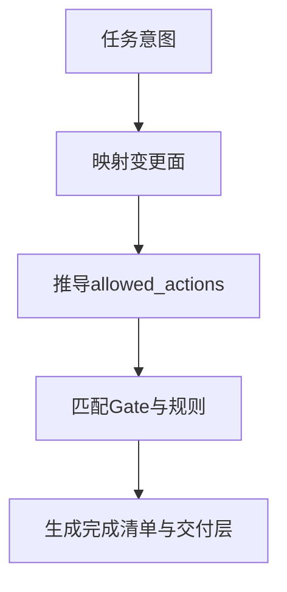
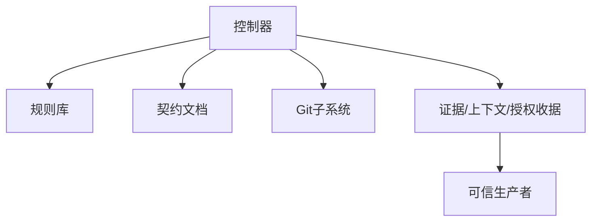

# 权限控制策略

<cite>
**本文引用的文件**   
- [harness.py](file://scripts/harness.py)
- [contracts.md](file://docs/contracts.md)
- [architecture.md](file://docs/architecture.md)
- [INDEX.md](file://harness-home/rules/INDEX.md)
- [api-compatibility.md](file://harness-home/rules/api-compatibility.md)
- [external-input-security.md](file://harness-home/rules/external-input-security.md)
- [release-authorization-rollback.md](file://harness-home/rules/release-authorization-rollback.md)
- [scope-change-readmission.md](file://harness-home/rules/scope-change-readmission.md)
- [testing-release.md](file://harness-home/rules/testing-release.md)
- [ui-complete-states.md](file://harness-home/rules/ui-complete-states.md)
- [_rule-template.md](file://harness-home/rules/_rule-template.md)
- [test_harness.py](file://tests/test_harness.py)
</cite>

## 目录
1. [引言](#引言)
2. [项目结构](#项目结构)
3. [核心组件](#核心组件)
4. [架构总览](#架构总览)
5. [详细组件分析](#详细组件分析)
6. [依赖关系分析](#依赖关系分析)
7. [性能考量](#性能考量)
8. [故障排除指南](#故障排除指南)
9. [结论](#结论)
10. [附录](#附录)

## 引言
本文件面向 Docs Harness 的权限控制策略，系统性阐述授权动作范围管理机制、Gate 与规则体系、RBAC 式角色与权限继承、动态权限分配、安全敏感操作的多重授权验证流程，以及权限配置模板、权限矩阵设计与审计日志记录。文档同时提供常见权限场景的配置示例与排障指引，帮助非技术读者也能理解并落地实践。

## 项目结构
Docs Harness 以控制器脚本为核心，配合受管规则与合同文档形成完整的权限与治理闭环：
- scripts/harness.py：任务准入、意图识别、Gate 判定、范围约束、Git 预检/后检、证据与上下文收据、授权收据、后台 Job 状态机与验收层管理。
- harness-home/rules/*：发布包内固定快照的规则集合，按 Gate 或关键词匹配生效，包含 API 兼容、外部输入安全、发布授权回滚、范围变化重新判断、测试放行、UI 完整状态等。
- docs/contracts.md：对外行为与数据契约（任务包 v2、证据收据 v2、上下文与授权收据、Git 状态合同、完成清单与交付层）。
- docs/architecture.md：架构事实与边界说明。
- tests/test_harness.py：覆盖权限相关的关键用例（只读查询、Git 操作、漂移检测、Gate 判定、规则自测等）。

图表来源
- [harness.py:1-120](file://scripts/harness.py#L1-L120)
- [contracts.md:1-120](file://docs/contracts.md#L1-L120)
- [architecture.md:1-26](file://docs/architecture.md#L1-L26)
- [INDEX.md:1-41](file://harness-home/rules/INDEX.md#L1-L41)

章节来源
- [harness.py:1-120](file://scripts/harness.py#L1-L120)
- [contracts.md:1-120](file://docs/contracts.md#L1-L120)
- [architecture.md:1-26](file://docs/architecture.md#L1-L26)
- [INDEX.md:1-41](file://harness-home/rules/INDEX.md#L1-L41)

## 核心组件
- 意图与变更面映射：将自然语言意图映射为可执行的受限动作集与变更面等级（read_only、git_metadata_write、workspace_write、external_write），并通过候选意图与最高变更面决定执行路径。
- Gate 与规则：基于关键词与路径推断 Gate；安全底线 Gate（security-sensitive、destructive-data、release-external）不可被宿主减少，仅能追加；规则按指纹与激活条件校验。
- Git 预检/后检：对 git_fetch/git_sync 进行严格范围锁定、远端一致性检查、删除阈值与非 fast-forward 阻断、LFS/Submodule 可用性校验。
- 证据与上下文/授权收据：v2 收据强绑定任务、目标、包指纹与可信生产者；高风险证据必须来自可信 v2 生产者；上下文复用需满足多键一致；授权收据按包指纹隔离。
- 完成清单与交付层：source/local_verification/git_head/remote_delivery/fresh_clone/release_artifact/ui/external_state 分层验收，不得互相替代。

章节来源
- [harness.py:200-345](file://scripts/harness.py#L200-L345)
- [harness.py:680-794](file://scripts/harness.py#L680-L794)
- [contracts.md:9-120](file://docs/contracts.md#L9-L120)
- [contracts.md:165-220](file://docs/contracts.md#L165-L220)
- [contracts.md:222-234](file://docs/contracts.md#L222-L234)
- [contracts.md:82-96](file://docs/contracts.md#L82-L96)

## 架构总览
Docs Harness 的权限控制由“意图→Gate→规则→范围→Git 预检/后检→证据/上下文/授权→交付层”的流水线构成，确保任何越权、漂移或高风险操作均失败关闭。

图表来源
- [harness.py:200-345](file://scripts/harness.py#L200-L345)
- [harness.py:680-794](file://scripts/harness.py#L680-L794)
- [contracts.md:9-120](file://docs/contracts.md#L9-L120)
- [contracts.md:165-220](file://docs/contracts.md#L165-L220)

## 详细组件分析

### 授权动作范围管理机制
- 意图到变更面的映射：query/audit/git_inspect 默认 read_only；git_fetch 为 git_metadata_write；git_sync/modify 为 workspace_write；external_write 为 external_write。混合意图取最高变更面，禁止降级。
- 范围约束：write_scope/read_scope/git_scope/external_scope 仅接受项目内相对路径、glob 或受控 Git 资源；自然语言描述返回 invalid_scope_description。
- 受控动作集 allowed_actions 由意图与变更面推导，限制实际可执行命令。

图表来源
- [harness.py:200-234](file://scripts/harness.py#L200-L234)
- [contracts.md:9-46](file://docs/contracts.md#L9-L46)

章节来源
- [harness.py:200-234](file://scripts/harness.py#L200-L234)
- [contracts.md:9-46](file://docs/contracts.md#L9-L46)

### Git 操作权限限制
- git_inspect：只读，无需逐文件写入范围。
- git_fetch：仅允许声明的远端 refs/objects 变化，HEAD、索引与工作区必须不变。
- git_sync：绑定单一预检 OID，自动生成新增/修改/删除/重命名范围；脏工作区重叠、非 fast-forward、危险删除、LFS/Submodule 不可用均失败关闭。
- 远端漂移：重新准入时计算 pull 已落盘文件并入 write_scope；方案合同未变时可继承 plan_ref 快速回到 ready_planned。

图表来源
- [harness.py:680-794](file://scripts/harness.py#L680-L794)
- [contracts.md:97-133](file://docs/contracts.md#L97-L133)

章节来源
- [harness.py:680-794](file://scripts/harness.py#L680-L794)
- [contracts.md:97-133](file://docs/contracts.md#L97-L133)

### 外部目标访问控制
- release-external Gate 触发发布/上线/部署/推送等动作，要求冻结外部目标、产物身份、授权范围、发布步骤、观测窗口与回滚路径。
- 外部状态证据必须由真实系统状态证明，本地构建或提交不能替代。
- 授权不新鲜、目标不明确、产物无法唯一识别或不可回滚时停止在外部写入之前。

图表来源
- [release-authorization-rollback.md:1-29](file://harness-home/rules/release-authorization-rollback.md#L1-L29)
- [contracts.md:82-96](file://docs/contracts.md#L82-L96)

章节来源
- [release-authorization-rollback.md:1-29](file://harness-home/rules/release-authorization-rollback.md#L1-L29)
- [contracts.md:82-96](file://docs/contracts.md#L82-L96)

### API 兼容性检查
- architecture-contract Gate 触发 API/Schema/协议/持久化结构/迁移路径变更。
- 必须提供契约验收证据，覆盖新旧消费者、失败路径与必要的迁移验证。
- 发现未声明消费者、实际范围扩大或回滚不可执行时停止实现并重新准入。

图表来源
- [api-compatibility.md:1-29](file://harness-home/rules/api-compatibility.md#L1-L29)
- [contracts.md:9-46](file://docs/contracts.md#L9-L46)

章节来源
- [api-compatibility.md:1-29](file://harness-home/rules/api-compatibility.md#L1-L29)
- [contracts.md:9-46](file://docs/contracts.md#L9-L46)

### RBAC 实现、权限继承与动态分配
- 控制器通过“意图→变更面→allowed_actions”的映射实现最小权限原则；不同意图对应不同动作集，禁止降级。
- 授权收据 authorization-receipt/v2 绑定当前 package fingerprint，跨修订隔离；上下文 context-receipt/v2 复用需满足 task_id/target_identity/stage/compiler_contract/content_set_fingerprint 一致。
- 宿主可通过 gate_assessment 权威声明 Gate（只能加不能减），最终 Gate = 声明 ∪ 旧gates ∪ 安全底线；安全底线 Gate 由控制器强制并入，文本触发使用专用精确词表并带否定守卫。

图表来源
- [contracts.md:222-234](file://docs/contracts.md#L222-L234)
- [contracts.md:9-46](file://docs/contracts.md#L9-L46)
- [harness.py:6054-6089](file://scripts/harness.py#L6054-L6089)

章节来源
- [contracts.md:222-234](file://docs/contracts.md#L222-L234)
- [contracts.md:9-46](file://docs/contracts.md#L9-L46)
- [harness.py:6054-6089](file://scripts/harness.py#L6054-L6089)

### 安全敏感操作的授权流程（高风险 Gate 与多重验证）
- security-sensitive Gate 针对外部输入、鉴权、授权、秘密、隐私数据、文件解析或供应链边界。
- 必须提供安全验收证据，覆盖未授权、畸形输入、敏感信息泄露和失败关闭行为。
- 高风险证据类型（security_acceptance、external_state、recovery_acceptance、remote_delivery、fresh_clone_verification、release_acceptance）必须来自可信 v2 生产者。

图表来源
- [external-input-security.md:1-29](file://harness-home/rules/external-input-security.md#L1-L29)
- [contracts.md:165-220](file://docs/contracts.md#L165-L220)

章节来源
- [external-input-security.md:1-29](file://harness-home/rules/external-input-security.md#L1-L29)
- [contracts.md:165-220](file://docs/contracts.md#L165-L220)

### 权限配置模板与权限矩阵设计
- 规则模板 _rule-template.md 定义了 status/rule_id/content_fingerprint/gates/keywords/plan_fields/evidence_types/failure_mode 等元数据。
- INDEX.md 维护 active_rules 列表与加载约定，确保规则缺失、增加或变化均失败关闭。
- 权限矩阵建议：
  - 行：意图（query/audit/git_inspect/git_fetch/git_sync/modify/external_write）
  - 列：变更面（read_only/git_metadata_write/workspace_write/external_write）
  - 单元格：allowed_actions 与 Gate 要求（如 release-external、security-sensitive）

图表来源
- [_rule-template.md:1-21](file://harness-home/rules/_rule-template.md#L1-L21)
- [INDEX.md:1-41](file://harness-home/rules/INDEX.md#L1-L41)
- [harness.py:200-234](file://scripts/harness.py#L200-L234)

章节来源
- [_rule-template.md:1-21](file://harness-home/rules/_rule-template.md#L1-L21)
- [INDEX.md:1-41](file://harness-home/rules/INDEX.md#L1-L41)
- [harness.py:200-234](file://scripts/harness.py#L200-L234)

### 权限审计日志记录
- 事件使用 docs-harness/event/v2，仅保存有界字段（phase/duration_ms/reason_code/package_revision/context_cache_hit 等），不得保存用户正文、原始输出、环境变量、凭证或完整日志。
- 效率结论必须由这些字段与受控原因码复算。
- 授权收据与上下文收据分别持久化于 authorization-receipts.jsonl 与 context-receipts.jsonl，供审计追溯。

章节来源
- [contracts.md:283-302](file://docs/contracts.md#L283-L302)
- [harness.py:3163-3349](file://scripts/harness.py#L3163-L3349)

## 依赖关系分析
- 控制器依赖规则库与契约文档，确保 Gate 与范围约束的一致性。
- Git 子系统依赖预检/后检逻辑，保证操作范围与一致性。
- 证据/上下文/授权收据依赖可信生产者与指纹绑定，防止跨任务/跨包复用。

图表来源
- [harness.py:1-120](file://scripts/harness.py#L1-L120)
- [contracts.md:1-120](file://docs/contracts.md#L1-L120)

章节来源
- [harness.py:1-120](file://scripts/harness.py#L1-L120)
- [contracts.md:1-120](file://docs/contracts.md#L1-L120)

## 性能考量
- 意图识别与 Gate 推断为 O(n) 文本匹配，结合否定守卫降低误报。
- Git 预检/后检避免全仓扫描，仅对声明范围与受控 ref 进行操作。
- 证据与上下文收据缓存命中可减少重复加载与验证。
- 事件与收据采用 JSONL 追加写，顺序 I/O 提升吞吐。

[本节为通用指导，不直接分析具体文件]

## 故障排除指南
- 无效范围描述：natural language scope 返回 invalid_scope_description，应改为项目内相对路径或 glob。
- Git 同步失败：脏工作区重叠、非 fast-forward、删除数量超阈、LFS/Submodule 不可用均会阻断，需清理工作区或修复环境。
- 远端漂移：verify 返回 git_remote_drift，需重新准入并继承 plan_ref 快速恢复。
- 证据过期或跨任务：evidence-receipt/v2 校验失败，需重新生成并绑定正确 task_id/target_identity/package_fingerprint。
- 授权收据不可用：authorization_receipt_usable 校验失败，需确保绑定当前 package fingerprint 且未被撤销。

章节来源
- [contracts.md:9-46](file://docs/contracts.md#L9-L46)
- [harness.py:680-794](file://scripts/harness.py#L680-L794)
- [contracts.md:165-220](file://docs/contracts.md#L165-L220)
- [harness.py:6054-6089](file://scripts/harness.py#L6054-L6089)

## 结论
Docs Harness 通过意图→Gate→规则→范围→Git 预检/后检→证据/上下文/授权→交付层的严密流水线，实现了最小权限、失败关闭与可审计的权限控制。安全底线 Gate 与可信 v2 收据确保高风险操作不可绕过，交付层分层验收杜绝证据混用。遵循本文配置模板与矩阵设计，可在复杂协作中保持权限一致性与可追溯性。

[本节为总结，不直接分析具体文件]

## 附录
- 常见权限场景配置示例：
  - 只读查询：intent=query，mutation_profile=read_only，allowed_actions=["read"]，无 write_scope。
  - Git 抓取：intent=git_fetch，mutation_profile=git_metadata_write，git_scope=[.git:refs/remotes/origin/*]。
  - 发布上线：intent=external_write，Gate=release-external，需提供 external_state 证据与回滚路径。
- 规则模板字段说明：status/rule_id/content_fingerprint/gates/keywords/plan_fields/evidence_types/failure_mode。
- 权限矩阵建议：行=意图，列=变更面，单元格=allowed_actions+Gate要求。

章节来源
- [contracts.md:9-46](file://docs/contracts.md#L9-L46)
- [_rule-template.md:1-21](file://harness-home/rules/_rule-template.md#L1-L21)
- [harness.py:200-234](file://scripts/harness.py#L200-L234)