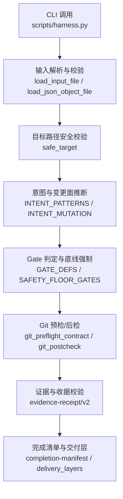
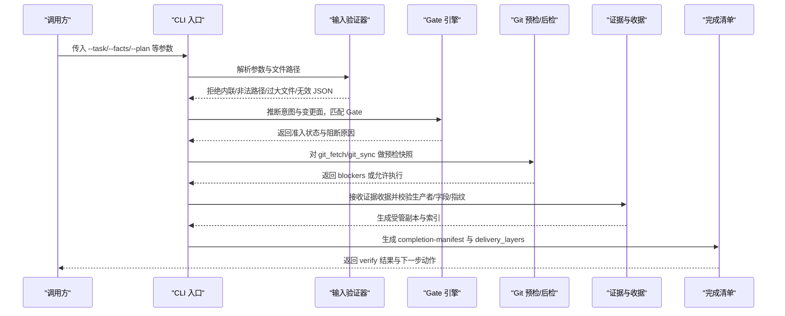
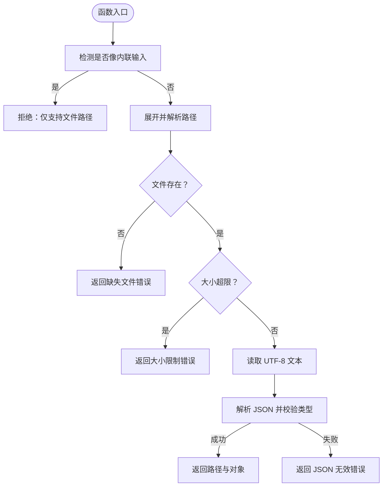
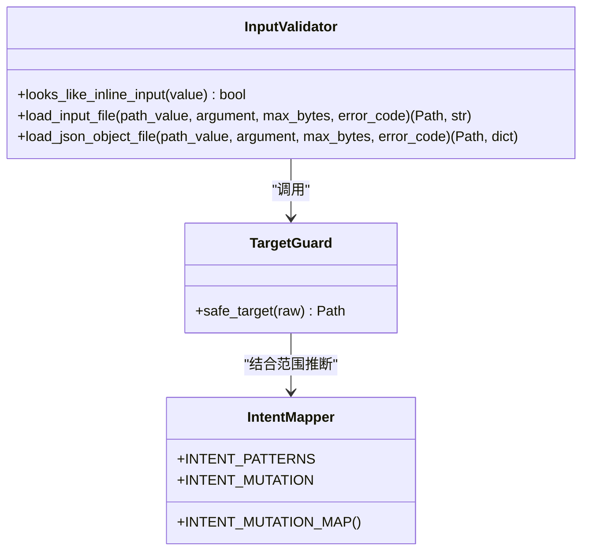
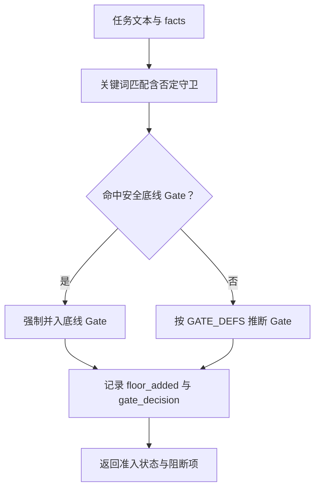
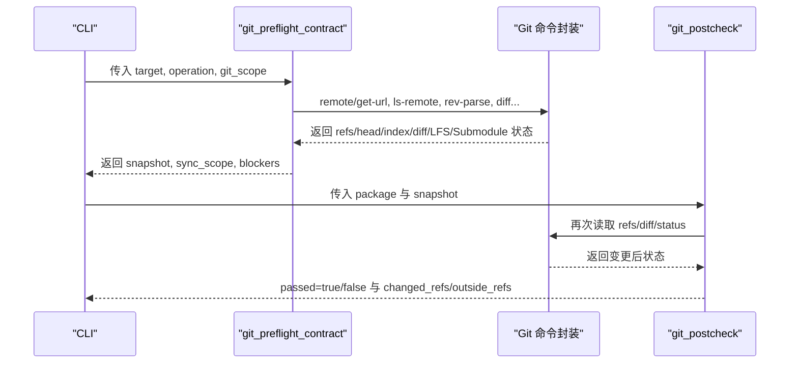
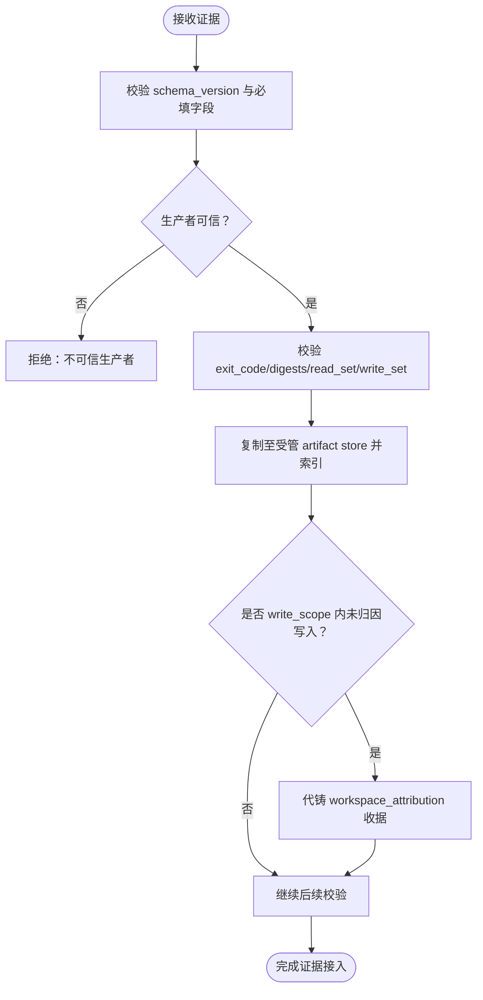
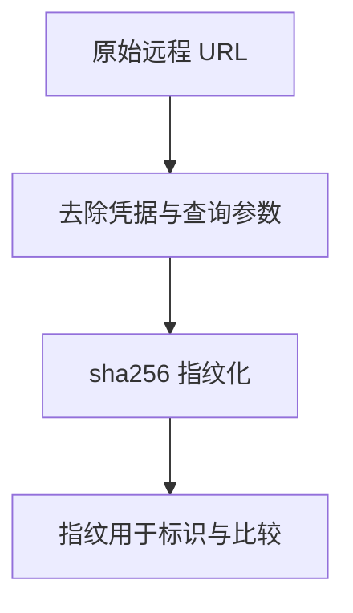

# 输入验证机制

<cite>
**本文引用的文件**
- [harness.py](file://scripts/harness.py)
- [external-input-security.md](file://harness-home/rules/external-input-security.md)
- [contracts.md](file://docs/contracts.md)
- [architecture.md](file://docs/architecture.md)
- [test_harness.py](file://tests/test_harness.py)
</cite>

## 目录
1. [引言](#引言)
2. [项目结构](#项目结构)
3. [核心组件](#核心组件)
4. [架构总览](#架构总览)
5. [详细组件分析](#详细组件分析)
6. [依赖关系分析](#依赖关系分析)
7. [性能考量](#性能考量)
8. [故障排查指南](#故障排查指南)
9. [结论](#结论)
10. [附录](#附录)

## 引言
本文件系统化阐述 Docs Harness 的输入验证与安全控制机制，覆盖信任边界、最小权限、秘密数据处理与数据留存策略；并详细说明畸形输入检测、未授权访问拦截、敏感信息泄露防护、负向路径处理与安全验收证据收集流程。文档同时提供配置示例与常见场景的最佳实践，以及输入清洗、格式校验与类型检查的技术实现要点。

## 项目结构
Docs Harness 的输入验证由控制器脚本与规则共同驱动：
- 控制器脚本负责解析输入、执行安全校验、生成受管工件与收据、维护状态机与验收流程。
- 规则文件定义“外部输入安全”等 Gate 约束，强制任务在触及外部输入、鉴权、授权、秘密、隐私数据、文件解析或供应链边界时满足安全要求。
- 合同文档定义了任务包、证据收据、上下文与授权收据、Git 状态合同等关键数据结构与行为契约。
- 测试用例覆盖了输入拒绝、范围限制、Git 预检与后检、脱敏指纹等关键路径。

**图表来源**
- [harness.py:446-504](file://scripts/harness.py#L446-L504)
- [harness.py:532-544](file://scripts/harness.py#L532-L544)
- [harness.py:197-231](file://scripts/harness.py#L197-L231)
- [harness.py:260-342](file://scripts/harness.py#L260-L342)
- [harness.py:677-789](file://scripts/harness.py#L677-L789)
- [contracts.md:165-221](file://docs/contracts.md#L165-L221)
- [contracts.md:97-133](file://docs/contracts.md#L97-L133)

**章节来源**
- [architecture.md:1-26](file://docs/architecture.md#L1-L26)
- [contracts.md:1-10](file://docs/contracts.md#L1-L10)

## 核心组件
- 输入读取与清洗
  - 仅接受文件路径参数，拒绝内联内容，防止注入与越界解析。
  - 对文件大小、UTF-8 编码、JSON 结构与类型进行严格校验，失败即结构化错误返回。
- 目标路径安全
  - 禁止将文件系统根目录或用户主目录作为目标，避免全局写入风险。
- 意图与变更面
  - 基于自然语言模式推断任务意图（查询、审计、Git 操作、修改、外部写入），并映射到最小变更面（只读、Git 元数据写入、工作区写入、外部写入）。
- Gate 与底线
  - 通过关键词与路径匹配触发 Gate；对安全、破坏性数据、外部发布三类 Gate 采用精确词表与否定守卫，并由控制器代码强制兜底，宿主只能加不能减。
- Git 预检与后检
  - 对 git_fetch/git_sync 建立快照与范围约束，阻止非 fast-forward、脏工作区、危险删除、LFS/Submodule 不可验证等风险。
- 证据与收据
  - 仅接受 v2 证据收据，绑定 task_id、target_identity、package_fingerprint、可信生产者、时间戳与读写集合；高风险证据必须来自可信生产者。
- 完成清单与交付层
  - 按 source/local_verification/git_head/remote_delivery/fresh_clone/release_artifact/ui/external_state 分层验收，不得静默增加隐藏要求。

**章节来源**
- [harness.py:446-504](file://scripts/harness.py#L446-L504)
- [harness.py:532-544](file://scripts/harness.py#L532-L544)
- [harness.py:197-231](file://scripts/harness.py#L197-L231)
- [harness.py:260-342](file://scripts/harness.py#L260-L342)
- [harness.py:677-789](file://scripts/harness.py#L677-L789)
- [contracts.md:165-221](file://docs/contracts.md#L165-L221)
- [contracts.md:97-133](file://docs/contracts.md#L97-L133)

## 架构总览
输入验证贯穿“入口—解析—校验—授权—执行—验收”全链路，形成以 Gate 为核心的安全门禁与以证据为中心的验收闭环。

**图表来源**
- [harness.py:446-504](file://scripts/harness.py#L446-L504)
- [harness.py:532-544](file://scripts/harness.py#L532-L544)
- [harness.py:677-789](file://scripts/harness.py#L677-L789)
- [contracts.md:165-221](file://docs/contracts.md#L165-L221)
- [contracts.md:97-133](file://docs/contracts.md#L97-L133)

## 详细组件分析

### 输入读取与清洗
- 拒绝内联输入：当参数值包含换行或看起来像 JSON 对象/数组时，直接拒绝并要求保存为文件。
- 路径与大小校验：展开用户路径、解析绝对路径、确认存在性与大小上限。
- JSON 类型校验：仅接受对象类型，其他类型拒绝。
- 统一错误码：所有异常转换为结构化错误，不暴露敏感输入。

**图表来源**
- [harness.py:446-504](file://scripts/harness.py#L446-L504)

**章节来源**
- [harness.py:446-504](file://scripts/harness.py#L446-L504)

### 目标路径安全与最小权限
- safe_target 确保目标为子目录且不为根或主目录，防止全局写入。
- 意图到变更面的映射遵循最小权限原则：查询/审计/inspect 为只读；fetch 为 Git 元数据写入；sync/modify 为工作区写入；external_write 为外部写入。
- 混合意图取最高变更面，避免降级。

**图表来源**
- [harness.py:446-504](file://scripts/harness.py#L446-L504)
- [harness.py:532-544](file://scripts/harness.py#L532-L544)
- [harness.py:197-231](file://scripts/harness.py#L197-L231)

**章节来源**
- [harness.py:532-544](file://scripts/harness.py#L532-L544)
- [harness.py:197-231](file://scripts/harness.py#L197-L231)

### Gate 判定与底线强制
- Gate 定义包含术语、事实引用、方案字段与证据类型。
- 安全底线 Gate（security-sensitive、destructive-data、release-external）使用专用精确词表与否定守卫，并由控制器强制并入，宿主声明不可豁免。
- 未声明 gate_assessment 时回退关键词推断；声明后跳过非安全 Gate 的宽泛匹配。

**图表来源**
- [harness.py:260-342](file://scripts/harness.py#L260-L342)
- [harness.py:381-390](file://scripts/harness.py#L381-L390)

**章节来源**
- [harness.py:260-342](file://scripts/harness.py#L260-L342)
- [harness.py:381-390](file://scripts/harness.py#L381-L390)

### Git 预检与后检（负向路径与漂移防护）
- 预检阶段：
  - 校验目标为独立 Git 工作树根。
  - 解析 git_scope 远端引用，要求唯一分支（git_sync 时）。
  - 计算 diff 范围、删除数量、fast-forward 可行性。
  - 探测 LFS/Submodule 可用性，脏工作区与范围重叠阻断。
- 后检阶段：
  - 校验 ref 变化是否在 controlled_refs_namespace 内。
  - 校验 HEAD、index、worktree 未发生越界变更。
  - 远端漂移重新准入时，自动归因 pull 落盘文件。

**图表来源**
- [harness.py:677-789](file://scripts/harness.py#L677-L789)
- [contracts.md:97-133](file://docs/contracts.md#L97-L133)

**章节来源**
- [harness.py:677-789](file://scripts/harness.py#L677-L789)
- [contracts.md:97-133](file://docs/contracts.md#L97-L133)

### 证据与收据（安全验收证据收集）
- 仅接受 v2 证据收据，必填字段包括 task_id、target_identity、package_fingerprint、producer、cwd、起止时间、ttl、exit_code、digests、read_set/write_set。
- 高风险证据类型必须由可信生产者产生；报告型旧证据不满足安全要求。
- 验证命令产物白名单与临时副产物容忍策略，避免误报额外写入。
- 控制器可代铸 workspace_attribution 收据自动认领范围内写入。

**图表来源**
- [contracts.md:165-221](file://docs/contracts.md#L165-L221)

**章节来源**
- [contracts.md:165-221](file://docs/contracts.md#L165-L221)

### 敏感信息与脱敏
- 远程 URL 指纹化前移除用户名、密码、token、查询参数与 fragment，Runtime 不保存原文。
- 质量账本扫描包含密钥/Bearer/token 等模式的正则过滤，避免敏感信息进入日志或输出。

**图表来源**
- [harness.py:585-596](file://scripts/harness.py#L585-L596)
- [harness.py:193-196](file://scripts/harness.py#L193-L196)

**章节来源**
- [harness.py:585-596](file://scripts/harness.py#L585-L596)
- [harness.py:193-196](file://scripts/harness.py#L193-L196)

### 规则与验收证据（外部输入安全）
- 规则要求任务触及外部输入、鉴权、授权、秘密、隐私数据、文件解析或供应链边界时必须说明信任边界、最小权限、秘密处理、数据留存与负向路径。
- 验收条件需覆盖未授权、畸形输入、敏感信息泄露与失败关闭行为。
- 无法证明边界、数据去向或失败关闭时，不得继续实现或降低保护。

**章节来源**
- [external-input-security.md:1-29](file://harness-home/rules/external-input-security.md#L1-L29)

## 依赖关系分析
输入验证的关键依赖如下：
- 输入解析依赖路径与 JSON 处理能力。
- Gate 判定依赖关键词与路径匹配、否定守卫与底线强制。
- Git 预检/后检依赖 Git 命令封装与状态快照。
- 证据收据依赖可信生产者与指纹校验。
- 完成清单依赖交付层期望与证据引用。

**图表来源**
- [harness.py:446-504](file://scripts/harness.py#L446-L504)
- [harness.py:260-342](file://scripts/harness.py#L260-L342)
- [harness.py:677-789](file://scripts/harness.py#L677-L789)
- [contracts.md:165-221](file://docs/contracts.md#L165-L221)

**章节来源**
- [contracts.md:1-10](file://docs/contracts.md#L1-L10)

## 性能考量
- 输入读取与 JSON 解析为 O(n) 线性复杂度，n 为文件大小；建议设置合理 max_bytes 限制。
- Git 预检涉及多次命令调用，注意超时与缓存策略；后检仅在必要时重读状态。
- 证据收据校验与指纹计算为常数级哈希，存储与索引开销与证据数量线性相关。
- 完成清单生成应避免重复计算，复用已冻结基线与快照。

[本节为通用指导，不直接分析具体文件]

## 故障排查指南
- 输入拒绝类错误
  - inline_input_not_supported：参数包含内联内容，改为文件路径。
  - invalid_task_id：task-id 不符合格式，检查 ID 规范。
  - missing_target/target 不存在或为根/主目录，修正目标路径。
- Git 预检失败
  - git_remote_unavailable：远端不可用或 URL 无效。
  - git_sync_scope_ambiguous：git_sync 未绑定单一远端分支。
  - git_preflight_failed：索引或 diff 读取失败，检查工作区状态。
- 证据与收据问题
  - 不可信生产者或字段缺失：核对 evidence-receipt/v2 必填字段与生产者白名单。
  - 越界写入或漂移：检查 write_scope 与 concurrent/unattributed drift。
- 退出码含义
  - 0：成功；verify.result=完成表示父任务完成。
  - 1：项目检查或完整性读取失败。
  - 2：输入、合同、绑定或状态无效。
  - 3：需要方案、授权、证据或迁移。
  - 4：范围、漂移、Gate、远端、授权或规则变化，需重新准入。

**章节来源**
- [harness.py:446-504](file://scripts/harness.py#L446-L504)
- [harness.py:532-544](file://scripts/harness.py#L532-L544)
- [harness.py:677-789](file://scripts/harness.py#L677-L789)
- [contracts.md:359-370](file://docs/contracts.md#L359-L370)

## 结论
Docs Harness 的输入验证机制以“严格入口校验 + Gate 门禁 + 证据闭环”为核心，确保外部输入安全、最小权限与可审计性。通过精确词表与否定守卫、底线 Gate 强制、Git 预检/后检与证据收据校验，系统有效防范畸形输入、未授权访问与敏感信息泄露，并提供清晰的负向路径处理与验收证据收集流程。

[本节为总结，不直接分析具体文件]

## 附录

### 配置示例与最佳实践
- 输入参数
  - 始终使用文件路径传递 JSON 或计划文件，避免内联内容。
  - 设置合理的 max_bytes 限制，防止大文件导致资源耗尽。
- 目标路径
  - 确保目标为项目子目录，避免根或主目录。
- 意图与范围
  - 明确 read_scope 与 write_scope，使用相对路径或 glob，避免自然语言描述伪装成路径。
- Gate 声明
  - 提交 gate_assessment 减少非安全 Gate 的误判；安全底线 Gate 不可豁免。
- Git 操作
  - git_sync 绑定单一远端分支，提前 fetch 目标 OID，避免脏工作区与危险删除。
- 证据与收据
  - 使用 v2 证据收据，绑定可信生产者与必要字段；高风险证据必须来自可信来源。
  - 利用控制器自动归因能力，减少补证成本。
- 敏感信息
  - 不在日志或输出中保留凭据；使用脱敏指纹进行标识与比较。

**章节来源**
- [harness.py:446-504](file://scripts/harness.py#L446-L504)
- [harness.py:532-544](file://scripts/harness.py#L532-L544)
- [harness.py:677-789](file://scripts/harness.py#L677-L789)
- [contracts.md:165-221](file://docs/contracts.md#L165-L221)
- [contracts.md:97-133](file://docs/contracts.md#L97-L133)

### 常见输入验证场景
- 只读查询
  - 意图 query，变更面 read_only，write_scope=[]，allowed_actions=["read"]。
- Git 审计
  - 意图 audit/git_inspect，变更面 read_only，允许 history 读取。
- Git Fetch
  - 意图 git_fetch，变更面 git_metadata_write，仅允许声明的远端 refs/objects 变化。
- Git Sync
  - 意图 git_sync，变更面 workspace_write，自动生成新增/修改/删除范围，需预检与后检。
- 修改与外部写入
  - 意图 modify/external_write，变更面 workspace_write/external_write，需 Gate 与授权。

**章节来源**
- [contracts.md:9-46](file://docs/contracts.md#L9-L46)
- [harness.py:197-231](file://scripts/harness.py#L197-L231)