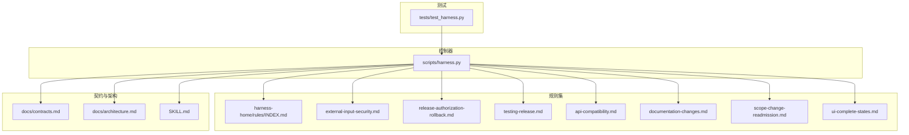
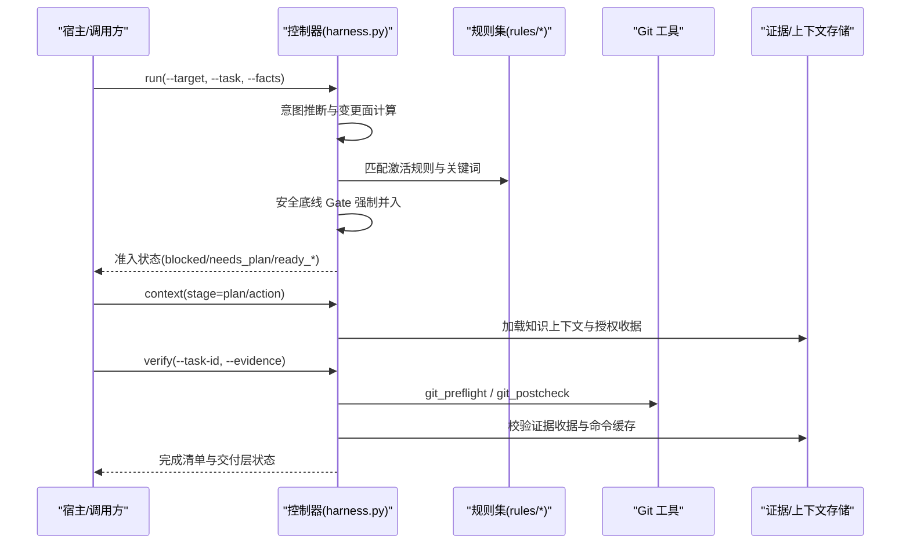
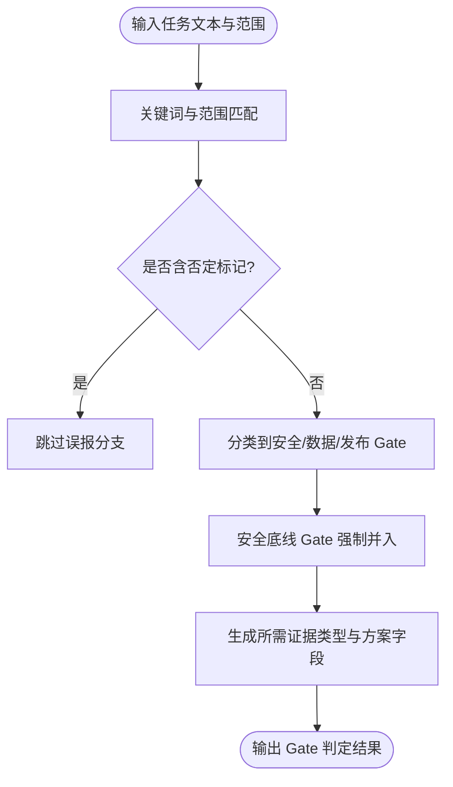
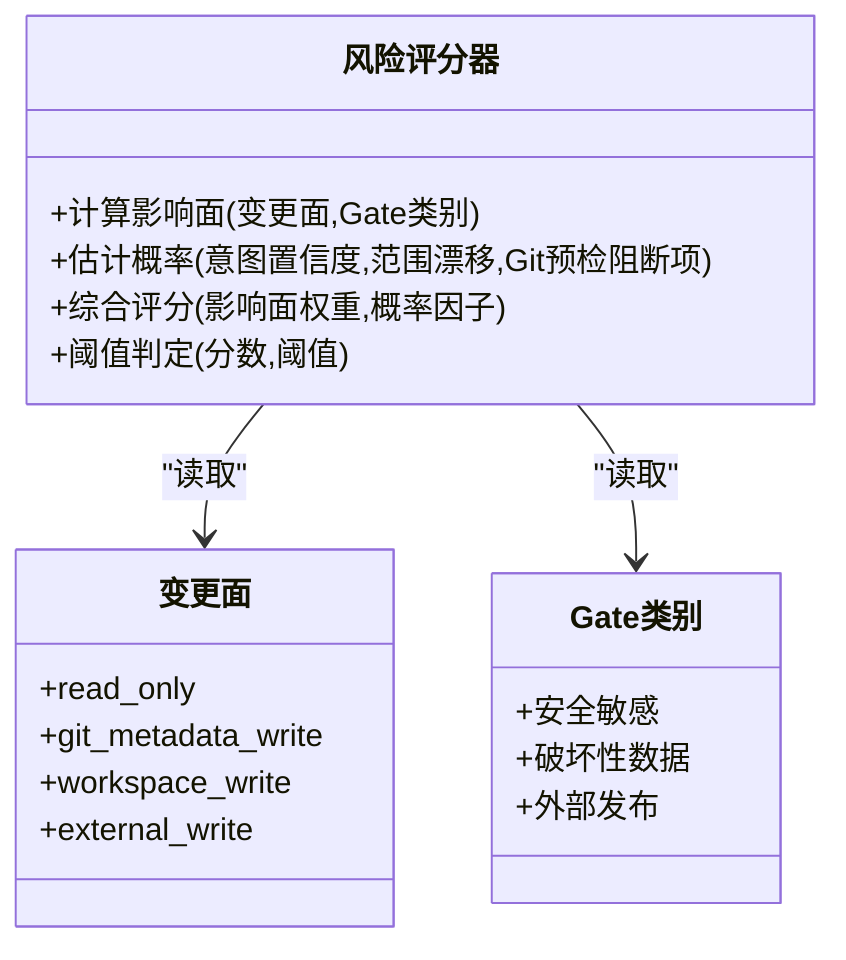
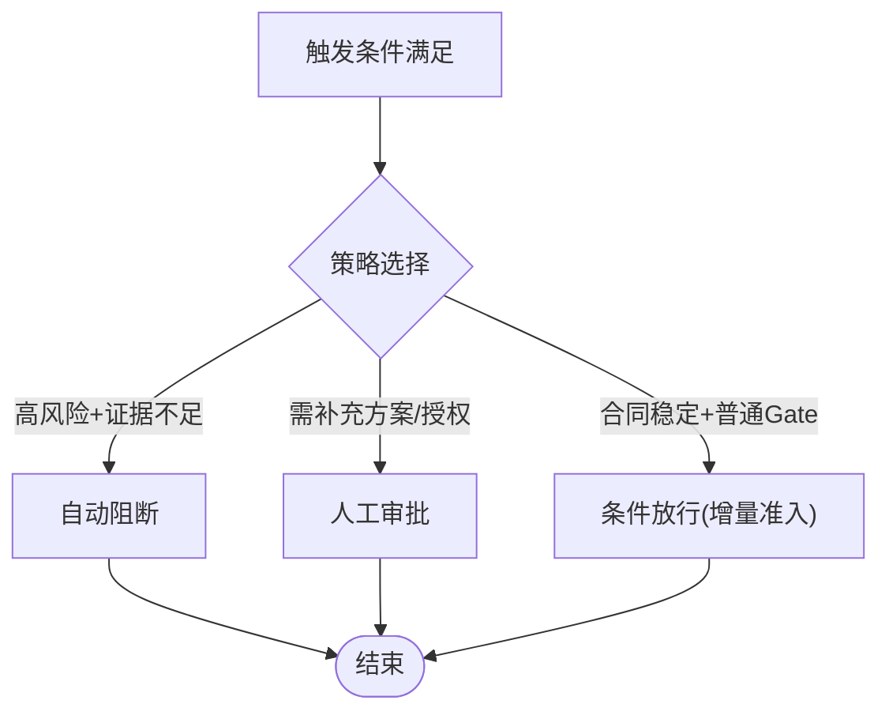
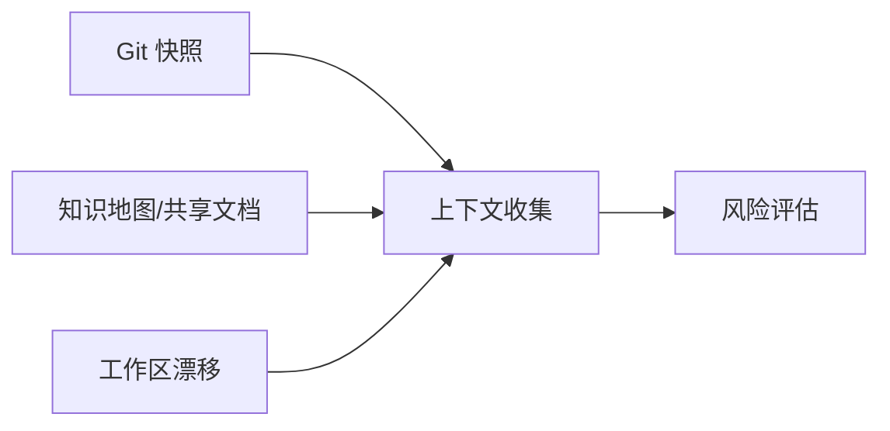
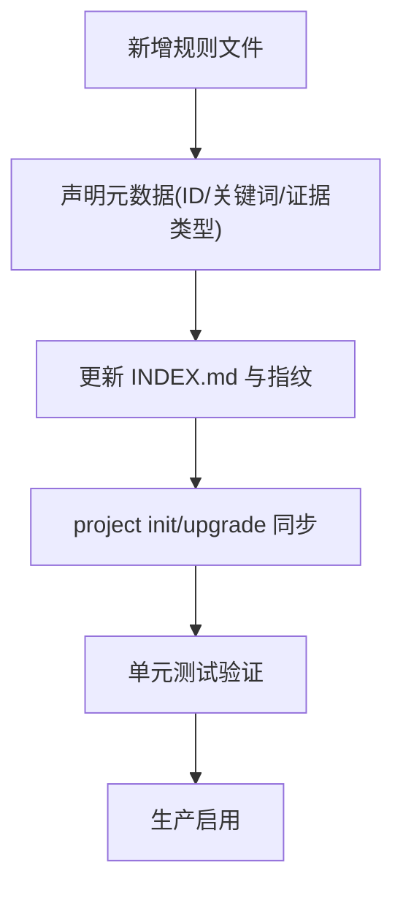
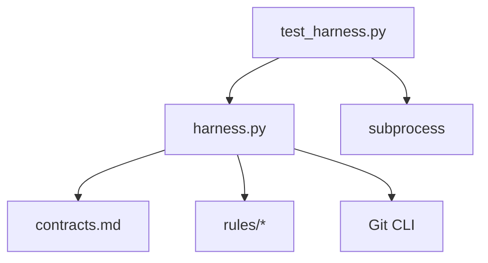

# 风险门控系统

<cite>
**本文引用的文件**   
- [harness.py](file://scripts/harness.py)
- [contracts.md](file://docs/contracts.md)
- [architecture.md](file://docs/architecture.md)
- [SKILL.md](file://SKILL.md)
- [INDEX.md](file://harness-home/rules/INDEX.md)
- [external-input-security.md](file://harness-home/rules/external-input-security.md)
- [release-authorization-rollback.md](file://harness-home/rules/release-authorization-rollback.md)
- [testing-release.md](file://harness-home/rules/testing-release.md)
- [api-compatibility.md](file://harness-home/rules/api-compatibility.md)
- [documentation-changes.md](file://harness-home/rules/documentation-changes.md)
- [scope-change-readmission.md](file://harness-home/rules/scope-change-readmission.md)
- [ui-complete-states.md](file://harness-home/rules/ui-complete-states.md)
- [test_harness.py](file://tests/test_harness.py)
</cite>

## 目录
1. [简介](#简介)
2. [项目结构](#项目结构)
3. [核心组件](#核心组件)
4. [架构总览](#架构总览)
5. [详细组件分析](#详细组件分析)
6. [依赖关系分析](#依赖关系分析)
7. [性能与可扩展性](#性能与可扩展性)
8. [故障排查指南](#故障排查指南)
9. [结论](#结论)
10. [附录](#附录)

## 简介
本文件面向 Docs Harness 的风险门控系统，系统性阐述高风险 Gate 识别机制、风险等级评估模型、Gate 触发条件与执行策略、风险评估上下文收集方法、阈值配置与自定义 Gate 开发流程，以及常见风险场景的识别模式与应对策略。文档以代码与合同为依据，确保读者既能把握整体架构，也能落地实施与排障。

## 项目结构
Docs Harness 的核心控制逻辑集中在独立控制器脚本中，规则集以受管 Markdown 快照形式随包分发，并通过项目安装命令同步到目标仓库。关键目录与职责如下：
- scripts/harness.py：任务准入、意图推断、Gate 判定、授权与证据校验、Git 预检/后检、验收与完成清单生成等核心实现
- harness-home/rules/*：受管规则（安全、发布、测试、UI、范围变更、文档修改、API 兼容等），通过 INDEX.md 声明生效规则与指纹
- docs/contracts.md：对外契约，定义任务包、证据、上下文、验收层、退出码等
- docs/architecture.md：架构事实与边界说明
- SKILL.md：技能使用说明与行为约定
- tests/test_harness.py：覆盖关键路径与边界条件的单元测试

图表来源
- [harness.py](file://scripts/harness.py)
- [INDEX.md](file://harness-home/rules/INDEX.md)
- [contracts.md](file://docs/contracts.md)
- [architecture.md](file://docs/architecture.md)
- [SKILL.md](file://SKILL.md)
- [test_harness.py](file://tests/test_harness.py)

章节来源
- [harness.py](file://scripts/harness.py)
- [contracts.md](file://docs/contracts.md)
- [architecture.md](file://docs/architecture.md)
- [SKILL.md](file://SKILL.md)

## 核心组件
- 风险 Gate 集合与顺序：内置多类 Gate，按固定顺序评估，包括产品变更、架构契约、安全敏感、破坏性数据、外部发布、前端设计、诊断修复、测试验收、审查审计、代码编辑、文档编辑等
- 安全底线 Gate：安全敏感、破坏性数据、外部发布为强制底线，宿主不可豁免；文本触发使用精确词表并带否定守卫，避免误报
- 意图与变更面：query/audit/git_inspect/git_fetch/git_sync/modify/external_write 等意图映射到 read_only、git_metadata_write、workspace_write、external_write 等变更面
- 证据体系：v2 证据收据、可信生产者白名单、临时副产物容忍、验证命令缓存与逐项收据
- Git 预检/后检：锁定远端引用、工作区快照、LFS/Submodule 可用性、删除数量阈值、fast-forward 约束等
- 验收分层：source/local_verification/git_head/remote_delivery/fresh_clone/release_artifact/ui/external_state 多层独立验收

章节来源
- [harness.py](file://scripts/harness.py)
- [contracts.md](file://docs/contracts.md)

## 架构总览
风险门控贯穿“任务入口→意图推断→Gate 判定→授权与范围→上下文装配→执行→证据采集→验证→完成清单”全链路。下图展示关键交互与数据流。

图表来源
- [harness.py](file://scripts/harness.py)
- [contracts.md](file://docs/contracts.md)

## 详细组件分析

### 高风险 Gate 识别机制
- 安全敏感变更检测：基于专用精确词表与安全相关术语匹配，结合否定守卫过滤误报；命中则要求安全验收证据与最小权限、信任边界、负向路径说明
- 破坏性数据操作拦截：对清空、覆盖、删除数据、迁移数据等高危语义进行拦截，要求备份与恢复方案及恢复验收证据
- 外部发布风险控制：对发布、上线、部署、推送等动作进行强管控，要求外部目标冻结、产物身份唯一、授权新鲜与可回滚能力

图表来源
- [harness.py](file://scripts/harness.py)
- [external-input-security.md](file://harness-home/rules/external-input-security.md)
- [release-authorization-rollback.md](file://harness-home/rules/release-authorization-rollback.md)

章节来源
- [harness.py](file://scripts/harness.py)
- [external-input-security.md](file://harness-home/rules/external-input-security.md)
- [release-authorization-rollback.md](file://harness-home/rules/release-authorization-rollback.md)

### 风险等级评估模型
- 影响面分析：依据变更面（read_only/git_metadata_write/workspace_write/external_write）与 Gate 类别（安全/数据/发布）综合评估
- 概率计算：基于意图置信度、范围漂移、Git 预检阻断项（脏工作区、非 fast-forward、删除数量超阈、LFS/Submodule 不可用）等因子加权
- 综合评分算法：将影响面权重与概率因子相乘，得到风险分数；超过阈值即进入人工审批或自动阻断流程

图表来源
- [harness.py](file://scripts/harness.py)
- [contracts.md](file://docs/contracts.md)

章节来源
- [harness.py](file://scripts/harness.py)
- [contracts.md](file://docs/contracts.md)

### Gate 触发条件与执行策略
- 触发条件：任务文本与范围命中关键词、实际变更路径触发新 Gate、Git 预检失败项、证据缺失或过期
- 执行策略：
  - 自动阻断：高风险且证据不足或范围越界时直接阻断
  - 人工审批：需要补充方案字段、授权或外部验收证据
  - 条件放行：合同稳定且仅追加普通 Gate 时增量准入，继承同轮已验证收据

图表来源
- [harness.py](file://scripts/harness.py)
- [contracts.md](file://docs/contracts.md)

章节来源
- [harness.py](file://scripts/harness.py)
- [contracts.md](file://docs/contracts.md)

### 风险评估上下文收集
- 变更历史：Git diff、ref 快照、索引树与工作区指纹
- 依赖关系：功能知识地图、共享文档引用、后台 Job 依赖
- 影响分析：write_scope、git_sync_landed_scope、concurrent_drift、unattributed_drift

图表来源
- [harness.py](file://scripts/harness.py)
- [contracts.md](file://docs/contracts.md)

章节来源
- [harness.py](file://scripts/harness.py)
- [contracts.md](file://docs/contracts.md)

### 风险阈值配置与自定义 Gate 开发
- 阈值配置：可通过项目配置调整验证命令缓存、临时路径白名单、自动归因开关等
- 自定义 Gate：在规则集中新增 Markdown 规则，声明 rule_id、gates、keywords、plan_fields、evidence_types、failure_mode，并确保 INDEX.md 包含该规则 ID 与指纹

图表来源
- [INDEX.md](file://harness-home/rules/INDEX.md)
- [test_harness.py](file://tests/test_harness.py)

章节来源
- [INDEX.md](file://harness-home/rules/INDEX.md)
- [test_harness.py](file://tests/test_harness.py)

### 测试验证方法
- 单测覆盖：run/verify/context/background 等关键路径，Git 预检/后检、漂移处理、命令缓存、证据收据校验
- 自测命令：self-test 校验规则完整性与指纹一致性
- 集成测试：模拟真实 Git 仓库、远端漂移、脏工作区、LFS/Submodule 场景

章节来源
- [test_harness.py](file://tests/test_harness.py)
- [package.json](file://package.json)

## 依赖关系分析
控制器依赖规则集、契约与 Git 工具；测试依赖控制器模块导入与子进程调用。下图展示主要依赖关系。

图表来源
- [harness.py](file://scripts/harness.py)
- [contracts.md](file://docs/contracts.md)
- [test_harness.py](file://tests/test_harness.py)

章节来源
- [harness.py](file://scripts/harness.py)
- [contracts.md](file://docs/contracts.md)
- [test_harness.py](file://tests/test_harness.py)

## 性能与可扩展性
- 证据与命令缓存：减少重复执行，提升验证效率
- 增量准入：合同稳定时仅追加普通 Gate，避免完整重新准入
- 异步治理：后台 Job 与主任务解耦，支持复杂目标分阶段推进

[本节为通用指导，不直接分析具体文件]

## 故障排查指南
- 常见错误码：输入无效(2)、需方案/证据(3)、范围/Gate/规则变化需重新准入(4)
- Git 预检失败：远端不可用、非 fast-forward、脏工作区重叠、删除数量超阈、LFS/Submodule 不可验证
- 证据问题：过期、跨任务/目标、不可信生产者、非零退出码、摘要无效
- 解决步骤：检查任务意图与范围、补充方案字段、提供合规证据、修复 Git 状态、重试验证命令

章节来源
- [contracts.md](file://docs/contracts.md)
- [harness.py](file://scripts/harness.py)

## 结论
Docs Harness 风险门控系统以意图优先、证据可复用、失败关闭为核心原则，通过严格的 Gate 识别、风险评估与验收分层，保障安全敏感变更、破坏性数据操作与外部发布风险可控。结合规则化配置与自动化测试，可实现高扩展性与可维护性的风险控制体系。

[本节为总结性内容，不直接分析具体文件]

## 附录
- 常用命令参考：run、context、verify、background、self-test
- 关键常量与模式：GATE_ORDER、SAFETY_FLOOR_GATES、INTENT_PATTERNS、DELIVERY_LAYER_ORDER
- 证据与上下文收据格式：evidence-receipt/v2、context-receipt/v2、verification-command-receipt/v1

章节来源
- [harness.py](file://scripts/harness.py)
- [contracts.md](file://docs/contracts.md)