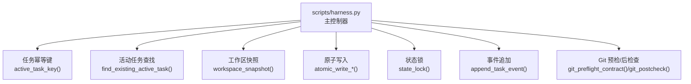
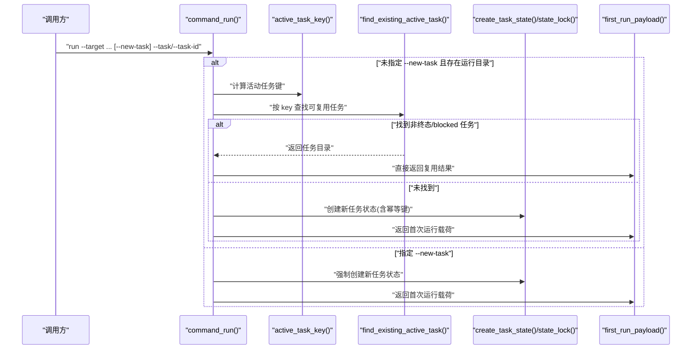
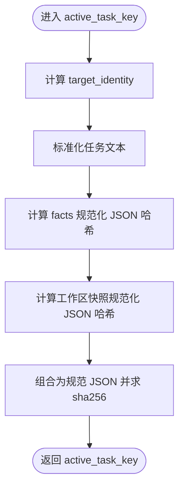
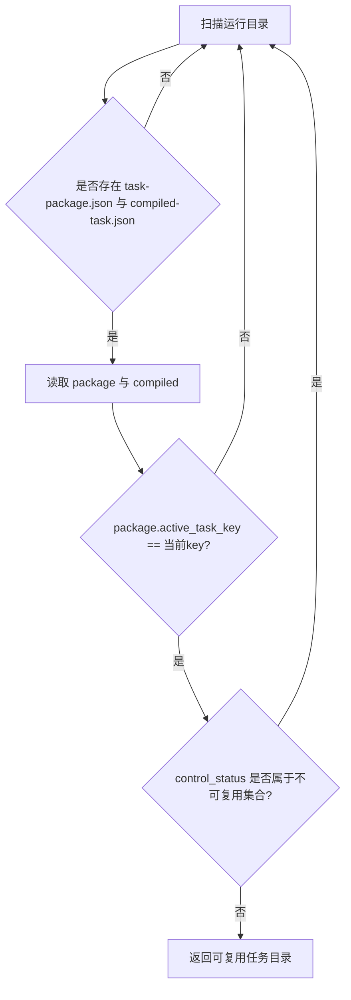
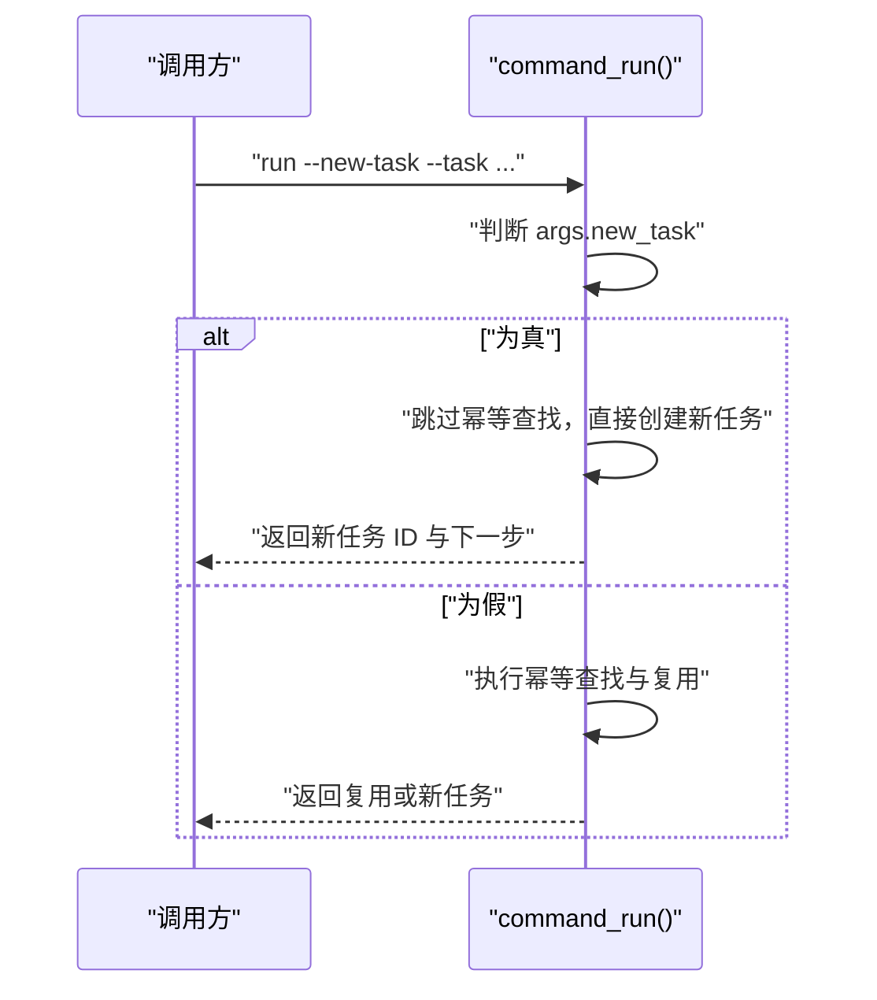
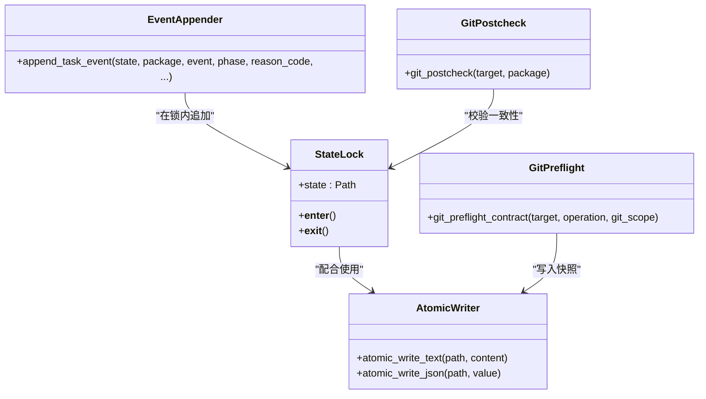
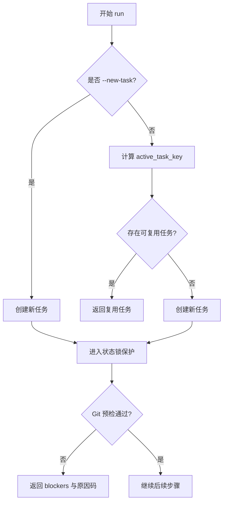
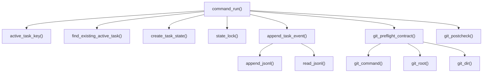

# 并发控制

<cite>
**本文引用的文件**   
- [scripts/harness.py](file://scripts/harness.py)
- [tests/test_harness.py](file://tests/test_harness.py)
</cite>

## 目录
1. [简介](#简介)
2. [项目结构](#项目结构)
3. [核心组件](#核心组件)
4. [架构总览](#架构总览)
5. [详细组件分析](#详细组件分析)
6. [依赖关系分析](#依赖关系分析)
7. [性能考量](#性能考量)
8. [故障排查指南](#故障排查指南)
9. [结论](#结论)
10. [附录](#附录)

## 简介
本文件系统性阐述 Docs Harness 的并发控制机制，重点覆盖：
- 任务幂等性与活动任务键（active_task_key）计算方法
- 状态同步与一致性保证（事务性操作、原子写入、进程级锁）
- 并发冲突检测与处理策略（相同 key 复用逻辑、--new-task 强制新建）
- 并发场景下的最佳实践、错误处理策略与监控指标建议

## 项目结构
- 核心实现位于 scripts/harness.py，包含任务生命周期、并发控制、快照与指纹计算、Git 预检/后检查、事件记录等。
- 测试用例位于 tests/test_harness.py，覆盖 Git 同步、漂移检测、只读审计、远程身份脱敏等关键路径。

**图表来源** 
- [scripts/harness.py:3833-3844](file://scripts/harness.py#L3833-L3844)
- [scripts/harness.py:3852-3871](file://scripts/harness.py#L3852-L3871)
- [scripts/harness.py:1115-1138](file://scripts/harness.py#L1115-L1138)
- [scripts/harness.py:422-438](file://scripts/harness.py#L422-L438)
- [scripts/harness.py:1011-1032](file://scripts/harness.py#L1011-L1032)
- [scripts/harness.py:1034-1073](file://scripts/harness.py#L1034-L1073)
- [scripts/harness.py:680-794](file://scripts/harness.py#L680-L794)
- [scripts/harness.py:796-878](file://scripts/harness.py#L796-L878)

**章节来源**
- [scripts/harness.py:1-120](file://scripts/harness.py#L1-L120)

## 核心组件
- 活动任务键 active_task_key：用于幂等复用同一目标、任务描述、facts 与初始工作区快照的任务。
- 活动任务查找 find_existing_active_task：扫描运行态任务目录，匹配 key 并过滤终态/blocked 任务。
- 工作区快照 workspace_snapshot：生成可比较的工作区指纹，用于幂等键与变更检测。
- 原子写入 atomic_write_text/atomic_write_json：确保状态文件更新具备原子性。
- 状态锁 state_lock：基于文件系统独占锁，避免同一任务被多进程并发修改。
- 事件追加 append_task_event：以 JSONL 追加方式记录任务阶段与统计信息，便于观测与排障。
- Git 预检/后检查 git_preflight_contract/git_postcheck：在 git_sync/fetch 场景下锁定范围、校验远端漂移与受控引用。

**章节来源**
- [scripts/harness.py:3833-3844](file://scripts/harness.py#L3833-L3844)
- [scripts/harness.py:3852-3871](file://scripts/harness.py#L3852-L3871)
- [scripts/harness.py:1115-1138](file://scripts/harness.py#L1115-L1138)
- [scripts/harness.py:422-438](file://scripts/harness.py#L422-L438)
- [scripts/harness.py:1011-1032](file://scripts/harness.py#L1011-L1032)
- [scripts/harness.py:1034-1073](file://scripts/harness.py#L1034-L1073)
- [scripts/harness.py:680-794](file://scripts/harness.py#L680-L794)
- [scripts/harness.py:796-878](file://scripts/harness.py#L796-L878)

## 架构总览
下图展示 run 命令在并发环境下的关键流程：幂等键计算、活动任务复用、状态落盘与锁保护、以及后续步骤引导。

**图表来源** 
- [scripts/harness.py:4617-4639](file://scripts/harness.py#L4617-L4639)
- [scripts/harness.py:3833-3844](file://scripts/harness.py#L3833-L3844)
- [scripts/harness.py:3852-3871](file://scripts/harness.py#L3852-L3871)

**章节来源**
- [scripts/harness.py:4617-4639](file://scripts/harness.py#L4617-L4639)

## 详细组件分析

### 活动任务键 active_task_key 与幂等性
- 组成要素：
  - target_identity：目标仓库或本地路径的身份指纹（Git 远端 URL 脱敏后的集合哈希或本地路径哈希）。
  - task：标准化后的任务文本（去除多余空白）。
  - facts_fingerprint：facts 结构化数据的规范化 JSON 哈希。
  - workspace_snapshot_fingerprint：初始工作区快照的规范化 JSON 哈希。
- 幂等语义：相同 target、任务、facts 与初始工作区快照将得到相同的 active_task_key，从而复用已有任务；终态（complete/cancelled/failed）与 blocked 任务不参与复用。

**图表来源** 
- [scripts/harness.py:3833-3844](file://scripts/harness.py#L3833-L3844)
- [scripts/harness.py:601-612](file://scripts/harness.py#L601-L612)
- [scripts/harness.py:1115-1138](file://scripts/harness.py#L1115-L1138)

**章节来源**
- [scripts/harness.py:3833-3844](file://scripts/harness.py#L3833-L3844)
- [scripts/harness.py:601-612](file://scripts/harness.py#L601-L612)
- [scripts/harness.py:1115-1138](file://scripts/harness.py#L1115-L1138)

### 活动任务查找与复用策略
- 遍历运行目录，读取每个任务的 task-package.json 与 compiled-task.json。
- 仅当 package.active_task_key 与当前 key 一致，且 control_status 不在“不可复用集合”中时，视为可复用。
- 复用成功则直接返回该任务的状态与下一步指令，避免重复准入与编译。

**图表来源** 
- [scripts/harness.py:3852-3871](file://scripts/harness.py#L3852-L3871)

**章节来源**
- [scripts/harness.py:3852-3871](file://scripts/harness.py#L3852-L3871)

### --new-task 参数与强制新建行为
- 当传入 --new-task 时，跳过活动任务幂等复用逻辑，强制创建独立任务。
- 适用于需要隔离执行上下文、避免与历史任务共享状态的场景。

**图表来源** 
- [scripts/harness.py:4617-4639](file://scripts/harness.py#L4617-L4639)
- [scripts/harness.py:10261-10265](file://scripts/harness.py#L10261-L10265)

**章节来源**
- [scripts/harness.py:4617-4639](file://scripts/harness.py#L4617-L4639)
- [scripts/harness.py:10261-10265](file://scripts/harness.py#L10261-L10265)

### 状态同步与一致性保证
- 原子写入：所有关键状态文件通过 atomic_write_text/atomic_write_json 写入临时文件后原子替换，避免部分写入导致的不一致。
- 进程级锁：state_lock 使用 O_CREAT | O_EXCL 创建独占锁文件，若存在则根据锁文件时间戳判断是否为陈旧锁；否则抛出“状态被占用”错误。
- 事件追加：append_task_event 以 JSONL 追加模式写入 events.jsonl，并维护 e vidence-index.json 等索引，保证事件顺序与可追溯性。
- Git 预检/后检查：git_preflight_contract 捕获快照（包括 worktree_fingerprint、index_tree、controlled_refs_namespace 等），git_postcheck 验证远端目标不变、受控引用未越界、工作区与索引一致性。

**图表来源** 
- [scripts/harness.py:1011-1032](file://scripts/harness.py#L1011-L1032)
- [scripts/harness.py:422-438](file://scripts/harness.py#L422-L438)
- [scripts/harness.py:1034-1073](file://scripts/harness.py#L1034-L1073)
- [scripts/harness.py:680-794](file://scripts/harness.py#L680-L794)
- [scripts/harness.py:796-878](file://scripts/harness.py#L796-L878)

**章节来源**
- [scripts/harness.py:1011-1032](file://scripts/harness.py#L1011-L1032)
- [scripts/harness.py:422-438](file://scripts/harness.py#L422-L438)
- [scripts/harness.py:1034-1073](file://scripts/harness.py#L1034-L1073)
- [scripts/harness.py:680-794](file://scripts/harness.py#L680-L794)
- [scripts/harness.py:796-878](file://scripts/harness.py#L796-L878)

### 并发冲突检测与处理策略
- 相同 key 复用：在未显式要求 --new-task 的情况下，系统会尝试复用已存在的活动任务，减少重复准入与编译开销。
- 强制新建：--new-task 强制跳过复用，确保每次执行拥有独立状态空间。
- 冲突处理：
  - 状态锁冲突：state_locked 表示同一任务正被其他进程更新；stale_lock 表示锁超过阈值需人工清理。
  - Git 漂移：git_remote_drift 表示远端目标变化；git_ref_scope_violation 表示受控引用越界。
  - 脏工作区/非快进合并：preflight 阶段拒绝与 sync 范围重叠的脏路径或非 fast-forward 目标。

**图表来源** 
- [scripts/harness.py:4617-4639](file://scripts/harness.py#L4617-L4639)
- [scripts/harness.py:680-794](file://scripts/harness.py#L680-L794)
- [scripts/harness.py:796-878](file://scripts/harness.py#L796-L878)
- [scripts/harness.py:1011-1032](file://scripts/harness.py#L1011-L1032)

**章节来源**
- [scripts/harness.py:4617-4639](file://scripts/harness.py#L4617-L4639)
- [scripts/harness.py:680-794](file://scripts/harness.py#L680-L794)
- [scripts/harness.py:796-878](file://scripts/harness.py#L796-L878)
- [scripts/harness.py:1011-1032](file://scripts/harness.py#L1011-L1032)

### 工作区快照与指纹
- workspace_snapshot 对 Git 工作树进行快照，忽略 .git、node_modules、.venv 及 .docs-harness 下的 runs/quality-ledger/knowledge/knowledge-jobs/background 等目录。
- 小文件采用内容哈希，大文件采用大小+mtime 的组合指纹，限制非 Git 工作区的快照规模以避免截断基线。

**章节来源**
- [scripts/harness.py:1115-1138](file://scripts/harness.py#L1115-L1138)

### Git 预检与后检查
- 预检：捕获 repo_identity、remote、head、index_tree、worktree_fingerprint、controlled_refs_namespace、controlled_ref、refs、lfs/submodule 可用性、fast_forward、sync_scope、deletion_count 等。
- 后检查：对比 current_target_oid、受控引用变更、工作区与索引一致性、LFS/Submodule 有效性，并给出 reason_code（如 git_remote_drift、git_ref_scope_violation）。

**章节来源**
- [scripts/harness.py:680-794](file://scripts/harness.py#L680-L794)
- [scripts/harness.py:796-878](file://scripts/harness.py#L796-L878)

## 依赖关系分析
- command_run 依赖 active_task_key、find_existing_active_task、create_task_state、state_lock、append_task_event 等模块。
- Git 相关能力依赖 git_command、git_root、git_dir、git_refs_snapshot 等工具函数。
- 事件与证据索引依赖 append_jsonl、read_jsonl、read_json 等 IO 工具。

**图表来源** 
- [scripts/harness.py:4617-4639](file://scripts/harness.py#L4617-L4639)
- [scripts/harness.py:3833-3844](file://scripts/harness.py#L3833-L3844)
- [scripts/harness.py:3852-3871](file://scripts/harness.py#L3852-L3871)
- [scripts/harness.py:1011-1032](file://scripts/harness.py#L1011-L1032)
- [scripts/harness.py:1034-1073](file://scripts/harness.py#L1034-L1073)
- [scripts/harness.py:680-794](file://scripts/harness.py#L680-L794)
- [scripts/harness.py:796-878](file://scripts/harness.py#L796-L878)

**章节来源**
- [scripts/harness.py:4617-4639](file://scripts/harness.py#L4617-L4639)
- [scripts/harness.py:3833-3844](file://scripts/harness.py#L3833-L3844)
- [scripts/harness.py:3852-3871](file://scripts/harness.py#L3852-L3871)
- [scripts/harness.py:1011-1032](file://scripts/harness.py#L1011-L1032)
- [scripts/harness.py:1034-1073](file://scripts/harness.py#L1034-L1073)
- [scripts/harness.py:680-794](file://scripts/harness.py#L680-L794)
- [scripts/harness.py:796-878](file://scripts/harness.py#L796-L878)

## 性能考量
- 幂等复用降低重复准入与编译成本，尤其在高频 run 场景显著。
- 工作区快照在大仓库中可能耗时，系统对非 Git 工作区设置文件数量上限，避免截断基线。
- 事件追加采用 JSONL 追加模式，避免全量读写；但频繁追加可能带来 I/O 压力，建议结合日志轮转与批量化采集。
- Git 预检/后检查涉及多次子进程调用，应合理设置超时与重试策略。

[本节为通用指导，不直接分析具体文件]

## 故障排查指南
- 状态锁问题：
  - state_locked：同一任务正在被另一个进程更新，等待或终止冲突进程。
  - stale_lock：检测到超过阈值的陈旧锁，需人工确认后清理。
- Git 漂移与范围违规：
  - git_remote_drift：远端目标对象发生变化，需重新 fetch 或调整任务。
  - git_ref_scope_violation：受控引用发生越界变更，需审查 controlled_refs_namespace。
- 脏工作区与非快进：
  - preflight 阶段拒绝与 sync 范围重叠的脏路径或非 fast-forward 目标，需先提交或重置工作区。

**章节来源**
- [scripts/harness.py:1011-1032](file://scripts/harness.py#L1011-L1032)
- [scripts/harness.py:796-878](file://scripts/harness.py#L796-L878)
- [scripts/harness.py:680-794](file://scripts/harness.py#L680-L794)

## 结论
Docs Harness 通过活动任务键与工作区快照实现任务幂等，结合原子写入、进程级锁与 Git 预检/后检查，确保并发场景下的状态一致性与安全性。--new-task 提供强制新建能力，满足隔离执行需求。建议在高频并发环境中充分利用幂等复用，同时关注事件追加与 Git 操作的 I/O 性能，并结合监控指标优化整体吞吐。

[本节为总结性内容，不直接分析具体文件]

## 附录

### 并发场景最佳实践
- 任务设计模式：
  - 尽量保持任务幂等：相同输入与初始工作区应复用已有任务，避免重复副作用。
  - 明确 write_scope 与 allowed_scope，减少不必要的重编译与再准入。
  - 对于需要隔离执行的场景，显式使用 --new-task。
- 错误处理策略：
  - 捕获 state_locked/stale_lock 并提示人工干预。
  - 针对 git_remote_drift/git_ref_scope_violation 提供回退与重试指引。
  - 对脏工作区与非快进合并给出明确修复步骤。
- 监控指标建议：
  - 事件计数：context/readmission/verification/host_receipt/business_action 等阶段计数。
  - 幂等命中率：active_task_key 命中次数与复用比例。
  - Git 操作成功率：preflight/postcheck 通过率与失败原因分布。
  - 锁竞争指标：state_locked 出现频率与平均等待时长。

**章节来源**
- [scripts/harness.py:1034-1073](file://scripts/harness.py#L1034-L1073)
- [scripts/harness.py:680-794](file://scripts/harness.py#L680-L794)
- [scripts/harness.py:796-878](file://scripts/harness.py#L796-L878)
- [scripts/harness.py:1011-1032](file://scripts/harness.py#L1011-L1032)