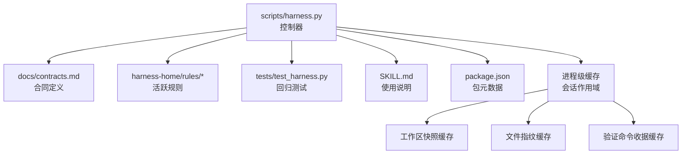
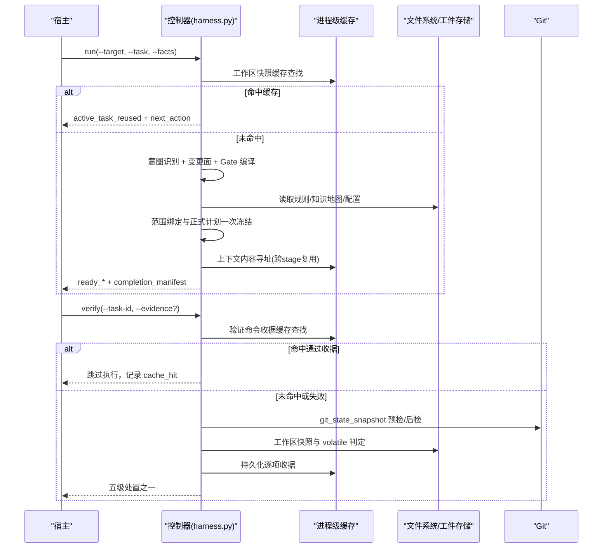
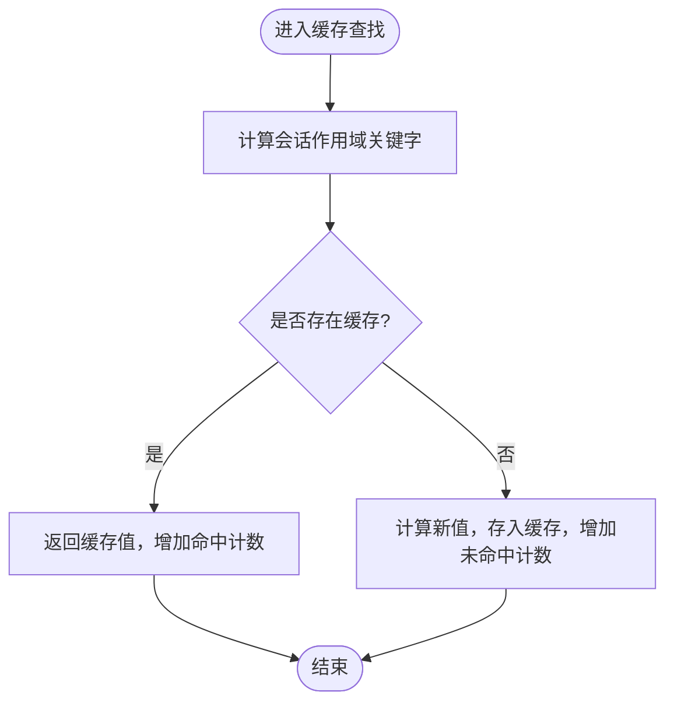
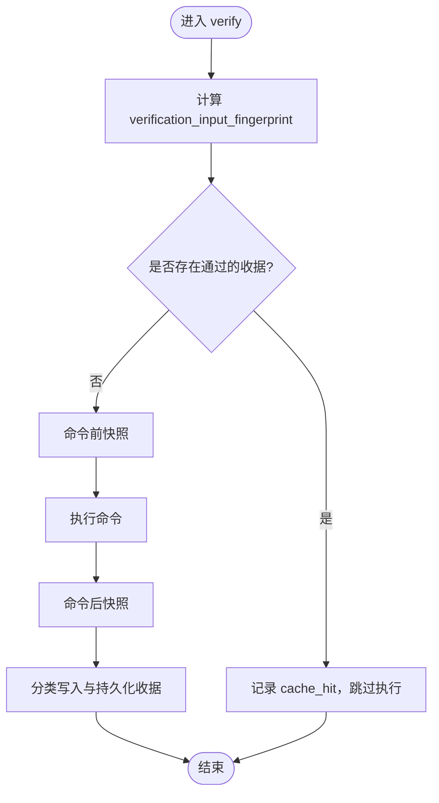
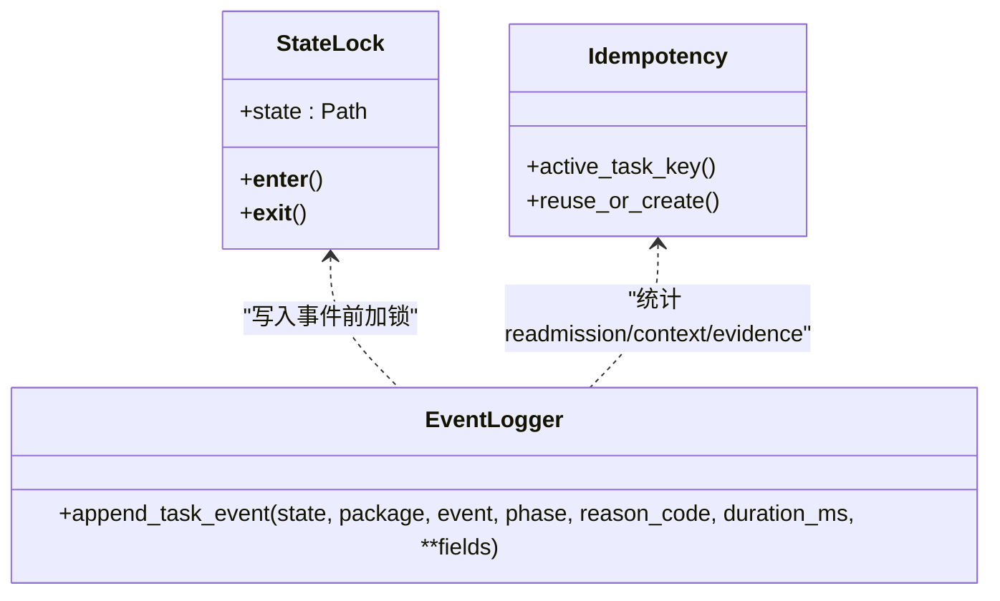
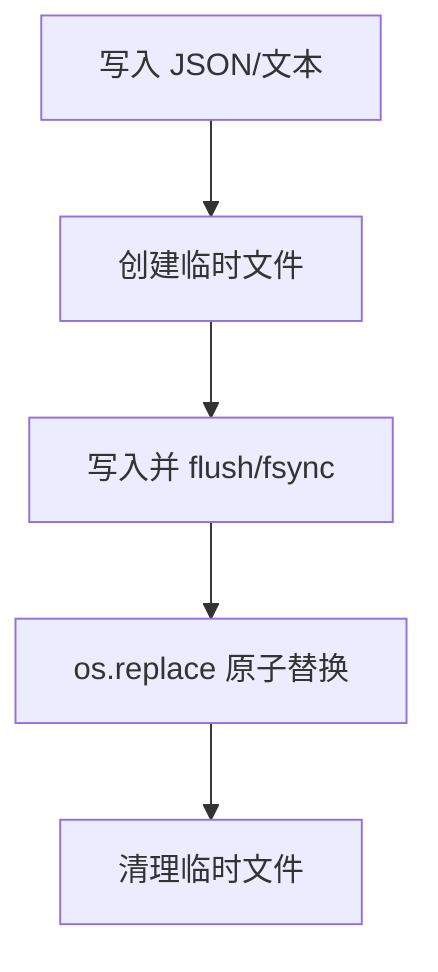
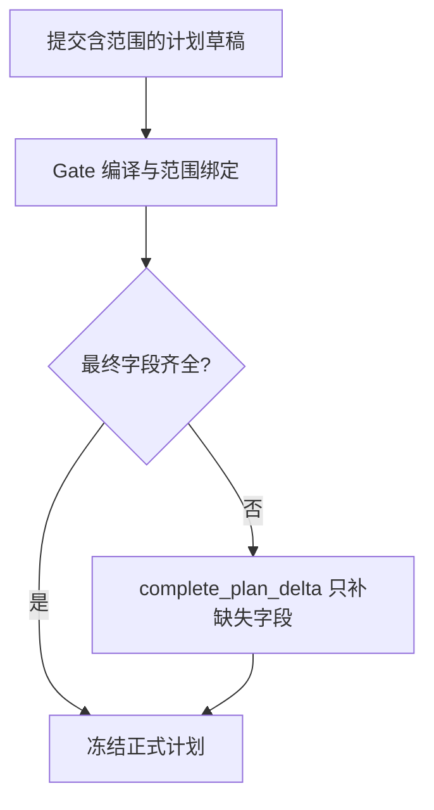
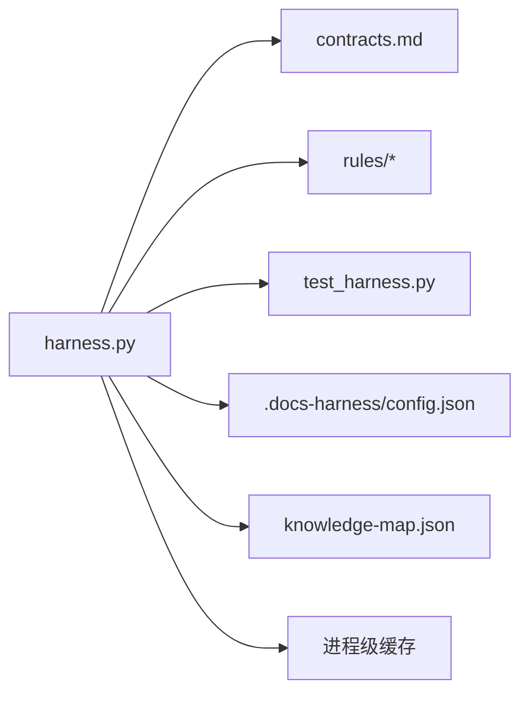

# 性能优化

<cite>
**本文引用的文件**   
- [scripts/harness.py](file://scripts/harness.py)
- [tests/test_harness.py](file://tests/test_harness.py)
- [docs/contracts.md](file://docs/contracts.md)
- [docs/plans/v1.6.4-minimal-systemic-flow-efficiency-plan.md](file://docs/plans/v1.6.4-minimal-systemic-flow-efficiency-plan.md)
- [docs/todo.md](file://docs/todo.md)
</cite>

## 更新摘要
**所做更改**
- 新增进程级缓存机制章节，详细说明会话作用域的关键字设计
- 更新验证层性能优化部分，包含多场景性能提升
- 增强缓存命中率监控和遥测指标说明
- 补充测试用例中的缓存行为验证

## 目录
1. [引言](#引言)
2. [项目结构](#项目结构)
3. [核心组件](#核心组件)
4. [架构总览](#架构总览)
5. [详细组件分析](#详细组件分析)
6. [依赖分析](#依赖分析)
7. [性能考量](#性能考量)
8. [故障排查指南](#故障排查指南)
9. [结论](#结论)
10. [附录](#附录)

## 引言
本文件面向 Docs Harness 的性能优化，聚焦以下主题：
- **进程级缓存机制**：基于会话作用域的关键字设计，支持文件路径、内容摘要、合同版本和目标身份的复合键
- **缓存机制**：内容寻址缓存、验证命令收据缓存、上下文正文复用策略
- **并发控制**：任务幂等性、活动任务键计算、状态同步与锁
- **资源管理**：文件句柄、内存使用、I/O 批处理
- **最小系统性流程效率优化**：分段指纹模型、增量准入、一次性计划冻结
- **调优案例**：scope 绑定优化、Gate 编译优化、验证命令执行优化
- **监控指标与基准测试方法**

## 项目结构
Docs Harness 以单脚本控制器为核心，配合契约文档、规则与测试用例构成完整运行体系。关键路径如下：
- scripts/harness.py：主控制器，实现任务准入、范围与 Gate 编译、上下文与证据、验证命令、后台治理、事件遥测等
- docs/contracts.md：v1.7.1 合同定义，包含 task-package/v2、evidence-receipt/v2、verification-command-receipt/v1、上下文与授权收据等
- harness-home/rules/*：活跃规则集（active），用于 Gate 推断与验收要求
- tests/test_harness.py：覆盖只读查询、Git 操作、漂移归因、验收分层、幂等与事件等回归
- SKILL.md：用户侧使用说明与行为约束
- package.json：包元数据与脚本入口

**图表来源** 
- [scripts/harness.py:1153-1216](file://scripts/harness.py#L1153-L1216)
- [scripts/harness.py:6371-6540](file://scripts/harness.py#L6371-L6540)
- [docs/contracts.md:386-396](file://docs/contracts.md#L386-L396)

**章节来源**
- [scripts/harness.py:1-120](file://scripts/harness.py#L1-L120)
- [docs/contracts.md:1-120](file://docs/contracts.md#L1-L120)
- [harness-home/rules/INDEX.md:1-41](file://harness-home/rules/INDEX.md#L1-L41)
- [tests/test_harness.py:1-120](file://tests/test_harness.py#L1-L120)
- [SKILL.md:1-60](file://SKILL.md#L1-L60)
- [package.json:1-23](file://package.json#L1-L23)

## 核心组件
- 任务准入与意图识别：按 task_intent、candidate_intents、mutation_profile 进行路由与 Gate 编译
- 范围与 Git 操作：read_scope/write_scope/git_scope/external_scope；git_fetch/git_sync 预检与后检
- 上下文与授权：context-receipt/v2 跨阶段内容复用；authorization-receipt/v2 绑定当前 package fingerprint
- 证据与验收：evidence-receipt/v2、verification-command-receipt/v1 逐项收据与复用
- **进程级缓存**：基于会话作用域的工作区快照和文件指纹缓存，支持多层验收场景
- 后台治理：background-job/v2 多路线与进度验收
- 事件遥测：event/v2 脱敏计数与原因码

**章节来源**
- [docs/contracts.md:1-220](file://docs/contracts.md#L1-L220)
- [scripts/harness.py:1153-1216](file://scripts/harness.py#L1153-L1216)
- [scripts/harness.py:6371-6540](file://scripts/harness.py#L6371-L6540)

## 架构总览
下图展示从 run 到 verify 的主流程，以及新增的进程级缓存和幂等的关键节点。

**图表来源** 
- [scripts/harness.py:1153-1216](file://scripts/harness.py#L1153-L1216)
- [scripts/harness.py:6371-6540](file://scripts/harness.py#L6371-L6540)
- [docs/contracts.md:386-396](file://docs/contracts.md#L386-L396)

## 详细组件分析

### 进程级缓存机制：会话作用域关键字设计
**新增** 实现了基于会话作用域的中间工件缓存，显著提升多场景下的性能表现。

- **关键字设计**
  - 工作区快照缓存键：`(目标路径, 清单摘要, 合同版本, target_identity)`
  - 文件指纹缓存键：`(文件路径, 文件大小, mtime_ns)`
  - 验证命令缓存键：`(task_id, target_identity, command_argv_digest, cwd, verification_input_fingerprint, contract_digest)`

- **缓存策略**
  - 清单摘要是全部受跟踪文件的相对路径、大小、mtime_ns 的 SHA-256
  - 任何文件新建、删除或内容变化都会改变摘要并触发重算
  - 合同版本或目标变化同样导致缓存失效
  - 仅复用确定性中间产物，各验收层的判定结论仍各自独立产出

- **内存管理**
  - 工作区快照缓存限制为 64 个条目，超出时自动清理
  - 文件指纹缓存限制为 64×16=1024 个条目，防止内存膨胀
  - 提供 `reset_layer_reuse_cache()` 函数用于测试环境重置

**图表来源** 
- [scripts/harness.py:1153-1216](file://scripts/harness.py#L1153-L1216)
- [scripts/harness.py:1171-1184](file://scripts/harness.py#L1171-L1184)

**章节来源**
- [scripts/harness.py:1153-1216](file://scripts/harness.py#L1153-L1216)
- [scripts/harness.py:1171-1184](file://scripts/harness.py#L1171-L1184)
- [tests/test_harness.py:977-999](file://tests/test_harness.py#L977-L999)

### 缓存机制：内容寻址、验证命令收据与上下文正文复用
- 内容寻址缓存
  - 同一 task_id、target_identity、stage、compiler_contract、content_set_fingerprint 同时满足时，正文不重复交付，仅生成新的阶段确认收据
  - 新增内容集合或 compiler contract 变化时增量返回
- 验证命令收据缓存
  - 每条命令独立计算 verification_input_fingerprint，命中则跳过执行并记录 cache_hit
  - 输入变化、上次失败或 volatile 副产物改变输入时重跑；支持整体关闭开关
- 上下文正文复用策略
  - plan/action 阶段可跨 stage 复用相同内容指纹的正文，避免重复加载
  - 安全与测试 Gate 场景下，第二次上下文响应仅返回新增内容

**图表来源** 
- [docs/contracts.md:190-221](file://docs/contracts.md#L190-L221)
- [docs/plans/v1.6.4-minimal-systemic-flow-efficiency-plan.md:260-303](file://docs/plans/v1.6.4-minimal-systemic-flow-efficiency-plan.md#L260-L303)

**章节来源**
- [docs/contracts.md:222-234](file://docs/contracts.md#L222-L234)
- [docs/contracts.md:190-221](file://docs/contracts.md#L190-L221)
- [docs/plans/v1.6.4-minimal-systemic-flow-efficiency-plan.md:202-218](file://docs/plans/v1.6.4-minimal-systemic-flow-efficiency-plan.md#L202-L218)

### 并发控制：任务幂等性、活动任务键与状态同步
- 活动任务幂等
  - active_task_key = sha256(target_identity + task_snapshot_ref + normalized facts fingerprint + initial workspace snapshot fingerprint)
  - 命中非终态活动任务直接复用，显式 --new-task 才新建
- 状态同步与锁
  - state_lock 基于 .lock 文件原子创建，超时检测与清理，保证同一任务不被并发更新
- 事件记录
  - append_task_event 记录 context_cache_hit、context_load_count、readmission_count、evidence_round_count 等

**图表来源** 
- [scripts/harness.py:1008-1071](file://scripts/harness.py#L1008-L1071)
- [docs/plans/v1.6.4-minimal-systemic-flow-efficiency-plan.md:354-371](file://docs/plans/v1.6.4-minimal-systemic-flow-efficiency-plan.md#L354-L371)

**章节来源**
- [scripts/harness.py:1008-1071](file://scripts/harness.py#L1008-L1071)
- [docs/plans/v1.6.4-minimal-systemic-flow-efficiency-plan.md:354-371](file://docs/plans/v1.6.4-minimal-systemic-flow-efficiency-plan.md#L354-L371)

### 资源管理：文件句柄、内存与 I/O 批处理
- 文件句柄与原子写入
  - atomic_write_text/atomic_write_json 使用临时文件与 os.replace 原子替换，确保一致性
  - append_jsonl 追加 JSONL 并 fsync，保证事件落盘顺序与可见性
- 内存与快照限制
  - workspace_snapshot 对大文件采用 size:mtime 摘要，避免全量哈希；限制非 Git 工作区快照文件数量上限
  - 质量账本与文本扫描有大小与长度限制，防止内存膨胀
- I/O 批处理
  - git_workspace_paths 批量列出工作区文件，减少多次调用开销
  - 验证命令收据缓存避免重复执行昂贵命令

**图表来源** 
- [scripts/harness.py:419-435](file://scripts/harness.py#L419-L435)
- [scripts/harness.py:507-529](file://scripts/harness.py#L507-L529)
- [scripts/harness.py:1112-1136](file://scripts/harness.py#L1112-L1136)

**章节来源**
- [scripts/harness.py:419-435](file://scripts/harness.py#L419-L435)
- [scripts/harness.py:507-529](file://scripts/harness.py#L507-L529)
- [scripts/harness.py:1112-1136](file://scripts/harness.py#L1112-L1136)

### 最小系统性流程效率优化：分段指纹、增量准入与一次性计划冻结
- 分段指纹模型
  - scope_contract_fingerprint、plan_contract_fingerprint、authorization_contract_fingerprint、context_content_fingerprint、context_set_fingerprint、verification_input_fingerprint
  - package revision 变化时生成 contract_delta，明确 added_gates/added_plan_fields/added_context_refs/added_evidence_types 等
- 增量准入
  - 普通新增 Gate 且合同稳定时返回 incremental_admission，仅加载 delta 上下文，不触发完整重新准入
- 一次性计划冻结
  - 范围绑定后在同一事务中重新校验并采用计划，只补缺失字段，不重交未变化正文

**图表来源** 
- [docs/plans/v1.6.4-minimal-systemic-flow-efficiency-plan.md:118-175](file://docs/plans/v1.6.4-minimal-systemic-flow-efficiency-plan.md#L118-L175)
- [docs/contracts.md:78-81](file://docs/contracts.md#L78-L81)

**章节来源**
- [docs/plans/v1.6.4-minimal-systemic-flow-efficiency-plan.md:118-175](file://docs/plans/v1.6.4-minimal-systemic-flow-efficiency-plan.md#L118-L175)
- [docs/contracts.md:78-81](file://docs/contracts.md#L78-L81)

### 具体性能调优案例
- scope 绑定优化
  - 首次范围提案触发安全与测试 Gate 时，仅补充"安全边界""负向路径"，测试 Gate 不增加计划字段；避免整份计划重交
- Gate 编译优化
  - 意图优先、风险 Gate 后置；混合意图取最高变更面与最高风险结果；路径分词规范化避免误命中
- 验证命令执行优化
  - 逐项收据与输入指纹缓存；失败命令只重跑失败项；volatile 副产物不影响已通过命令
- **多层验收优化**
  - 源码、安装副本、Git HEAD/远端、fresh clone 四层验收判定保持独立，但复用确定性中间产物
  - 工作区快照按 (路径, 清单摘要, 合同版本, target_identity) 键做进程级缓存
  - 安装副本 SHA-256 比对按 (路径, 大小, mtime_ns) 键缓存

**章节来源**
- [docs/plans/v1.6.4-minimal-systemic-flow-efficiency-plan.md:176-194](file://docs/plans/v1.6.4-minimal-systemic-flow-efficiency-plan.md#L176-L194)
- [docs/plans/task-admission-efficiency-plan.md:2150-2399](file://docs/plans/task-admission-efficiency-plan.md#L2150-L2399)
- [docs/contracts.md:190-221](file://docs/contracts.md#L190-L221)
- [docs/contracts.md:386-396](file://docs/contracts.md#L386-L396)

## 依赖分析
- 控制器依赖契约定义与活跃规则，运行时读取知识地图与项目配置
- 测试覆盖只读查询、Git fetch/sync、漂移归因、验收分层、幂等与事件
- 版本与脚本由 package.json 管理

**图表来源** 
- [scripts/harness.py:1-120](file://scripts/harness.py#L1-L120)
- [docs/contracts.md:1-120](file://docs/contracts.md#L1-L120)
- [harness-home/rules/INDEX.md:1-41](file://harness-home/rules/INDEX.md#L1-L41)
- [tests/test_harness.py:1-120](file://tests/test_harness.py#L1-L120)

**章节来源**
- [scripts/harness.py:1-120](file://scripts/harness.py#L1-L120)
- [docs/contracts.md:1-120](file://docs/contracts.md#L1-L120)
- [harness-home/rules/INDEX.md:1-41](file://harness-home/rules/INDEX.md#L1-L41)
- [tests/test_harness.py:1-120](file://tests/test_harness.py#L1-L120)

## 性能考量
- **进程级缓存命中率提升**：通过会话作用域关键字设计，显著降低重复计算和上下文加载
- **多层验收优化**：源码、安装副本、Git HEAD/远端、fresh clone 四层验收复用确定性中间产物
- **幂等与锁**：活动任务键与状态锁避免重复任务与并发写冲突
- **I/O 批处理与原子写入**：减少系统调用次数，保障一致性与顺序
- **分段指纹与增量准入**：缩小失效边界，避免全量重新准入
- **遥测与度量**：事件字段提供可复算的指标，支撑持续优化

[本节为通用指导，无需特定文件引用]

## 故障排查指南
- 常见错误与退出码
  - 2：输入、合同、绑定或状态无效
  - 3：需要方案、授权、证据（含 provide_evidence/refresh_evidence）、迁移、用户输入或 Git 交付
  - 4：范围、漂移、Gate、远端、授权或规则变化，必须重新准入
- 定位手段
  - 查看 events.jsonl 中的 verification_attempt、readmission_count、context_cache_hit 等字段
  - 检查 state_lock 是否残留（stale_lock）
  - 核对 verification.command_cache_enabled 与 auto_attribute_in_scope 配置
  - 使用 `layer_reuse_stats()` 检查缓存命中率

**章节来源**
- [docs/contracts.md:359-370](file://docs/contracts.md#L359-L370)
- [scripts/harness.py:1008-1071](file://scripts/harness.py#L1008-L1071)
- [scripts/harness.py:1159-1161](file://scripts/harness.py#L1159-L1161)

## 结论
通过进程级缓存机制、内容寻址缓存、验证命令收据缓存与上下文正文复用，结合活动任务幂等、状态锁与分段指纹模型，Docs Harness 在保持安全边界的前提下显著降低了重复工作与重新准入成本。新增的多层验收优化进一步提升了多场景下的性能表现。配合事件遥测与量化指标，可实现持续的性能优化与问题定位。

[本节为总结，无需特定文件引用]

## 附录
- **监控指标建议**
  - context_cache_hit、context_load_count、readmission_count、evidence_round_count、command_executed_count、command_cache_hit_count
  - **新增**：snapshot_hits、snapshot_misses、file_hash_hits、file_hash_misses（用于进程级缓存监控）
- **基准测试方法**
  - 固定基线任务集对比旧流程与候选流程的事件计数与耗时
  - 针对 scope 绑定、Gate 编译、验证命令执行三类场景分别采集指标
  - **新增**：针对多层验收场景的缓存命中率基准测试

**章节来源**
- [docs/plans/v1.6.4-minimal-systemic-flow-efficiency-plan.md:592-609](file://docs/plans/v1.6.4-minimal-systemic-flow-efficiency-plan.md#L592-L609)
- [docs/contracts.md:283-301](file://docs/contracts.md#L283-L301)
- [scripts/harness.py:1159-1161](file://scripts/harness.py#L1159-L1161)
- [tests/test_harness.py:977-1021](file://tests/test_harness.py#L977-L1021)