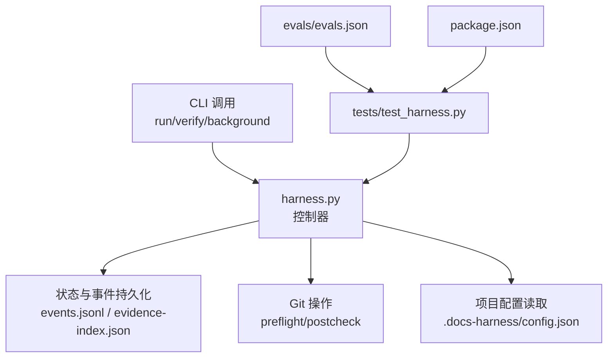
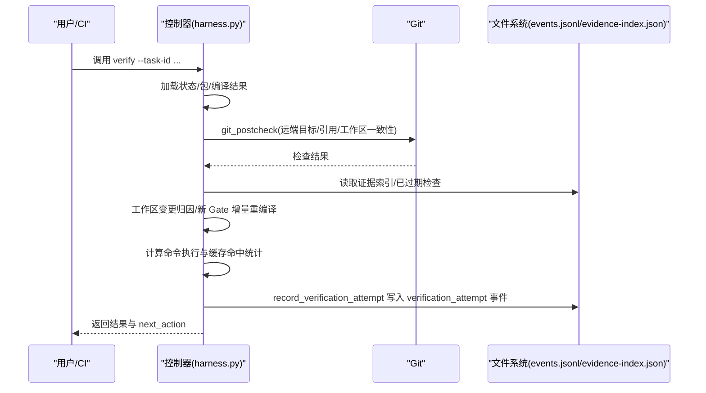
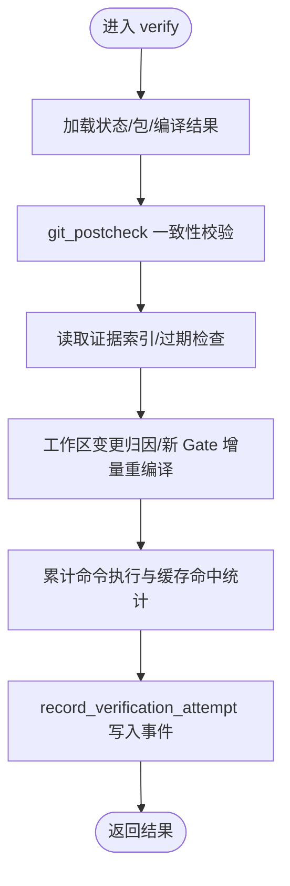
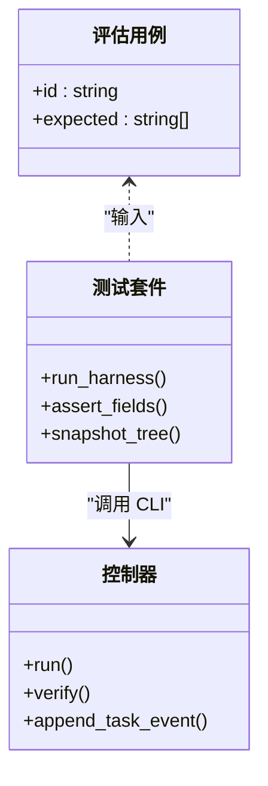
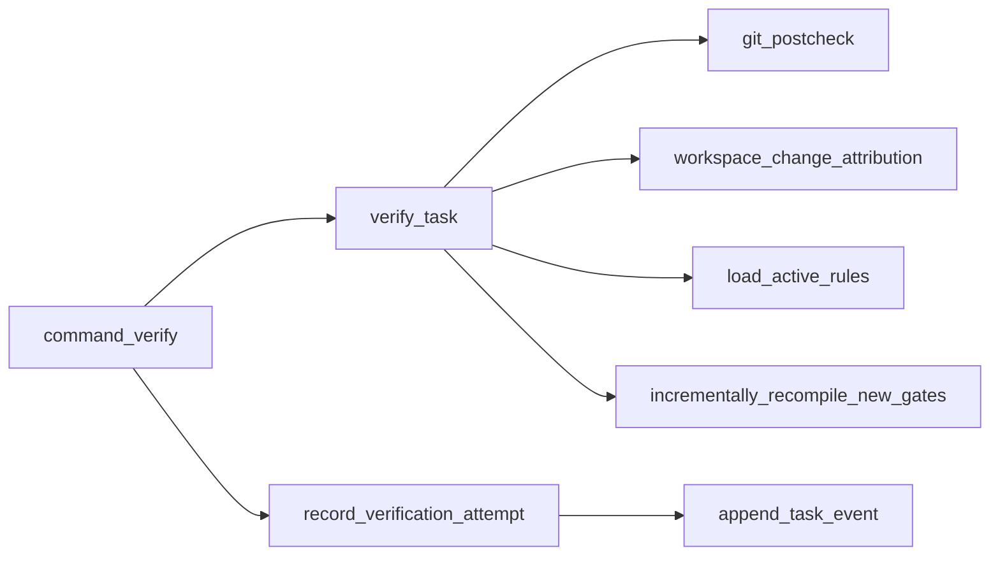

# 性能监控与基准测试

<cite>
**本文引用的文件**   
- [scripts/harness.py](file://scripts/harness.py)
- [tests/test_harness.py](file://tests/test_harness.py)
- [evals/evals.json](file://evals/evals.json)
- [package.json](file://package.json)
- [SKILL.md](file://SKILL.md)
</cite>

## 目录
1. [简介](#简介)
2. [项目结构](#项目结构)
3. [核心组件](#核心组件)
4. [架构总览](#架构总览)
5. [详细组件分析](#详细组件分析)
6. [依赖关系分析](#依赖关系分析)
7. [性能考量](#性能考量)
8. [故障排查指南](#故障排查指南)
9. [结论](#结论)
10. [附录](#附录)

## 简介
本文件面向 Docs Harness 的性能监控与基准测试，聚焦以下目标：
- 解释性能指标收集机制：verification_attempt 事件、readmission_count 统计、命令缓存命中率监控。
- 说明基准测试框架：固定基线任务集、量化验收指标、性能回归检测。
- 阐述监控仪表板设计：关键性能 KPI、趋势分析与异常告警。
- 介绍性能分析工具：CPU 使用率监控、内存占用分析、I/O 性能追踪。
- 提供性能调优指南：瓶颈识别、优化策略与效果评估。
- 包含自动化性能测试集成与持续监控配置建议。

## 项目结构
Docs Harness 以单脚本控制器为核心，配合测试与评估用例构成最小可运行单元：
- scripts/harness.py：主控制器，实现任务编排、证据校验、Git 预检/后检、事件与遥测写入等。
- tests/test_harness.py：单元测试与契约测试，覆盖 run/verify 流程、上下文缓存、验证事件字段等。
- evals/evals.json：评估用例清单，定义预期行为与验收要点，可作为基准测试输入。
- package.json：脚本入口与测试命令，便于在 CI 中统一执行。
- SKILL.md：能力说明与 CLI 用法参考。

**图表来源** 
- [scripts/harness.py:1034-1073](file://scripts/harness.py#L1034-L1073)
- [scripts/harness.py:6410-6465](file://scripts/harness.py#L6410-L6465)
- [tests/test_harness.py:59-71](file://tests/test_harness.py#L59-L71)
- [package.json:17-21](file://package.json#L17-L21)

**章节来源**
- [scripts/harness.py:1-120](file://scripts/harness.py#L1-L120)
- [package.json:17-21](file://package.json#L17-L21)

## 核心组件
- 事件与遥测记录器：append_task_event 负责将阶段时长、上下文缓存命中、重新准入计数、证据轮次、主机收据数量等业务指标写入 events.jsonl。
- 验证尝试记录器：record_verification_attempt 为每次 verify 入口写入有界遥测事件，聚合命令执行次数、命令缓存命中次数、上下文加载计数、变更路径数等。
- Git 预检/后检：git_preflight_contract 与 git_postcheck 用于冻结远端目标、限制引用范围、检查工作区一致性，并在 verify 时进行一致性校验。
- 工作区快照与差异：workspace_snapshot 与 snapshot_changes 用于构建工作区指纹并计算变更集合，支撑归因与准入判定。
- 项目配置开关：verification.command_cache_enabled、verification.auto_attribute_in_scope、verification.volatile_paths 等控制验证行为与缓存策略。

**章节来源**
- [scripts/harness.py:1034-1073](file://scripts/harness.py#L1034-L1073)
- [scripts/harness.py:6410-6465](file://scripts/harness.py#L6410-L6465)
- [scripts/harness.py:680-794](file://scripts/harness.py#L680-L794)
- [scripts/harness.py:796-878](file://scripts/harness.py#L796-L878)
- [scripts/harness.py:1115-1142](file://scripts/harness.py#L1115-L1142)
- [scripts/harness.py:1191-1216](file://scripts/harness.py#L1191-L1216)

## 架构总览
下图展示一次 verify 的端到端流程，包括事件采集、Git 后检、证据复用与遥测落盘。

**图表来源** 
- [scripts/harness.py:6449-6465](file://scripts/harness.py#L6449-L6465)
- [scripts/harness.py:6468-6599](file://scripts/harness.py#L6468-L6599)
- [scripts/harness.py:796-878](file://scripts/harness.py#L796-L878)
- [scripts/harness.py:1034-1073](file://scripts/harness.py#L1034-L1073)

## 详细组件分析

### 性能指标收集机制
- verification_attempt 事件
  - 触发点：command_verify 在 try/except 包裹 verify_task，最终通过 record_verification_attempt 写入事件。
  - 关键字段：duration_ms、outcome_class、reason_codes、exit_code、command_executed_count、command_cache_hit_count、command_cache_enabled、context_full_load_count、context_delta_load_count、evidence_regeneration_required、changed_path_count。
  - 作用：为每次验证尝试提供统一的时序与结果分类，便于趋势分析与回归检测。
- readmission_count 统计
  - 计算方式：append_task_event 对 prior events 中 event 属于 {readmission, scope_bound_readmission, incremental_gate_readmission} 的数量求和。
  - 作用：衡量因范围变化、Gate 新增或上下文漂移导致的重新准入频率，作为稳定性与变更管控的指标。
- 命令缓存命中率监控
  - 数据来源：telemetry 中的 command_executed_count 与 command_cache_hit_count；是否启用由 verification.command_cache_enabled 控制。
  - 作用：评估验证命令去重效果，指导缓存策略与输入规范化。

**图表来源** 
- [scripts/harness.py:6449-6465](file://scripts/harness.py#L6449-L6465)
- [scripts/harness.py:6468-6599](file://scripts/harness.py#L6468-L6599)
- [scripts/harness.py:1034-1073](file://scripts/harness.py#L1034-L1073)

**章节来源**
- [scripts/harness.py:6410-6465](file://scripts/harness.py#L6410-L6465)
- [scripts/harness.py:1034-1073](file://scripts/harness.py#L1034-L1073)
- [scripts/harness.py:1191-1216](file://scripts/harness.py#L1191-L1216)

### 基准测试框架
- 固定基线任务集
  - 通过 evals/evals.json 定义用例 ID 与期望行为（如 ready_direct、read_only、git_preflight/postcheck、verification_command_receipts 等），可作为稳定基线。
  - 测试驱动：tests/test_harness.py 通过 subprocess 调用 harness.py 并以 JSON 输出断言，确保契约一致。
- 量化验收指标
  - 事件字段完整性：duration_ms、context_cache_hit、readmission_count、evidence_round_count 等。
  - 行为断言：admission_status、mutation_profile、write_scope、allowed_actions、control_status、next_action 等。
- 性能回归检测
  - 基于 events.jsonl 的 duration_ms 分布、command_cache_hit_count 比例、readmission_count 趋势进行阈值比较。
  - 结合 evals 用例的“expected”列表，快速定位回归点。

**图表来源** 
- [evals/evals.json:1-175](file://evals/evals.json#L1-L175)
- [tests/test_harness.py:59-71](file://tests/test_harness.py#L59-L71)
- [scripts/harness.py:1034-1073](file://scripts/harness.py#L1034-L1073)

**章节来源**
- [evals/evals.json:1-175](file://evals/evals.json#L1-L175)
- [tests/test_harness.py:59-71](file://tests/test_harness.py#L59-L71)

### 监控仪表板设计
- 关键性能 KPI
  - 单次验证耗时：duration_ms（均值、P95、P99）。
  - 命令缓存命中率：command_cache_hit_count / (command_executed_count + command_cache_hit_count)。
  - 重新准入频率：readmission_count 随时间序列。
  - 上下文加载效率：context_full_load_count、context_delta_load_count。
  - 证据再生需求：evidence_regeneration_required 占比。
- 趋势分析
  - 按 task_id、reason_code、phase 维度聚合 events.jsonl，绘制时间序列与分位数。
  - 对比 evals 基线用例的 expected 行为，自动标记偏离。
- 异常告警
  - 当 duration_ms 超过阈值、command_cache_hit_count 突降、readmission_count 激增、evidence_regeneration_required 频繁出现时触发告警。
  - 结合 git_postcheck.reason_code 与 blocked blockers 信息定位根因。

[本节为概念性内容，不直接分析具体文件]

### 性能分析工具
- CPU 使用率监控
  - 在 CI 中以 time 或 perf 包裹 python3 scripts/harness.py verify，采集进程级 CPU 与系统调用。
- 内存占用分析
  - 使用 tracemalloc 或外部工具（如 py-spy）采样 Python 进程内存增长，关注 workspace_snapshot 与事件写入路径。
- I/O 性能追踪
  - 跟踪 events.jsonl、evidence-index.json 的读写频次与大小，评估 append_jsonl 与 append_task_event 的开销。
  - 观察 Git 子进程调用（ls-files、diff、rev-list）的频率与耗时。

[本节为通用指导，不直接分析具体文件]

### 性能调优指南
- 瓶颈识别
  - 高 duration_ms：优先检查 Git 后检、工作区快照、证据索引扫描与规则加载。
  - 低命令缓存命中率：检查 verify 输入是否规范化、command_cache_enabled 是否被禁用。
  - 高 readmission_count：审查 write_scope 与 Gate 变更策略，减少不必要的重新准入。
- 优化策略
  - 启用命令缓存：verification.command_cache_enabled=true（默认开启）。
  - 缩小工作区快照范围：利用 excluded_workspace_path 与 volatile_verification_path 排除无关路径。
  - 增量上下文加载：利用 context_delta 与增量 Gate 重编译，避免全量加载。
- 效果评估
  - 对比优化前后 events.jsonl 的 duration_ms 分布、command_cache_hit_count 比例、readmission_count 趋势。
  - 回归检测：通过 evals 用例与测试断言确认行为未退化。

**章节来源**
- [scripts/harness.py:1115-1142](file://scripts/harness.py#L1115-L1142)
- [scripts/harness.py:1191-1216](file://scripts/harness.py#L1191-L1216)
- [scripts/harness.py:1034-1073](file://scripts/harness.py#L1034-L1073)

### 自动化性能测试集成与持续监控
- 集成方式
  - 使用 package.json 的 test/self-test 脚本在 CI 中执行 unittest 与 self-test。
  - 将 evals 用例作为固定基线，定期运行并记录 events.jsonl 指标。
- 持续监控
  - 将 events.jsonl 导出至时序数据库，构建 dashboard 与告警规则。
  - 对 key 用例（如 v2-read-only-intent、v2-git-preflight-postcheck、verification-command-receipts）设置回归阈值。

**章节来源**
- [package.json:17-21](file://package.json#L17-L21)
- [evals/evals.json:1-175](file://evals/evals.json#L1-L175)

## 依赖关系分析
- 模块内依赖
  - command_verify 依赖 verify_task、record_verification_attempt、append_task_event。
  - verify_task 依赖 git_postcheck、workspace_change_attribution、load_active_rules、incrementally_recompile_new_gates。
  - append_task_event 依赖 read_jsonl、append_jsonl、utc_now。
- 外部依赖
  - Git 子进程调用（ls-files、diff、rev-list、lfs、submodule）。
  - 文件系统 I/O（JSON/JSONL 读写、原子写入）。
- 潜在循环依赖
  - 当前实现以函数式为主，未见明显循环导入；事件与状态文件为单向写入。

**图表来源** 
- [scripts/harness.py:6449-6465](file://scripts/harness.py#L6449-L6465)
- [scripts/harness.py:6468-6599](file://scripts/harness.py#L6468-L6599)
- [scripts/harness.py:1034-1073](file://scripts/harness.py#L1034-L1073)

**章节来源**
- [scripts/harness.py:6449-6599](file://scripts/harness.py#L6449-L6599)
- [scripts/harness.py:1034-1073](file://scripts/harness.py#L1034-L1073)

## 性能考量
- 事件写入开销：append_task_event 会读取 prior events 并追加 JSONL，需关注大事件文件的 I/O 成本。
- 工作区快照：workspace_snapshot 遍历文件并计算指纹，非 Git 工作区存在文件大小限制与截断保护。
- Git 子进程：多次调用 ls-files/diff/rev-list/lfs/submodule，应合并或批量化以减少进程开销。
- 规则加载：load_active_rules 解析 frontmatter 与正文指纹，应避免重复加载。

[本节为通用指导，不直接分析具体文件]

## 故障排查指南
- 常见错误码与原因
  - git_remote_drift：远端目标不一致导致重新准入。
  - git_ref_scope_violation：超出受控引用范围。
  - invalid_completion_manifest：完成清单缺失或指纹无效。
  - not_admitted：任务尚未获得执行准入。
- 排查步骤
  - 查看 events.jsonl 中 verification_attempt 事件的 reason_codes 与 outcome_class。
  - 检查 git_postcheck 的 checks 与 changed_refs/outside_refs。
  - 核对 verification.command_cache_enabled 与 auto_attribute_in_scope 配置。
  - 使用 evals 用例复现问题，定位回归点。

**章节来源**
- [scripts/harness.py:796-878](file://scripts/harness.py#L796-L878)
- [scripts/harness.py:6468-6599](file://scripts/harness.py#L6468-L6599)
- [tests/test_harness.py:1146-1147](file://tests/test_harness.py#L1146-L1147)

## 结论
Docs Harness 通过结构化事件与有界遥测实现了可观测、可回归的性能监控体系。verification_attempt 事件、readmission_count 统计与命令缓存命中率构成了核心 KPI；结合 evals 基线与测试断言，可实现稳定的基准测试与回归检测。建议在 CI 中持续采集 events.jsonl 并构建仪表板，针对耗时、缓存命中率与重新准入频率设置阈值告警，配合 Git 后检与工作区快照优化，持续提升验证效率与稳定性。

[本节为总结性内容，不直接分析具体文件]

## 附录
- CLI 参考：SKILL.md 提供了 run/verify/background 等命令的使用说明。
- 测试命令：package.json 定义了 test 与 self-test 脚本，便于在本地与 CI 中统一执行。

**章节来源**
- [SKILL.md:1-106](file://SKILL.md#L1-L106)
- [package.json:17-21](file://package.json#L17-L21)