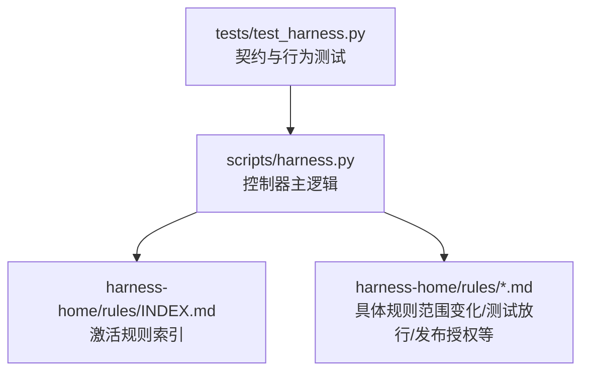
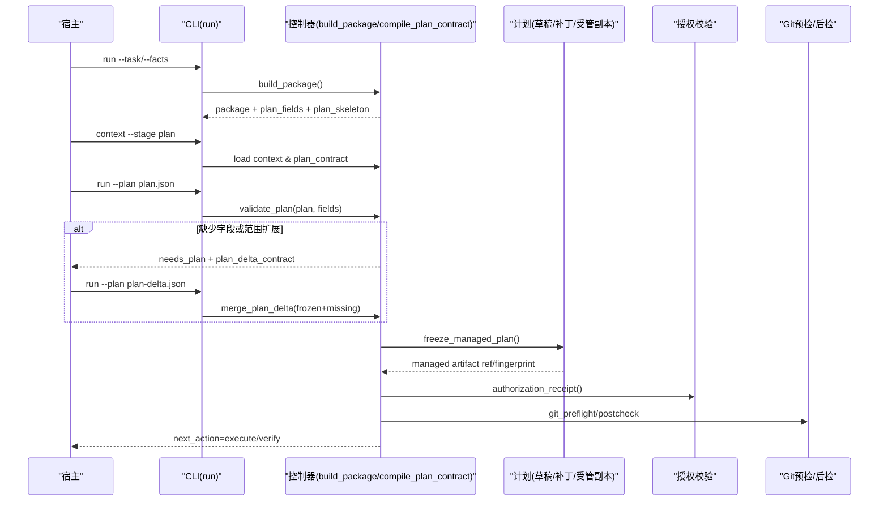
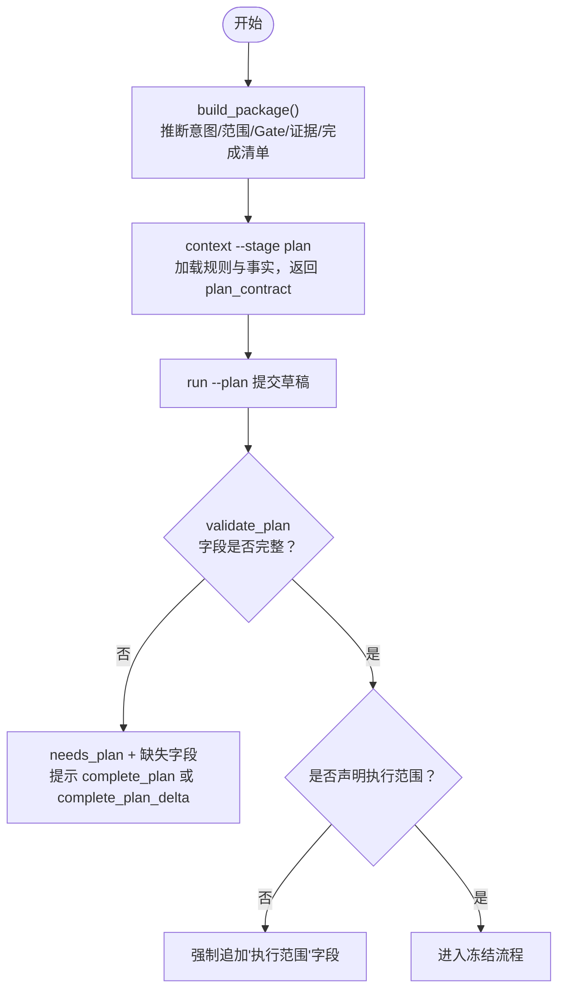
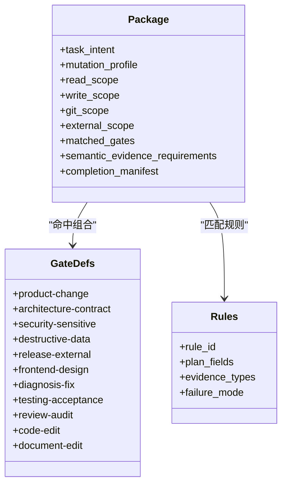
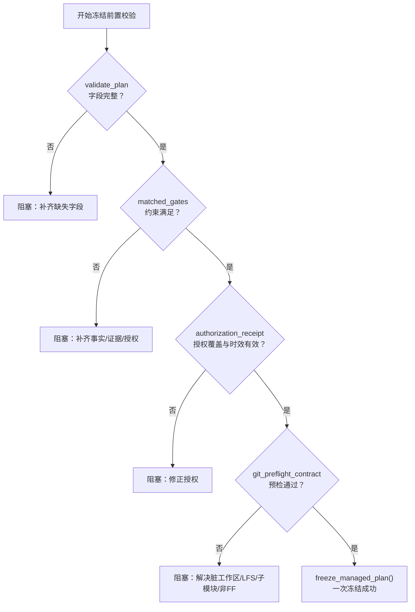
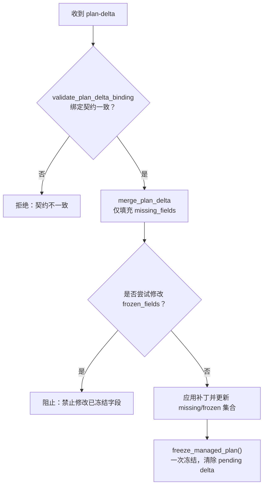
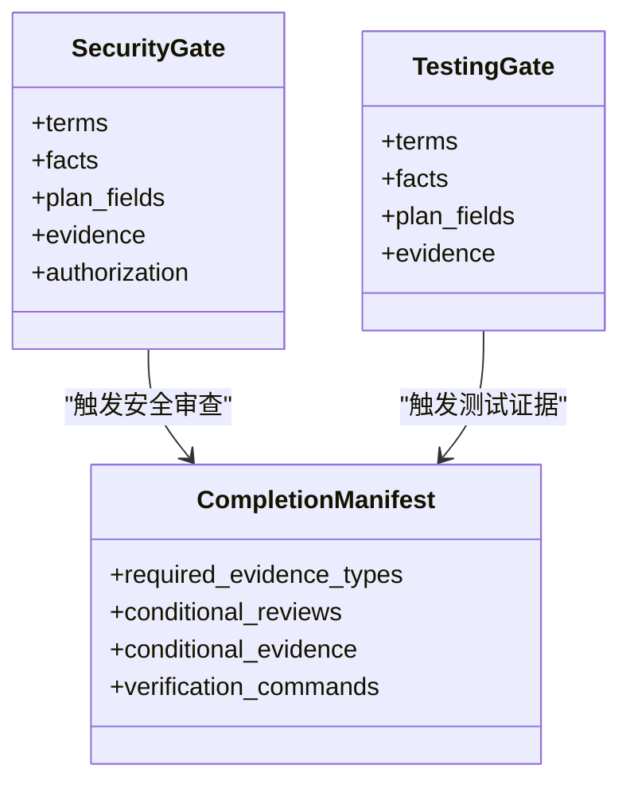
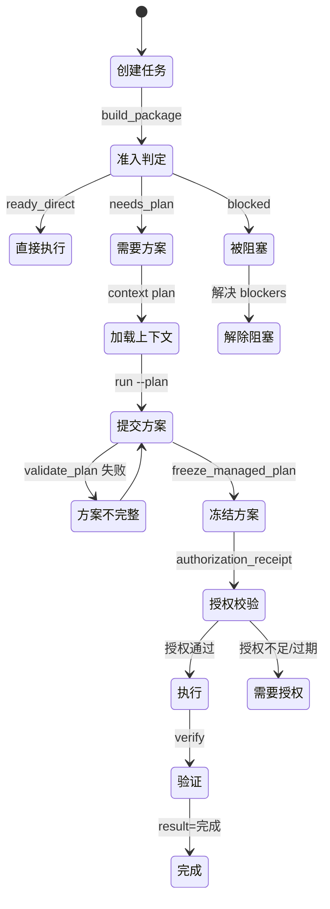
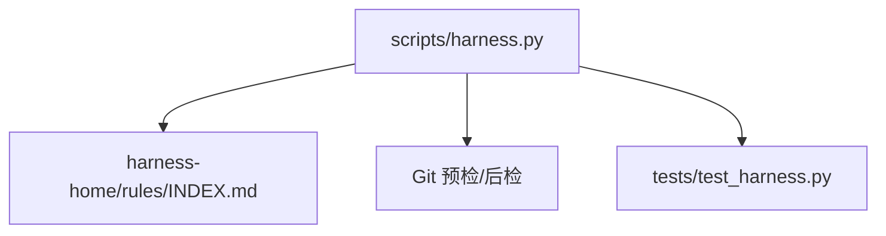

# 一次性计划冻结策略

<cite>
**本文引用的文件**   
- [scripts/harness.py](file://scripts/harness.py)
- [harness-home/rules/INDEX.md](file://harness-home/rules/INDEX.md)
- [harness-home/rules/scope-change-readmission.md](file://harness-home/rules/scope-change-readmission.md)
- [harness-home/rules/testing-release.md](file://harness-home/rules/testing-release.md)
- [harness-home/rules/release-authorization-rollback.md](file://harness-home/rules/release-authorization-rollback.md)
- [tests/test_harness.py](file://tests/test_harness.py)
</cite>

## 目录
1. [简介](#简介)
2. [项目结构](#项目结构)
3. [核心组件](#核心组件)
4. [架构总览](#架构总览)
5. [详细组件分析](#详细组件分析)
6. [依赖关系分析](#依赖关系分析)
7. [性能考量](#性能考量)
8. [故障排查指南](#故障排查指南)
9. [结论](#结论)
10. [附录](#附录)

## 简介
本文件面向 Docs Harness 的一次性计划冻结策略，围绕“范围提案首次绑定”的完整处理流程展开，包括：
- 计划草稿解析、scope 提取、Gate 编译与字段校验
- 正式计划冻结的前置条件（必需字段完整性、Gate 约束满足、授权要求确认）
- 计划补丁机制（仅允许补充新增字段、禁止修改已冻结字段、source_ref 文件绑定）
- 安全与测试 Gate 场景的特殊响应策略
- 完整的计划生命周期状态图与错误处理示例

该策略确保任务在执行前以“一次冻结”的方式锁定方案与范围，后续变更通过受控的补丁路径推进，避免重复准入与范围漂移。

## 项目结构
Docs Harness 的核心控制器位于 scripts/harness.py，规则定义位于 harness-home/rules 目录，测试用例位于 tests/test_harness.py。计划冻结相关逻辑集中在控制器的包构建、计划编译、验证与冻结函数中。

**图表来源** 
- [scripts/harness.py](file://scripts/harness.py)
- [harness-home/rules/INDEX.md](file://harness-home/rules/INDEX.md)

**章节来源**
- [scripts/harness.py](file://scripts/harness.py)
- [harness-home/rules/INDEX.md](file://harness-home/rules/INDEX.md)

## 核心组件
- 包构建与意图分类：build_package 负责从任务文本与 facts 推导 task_intent、mutation_profile、候选动作、Git 操作、Gate 集合、知识上下文、证据需求、完成清单等，并生成 plan_fields 与 plan_skeleton。
- 计划合同编译：compile_plan_contract 根据 gates 与 matched_rules 合成必需字段集；当 mutation_profile 需要写范围且未提供 write_scope 时强制加入“执行范围”。
- 计划提交与冻结：command_run 在 context plan 之后接受 plan 草案，校验缺失字段，必要时触发 plan-delta 流程；freeze_managed_plan 将受管副本写入 compiled-task 并清除 pending delta，实现“一次冻结”。
- 计划补丁：plan_delta_contract 描述 base_plan 引用、frozen_plan_fields、missing_plan_fields 以及 added_gates/evidence_types 等增量信息；merge_plan_delta 仅允许对 missing_fields 进行填充，禁止修改 frozen 字段。
- 前置校验：validate_plan 检查字段完整性；authorization_receipt 校验授权覆盖度与时效；git_preflight_contract/git_postcheck 保障 Git 预检与后检一致性。

**章节来源**
- [scripts/harness.py:2675-2708](file://scripts/harness.py#L2675-L2708)
- [scripts/harness.py:4118-4160](file://scripts/harness.py#L4118-L4160)
- [scripts/harness.py:4798-4899](file://scripts/harness.py#L4798-L4899)
- [scripts/harness.py:4498-4520](file://scripts/harness.py#L4498-L4520)
- [scripts/harness.py:680-794](file://scripts/harness.py#L680-L794)
- [scripts/harness.py:796-878](file://scripts/harness.py#L796-L878)

## 架构总览
下图展示了一次性计划冻结的关键阶段与数据流：从 run 入口到 context plan、plan 提交、delta 合并、最终冻结与后续执行。

**图表来源** 
- [scripts/harness.py:4707-4899](file://scripts/harness.py#L4707-L4899)
- [scripts/harness.py:4118-4160](file://scripts/harness.py#L4118-L4160)
- [scripts/harness.py:4498-4520](file://scripts/harness.py#L4498-L4520)
- [scripts/harness.py:680-878](file://scripts/harness.py#L680-L878)

## 详细组件分析

### 首次绑定与计划草稿解析
- 入口：run 命令首次调用时，build_package 基于任务文本与 facts 推断意图、范围、Gate、证据需求与完成清单，并生成 plan_fields 与 plan_skeleton。
- 计划草稿：context --stage plan 加载规则与事实，返回 plan_contract（包含 plan_fields、scope_required、allowed/read/write/git/external scope、allowed_actions）。
- 草稿校验：run --plan 接收草稿后，validate_plan 检查必填字段；若缺失则返回 needs_plan 与缺失字段列表，并提示下一步 complete_plan 或 complete_plan_delta。

**图表来源** 
- [scripts/harness.py:2779-3076](file://scripts/harness.py#L2779-L3076)
- [scripts/harness.py:4297-4443](file://scripts/harness.py#L4297-L4443)
- [scripts/harness.py:4798-4857](file://scripts/harness.py#L4798-L4857)

**章节来源**
- [scripts/harness.py:2779-3076](file://scripts/harness.py#L2779-L3076)
- [scripts/harness.py:4297-4443](file://scripts/harness.py#L4297-L4443)
- [scripts/harness.py:4798-4857](file://scripts/harness.py#L4798-L4857)

### scope 提取与 Gate 编译
- scope 提取：支持 read_scope、write_scope、git_scope、external_scope 与 legacy allowed_scope；当 write_scope 存在时提升 mutation_profile；git_sync 场景下由 git_preflight_contract 自动生成 write_scope 并与手工值比对。
- Gate 编译：GATE_DEFS 定义各 Gate 的事实引用、必需 plan_fields 与证据类型；SAFETY_FLOOR_GATES 为安全底线（security-sensitive、destructive-data、release-external），即使宿主未声明也会被强制并入。
- 规则匹配：load_active_rules 按 gate 与关键词匹配规则，累积 plan_fields 与 evidence_types。

**图表来源** 
- [scripts/harness.py:263-345](file://scripts/harness.py#L263-L345)
- [scripts/harness.py:2779-3076](file://scripts/harness.py#L2779-L3076)

**章节来源**
- [scripts/harness.py:263-345](file://scripts/harness.py#L263-L345)
- [scripts/harness.py:2779-3076](file://scripts/harness.py#L2779-L3076)

### 正式计划冻结的前置条件
- 字段完整性：validate_plan 必须通过，缺失字段会返回 needs_plan 并列出缺失项。
- Gate 约束满足：matched_gates 决定 required_fact_refs、semantic_evidence_requirements、authorization_requirements；完成清单 completion_manifest 根据 mutation_profile 与 gates 动态生成条件证据与审查。
- 授权要求确认：authorization_receipt 校验 authorized_actions、authorized_scope、authorized_git_scope、authorized_external_scope 是否覆盖 package 的要求，并检查 expires_at。
- Git 预检/后检：git_preflight_contract 生成快照与 blockers；git_postcheck 验证远端目标不变、ref 范围合规、LFS/Submodule 可用性与分支快进等。

**图表来源** 
- [scripts/harness.py:4798-4857](file://scripts/harness.py#L4798-L4857)
- [scripts/harness.py:4446-4495](file://scripts/harness.py#L4446-L4495)
- [scripts/harness.py:680-794](file://scripts/harness.py#L680-L794)
- [scripts/harness.py:796-878](file://scripts/harness.py#L796-L878)

**章节来源**
- [scripts/harness.py:4798-4857](file://scripts/harness.py#L4798-L4857)
- [scripts/harness.py:4446-4495](file://scripts/harness.py#L4446-L4495)
- [scripts/harness.py:680-794](file://scripts/harness.py#L680-L794)
- [scripts/harness.py:796-878](file://scripts/harness.py#L796-L878)

### 计划补丁机制（只补不修、source_ref 绑定）
- 补丁契约：plan_delta_contract 记录 base_plan_ref、base_plan_fingerprint、base_plan_source_ref、frozen_plan_fields、missing_plan_fields、added_gates/evidence_types 等。
- 合并策略：merge_plan_delta 仅允许对 missing_plan_fields 进行填充，禁止修改 frozen_plan_fields；若范围扩展导致新增 Gate，则通过 scope_superset_recompile 自动重编译并生成新的 plan-delta。
- source_ref 绑定：freeze_managed_plan 将 plan 内容转为受管副本，compiled-task 中保存 artifact_ref、artifact_fingerprint、source_ref，确保可追溯与不可篡改。

**图表来源** 
- [scripts/harness.py:4118-4160](file://scripts/harness.py#L4118-L4160)
- [scripts/harness.py:4798-4899](file://scripts/harness.py#L4798-L4899)

**章节来源**
- [scripts/harness.py:4118-4160](file://scripts/harness.py#L4118-L4160)
- [scripts/harness.py:4798-4899](file://scripts/harness.py#L4798-L4899)

### 安全与测试 Gate 场景特殊处理
- security-sensitive：completion_manifest 在 gated 情况下附加 security_acceptance 条件审查；规则 release-authorization-rollback 强调外部目标、产物身份与回滚能力。
- testing-acceptance：规则 testing-release 要求区分静态检查、源码测试、运行时验证、产物验证与真实产品验收；证据类型为 test_result。
- 安全底线：SAFETY_FLOOR_GATES 强制并入 security-sensitive、destructive-data、release-external，即使宿主未声明也不得豁免。

**图表来源** 
- [scripts/harness.py:276-345](file://scripts/harness.py#L276-L345)
- [scripts/harness.py:2711-2751](file://scripts/harness.py#L2711-L2751)
- [harness-home/rules/testing-release.md](file://harness-home/rules/testing-release.md)
- [harness-home/rules/release-authorization-rollback.md](file://harness-home/rules/release-authorization-rollback.md)

**章节来源**
- [scripts/harness.py:276-345](file://scripts/harness.py#L276-L345)
- [scripts/harness.py:2711-2751](file://scripts/harness.py#L2711-L2751)
- [harness-home/rules/testing-release.md](file://harness-home/rules/testing-release.md)
- [harness-home/rules/release-authorization-rollback.md](file://harness-home/rules/release-authorization-rollback.md)

### 计划生命周期状态图

[无图表来源，因为此图为概念性生命周期示意]

## 依赖关系分析
- 控制器与规则：build_package 依赖 GATE_DEFS 与 load_active_rules；规则 INDEX.md 维护 active_rules 列表与指纹，任何缺失或变化都会导致失败关闭。
- 控制器与 Git：git_preflight_contract 与 git_postcheck 共同保证 Git 操作的边界与一致性；git_sync 场景下 write_scope 由预检生成，避免手工偏差。
- 控制器与测试：tests/test_harness.py 覆盖了 v1.6.4 的一次性冻结语义、git_sync 漂移与预检/后检、上下文缓存与增量加载等行为。

**图表来源** 
- [scripts/harness.py:680-878](file://scripts/harness.py#L680-L878)
- [harness-home/rules/INDEX.md](file://harness-home/rules/INDEX.md)
- [tests/test_harness.py](file://tests/test_harness.py)

**章节来源**
- [scripts/harness.py:680-878](file://scripts/harness.py#L680-L878)
- [harness-home/rules/INDEX.md](file://harness-home/rules/INDEX.md)
- [tests/test_harness.py](file://tests/test_harness.py)

## 性能考量
- 上下文缓存：context-receipts.jsonl 记录 content_set_fingerprint 与 delivered_content_fingerprints，避免重复加载相同规则与事实。
- 验证命令缓存：verification.command_cache_enabled 默认开启，逐项缓存验证结果，减少重复执行。
- 快照与指纹：workspace_snapshot 与 file_fingerprint 使用哈希与大小/时间戳混合策略，平衡准确性与性能。

**章节来源**
- [scripts/harness.py:4213-4295](file://scripts/harness.py#L4213-L4295)
- [scripts/harness.py:1191-1202](file://scripts/harness.py#L1191-L1202)
- [scripts/harness.py:1115-1138](file://scripts/harness.py#L1115-L1138)

## 故障排查指南
- 方案字段缺失：needs_plan 返回 missing_plan_fields，需补充对应字段后重新提交。
- 授权不匹配：authorization_mismatch 表示 authorized_actions/scope/git_scope/external_scope 未覆盖；expires_at 无效或过期会导致 authorization_expired。
- Git 漂移与非快进：git_remote_drift、git_ref_scope_violation、fast-forward 失败等，需清理脏工作区、确保 LFS/Submodule 可用、对齐分支。
- 规则失效：stale_rule 表示规则指纹变化或 status 非 active，需升级或人工 preserve-and-merge。

**章节来源**
- [scripts/harness.py:4798-4857](file://scripts/harness.py#L4798-L4857)
- [scripts/harness.py:4446-4495](file://scripts/harness.py#L4446-L4495)
- [scripts/harness.py:796-878](file://scripts/harness.py#L796-L878)
- [scripts/harness.py:4182-4193](file://scripts/harness.py#L4182-L4193)

## 结论
一次性计划冻结策略通过严格的字段校验、Gate 约束、授权覆盖与 Git 预检/后检，确保任务在执行前具备稳定、可审计、可回滚的方案与范围。计划补丁机制以“只补不修”的原则推进变更，结合受管副本与 source_ref 绑定，实现可追溯与防篡改。安全与测试 Gate 的特殊处理进一步提升了高风险场景的可控性与可验证性。

## 附录
- 关键函数与常量参考：
  - compile_plan_contract：合成 plan_fields 与 plan_skeleton
  - freeze_managed_plan：一次冻结，写入受管副本
  - plan_delta_contract：描述补丁契约与冻结字段
  - GATE_DEFS/SAFETY_FLOOR_GATES：Gate 定义与安全底线
  - git_preflight_contract/git_postcheck：Git 预检与后检

**章节来源**
- [scripts/harness.py:2675-2708](file://scripts/harness.py#L2675-L2708)
- [scripts/harness.py:4118-4160](file://scripts/harness.py#L4118-L4160)
- [scripts/harness.py:263-345](file://scripts/harness.py#L263-L345)
- [scripts/harness.py:680-878](file://scripts/harness.py#L680-L878)