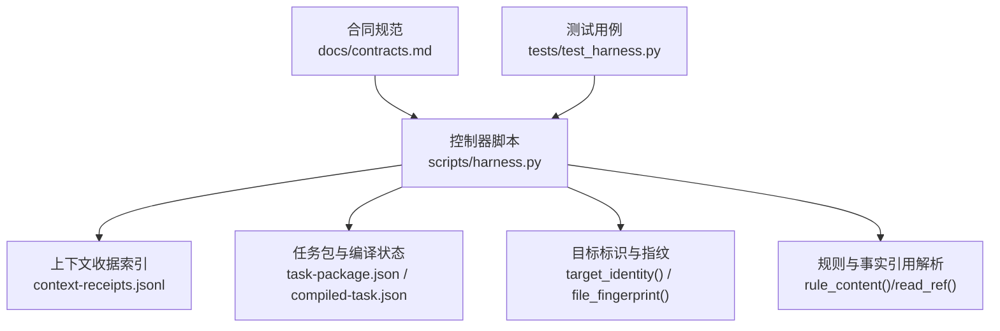
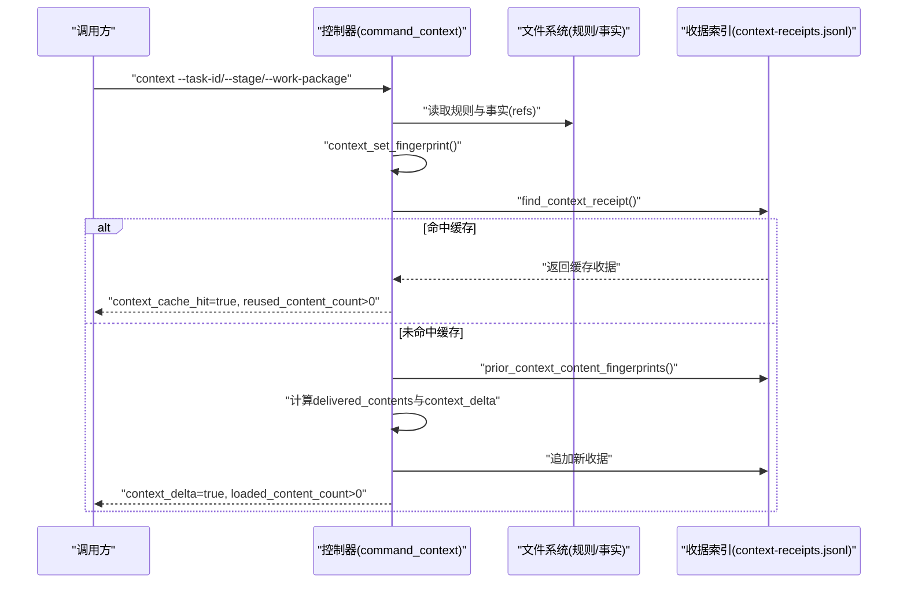
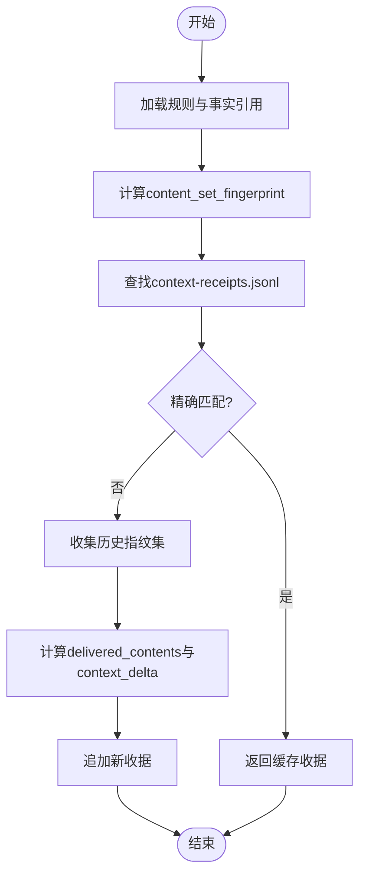
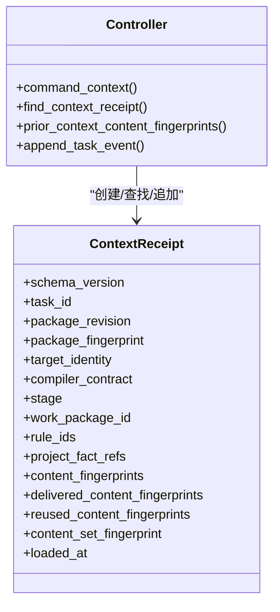
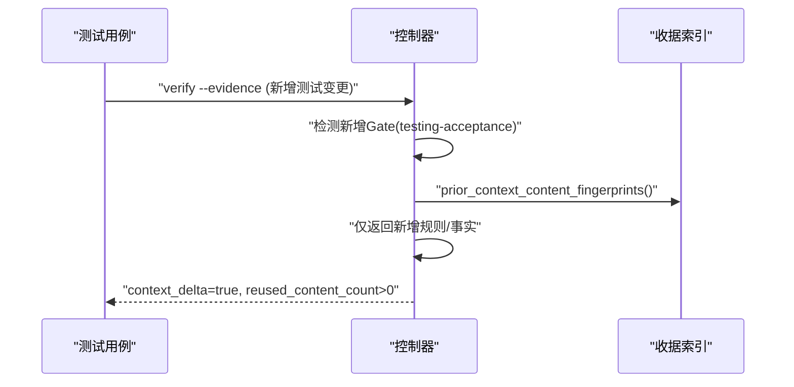
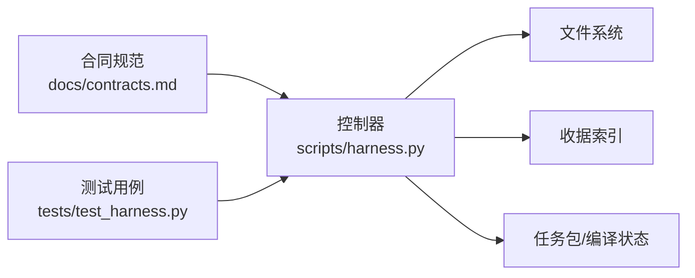

# 上下文去重机制

<cite>
**本文引用的文件**   
- [scripts/harness.py](file://scripts/harness.py)
- [docs/contracts.md](file://docs/contracts.md)
- [tests/test_harness.py](file://tests/test_harness.py)
</cite>

## 目录
1. [引言](#引言)
2. [项目结构](#项目结构)
3. [核心组件](#核心组件)
4. [架构总览](#架构总览)
5. [详细组件分析](#详细组件分析)
6. [依赖关系分析](#依赖关系分析)
7. [性能考量](#性能考量)
8. [故障排查指南](#故障排查指南)
9. [结论](#结论)
10. [附录](#附录)

## 引言
本文件系统化阐述 Docs Harness 的上下文去重机制，重点覆盖：
- content-delivery receipt（正文交付证明）与 stage acknowledgement receipt（阶段确认证明）的职责分离
- 跨阶段内容复用规则：task/target/compiler contract、content_set_fingerprint、stage 差异处理与 context_delta 标记
- 安全与测试 Gate 场景下的增量上下文返回策略：仅返回新增的安全规则、测试规则与文档文件
- 跨 task、跨 target 的复用禁止策略，确保隔离性与安全性
- 上下文调度示例与去重效果量化指标

## 项目结构
- 控制器实现位于 scripts/harness.py，包含上下文收据查找、指纹计算、增量加载与事件记录等核心逻辑
- 合同定义位于 docs/contracts.md，明确 context-receipt/v2 的复用条件与字段语义
- 行为验证位于 tests/test_harness.py，覆盖增量上下文、Gate 触发与去重统计等用例

**图表来源** 
- [scripts/harness.py:4180-4379](file://scripts/harness.py#L4180-L4379)
- [docs/contracts.md:222-235](file://docs/contracts.md#L222-L235)

**章节来源**
- [scripts/harness.py:4180-4379](file://scripts/harness.py#L4180-L4379)
- [docs/contracts.md:222-235](file://docs/contracts.md#L222-L235)
- [tests/test_harness.py:3752-3815](file://tests/test_harness.py#L3752-L3815)

## 核心组件
- 上下文收据（context-receipt/v2）：记录一次上下文加载或复用的完整元数据，包括 task_id、target_identity、compiler_contract、stage、work_package_id、rule_ids、project_fact_refs、content_fingerprints、delivered_content_fingerprints、reused_content_fingerprints、content_set_fingerprint、loaded_at
- 上下文集合指纹（content_set_fingerprint）：对 rule_ids 与 project_fact_refs 的内容进行排序与哈希，作为“同一份上下文”的全局判定键
- 阶段确认（stage acknowledgement）：通过 find_context_receipt 匹配 stage/work_package 维度，决定是否复用已有上下文
- 增量上下文（context_delta）：当存在历史指纹但无精确缓存命中时，仅返回新增内容并标记 context_delta=true

关键职责分离：
- content-delivery receipt：承载“已交付内容指纹”与“本次交付内容指纹”，用于跨阶段去重与增量判断
- stage acknowledgement receipt：承载“阶段级校验结果”（stage/work_package），用于控制下一步动作与是否需重新加载上下文

**章节来源**
- [scripts/harness.py:4213-4254](file://scripts/harness.py#L4213-L4254)
- [scripts/harness.py:4257-4277](file://scripts/harness.py#L4257-L4277)
- [scripts/harness.py:4297-4394](file://scripts/harness.py#L4297-L4394)
- [docs/contracts.md:222-235](file://docs/contracts.md#L222-L235)

## 架构总览
上下文去重的整体流程如下：
- 输入：task_id、target、stage/work_package、package、compiled
- 计算：context_set_fingerprint（规则+事实指纹集合）
- 查找：find_context_receipt（按 task/target/compiler/stage/work_package/content_set 精确匹配）
- 增量：prior_context_content_fingerprints（历史指纹集）→ delivered_contents（未命中历史指纹的新增内容）
- 输出：receipt（含 reused/delivered 指纹）、context_delta 标志、事件记录与 next_action

**图表来源** 
- [scripts/harness.py:4297-4394](file://scripts/harness.py#L4297-L4394)
- [scripts/harness.py:4213-4254](file://scripts/harness.py#L4213-L4254)
- [scripts/harness.py:4257-4277](file://scripts/harness.py#L4257-L4277)

## 详细组件分析

### 组件A：上下文收据与指纹计算
- context_set_fingerprint：将 rule_ids 与 project_fact_refs 解析为统一条目列表，排序后生成稳定哈希；同时返回各条目指纹序列
- rule_content/read_ref：分别解析规则正文与项目事实引用，保证指纹一致性
- find_context_receipt：严格匹配 schema_version、task_id、target_identity、compiler_contract、stage/work_package、content_set_fingerprint

**图表来源** 
- [scripts/harness.py:4196-4211](file://scripts/harness.py#L4196-L4211)
- [scripts/harness.py:4213-4254](file://scripts/harness.py#L4213-L4254)
- [scripts/harness.py:4257-4277](file://scripts/harness.py#L4257-L4277)

**章节来源**
- [scripts/harness.py:4180-4211](file://scripts/harness.py#L4180-L4211)
- [scripts/harness.py:4213-4254](file://scripts/harness.py#L4213-L4254)
- [scripts/harness.py:4257-4277](file://scripts/harness.py#L4257-L4277)

### 组件B：阶段确认与增量上下文
- stage acknowledgement：通过 stage/work_package 维度限定收据匹配范围，避免跨阶段误用
- context_delta：当存在历史指纹但无精确缓存命中时，仅返回新增内容，减少冗余传输
- 事件记录：context_reused/context_loaded/context_delta_loaded 三类事件，附带 reason_code 与统计字段

**图表来源** 
- [scripts/harness.py:4297-4394](file://scripts/harness.py#L4297-L4394)
- [scripts/harness.py:4213-4254](file://scripts/harness.py#L4213-L4254)

**章节来源**
- [scripts/harness.py:4297-4394](file://scripts/harness.py#L4297-L4394)
- [scripts/harness.py:4213-4254](file://scripts/harness.py#L4213-L4254)

### 组件C：安全与测试Gate的增量上下文返回
- 当 verify 发现新增 Gate（如 testing-acceptance、security-sensitive）时，controller 会要求增量上下文
- 增量上下文仅返回新增的规则与事实（例如 DH-TESTING-RELEASE、DH-EXTERNAL-INPUT-SECURITY），不重复加载已存在内容
- 测试用例验证了 reused_content_count>0、loaded_content_count>0、delta_refs 与 initial_refs 不相交

**图表来源** 
- [tests/test_harness.py:3752-3815](file://tests/test_harness.py#L3752-L3815)
- [scripts/harness.py:4257-4277](file://scripts/harness.py#L4257-L4277)

**章节来源**
- [tests/test_harness.py:3752-3815](file://tests/test_harness.py#L3752-L3815)
- [scripts/harness.py:4257-4277](file://scripts/harness.py#L4257-L4277)

### 组件D：跨task/target复用禁止策略
- 收据匹配强制要求 task_id、target_identity、compiler_contract 完全一致
- 任何一项不同即视为不同上下文，必须重新加载
- 该策略确保隔离性，防止跨任务/目标的上下文污染

**章节来源**
- [scripts/harness.py:4213-4254](file://scripts/harness.py#L4213-L4254)
- [docs/contracts.md:222-235](file://docs/contracts.md#L222-L235)

## 依赖关系分析
- 控制器依赖文件系统（规则/事实）、收据索引（context-receipts.jsonl）、任务包与编译状态
- 合同规范约束收据结构与复用条件
- 测试用例驱动行为验证与边界覆盖

**图表来源** 
- [docs/contracts.md:222-235](file://docs/contracts.md#L222-L235)
- [scripts/harness.py:4297-4394](file://scripts/harness.py#L4297-L4394)

**章节来源**
- [docs/contracts.md:222-235](file://docs/contracts.md#L222-L235)
- [scripts/harness.py:4297-4394](file://scripts/harness.py#L4297-L4394)

## 性能考量
- 指纹计算：context_set_fingerprint 使用排序+哈希，时间复杂度 O(n log n)，n 为规则+事实数量
- 收据查找：线性扫描 context-receipts.jsonl，可通过索引优化（当前实现为简单扫描）
- 增量加载：prior_context_content_fingerprints 构建指纹集合，后续过滤为 O(m)
- 事件记录：append_task_event 追加写入，避免阻塞主流程

[本节为通用指导，无需特定文件来源]

## 故障排查指南
- 常见错误码：invalid_rule_ref、stale_rule、missing_rule、invalid_context_stage、missing_work_package
- 调试步骤：
  - 检查 context-receipts.jsonl 是否存在对应 stage/work_package 的收据
  - 验证 content_set_fingerprint 是否与预期一致
  - 查看 prior_context_content_fingerprints 是否正确收集历史指纹
  - 确认 rule_content/read_ref 是否能正确解析规则与事实

**章节来源**
- [scripts/harness.py:4180-4211](file://scripts/harness.py#L4180-L4211)
- [scripts/harness.py:4297-4394](file://scripts/harness.py#L4297-L4394)

## 结论
Docs Harness 的上下文去重机制通过严格的指纹匹配与阶段隔离，实现了高效、安全的上下文复用。content-delivery receipt 与 stage acknowledgement receipt 的职责分离确保了跨阶段内容的正确复用与增量加载。在安全与测试 Gate 场景下，系统能够精准返回新增内容，避免冗余传输。跨 task/target 的复用禁止策略保障了系统的隔离性与安全性。

[本节为总结性内容，无需特定文件来源]

## 附录
- 上下文调度示例：见 tests/test_harness.py 中的 test_incremental_gate_context_returns_only_new_content
- 去重效果量化指标：context_cache_hit、context_delta、loaded_content_count、reused_content_count

**章节来源**
- [tests/test_harness.py:3752-3815](file://tests/test_harness.py#L3752-L3815)
- [scripts/harness.py:4297-4394](file://scripts/harness.py#L4297-L4394)