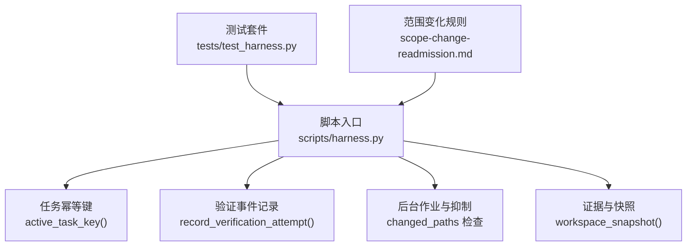
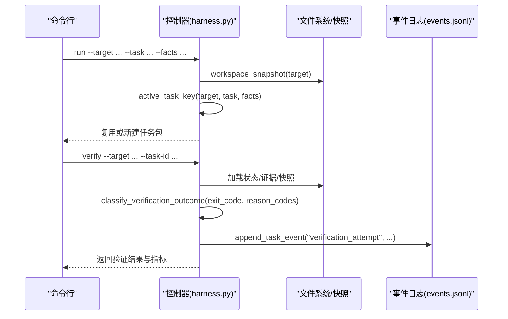
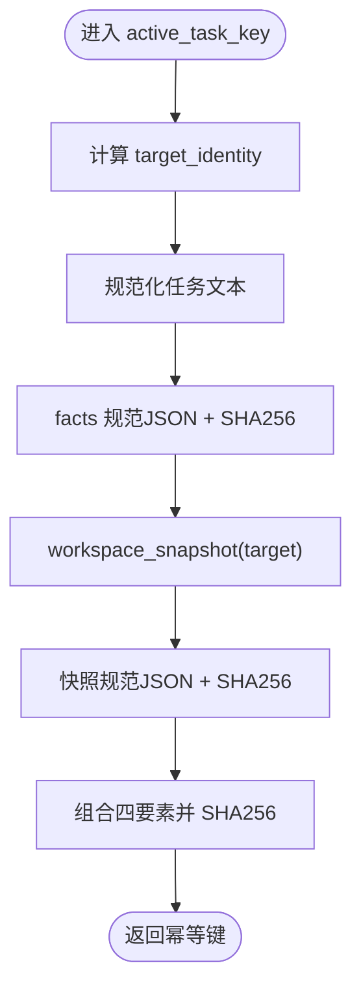
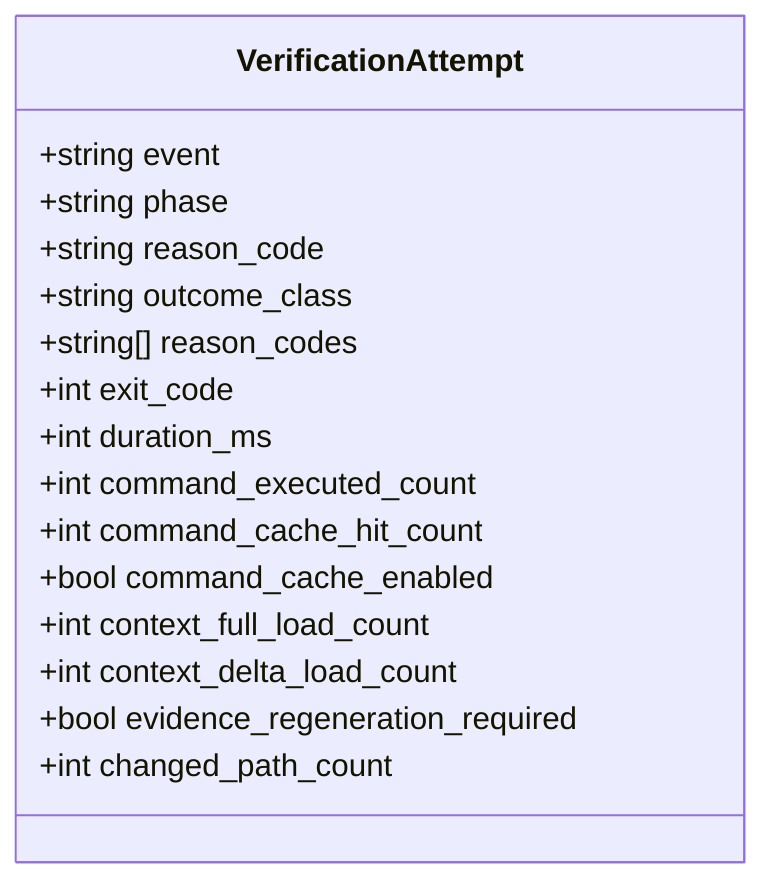
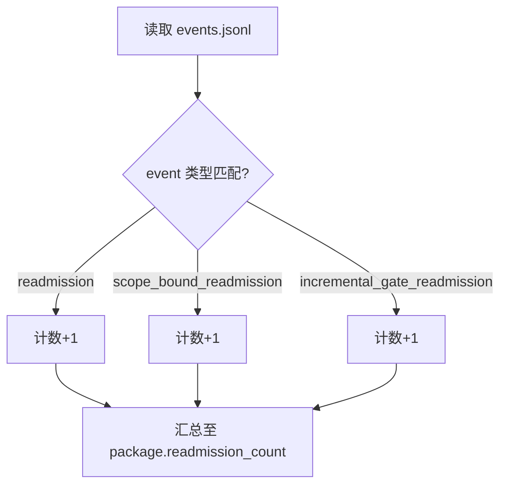
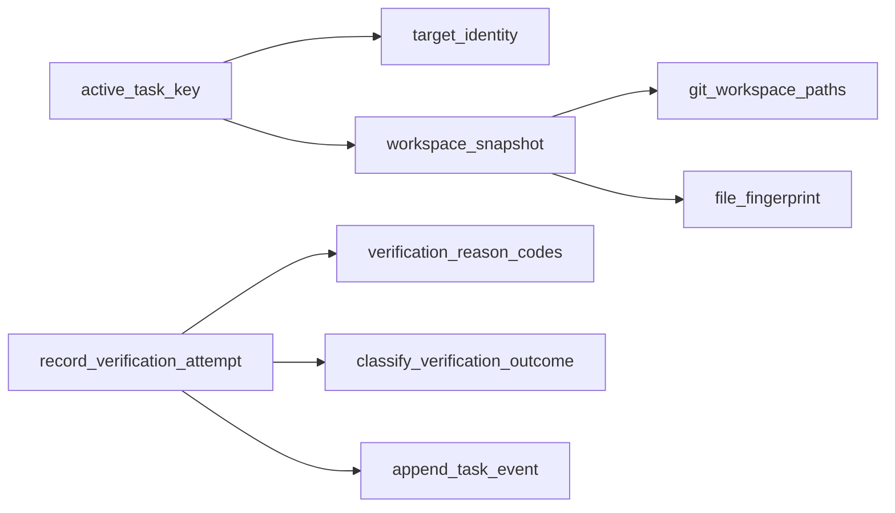

# 任务幂等性与监控

<cite>
**本文引用的文件**   
- [harness.py](file://scripts/harness.py)
- [test_harness.py](file://tests/test_harness.py)
- [scope-change-readmission.md](file://harness-home/rules/scope-change-readmission.md)
</cite>

## 目录
1. [简介](#简介)
2. [项目结构](#项目结构)
3. [核心组件](#核心组件)
4. [架构总览](#架构总览)
5. [详细组件分析](#详细组件分析)
6. [依赖关系分析](#依赖关系分析)
7. [性能考量](#性能考量)
8. [故障排查指南](#故障排查指南)
9. [结论](#结论)
10. [附录：监控指标定义](#附录监控指标定义)

## 简介
本文件面向 Docs Harness 的任务幂等性与监控系统，聚焦以下目标：
- 明确 active_task_key 的计算方法及其对幂等的保障作用。
- 阐述 verify 尝试的事件记录机制（verification_attempt）、outcome_class 分类与 reason_codes 统计。
- 解释 readmission_count 的分类统计规则（readmission、scope_bound_readmission、incremental_gate_readmission）。
- 说明 changed_paths=[] 时后台 Job 的抑制机制与 change-scoped 工作负载的去重策略。
- 提供完整的监控指标定义与故障排查指引。

## 项目结构
- scripts/harness.py：控制器主实现，包含任务幂等键计算、验证事件记录、后台作业与证据处理等核心逻辑。
- tests/test_harness.py：覆盖关键行为与契约的测试用例，用于验证监控事件与计数。
- harness-home/rules/scope-change-readmission.md：范围变化重新准入规则，驱动 scope-bound 再准入流程。

**图表来源** 
- [harness.py:3923-3934](file://scripts/harness.py#L3923-L3934)
- [harness.py:6410-6446](file://scripts/harness.py#L6410-L6446)
- [harness.py:1115-1138](file://scripts/harness.py#L1115-L1138)
- [test_harness.py:1147-1151](file://tests/test_harness.py#L1147-L1151)
- [scope-change-readmission.md:1-29](file://harness-home/rules/scope-change-readmission.md#L1-L29)

**章节来源**
- [harness.py:3923-3934](file://scripts/harness.py#L3923-L3934)
- [harness.py:6410-6446](file://scripts/harness.py#L6410-L6446)
- [harness.py:1115-1138](file://scripts/harness.py#L1115-L1138)
- [test_harness.py:1147-1151](file://tests/test_harness.py#L1147-L1151)
- [scope-change-readmission.md:1-29](file://harness-home/rules/scope-change-readmission.md#L1-L29)

## 核心组件
- 活动任务幂等键 active_task_key：基于 target_identity、任务文本规范化、facts 指纹与初始工作区快照指纹组合生成，确保相同上下文返回同一任务实例。
- 验证事件记录 record_verification_attempt：每次 verify 入口写入有界遥测事件，包含 outcome_class、reason_codes 及多项性能指标。
- 工作区快照 workspace_snapshot：按 Git 或回退策略生成稳定快照，用于幂等键与变更检测。
- 后台作业抑制：当 changed_paths 为空时抑制不必要的后台 Job 触发，避免无意义执行。
- readmission_count 统计：对 readmission、scope_bound_readmission、incremental_gate_readmission 三类事件进行计数汇总。

**章节来源**
- [harness.py:3923-3934](file://scripts/harness.py#L3923-L3934)
- [harness.py:6410-6446](file://scripts/harness.py#L6410-L6446)
- [harness.py:1115-1138](file://scripts/harness.py#L1115-L1138)
- [harness.py:1058-1061](file://scripts/harness.py#L1058-L1061)

## 架构总览
下图展示任务从运行到验证的关键路径，以及幂等键与事件记录的交互。

**图表来源** 
- [harness.py:3923-3934](file://scripts/harness.py#L3923-L3934)
- [harness.py:6410-6446](file://scripts/harness.py#L6410-L6446)
- [harness.py:1115-1138](file://scripts/harness.py#L1115-L1138)

## 详细组件分析

### 活动任务幂等键 active_task_key
- 输入：target（项目根路径）、task（任务文本）、facts（事实对象）
- 组成：
  - target_identity：通过 Git 远端指纹或本地路径哈希生成唯一标识
  - normalize_task_text(task)：任务文本规范化（去空白、统一格式）
  - facts_fingerprint：facts 对象的规范 JSON 化后 SHA256
  - workspace_snapshot_fingerprint：初始工作区快照的规范 JSON 化后 SHA256
- 输出：SHA256 字符串作为幂等键，用于查找可复用的任务实例
- 复用策略：find_existing_active_task 会跳过终态与 blocked 任务，避免陈旧阻断原因复用

**图表来源** 
- [harness.py:3923-3934](file://scripts/harness.py#L3923-L3934)
- [harness.py:1115-1138](file://scripts/harness.py#L1115-L1138)

**章节来源**
- [harness.py:3923-3934](file://scripts/harness.py#L3923-L3934)
- [harness.py:1115-1138](file://scripts/harness.py#L1115-L1138)

### 验证尝试事件记录 verification_attempt
- 触发点：command_verify 调用 verify_task，无论成功或异常均记录
- 事件字段：
  - event: "verification_attempt"
  - phase: "verification"
  - reason_code: 首个受控原因码（如 complete、verification_incomplete、plan_contract_drift 等）
  - outcome_class: 分类结果（complete、full_readmission、incremental_admission、retry_verification、refresh_evidence、provide_evidence）
  - reason_codes: 完整原因码列表（最多限制）
  - exit_code: 退出码
  - duration_ms: 耗时毫秒
  - command_executed_count / command_cache_hit_count / command_cache_enabled: 命令执行与缓存指标
  - context_full_load_count / context_delta_load_count: 上下文加载次数
  - evidence_regeneration_required: 是否需要重新生成证据
  - changed_path_count: 变更路径数量
- 分类依据：classify_verification_outcome 根据 exit_code 与 reason_codes 集合判定 outcome_class

**图表来源** 
- [harness.py:6410-6446](file://scripts/harness.py#L6410-L6446)
- [harness.py:6382-6394](file://scripts/harness.py#L6382-L6394)

**章节来源**
- [harness.py:6410-6446](file://scripts/harness.py#L6410-L6446)
- [harness.py:6382-6394](file://scripts/harness.py#L6382-L6394)

### readmission_count 分类统计
- 统计来源：events.jsonl 中 event 为 readmission、scope_bound_readmission、incremental_gate_readmission 的事件总数
- 用途：在任务包元数据中暴露 readmission_count，便于上层系统观察再准入频率与类型分布
- 触发场景：
  - scope_bound_readmission：范围变化触发的再准入（见范围变化规则）
  - incremental_gate_readmission：增量 Gate 上下文要求触发的再准入
  - readmission：通用再准入事件

**图表来源** 
- [harness.py:1058-1061](file://scripts/harness.py#L1058-L1061)

**章节来源**
- [harness.py:1058-1061](file://scripts/harness.py#L1058-L1061)
- [scope-change-readmission.md:1-29](file://harness-home/rules/scope-change-readmission.md#L1-L29)

### changed_paths=[] 的后台 Job 抑制机制
- 机制：当证据或验证产生的 changed_paths 为空时，抑制后台 Job 的创建或调度，避免无变更的无效执行
- 目的：减少资源浪费与噪声事件，提升系统效率
- 关联逻辑：在证据处理与验证流程中检查 changed_paths，若为空则跳过后续 Job 准备步骤

**章节来源**
- [harness.py:5203-5240](file://scripts/harness.py#L5203-L5240)
- [harness.py:6410-6446](file://scripts/harness.py#L6410-L6446)

### change-scoped 工作负载的去重策略
- 策略：基于 active_task_key 与 workspace_snapshot_fingerprint 的组合，确保相同变更范围与上下文只生成一个工作负载
- 效果：避免重复任务、重复证据收集与重复验证，提高吞吐与一致性

**章节来源**
- [harness.py:3923-3934](file://scripts/harness.py#L3923-L3934)
- [harness.py:1115-1138](file://scripts/harness.py#L1115-L1138)

## 依赖关系分析
- 模块内依赖：
  - active_task_key 依赖 target_identity、normalize_task_text、workspace_snapshot
  - record_verification_attempt 依赖 verification_reason_codes、classify_verification_outcome、append_task_event
  - workspace_snapshot 依赖 git_workspace_paths、file_fingerprint、excluded_workspace_path
- 外部依赖：
  - Git 命令（git_command）用于远端信息与快照
  - 文件系统 I/O（读写 JSON/JSONL、原子写入）
  - 时间与时区（utc_now）

**图表来源** 
- [harness.py:3923-3934](file://scripts/harness.py#L3923-L3934)
- [harness.py:6410-6446](file://scripts/harness.py#L6410-L6446)
- [harness.py:1115-1138](file://scripts/harness.py#L1115-L1138)

**章节来源**
- [harness.py:3923-3934](file://scripts/harness.py#L3923-L3934)
- [harness.py:6410-6446](file://scripts/harness.py#L6410-L6446)
- [harness.py:1115-1138](file://scripts/harness.py#L1115-L1138)

## 性能考量
- 快照大小控制：workspace_snapshot 对大文件使用 size:mtime 摘要，避免内容哈希开销；非 Git 工作区限制文件数量上限
- 事件写入优化：append_task_event 使用追加模式与 fsync，保证持久性同时降低锁竞争
- 命令缓存：command_cache_enabled 默认开启，减少重复命令执行开销
- 上下文加载计数：context_full_load_count 与 context_delta_load_count 帮助识别上下文加载热点

**章节来源**
- [harness.py:1115-1138](file://scripts/harness.py#L1115-L1138)
- [harness.py:6410-6446](file://scripts/harness.py#L6410-L6446)

## 故障排查指南
- 常见错误码与含义：
  - invalid_task_id：task-id 格式无效
  - missing_file：缺少必需文件
  - invalid_json：JSON 解析失败
  - workspace_snapshot_truncated：非 Git 快照文件过多被截断
  - plan_contract_drift：计划合同漂移导致重新准入
  - authorization_contract_drift：授权合同漂移导致重新准入
  - action_context_missing：执行阶段上下文缺失
  - work_package_incomplete：工作包未完成
- 排查步骤：
  1. 检查 events.jsonl 中的 verification_attempt 事件，关注 reason_code 与 outcome_class
  2. 确认 active_task_key 是否因 workspace_snapshot 或 facts 变化而改变
  3. 验证 Git 预检与后检（git_preflight_contract、git_postcheck）是否通过
  4. 检查证据收据（evidence-receipt/v2）绑定是否正确（task_id、package_fingerprint、target_identity）
  5. 查看 readmission_count 增长原因，定位 scope_bound_readmission 或 incremental_gate_readmission 触发点

**章节来源**
- [harness.py:6410-6446](file://scripts/harness.py#L6410-L6446)
- [harness.py:6468-6549](file://scripts/harness.py#L6468-L6549)
- [test_harness.py:1147-1151](file://tests/test_harness.py#L1147-L1151)

## 结论
Docs Harness 通过 active_task_key 实现任务级幂等，结合 workspace_snapshot 与 facts 指纹确保上下文一致性。verify 流程的 verification_attempt 事件提供丰富的监控指标与分类，支持精细化故障定位与性能优化。readmission_count 的分类统计与 changed_paths 抑制机制共同保障了系统的稳定性与效率。建议在生产环境中持续监控这些指标，并结合范围变化规则进行动态治理。

## 附录：监控指标定义
- verification_attempt 事件字段：
  - event: "verification_attempt"
  - phase: "verification"
  - reason_code: 首个原因码（字符串）
  - outcome_class: 分类（complete/full_readmission/incremental_admission/retry_verification/refresh_evidence/provide_evidence）
  - reason_codes: 原因码数组（最多限制）
  - exit_code: 整数退出码
  - duration_ms: 耗时毫秒
  - command_executed_count: 命令执行次数
  - command_cache_hit_count: 命令缓存命中次数
  - command_cache_enabled: 命令缓存开关
  - context_full_load_count: 全量上下文加载次数
  - context_delta_load_count: 增量上下文加载次数
  - evidence_regeneration_required: 是否需要重新生成证据
  - changed_path_count: 变更路径数量
- readmission_count 统计：
  - 统计 events.jsonl 中 readmission、scope_bound_readmission、incremental_gate_readmission 事件总数
  - 暴露于任务包元数据，供上层系统消费

**章节来源**
- [harness.py:6410-6446](file://scripts/harness.py#L6410-L6446)
- [harness.py:1058-1061](file://scripts/harness.py#L1058-L1061)
- [test_harness.py:1147-1151](file://tests/test_harness.py#L1147-L1151)