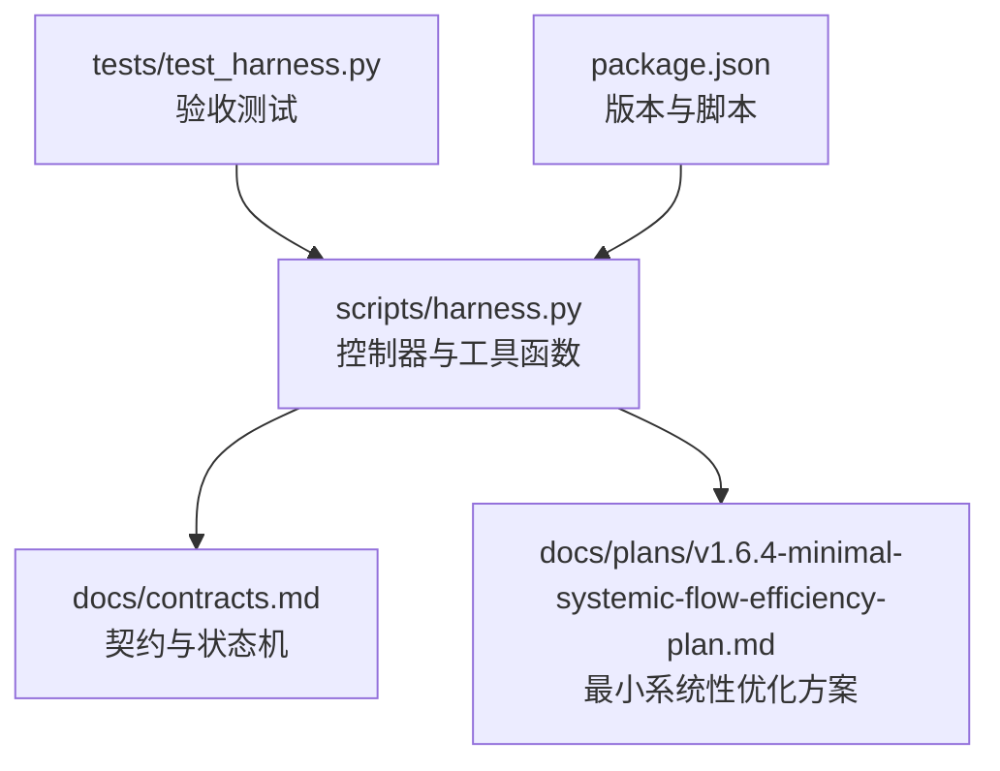
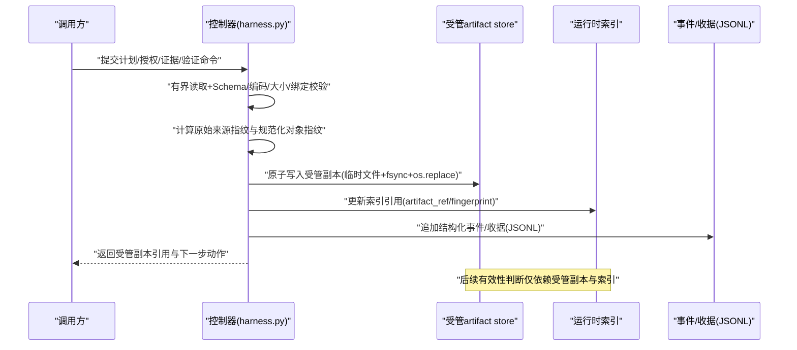
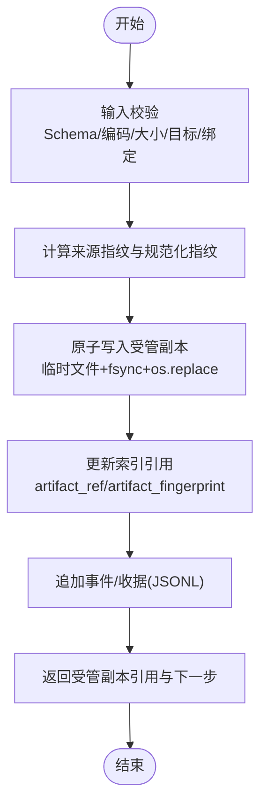
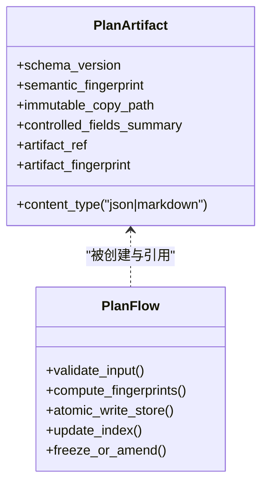
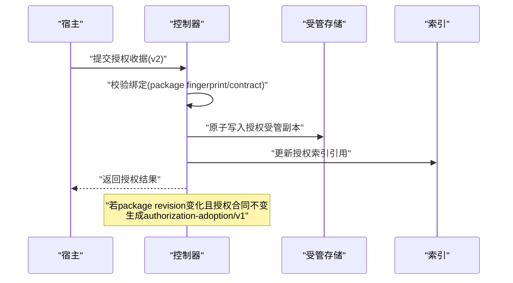
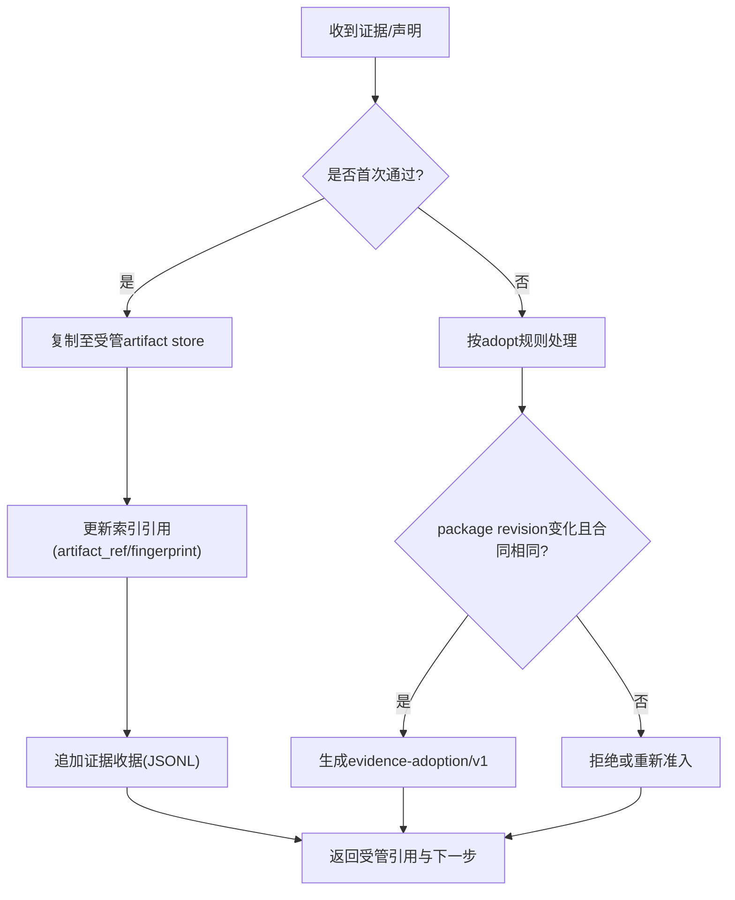
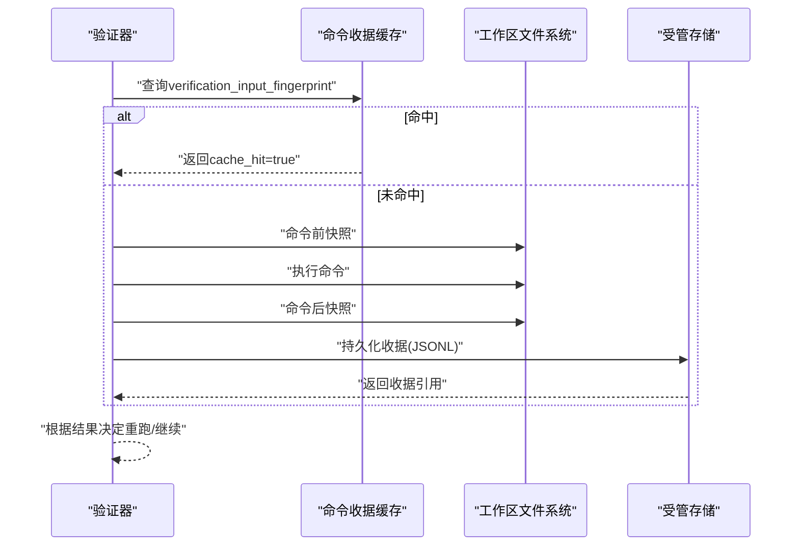
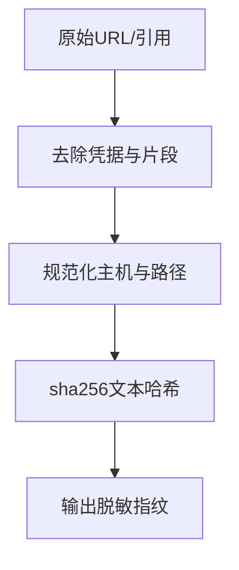
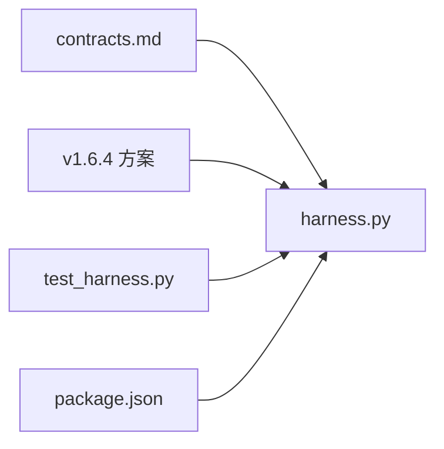

# 受管工件摄取

<cite>
**本文引用的文件**
- [harness.py](file://scripts/harness.py)
- [contracts.md](file://docs/contracts.md)
- [v1.6.4-minimal-systemic-flow-efficiency-plan.md](file://docs/plans/v1.6.4-minimal-systemic-flow-efficiency-plan.md)
- [test_harness.py](file://tests/test_harness.py)
- [package.json](file://package.json)
</cite>

## 目录
1. [简介](#简介)
2. [项目结构](#项目结构)
3. [核心组件](#核心组件)
4. [架构总览](#架构总览)
5. [详细组件分析](#详细组件分析)
6. [依赖关系分析](#依赖关系分析)
7. [性能考量](#性能考量)
8. [故障排查指南](#故障排查指南)
9. [结论](#结论)
10. [附录](#附录)

## 简介
本文件面向 Docs Harness 的“受管工件摄取系统”，聚焦统一 artifact store 的设计与实现，涵盖 plans/authorizations/evidence/verification 四类目录结构与原子写入流程；阐述计划、授权、证据三类工件的摄取规范（JSON canonical 格式、Markdown 不可变副本、source_ref 脱敏记录）；解释 authorization adoption 与 evidence adoption 机制（含 package revision 兼容继承、adoption 记录格式与追溯信息保存）；说明调用者临时文件删除后的工件有效性保证，以及受管副本的索引引用机制；并提供完整的摄取流程图与错误恢复策略示例。

## 项目结构
- 控制器主程序位于 scripts/harness.py，包含统一的原子写入、指纹计算、artifact store 存取、事件追加等能力。
- 合同与方案文档位于 docs/contracts.md 与 docs/plans/v1.6.4-minimal-systemic-flow-efficiency-plan.md，定义任务包、证据收据、验证命令、Git 状态、Runtime 位置、退出码等契约。
- 测试用例位于 tests/test_harness.py，覆盖 run/verify 行为、Git 预检/后检、权限与范围、证据与上下文复用等。
- 元数据与打包清单位于 package.json，声明版本与脚本入口。

**图表来源**
- [harness.py:4022-4052](file://scripts/harness.py#L4022-L4052)
- [contracts.md:165-221](file://docs/contracts.md#L165-L221)
- [v1.6.4-minimal-systemic-flow-efficiency-plan.md:221-260](file://docs/plans/v1.6.4-minimal-systemic-flow-efficiency-plan.md#L221-L260)
- [test_harness.py:236-337](file://tests/test_harness.py#L236-L337)
- [package.json:1-23](file://package.json#L1-L23)

**章节来源**
- [harness.py:4022-4052](file://scripts/harness.py#L4022-L4052)
- [contracts.md:165-221](file://docs/contracts.md#L165-L221)
- [v1.6.4-minimal-systemic-flow-efficiency-plan.md:221-260](file://docs/plans/v1.6.4-minimal-systemic-flow-efficiency-plan.md#L221-L260)
- [test_harness.py:236-337](file://tests/test_harness.py#L236-L337)
- [package.json:1-23](file://package.json#L1-L23)

## 核心组件
- 统一 artifact store：在任务 Runtime 下提供 plans/authorizations/evidence/verification 四个子目录，用于持久化受管副本与索引。
- 原子写入：atomic_write_text/atomic_write_json 使用临时文件 + fsync + os.replace 确保幂等与一致性。
- 规范化与指纹：canonical_json、sha256_text、file_fingerprint 用于生成稳定语义指纹与内容指纹。
- 事件与收据：append_jsonl/read_jsonl 用于追加与读取 JSONL 事件/收据；evidence-receipt v2、authorization-receipt v2、verification-command-receipt v1 等由控制器生成并落盘。
- 目标与路径安全：safe_target、git_preflight_contract/git_postcheck 保障 Git 操作边界与安全。

**章节来源**
- [harness.py:406-447](file://scripts/harness.py#L406-L447)
- [harness.py:510-532](file://scripts/harness.py#L510-L532)
- [harness.py:535-541](file://scripts/harness.py#L535-L541)
- [harness.py:680-794](file://scripts/harness.py#L680-L794)

## 架构总览
下图展示受管工件摄取的端到端流程：从输入校验、规范化与指纹计算，到原子写入受管 artifact store，再到索引引用与后续有效性判断。

**图表来源**
- [harness.py:422-437](file://scripts/harness.py#L422-L437)
- [harness.py:406-420](file://scripts/harness.py#L406-L420)
- [harness.py:510-532](file://scripts/harness.py#L510-L532)
- [v1.6.4-minimal-systemic-flow-efficiency-plan.md:221-260](file://docs/plans/v1.6.4-minimal-systemic-flow-efficiency-plan.md#L221-L260)

## 详细组件分析

### 统一 artifact store 设计
- 目录结构：<task-state>/artifacts/{plans, authorizations, evidence, verification}
- 写入约束：所有文件型输入先完成 Schema、编码、大小、目标与任务绑定校验；计算原始来源指纹与规范化对象指纹；原子写入受管副本；索引引用受管副本；后续有效性判断不依赖调用者临时文件。
- 计划：JSON 计划使用 canonical JSON 计算语义指纹；Markdown 计划保存不可变字节副本，并额外记录解析后的受控字段摘要。
- 授权：新授权收据绑定 package fingerprint 与 authorization_contract_fingerprint；package revision 变化但授权合同完全相同时可生成 authorization-adoption/v1 引用原授权与新 package。
- 证据：首次 verify --evidence 通过后立即摄取到 Runtime；package revision 兼容继承使用 evidence-adoption/v1 包装记录；删除调用者临时证据文件不得使已摄取证据失效。
- 验证：verification/command-receipts.jsonl 逐项持久化验证命令收据，支持输入指纹缓存与增量重跑。

**图表来源**
- [v1.6.4-minimal-systemic-flow-efficiency-plan.md:221-260](file://docs/plans/v1.6.4-minimal-systemic-flow-efficiency-plan.md#L221-L260)
- [harness.py:422-437](file://scripts/harness.py#L422-L437)
- [harness.py:510-532](file://scripts/harness.py#L510-L532)

**章节来源**
- [v1.6.4-minimal-systemic-flow-efficiency-plan.md:221-260](file://docs/plans/v1.6.4-minimal-systemic-flow-efficiency-plan.md#L221-L260)
- [contracts.md:165-221](file://docs/contracts.md#L165-L221)
- [harness.py:4022-4052](file://scripts/harness.py#L4022-L4052)

### 计划工件摄取规范
- JSON 计划：以 canonical JSON 计算语义指纹，确保跨平台一致性与去空白差异。
- Markdown 计划：保存不可变字节副本，并记录解析后的受控字段摘要，避免正文漂移影响语义。
- 冻结与补丁：正式计划一次冻结；若只缺新增字段，返回 complete_plan_delta，宿主仅需补充缺失字段，不重做完整方案。
- 受管副本：冻结后引用受管副本；调用者后续修改原文件不自动改变已冻结计划。

**图表来源**
- [harness.py:406-420](file://scripts/harness.py#L406-L420)
- [harness.py:4022-4052](file://scripts/harness.py#L4022-L4052)
- [v1.6.4-minimal-systemic-flow-efficiency-plan.md:241-246](file://docs/plans/v1.6.4-minimal-systemic-flow-efficiency-plan.md#L241-L246)

**章节来源**
- [v1.6.4-minimal-systemic-flow-efficiency-plan.md:241-246](file://docs/plans/v1.6.4-minimal-systemic-flow-efficiency-plan.md#L241-L246)
- [contracts.md:63-81](file://docs/contracts.md#L63-L81)

### 授权工件摄取与 Adoption 机制
- 授权收据：始终绑定当前 package fingerprint，不按内容集合跨修订复用。
- Adoption：当 package revision 变化但授权合同完全相同时，控制器生成 authorization-adoption/v1，引用原授权、原 package 与新 package，禁止直接篡改旧 package fingerprint。
- 变更限制：任一授权动作、授权范围、Git scope、外部目标或有效期变化时禁止继承，必须重新准入。

**图表来源**
- [contracts.md:222-234](file://docs/contracts.md#L222-L234)
- [v1.6.4-minimal-systemic-flow-efficiency-plan.md:247-253](file://docs/plans/v1.6.4-minimal-systemic-flow-efficiency-plan.md#L247-L253)
- [harness.py:5052-5060](file://scripts/harness.py#L5052-L5060)

**章节来源**
- [contracts.md:222-234](file://docs/contracts.md#L222-L234)
- [v1.6.4-minimal-systemic-flow-efficiency-plan.md:247-253](file://docs/plans/v1.6.4-minimal-systemic-flow-efficiency-plan.md#L247-L253)

### 证据工件摄取与 Adoption 机制
- 首次通过即摄取：首次 verify --evidence 校验通过后立即复制到受管 artifact store。
- Adoption：package revision 兼容继承使用 evidence-adoption/v1 包装记录，保留原 package、新 package、contract delta、原证据 ID、来源指纹和采用原因。
- 有效性保证：删除调用者临时证据文件不得使已摄取证据失效；收据保留 artifact_ref 指回副本。
- 简化声明：支持 evidence-declaration/v1 草案，控制器代铸必要字段并按 v2 同等校验、索引与保存受管副本。

**图表来源**
- [contracts.md:165-221](file://docs/contracts.md#L165-L221)
- [v1.6.4-minimal-systemic-flow-efficiency-plan.md:254-259](file://docs/plans/v1.6.4-minimal-systemic-flow-efficiency-plan.md#L254-L259)
- [harness.py:6723-6730](file://scripts/harness.py#L6723-L6730)

**章节来源**
- [contracts.md:165-221](file://docs/contracts.md#L165-L221)
- [v1.6.4-minimal-systemic-flow-efficiency-plan.md:254-259](file://docs/plans/v1.6.4-minimal-systemic-flow-efficiency-plan.md#L254-L259)

### 验证命令收据与复用
- 逐项执行：每条验证命令独立执行，计算 verification_input_fingerprint，查找可复用通过收据，命中则跳过执行。
- 快照与分类：未命中则命令前快照 → 执行 → 命令后快照 → 分类写入 → 持久化收据。
- 重跑规则：失败或输入变化的命令才重跑；已通过命令不因补证而重复执行。
- 配置开关：verification.command_cache_enabled=false 可整体关闭复用。

**图表来源**
- [contracts.md:190-221](file://docs/contracts.md#L190-L221)
- [v1.6.4-minimal-systemic-flow-efficiency-plan.md:261-303](file://docs/plans/v1.6.4-minimal-systemic-flow-efficiency-plan.md#L261-L303)
- [harness.py:6081-6090](file://scripts/harness.py#L6081-L6090)

**章节来源**
- [contracts.md:190-221](file://docs/contracts.md#L190-L221)
- [v1.6.4-minimal-systemic-flow-efficiency-plan.md:261-303](file://docs/plans/v1.6.4-minimal-systemic-flow-efficiency-plan.md#L261-L303)

### source_ref 脱敏记录
- 远程 URL 脱敏：sanitized_remote_fingerprint 移除用户名、密码、token、查询参数与 fragment，仅保留主机与路径。
- 指纹计算：对脱敏后的值进行 sha256 文本哈希，避免泄露敏感信息。
- 用途：Git 远端身份、仓库标识、控制面指纹等场景均使用脱敏指纹。

**图表来源**
- [harness.py:588-598](file://scripts/harness.py#L588-L598)
- [contracts.md:123-124](file://docs/contracts.md#L123-L124)

**章节来源**
- [harness.py:588-598](file://scripts/harness.py#L588-L598)
- [contracts.md:123-124](file://docs/contracts.md#L123-L124)

## 依赖关系分析
- harness.py 依赖 contracts.md 定义的 schema 与状态机，遵循 v2 证据收据、授权收据、验证命令收据等契约。
- v1.6.4 方案文档定义了 artifact store 目录、摄取流程、adoption 机制与验证命令复用策略，作为实施依据。
- test_harness.py 通过真实 CLI 调用与子进程模拟，验证 run/verify/Git 预检/后检等行为是否符合契约。
- package.json 声明版本与脚本，确保安装与自检一致性。

**图表来源**
- [contracts.md:1-10](file://docs/contracts.md#L1-L10)
- [v1.6.4-minimal-systemic-flow-efficiency-plan.md:1-12](file://docs/plans/v1.6.4-minimal-systemic-flow-efficiency-plan.md#L1-L12)
- [test_harness.py:1-25](file://tests/test_harness.py#L1-L25)
- [package.json:1-23](file://package.json#L1-L23)

**章节来源**
- [contracts.md:1-10](file://docs/contracts.md#L1-L10)
- [v1.6.4-minimal-systemic-flow-efficiency-plan.md:1-12](file://docs/plans/v1.6.4-minimal-systemic-flow-efficiency-plan.md#L1-L12)
- [test_harness.py:1-25](file://tests/test_harness.py#L1-L25)
- [package.json:1-23](file://package.json#L1-L23)

## 性能考量
- 原子写入减少磁盘竞争与半写风险，提升可靠性。
- 规范化指纹与内容寻址避免重复加载与传输。
- 验证命令收据缓存降低昂贵命令重复执行成本。
- 分段指纹（scope/plan/context/verification）缩小失效边界，减少不必要重算。

[本节为通用指导，无需特定文件来源]

## 故障排查指南
- 常见错误码：
  - 2：输入、合同、绑定或状态无效
  - 3：需要方案、授权、证据（含 provide_evidence/refresh_evidence）、迁移、用户输入或 Git 交付
  - 4：范围、漂移、Gate、远端、授权或规则变化，必须重新准入
- 典型问题定位：
  - 证据过期或 read_set 漂移：返回 refresh_evidence，只失效引用漂移路径的证据后重读。
  - 验证命令失败：返回 retry_verification，仅重跑失败命令。
  - 远端漂移/ref 越界：返回 full_readmission，需完整重新准入。
  - 授权合同变化：禁止 adoption，需重新获取授权。
- 恢复策略：
  - 补证：provide_evidence，补充收据或自动归因。
  - 重试：retry_verification，针对网络/工具瞬时失败。
  - 增量准入：incremental_admission，仅加载新增上下文与 Gate。
  - 完整重新准入：full_readmission，重新走 run/plan/auth/evidence 全流程。

**章节来源**
- [contracts.md:361-372](file://docs/contracts.md#L361-L372)
- [v1.6.4-minimal-systemic-flow-efficiency-plan.md:304-328](file://docs/plans/v1.6.4-minimal-systemic-flow-efficiency-plan.md#L304-L328)

## 结论
Docs Harness 的受管工件摄取系统通过统一 artifact store、原子写入、规范化指纹与 adoption 机制，实现了计划、授权、证据与验证命令的稳定、可复用与可追溯管理。调用者临时文件删除不影响已采纳工件的有效性，索引引用机制确保后续判断基于受管副本。五级处置与结构化事件提升了错误恢复效率与可观测性。

[本节为总结，无需特定文件来源]

## 附录
- 关键实现路径参考：
  - 原子写入：[harness.py:422-437](file://scripts/harness.py#L422-L437)
  - 指纹计算：[harness.py:406-420](file://scripts/harness.py#L406-L420)
  - 事件追加：[harness.py:510-532](file://scripts/harness.py#L510-L532)
  - 受管存储存取：[harness.py:4022-4052](file://scripts/harness.py#L4022-L4052)
  - 验证命令收据：[harness.py:6081-6090](file://scripts/harness.py#L6081-L6090)
  - 证据摄取与 adoption：[harness.py:6723-6730](file://scripts/harness.py#L6723-L6730)
  - 授权 adoption：[harness.py:5052-5060](file://scripts/harness.py#L5052-L5060)
  - 脱敏指纹：[harness.py:588-598](file://scripts/harness.py#L588-L598)

**章节来源**
- [harness.py:422-437](file://scripts/harness.py#L422-L437)
- [harness.py:406-420](file://scripts/harness.py#L406-L420)
- [harness.py:510-532](file://scripts/harness.py#L510-L532)
- [harness.py:4022-4052](file://scripts/harness.py#L4022-L4052)
- [harness.py:6081-6090](file://scripts/harness.py#L6081-L6090)
- [harness.py:6723-6730](file://scripts/harness.py#L6723-L6730)
- [harness.py:5052-5060](file://scripts/harness.py#L5052-L5060)
- [harness.py:588-598](file://scripts/harness.py#L588-L598)